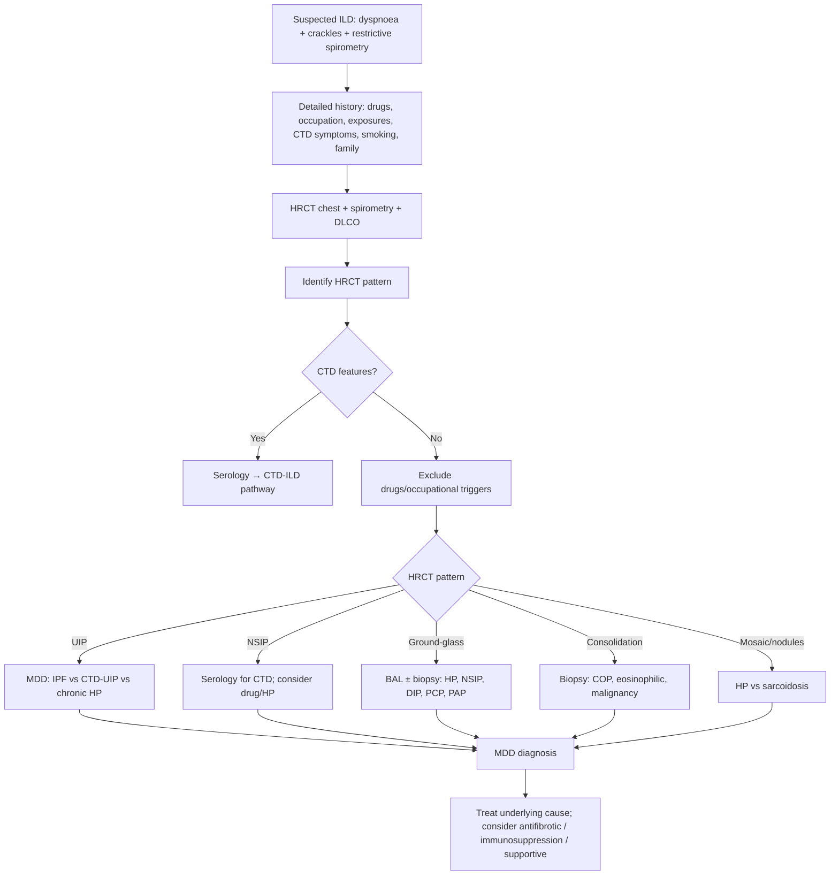

# Interstitial Lung Disease (ILD)

> [!important]
> **Interstitial lung diseases (ILDs)** are a **heterogeneous group of >200 parenchymal lung disorders** characterised by **inflammation and/or fibrosis of the pulmonary interstitium**, leading to **progressive dyspnoea, restrictive spirometry, ↓DLCO, and characteristic HRCT patterns**. Accurate diagnosis requires **multidisciplinary discussion (MDD)** between clinicians, radiologists, and pathologists.

Related: [[Respiratory Failure]], [[ABG Interpretation]], [[Spirometry Interpretation]], [[Oxygen Therapy and NIV]], [[Chest X-Ray Approach]], [[Interstitial and Diffuse Parenchymal Lung Diseases/Idiopathic pulmonary fibrosis|Idiopathic pulmonary fibrosis]]

> [!tip] **FCPS/MRCP pearl**: ILD ≠ "restrictive disease" alone. Always think **classification first** (known cause vs idiopathic, granulomatous vs non), then **HRCT pattern** (UIP vs NSIP vs ground-glass vs consolidation), then **MDD diagnosis**, then **specific treatment** (antifibrotic for IPF, steroids for sarcoid/HP, treat underlying CTD).

## 1. Learning Objectives
- Define ILD and list the major categories (>200 diseases).
- Recognise the typical clinical presentation (progressive dyspnoea, dry cough, velcro crackles).
- Apply a structured diagnostic approach (history, exam, spirometry, HRCT, BAL, biopsy, MDD).
- Identify and interpret the major HRCT patterns (UIP, NSIP, ground-glass, mosaic, consolidation).
- Distinguish the most common ILDs: IPF, sarcoidosis, HP, CTD-ILD, COP, eosinophilic, drug-induced, pneumoconioses.
- Treat the underlying disease (antifibrotics, immunosuppression, supportive care).
- Plan supportive management: O₂, pulmonary rehabilitation, vaccinations, transplant referral.

## 2. Definition

**Interstitial lung disease (ILD)** = a broad category of >200 parenchymal pulmonary disorders sharing:
- Involvement of the **interstitium** (alveolar walls, perivascular, perilymphatic tissue)
- Variable combinations of **inflammation** and **fibrosis**
- Common clinical pattern: **progressive exertional dyspnoea + dry cough**
- Common functional pattern: **restrictive spirometry** with **↓DLCO**
- Distinctive imaging on **HRCT**

Also called **diffuse parenchymal lung disease (DPLD)**.

## 3. Classification (ATS/ERS 2013)

### Four main groups
1. **ILD of known cause** — drugs, occupational/environmental, CTD, infection
2. **Idiopathic interstitial pneumonias (IIPs)** — IPF, NSIP, COP, DIP, RB-ILD, AIP, LIP, AFOP, PPFE
3. **Granulomatous ILD** — sarcoidosis, HP
4. **Other forms** — LAM, PLCH, PAP, eosinophilic pneumonia

### Most common ILDs in clinical practice
- **IPF** (idiopathic pulmonary fibrosis) — most common idiopathic ILD
- **Sarcoidosis** — most common granulomatous ILD
- **HP** (hypersensitivity pneumonitis) — bird fancier's, farmer's lung
- **CTD-ILD** — RA, SSc, SLE, PM/DM, Sjögren, MCTD
- **Pneumoconioses** — asbestosis, silicosis, coal worker's
- **Drug-induced** — amiodarone, methotrexate, nitrofurantoin, bleomycin, immune checkpoint inhibitors
- **Eosinophilic ILD** — eosinophilic pneumonia, EGPA
- **COP** (cryptogenic organising pneumonia)
- **Smoking-related** — RB-ILD, DIP, Langerhans cell histiocytosis

## 4. Pathophysiology

### Common pathway
1. **Injury** to alveolar epithelium (or vascular endothelium)
2. **Inflammatory response** (alveolitis) — lymphocytes, macrophages, eosinophils, neutrophils
3. **Repair / dysregulated repair** → fibroblast activation
4. **Extracellular matrix deposition** → fibrosis
5. **Architectural distortion** of lung parenchyma → ↓lung compliance, ↓DLCO, V/Q mismatch, hypoxaemia

### Hallmark histologic patterns
| Pattern | Histology | Clinical correlate |
|---------|-----------|--------------------|
| **UIP** (usual interstitial pneumonia) | Heterogeneous, fibroblastic foci, honeycombing, subpleural | IPF, CTD-UIP, asbestosis, chronic HP |
| **NSIP** (non-specific) | Homogeneous interstitial inflammation/fibrosis | CTD-ILD, drug, HP |
| **DAD** (diffuse alveolar damage) | Hyaline membranes, type II hyperplasia | AIP, ARDS |
| **OP** (organising pneumonia) | Masson bodies in alveoli | COP, CTD-OP, drug |
| **Granulomatous** | Non-caseating/caseating granulomas | Sarcoidosis, HP, TB, GPA |
| **DIP** | Macrophage accumulation in alveoli | Smoking-related |
| **LIP** | Lymphoid follicles | Sjögren, HIV, Castleman |

## 5. Clinical Features

### Symptoms
- **Progressive exertional dyspnoea** (months to years)
- **Dry, non-productive cough** (often debilitating)
- **Fatigue**, weight loss, anorexia
- **Pleuritic chest pain** (rare; consider pneumothorax in LAM, LCH)
- **Haemoptysis** (consider vasculitis, malignancy)

### Signs
- **Fine inspiratory "velcro" crackles** at bases (especially IPF)
- **Digital clubbing** (60–75% in IPF; less in sarcoid/HP)
- **Cyanosis** (advanced disease)
- **RV heave, loud P2** (cor pulmonale)
- **Extrapulmonary signs** (CTD): skin tightening, joint swelling, Raynaud's, sicca

## 6. Investigations

### First-line
| Test | Role | Typical finding in ILD |
|------|------|-----------------------|
| **CXR** | Initial screen | Reticular/reticulonodular pattern, honeycombing, ↓lung volumes, ± bilateral hilar lymphadenopathy (sarcoid) |
| **HRCT chest** | **Cornerstone of ILD diagnosis** | Specific patterns (UIP, NSIP, ground-glass, mosaic, consolidation) |
| **Spirometry + DLCO** | Severity, monitoring | Restrictive: ↓FVC, ↓TLC, FEV₁/FVC normal/↑; ↓DLCO (earliest change) |
| **Pulse oximetry / 6-min walk** | Functional capacity | Desaturation on exertion; 6MWD prognostic |
| **ABG** | Oxygenation | ↓PaO₂, ↓PaCO₂ (early; ↑PaCO₂ late) |
| **Bloods** | Exclude alternative / CTD | ANA, RF, anti-CCP, anti-Scl-70, anti-Jo-1, anti-MDA5, ANCA, ACE, IgE, eos |

### Second-line
- **BAL (bronchoalveolar lavage)** — lymphocytosis (HP, sarcoid), eosinophilia (eosinophilic pneumonia), CD1a+ (LCH)
- **Transbronchial / cryobiopsy** — for histology
- **Surgical lung biopsy (VATS)** — for definitive diagnosis when MDD can't agree
- **Echocardiogram** — for pulmonary hypertension

### HRCT patterns — the key discriminator
| Pattern | Features | Differential |
|---------|----------|--------------|
| **UIP** | Reticular, subpleural, basal; honeycombing; traction bronchiectasis; minimal GGO | IPF, CTD-UIP, asbestosis, chronic HP |
| **NSIP** | Bilateral, basal, homogeneous GGO ± fine reticulation; traction bronchiectasis | CTD-ILD (esp. SSc, PM/DM), drug, HP |
| **Ground-glass** | Hazy ↑attenuation, vessels visible | HP, NSIP, DIP, PCP, alveolar proteinosis |
| **Consolidation** | Dense ↑attenuation, vessels obscured | COP, eosinophilic pneumonia, lymphoma, adenocarcinoma |
| **Mosaic attenuation** | Patchy ↑↓density; air-trapping on expiratory | HP, sarcoid, bronchiolitis |
| **Cysts** | Thin-walled air spaces | LAM, LCH, LIP, Birt-Hogg-Dubé |
| **Nodules** | Micronodular / reticulonodular | Sarcoidosis, HP, silicosis, miliary TB |
| **Hilar/mediastinal lymphadenopathy** | Bilateral, symmetrical | Sarcoidosis, lymphoma, TB |

## 7. Diagnostic Approach (MDD)

## 8. Differential Diagnosis by HRCT

| HRCT pattern | Most common causes |
|--------------|---------------------|
| **UIP** | IPF, CTD-UIP (RA, SSc), asbestosis, chronic HP, drug (amiodarone, nitrofurantoin) |
| **NSIP** | CTD-ILD (SSc, PM/DM, Sjögren), drug, HP, idiopathic |
| **Ground-glass** | HP, NSIP, DIP, PCP, alveolar proteinosis, drug |
| **Consolidation** | COP, eosinophilic pneumonia, lymphoma, adenocarcinoma, lipoid pneumonia |
| **Mosaic** | HP, sarcoid, constrictive bronchiolitis, asthma |
| **Cysts** | LAM, LCH, LIP, Birt-Hogg-Dubé |
| **Centrilobular nodules** | HP, sarcoid, respiratory bronchiolitis |
| **Pleural plaques / diffuse pleural thickening** | Asbestos exposure |

## 9. Management

### General principles
1. **Treat the underlying cause** (stop offending drug, remove exposure, treat CTD)
2. **Antifibrotic therapy** for IPF and progressive fibrosing ILD
3. **Immunosuppression** for inflammatory ILDs (sarcoidosis, CTD-ILD, COP, HP)
4. **Supportive** — O₂, pulmonary rehabilitation, vaccinations
5. **Lung transplantation** for advanced disease

### Antifibrotic therapy
| Drug | Class | Dose | Indication | Key monitoring |
|------|-------|------|-----------|-----------------|
| **Pirfenidone** | Antifibrotic | 2403 mg/day (escalate) | IPF, progressive fibrosing ILD | LFTs, GI side effects, photosensitivity |
| **Nintedanib** | Tyrosine kinase inhibitor (anti-fibrotic) | 150 mg BD | IPF, progressive fibrosing ILD, SSc-ILD | LFTs, diarrhoea, ↓ appetite |

### Immunosuppression (for inflammatory ILDs)
| Drug | Dose | Indication |
|------|------|-----------|
| **Prednisolone** | 0.5–1 mg/kg/day, taper | Sarcoidosis, COP, HP, eosinophilic pneumonia, CTD-ILD flares |
| **Methotrexate** | 7.5–25 mg/week | CTD-ILD (RA, PM/DM) |
| **Azathioprine** | 2–3 mg/kg/day | Sarcoidosis, CTD-ILD |
| **Mycophenolate mofetil** | 1–2 g/day | CTD-ILD (esp. SSc-ILD) |
| **Cyclophosphamide** | IV pulse | Severe CTD-ILD, vasculitis |
| **Rituximab** | 1 g ×2, 6-monthly | Refractory CTD-ILD, AAV |
| **Hydroxychloroquine** | 200–400 mg/day | Some CTD-ILD |

### Supportive care
- **Long-term O₂ therapy** if PaO₂ ≤7.3 kPa (55 mmHg) or ≤8.0 kPa (60 mmHg) with cor pulmonale
- **Pulmonary rehabilitation** — improves dyspnoea and quality of life
- **Vaccinations** — annual influenza, pneumococcal, COVID-19
- **Smoking cessation**
- **Vaccination against Pneumocystis** if on long-term/high-dose steroids
- **Lung transplantation** — for advanced disease (IPF, CF, SSc-ILD, LAM)

## 10. Complications
- **Progressive respiratory failure** (Type 1 → Type 2)
- **Pulmonary hypertension** and cor pulmonale
- **Spontaneous pneumothorax** (LAM, LCH)
- **Acute exacerbation** of IPF (mortality 50–80%)
- **Lung cancer** (esp. in IPF and asbestosis)
- **Gastro-oesophageal reflux** (common; may worsen IPF)
- **Venous thromboembolism** (immobility)
- **Psychological** — anxiety, depression

## 11. Prognosis
- **IPF**: median survival 3–5 years from diagnosis (pre-antifibrotic era); improved with antifibrotics
- **Sarcoidosis**: most remit; 10–30% chronic; 1–5% terminal
- **HP**: variable; removal of antigen critical
- **CTD-ILD**: depends on CTD and ILD extent

*[Content truncated for rendering — see interstitial-lung-disease.md for full content]*
