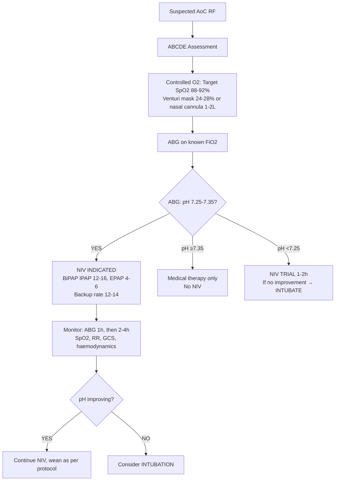
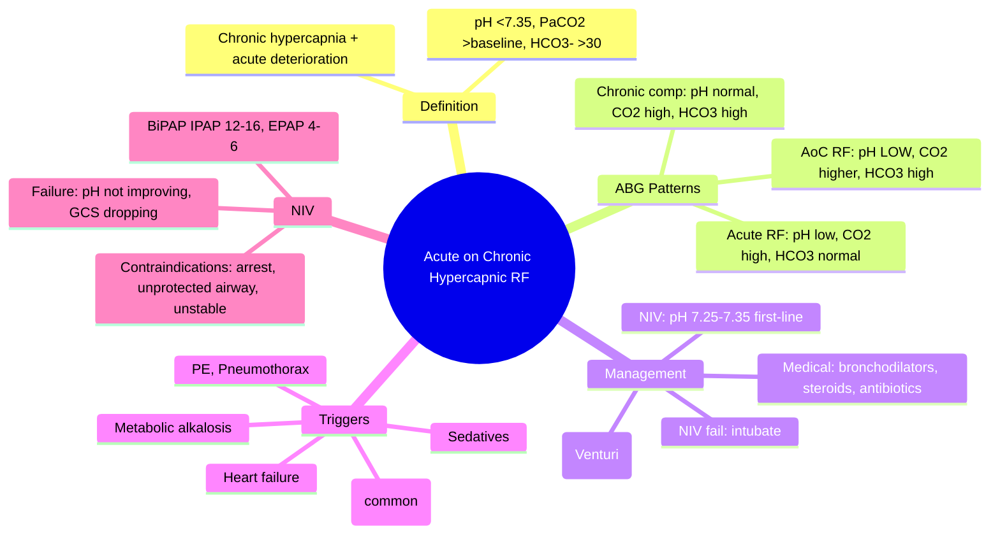
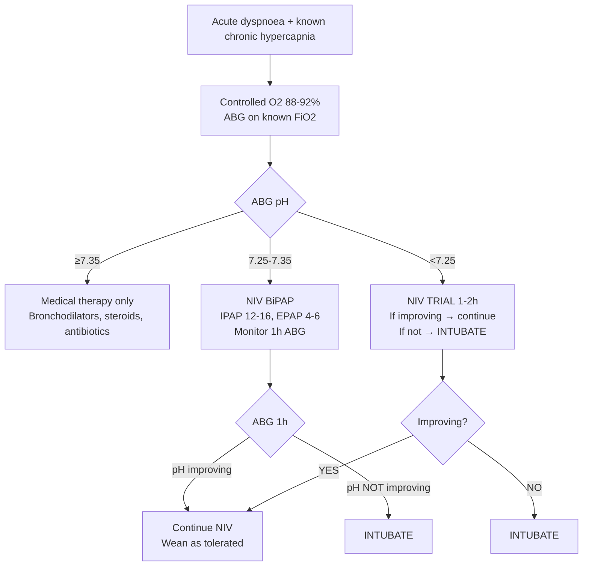

# Acute on Chronic Hypercapnic Respiratory Failure (AoC Hypercapnic RF)

Related: [[COPD]], [[Obesity hypoventilation syndrome]], [[Neuromuscular respiratory weakness]], [[Chest wall restriction and kyphoscoliosis]], [[NIV failure and escalation triggers]], [[Indications for intubation in respiratory disease]], [[Ventilatory support and escalation]], [[Type 2 respiratory failure]], [[ABG Interpretation]]

> [!important]
> **Acute on chronic hypercapnic respiratory failure (AoC RF)** = acute deterioration in a patient with **chronic hypercapnia** (usually COPD, OHS, neuromuscular, chest wall disease) leading to **worsening hypercapnia and acidaemia**. **Key FCPS/MRCP**: **pH <7.35 + raised PaCO2 + raised bicarbonate (chronic compensation)** on ABG; **NIV is first-line** (BTS: pH 7.25–7.35); **controlled O2 (88-92%)**; **intubation if NIV fails (pH <7.25 despite NIV, exhaustion, haemodynamic instability)**; **recognise vs acute hypercapnic RF (no chronic compensation) vs pure type 1 RF**.

## Learning Objectives
- Define **AoC hypercapnic RF** and distinguish from **acute hypercapnic RF** and **chronic compensated hypercapnia**
- Interpret **ABG** showing **acute-on-chronic respiratory acidosis** (pH <7.35, PaCO2 >6.0 kPa, raised HCO3-)
- Apply **BTS NIV guidelines**: criteria (pH 7.25–7.35), settings, monitoring, failure criteria
- Manage **controlled oxygen therapy** (target SpO2 88–92%) and avoid over-oxygenation
- Recognise **NIV failure** (persistent acidosis, worsening consciousness, haemodynamic instability) → intubation
- Differentiate causes: **COPD exacerbation** (most common), **OHS**, **neuromuscular**, **chest wall**, **sedative overdose**
- Manage **underlying trigger** (infection, PE, pneumothorax, heart failure, metabolic)

## Definition
**Acute on chronic hypercapnic respiratory failure (AoC RF)** = acute worsening of gas exchange in a patient with **pre-existing chronic hypercapnia**, resulting in **further rise in PaCO2** and **acidaemia (pH <7.35)**.

**Chronic hypercapnia** = PaCO2 >6.0 kPa (45 mmHg) with **renal compensation** (raised bicarbonate, pH normalised to ~7.35–7.40).

> **FCPS/MRCP tip**: **Chronic compensated** = high PaCO2, **normal pH**, **high HCO3-**; **AoC RF** = high PaCO2, **low pH**, **high HCO3-** (but not high enough to normalise pH); **Acute RF** = high PaCO2, **low pH**, **normal HCO3-**.

## Core Anatomy / Physiology
### Normal Ventilatory Control
- **Central chemoreceptors** (medulla) → respond to **CSF pH** (driven by PaCO2)
- **Peripheral chemoreceptors** (carotid/aortic bodies) → respond to **PaO2** (hypoxic drive)
- **In chronic hypercapnia**: Central chemoreceptors **reset** (tolerate higher PaCO2); **hypoxic drive** becomes more important

### Pathophysiology of AoC RF
1. **Trigger** (infection, exacerbation, sedatives, PE, pneumothorax, metabolic) → ↑ work of breathing / ↓ ventilatory drive
2. **Minute ventilation falls** → PaCO2 rises further above chronic baseline
3. **Renal compensation overwhelmed** (bicarbonate cannot rise fast enough) → **pH falls**
4. **Hypoxaemia worsens** (V/Q mismatch, shunt)
5. **Vicious cycle**: Acidaemia → ↓ myocardial contractility, ↓ diaphragmatic function, ↑ CO2 production → further deterioration

### Oxygen-Induced Hypercapnia (in COPD/OHS)
- **Hypoxic pulmonary vasoconstriction** normally matches V/Q
- **High FiO2** → loss of HPV → **worsened V/Q mismatch** → dead space ↑ → PaCO2 ↑
- **Haldane effect**: O2 binding to Hb displaces CO2 → ↑ PaCO2
- **Ventilatory drive suppression** (loss of hypoxic drive) — **minor contributor**

## Normal Values / Important Cut-offs
### ABG Interpretation (The Key Diagnostic Tool)
| Parameter | Chronic Compensated | Acute on Chronic RF | Acute Hypercapnic RF |
|-----------|---------------------|---------------------|----------------------|
| **pH** | **7.35–7.40** (normalised) | **<7.35** (acidaemia) | **<7.35** |
| **PaCO2** | **>6.0 kPa** (chronic) | **>Chronic baseline** (further ↑) | **>6.0 kPa** (acute rise) |
| **HCO3-** | **>30 mmol/L** (chronic compensation) | **>30 mmol/L** (chronic) but **insufficient** | **Normal (22–26)** |
| **Base Excess** | **Positive** (+ metabolic) | **Positive** (chronic metabolic alkalosis compensation) | Normal/Negative |

### BTS NIV Indications (AoC RF)
| pH Range | Action |
|----------|--------|
| **≥7.35** | **No NIV** (optimised medical therapy, controlled O2) |
| **7.25–7.35** | **NIV INDICATED** (first-line) |
| **<7.25** | **NIV may be tried** but **low threshold for intubation** (if not improving in 1–2h) |
| **<7.20** | **Intubation strongly considered** (NIV high failure risk) |

### Oxygen Target
- **Known chronic hypercapnia (COPD, OHS, neuromuscular)**: **Target SpO2 88–92%**
- **Uncertain diagnosis but risk factors**: Controlled O2 (Venturi 24–28%), **check ABG 30–60 min after O2 start**

### NIV Settings (Initial)
| Parameter | Typical Starting Value |
|-----------|------------------------|
| **Mode** | BiPAP (IPAP/EPAP) |
| **IPAP** | 12–16 cmH2O (titrate to Vt 6–8 mL/kg, RR <25) |
| **EPAP** | 4–6 cmH2O (counteracts auto-PEEP) |
| **Backup rate** | 12–14/min |
| **FiO2** | Titrate to SpO2 88–92% |

## Classification
### By underlying chronic condition
1. **COPD** (most common, ~70%)
2. **Obesity Hypoventilation Syndrome (OHS)**
3. **Neuromuscular disease** (MND, myasthenia, GBS, muscular dystrophy)
4. **Chest wall restriction** (kyphoscoliosis, post-thoracoplasty, ankylosing spondylitis)
5. **Central hypoventilation** (congenital, acquired brainstem)

### By severity (pH-based)
| Severity | pH | Management |
|----------|-----|------------|
| **Mild** | 7.30–7.35 | NIV + medical therapy |
| **Moderate** | 7.25–7.30 | NIV + medical therapy, close monitoring |
| **Severe** | <7.25 | NIV trial (1–2h) → intubate if no improvement |

## Etiology / Causes (Triggers for Acute Deterioration)
### Common
1. **Lower respiratory tract infection** (viral/bacterial) — **most common in COPD**
2. **Non-infective exacerbation** (air pollution, non-adherence, weather)
3. **Pulmonary embolism** (often missed)
4. **Pneumothorax** (especially in COPD/bullous disease)
5. **Heart failure / fluid overload** (cor pulmonale decompensation)
6. **Sedative / opioid / alcohol overdose** (respiratory depression)
7. **Metabolic alkalosis** (diuretic overuse → ↑ HCO3- → ↓ ventilatory drive)
8. **Pneumonia** (consolidation → V/Q mismatch)

### Condition-Specific
- **COPD**: Infection, non-adherence, PE, pneumothorax, heart failure
- **OHS**: Weight gain, sedatives, post-op, respiratory infection
- **Neuromuscular**: Infection, secretion retention, sedatives, post-op
- **Chest wall**: Infection, fluid overload, post-op pain/splinting

## Risk Factors for Poor Outcome
- **pH <7.25** on presentation
- **Age >75**
- **Comorbidities** (heart failure, renal failure, diabetes)
- **Prior NIV failure / intubation**
- **Functional dependence** (bedbound, dementia)
- **Delayed presentation** (>24h symptoms)
- **High APACHE II / DECAF score** (COPD)

## Clinical Features
### History
- **Known chronic respiratory disease** (COPD, OHS, neuromuscular, kyphoscoliosis)
- **Worsening dyspnoea** (over hours–days)
- **Increased sputum volume/purulence** (infective trigger)
- **Fever** (if infection)
- **Morning headache, confusion, drowsiness** (hypercapnia)
- **Reduced exercise tolerance**
- **Recent medication changes** (sedatives, opioids, diuretics)

### Examination
- **Tachypnoea** (often shallow, rapid)
- **Accessory muscle use**
- **Pursed-lip breathing** (COPD)
- **Reduced air entry** (hyperinflation in COPD)
- **Wheeze / crackles** (infection, heart failure)
- **Cyanosis** (if severe hypoxaemia)
- **Flapping tremor** (asterixis) — **CO2 narcosis**
- **Drowsiness, confusion, reduced GCS** — severe hypercapnia
- **Peripheral oedema, JVP ↑** (cor pulmonale / right heart failure)
- **Signs of trigger**: consolidation, pleural rub, calf tenderness (PE)

## Investigations
### Essential
1. **ABG (on controlled O2)** — **DIAGNOSTIC** for AoC RF
2. **CXR** — consolidation, pneumothorax, effusion, heart failure, hyperinflation
3. **ECG** — arrhythmia (CO2, hypoxaemia, drugs), ischemia
4. **Bloods**: FBC, U&E, CRP, glucose, troponin, BNP (if heart failure suspected)
5. **Sputum** — Gram stain, culture (if purulent)

### Selected
- **CTPA** — if PE suspected (Wells score, D-dimer)
- **Echo** — if heart failure/cor pulmonale suspected
- **Spirometry** — NOT acute; baseline later
- **Sleep study** — if OHS suspected (later)

## Interpretation Frameworks
### 1. ABG Stepwise Interpretation
```
1. pH → Acidaemia (<7.35) or normal?
2. PaCO2 → High (>6.0 kPa)?
3. HCO3- → High (>30 mmol/L)?
4. Base Excess → Positive?
    ↓
If pH <7.35 + PaCO2 high + HCO3- high + BE positive
    → **Acute on Chronic Hypercapnic Respiratory Failure**
```

### 2. Differentiation Table
| ABG Pattern | Diagnosis |
|-------------|-----------|
| pH 7.35–7.40, PaCO2 >6.0, HCO3- >30, BE +ve | **Chronic compensated hypercapnia** |
| **pH <7.35, PaCO2 >chronic baseline, HCO3- >30, BE +ve** | **Acute on chronic hypercapnic RF** |
| pH <7.35, PaCO2 >6.0, HCO3- normal (22–26), BE normal | **Acute hypercapnic RF** (no chronic compensation) |
| pH <7.35, PaCO2 normal/low, HCO3- low | **Metabolic acidosis** |
| pH >7.45, PaCO2 low, HCO3- normal | **Acute respiratory alkalosis** |

### 3. DECAF Score (COPD Exacerbation Mortality Risk)
| Component | Points |
|-----------|--------|
| **D**yspnoea (MRC 5a/b) | 1 |
| **E**osinopenia (<0.05 ×10⁹/L) | 1 |
| **C**onsolidation (CXR) | 1 |
| **A**cidemia (pH <7.3) | 1 |
| **F**requent exacerbations (≥3/yr) | 1 |
| **Total** | **0–5** |
| **Score 0–1**: Low risk (outpatient); **2**: Intermediate; **3–5**: High risk (inpatient/ICU) |

### 4. NIV Failure Criteria (BTS)
| Failure Indicator | Threshold |
|-------------------|-----------|
| **pH not improving** | **<7.30 after 1–2h NIV** (or <7.25 after 4h) |
| **Consciousness** | **Worsening** (GCS ↓, agitation, exhaustion) |
| **Respiratory rate** | **>30/min** or **increasing** despite NIV |
| **Haemodynamics** | **Unstable** (hypotension, arrhythmia) |
| **Oxygenation** | **SpO2 <88%** despite FiO2 0.5–0.6 |

## Diagnosis
**Clinical + ABG**:
1. Known or suspected chronic hypercapnic condition (COPD, OHS, etc.)
2. **Acute worsening** dyspnoea
3. **ABG**: pH <7.35 + PaCO2 >chronic baseline + HCO3- >30 mmol/L
4. **Exclude** other causes of acute dyspnoea (PE, pneumothorax, pneumonia, heart failure)

## Differential Diagnosis
| Differential | Clues Against AoC RF |
|--------------|---------------------|
| **Acute hypercapnic RF** (no chronic) | No prior hypercapnia, HCO3- normal, often neuromuscular/overdose/post-op |
| **Metabolic acidosis** (DKA, renal, lactic) | Low HCO3-, low/normal PaCO2, anion gap |
| **Pulmonary embolism** | Sudden pleuritic pain, clear chest, RV strain on echo, D-dimer |
| **Pneumothorax** | Sudden unilateral pain, asymmetrical chest, hyperresonance |
| **Acute heart failure** | Orthopnea, crackles, S3, BNP high, CXR cardiogenic |
| **Sepsis** | Hypotension, lactate high, source, may coexist |
| **Sedative/opioid overdose** | Pinpoint pupils, respiratory depression, history |

## Management
### 1. Immediate (First 30–60 Minutes)


### 2. Controlled Oxygen Therapy
- **Target SpO2 88–92%** (Venturi mask 24%, 28%, 35% or nasal cannula 1–2 L/min)
- **Check ABG 30–60 min after O2 initiation** (detect CO2 rise)
- **NEVER give high-flow O2 without monitoring** in known COPD/OHS
- **If hypoxaemia severe** (SpO2 <85% on Venturi 28%) → escalate to NIV/intubation

### 3. Non-Invasive Ventilation (NIV) — FIRST-LINE for pH 7.25–7.35
**Evidence**: Reduces intubation, mortality, LOS in COPD AoC RF
**Contraindications**:
- **Respiratory arrest / peri-arrest**
- **Inability to protect airway** (GCS <8, copious secretions, impaired cough)
- **Facial trauma/burns/anatomy** preventing mask fit
- **Haemodynamic instability** (hypotension, arrhythmia)
- **Recent upper GI / upper airway surgery**
- **Agitation / non-cooperation** (unless sedated with caution)

**Weaning**: Once pH >7.35, reduce IPAP/EPAP gradually, trial off NIV daytime → nighttime → off

### 4. Medical Therapy (Concurrently)
| Treatment | Indication |
|-----------|------------|
| **Bronchodilators** (nebulised salbutamol + ipratropium) | COPD / bronchospasm |
| **Corticosteroids** (prednisolone 40mg OD ×5d) | COPD exacerbation |
| **Antibiotics** (if purulent sputum/infection signs) | Infective exacerbation |
| **Diuretics** (if fluid overload/cor pulmonale) | Right heart failure |
| **Anticoagulation** (if PE suspected/proven) | PE |
| **Theophylline** — **NOT RECOMMENDED** (narrow window, interactions) | Avoid |

### 5. Intubation & Invasive Ventilation
**Indications**:
- **NIV failure** (pH not improving after 1–2h, worsening GCS, haemodynamic instability)
- **pH <7.20–7.25** despite optimal NIV
- **Respiratory arrest / peri-arrest**
- **Inability to protect airway** (GCS <8, massive secretions)
- **Massive haemoptysis** (airway protection)

**Ventilation strategy**: Lung-protective (Vt 6 mL/kg PBW, Pplat ≤30), permissible hypercapnia (target pH >7.20), low RR, long expiratory time.

### 6. Specific Condition Management
| Condition | Specifics |
|-----------|-----------|
| **COPD** | Bronchodilators, steroids, antibiotics if infective, NIV pH 7.25–7.35 |
| **OHS** | NIV (often long-term home NIV), weight loss, treat OSA (CPAP) |
| **Neuromuscular** | NIV (often nocturnal home NIV), secretion management (cough assist), avoid sedatives |
| **Chest wall** | NIV, pain control, treat infection, fluid balance |
| **Sedative overdose** | **Naloxone** (opioids), **Flumazenil** (benzos — caution seizures), support ventilation |

## Drug Interactions / Contraindications / Cautions
### Oxygen
- **High FiO2** → worsening hypercapnia in COPD/OHS
- **Target 88–92%** if chronic hypercapnia risk

### Sedatives / Opioids
- **Respiratory depression** → avoid or extreme caution
- **Naloxone/Flumazenil** for reversal (short half-life, may need infusion)

### NIV
- **Gastric insufflation** → aspiration risk (NG tube if high IPAP/long duration)
- **Eye irritation** (mask leak) — eye protection
- **Skin breakdown** (mask pressure) — rotate masks, padding

### Diuretics
- **Metabolic alkalosis** → ↓ ventilatory drive → worsen hypercapnia
- **Monitor U&E, bicarbonate**

## Procedures
### NIV Initiation
1. **Explain** to patient (reduces anxiety)
2. **Mask fit** (oronasal first-line; nasal if tolerated)
2. **Settings**: IPAP 12–16, EPAP 4–6, RR 12–14, FiO2 for SpO2 88–92%
3. **ABG at 1 hour** → adjust IPAP (target Vt 6–8 mL/kg, pH improvement)
4. **Monitor**: SpO2, RR, GCS, comfort, leak, haemodynamics

### Intubation
- **RSI** (ketamine/etomidate + rocuronium/suxamethonium)
- **Lung-protective settings** from first breath
- **Sedation/analgesia** (propofol/midazolam + morphine/fentanyl)

## Complications
### NIV-Specific
- **Pneumothorax** (barotrauma, rare with BiPAP)
- **Gastric distension / aspiration** (NG tube if >24h or high IPAP)
- **Facial pressure sores** (rotate masks, hydrogel dressings)
- **Conjunctivitis / corneal ulcer** (mask leak)
- **Claustrophobia / anxiety** (sedation if needed, but caution)

### Intubation/Invasive Ventilation
- **VAP** (ventilator-associated pneumonia)
- **Barotrauma** (pneumothorax)
- **ICU-acquired weakness**
- **Delirium**
- **Tracheal stenosis** (long-term)

### Untreated / Delayed
- **Respiratory arrest**
- **Cardiac arrest** (severe acidaemia, hypoxaemia)
- **Hypoxic brain injury**
- **Multi-organ failure**

## Red Flags / Emergencies
- **pH <7.20** despite NIV → **intubate**
- **GCS falling** (drowsiness, confusion → CO2 narcosis)
- **Haemodynamic instability** (hypotension on NIV → check for pneumothorax, reduce IPAP, fluids/vasopressors)
- **Massive haemoptysis** → intubation + BAE
- **Sudden desaturation** on NIV → pneumothorax, tube displacement, mucus plug

## Special Situations
### Do Not Intubate (DNI) / DNACPR
- **Advance care planning** essential in severe COPD/OHS
- **NIV as ceiling of care** if DNI
- **Palliative NIV** (comfort, dyspnoea relief) — lower pressures, shorter sessions

### Obesity Hypoventilation Syndrome (OHS)
- **BMI >30, awake hypercapnia (PaCO2 >6.0), OSA**
- **Acute AoC RF**: NIV (BiPAP) + controlled O2 + weight loss plan + CPAP for OSA
- **Home NIV** often needed long-term

### Neuromuscular (MND, GBS, Myasthenia)
- **Weak cough** → secretion retention → infection risk
- **Cough assist** (mechanical insufflation-exsufflation)
- **Nocturnal NIV** often baseline; acute → intensify NIV, avoid sedatives

### Post-Operative (Abdominal/Thoracic)
- **Pain + splinting + opioids** → hypoventilation
- **Epidural/regional analgesia** preferred
- **Early mobilisation, incentive spirometry, NIV if needed**

## Prognosis
| Factor | Better | Worse |
|--------|--------|-------|
| **pH on admission** | >7.30 | <7.25 |
| **Age** | <70 | >80 |
| **Comorbidities** | Few | Multiple (HF, renal, cancer) |
| **Functional status** | Independent | Bedbound, dementia |
| **Prior NIV/ICU** | None | Previous failure |
| **DECAF score** | 0–1 | 3–5 |

**In-hospital mortality**: COPD AoC RF ~10–15% (higher if pH <7.25, age >75, comorbidities)

## Topic Correlation
- [[COPD]] — most common cause
- [[Type 2 respiratory failure]] — physiology
- [[ABG Interpretation]] — diagnostic key
- [[NIV failure and escalation triggers]] — NIV management
- [[Indications for intubation in respiratory disease]] — escalation
- [[Ventilatory support and escalation]] — advanced support
- [[COPD]] management
- [[Obesity hypoventilation syndrome]] — specific condition

## FCPS/MRCP High-Yield Points
1. **AoC RF** = chronic hypercapnia + acute deterioration → pH <7.35 with raised PaCO2 + raised HCO3-
2. **ABG pattern**: pH <7.35, PaCO2 >chronic baseline, HCO3- >30, BE positive
3. **Controlled O2** target SpO2 88–92% (Venturi 24–28%) — **never high-flow O2 unmonitored**
4. **NIV first-line** for pH 7.25–7.35 (BTS); pH <7.25 → NIV trial 1–2h then intubate if no improvement
5. **NIV settings**: BiPAP IPAP 12–16, EPAP 4–6, backup rate 12–14
6. **NIV failure** = pH not improving in 1–2h, worsening GCS, haemodynamic instability → intubate
7. **DECAF score** for COPD exacerbation prognosis
8. **Triggers**: Infection (most common), PE, pneumothorax, heart failure, sedatives, metabolic alkalosis
9. **Differentiate**: Chronic compensated (pH normal), Acute RF (no HCO3- compensation), Metabolic acidosis
10. **Oxygen-induced hypercapnia**: hypoxic drive loss + Haldane effect + V/Q mismatch

## Common Viva Questions
1. ABG interpretation: chronic compensated vs AoC RF vs acute RF
2. NIV indications, settings, contraindications, failure criteria
3. Controlled O2 therapy in COPD (target, Venturi, monitoring)
4. DECAF score components and interpretation
5. Differential diagnosis of acute hypercapnia
6. Management of OHS / neuromuscular / chest wall AoC RF
7. NIV failure management and intubation criteria
8. Oxygen-induced hypercapnia mechanisms

## Common Confusions / Exam Traps
- **Giving high-flow O2 to COPD patient** → worsening hypercapnia, acidaemia
- **Targeting SpO2 94–98% in known CO2 retainer** — WRONG, target 88–92%
- **NIV for pH ≥7.35** — not indicated (medical therapy only)
- **NIV for pH <7.20** without intubation plan — high failure, delay definitive care
- **Confusing chronic compensated (pH normal) with AoC RF (pH low)**
- **Missing PE/pneumothorax/heart failure** as trigger for AoC RF
- **Using theophylline** — not recommended (narrow therapeutic index)

## Mnemonics
- **AoC RF ABG**: **pH LOW, CO2 HIGH, HCO3 HIGH, BE POSITIVE** = Acute on Chronic
- **CHRONIC COMPENSATED**: **pH NORMAL, CO2 HIGH, HCO3 HIGH, BE POSITIVE**
- **NIV INDICATION**: **pH 7.25-7.35** = NIV; **pH ≥7.35** = Medical; **pH <7.25** = Trial then Intubate
- **CONTROLLED O2**: **TARGET 88-92%**, Venturi 24-28%, Check ABG 30-60min
- **NIV FAILURE**: pH not improving 1-2h, GCS dropping, Haemodynamics unstable, RR >30
- **TRIGGERS COPD**: **I**nfection, **P**E, **P**neumothorax, **H**eart failure, **S**edatives, **M**etabolic alkalosis = **IPPHSM**

## Mind Map


## Flowchart


## Suggested Visuals / Image Notes
- ABG classification table (chronic vs AoC vs acute)
- NIV settings schematic
- Venturi mask O2 concentrations
- NIV failure criteria card
- DECAF score calculator
- Intubation vs NIV decision tree

## Suggested Video References
- BTS NIV guidelines
- ABG interpretation for AoC RF
- NIV setup and troubleshooting
- COPD exacerbation management
- OHS acute management
- Intubation in severe COPD

## One-Page Revision Summary
- **AoC RF**: Chronic hypercapnia + acute deterioration → pH <7.35, PaCO2 >baseline, HCO3- >30
- **Chronic compensated**: pH normal, PaCO2 high, HCO3- high
- **Controlled O2**: Target 88-92%, Venturi 24-28%, ABG 30-60min
- **NIV**: pH 7.25-7.35 first-line; BiPAP IPAP 12-16, EPAP 4-6
- **NIV failure**: pH not improving 1-2h, GCS dropping, haemodynamic instability → intubate
- **Triggers**: Infection, PE, pneumothorax, HF, sedatives, metabolic alkalosis
- **DECAF**: Dyspnoea, Eosinopenia, Consolidation, Acidemia, Frequent exacerbations
- **Medical**: Bronchodilators, steroids, antibiotics, diuretics if HF

## 24-Hour Recall Prompts
- AoC RF ABG pattern (pH, PaCO2, HCO3-, BE)
- Chronic compensated vs AoC RF vs Acute RF
- O2 target in COPD
- NIV indication pH range
- NIV failure criteria
- DECAF score
- Triggers for AoC RF

## 7-Day / 15-Day / 30-Day Revision Tracker
- [ ] Day 1 completed
- [ ] 24-hour recall completed
- [ ] Day 7 revision completed
- [ ] Day 15 revision completed
- [ ] Day 30 revision completed

## Must Know / Should Know / Nice to Know
### Must Know
- AoC RF definition and ABG pattern
- Controlled O2 (88-92%, Venturi)
- NIV indications (pH 7.25-7.35), settings, monitoring
- NIV failure criteria and intubation threshold
- DECAF score
- Triggers for AoC RF
- Differentiation from chronic compensated and acute RF

### Should Know
- Condition-specific management (OHS, neuromuscular, chest wall)
- Intubation strategy (lung-protective, permissive hypercapnia)
- Metabolic alkalosis as trigger
- Palliative NIV / DNI decisions

### Nice to Know
- NIV modes (AVAPS, iVAPS, ST)
- Cough assist for neuromuscular
- Long-term home NIV criteria
- Cost-effectiveness of NIV
- DECAF validation studies

## Self-Test Scorecard
- Understanding: /10
- Recall: /10
- MCQ Performance: /10
- SBA Performance: /10
- Viva Confidence: /10
- Total: /50

> [!tip]
> Interpretation: <35 = weak topic, 35-44 = acceptable but insecure, 45+ = strong exam-ready topic.

## Exam Answer Modes
### Long Answer Skeleton
- Definition and ABG patterns (AoC vs chronic compensated vs acute)
- Pathophysiology (chemoresponse resetting, hypoxic drive, O2-induced hypercapnia)
- Clinical features and triggers
- Diagnostic approach (ABG interpretation framework)
- Management algorithm (O2, NIV, medical, intubation)
- NIV details (indications, settings, contraindications, failure criteria)
- Condition-specific management (COPD, OHS, neuromuscular, chest wall)
- Prognostic scores (DECAF)
- Complications and palliative considerations

### Short Note Skeleton
- ABG classification table
- Management algorithm flowchart
- NIV indication/settings/failure box
- DECAF score box
- Triggers list
- Differentiation table

### Viva One-Liners
- "AoC RF = chronic hypercapnia + acute deterioration → pH <7.35, PaCO2 >baseline, HCO3- >30"
- "Chronic compensated: pH normal, PaCO2 high, HCO3- high; Acute RF: no HCO3- compensation"
- "Controlled O2: target SpO2 88-92%, Venturi 24-28%, check ABG 30-60 min"
- "NIV indication: pH 7.25-7.35 (BTS); pH ≥7.35 = medical only; pH <7.25 = trial then intubate"
- "NIV: BiPAP IPAP 12-16, EPAP 4-6, backup rate 12-14, SpO2 88-92%"
- "NIV failure: pH not improving 1-2h, GCS dropping, haemodynamic instability, RR >30"
- "DECAF: Dyspnoea MRC5, Eosinopenia, Consolidation, Acidemia pH<7.3, Frequent exacerbations"
- "Triggers: Infection, PE, pneumothorax, HF, sedatives, metabolic alkalosis"
- "O2-induced hypercapnia: hypoxic drive loss + Haldane effect + V/Q mismatch"

### Ward-Case Discussion Points
- 72M COPD, exacerbation, ABG pH 7.28 PaCO2 9.5 HCO3- 34 → NIV indicated, IPAP 14 EPAP 5, ABG 1h pH 7.32 → continue
- 65F OHS BMI 42, drowsy, ABG pH 7.22 PaCO2 11 HCO3- 38 → NIV trial 1h, pH 7.18 → intubate
- 50M MND, weak cough, infection, ABG pH 7.30 PaCO2 8.2 HCO3- 32 → NIV + cough assist + antibiotics

### Last-Night-Before-Exam Sheet
- AoC RF: pH<7.35, PaCO2>baseline, HCO3->30
- Chronic comp: pH normal, PaCO2 high, HCO3 high
- O2: 88-92% Venturi
- NIV: pH 7.25-7.35; IPAP 12-16 EPAP 4-6
- NIV fail: pH not↑ 1-2h, GCS↓, unstable → intubate
- DECAF: Dyspnoea, Eosinopenia, Consol, Acidemia, Frequent
- Triggers: Inf, PE, PTX, HF, Seds, Met alk

## Summary
**Acute on chronic hypercapnic respiratory failure (AoC RF)** = acute deterioration in a patient with **pre-existing chronic hypercapnia** (COPD, OHS, neuromuscular, chest wall disease) causing **worsening hypercapnia and acidaemia**. **ABG signature**: **pH <7.35, PaCO2 >chronic baseline, HCO3- >30 mmol/L, positive base excess**. **Management**: **Controlled oxygen** (target SpO2 88–92%, Venturi 24–28%), **NIV first-line** for **pH 7.25–7.35** (BiPAP IPAP 12–16, EPAP 4–6), **intubation** if pH <7.25 or NIV fails (pH not improving in 1–2h, GCS dropping, haemodynamic instability). **Medical therapy**: bronchodilators, corticosteroids, antibiotics (if infective), diuretics (if fluid overload). **Triggers**: infection (most common), PE, pneumothorax, heart failure, sedatives, metabolic alkalosis. **Prognosis**: DECAF score. **Differentiate** from chronic compensated (pH normal) and acute hypercapnic RF (no HCO3- compensation).

## MCQs (10)
1. **ABG pattern** of chronic compensated hypercapnia:
   A. pH <7.35, PaCO2 high, HCO3- normal
   B. **pH 7.35–7.40, PaCO2 >6.0 kPa, HCO3- >30 mmol/L**
   C. pH <7.35, PaCO2 high, HCO3- normal
   D. pH >7.45, PaCO2 low, HCO3- normal

2. **AoC hypercapnic RF** — key ABG difference from chronic compensated:
   A. PaCO2 lower
   B. **pH <7.35 (acidaemia)**
   C. HCO3- normal
   D. Base excess negative

3. **Controlled oxygen target** in known COPD/OHS:
   A. 94–98%
   B. **88–92%**
   C. 90–94%
   D. 92–96%

4. **BTS NIV indication** for COPD exacerbation — pH range:
   A. 7.35–7.45
   B. **7.25–7.35**
   C. 7.15–7.25
   D. <7.15

5. **NIV failure criterion** (BTS) — which is NOT a criterion?
   A. pH not improving after 1–2h
   B. Worsening consciousness (GCS)
   C. Haemodynamic instability
   D. **PaO2 <8 kPa on FiO2 0.6**

6. **DECAF score** component — which is NOT included?
   A. Dyspnoea (MRC grade)
   B. Eosinopenia
   C. Consolidation on CXR
   D. **Serum creatinine**

7. **Oxygen-induced hypercapnia** in COPD — mechanism:
   A. Only hypoxic drive suppression
   B. Only Haldane effect
   C. Only V/Q mismatch
   D. **All three (hypoxic drive + Haldane effect + V/Q mismatch)**

8. **NIV settings** for COPD AoC RF — typical starting IPAP/EPAP:
   A. IPAP 20, EPAP 10
   B. **IPAP 12–16, EPAP 4–6**
   C. IPAP 8, EPAP 2
   D. IPAP 25, EPAP 15

9. **Metabolic alkalosis** as trigger for AoC RF — mechanism:
   A. Increases ventilatory drive
   B. **Decreases ventilatory drive (via HCO3-/pH effect on chemoreceptors)**
   C. Causes bronchospasm
   D. Increases CO2 production

10. **DECAF score** maximum points:
    A. 3
    B. 4
    C. **5**
    D. 6

## SBA Questions (10)
1. A 72M COPD, exacerbation, ABG on 28% Venturi: pH 7.30, PaCO2 9.2 kPa, HCO3- 34 mmol/L. Best next step?
   A. Increase O2 to 40%
   B. **NIV (BiPAP) — pH 7.25–7.35**
   C. Intubation
   D. IV aminophylline

2. Same patient, 1h on NIV: pH 7.26, PaCO2 10.5, RR 35, drowsy. Next step?
   A. Increase IPAP
   B. **Intubation (NIV failure: pH not improving, GCS dropping)**
   C. Continue NIV, repeat ABG 2h
   D. Increase EPAP

3. A 68M COPD on 28% Venturi, ABG: pH 7.38, PaCO2 7.5, HCO3- 32. Interpretation?
   A. Acute hypercapnic RF
   B. **Chronic compensated hypercapnia**
   C. AoC hypercapnic RF
   D. Normal

4. A 55F OHS (BMI 45), found drowsy, ABG: pH 7.22, PaCO2 11 kPa, HCO3- 36. O2 on 28% Venturi. Next step?
   A. Increase O2 to 60%
   B. **NIV trial 1–2h, if no improvement → intubate**
   C. Immediate intubation
   D. IV bicarbonate

5. A 70M COPD, ABG pH 7.28, PaCO2 8.5, HCO3- 30. DECAF components present: MRC dyspnoea 4, no eosinopenia, no consolidation, pH 7.28, 2 exacerbations last year. DECAF score?
   A. 1
   B. **2**
   C. 3
   D. 4

6. Triggers for AoC RF in COPD — which is LEAST likely?
   A. Pneumonia
   B. Pulmonary embolism
   C. **Metabolic acidosis**
   D. Sedative overdose

7. NIV contraindication — which is ABSOLUTE?
   A. Agitation
   B. **Respiratory arrest / peri-arrest**
   C. Copious secretions
   D. Poor mask fit

8. Oxygen therapy in COPD — which statement is CORRECT?
   A. Target SpO2 94–98% always
   B. **Target SpO2 88–92% if hypercapnia risk**
   C. High-flow nasal oxygen first-line
   D. No need for ABG after starting O2

9. Mechanical ventilation strategy for intubated severe COPD AoC RF:
   A. High Vt, high RR, zero PEEP
   B. **Low Vt 6ml/kg PBW, low RR, long expiratory time, permissive hypercapnia**
   C. High Vt, high PEEP
   D. Inverse ratio ventilation

10. A 60M kyphoscoliosis, acute dyspnoea, ABG pH 7.26, PaCO2 9.0, HCO3- 33. Known chronic hypercapnia. Best initial management?
    A. Intubation
    B. **NIV (BiPAP) + controlled O2 + treat trigger**
    C. High-flow O2
    C. IV bicarbonate

## Flashcards
- Q: Chronic comp ABG
  A: pH normal, PaCO2 high, HCO3>30
- Q: AoC RF ABG
  A: pH<7.35, PaCO2>baseline, HCO3>30
- Q: O2 target COPD
  A: 88-92%
- Q: NIV indication pH
  A: 7.25-7.35
- Q: NIV settings
  A: IPAP 12-16, EPAP 4-6
- Q: NIV failure
  A: pH not↑ 1-2h, GCS↓, unstable
- Q: DECAF
  A: Dyspnoea, Eosinopenia, Consol, Acidemia, Frequent
- Q: O2-induced hypercapnia
  A: Hypoxic drive + Haldane + V/Q mismatch
- Q: Trigger metabolic alkalosis
  A: Diuretic overuse → ↓ drive
- Q: Intubation vent strategy
  A: Low Vt, low RR, long Texp, permissive hypercapnia

## Answer Key with Explanations
### MCQs
1. **B** — Chronic compensated: pH normalised (7.35–7.40), chronic hypercapnia with renal compensation (HCO3- >30).
2. **B** — Key difference: AoC RF has **acidaemia (pH <7.35)**; chronic compensated has normal pH.
3. **B** — Target SpO2 88–92% in chronic hypercapnia (BTS).
4. **B** — BTS: NIV indicated for pH 7.25–7.35.
5. **D** — PaO2 <8 kPa on FiO2 0.6 is not a specific NIV failure criterion (BTS: pH, GCS, haemodynamics, RR).
6. **D** — DECAF: Dyspnoea, Eosinopenia, Consolidation, Acidemia, Frequent exacerbations. Creatinine not included.
7. **D** — All three mechanisms contribute: hypoxic drive suppression, Haldane effect, worsened V/Q mismatch.
8. **B** — Standard BiPAP for COPD: IPAP 12–16, EPAP 4–6 cmH2O.
9. **B** — Metabolic alkalosis (raised HCO3-) ↓ central chemoreceptor drive → hypoventilation.
10. **C** — DECAF has 5 components (0–5 points).

### SBAs
1. **B** — pH 7.30 = NIV indication range (7.25–7.35).
2. **B** — pH worsening, drowsy, RR 35 = NIV failure → intubation.
3. **B** — pH normal (7.38), chronic hypercapnia with compensation (HCO3- 32) = chronic compensated.
4. **B** — pH <7.25 = NIV trial 1–2h, intubate if no improvement (BTS).
5. **B** — MRC 4 = 1, pH 7.28 = 1 (acidemia <7.3), others 0 = total 2.
6. **C** — Metabolic acidosis would cause hyperventilation (Kussmaul), not hypercapnic AoC RF.
7. **B** — Respiratory arrest/peri-arrest = absolute NIV contraindication.
8. **B** — Chronic hypercapnia risk = target 88–92% SpO2 with controlled O2.
9. **B** — Lung-protective: low Vt, low RR, long expiratory time, permissive hypercapnia (avoid dynamic hyperinflation).
10. **B** — Known chronic hypercapnia + acute deterioration = AoC RF → NIV + controlled O2 + treat trigger.

### Flashcards
All correct as written.

---

## PasTest Scenario SBAs (Clinical Vignettes)

> **Auto-generated PasTest/Mediscope-style scenario SBAs** grounded in the authored source. Each scenario tests a real clinical fact (triad, specific sign, contraindication, trial, first-line Rx) extracted from the topic. *Source: Ch 17: Respiratory Medicine — Acute on chronic hypercapnic respiratory failure*

**Q1.** Which of the following features is most specific or characteristic of Acute on chronic hypercapnic respiratory failure?

  - **A.** ABG
  - **B.** A feature common to many acute inflammatory conditions
  - **C.** A non-specific sign that does not localise the diagnosis
  - **D.** An investigation finding rather than a clinical feature

  > **Answer: A** — ABG
  >
  > *Source:* **ABG (on controlled O2)** — **DIAGNOSTIC** for AoC RF
2

**Q2.** What is the most appropriate first-line therapy for Acute on chronic hypercapnic respiratory failure?

  - **A.** NEVER give high-flow O2 without monitoring in known COPD/OHS
  - **B.** An advanced/surgical therapy reserved for refractory disease
  - **C.** Symptomatic treatment only, no disease-modifying therapy
  - **D.** Empiric broad-spectrum therapy without specific indication

  > **Answer: A** — NEVER give high-flow O2 without monitoring in known COPD/OHS
  >
  > *Source:* **NEVER give high-flow O2 without monitoring** in known COPD/OHS

