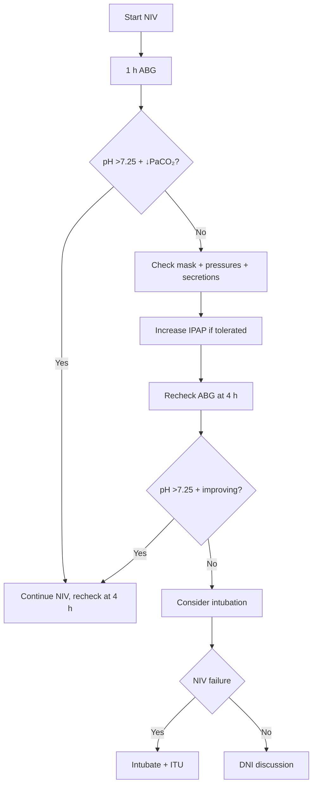

# NIV failure and escalation triggers

> [!important]
> **NIV (non-invasive ventilation)** is first-line for **hypercapnic respiratory failure** (pH 7.25–7.35) in AECOPD, OHS, NM weakness, and acute cardiogenic pulmonary oedema. Recognising **NIV failure early** is critical to prevent delay in intubation, which worsens mortality.

Related: [[Respiratory Failure]], [[Oxygen Therapy and NIV]], [[Indications for intubation in respiratory disease]], [[Type 2 respiratory failure]]

> [!tip] **FCPS/MRCP pearl**: **NIV failure** = pH <7.20 + ↑PaCO₂ + ↑RR + exhaustion + ↓GCS after 1–2 h of NIV. **Don't delay intubation**. Recheck ABG at 1 h and 4 h. If not improving, intubate. Avoid prolonged NIV trials in deteriorating patients.

## 1. Definition

**NIV failure** = inadequate response to NIV, evidenced by persistent or worsening:
- ABG (pH <7.20, ↑PaCO₂)
- Respiratory rate (>30)
- Conscious level (GCS ↓)
- Clinical signs of exhaustion

## 2. Failure criteria (BTS/ERS)

### Early indicators (1–2 h)
- **pH <7.20** (after 1 h of NIV)
- **PaCO₂ rising** (despite NIV)
- **RR >30** (persistent)
- **GCS ↓** or agitation
- **Mask intolerance** (cannot synchronise)

### Late indicators (4–6 h)
- Failure to improve pH/PaCO₂
- Persistent high RR
- Continued distress

## 3. Risk factors for NIV failure

| Risk factor | Reason |
|-------------|--------|
| **pH <7.20 at start** | More severe acidosis |
| **Severe encephalopathy (GCS <8)** | Aspiration, no airway protection |
| **Excessive secretions** | Inability to clear |
| **Vomiting** | Aspiration risk |
| **Facial deformity / mask intolerance** | Delivery failure |
| **Agitation / uncooperative** | Synchronisation failure |
| **Haemodynamic instability** | Need for intubation |
| **Pneumonia as cause** | Less responsive than COPD/oedema |
| **ARDS** | NIV often fails |
| **Multiorgan failure** | Overall poor prognosis |

## 4. Management

### Step 1: Check NIV setup
- **Mask fit** (no leaks)
- **Synchronisation** (patient tolerates machine)
- **Pressures**: increase IPAP (12 → 16–20 cmH₂O) if tolerated
- **Position**: sitting up
- **Secretions**: suction if needed
- **Humidification**

### Step 2: Reassess ABG
- **At 1 h** after initiation
- **At 4 h** if not improving
- **If pH <7.20 or worsening** → escalate

### Step 3: Escalate to intubation
- **Delay in intubation** ↑mortality
- **Indications**: pH <7.20 + ↑PaCO₂, exhaustion, GCS ↓, shock

### Step 4: Don't intubate (DNI)
- If patient/SDM has decided against intubation
- Continue NIV for symptomatic relief
- Palliative care

## 5. Management algorithm

## 6. NIV success vs failure

### Predictors of success
- pH >7.25 at start
- GCS >8
- Better tolerance
- AECOPD/oedema (vs pneumonia)
- Younger age
- Lower RR at start

### Predictors of failure
- pH <7.20 at start
- GCS <8
- Pneumonia/ARDS
- High RR (>30)
- Excessive secretions
- Older age, comorbidity

## 7. Special situations

### Pneumonia + NIV
- **Less successful** than COPD/oedema
- High failure rate in severe pneumonia
- ARDS → intubate early (low threshold)
- HFNC may be better for hypoxaemic

### Cardiogenic pulmonary oedema
- **Highly responsive** to NIV (CPAP or BiPAP)
- Reduces preload and afterload
- Successful in most cases

### Post-extubation
- NIV can prevent reintubation in high-risk patients
- **Caution**: NIV failure in post-extubation has high mortality

### Pre-intubation
- **Preoxygenation** with NIV before intubation (reduces desaturation)
- Especially in hypoxaemic patients

## 8. FCPS/MRCP High-Yield Summary

| Domain | Key points |
|--------|------------|
| **NIV failure criteria** | pH <7.20, ↑PaCO₂, ↑RR, exhaustion, GCS ↓ |
| **Recheck ABG** | At 1 h and 4 h |
| **Don't delay intubation** | ↑Mortality if late |
| **Prednisone pneumonic success** | COPD > pneumonia > ARDS |
| **Predictors of failure** | pH <7.20, GCS <8, secretions, ARDS |
| **CPAP in oedema** | Very successful |
| **Preoxygenation with NIV** | Reduces intubation hypoxia |
| **DNI** | Discuss early; continue NIV palliatively |

## 9. MCQs (10)

1. ABG check timing after starting NIV:
   A. 6 h
   B. **1 h and 4 h**
   C. 24 h
   D. 1 week
   E. Never
   **Answer: B** — 1 h and 4 h.

2. NIV failure criterion (most important):
   A. Mild dyspnoea
   B. **pH <7.20 after 1 h of NIV**
   C. Stable SpO₂
   D. Comfortable patient
   E. Tiredness
   **Answer: B** — pH <7.20.

3. Most successful condition for NIV:
   A. ARDS
   B. **Cardiogenic pulmonary oedema**
   C. Pneumonia
   D. Asthma
   E. PE
   **Answer: B** — Oedema.

4. NIV failure most common in:
   A. AECOPD
   B. **Severe pneumonia / ARDS**
   C. OHS
   D. Oedema
   E. Asthma
   **Answer: B** — Pneumonia/ARDS.

5. First action if NIV failing:
   A. Intubate immediately
   B. **Check mask fit, pressures, secretions**
   C. Stop NIV
   D. Discharge
   E. Steroids
   **Answer: B** — Check setup.

6. The risk of delayed intubation in NIV failure is:
   A. None
   B. **Increased mortality**
   C. Same
   D. Improved
   E. Unknown
   **Answer: B** — ↑Mortality.

7. Mask intolerance is managed by:
   A. Sedation
   B. **Try alternative interface (nasal mask, total face mask)**
   C. Intubation
   D. Discharge
   E. None
   **Answer: B** — Try alternative interface.

8. The cause of AECOPD with NIV failure is most commonly:
   A. Heart failure
   B. **Pneumonia + secretions + exhaustion**
   C. PE
   D. Asthma
   E. None
   **Answer: B** — Co-pathology.

9. Initial IPAP for AECOPD is:
   A. 5 cmH₂O
   B. **12–15 cmH₂O**
   C. 25 cmH₂O
   D. 30 cmH₂O
   E. 40 cmH₂O
   **Answer: B** — 12–15.

10. NIV should be stopped and intubation considered if:
    A. Patient requests
    B. **pH <7.20 + ↑PaCO₂ + ↑RR + exhaustion**
    C. After 24 h
    D. SpO₂ <90%
    E. Wheeze
    **Answer: B** — pH <7.20 + deterioration.

## 10. SBA Questions (10)

1. A 65-year-old with AECOPD on NIV has pH 7.18 at 1 h (was 7.28). Action:
   A. Continue NIV
   B. **Intubate (NIV failure)**
   C. Discharge
   D. Steroids
   E. Antibiotics
   **Answer: B** — Intubate.

2. The most important predictor of NIV success in AECOPD:
   A. Age
   B. **pH at presentation (better pH = better success)**
   C. SpO₂
   D. RR
   E. Sex
   **Answer: B** — pH.

3. NIV in acute cardiogenic oedema:
   A. Always fail
   B. **Highly successful (CPAP reduces preload and afterload)**
   C. Same as COPD
   D. Worse than ARDS
   E. Unknown
   **Answer: B** — Successful.

4. Pre-intubation preoxygenation with NIV in hypoxaemic patient:
   A. Always contraindicated
   B. **Reduces desaturation**
   C. Increases aspiration
   D. Slows intubation
   E. None
   **Answer: B** — Reduces.

5. The mortality of NIV failure followed by intubation (vs successful NIV):
   A. Same
   B. **Higher (delayed intubation)**
   C. Lower
   D. Unknown
   E. None
   **Answer: B** — Higher.

6. NIV in ARDS:
   A. First-line
   B. **High failure rate; consider early intubation**
   C. Always successful
   D. None
   E. Cure
   **Answer: B** — High failure.

7. A patient on NIV has GCS dropping from 14 to 9. Action:
   A. Continue
   B. **Intubate (airway protection)**
   C. Sedate
   D. Discharge
   E. Watch
   **Answer: B** — GCS ↓ = intubate.

8. Mask leak in NIV leads to:
   A. Improved ventilation
   B. **Reduced effective ventilation, intolerance**
   C. No effect
   D. Hyperventilation
   E. Bradycardia
   **Answer: B** — Reduced ventilation.

9. The maximum tolerated IPAP in NIV is usually:
   A. 5
   B. 10
   C. **20–25 cmH₂O**
   D. 40
   E. 50
   **Answer: C** — 20–25.

10. A patient on NIV has copious secretions + exhaustion + pH 7.22. Best:
    A. Continue NIV +/− suction
    B. **Intubate (NIV failure with exhaustion)**
    C. Antibiotics
    D. Steroids
    E. Wait
    **Answer: B** — Intubate.

## 11. Flashcards

- **Q: When to recheck ABG after NIV?**
  A: 1 h and 4 h.

- **Q: NIV failure ABG criterion?**
  A: pH <7.20.

- **Q: Most successful for NIV?**
  A: Cardiogenic oedema.

- **Q: Most likely to fail NIV?**
  A: ARDS, severe pneumonia.

- **Q: First action if NIV failing?**
  A: Check mask fit + pressures + secretions.

- **Q: Mortality of delayed intubation?**
  A: Higher.

- **Q: Initial IPAP in AECOPD?**
  A: 12–15 cmH₂O.

- **Q: GCS dropping on NIV?**
  A: Intubate (airway protection).

- **Q: NIV in ARDS?**
  A: High failure; consider early intubation.

- **Q: Preoxygenation with NIV?**
  A: Reduces desaturation during intubation.

## 12. Answer Key with Explanations

### MCQs
1. **B**  2. **B**  3. **B**  4. **B**  5. **B**  6. **B**  7. **B**  8. **B**  9. **B**  10. **B**

### SBAs
1. **B**  2. **B**  3. **B**  4. **B**  5. **B**  6. **B**  7. **B**  8. **B**  9. **C**  10. **B**

## 13. Summary

NIV failure = pH <7.20 + ↑PaCO₂ + ↑RR + exhaustion + ↓GCS. Recheck ABG at 1 h and 4 h. Don't delay intubation (↑mortality). Most successful: cardiogenic oedema. Most fail: ARDS, severe pneumonia. Check mask + pressures + secretions first.

## 14. Local Navigation
- **Parent Heading**: [[../Respiratory Failure and Ventilatory Support|Respiratory Failure and Ventilatory Support]]
- **Parent Topic Group**: [[../Respiratory Failure and Ventilatory Support/Ventilatory support and escalation|Ventilatory support and escalation]]
- **Chapter Map**: [[../Davidson Chapter 17 - Respiratory Medicine Hierarchy|Respiratory Medicine Hierarchy]]
- **Chapter MOC**: [[../Respiratory MOC|Respiratory MOC]]
- **Related**: [[Respiratory Failure]] · [[Oxygen Therapy and NIV]] · [[Indications for intubation in respiratory disease]] · [[Type 2 respiratory failure]]
