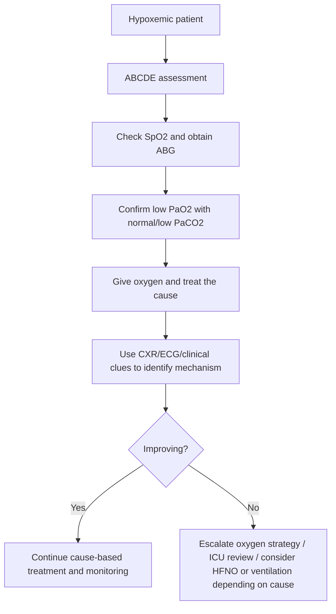
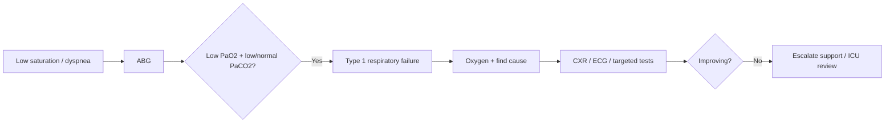

# Type 1 respiratory failure

> [!important]
> **Type 1 respiratory failure** is **hypoxemic respiratory failure**, defined by a low arterial oxygen level, classically **PaO2 <8 kPa (60 mmHg)**, with a normal or low PaCO2. It is usually caused by **V/Q mismatch, shunt, or diffusion impairment**, not primary alveolar hypoventilation.

Related: [[Respiratory Failure]], [[ABG Interpretation]], [[Oxygen Therapy and NIV]], [[Chest X-Ray Approach]], [[Respiratory Failure and Ventilatory Support/Type 2 respiratory failure|Type 2 respiratory failure]], [[Pneumonia]], [[Pulmonary Embolism]]

> [!tip]
> In FCPS/MRCP, the big skill is not memorizing the label alone but understanding the **ABG pattern**, the underlying **oxygenation mechanism**, and the emergency logic of **oxygen, cause-specific treatment, and escalation**.

## Learning Objectives
- Define type 1 respiratory failure and distinguish it from type 2 respiratory failure.
- Understand the physiology of oxygenation failure, shunt, diffusion limitation, and V/Q mismatch.
- Interpret ABGs and common imaging/clinical clues.
- Apply emergency management with oxygen therapy and cause-based escalation.
- Recognize red flags and common exam pitfalls.

## Definition
Type 1 respiratory failure is **respiratory failure characterized predominantly by hypoxemia**, usually defined as:
- **PaO2 <8 kPa (60 mmHg)**
- with **normal or low PaCO2**

### Core concept
The patient can often still ventilate enough to remove CO2 initially, but oxygen transfer is failing.

## Core Anatomy
### 1. Alveolar-capillary membrane
- Oxygen must pass from alveoli across the alveolar-capillary membrane into blood.
- Any process affecting alveoli, interstitium, pulmonary capillaries, or alveolar ventilation can impair oxygenation.

### 2. Ventilation-perfusion relationship
- Efficient oxygenation requires matching of ventilation and perfusion.
- Type 1 failure often reflects major mismatch at the lung-unit level.

### 3. Shunt-prone lung units
- Consolidated or fluid-filled alveoli may be perfused but not ventilated.
- This creates shunt physiology.

### 4. Interstitial and vascular relevance
- Interstitial lung disease impairs diffusion.
- Pulmonary vascular disease impairs perfusion distribution and gas exchange efficiency.

## Core Physiology
### 1. Main mechanisms of hypoxemia
#### A. V/Q mismatch
Most common mechanism:
- some alveoli are poorly ventilated relative to perfusion
- examples: pneumonia, pulmonary edema, asthma/COPD overlap regions, small airway disease

#### B. Shunt
- blood passes through non-ventilated alveoli
- oxygenation may respond poorly if shunt is large
- examples: lobar pneumonia, ARDS, atelectasis

#### C. Diffusion impairment
- oxygen transfer across the membrane is reduced
- examples: interstitial lung disease

#### D. Low inspired oxygen
- e.g. high altitude; less common bedside cause in usual hospital exams

### 2. Why CO2 may remain normal/low
- CO2 diffuses more easily than oxygen
- tachypnea can lower PaCO2 early
- therefore the patient may be severely hypoxemic without initial hypercapnia

### 3. A-a gradient logic
- Increased alveolar-arterial oxygen gradient suggests gas-exchange failure rather than simple hypoventilation alone.

> [!important]
> Type 1 respiratory failure = **oxygenation problem first**, usually from V/Q mismatch or shunt.

## Normal Values / Important Cut-offs
### ABG normal values
- PaO2: **80–100 mmHg** or **10.7–13.3 kPa**
- PaCO2: **35–45 mmHg** or **4.7–6.0 kPa**
- pH: **7.35–7.45**
- HCO3-: **22–26 mmol/L**

### Type 1 respiratory failure threshold
- **PaO2 <8 kPa (60 mmHg)**
- PaCO2 normal or low initially

### Oxygen saturation clue
- low SpO2 is a bedside warning, but ABG clarifies severity and pattern

## Classification
### 1. By failure pattern
- **Type 1 respiratory failure**: hypoxemic
- **Type 2 respiratory failure**: hypercapnic

### 2. By mechanism
- V/Q mismatch dominant
- shunt dominant
- diffusion defect dominant

### 3. By tempo
- acute
- acute on chronic background lung disease

## Etiology / Causes
Common causes of type 1 respiratory failure:
- pneumonia
- pulmonary edema
- ARDS
- pulmonary embolism
- pneumothorax in severe cases
- interstitial lung disease
- severe asthma/COPD may start hypoxemic before hypercapnia appears
- atelectasis

## Risk Factors
- severe lung infection
- major parenchymal lung disease
- acute pulmonary vascular events
- frailty / low reserve
- immunocompromised state
- major cardiopulmonary comorbidity

## Pathophysiology
Regardless of cause, the pathway is:
- impaired oxygen transfer into blood
- arterial hypoxemia develops
- tachypnea and distress occur
- if untreated, tissue oxygen delivery falls
- severe or prolonged disease may progress to mixed or type 2 failure if fatigue supervenes

## Clinical Features
### Symptoms
- breathlessness
- pleuritic or non-pleuritic chest symptoms depending on cause
- anxiety/restlessness
- inability to lie flat in some causes

### Signs
- tachypnea
- tachycardia
- cyanosis in severe cases
- accessory muscle use
- cause-specific chest findings:
  - crackles in pneumonia/edema
  - unilateral reduced breath sounds in pneumothorax
  - clear chest possible in PE

### Severe warning signs
- exhaustion
- altered mental state
- worsening hypoxemia despite oxygen
- rising PaCO2 suggesting fatigue and progression

## Approach / Algorithm

## Investigations
### 1. ABG
Core test:
- confirms hypoxemia
- shows whether CO2 is normal, low, or rising
- helps distinguish type 1 from type 2 failure

### 2. Chest X-ray
Often high yield for cause:
- consolidation
- pulmonary edema
- pneumothorax
- diffuse infiltrates / ARDS pattern

### 3. Pulse oximetry
- useful for rapid monitoring
- does not replace ABG when pattern clarification is required

### 4. Cause-specific tests
- ECG / troponin if PE/ACS possibilities
- D-dimer / CTPA when PE suspected
- echo in cardiogenic causes
- inflammatory markers and cultures if infection suspected

## Interpretation Frameworks
### 1. ABG interpretation
| ABG pattern | Interpretation |
|---|---|
| Low PaO2 + low PaCO2 | classic early type 1 pattern with tachypnea |
| Low PaO2 + normal PaCO2 | serious disease; ventilatory reserve may be getting stressed |
| Low PaO2 + rising PaCO2 | impending mixed failure / fatigue / progression toward type 2 |

### 2. Type 1 vs Type 2
| Feature | Type 1 | Type 2 |
|---|---|---|
| Main issue | hypoxemia | hypercapnia +/- hypoxemia |
| PaCO2 | normal/low | high |
| Main mechanisms | V/Q mismatch, shunt, diffusion defect | alveolar hypoventilation |
| Examples | pneumonia, PE, edema, ARDS | COPD exacerbation, neuromuscular weakness, sedative hypoventilation |

### 3. Oxygen response logic
- V/Q mismatch usually improves with oxygen.
- Large shunt may respond less well.
- Poor response to oxygen should trigger concern for severe shunt/ARDS or wrong diagnosis.

## Diagnosis
Diagnosis requires:
- clinical respiratory distress or oxygenation concern
- ABG showing **low PaO2** with **normal/low PaCO2**
- identification of underlying cause

## Differential Diagnosis
| Differential | Clues favoring it |
|---|---|
| **Type 2 respiratory failure** | high PaCO2, drowsiness, hypoventilation states |
| **Pneumonia** | fever, crackles, consolidation |
| **Pulmonary embolism** | sudden dyspnea, pleuritic pain, risk factors, often relatively clear chest |
| **Pulmonary edema** | orthopnea, crackles, edema pattern on CXR |
| **Pneumothorax** | unilateral reduced breath sounds/hyperresonance |
| **ARDS** | severe diffuse hypoxemia with bilateral infiltrates and critical illness |

## Tables / Comparison Charts
### Common causes by mechanism
| Mechanism | Examples |
|---|---|
| V/Q mismatch | pneumonia, pulmonary edema, asthma/COPD overlap |
| Shunt | ARDS, dense consolidation, atelectasis |
| Diffusion defect | interstitial lung disease |
| Vascular cause | pulmonary embolism |

## Management
### 1. Immediate principles
- assess ABCDE
- give oxygen
- obtain ABG
- identify and treat the cause
- monitor closely for deterioration

### 2. Oxygen therapy
- titrate oxygen according to clinical context
- in most pure type 1 situations without CO2-retention risk, higher oxygen targets are acceptable
- if COPD overlap or uncertain CO2-retention risk exists, use ABG-guided caution

### 3. Cause-specific treatment examples
- pneumonia → antibiotics
- pulmonary edema → diuretics / cardiac management
- PE → anticoagulation / reperfusion logic where indicated
- pneumothorax → decompression/drain if needed
- ARDS → critical care / ventilatory support

### 4. Escalation
Consider HFNO, CPAP, NIV, intubation, or ICU referral depending on:
- severity of hypoxemia
- work of breathing
- cause
- trajectory
- mental status and fatigue

## Drug Interactions / Contraindications / Comorbidity Cautions
- Oxygen remains essential, but if COPD overlap exists, reassess ABG rather than assuming all hypoxemia is simple type 1 failure.
- Sedatives can worsen respiratory mechanics and obscure deterioration.
- In cardiogenic pulmonary edema, fluid management matters.

## Procedures / Indications / Contraindications
### ABG sampling
**Indication:** suspected respiratory failure or unexplained hypoxemia.

### Advanced oxygen delivery / ventilatory support
**Indication:** persistent hypoxemia despite standard oxygen.

### Intubation
**Indication:** worsening distress, exhaustion, refractory hypoxemia, reduced consciousness, or failure of noninvasive support.

## Procedure Mini-Sections
### ABG
- **Why:** confirms gas-exchange pattern
- **Pearl:** low O2 with low/normal CO2 suggests type 1 failure
- **Pitfall:** missing rising CO2 that signals impending decompensation

### Oxygen escalation
- **Why:** improve oxygen delivery while treating cause
- **Pitfall:** focusing only on oxygen device and forgetting cause-specific therapy

## Complications
- progression to mixed or type 2 respiratory failure
- arrhythmia / tissue hypoxia
- respiratory arrest if severe and untreated
- organ dysfunction from hypoxemia

## Red Flags / Emergencies
- severe hypoxemia
- altered mental state
- exhaustion
- refractory low saturation despite oxygen
- rising PaCO2 in previously type 1 pattern
- hemodynamic instability from underlying cause

## Special Situations
### PE with near-normal chest exam
- can still cause significant type 1 failure

### ILD
- may have severe exertional desaturation with relatively subtle auscultatory findings early

### Pneumonia/ARDS
- may show shunt physiology with limited oxygen response

## Prognosis
- Depends largely on the underlying cause and speed of reversal.
- Some cases reverse quickly with treatment; others progress to severe respiratory failure and ICU care.

## Topic Correlation
- [[ABG Interpretation]] and [[Oxygen Therapy and NIV]] are central for bedside management.
- [[Type 2 respiratory failure]] is the major physiological comparison point.
- [[Pneumonia]], [[Pulmonary Embolism]], and ILD notes are common cause-based anchors.

## FCPS/MRCP High-Yield Points
- Type 1 respiratory failure = **low PaO2 with normal/low PaCO2**.
- Main mechanisms: **V/Q mismatch, shunt, diffusion defect**.
- Common causes: pneumonia, PE, edema, ARDS, ILD.
- Rising PaCO2 in a hypoxemic patient may mean fatigue and worsening failure.
- Always treat the **cause**, not the ABG label only.

## Common Viva Questions
- Define type 1 respiratory failure.
- What causes it?
- How does it differ from type 2 respiratory failure?
- What is the ABG pattern?
- Why may oxygen response be poor in shunt physiology?

## Common Confusions / Exam Traps
- Confusing all respiratory failure with hypercapnia.
- Missing PE because the chest exam is not dramatic.
- Treating oxygen number only without finding the cause.
- Failing to notice conversion toward type 2 failure when CO2 begins to rise.

## Mnemonics
### **TYPE 1 = OXYGEN FAILS**
- **O**xygen low
- **X**-ray often helps cause
- **Y**ou usually see normal/low CO2 early
- **G**as exchange problem
- **E**scalate if refractory
- **N**ot primarily hypoventilation

## Mind Map
- Type 1 respiratory failure
  - ABG
    - low PaO2
    - low/normal PaCO2
  - mechanisms
    - VQ mismatch
    - shunt
    - diffusion defect
  - causes
    - pneumonia
    - PE
    - edema
    - ARDS
    - ILD
  - treatment
    - oxygen
    - treat cause
    - escalate if refractory

## Flowchart

## Suggested Visuals / Image Notes
- Type 1 vs type 2 ABG comparison table
- V/Q mismatch vs shunt diagram
- A-a gradient concept sketch
- Cause-based CXR clue panel

## Suggested Video References
- Short review on **type 1 vs type 2 respiratory failure**
- Video on **ABG interpretation in hypoxemic respiratory failure**
- Review of **V/Q mismatch, shunt, and oxygen response**

## One-Page Revision Summary
### Type 1 respiratory failure rapid sheet
- **Definition:** PaO2 <8 kPa with normal/low PaCO2
- **Main mechanisms:** V/Q mismatch, shunt, diffusion defect
- **Common causes:** pneumonia, PE, pulmonary edema, ARDS, ILD
- **ABG pearl:** low O2 + low CO2 = classic early pattern
- **Warning:** normalizing/rising CO2 may mean fatigue and worsening
- **Management:** oxygen + identify/treat cause + escalate if refractory

## 24-Hour Recall Prompts
- Define type 1 respiratory failure.
- List three major mechanisms of hypoxemia.
- Give five common causes.
- How does ABG differ from type 2 respiratory failure?
- Why might oxygen response be poor in a large shunt?

## 7-Day / 15-Day / 30-Day Revision Tracker
- **Day 1:** Write the ABG pattern and main mechanisms from memory.
- **Day 7:** Compare type 1 vs type 2 respiratory failure.
- **Day 15:** Match common diseases to mechanism: V/Q mismatch vs shunt vs diffusion defect.
- **Day 30:** Explain bedside emergency management without notes.

## Must Know / Should Know / Nice to Know
### Must Know
- PaO2 <8 kPa definition
- normal/low PaCO2 pattern
- mechanisms of hypoxemia
- common causes and emergency management

### Should Know
- A-a gradient concept
- oxygen response differences in shunt vs V/Q mismatch

### Nice to Know
- advanced oxygenation indices and ICU metrics

## My Weak Points
- Can I distinguish type 1 from type 2 on ABG?
- Do I remember all three major mechanisms?
- Can I connect common causes to the mechanism?
- Do I remember to treat the cause, not only the oxygen saturation?

## Self-Test Scorecard
- Understanding /10
- Recall /10
- ABG interpretation /10
- MCQ performance /10
- Viva confidence /10

**Interpretation:**
- **<35/50** = weak topic
- **35–44/50** = fair
- **45+/50** = strong exam-ready topic

## Exam Answer Modes
### Short note mode
Type 1 respiratory failure is hypoxemic respiratory failure, defined by low arterial oxygen, classically PaO2 below 8 kPa, with normal or low PaCO2. It results mainly from V/Q mismatch, shunt, or diffusion impairment. Common causes include pneumonia, pulmonary edema, pulmonary embolism, ARDS, and interstitial lung disease. Management is oxygen therapy, ABG-based reassessment, and urgent treatment of the underlying cause.

### Viva mode
- Define type 1 respiratory failure.
- State the ABG pattern.
- List causes.
- Explain V/Q mismatch and shunt.
- Distinguish it from type 2 failure.

### Ward-case mode
In a hypoxemic patient, perform ABCDE, give oxygen, obtain ABG, identify low PaO2 with normal/low PaCO2, use chest X-ray and targeted tests to find the cause, and escalate support if hypoxemia persists or fatigue develops.

## Summary
Type 1 respiratory failure is an **oxygenation failure syndrome** caused mainly by **V/Q mismatch, shunt, or diffusion impairment**. Exam success depends on recognizing the **ABG pattern**, linking it to the correct mechanism and cause, and managing both **oxygen delivery and the underlying disease** promptly.

## MCQs (10)
1. Type 1 respiratory failure is classically defined by:
   - A. low PaO2 with high PaCO2
   - B. low PaO2 with normal or low PaCO2
   - C. high PaO2 with low PaCO2
   - D. normal ABG only
   - E. isolated metabolic acidosis

2. Which mechanism most commonly causes type 1 respiratory failure?
   - A. Alveolar hypoventilation alone
   - B. V/Q mismatch
   - C. Pure metabolic alkalosis
   - D. Renal failure only
   - E. Sinus bradycardia

3. Which ABG pattern best fits type 1 respiratory failure?
   - A. PaO2 low, PaCO2 low
   - B. PaO2 normal, PaCO2 high
   - C. PaO2 high, PaCO2 low
   - D. PaO2 normal, PaCO2 normal always
   - E. Only bicarbonate low

4. Which of the following is a common cause of type 1 respiratory failure?
   - A. Pneumonia
   - B. Myasthenic hypoventilation only
   - C. Opioid overdose only
   - D. Guillain-Barré syndrome only
   - E. Brainstem stroke only

5. Which statement about CO2 in early type 1 respiratory failure is most accurate?
   - A. It must always be raised
   - B. It is often normal or low
   - C. It is always zero
   - D. It can never change
   - E. It is irrelevant

6. Which condition commonly produces shunt-dominant hypoxemia?
   - A. Dense pneumonia / ARDS
   - B. Stable hypertension
   - C. Migraine
   - D. Otitis externa
   - E. Hypothyroidism

7. Which test is central to confirming type 1 respiratory failure?
   - A. ABG
   - B. Skin biopsy
   - C. Colonoscopy
   - D. EEG
   - E. Bone scan

8. Which of the following best distinguishes type 1 from type 2 respiratory failure?
   - A. Type 1 has low PaO2 with normal/low PaCO2
   - B. Type 1 always has hypercapnia
   - C. Type 2 never has hypoxemia
   - D. Type 1 is always chronic
   - E. There is no difference

9. Poor response of hypoxemia to oxygen may suggest:
   - A. large shunt physiology
   - B. no lung disease
   - C. only anxiety
   - D. isolated renal colic
   - E. certain asthma remission

10. A rising PaCO2 in a patient with type 1 failure suggests:
   - A. clear improvement
   - B. possible fatigue and worsening failure
   - C. impossible lab result
   - D. no significance
   - E. cure of the underlying cause

## SBA Questions (10)
1. A patient with severe pneumonia has an ABG showing PaO2 6.9 kPa, PaCO2 4.3 kPa, and pH 7.47. What is the best interpretation?
   - A. Type 1 respiratory failure
   - B. Type 2 respiratory failure
   - C. Pure metabolic acidosis
   - D. Normal ABG
   - E. CO poisoning only

2. A man with sudden dyspnea and pleuritic pain has low oxygen saturation, tachycardia, and a relatively clear chest. Which cause of type 1 respiratory failure should be strongly considered?
   - A. Pulmonary embolism
   - B. Appendicitis
   - C. Migraine
   - D. Otitis media
   - E. Hyperthyroidism

3. A patient with diffuse alveolar infiltrates remains severely hypoxemic despite oxygen. Which mechanism is most likely prominent?
   - A. Large shunt physiology
   - B. Pure upper-airway obstruction only
   - C. Metabolic alkalosis only
   - D. Bradyarrhythmia only
   - E. Hypothyroidism

4. Which immediate step is most appropriate in suspected type 1 respiratory failure?
   - A. Ignore oxygenation until CT is done
   - B. ABCDE assessment, oxygen, and ABG
   - C. Oral iron only
   - D. Bronchoscopy in every patient before oxygen
   - E. Home discharge immediately

5. A patient with known type 1 respiratory failure now has rising PaCO2 and worsening exhaustion. What is the best interpretation?
   - A. Improvement
   - B. Progression toward mixed or type 2 failure
   - C. No change at all
   - D. Lab contamination only
   - E. Pure kidney disease

6. Which disease commonly causes type 1 respiratory failure through diffusion impairment?
   - A. Interstitial lung disease
   - B. Myopia
   - C. Psoriasis
   - D. Osteoarthritis
   - E. Otitis externa

7. A patient with acute pulmonary edema has low PaO2 and low-normal PaCO2. What best explains the hypoxemia?
   - A. V/Q mismatch and shunt physiology
   - B. Isolated hepatic failure
   - C. Pure endocrine disorder
   - D. Bone marrow failure
   - E. No pulmonary mechanism exists

8. Which statement about type 1 respiratory failure is most correct?
   - A. It is mainly an oxygenation problem
   - B. It is always due to sedative overdose
   - C. It always presents with high PaCO2 first
   - D. It never needs imaging
   - E. It cannot occur in PE

9. A patient is hypoxemic with a normal chest X-ray but high clinical suspicion of PE. What should be done?
   - A. Dismiss PE because X-ray is normal
   - B. Continue targeted workup for PE
   - C. Diagnose pleural effusion
   - D. Stop all oxygen
   - E. Assume anxiety only

10. In type 1 respiratory failure, the main treatment principle is:
   - A. oxygen plus treatment of the underlying cause
   - B. bicarbonate only
   - C. fluid restriction in every case regardless of cause
   - D. intubation of all patients immediately
   - E. antibiotics in every case

## Flashcards
- Q: What is the classic ABG definition of type 1 respiratory failure?
  A: **PaO2 <8 kPa with normal or low PaCO2**.
- Q: What are the three main mechanisms of type 1 hypoxemia?
  A: **V/Q mismatch, shunt, diffusion impairment**.
- Q: Name four common causes of type 1 respiratory failure.
  A: Pneumonia, pulmonary edema, PE, ARDS, ILD.
- Q: Does type 1 failure usually start as an oxygenation or ventilation problem?
  A: **Oxygenation** problem.
- Q: What does a rising PaCO2 in type 1 failure suggest?
  A: Fatigue and worsening / mixed failure.
- Q: What test confirms the gas-exchange pattern?
  A: **ABG**.
- Q: Which cause may have a relatively clear chest exam despite severe hypoxemia?
  A: **Pulmonary embolism**.
- Q: Why may oxygen response be poor in shunt physiology?
  A: Blood is passing through non-ventilated alveoli.
- Q: What is the key contrast with type 2 respiratory failure?
  A: Type 2 has **raised PaCO2**.
- Q: Is treating the cause important in type 1 respiratory failure?
  A: Yes, essential.

## Answer Key with Explanations
### MCQs
1. **B. low PaO2 with normal or low PaCO2**
   - This is the classic type 1 pattern.
2. **B. V/Q mismatch**
   - It is the most common mechanism overall.
3. **A. PaO2 low, PaCO2 low**
   - This is a classic early ABG picture.
4. **A. Pneumonia**
   - Pneumonia is a common cause of type 1 failure.
5. **B. It is often normal or low**
   - CO2 is often normal/low early because of tachypnea.
6. **A. Dense pneumonia / ARDS**
   - These commonly produce shunt physiology.
7. **A. ABG**
   - ABG is central for confirmation and differentiation.
8. **A. Type 1 has low PaO2 with normal/low PaCO2**
   - This is the defining contrast.
9. **A. large shunt physiology**
   - Major shunt responds less well to oxygen.
10. **B. possible fatigue and worsening failure**
   - Rising CO2 is an ominous progression marker.

### SBAs
1. **A. Type 1 respiratory failure**
   - Low oxygen with low CO2 fits classic hypoxemic failure.
2. **A. Pulmonary embolism**
   - Sudden dyspnea, pleuritic pain, and a relatively clear chest are classic clues.
3. **A. Large shunt physiology**
   - Diffuse alveolar filling can create severe shunt.
4. **B. ABCDE assessment, oxygen, and ABG**
   - This is the correct first principle.
5. **B. Progression toward mixed or type 2 failure**
   - Rising CO2 implies fatigue and worsening ventilation.
6. **A. Interstitial lung disease**
   - This causes hypoxemia through diffusion impairment.
7. **A. V/Q mismatch and shunt physiology**
   - These are the main pulmonary edema oxygenation mechanisms.
8. **A. It is mainly an oxygenation problem**
   - That is the core physiology.
9. **B. Continue targeted workup for PE**
   - A normal CXR does not exclude PE.
10. **A. oxygen plus treatment of the underlying cause**
   - This is the central management principle.
