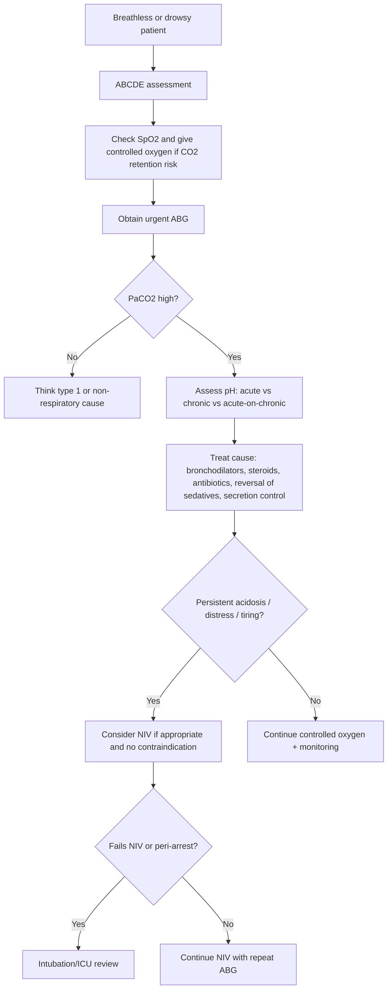
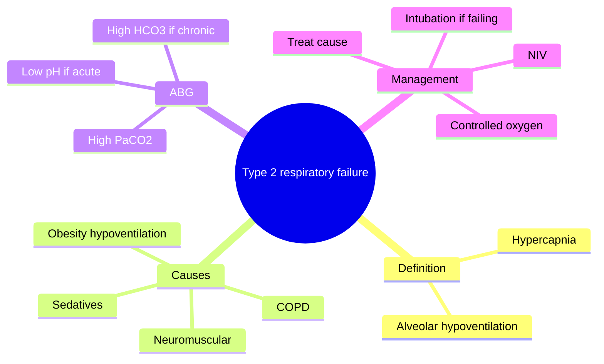
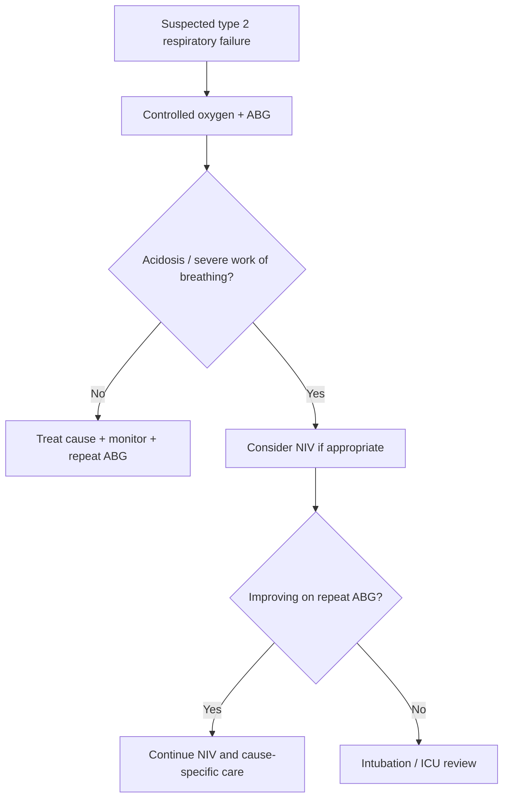

# Type 2 respiratory failure

> [!important]
> **Type 2 respiratory failure** is **hypercapnic ventilatory failure**, classically defined by **PaCO2 >6 kPa (45 mmHg)**, usually with hypoxemia, because alveolar ventilation is inadequate. In exams, the key is to recognize **who needs controlled oxygen, who needs NIV, and who needs urgent intubation review**.

Related: [[Respiratory Failure]], [[ABG Interpretation]], [[Oxygen Therapy and NIV]], [[Chest X-Ray Approach]], [[Respiratory Failure and Ventilatory Support/Type 1 respiratory failure|Type 1 respiratory failure]], [[Airway Diseases/Acute exacerbation of COPD|Acute exacerbation of COPD]], [[Upper Airway and Sleep-Related Breathing Disorders/Obesity hypoventilation syndrome|Obesity hypoventilation syndrome]]

> [!tip]
> In FCPS/MRCP, type 2 failure is a favorite because it tests physiology, ABG interpretation, oxygen pitfalls, COPD/NIV decision-making, and mixed acute-on-chronic compensation logic.

## Learning Objectives
- Define type 2 respiratory failure and distinguish it from type 1 respiratory failure.
- Understand alveolar hypoventilation physiology and CO2 retention.
- Interpret ABGs in acute, chronic, and acute-on-chronic hypercapnia.
- Recognize common causes such as COPD exacerbation, neuromuscular weakness, obesity hypoventilation, and sedative toxicity.
- Apply controlled oxygen, NIV, escalation, and cause-specific management safely.

## Definition
Type 2 respiratory failure is respiratory failure characterized by **hypercapnia due to inadequate alveolar ventilation**.

Typical ABG pattern:
- **PaCO2 >6 kPa (45 mmHg)**
- usually **PaO2 <8 kPa (60 mmHg)** as well
- pH may be low in acute decompensation

### Core concept
The problem is not simply oxygen transfer failure; it is **failure to move enough air in and out of the alveoli**, so CO2 accumulates.

## Core Anatomy
### 1. Respiratory pump components
The respiratory pump depends on:
- central respiratory drive in the brainstem
- intact spinal cord and peripheral nerves
- neuromuscular junction and respiratory muscles
- compliant chest wall
- patent airways

### 2. Diaphragm and accessory muscles
- The **diaphragm** is the main inspiratory muscle.
- Accessory muscles are recruited in distress.
- Fatigue of these muscles can precipitate ventilatory failure.

### 3. Airway and chest wall relevance
- Obstructed airways increase work of breathing.
- Severe hyperinflation flattens the diaphragm in COPD.
- Kyphoscoliosis and obesity reduce chest wall compliance.

## Core Physiology
### 1. Alveolar ventilation principle
CO2 elimination depends on **alveolar ventilation**.
- when alveolar ventilation falls, **PaCO2 rises**
- causes include reduced respiratory drive, muscle weakness, severe airflow obstruction, and chest wall limitation

### 2. Why hypoxemia often coexists
- hypoventilation lowers alveolar oxygen tension
- many causes also produce V/Q mismatch
- therefore type 2 failure commonly has both hypercapnia and hypoxemia

### 3. Compensation logic
- **Acute hypercapnia**: pH falls quickly; HCO3- only slightly rises
- **Chronic hypercapnia**: kidneys retain bicarbonate; pH partially normalizes
- **Acute-on-chronic hypercapnia**: high PaCO2, high HCO3-, and pH now drops again because a chronic retainer has decompensated

> [!important]
> Type 2 respiratory failure = **ventilation problem first**. If you give high uncontrolled oxygen to a chronic CO2 retainer without monitoring, you may worsen hypercapnia.

## Normal Values / Important Cut-offs
### Normal ABG values
- pH: **7.35-7.45**
- PaCO2: **35-45 mmHg** or **4.7-6.0 kPa**
- PaO2: **80-100 mmHg** or **10.7-13.3 kPa**
- HCO3-: **22-26 mmol/L**

### Type 2 respiratory failure thresholds
- **PaCO2 >6 kPa (45 mmHg)**
- often **PaO2 <8 kPa (60 mmHg)**

### NIV trigger used in common COPD-style exam scenarios
- persisting acidosis with **pH <7.35** and **PaCO2 >6-6.5 kPa** despite initial treatment supports NIV consideration in the right clinical setting

### Target oxygen saturation in CO2-retention risk
- usually **88-92%** until ABG clarifies the situation

## Classification
### 1. By tempo
- acute type 2 respiratory failure
- chronic compensated type 2 respiratory failure
- acute-on-chronic type 2 respiratory failure

### 2. By mechanism
- central hypoventilation
- airway obstruction with ventilatory failure
- neuromuscular pump failure
- chest wall restriction / obesity hypoventilation

### 3. By cause pattern
- obstructive: COPD, severe asthma late stage
- neuromuscular: Guillain-Barre syndrome, myasthenia crisis, motor neuron disease
- depressant: opioids, sedatives
- mechanical/restrictive: obesity hypoventilation, kyphoscoliosis

## Etiology / Causes
Common causes:
- **acute exacerbation of COPD**
- severe asthma with fatigue
- obesity hypoventilation syndrome
- neuromuscular weakness
- chest wall deformity such as kyphoscoliosis
- CNS depression from opioids, benzodiazepines, stroke, or encephalopathy
- severe pneumonia or pulmonary edema causing exhaustion on top of poor reserve
- upper airway obstruction in selected cases

## Risk Factors
- known COPD with previous NIV or admissions
- smoking and chronic airflow limitation
- obesity and sleep-disordered breathing
- sedative or opioid exposure
- neuromuscular disease
- advanced age and poor respiratory reserve
- chest wall restriction

## Pathophysiology
Typical sequence:
- increased ventilatory load or reduced ventilatory capacity
- alveolar hypoventilation develops
- CO2 retention occurs
- respiratory acidosis develops if acute
- cerebral vasodilation and narcosis may occur with worsening hypercapnia
- untreated patients progress to confusion, exhaustion, arrhythmia, and arrest

## Clinical Features
### Symptoms
- dyspnea
- reduced exercise tolerance
- headache, especially morning headache in chronic retainers
- drowsiness or confusion
- poor concentration

### Signs
- tachypnea early, but respiratory rate may fall late with fatigue
- use of accessory muscles
- wheeze or prolonged expiration in COPD/asthma
- bounding pulse, warm peripheries, flap may occur in severe hypercapnia
- reduced chest expansion or weak cough in neuromuscular disease
- obesity, somnolence, or shallow breathing in hypoventilation syndromes

### CO2 narcosis clues
- drowsiness
- confusion
- asterixis
- headache
- reduced conscious level

## Approach / Algorithm

## Investigations
### 1. Arterial blood gas
Most important test:
- confirms hypercapnia
- shows acidosis severity
- distinguishes acute, chronic, and acute-on-chronic patterns
- helps guide oxygen and NIV decisions

### 2. Pulse oximetry
- useful for monitoring
- does not detect CO2 retention, so normal saturation can still hide hypercapnia in oxygen-treated patients

### 3. Chest X-ray
Look for cause or trigger:
- hyperinflation in COPD
- pneumonia
- pulmonary edema
- pneumothorax
- large pleural effusion

### 4. ECG and cardiac assessment
Useful when:
- arrhythmia or ACS may have triggered decompensation
- cor pulmonale or right-heart strain is suspected

### 5. Cause-specific tests
- CBC, CRP, cultures if infection suspected
- U&E, bicarbonate, renal function
- drug history / toxicology if sedative or opioid cause possible
- spirometry history / prior ABGs if chronic retainer status is unclear
- FVC, NIF, cough strength in neuromuscular cases where available

## Interpretation Frameworks
### 1. ABG acute vs chronic logic
| Pattern | Interpretation |
|---|---|
| High PaCO2 + low pH + near-normal HCO3- | **Acute** hypercapnic respiratory failure |
| High PaCO2 + near-normal pH + high HCO3- | **Chronic compensated** CO2 retention |
| High PaCO2 + low pH + high HCO3- | **Acute-on-chronic** decompensation |

### 2. Type 1 vs Type 2 comparison
| Feature | Type 1 | Type 2 |
|---|---|---|
| Main problem | Oxygenation failure | Ventilatory failure |
| PaO2 | Low | Often low |
| PaCO2 | Normal/low | High |
| Main mechanisms | V/Q mismatch, shunt, diffusion defect | Alveolar hypoventilation |
| Classic examples | Pneumonia, PE, edema, ARDS | COPD exacerbation, obesity hypoventilation, sedative toxicity |

### 3. Oxygen strategy framework
| Scenario | Saturation target / logic |
|---|---|
| No CO2-retention risk | Higher oxygen targets usually acceptable |
| Known/suspected chronic CO2 retainer | Start **controlled oxygen**, aim **88-92%**, recheck ABG |
| Deteriorating despite oxygen | Reassess diagnosis, ventilation, and need for NIV/intubation |

### 4. Bedside pattern clues
| Clinical picture | Likely direction |
|---|---|
| Wheezy smoker with drowsiness | COPD exacerbation with hypercapnia |
| Morbid obesity + daytime somnolence | Obesity hypoventilation syndrome |
| Weak cough + shallow breaths | Neuromuscular ventilatory failure |
| Pinpoint pupils + low RR | Opioid-related hypoventilation |

## Diagnosis
Diagnosis requires:
- compatible clinical respiratory compromise
- **PaCO2 >6 kPa (45 mmHg)** on ABG
- associated respiratory acidosis when acute or decompensated
- identification of the underlying cause

## Differential Diagnosis
| Differential | Clues favoring it |
|---|---|
| **Type 1 respiratory failure** | hypoxemia without hypercapnia initially |
| **COPD exacerbation** | smoker, chronic cough, wheeze, hyperinflation |
| **Opioid or sedative toxicity** | low RR, pinpoint pupils, drug exposure |
| **Neuromuscular weakness** | weak cough, bulbar symptoms, poor vital capacity |
| **Obesity hypoventilation syndrome** | obesity, OSA history, chronic bicarbonate elevation |
| **Severe asthma with fatigue** | acute wheeze, silent chest, pulsus paradoxus, tiring |

## Tables / Comparison Charts
### Common causes grouped by mechanism
| Mechanism | Examples |
|---|---|
| Central drive reduction | opioids, sedatives, CNS lesions |
| Increased airway resistance / load | COPD exacerbation, severe asthma |
| Pump weakness | GBS, myasthenia, motor neuron disease |
| Chest wall / obesity | kyphoscoliosis, obesity hypoventilation |

### Acute hypercapnia warning signs
| Warning sign | Why it matters |
|---|---|
| Falling pH | decompensating respiratory acidosis |
| Reduced consciousness | CO2 narcosis / impending arrest |
| Silent chest or exhaustion | impending ventilatory collapse |
| Poor NIV tolerance or no improvement | may require intubation review |

## Management
### 1. Immediate principles
- ABCDE approach
- controlled oxygen if CO2-retention risk
- urgent ABG
- treat the precipitating cause
- decide early about NIV versus intubation pathway

### 2. Controlled oxygen therapy
- use Venturi mask or equivalent controlled delivery when appropriate
- initial target in suspected CO2 retainers: **88-92%**
- repeat ABG after oxygen and initial treatment

### 3. Cause-specific treatment examples
- **COPD exacerbation**: bronchodilators, steroids, antibiotics if infective trigger likely, sputum support
- **Asthma**: bronchodilators, steroids, magnesium where appropriate, ICU help if tiring
- **Opioid toxicity**: airway support and naloxone as indicated
- **Neuromuscular weakness**: monitor vital capacity / NIF, secretion support, ICU discussion early
- **Obesity hypoventilation**: NIV often helpful if acute decompensation

### 4. Non-invasive ventilation
Indications in the right setting include:
- persistent hypercapnic acidosis despite initial treatment
- increased work of breathing
- COPD-type acute exacerbation with potentially reversible decompensation

Benefits:
- reduces work of breathing
- improves alveolar ventilation
- lowers PaCO2
- may avoid intubation

### 5. Intubation / ICU review
Needed when:
- worsening consciousness
- peri-arrest or severe exhaustion
- inability to protect airway
- NIV contraindicated or failing
- refractory acidosis / hypoxemia / shock

## Drug Interactions / Contraindications / Comorbidity Cautions
- **Uncontrolled high-flow oxygen** may worsen hypercapnia in susceptible chronic retainers.
- Sedatives and opioids can worsen ventilatory failure.
- Excessive nebulized beta-agonist alone does not fix tiring respiratory muscles; reassess the whole patient.
- NIV is difficult in vomiting, facial trauma, severe agitation, or inability to protect the airway.
- Coexisting pneumonia, heart failure, or pneumothorax may alter the expected response and lower NIV success.

## Procedures / Indications / Contraindications
### Key procedures/steps
- ABG sampling
- controlled oxygen delivery
- NIV initiation
- endotracheal intubation when escalation is required

## Procedure Mini-Sections
### Procedure: ABG sampling
- **Indications:** suspected respiratory failure, need to assess oxygenation/ventilation/acidosis
- **Contraindications:** no absolute contraindication in emergencies; use caution with poor perfusion/coagulopathy
- **Complications:** pain, hematoma, arterial spasm
- **Viva pearls:** pulse oximetry cannot assess PaCO2 or acid-base state

### Procedure: NIV initiation
- **Indications:** hypercapnic acidosis with reversible cause and preserved cooperation/protective reflexes
- **Contraindications:** vomiting, facial trauma, fixed airway obstruction, inability to protect airway, peri-arrest
- **Complications:** aspiration, pressure sores, gastric distension, delayed intubation if used inappropriately
- **Viva pearls:** repeat ABG is essential to prove response

## Complications
- CO2 narcosis
- arrhythmias
- aspiration in drowsy patients
- respiratory arrest
- ventilator-associated complications if intubated
- pressure injury or aspiration with NIV

## Red Flags / Emergencies
- drowsiness or reduced GCS
- silent chest or profound fatigue
- worsening acidosis on repeat ABG
- inability to speak or poor respiratory effort
- hemodynamic instability
- failure to improve with controlled oxygen and initial therapy

## Prognosis
Depends on:
- reversibility of cause
- baseline lung reserve
- speed of recognition
- appropriateness of escalation
- presence of chronic frailty, neuromuscular disease, or malignancy

Acute hypercapnic failure from a reversible COPD exacerbation may improve rapidly with good treatment, whereas advanced neuromuscular or end-stage COPD disease carries worse prognosis.

## Topic Correlation
- [[Respiratory Failure and Ventilatory Support/Type 1 respiratory failure|Type 1 respiratory failure]] for contrast in ABG pattern
- [[Airway Diseases/Acute exacerbation of COPD|Acute exacerbation of COPD]] for the commonest bedside trigger
- [[ABG Interpretation]] for compensation logic
- [[Oxygen Therapy and NIV]] for oxygen and NIV principles
- [[Upper Airway and Sleep-Related Breathing Disorders/Obesity hypoventilation syndrome|Obesity hypoventilation syndrome]] for chronic hypercapnic states

## Special Situations
### 1. Acute on chronic COPD
- pH tells urgency better than PaCO2 alone
- a very high PaCO2 may be chronic if bicarbonate is also high
- compare with previous ABGs when available

### 2. Neuromuscular disease
- oxygen alone can hide worsening ventilatory failure
- serial vital capacity / cough strength and bulbar assessment matter
- early ICU discussion is often safer than waiting for collapse

### 3. Obesity hypoventilation syndrome
- think of this in obese, sleepy, chronically hypercapnic patients
- coexistent OSA is common

### 4. Drug-induced hypoventilation
- reversible if recognized early
- airway protection may be the immediate priority

## FCPS/MRCP High-Yield Points
- Type 2 respiratory failure = **hypercapnia due to alveolar hypoventilation**.
- COPD exacerbation is the classic exam cause.
- In chronic CO2 retainers, aim saturation **88-92%** until ABG-guided adjustment.
- The key ABG question is **acute, chronic, or acute-on-chronic?**
- NIV is high-yield; know indications, contraindications, and failure triggers.

## Common Viva Questions
1. What is the definition of type 2 respiratory failure?
2. How do you distinguish acute from chronic hypercapnia on ABG?
3. Why can excessive oxygen worsen hypercapnia in COPD?
4. What are the indications for NIV?
5. When would you intubate instead of continuing NIV?

## Common Confusions / Exam Traps
- Calling every hypoxemic patient “type 2” without checking PaCO2.
- Missing acute-on-chronic respiratory failure because bicarbonate is elevated.
- Treating saturation alone and forgetting repeat ABG.
- Delaying intubation because NIV was started too late or in the wrong patient.
- Assuming drowsiness always means sedatives; severe hypercapnia itself can cause narcosis.

## Mnemonics
### Causes of hypercapnic failure: **DRIVE-PUMP-LOAD**
- **DRIVE**: CNS depression
- **PUMP**: neuromuscular weakness
- **LOAD**: airway obstruction, obesity, chest wall restriction

## Mind Map

## Flowchart

## Suggested Visuals / Image Notes
- Diagram of alveolar ventilation failure versus oxygenation failure
- ABG comparison chart: acute vs chronic hypercapnia
- Bedside escalation ladder: oxygen -> NIV -> intubation
- COPD hyperinflation / flattened diaphragm sketch

## Suggested Video References
- ABG interpretation for respiratory failure
- NIV indications and contraindications in COPD exacerbation
- Acute hypercapnic respiratory failure bedside approach

## One-Page Revision Summary
- **Definition:** PaCO2 >6 kPa due to alveolar hypoventilation, usually with hypoxemia.
- **Main mechanisms:** reduced drive, increased airway load, pump weakness, chest wall/obesity restriction.
- **Classic causes:** COPD exacerbation, obesity hypoventilation, neuromuscular disease, sedatives.
- **ABG logic:** acute = low pH, chronic = compensated high HCO3-, acute-on-chronic = high HCO3- plus new acidosis.
- **Oxygen caution:** in CO2 retainers aim **88-92%** and recheck ABG.
- **Escalation:** initial therapy -> repeat ABG -> NIV if persistent hypercapnic acidosis -> intubate if failing or unsafe.

## 24-Hour Recall Prompts
- Define type 2 respiratory failure and write the ABG pattern from memory.
- Contrast acute versus chronic hypercapnia in one table.
- State 4 causes of alveolar hypoventilation.
- Write the COPD oxygen target and explain why it matters.
- List 5 indications or triggers that make you think about NIV/intubation.

## 7-Day / 15-Day / 30-Day Revision Tracker
- [ ] Day 1 completed
- [ ] 24-hour recall completed
- [ ] Day 7 revision completed
- [ ] Day 15 revision completed
- [ ] Day 30 revision completed

## Must Know / Should Know / Nice to Know
### Must Know
- definition and ABG pattern
- acute vs chronic vs acute-on-chronic compensation
- controlled oxygen target in CO2 retainers
- NIV indications, contraindications, and failure clues

### Should Know
- mechanisms of oxygen-induced hypercapnia
- neuromuscular and obesity hypoventilation causes
- chest X-ray and bedside clues to precipitating cause

### Nice to Know
- detailed physiology of central chemoreceptor adaptation
- long-term ventilatory support strategies in chronic disease

## My Weak Points
- [ ] I can distinguish type 1 from type 2 failure quickly.
- [ ] I can interpret acute-on-chronic ABGs confidently.
- [ ] I remember the contraindications to NIV.

## Self-Test Scorecard
- Understanding: /10
- Recall: /10
- MCQ Performance: /10
- SBA Performance: /10
- Viva Confidence: /10
- Total: /50

> [!tip]
> Interpretation: **<35** = weak topic, **35-44** = acceptable but insecure, **45+** = strong exam-ready topic.

## Exam Answer Modes
### Long Answer Skeleton
- definition and physiology
- causes and pathophysiology
- clinical features
- investigations with ABG interpretation
- management with oxygen, NIV, and escalation

### Short Note Skeleton
- definition
- causes
- ABG findings
- oxygen target and NIV role

### Viva One-Liners
- Hypercapnia means inadequate alveolar ventilation.
- pH shows urgency; bicarbonate shows chronicity.
- NIV is especially useful in acute COPD-related hypercapnic acidosis.

### Ward-Case Discussion Points
- describe the patient’s work of breathing and mental status
- interpret ABG as acute/chronic/acute-on-chronic
- justify oxygen strategy
- explain why NIV is or is not appropriate

### Last-Night-Before-Exam Sheet
- **High CO2 = think hypoventilation**
- **COPD + drowsiness + pH low = likely NIV candidate**
- **Target 88-92% in suspected chronic CO2 retainers**
- **Repeat ABG after treatment**
- **Failure of NIV or low GCS = intubation review**

## Summary
Type 2 respiratory failure is hypercapnic ventilatory failure caused by inadequate alveolar ventilation. The key bedside tasks are recognizing CO2 retention on ABG, distinguishing acute from chronic compensation, using controlled oxygen safely, treating the cause, and escalating to NIV or intubation when needed.

## MCQs (10)
1. Type 2 respiratory failure is primarily defined by:
   A. PaO2 <8 kPa with normal PaCO2
   B. PaCO2 >6 kPa due to alveolar hypoventilation
   C. SpO2 <90% on room air only
   D. Respiratory alkalosis with hypoxemia

2. The commonest exam cause of type 2 respiratory failure is:
   A. Pulmonary embolism
   B. Pneumothorax
   C. COPD exacerbation
   D. Sarcoidosis

3. In acute hypercapnic respiratory failure, ABG typically shows:
   A. High PaCO2, low pH, near-normal HCO3-
   B. High PaCO2, normal pH, very high HCO3-
   C. Low PaCO2, low pH
   D. Low PaCO2, high pH

4. The preferred initial oxygen saturation target in a suspected chronic CO2 retainer is usually:
   A. 70-75%
   B. 80-84%
   C. 88-92%
   D. 98-100%

5. Which condition most strongly suggests ventilatory pump failure?
   A. Pulmonary embolism
   B. Myasthenia crisis
   C. Lobar pneumonia
   D. Interstitial fibrosis

6. A high bicarbonate with elevated PaCO2 usually suggests:
   A. acute isolated hypoxemia
   B. chronic compensation
   C. metabolic acidosis only
   D. laboratory error only

7. Which is a contraindication to NIV?
   A. Cooperative patient with COPD exacerbation
   B. Mild hypercapnia with preserved airway
   C. Reversible cause with acidosis
   D. Inability to protect the airway

8. CO2 narcosis may present with:
   A. drowsiness and confusion
   B. isolated hemoptysis
   C. severe diarrhea
   D. jaundice

9. Which test best confirms type 2 respiratory failure?
   A. Pulse oximetry
   B. Peak expiratory flow
   C. ABG
   D. Sputum culture

10. Failure to improve on NIV should prompt consideration of:
    A. discharge home
    B. more uncontrolled oxygen only
    C. intubation / ICU review
    D. stopping monitoring

## SBA Questions (10)
1. A 68-year-old man with severe COPD is drowsy and breathless. SpO2 is 84% on room air. ABG shows pH 7.28, PaCO2 8.2 kPa, PaO2 6.9 kPa, HCO3- 28 mmol/L. The best next step is:
   A. Immediate discharge with inhalers
   B. Controlled oxygen and consider NIV with close monitoring
   C. High-dose loop diuretics only
   D. No oxygen because CO2 is high

2. A woman taking opioids after surgery becomes somnolent with shallow breathing. ABG shows hypercapnia. The most likely mechanism is:
   A. shunt physiology
   B. diffusion limitation
   C. central hypoventilation
   D. pulmonary embolism

3. An obese patient with OSA is hypercapnic with raised bicarbonate and near-normal pH. This most likely indicates:
   A. chronic compensated hypercapnia
   B. acute type 1 respiratory failure
   C. metabolic alkalosis only
   D. pulmonary hemorrhage

4. A COPD patient on controlled oxygen has repeat ABG showing worsening acidosis and rising PaCO2. The best interpretation is:
   A. stable chronic compensation
   B. improving ventilation
   C. treatment failure with worsening ventilatory failure
   D. isolated metabolic disorder

5. A patient with myasthenia gravis becomes breathless with weak cough and shallow respiration. The investigation most urgently needed is:
   A. colonoscopy
   B. ABG and ventilatory assessment
   C. skin biopsy
   D. bone scan

6. Which feature most strongly supports type 2 rather than type 1 respiratory failure?
   A. crackles on chest exam
   B. elevated PaCO2
   C. low PaO2
   D. tachypnea

7. A confused patient with hypercapnia is vomiting repeatedly. What is the best ventilatory plan?
   A. NIV is ideal despite vomiting
   B. avoid any monitoring
   C. NIV is relatively unsuitable; airway protection/intubation review may be needed
   D. give only oral bronchodilators

8. A patient with chronic CO2 retention may still have a near-normal pH because of:
   A. renal bicarbonate retention
   B. low hemoglobin
   C. liver failure
   D. excess D-dimer

9. Which bedside clue suggests obesity hypoventilation syndrome?
   A. pleuritic pain after travel
   B. morbid obesity with daytime somnolence
   C. isolated clubbing
   D. unilateral absent breath sounds

10. In acute-on-chronic hypercapnic respiratory failure, ABG typically shows:
    A. low PaCO2 and low HCO3-
    B. high PaCO2, high HCO3-, and low pH
    C. normal PaCO2 and normal pH
    D. low PaO2 with low PaCO2 only

## Flashcards
- Q: What is the defining gas abnormality in type 2 respiratory failure?
  A: Elevated PaCO2 due to inadequate alveolar ventilation, usually >6 kPa.
- Q: What oxygen saturation target is usually used first in suspected chronic CO2 retainers?
  A: 88-92%.
- Q: What ABG pattern suggests acute-on-chronic hypercapnic respiratory failure?
  A: High PaCO2, high HCO3-, and low pH.
- Q: Name 4 common causes of type 2 respiratory failure.
  A: COPD exacerbation, obesity hypoventilation, neuromuscular weakness, sedative/opioid toxicity.
- Q: What are major contraindication clues for NIV?
  A: Inability to protect airway, vomiting, facial trauma, severe agitation, peri-arrest state.
- Q: Why is repeat ABG important after starting treatment?
  A: It proves whether ventilation and acidosis are improving or worsening.

## Answer Key with Explanations
### MCQs
1. **B** — Hypercapnia from alveolar hypoventilation defines type 2 respiratory failure.
2. **C** — COPD exacerbation is the classic and common exam scenario.
3. **A** — Acute hypercapnia causes respiratory acidosis before renal compensation develops.
4. **C** — Controlled oxygen target in suspected chronic CO2 retainers is usually 88-92%.
5. **B** — Myasthenia crisis causes ventilatory pump weakness.
6. **B** — Elevated bicarbonate with high PaCO2 suggests chronic renal compensation.
7. **D** — Inability to protect the airway is a major contraindication to NIV.
8. **A** — Hypercapnia commonly causes drowsiness and confusion.
9. **C** — ABG confirms PaCO2, PaO2, pH, and bicarbonate.
10. **C** — NIV failure should trigger intubation/ICU review rather than delay.

### SBAs
1. **B** — He has acute-on-chronic hypercapnic respiratory failure; controlled oxygen, treatment, and NIV pathway are appropriate.
2. **C** — Opioids reduce respiratory drive, causing central hypoventilation.
3. **A** — Raised bicarbonate with near-normal pH suggests chronic compensation.
4. **C** — Worsening acidosis and CO2 retention mean the patient is deteriorating.
5. **B** — ABG plus ventilatory assessment are urgent in neuromuscular respiratory weakness.
6. **B** — High PaCO2 distinguishes type 2 failure.
7. **C** — Vomiting raises aspiration risk and makes NIV inappropriate/unsafe.
8. **A** — Chronic renal bicarbonate retention buffers respiratory acidosis.
9. **B** — Obesity plus daytime somnolence strongly suggests obesity hypoventilation.
10. **B** — Acute-on-chronic means chronic bicarbonate retention plus new acidosis.
