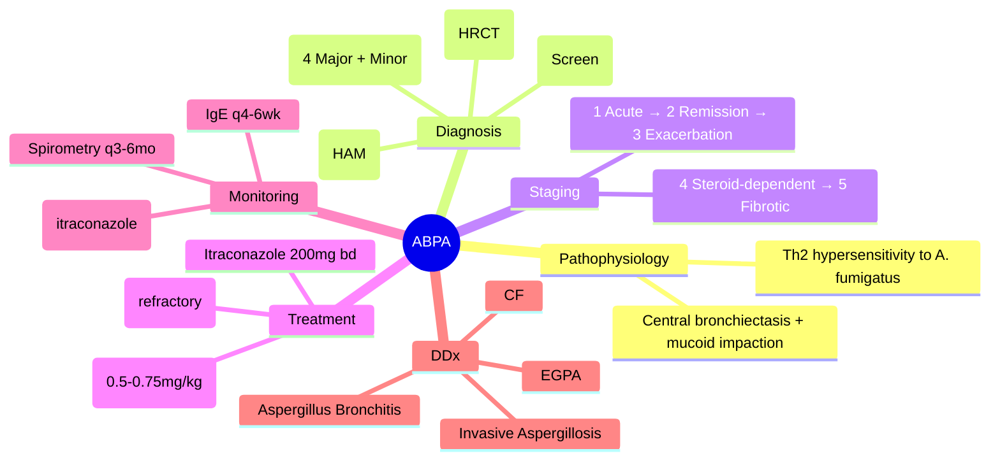

# ABPA and Bronchiectasis (Allergic Bronchopulmonary Aspergillosis)

Related: [[Bronchiectasis]], [[Asthma]], [[Cystic Fibrosis]], [[Eosinophilic lung disease]], [[Fungal pulmonary infections]], [[Bronchiectasis and suppurative airway disease]], [[Airway Diseases/ABPA and bronchiectasis|Bronchiectasis and suppurative airway disease]]

> [!important]
> **ABPA** is a hypersensitivity reaction to *Aspergillus fumigatus* causing central bronchiectasis, mucoid impaction, and progressive lung damage. It occurs in **asthma** (1-2%) and **CF** (7-15%). **Early diagnosis and steroids prevent irreversible fibrosis**. Key FCPS/MRCP: ISHAM criteria, central vs peripheral bronchiectasis, IgE monitoring, steroid-sparing agents, differentiation from CF/ABPA overlap.

## Learning Objectives
- Define ABPA and distinguish from simple *Aspergillus* colonisation/invasive aspergillosis
- Apply ISHAM diagnostic criteria (major/minor)
- Stage ABPA (acute, remission, exacerbation) and guide treatment escalation
- Apply steroid tapering protocols and recognise indications for itraconazole/biologics
- Differentiate ABPA bronchiectasis (central) from CF/post-infectious (peripheral)
- Monitor for complications: haemoptysis, pulmonary fibrosis, cor pulmonale

## Definition
**Allergic Bronchopulmonary Aspergillosis (ABPA)** = complex **Th2-mediated hypersensitivity** to *Aspergillus fumigatus* antigens in the airways, causing **airway inflammation, mucus hypersecretion, central bronchiectasis, and progressive lung damage**. Occurs in atopic individuals with **asthma** or **cystic fibrosis**.

## Core Anatomy & Pathophysiology
- **Central bronchiectasis**: proximal/medium bronchi (segmental/subsegmental) — **ABPA hallmark**
- **Mucoid impaction**: tenacious mucus plugs containing *A. fumigatus* hyphae, eosinophils, Charcot-Leyden crystals
- **Mechanism**: *A. fumigatus* spores germinate in mucus → release antigens → **Th2 response** (IL-4, IL-5, IL-13) → IgE/IgG production, eosinophilic inflammation, airway remodelling → **central bronchiectasis + mucoid impaction**
- **Immune complex** (type III) and **type I hypersensitivity** both contribute

## Clinical Features

### Typical Presentation
| Feature | Frequency | Notes |
|---------|-----------|-------|
| **Worsening asthma** | 90% | Inadequate control despite escalation |
| **Productive cough** | 80% | **Brownish/black mucus plugs** (classic) |
| **Fleeting pulmonary infiltrates** | 70% | Migratory, upper lobe predominance |
| **Low-grade fever** | 40% | |
| **Haemoptysis** | 30% | From bronchiectasis/erosion |
| **Weight loss/anorexia** | Variable | In active disease |

### Asthma vs CF Context
| Feature | **ABPA in Asthma** | **ABPA in CF** |
|---------|-------------------|----------------|
| Age at diagnosis | 20-40 yrs | 10-20 yrs (earlier) |
| Baseline lung function | Near normal | Already impaired |
| *A. fumigatus* sensitisation | Often unknown | Routine screening detects |
| Prognosis with treatment | Good | Poorer (baseline damage) |

## Investigations

### ISHAM Diagnostic Criteria (2013) — **Gold Standard**
| Category | Criteria |
|----------|----------|
| **Major (all 4 required for definitive ABPA)** | |
| 1. Asthma or CF | — |
| 2. **Serum total IgE >1000 IU/mL** | (or rising >2× baseline in known ABPA) |
| 3. **Positive *A. fumigatus* specific IgE** (skin prick or serum) | OR positive *A. fumigatus* IgG |
| 4. **Central bronchiectasis** on HRCT | (proximal > distal; *not* cylindrical peripheral) |
| **Minor (supportive, 2+ for probable ABPA)** | |
| 5. Peripheral blood eosinophilia >500 cells/µL | |
| 6. *Aspergillus* precipitins (IgG) positive | |
| 7. *A. fumigatus* in sputum (culture/PCR) | |
| 8. Mucoid impaction / high-attenuation mucus on HRCT | |

> **FCPS/MRCP tip**: Total IgE >1000 IU/mL is the **best single screening test**; if <1000, ABPA very unlikely. Rising IgE >2× baseline = exacerbation.

### HRCT Findings (Classic)
- **Central bronchiectasis** (proximal > distal; "signet ring" sign)
- **High-attenuation mucus** (HAM) — mucus plugs >70 HU on CT
- **Mucoid impaction** ("finger-in-glove" / "toothpaste" opacities)
- **Centrilobular nodules** / tree-in-bud (small airway involvement)
- **Peribronchial thickening**, mosaic attenuation

### Other Tests
| Test | Role |
|------|------|
| **Total serum IgE** | **Screening + monitoring** (baseline, then q1-2mo during treatment) |
| *A. fumigatus* specific IgE/IgG | Diagnostic confirmation |
| Skin prick test to *A. fumigatus* | Alternative to specific IgE |
| Sputum culture/PCR | *A. fumigatus* growth supports (not diagnostic alone) |
| Peripheral eosinophils | >500/µL supportive |
| Pulmonary function tests | Obstructive pattern; may show restriction if fibrosis |

## Staging (Patterson/Rosenberg — guides treatment)
| Stage | Clinical/IgE Features | Management |
|-------|----------------------|------------|
| **1. Acute** | New diagnosis: symptoms + IgE >1000 + eosinophilia / infiltrates | **Prednisolone 0.5-0.75 mg/kg/day** (2-8 weeks) + itraconazole |
| **2. Remission** | Asymptomatic, IgE ↓ >35-50% from peak, infiltrates cleared | Taper steroids over 3-6 months; continue itraconazole 6-12 mo |
| **3. Exacerbation** | Relapse: symptoms return + IgE **rises >2×** baseline (or >50% rise) | Re-treat as acute (stage 1) |
| **4. Glucocorticoid-dependent** | Relapse on taper / inability to wean <10 mg pred | Add/optimise itraconazole; consider biologics (omalizumab) |
| **5. Advanced/fibrotic** | Irreversible fibrosis, severe bronchiectasis, cor pulmonale | Symptomatic; bronchiectasis management; transplant eval |

## Management

### 1. Corticosteroids — **Mainstay**
- **Acute**: **Prednisolone 0.5-0.75 mg/kg/day** (typically 30-40 mg/day) for **2-4 weeks**, then taper over **3-6 months** guided by IgE
- **Target**: IgE decline **>35-50%** from peak
- **Avoid abrupt stop** → rebound exacerbation
- **Osteoporosis prophylaxis** (bisphosphonate, Ca²⁺/vit D) if >3 months

### 2. Antifungals — **Steroid-sparing / reducing fungal burden**
- **Itraconazole** 200 mg **bid** (400 mg/day) for **6-12 months**
  - Check levels (target >0.5 µg/mL), LFTs monthly (hepatotoxicity)
  - Interactions: CYP3A4 inhibitor (↑ steroid levels, ↑ tacrolimus/ciclosporin)
- **Voriconazole/Posaconazole** — alternatives if itraconazole intolerant/contraindicated

### 3. Biologics — **Refractory / steroid-dependent**
- **Omalizumab** (anti-IgE): 150-375 mg SC q2-4wk (dose by IgE/weight)
  - Evidence: reduces exacerbations, steroid dose, improves FEV₁
- **Mepolizumab/Benralizumab** (anti-IL5/IL5R) — eosinophilic phenotype

### 4. Bronchiectasis Management — **Parallel to ABPA treatment**
- **Airway clearance**: physiotherapy, nebulised hypertonic saline/DNase (if CF)
- **Antibiotics**: treat secondary infection (Haemophilus, Pseudomonas)
- **Vaccination**: pneumococcal, annual influenza, COVID-19

### 5. Exacerbation Management
- **IgE rise >2× baseline** (or >50% from nadir) + clinical worsening = relapse
- **Re-treat**: prednisolone 0.5 mg/kg/day + itraconazole (if not on it)
- **Investigate triggers**: non-adherence, new *Aspergillus* exposure, viral infection, steroid taper too fast

## Differential Diagnosis
| Condition | Differentiating Features |
|-----------|--------------------------|
| **Simple *Aspergillus* sensitisation** | IgE positive, **no bronchiectasis**, IgE <1000, no eosinophilia |
| **Invasive pulmonary aspergillosis** | Immunocompromised, **angioinvasion**, necrosis, halo sign, galactomannan +ve |
| **Aspergillus bronchitis** | Asthma + *Aspergillus* in sputum, **no bronchiectasis**, IgE normal/mildly raised |
| **EGPA (Churg-Strauss)** | **Systemic vasculitis**: neuropathy, purpura, cardiac, GI; ANCA +ve (40%) |
| **Eosinophilic asthma** | High eosinophils, high IgE, **no *Aspergillus* sensitisation**, no bronchiectasis |
| **CF lung disease** | Genetic confirm, multisystem, **pancreatic insufficiency**, chronic *Pseudomonas* |
| **TB / NTM** | Cavitation, positive culture/PCR, caseating granuloma |

## Complications
| Complication | Mechanism |
|--------------|-----------|
| **Massive haemoptysis** | Bronchial artery erosion from bronchiectasis |
| **Pulmonary fibrosis** | Chronic inflammation → irreversible restriction |
| **Cor pulmonale** | Advanced destruction → pulmonary hypertension |
| **Aspergilloma** | Fungal ball in pre-existing cavity (distinct from ABPA) |
| **Airway obstruction** | Massive mucoid impaction → atelectasis, respiratory failure |
| **Steroid complications** | Osteoporosis, diabetes, cataract, adrenal suppression |

## Monitoring Protocol
| Parameter | Frequency |
|-----------|-----------|
| **Total IgE** | Every 4-6 weeks during treatment; q3-6mo in remission |
| Spirometry (FEV₁, FVC) | q3-6 months |
| Chest X-ray / HRCT | Baseline, then if clinical change |
| LFTs (if on itraconazole) | Monthly × 3, then q3mo |
| Itraconazole level | After 2 weeks, then if dose change/toxicity |
| Eosinophil count | With IgE monitoring |

## FCPS/MRCP High-Yield Points
1. **ABPA = central bronchiectasis + high IgE (>1000) + *Aspergillus* sensitisation**
2. **ISHAM criteria**: 4 major (asthma/CF, IgE>1000, specific IgE, central bronchiectasis) + minor
3. **Central bronchiectasis** = proximal > distal (vs CF/post-infectious = peripheral)
4. **High-attenuation mucus (HAM)** on CT = pathognomonic
5. **Total IgE >1000** = screening threshold; **rising >2× baseline** = exacerbation
5. **Treatment**: prednisolone 0.5-0.75 mg/kg + **itraconazole 200 mg bd** (6-12 mo)
6. **Omalizumab** for steroid-dependent/refractory
7. **Monitor IgE** — guides taper; don't taper if IgE rising
7. **CF + ABPA** = earlier onset, worse prognosis, screen annually
8. **Differentiate** from invasive aspergillosis (immunocompromised, angioinvasion)

## Common Viva Questions
1. ISHAM diagnostic criteria for ABPA
2. Difference between ABPA bronchiectasis (central) and CF bronchiectasis (peripheral)
3. Significance of total IgE in ABPA (diagnosis, monitoring, exacerbation)
4. Steroid tapering protocol and role of itraconazole
5. Indications for omalizumab in ABPA
6. Differentiate ABPA from invasive aspergillosis / Aspergillus bronchitis
7. HRCT findings in ABPA (central bronchiectasis, HAM)
8. Complications of ABPA and management of massive haemoptysis

## Common Confusions / Exam Traps
- **IgE <1000** ≠ excludes ABPA if **known ABPA with rising IgE** (exacerbation)
- **Peripheral bronchiectasis** = **NOT** ABPA (think CF, post-infectious, immunodeficiency)
- **Aspergillus bronchitis** ≠ ABPA (no bronchiectasis, normal IgE)
- **Invasive aspergillosis** in immunocompetent = **wrong** (needs immunocompromise)
- **Stopping steroids abruptly** → rebound exacerbation (must taper by IgE)
- **Itraconazole + steroids** = ↑ steroid levels (CYP3A4 inhibition) → watch for Cushing's
- **Omalizumab** requires elevated IgE (30-1500 IU/mL) and weight-based dosing

## Mnemonics
- **ABPA ISHAM MAJOR**: **A**sthma/CF, **I**gE>1000, **S**pecific IgE, **H**RCT-central bronx
- **ABPA TREATMENT**: **P**rednisolone, **I**traconazole, **O**malizumab (refractory)
- **CENTRAL vs PERIPHERAL**: **ABPA = CENTRAL** (proximal); **CF/POST-INFECT = PERIPHERAL**
- **IgE MONITORING**: **Acute >1000**, **Exacerbation = 2× rise**, **Remission = >50% drop**

## Mind Map


## Flowchart
```mermaid
flowchart TD
  A[Asthma/CF + Worsening Symptoms\n+ Brown Mucus Plugs] --> B{Total IgE >1000?}
  B -->|No| C[Unlikely ABPA\nConsider other causes]
  B -->|Yes| D[*A. fumigatus* Sensitisation?\nIgE/IgG +ve or Skin Prick +ve]
  D -->|No| E[Simple Sensitisation\nNot ABPA]
  D -->|Yes| F[HRCT Chest]
  F --> G{Central Bronchiectasis\n+ HAM?}
  G -->|Yes| H[ABPA DIAGNOSED\nStage 1-5]
  G -->|No| I[Probable ABPA\n(Minor criteria met?)]
  H --> J[Stage & Treat:\nPrednisolone 0.5-0.75mg/kg\n+ Itraconazole 200mg bd\nMonitor IgE q4-6wk]
  I --> J
  J --> K{Exacerbation?\nIgE rising >2x baseline}
  K -->|Yes| L[Re-treat as Acute]
  K -->|No| M[Taper by IgE\nMaintain Itraconazole 6-12mo]
```

## Suggested Visuals / Image Notes
- ISHAM criteria table
- Central vs peripheral bronchiectasis HRCT comparison
- High-attenuation mucus (HAM) on CT
- ABPA staging and treatment flowchart
- IgE monitoring curve (acute → remission → exacerbation)

## Suggested Video References
- ABPA diagnosis and management (ERS/ATS guidelines)
- HRCT interpretation: central bronchiectasis vs peripheral
- Omalizumab in severe asthma/ABPA

## One-Page Revision Summary
- **ABPA** = Th2 hypersensitivity to *A. fumigatus* → central bronchiectasis + mucoid impaction
- **ISHAM**: Asthma/CF + IgE>1000 + *Aspergillus* IgE + **central bronchiectasis** = definitive
- **Central bronchiectasis** (proximal) = ABPA hallmark; peripheral = CF/post-infectious
- **IgE >1000** screening; **IgE rising >2× baseline** = exacerbation trigger
- **Treatment**: prednisolone 0.5-0.75 mg/kg/day + itraconazole 200 mg bd × 6-12 mo
- **Taper steroids** by IgE (target >35-50% drop); **omalizumab** if steroid-dependent
- **Central vs peripheral**: ABPA = central; CF = peripheral
- **Complications**: haemoptysis, fibrosis, cor pulmonale, aspergilloma

## 24-Hour Recall Prompts
- List 4 ISHAM major criteria
- Contrast central vs peripheral bronchiectasis
- State steroid + itraconazole dosing and duration
- Define IgE criteria for acute, remission, exacerbation

## 7-Day / 15-Day / 30-Day Revision Tracker
- [ ] Day 1 completed
- [ ] 24-hour recall completed
- [ ] Day 7 revision completed
- [ ] Day 15 revision completed
- [ ] Day 30 revision completed

## Must Know / Should Know / Nice to Know
### Must Know
- ISHAM 4 major criteria
- Central bronchiectasis + high IgE = ABPA
- Prednisolone + itraconazole = standard treatment
- IgE monitoring for taper/exacerbation
- Central bronchiectasis = ABPA; peripheral = CF

### Should Know
- Staging (acute → remission → exacerbation → steroid-dependent → fibrotic)
- Itraconazole interactions (CYP3A4)
- Omalizumab indications (steroid-dependent, IgE 30-1500)
- High-attenuation mucus (HAM) on CT
- CF-ABPA differences (earlier onset, worse prognosis)

### Nice to Know
- Biologics beyond omalizumab (mepolizumab, benralizumab)
- Voriconazole/posaconazole as alternatives
- Genetic predisposition (HLA-DR2, HLA-DQ2)
- Long-term lung function trajectory

## Self-Test Scorecard
- Understanding: /10
- Recall: /10
- MCQ Performance: /10
- SBA Performance: /10
- Viva Confidence: /10
- Total: /50

> [!tip]
> Interpretation: <35 = weak topic, 35-44 = acceptable but insecure, 45+ = strong exam-ready topic.

## Exam Answer Modes
### Long Answer Skeleton
- Definition + pathophysiology (Th2, central bronchiectasis, mucoid impaction)
- ISHAM criteria (4 major + minors)
- Staging (5 stages)
- HRCT findings (central bronchiectasis, HAM)
- Management: steroids + itraconazole + biologics
- Monitoring (IgE, spirometry, LFTs)
- Differentials + complications

### Short Note Skeleton
- ISHAM criteria box
- Staging table
- Treatment algorithm
- Central vs peripheral bronchiectasis comparison

### Viva One-Liners
- "ABPA = asthma/CF + IgE>1000 + *Aspergillus* sensitivity + **central bronchiectasis**"
- **ISHAM major**: Asthma/CF, IgE>1000, *Aspergillus* IgE, **central bronchiectasis**
- "Central bronchiectasis = ABPA; Peripheral = CF/post-infectious"
- "IgE >1000 = screen; >2× rise = exacerbation; >50% drop = remission"
- "Steroids 0.5-0.75mg/kg + Itraconazole 200mg bd 6-12mo"
- "Omalizumab if steroid-dependent/refractory (IgE 30-1500)"
- "Central bronchiectasis = ABPA; Peripheral = CF"
- "HAM on CT = pathognomonic ABPA"
- "Itraconazole ↑ steroid levels (CYP3A4)"

### Ward-Case Discussion Points
- Asthmatic with recurrent wheeze, brown plugs, eosinophilia → check IgE, *Aspergillus* IgE, HRCT
- ABPA on taper, IgE rising from 800 to 2000 → exacerbation, re-treat with steroids
- CF patient screened annually for ABPA → *Aspergillus* IgE + IgE + CXR/HRCT if elevated
- Massive haemoptysis in known ABPA → bronchial artery embolisation + antibiotics

### Last-Night-Before-Exam Sheet
- ISHAM: Asthma/CF + IgE>1000 + Asp IgE + Central Bronx
- Central = ABPA; Peripheral = CF
- IgE: >1000 screen, 2x rise exacerbation, 50% drop remission
- Tx: Pred 0.5-0.75mg/kg + Itra 200bd 6-12mo
- Omalizumab: steroid-dependent, IgE 30-1500
- HAM on CT = pathognomonic
- Itra + steroids = CYP3A4 interaction

## Summary
ABPA = Th2 hypersensitivity to *A. fumigatus* in asthma/CF → **central bronchiectasis**, mucoid impaction, high IgE. **ISHAM**: 4 major (asthma/CF, IgE>1000, *Aspergillus* specific IgE, **central bronchiectasis**). **HRCT**: central bronchiectasis + **high-attenuation mucus (HAM)**. **Total IgE >1000** = screen; **rising >2× baseline** = exacerbation. **Treatment**: prednisolone 0.5-0.75 mg/kg/day + **itraconazole 200 mg bd 6-12 months**; taper steroids by IgE (>50% drop = remission). **Omalizumab** for steroid-dependent. **Monitor**: IgE q4-6wk, spirometry q3-6mo, LFTs on itraconazole. **Central bronchiectasis = ABPA**; peripheral = CF/post-infectious. Complications: haemoptysis, fibrosis, cor pulmonale.

## MCQs (10)
1. Which of the following is a **major ISHAM criterion** for ABPA?
   A. Peripheral blood eosinophilia >500/µL
   B. *Aspergillus* precipitins positive
   C. **Central bronchiectasis on HRCT**
   D. Mucoid impaction on imaging
2. **Total serum IgE** in a patient with known ABPA rises from 800 to 2200 IU/mL. This indicates:
   A. Remission
   B. **Exacerbation**
   C. Treatment failure
   D. Need for omalizumab
3. **Central bronchiectasis** (proximal > distal) is characteristic of:
   A. Cystic fibrosis
   B. **ABPA**
   C. Post-tuberculous bronchiectasis
   D. Primary ciliary dyskinesia
4. First-line treatment for acute ABPA:
   A. Itraconazole alone
   B. **Prednisolone 0.5-0.75 mg/kg/day + Itraconazole 200 mg bd**
   C. Omalizumab
   D. Voriconazole
5. Which CT finding is **pathognomonic** for ABPA?
   A. Tree-in-bud
   B. **High-attenuation mucus (HAM)**
   C. Ground-glass opacities
   D. Centrilobular emphysema

## SBA Questions (10)
1. A 28-year-old asthmatic presents with wheeze, brown mucus plugs, and eosinophilia. IgE 2500 IU/mL, *Aspergillus* IgE positive. HRCT shows central bronchiectasis with high-attenuation mucus. What is the diagnosis?
   A. Simple *Aspergillus* sensitisation
   B. **ABPA**
   C. Invasive pulmonary aspergillosis
   D. EGPA
2. Same patient started on prednisolone 40 mg/day + itraconazole 200 mg bd. After 8 weeks, IgE falls to 1000. Next step:
   A. Stop steroids abruptly
   B. **Taper prednisolone gradually over 3-6 months guided by IgE**
   C. Switch to oral itraconazole only
   D. Add omalizumab
3. A 16-year-old with CF is screened for ABPA. Which finding **excludes** ABPA?
   A. IgE 1200 IU/mL
   B. **Peripheral bronchiectasis only**
   C. *Aspergillus* IgE positive
   C. Pulmonary infiltrates
4. Patient with ABPA on prednisolone taper develops wheeze and IgE rises from 600 to 1800. Management:
   A. Increase itraconazole dose
   B. **Re-treat as acute exacerbation (prednisolone + itraconazole)**
   C. Add omalizumab
   D. Stop steroids
5. Which is an indication for **omalizumab** in ABPA?
   A. First presentation
   B. Mild exacerbation
   C. **Steroid-dependent / refractory to steroids + itraconazole**
   D. Mild asthma control
6. HRCT finding **specific** for ABPA:
   A. Tree-in-bud
   B. **High-attenuation mucus (HAM)**
   C. Mosaic attenuation
   D. Centrilobular nodules
7. **Itraconazole** drug interaction with corticosteroids:
   A. Decreases steroid levels
   B. **Increases steroid levels (CYP3A4 inhibition)**
   C. No interaction
   D. Antagonises steroid effect
8. Differentiating **ABPA bronchiectasis** from **CF bronchiectasis**:
   A. ABPA = peripheral; CF = central
   B. **ABPA = central; CF = peripheral**
   C. Both central
   D. Both peripheral
9. Monitoring parameter for ABPA activity:
   A. ESR
   B. **Total serum IgE**
   C. CRP
   D. Absolute neutrophil count
10. Complication of **long-standing untreated ABPA**:
    A. Pulmonary fibrosis
    B. Cor pulmonale
    C. Massive haemoptysis
    D. **All of the above**

## Flashcards
- Q: 4 ISHAM major criteria for ABPA
  A: Asthma/CF, IgE>1000, *Aspergillus* specific IgE, Central bronchiectasis
- Q: ABPA bronchiectasis distribution
  A: Central (proximal > distal)
- Q: CF bronchiectasis distribution
  A: Peripheral (upper lobe predominant)
- Q: IgE exacerbation threshold
  A: >2× rise from baseline/nadir
- Q: Steroid taper target
  A: >35-50% drop from peak IgE
- Q: Acute ABPA treatment
  A: Pred 0.5-0.75mg/kg + Itraconazole 200mg bd 6-12mo
- Q: Omalizumab indication in ABPA
  A: Steroid-dependent/refractory, IgE 30-1500
- Q: HAM on CT
  A: High-attenuation mucus >70 HU (pathognomonic)
- Q: Itraconazole + steroids interaction
  A: CYP3A4 inhibition → ↑ steroid levels
- Q: Central bronchiectasis = ABPA; Peripheral = CF

## Answer Key with Explanations
### MCQs
1. **C** — Central bronchiectasis on HRCT is a major criterion; eosinophilia/precipitins/mucoid impaction are minor.
2. **B** — Rising IgE >2× baseline = exacerbation per ISHAM.
3. **B** — ABPA = central/proximal bronchiectasis; CF/post-infectious = peripheral.
4. **B** — Combined steroids + itraconazole is standard; itraconazole alone insufficient.
5. **B** — HAM (>70 HU mucus) is pathognomonic for ABPA.

### SBAs
1. **B** — Meets 4 major ISHAM criteria = definitive ABPA.
2. **B** — IgE fell >50% → remission → taper steroids over 3-6 months guided by IgE.
3. **B** — ABPA = central bronchiectasis; peripheral only argues against ABPA.
4. **B** — IgE >2× rise = exacerbation → re-treat as acute (steroids + itraconazole).
5. **C** — Omalizumab for steroid-dependent/refractory ABPA.
6. **B** — HAM is pathognomonic for ABPA.
7. **B** — Itraconazole inhibits CYP3A4 → ↑ steroid exposure (monitor for Cushing's).
8. **B** — ABPA = central/proximal; CF/post-infectious = peripheral/distal.
9. **B** — Total IgE is the key monitoring biomarker in ABPA.
10. **D** — All are recognised complications of chronic ABPA.

---
## Additional MCQs (6–10)

6. Total serum IgE threshold suggesting **active ABPA**:
   A. <100 IU/mL
   B. **>1000 IU/mL (or 2× rise from baseline)**
   C. <500 IU/mL
   D. 100 IU/mL
   E. 0 IU/mL
   **Answer: B** — >1000 IU/mL or 2× rise from baseline suggests active disease.

7. Skin-prick test in ABPA typically shows:
   A. Negative to *Aspergillus*
   B. **Immediate cutaneous reactivity (Type I) to *A. fumigatus***
   C. Only Type III reaction
   D. No reaction
   E. Only RAST positive
   **Answer: B** — Type I immediate cutaneous reactivity is diagnostic.

8. First-line treatment of acute ABPA:
   A. Itraconazole alone
   B. **Prednisolone 0.5 mg/kg/day + itraconazole 200 mg BD (as steroid-sparing)**
   C. Voriconazole
   D. Omalizumab only
   E. Surgery
   **Answer: B** — Prednisolone + itraconazole is first-line.

9. Radiological hallmark of ABPA on HRCT:
   A. Tree-in-bud
   B. **Central (proximal) bronchiectasis + high-attenuation mucus (HAM)**
   C. Diffuse emphysema
   D. Pleural effusion
   E. Cavitation only
   **Answer: B** — Central bronchiectasis with HAM is pathognomonic.

10. ABPA is classified by Rosenberg-Patterson staging. Stage III is:
    A. Acute
    B. Remission
    C. **Exacerbation**
    D. Corticosteroid-dependent
    E. Fibrotic
    **Answer: C** — Stage III = exacerbation; Stage V = fibrotic (end-stage).

## Additional SBAs (6–10)

6. ABPA in CF: prevalence:
   A. <1%
   B. **5–15%**
   C. 50%
   D. 90%
   E. 0%
   **Answer: B** — 5–15% of CF patients develop ABPA.

7. A CF patient with new wheeze, ↓FEV₁, ↑IgE to 2000, central bronchiectasis on CT. Next step:
   A. Antibiotics
   B. **Prednisolone + itraconazole + repeat sputum culture**
   C. Bronchoscopy
   D. Surgery
   E. No action
   **Answer: B** — Treat as ABPA exacerbation.

8. Omalizumab in ABPA:
   A. First-line
   B. **Considered in steroid-dependent ABPA**
   C. Never
   D. Always
   E. Routine
   **Answer: B** — Steroid-sparing option in refractory ABPA.

9. Itraconazole in ABPA:
   A. Monotherapy
   B. **Steroid-sparing antifungal add-on (target level monitoring)**
   C. Never
   D. For all patients always
   E. First-line
   **Answer: B** — Steroid-sparing; monitor levels.

10. ABPA without treatment can lead to:
    A. Resolution
    B. **Progressive bronchiectasis and pulmonary fibrosis**
    C. Pneumothorax only
    D. Nothing
    E. Asthma only
    **Answer: B** — Untreated ABPA → progressive fibrosis.

## Local Navigation
- **Parent Heading**: [[../Airway Diseases|Airway Diseases]]
- **Parent Topic Group**: [[../Airway Diseases/Bronchiectasis and suppurative airway disease|Bronchiectasis and suppurative airway disease]]
- **Chapter Map**: [[../Davidson Chapter 17 - Respiratory Medicine Hierarchy|Respiratory Medicine Hierarchy]]
- **Chapter MOC**: [[../Respiratory MOC|Respiratory MOC]]
- **Drug Reference**: [[../../Clinical Therapeutics and Good Prescribing|Drugs]]
- **Related**: [[Bronchiectasis]] · [[Asthma]] · [[Cystic fibrosis-related bronchiectasis]] · [[Pulmonary aspergillosis syndromes]]
