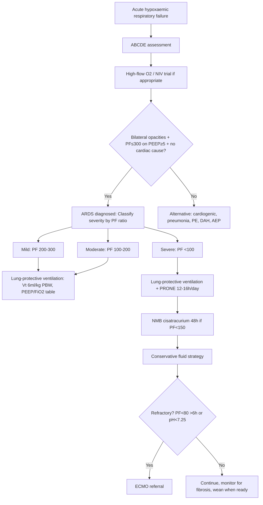
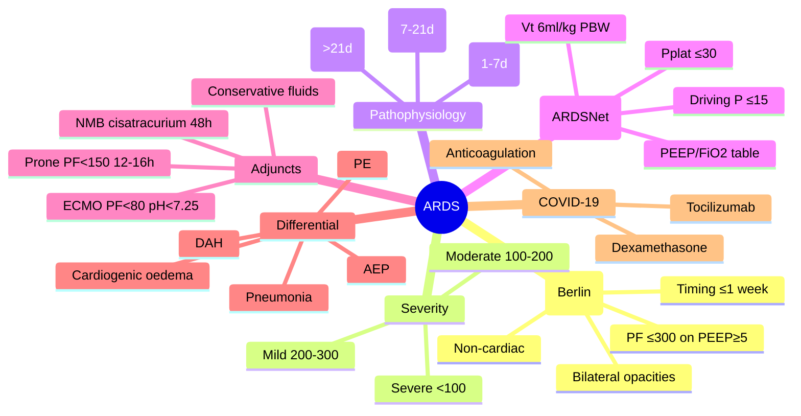
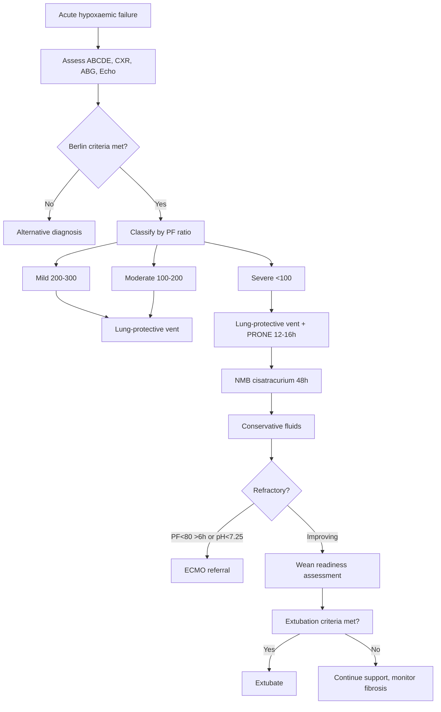

# ARDS (Acute Respiratory Distress Syndrome)

Related: [[Respiratory Failure]], [[Type 1 respiratory failure]], [[Mechanical ventilation]], [[NIV failure and escalation triggers]], [[Indications for intubation in respiratory disease]], [[Ventilatory support and escalation]], [[Pneumonia]], [[Sepsis]]

> [!important]
> **ARDS** = acute diffuse inflammatory lung injury causing **non-cardiogenic pulmonary oedema**, **severe hypoxaemia**, and **decreased lung compliance**. **Berlin Definition 2012**: onset ≤1 week, bilateral opacities, PF ratio ≤300 on PEEP ≥5, not fully explained by cardiac failure. Key FCPS/MRCP: Berlin criteria, PF ratio stratification, lung-protective ventilation (low Vt, PEEP), prone positioning, fluid conservative strategy, ECMO criteria.

## Learning Objectives
- Apply **Berlin Definition** to diagnose and classify ARDS severity
- Calculate and interpret **PF ratio** (PaO2/FiO2) for severity stratification
- Understand pathophysiology: exudative → proliferative → fibrotic phases
- Apply **lung-protective ventilation** (ARDSNet: low Vt 6ml/kg PBW, PEEP/FiO2 table, plateau pressure ≤30)
- Indications for **prone positioning**, **neuromuscular blockade**, **ECMO**
- Differentiate from cardiogenic pulmonary oedema, pneumonia, acute eosinophilic pneumonia, DAH

## Definition (Berlin 2012)
**ARDS** = acute respiratory failure with **all** of:
1. **Timing**: onset ≤1 week of known clinical insult or new/worsening respiratory symptoms
2. **Imaging**: bilateral opacities on CXR/CT not fully explained by effusions, atelectasis, nodules
3.  **Origin of oedema**: respiratory failure not fully explained by cardiac failure/fluid overload (need objective assessment e.g. echo)
4. **Oxygenation** (on PEEP ≥5 cmH2O):
   - **Mild**: PF ratio 200–300
   - **Moderate**: PF ratio 100–200
   - **Severe**: PF ratio <100

> **FCPS/MRCP tip**: PF ratio = **PaO2 (mmHg) / FiO2**. Must be on **PEEP ≥5** (or CPAP ≥5). If altitude corrected: PF ratio × (PB/760).

## Core Anatomy
### 1. Alveolar-capillary unit
- Type I pneumocytes: thin gas exchange surface (95% area)
- Type II pneumocytes: surfactant production, progenitor for type I repair
- Capillary endothelium: continuous, tight junctions
- Basement membrane: shared in many areas
- Interstitium: fluid, cells, collagen, elastin

### 2. Normal barrier function
- Endothelial + epithelial barrier restricts protein-rich fluid
- Surfactant reduces surface tension, prevents collapse
- Lymphatics drain filtrate (up to 20 L/day capacity)

### 3. In ARDS
- **Endothelial injury** → capillary leak → protein-rich oedema
- **Epithelial injury** → loss of surfactant, impaired fluid clearance
- **Inflammatory cells** (neutrophils, macrophages) → cytokines, proteases, ROS
- **Microthrombi** in capillaries → dead space ↑

## Core Physiology
### 1. Pathophysiological phases
| Phase | Days | Histology | Physiology |
|-------|------|-----------|------------|
| **Exudative** | 1–7 | Neutrophils, protein-rich oedema, hyaline membranes | Severe hypoxaemia, low compliance, high dead space |
| **Proliferative** | 7–21 | Type II hyperplasia, fibroblast proliferation, collagen | Improving gas exchange, but fibrosis risk |
| **Fibrotic** | >21 | Extensive collagen deposition, architectural distortion | Persistent low compliance, ventilator dependence, pulmonary hypertension |

### 2. Gas exchange abnormalities
- **Severe V/Q mismatch + shunt** → refractory hypoxaemia
- **Increased dead space** (microthrombi, emphysematous areas) → hypercapnia if severe
- **Low compliance** → high work of breathing, high pressures needed

### 3. Haemodynamics
- Hypoxic pulmonary vasoconstriction → pulmonary hypertension
- Right ventricular strain → cor pulmonale (acute)
- High intrathoracic pressure (PEEP) → reduced venous return, hypotension

## Normal Values / Important Cut-offs
### Berlin PF Ratio Stratification
| Severity | PF Ratio (on PEEP ≥5) | Mortality (approx) |
|----------|----------------------|-------------------|
| Mild | 200 < PF ≤ 300 | ~27% |
| Moderate | 100 < PF ≤ 200 | ~32% |
| Severe | PF ≤ 100 | ~45% |

### Ventilation targets (ARDSNet)
| Parameter | Target |
|-----------|--------|
| **Tidal volume** | **6 ml/kg PBW** (predicted body weight) |
| **Plateau pressure (Pplat)** | **≤30 cmH2O** |
| **Driving pressure (Pplat - PEEP)** | **≤15 cmH2O** (strongest mortality predictor) |
| **PEEP** | Per **PEEP/FiO2 table** (higher for severe) |
| **pH** | **7.30–7.45** (permissive hypercapnia allowed) |
| **FiO2** | Titrate to **SpO2 88–95%** (PaO2 55–80 mmHg) |
| **Respiratory rate** | Up to **35/min** to manage pH |

### Prone positioning criteria
- **Severe ARDS**: PF ratio **<150** on PEEP ≥5, FiO2 ≥0.6
- Duration: **12–16+ hours/day**
- Proven mortality benefit in severe ARDS (PROSEVA trial)

### ECMO criteria (EOLIA / ELSO)
- Severe ARDS + **PF ratio <80** for >6h despite optimal ventilation **OR**
- PF ratio **<50** for >3h **OR**
- pH **<7.25** with Pplat ≤30 **OR**
- Murray score ≥3–4 / uncompensated hypercapnia

## Classification
### 1. By Berlin severity
- Mild / Moderate / Severe (as above)

### 2. By aetiology (direct vs indirect lung injury)
| Direct (pulmonary) | Indirect (extrapulmonary) |
|--------------------|---------------------------|
| Pneumonia (bacterial, viral, fungal) | Sepsis (non-pulmonary) |
| Aspiration (gastric, near-drowning) | Severe trauma/burns |
| Inhalation injury (smoke, chemicals) | Acute pancreatitis |
| Pulmonary contusion | Massive transfusion/TRALI |
| Lung transplant reperfusion | Drug overdose (heroin, etc.) |
| Fat embolism | Cardiopulmonary bypass |

> **FCPS/MRCP tip**: Direct injury → more focal initially, higher dead space. Indirect → more diffuse, more extrapulmonary organ failure.

### 3. By aetiology (specific causes)
- **Infection**: bacterial pneumonia (most common), viral (influenza, COVID-19), fungal
- **Aspiration**
- **Sepsis** (non-pulmonary)
- **Trauma** (pulmonary contusion, fat embolism, massive transfusion)
- **Pancreatitis**
- **Transfusion** (TRALI)
- **Inhalation injury**
- **Drug toxicity** (amiodarone, chemotherapy, heroin)

## Etiology / Causes
### Common causes (majority of cases)
1. **Pneumonia** (~40-50%)
2. **Sepsis (non-pulmonary)** (~30%)
3. **Aspiration**
4. **Trauma** (with/without transfusion)
5. **Pancreatitis**

### Less common
- TRALI (transfusion-related acute lung injury)
- Fat embolism (long bone fracture)
- Inhalation injury
- Drug-induced (amiodarone, methotrexate, checkpoint inhibitors)
- Near-drowning
- Cardiopulmonary bypass
- Autoimmune (DAH, EGPA)

## Risk Factors
- Alcohol misuse
- Smoking
- Obesity
- Chronic liver disease
- Genetic polymorphisms (SP-A, SP-B, ACE, TNF-α)
- Age >70
- Pre-existing chronic lung disease (controversial)

## Pathophysiology
### Exudative phase (days 1–7)
1. **Trigger** → alveolar macrophage activation
2. **Cytokine storm**: TNF-α, IL-1, IL-6, IL-8 → neutrophil recruitment
3. **Neutrophil activation**: ROS, proteases, NETs → endothelial/epithelial injury
4. **Barrier breakdown** → protein-rich oedema floods alveoli
5. **Surfactant inactivation** → atelectasis, low compliance
6. **Hyaline membranes** form (fibrin + cellular debris)
7. **Microthrombi** → dead space ↑, pulmonary hypertension

### Proliferative phase (days 7–21)
- Type II pneumocyte hyperplasia
- Fibroblast proliferation → collagen deposition
- Resolution begins if injury controlled
- May progress to fibrosis if ongoing injury

### Fibrotic phase (>21 days)
- Extensive collagen, architectural distortion
- Persistent low compliance
- Pulmonary hypertension, cor pulmonale
- Ventilator dependence

## Clinical Features
### History
- Acute dyspnoea within 1 week of known insult
- Underlying cause: fever (pneumonia/sepsis), trauma, transfusion, pancreatitis, aspiration
- Rapid progression

### Examination
- **Severe respiratory distress**: tachypnoea, accessory muscle use
- **Hypoxaemia** refractory to oxygen
- **Bilateral crackles** (diffuse, often mid-inspiratory)
- **Tachycardia**, hypotension (if sepsis/shock or high PEEP)
- **Cyanosis** in severe cases
- **Signs of underlying cause**: pneumonia (focal signs), sepsis (vasodilatory shock), trauma

### ARDS vs Cardiogenic Pulmonary Oedema
| Feature | ARDS | Cardiogenic Oedema |
|---------|------|-------------------|
| **Onset** | ≤1 week of insult | Acute, often nocturnal |
| **CXR** | Bilateral diffuse, often patchy | Bilateral perihilar/bat-wing, Kerley B, effusions |
| **PAOP / Echo** | Normal (≤18 mmHg) / normal LV | Elevated PAOP / LV dysfunction |
| **Oedema fluid** | Protein-rich (ratio >0.65) | Protein-poor (transudate) |
| **Response to diuresis** | Poor | Good |
| **Compliance** | Markedly reduced | Less reduced |

## Approach / Emergency Algorithm


## Investigations
### Essential
- **ABG** on known FiO2 + PEEP → calculate PF ratio
- **CXR** (portable): bilateral opacities, exclude pneumothorax, effusions
- **Echo** (bedside): exclude LV failure, assess RV function, estimate PA pressure
- **ECG**: exclude MI, arrhythmia

### To identify cause
- **Blood cultures** ×2 before antibiotics
- **Sputum** Gram stain, culture, PCR/viral panel
- **Urinary antigens**: Legionella, Pneumococcus
- **Procalcitonin** (trend for bacterial infection)
- **Bronchoscopy + BAL** if unclear / immunocompromised / suspected DAH

### Severity / monitoring
- **Daily PF ratio** on PEEP ≥5
- **Lactate** (tissue perfusion)
- **Renal/hepatic function**, coagulation
- **Fluid balance** (conservative strategy target: negative 0.5–1L/day after resuscitation)

## Interpretation Frameworks
### 1. PF Ratio calculation
```
PF ratio = PaO2 (mmHg) / FiO2
Example: PaO2 80 mmHg on FiO2 0.6 (60%) = 80/0.6 = 133 → Moderate ARDS
```
**Must be on PEEP ≥5** (or CPAP ≥5). If not intubated, CPAP needed.

### 2. Berlin criteria checklist
- [ ] Onset ≤1 week
- [ ] Bilateral opacities on CXR/CT
- [ ] PF ratio ≤300 on PEEP ≥5
- [ ] Not fully explained by cardiac failure (echo required)
- [ ] Classify: Mild 200-300, Moderate 100-200, Severe <100

### 3. Driving pressure
**Pplat - PEEP** = driving pressure
- ≤15 cmH2O associated with lower mortality
- >15 → consider increasing PEEP, reducing Vt further, prone, NMB

### 4. Murray Lung Injury Score (if needed)
4 components (0–4 each): CXR, PF ratio, PEEP, compliance → mean score
- **≥2.5** = ARDS (older definition)
- **≥3** = severe

## Diagnosis
**Clinical diagnosis** using Berlin criteria. No single gold standard test.

**Required for diagnosis:**
1. Acute onset ≤1 week
2. Bilateral CXR/CT opacities
3. PF ratio ≤300 on PEEP ≥5
4. Objective exclusion of hydrostatic oedema (echo, PAOP if Swan-Ganz)

**Supportive:**
- High protein oedema fluid (if BAL done)
- Lung biopsy (rarely needed): DAD (diffuse alveolar damage)

## Differential Diagnosis
| Differential | Key Clues |
|--------------|-----------|
| **Cardiogenic pulmonary oedema** | Elevated JVP, S3, peripheral oedema, cardiomegaly, Kerley B, echo shows LV dysfunction, BNP high |
| **Severe pneumonia** | Focal consolidation, fever, leucocytosis, may meet ARDS criteria if diffuse (ARDS can be *caused* by pneumonia) |
| **Acute eosinophilic pneumonia** | Acute, eosinophilia in BAL >25%, often smoking-related, dramatic steroid response |
| **Diffuse alveolar haemorrhage (DAH)** | Haemoptysis, anaemia, bloody BAL, dietary-GBM, ANCA, lupus |
| **Pulmonary embolism (massive)** | Sudden, RV strain on echo, CTPE, D-dimer, clear CXR usually |
| **Exacerbation of IPF** | Known IPF, UIP pattern on HRCT, acute worsening, biopsy: DAD on UIP |
| **Acute interstitial pneumonitis (AIP)** | Idiopathic, fulminant, biopsy: DAD, no known cause |

## Management
### 1. Lung-protective ventilation (ARDSNet protocol) — **CORNERSTONE**
| Parameter | Setting |
|-----------|---------|
| **Tidal volume** | **6 ml/kg PBW** (predicted body weight by height/sex) |
| **Plateau pressure** | **≤30 cmH2O** (reduce Vt to 4 ml/kg if needed) |
| **PEEP** | **PEEP/FiO2 table** (higher PEEP for severe) |
| **FiO2** | Titrate to **SpO2 88–95%** (PaO2 55–80) |
| **Respiratory rate** | Up to 35/min for pH 7.30–7.45 |
| **Permissive hypercapnia** | Accept pH ≥7.15 (some guidelines 7.20) |

**PBW calculation:**
- Male: 50 + 0.91 × (height cm - 152.4)
- Female: 45.5 + 0.91 × (height cm - 152.4)

### 2. PEEP/FiO2 Table (ARDSNet high PEEP for moderate-severe)
| FiO2 | 0.3 | 0.4 | 0.4 | 0.5 | 0.5 | 0.6 | 0.7 | 0.7 | 0.8 | 0.9 | 0.9 | 1.0 |
|------|-----|-----|-----|-----|-----|-----|-----|-----|-----|-----|-----|-----|
| PEEP | 5   | 5   | 8   | 8   | 10  | 10  | 10  | 12  | 14  | 14  | 16  | 18-24 |

### 3. Prone positioning
- **Indication**: **Severe ARDS** (PF <150 on PEEP ≥5, FiO2 ≥0.6)
- **Duration**: **12–16+ hours/day**
- **Mechanism**: improves dorsal recruitment, V/Q matching, secretion drainage
- **PROSEVA trial**: mortality benefit in severe ARDS
- **Contraindications**: unstable spine, facial trauma, recent abdominal surgery, raised ICP, haemodynamic instability

### 4. Neuromuscular blockade (NMB)
- **Agent**: **Cisatracurium** (no renal/hepatic metabolism, no cumulative effect)
- **Indication**: **Severe ARDS (PF <150)** early (first 48h)
- **Duration**: **48 hours** continuous infusion
- **Monitoring**: Train-of-four (target 1–2 twitches) or BIS
- **ACURASYS/PROSEVA**: mortality benefit when combined with prone

### 5. Fluid management
- **Conservative strategy** after initial resuscitation (FACTT trial)
- Target: **negative fluid balance 0.5–1 L/day**
- Avoid overload → worse oxygenation, longer ventilation
- **Caution**: maintain perfusion if shock/sepsis (dynamic assessment)

### 6. Adjunctive therapies
| Therapy | Evidence | Use |
|---------|----------|-----|
| **Inhaled NO / prostacyclin** | Transient PF improvement, **no mortality benefit** | Rescue for severe hypoxaemia, bridge to ECMO |
| **Corticosteroids** | Mixed; **may help in fibroproliferative phase (>7d)** or COVID-19 | Consider day 7+ if not improving; **DEXA 6mg/d ×10d** for COVID |
| **ECMO (VV-ECMO)** | EOLIA: trend to benefit; CESAR: benefit | Refractory severe ARDS (PF<80 >6h, pH<7.25, Murray≥3) |
| **Surfactant** | No benefit in adults | Not recommended |
| **HFNO / NIV** | High failure rate in moderate-severe ARDS | Only mild ARDS / non-intubated / carefully selected |

### 7. Supportive care
- **Nutrition**: early enteral, target 25–30 kcal/kg/day, protein 1.2–2 g/kg
- **DVT prophylaxis**: LMWH/UFH unless bleeding
- **Stress ulcer prophylaxis**: PPI/H2 blocker
- **Glycaemic control**: target 6–10 mmol/L
- **Sedation**: minimal, daily interruption, avoid benzodiazepines
- **Mobilisation**: early as feasible

## Drug Interactions / Contraindications / Cautions
### Sedation/paralysis
- **NMB + deep sedation** → ICU-acquired weakness (monitor)
- **Cisatracurium**: safer (no organ-dependent metabolism)
- **Avoid vecuronium/rocuronium** if renal/hepatic failure (prolonged effect)

### High PEEP
- **Haemodynamic compromise**: reduced preload → hypotension
- **Barotrauma**: pneumothorax, pneumomediastinum
- **RV dysfunction**: high intrathoracic pressure ↑ RV afterload

### Fluid restriction
- **Renal hypoperfusion** if over-diuresed in sepsis
- **Monitor**: urine output, creatinine, lactate, dynamic indices (PPV, SVV)

## Procedures / Indications / Contraindications
### Intubation
**Indication**: refractory hypoxaemia, exhaustion, GCS<8, haemodynamic instability
**Method**: RSI, lung-protective settings from first breath

### Prone positioning
**Indication**: severe ARDS PF<150 on FiO2≥0.6, PEEP≥5
**Contraindication**: haemodynamic instability, raised ICP, unstable spine/facial/abdominal surgery, pregnancy

### VV-ECMO
**Indication**: Murray ≥3, PF<80 >6h, pH<7.25 with Pplat≤30, failed prone/NMB
**Contraindication**: irreversible brain injury, terminal malignancy, prolonged high-pressure ventilation >7d, uncontrolled bleeding

## Procedure Mini-Sections
### Lung-protective ventilation setup
1. Calculate **PBW** from height/sex
2. Set **Vt = 6 ml/kg PBW**
3. Set **RR** to achieve minute ventilation (start 20–25)
4. Set **PEEP/FiO2** per table
5. Obtain **Pplat** (inspiratory hold) → must be ≤30
6. Calculate **driving pressure** = Pplat - PEEP → target ≤15
7. Check ABG at 30 min → adjust

### Prone positioning checklist
- [ ] Team brief: 5 people (1 airway lead, 2 turners, 1 lines, 1 monitor)
- [ ] Secure ETT (mark depth), check cuff
- [ ] Pause enteral feeds, aspirate NG, position check
- [ ] Turn: supine → lateral → prone (reverse to supine)
- [ ] Recheck ETT, lines, pressure areas, eye protection
- [ ] ABG at 30 min, 2h, then 4-hourly
- [ ] Prone 12–16h, then supine 8–12h

## Complications
- **Ventilator-associated pneumonia (VAP)**
- **Barotrauma**: pneumothorax, pneumomediastinum, subcutaneous emphysema
- **ICU-acquired weakness** (critical illness polyneuropathy/myopathy)
- **Pulmonary fibrosis** → chronic respiratory failure
- **Pulmonary hypertension** → cor pulmonale
- **Thromboembolism** (DVT/PE)
- **GI bleeding** (stress ulcer)
- **Delirium / PTSD**

## Red Flags / Emergencies
- **Sudden desaturation** → pneumothorax, ETT displacement/blockage, massive haemoptysis
- **Haemodynamic collapse on PEEP increase** → tension pneumothorax, RV failure, hypovolaemia
- **Rising PaCO2 + falling pH** despite max RR → fatigue, need for ECMO
- **New fever + purulent secretions** → VAP

## Special Situations
### COVID-19 ARDS
- **Two phenotypes**: L-type (high compliance, low recruitability) vs H-type (low compliance, high recruitability)
- **Dexamethasone 6mg/day ×10d** (RECOVERY trial) — **proven mortality benefit**
- **Tocilizumab** (IL-6R) + dexamethasone if CRP ≥75 + hypoxia
- **Anticoagulation**: therapeutic dose in selected (REMAP-CAP, ATTACC, ACTIV-4)

### Paediatric ARDS (PARDS)
- PF ratio replaced by **OI (Oxygenation Index)** or **OSI** if non-invasive
- Similar principles, different thresholds

### Immunocompromised
- Broader differential (PJP, CMV, fungal, DAH)
- Lower threshold for BAL/bronchoscopy
- Corticosteroids may be harmful if infection not excluded

## Prognosis
- **Overall hospital mortality**: ~35-45% (severe higher)
- **Survivors**: most recover near-normal lung function by 6–12 months
- **Long-term**: ICU-acquired weakness, cognitive impairment, PTSD, reduced QoL
- **Predictors of death**: age, severity (PF ratio), multi-organ failure, immunocompromise, driving pressure >15

## Topic Correlation
- [[Respiratory Failure]] / [[Type 1 respiratory failure]] — gas exchange framework
- [[NIV failure and escalation triggers]] — when NIV fails in ARDS
- [[Indications for intubation in respiratory disease]] — intubation criteria
- [[Ventilatory support and escalation]] — advanced modes, prone, ECMO
- [[Pneumonia]] — most common cause
- [[Sepsis]] — common extrapulmonary cause
- [[Mechanical ventilation]] — modes, PEEP, recruitment

## FCPS/MRCP High-Yield Points
1. **Berlin Definition**: timing ≤1wk, bilateral opacities, PF≤300 on PEEP≥5, not cardiac
2. **PF ratio stratifies**: Mild 200-300, Moderate 100-200, Severe <100
3. **Lung-protective ventilation**: Vt **6 ml/kg PBW**, Pplat **≤30**, driving pressure **≤15**
4. **PEEP/FiO2 table** — higher PEEP for severe
5. **Prone 12-16h/day** for **severe ARDS (PF<150)** — mortality benefit
6. **Cisatracurium 48h** early in severe ARDS — mortality benefit
7. **Conservative fluid strategy** after resuscitation — FACTT trial
8. **ECMO criteria**: PF<80 >6h, pH<7.25, Murray≥3
9. **Differentiate from cardiogenic oedema**: echo, BNP, PAOP, protein ratio
10. **COVID-19**: dexamethasone 6mg/d ×10d proven

## Common Viva Questions
1. Define ARDS using Berlin criteria
2. How do you calculate PF ratio and classify severity?
3. What are the key ventilation parameters in ARDSNet protocol?
4. When do you prone a patient with ARDS?
5. What is the role of NMB in ARDS?
6. Fluid strategy in ARDS — conservative vs liberal?
7. ECMO indications in ARDS
8. Differentiate ARDS from cardiogenic pulmonary oedema
9. What is driving pressure and why does it matter?
10. COVID-19 ARDS specific treatments

## Common Confusions / Exam Traps
- **PF ratio must be on PEEP ≥5** — not on room air or low PEEP
- **Low tidal volume = 6 ml/kg PBW** not actual body weight
- **Permissive hypercapnia**: pH ≥7.15–7.20 acceptable, **not** normal PaCO2
- **Prone only for severe ARDS** (PF<150) — not mild/moderate routinely
- **NMB = cisatracurium 48h only** — not routine for all ARDS
- **Fluid conservative AFTER resuscitation** — not during initial shock management
- **Inhaled NO = rescue only**, no mortality benefit
- **Corticosteroids**: not for early ARDS (except COVID), maybe fibroproliferative phase
- **High PEEP can cause hypotension** — monitor haemodynamics
- **Driving pressure (Pplat-PEEP) >15** = worse prognosis, adjust PEEP/Vt

## Mnemonics
- **ARDS BERLIN**: **B**ilateral opacities, **E**xudative (non-cardiac), **R**apid onset ≤1wk, **L**ow PF ratio (≤300 on PEEP≥5), **I**magining bilateral, **N**o cardiac cause
- **LUNG PROTECT**: **L**ow Vt 6ml/kg PBW, **U**nder 30 Pplat, **N**ormal pH 7.30-7.45, **G**entle PEEP/FiO2 table, **P**rone if severe, **R**ecruitment cautious, **O**xygen target 88-95%, **T**idal volume PBW not actual, **E**CMO if refractory, **C**onservative fluids, **T**rain-of-four for NMB
- **PRONE**: **P**F<150, **R**ecruitment dorsal, **O**xygenation improves, **N**MB often combined, **E**CMO bridge

## Mind Map


## Flowchart


## Suggested Visuals / Image Notes
- Berlin criteria checklist
- PEEP/FiO2 table
- Prone positioning mechanism diagram
- Driving pressure vs mortality curve
- Exudative/proliferative/fibrotic phase histology
- COVID-19 ARDS phenotypes (L vs H type)

## Suggested Video References
- ARDSNet ventilation protocol (NEJM/ICM)
- PROSEVA trial prone positioning
- ACURASYS/PROSEVA NMB
- FACTT fluid conservative strategy
- EOLIA ECMO trial
- COVID-19 ARDS management (RECOVERY, REMAP-CAP)

## One-Page Revision Summary
- **ARDS** = acute inflammatory lung injury → non-cardiogenic pulmonary oedema + hypoxaemia
- **Berlin**: ≤1wk, bilateral opacities, PF≤300 on PEEP≥5, not cardiac
- **Severity**: Mild 200-300, Mod 100-200, Sev <100
- **Ventilation**: Vt 6ml/kg PBW, Pplat≤30, Driving P≤15, PEEP/FiO2 table
- **Severe**: Prone 12-16h + Cisatracurium 48h
- **Fluids**: Conservative after resuscitation
- **ECMO**: PF<80 >6h, pH<7.25, Murray≥3
- **Differentiate**: Echo, BNP, PAOP, protein ratio for cardiogenic
- **COVID**: Dexamethasone 6mg/d, Tocilizumab if CRP≥75+hypoxia

## 24-Hour Recall Prompts
- State Berlin criteria (4 items)
- PF ratio severity cut-offs
- ARDSNet Vt, Pplat, driving pressure targets
- Prone and NMB indications
- ECMO criteria

## 7-Day / 15-Day / 30-Day Revision Tracker
- [ ] Day 1 completed
- [ ] 24-hour recall completed
- [ ] Day 7 revision completed
- [ ] Day 15 revision completed
- [ ] Day 30 revision completed

## Must Know / Should Know / Nice to Know
### Must Know
- Berlin definition and PF ratio classification
- ARDSNet ventilation parameters (Vt, Pplat, PEEP/FiO2)
- Prone positioning for severe ARDS
- NMB (cisatracurium) in severe ARDS
- Conservative fluid strategy
- ECMO indications
- ARDS vs cardiogenic oedema differentiation

### Should Know
- Pathophysiological phases
- Driving pressure significance
- Murray score
- COVID-19 specific treatments (dexamethasone, tocilizumab)
- VAP prevention bundle
- Long-term outcomes (weakness, cognitive, PTSD)

### Nice to Know
- PARDS criteria
- Immunocompromised ARDS differential
- Inhaled NO/prostacyclin (rescue only)
- Corticosteroid timing controversy (early vs late)
- Specific trial numbers (PROSEVA, ACURASYS, FACTT, EOLIA, RECOVERY)

## Self-Test Scorecard
- Understanding: /10
- Recall: /10
- MCQ Performance: /10
- SBA Performance: /10
- Viva Confidence: /10
- Total: /50

> [!tip]
> Interpretation: <35 = weak topic, 35-44 = acceptable but insecure, 45+ = strong exam-ready topic.

## Exam Answer Modes
### Long Answer Skeleton
- Berlin definition with all 4 criteria
- PF ratio calculation and severity classification table
- ARDSNet protocol: Vt, Pplat, driving pressure, PEEP/FiO2 table
- Adjuncts: prone (indication, duration, evidence), NMB (agent, duration, evidence), fluids (FACTT), ECMO (criteria)
- Differential diagnosis table (cardiogenic, pneumonia, AEP, DAH, PE)
- Pathophysiology phases
- COVID-19 specific management

### Short Note Skeleton
- Berlin criteria box
- PF ratio severity table
- Ventilation parameters box
- Prone + NMB + fluids + ECMO indications
- Differential table

### Viva One-Liners
- "Berlin: ≤1wk, bilateral opacities, PF≤300 on PEEP≥5, not cardiac"
- "PF ratio: Mild 200-300, Moderate 100-200, Severe <100"
- "ARDSNet: Vt 6ml/kg PBW, Pplat ≤30, Driving P ≤15, PEEP/FiO2 table"
- "Prone: severe ARDS PF<150 on FiO2≥0.6, 12-16h/day, PROSEVA mortality benefit"
- "NMB: cisatracurium 48h early in severe ARDS, ACURASYS/PROSEVA"
- "Fluids: conservative after resuscitation, FACTT trial"
- "ECMO: PF<80 >6h, pH<7.25, Murray≥3"
- "Cardiogenic vs ARDS: echo, BNP, PAOP, protein ratio >0.65"
- "Driving pressure = Pplat - PEEP; >15 = worse mortality"
- "COVID: dexamethasone 6mg/d ×10d, tocilizumab if CRP≥75+hypoxia"

### Ward-Case Discussion Points
- 55M post-sepsis, PF 120 on PEEP 10 → moderate ARDS, lung-protective vent, consider prone if worsens
- 40F COVID, PF 80 on PEEP 14, FiO2 0.9 → severe ARDS, prone + NMB + dexamethasone + tocilizumab if CRP≥75
- 70M post-op, sudden hypoxia, unilateral crackles → think pneumothorax/PE/aspiration, not ARDS (unilateral)

### Last-Night-Before-Exam Sheet
- Berlin: Time≤1wk, Bilateral CXR, PF≤300 PEEP≥5, Non-cardiac
- PF: Mild 200-300, Mod 100-200, Sev <100
- Vent: Vt 6ml/kg PBW, Pplat≤30, DrivingP≤15, PEEP/FiO2 table
- Severe: Prone 12-16h + Cisatracurium 48h
- Fluids: Conservative (FACTT)
- ECMO: PF<80, pH<7.25, Murray≥3
- Diff: Echo, BNP, PAOP, Protein ratio
- COVID: Dexa 6mg/d, Toci CRP≥75

## Summary
**ARDS** = acute diffuse lung injury meeting **Berlin criteria** (onset ≤1wk, bilateral opacities, PF≤300 on PEEP≥5, non-cardiac). **Severity by PF ratio**: Mild 200-300, Mod 100-200, Sev <100. **Cornerstone management**: **lung-protective ventilation** (Vt 6ml/kg PBW, Pplat≤30, driving pressure≤15, PEEP/FiO2 table). **Severe ARDS adjuncts**: **prone 12-16h/day** (PROSEVA), **cisatracurium 48h** (ACURASYS), **conservative fluids** (FACTT). **ECMO** for refractory (PF<80 >6h, pH<7.25). **Differentiate from cardiogenic oedema** via echo, BNP, PAOP, oedema fluid protein. **COVID-19**: dexamethasone, tocilizumab, therapeutic anticoagulation in selected.

## MCQs (10)
1. **Berlin Definition** requires PF ratio ≤300 on what minimum PEEP?
   A. PEEP ≥3 cmH2O
   B. **PEEP ≥5 cmH2O**
   C. PEEP ≥8 cmH2O
   D. PEEP ≥10 cmH2O

2. **Severe ARDS** PF ratio cut-off:
   A. PF <200
   B. PF <150
   C. **PF <100**
   D. PF <50

3. **ARDSNet tidal volume** target:
   A. 8 ml/kg actual body weight
   B. **6 ml/kg predicted body weight**
   C. 10 ml/kg ideal body weight
   D. 6 ml/kg actual body weight

4. **Plateau pressure** limit in ARDSNet:
   A. ≤25 cmH2O
   B. **≤30 cmH2O**
   C. ≤35 cmH2O
   D. ≤40 cmH2O

5. **Prone positioning** proven mortality benefit in:
   A. Mild ARDS
   B. Moderate ARDS
   C. **Severe ARDS (PF<150)**
   D. All ARDS severities

6. **NMB agent** of choice in ARDS:
   A. Vecuronium
   B. Rocuronium
   C. **Cisatracurium**
   D. Atracurium

7. **FACTT trial** fluid strategy:
   A. Liberal fluids improved outcomes
   B. **Conservative fluids after resuscitation** improved outcomes
   C. No difference
   D. Conservative fluids worsened outcomes

8. **Driving pressure** = ?
   A. PEEP - FiO2
   B. **Pplat - PEEP**
   C. Vt / PBW
   D. PF ratio / PEEP

9. **ECMO criteria** (EOLIA/ELSO) includes:
   A. PF <100 for >24h
   B. **PF <80 for >6h OR pH <7.25 with Pplat ≤30**
   C. PF <150 for >12h
   D. Any severe ARDS

10. **COVID-19 ARDS** proven mortality benefit:
    A. Remdesivir
    B. Hydroxychloroquine
    C. **Dexamethasone 6mg/day ×10d**
    D. Lopinavir/ritonavir

## SBA Questions (10)
1. A 45M with sepsis, intubated. ABG on FiO2 0.8, PEEP 10: PaO2 72, PaCO2 48, pH 7.32. CXR bilateral diffuse opacities. Echo normal LV. PF ratio?
   A. 72
   B. **90**
   C. 120
   D. 144

2. Same patient. ARDS severity?
   A. Mild
   B. **Moderate**
   C. Severe
   D. Not ARDS

3. Severe ARDS PF 80 on PEEP 14 FiO2 0.9. Driving pressure 18. Best next step?
   A. Increase Vt to 8ml/kg
   B. **Reduce Vt to 4ml/kg, consider higher PEEP, prone**
   C. Increase RR to 40
   D. Give furosemide 80mg IV

4. 32F post-influenza, PF 60 on PEEP 16 FiO2 1.0, pH 7.22, Pplat 28. Best next step?
   A. Increase PEEP to 20
   B. **ECMO referral**
   C. Inhaled NO
   D. Methylprednisolone 1g

5. Differentiating ARDS from cardiogenic oedema — most specific single test?
   A. BNP
   B. **Echo (LV function) + clinical context**
   C. CXR pattern
   D. PAOP via Swan-Ganz

6. Prone positioning mechanism of mortality benefit:
   A. Increases cardiac output
   B. **Improves dorsal recruitment, V/Q homogeneity, secretion drainage**
   C. Reduces Pplat
   D. Allows lower FiO2 only

7. NMB in ARDS — correct statement:
   A. Vecuronium preferred for renal failure
   B. **Cisatracurium 48h early in severe ARDS reduces mortality**
   C. NMB should be used in all ARDS
   D. NMB increases ICU-acquired weakness without benefit

8. Conservative fluid strategy in ARDS (FACTT):
   A. Start immediately on admission
   B. **After initial resuscitation, target negative balance 0.5-1L/day**
   C. Only if no sepsis
   D. Target CVP <4

9. 50F COVID-19, day 8, FiO2 0.6, PEEP 10, CRP 120, hypoxaemic. Add?
   A. Hydroxychloroquine
   B. **Dexamethasone 6mg/day + consider tocilizumab**
   C. Azithromycin
   D. Vitamin C

10. Long-term outcome in ARDS survivors:
    A. Permanent severe lung function impairment in most
    B. **Most recover near-normal lung function by 6-12 months; weakness, cognitive, PTSD common**
    C. All develop pulmonary fibrosis
    D. Mortality after discharge <5%

## Flashcards
- Q: Berlin criteria 4 items
  A: Timing ≤1wk, Bilateral opacities, PF≤300 on PEEP≥5, Non-cardiac
- Q: PF severity cut-offs
  A: Mild 200-300, Mod 100-200, Sev <100
- Q: ARDSNet Vt
  A: 6 ml/kg PBW
- Q: ARDSNet Pplat
  A: ≤30 cmH2O
- Q: Driving pressure
  A: Pplat - PEEP; target ≤15
- Q: Prone indication
  A: Severe ARDS PF<150 on FiO2≥0.6, 12-16h/day
- Q: NMB agent/duration
  A: Cisatracurium 48h early severe ARDS
- Q: Fluids
  A: Conservative after resuscitation (FACTT)
- Q: ECMO criteria
  A: PF<80 >6h, pH<7.25, Murray≥3
- Q: Cardiogenic vs ARDS
  A: Echo, BNP, PAOP, protein ratio >0.65
- Q: COVID ARDS treatment
  A: Dexamethasone 6mg/d ×10d, Tocilizumab if CRP≥75+hypoxia

## Answer Key with Explanations
### MCQs
1. **B** — Berlin requires PEEP ≥5 cmH2O (or CPAP ≥5).
2. **C** — Severe ARDS = PF <100.
3. **B** — Vt 6 ml/kg **predicted** body weight (not actual).
4. **B** — Pplat ≤30 cmH2O.
5. **C** — PROSEVA showed mortality benefit in severe ARDS (PF<150).
6. **C** — Cisatracurium (no organ-dependent metabolism, ACURASYS/PROSEVA).
7. **B** — FACTT: conservative after resuscitation improved ventilator-free days.
8. **B** — Driving pressure = Pplat - PEEP.
9. **B** — EOLIA/ELSO: PF<80 >6h or pH<7.25 with Pplat≤30.
10. **C** — RECOVERY trial: dexamethasone 6mg/d ×10d reduced mortality.

### SBAs
1. **B** — PF = 72/0.8 = 90.
2. **B** — PF 90 = Moderate (100-200). Wait, 90 <100 = **Severe**. Correction: **C**.
3. **B** — Driving pressure 18 >15 → reduce Vt, optimize PEEP, prone.
4. **B** — PF<80 >6h + pH<7.25 + Pplat≤30 = ECMO criteria.
5. **B** — Echo + clinical context is bedrock; BNP has false +/-, PAOP invasive.
6. **B** — Prone improves dorsal recruitment, V/Q matching, drainage.
7. **B** — Cisatracurium 48h early severe ARDS = mortality benefit.
8. **B** — Conservative AFTER resuscitation, negative balance target.
9. **B** — RECOVERY + REMAP-CAP: dexamethasone + tocilizumab (CRP≥75).
10. **B** — Lung function recovers; extra-pulmonary sequelae dominate.

### Flashcards
- All correct as written.

---
