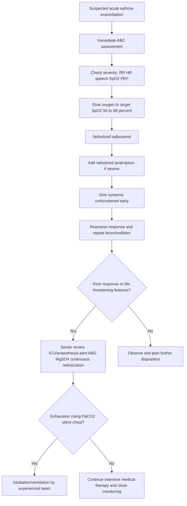
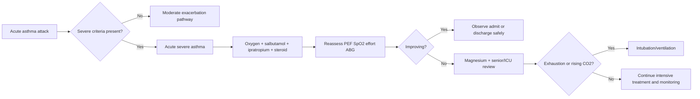

# Acute severe asthma

> [!important]
> **Acute severe asthma** is an acute exacerbation of asthma with marked airflow obstruction and increased work of breathing that can rapidly progress to **life-threatening asthma, hypercapnic respiratory failure, cardiac arrest, and death** if not recognized and treated early.

Related: [[Asthma]], [[COPD]], [[Respiratory Failure]], [[ABG Interpretation]], [[Spirometry Interpretation]], [[Oxygen Therapy and NIV]], [[Chest X-Ray Approach]], [[Airway Diseases/Life-threatening asthma and status asthmaticus|Life-threatening asthma and status asthmaticus]]

> [!tip]
> In FCPS/MRCP, acute severe asthma is commonly tested through **severity criteria, immediate treatment sequence, oxygen target, nebulized bronchodilator strategy, steroid timing, ABG interpretation, indications for ICU/intubation, and distinction from COPD exacerbation, anaphylaxis, upper airway obstruction, pneumonia, and pneumothorax**.

## Learning Objectives
- Define acute severe asthma and separate it from moderate exacerbation and life-threatening asthma.
- Understand the airway anatomy and physiology behind bronchospasm, mucus plugging, hyperinflation, pulsus paradoxus, hypoxemia, and fatigue.
- Use bedside severity markers and ABG trends to identify deterioration early.
- Apply a structured emergency management approach including oxygen, bronchodilators, steroids, magnesium, escalation, and post-attack follow-up.
- Recognize major contraindications, cautions, red flags, and exam traps.

## Definition
Acute severe asthma is an **acute asthma exacerbation** causing severe airflow limitation despite the patient's usual treatment.

### Operational adult bedside definition
Classically, **acute severe asthma** is present when a patient with an asthma attack has any one of the following:
- **PEF 33–50% of best or predicted**
- **Respiratory rate ≥25/min**
- **Heart rate ≥110/min**
- **Inability to complete sentences in one breath**

### Why it matters
It is a **time-critical respiratory emergency** because airway narrowing and dynamic hyperinflation may worsen quickly. A “quiet patient” may be deteriorating rather than improving.

## Core Anatomy
### 1. Large and small airways
- Asthma primarily affects the **bronchial tree**, especially **medium and small airways**.
- Bronchial wall components relevant to acute attacks:
  - mucosa and submucosa
  - smooth muscle
  - mucous glands and goblet cells
  - bronchial circulation
- Small airways contribute disproportionately to airflow resistance when inflamed or narrowed.

### 2. Bronchial smooth muscle
- Smooth muscle constriction sharply reduces airway caliber.
- Because resistance is inversely related to airway radius, even a modest reduction in radius causes a large rise in resistance.

### 3. Mucosa and mucus apparatus
- Mucosal edema narrows the lumen.
- Goblet cell hypersecretion and mucus plugging further obstruct airflow.
- Mucus plugs may produce regional atelectasis and severe V/Q mismatch.

### 4. Alveoli and distal units
- Alveoli are not the primary site of disease, but distal ventilation falls when upstream bronchioles are obstructed.
- Gas trapping increases end-expiratory lung volume and impairs alveolar ventilation.

### 5. Respiratory muscle mechanics
- Diaphragm and accessory muscles work harder against increased airway resistance and hyperinflation.
- Progressive hyperinflation flattens the diaphragm and reduces mechanical advantage.

> [!important]
> Acute severe asthma is fundamentally a **small-airway narrowing + mucus plugging + dynamic hyperinflation** problem.

## Core Physiology
### 1. Bronchospasm and airflow limitation
Acute attack physiology is driven by:
- bronchial smooth muscle contraction
- airway inflammation and edema
- mucus secretion and plugging

Consequences:
- prolonged expiration
- wheeze
- reduced peak expiratory flow
- air trapping

### 2. Dynamic hyperinflation
Because expiration is incomplete:
- residual volume rises
- intrathoracic pressure increases
- patient must breathe at a higher lung volume
- inspiratory muscles work at a mechanical disadvantage

Clinical effects:
- tachypnea
- use of accessory muscles
- pulsus paradoxus
- exhaustion if prolonged

### 3. Ventilation-perfusion mismatch
- Some units are poorly ventilated but still perfused → **low V/Q** → hypoxemia.
- Mucus plugging can create shunt-like physiology.
- Severe airflow obstruction can progress from hypoxemia alone to combined hypoxemia + hypercapnia.

### 4. ABG logic in acute severe asthma
Typical sequence:
1. Early attack: hypoxemia + **low PaCO2** from hyperventilation
2. Worsening obstruction: PaCO2 returns toward normal
3. Severe fatigue/ventilatory failure: **PaCO2 rises** with acidosis

> [!warning]
> In acute asthma, a **normal PaCO2 is not reassuring**. It may indicate impending fatigue because a distressed patient should usually be hypocapnic.

### 5. Pulsus paradoxus physiology
- Large negative intrathoracic pressure swings plus hyperinflation reduce LV filling during inspiration.
- A marked inspiratory fall in systolic BP may occur.
- It suggests severe obstruction but is not essential for diagnosis.

### 6. Why wheeze may disappear
- Very little airflow may produce a **silent chest**.
- Silent chest = severe airflow obstruction, not improvement.

## Normal Values / Important Cut-offs
### Severity cut-offs in acute asthma
| Severity | Key criteria |
|---|---|
| Moderate exacerbation | Symptoms worsening but not meeting acute severe criteria |
| **Acute severe asthma** | Any of: PEF **33–50%**, RR **≥25/min**, HR **≥110/min**, cannot complete sentences in one breath |
| **Life-threatening asthma** | Any of: PEF **<33%**, SpO2 **<92%**, PaO2 **<8 kPa**, normal/raised PaCO2, silent chest, cyanosis, poor respiratory effort, arrhythmia, hypotension, exhaustion, altered consciousness |
| Near-fatal asthma | Raised PaCO2 and/or need for mechanical ventilation with respiratory arrest or impending arrest |

### Useful ABG values
- pH: **7.35–7.45**
- PaCO2: **35–45 mmHg** or **4.7–6.0 kPa**
- PaO2: **80–100 mmHg** or **10.7–13.3 kPa** in healthy adults
- HCO3-: **22–26 mmol/L**

### Oxygen target
- In most acute asthma patients: **target SpO2 94–98%**
- If diagnostic uncertainty with possible COPD/CO2 retention overlap exists, interpret clinically and via ABG rather than blindly over-oxygenating.

### Peak expiratory flow logic
- **PEF >75%** after treatment is reassuring if symptoms and exam improve.
- **PEF 50–75%** may still need close observation.
- **PEF <50%** after initial treatment usually indicates need for admission.
- **PEF <33%** indicates life-threatening attack.

## Classification
### 1. By severity in current attack
- mild/moderate exacerbation
- **acute severe asthma**
- **life-threatening asthma**
- near-fatal asthma

### 2. By trigger pattern
- viral-triggered
- allergen-triggered
- irritant/smoke-triggered
- exercise-triggered
- drug-triggered (NSAID, beta-blocker)
- poor adherence / inhaler withdrawal-related

### 3. By response to treatment
- rapidly reversible
- slowly resolving
- refractory / escalating to ICU-level care

## Etiology / Causes
### Common precipitants
- viral upper respiratory tract infection
- poor adherence to inhaled corticosteroid therapy
- excessive reliance on short-acting beta2 agonist alone
- allergen exposure
- smoke, dust, fumes, perfume, pollution
- exercise or cold air exposure
- emotional stress
- poor inhaler technique

### Drug triggers
- **NSAIDs/aspirin** in aspirin-exacerbated respiratory disease
- **non-selective beta-blockers** including eye drops
- occasionally sulfite-containing agents or occupational sensitizers

### Dangerous contextual causes
- untreated severe background asthma
- recent hospitalization or ICU admission
- recent oral steroid course
- recent withdrawal of steroids
- anaphylaxis
- pneumonia superimposed on asthma
- pneumothorax complicating severe attack

## Risk Factors for Fatal or Near-Fatal Outcome
- previous near-fatal asthma or prior intubation/ICU admission
- hospitalization or emergency visit for asthma within the last year
- recent or current oral steroid use
- overuse of reliever inhaler
- poor inhaled corticosteroid adherence
- psychosocial problems, denial, or poor access to care
- food allergy/anaphylaxis history
- brittle asthma pattern
- significant comorbidity

## Pathophysiology
### Immunologic and inflammatory basis
Asthma exacerbation involves:
- airway inflammation
- mediator release
- smooth muscle contraction
- mucosal edema
- mucus hypersecretion

Important mediators/cells:
- mast cells
- eosinophils
- Th2 cytokines in classic allergic disease
- neutrophilic inflammation in some severe attacks

### Structural result during attack
- narrowed airway lumen
- increased expiratory resistance
- airflow limitation
- dynamic hyperinflation
- V/Q mismatch
- increased work of breathing
- fatigue if prolonged

### Mechanism of death in severe asthma
- progressive airflow obstruction
- severe hypoxemia
- hypercapnia and acidosis
- arrhythmia or cardiac arrest
- mucus plugging with minimal airflow

## Clinical Features
### Symptoms
- severe breathlessness
- chest tightness
- wheeze
- cough
- difficulty speaking
- anxiety or agitation
- worsening nocturnal symptoms before presentation may be reported

### Signs of acute severe asthma
- tachypnea
- tachycardia
- widespread wheeze
- prolonged expiration
- accessory muscle use
- inability to complete sentences
- reduced PEF

### Signs of life-threatening deterioration
- silent chest
- cyanosis
- poor respiratory effort
- confusion, drowsiness, agitation with exhaustion
- hypotension
- arrhythmia
- exhaustion / inability to maintain ventilation

> [!warning]
> **Drowsiness, confusion, bradycardia, hypotension, and a silent chest are late ominous signs.** They imply impending arrest.

## Approach / Emergency Algorithm

## Investigations
### Immediate bedside assessment
- pulse, BP, RR, temperature
- SpO2
- ability to speak
- PEF if patient can perform it safely
- mental status

### Blood gas
Do ABG/VBG when:
- severe attack
- SpO2 not improving
- life-threatening features
- suspected hypercapnia
- exhaustion or deteriorating clinical state

### Chest X-ray
Not routine in every mild attack, but do when:
- focal chest signs or fever suggest pneumonia
- sudden pleuritic pain / asymmetry suggests pneumothorax
- poor response to treatment
- suspicion of aspiration, edema, or alternate diagnosis

### Other tests
- FBC if infection suspected
- U&E (especially if repeated beta-agonists, dehydration, or severe illness)
- potassium because salbutamol may cause **hypokalemia**
- ECG in severe tachycardia, chest pain, or arrhythmia risk
- lactate if severe distress or concern for sepsis; beta-agonist therapy can also raise lactate

## Interpretation Frameworks
### 1. ABG interpretation in acute severe asthma
Stepwise approach:
1. **Check oxygenation**: hypoxemia suggests significant V/Q mismatch.
2. **Check PaCO2**:
   - low = preserved ventilatory drive, common early
   - normal = concerning in a distressed patient
   - high = ventilatory failure / exhaustion
3. **Check pH**:
   - respiratory alkalosis early
   - normalizing or acidemia = deterioration
4. **Reassess trend with clinical picture**, not a single number only.

#### Classic patterns
| ABG pattern | Likely meaning |
|---|---|
| Low PaO2 + low PaCO2 + high/normal pH | early severe attack with hyperventilation |
| Low PaO2 + normal PaCO2 | ominous; possible fatigue / worsening obstruction |
| Low PaO2 + high PaCO2 + low pH | life-threatening attack / impending respiratory arrest |

### 2. Spirometry/PEF interpretation
- Acute management uses **PEF**, not formal spirometry.
- PEF is useful for:
  - grading severity
  - documenting response to treatment
  - disposition planning
- Poor effort can underestimate severity, but in a distressed patient a very low PEF is still concerning.

### 3. Chest X-ray clues
Asthma itself may show:
- hyperinflation
- no focal infiltrate

Alternative/complication clues:
- focal consolidation → pneumonia
- pleural line / absent peripheral markings → pneumothorax
- lobar collapse → mucus plugging
- pulmonary edema pattern → cardiac mimic

### 4. Oxygen therapy logic
- Give **high-concentration oxygen initially** if hypoxemic.
- Then titrate to **94–98%**.
- Do not delay bronchodilators or steroids while waiting for ABG.
- If phenotype overlap with COPD/obesity hypoventilation is suspected, check ABG early.

## Diagnosis
Diagnosis is clinical and based on:
- known asthma or compatible history
- acute worsening of wheeze, breathlessness, chest tightness, cough
- objective evidence of severity (RR, HR, speech limitation, SpO2, PEF)
- exclusion of major differentials/complications when needed

### Practical diagnosis statement
**Acute severe asthma** = acute exacerbation of asthma with any acute severe criterion, but without yet meeting life-threatening criteria.

## Differential Diagnosis
### High-yield differentials
| Differential | Clues favoring it over acute severe asthma |
|---|---|
| **COPD exacerbation** | older smoker, chronic productive cough, fixed obstruction, hypercapnia risk, less variable history |
| **Anaphylaxis** | hypotension, urticaria, angioedema, exposure trigger, multisystem involvement |
| **Upper airway obstruction / vocal cord dysfunction** | inspiratory stridor, throat tightness, variable flattening pattern, poor response to bronchodilators |
| **Pneumonia** | fever, focal crackles, consolidation on CXR, pleuritic pain |
| **Pulmonary embolism** | pleuritic pain, risk factors for VTE, disproportionate tachycardia/hypoxemia, less wheeze usually |
| **Pneumothorax** | sudden unilateral pleuritic pain, asymmetrical chest findings, sudden deterioration |
| **Acute LV failure / pulmonary edema** | orthopnea, crackles, S3, edema, cardiomegaly or edema on CXR |
| **Foreign body aspiration** | abrupt onset, focal wheeze, choking episode |

### Asthma vs COPD in acute exam setting
| Feature | Acute severe asthma | Acute exacerbation of COPD |
|---|---|---|
| Age | often younger | usually older |
| Past variability | marked variability | chronic progressive limitation |
| Smoking history | may be absent | common |
| Oxygen target | 94–98% usually | 88–92% if hypercapnia risk |
| Steroid response | often strong | variable |
| ABG concern | rising PaCO2 is late ominous sign | hypercapnia may be baseline or earlier |

## Management
### Immediate first-hour treatment
1. **Call for help and assess ABCDE.**
2. **Oxygen** to target **SpO2 94–98%**.
3. **Nebulized salbutamol**:
   - commonly **5 mg via oxygen-driven nebulizer**, repeated frequently or continuously in severe cases.
4. **Nebulized ipratropium bromide**:
   - **0.5 mg** added in acute severe/life-threatening asthma.
5. **Systemic corticosteroid early**:
   - **prednisolone 40–50 mg orally** if able to take orally, or
   - **hydrocortisone 100 mg IV** if unable to take orally / severe illness.
6. **Reassess repeatedly**: speech, pulse, RR, SpO2, auscultation, PEF, fatigue.

### If poor response or more severe disease
- repeat or continuous nebulized beta2 agonist
- continue ipratropium
- give **IV magnesium sulfate 1.2–2 g over about 20 minutes** in severe or life-threatening attack not responding adequately
- obtain ABG
- involve senior clinician / ICU / anesthetic team early

### Fluids and supportive care
- correct dehydration cautiously
- avoid sedatives
- monitor potassium and lactate if repeated beta-agonists used

### Antibiotics
- **Not routine** in acute asthma
- Only if there is convincing evidence of bacterial infection such as pneumonia

### Ventilation and ICU-level care
#### NIV
- NIV is **not routine standard therapy in acute asthma** and evidence is limited.
- It may delay definitive airway management if used in the wrong setting.

#### Intubation indications
Consider urgent ICU/anesthesia involvement if:
- worsening exhaustion
- deteriorating consciousness
- silent chest / minimal air entry
- rising PaCO2
- worsening acidosis
- refractory hypoxemia
- respiratory arrest or peri-arrest state

#### Intubation cautions
- high risk due to dynamic hyperinflation and hypotension
- should be performed by experienced clinicians
- post-intubation ventilation must allow long expiratory time to reduce air trapping

## Drug Interactions / Contraindications / Cautions
### Beta2 agonists
Potential issues:
- tachycardia
- tremor
- hypokalemia
- lactic acidosis with high doses
- arrhythmias in susceptible patients

### Ipratropium
- generally safe
- caution with glaucoma exposure to nebulized mist

### Steroids
- short course is essential in acute attack
- watch hyperglycemia, infection masking, and psychiatric effects in susceptible patients

### Important avoid / caution points
- **Do not sedate** the distressed asthma patient unless under controlled airway management.
- **Do not delay steroids.**
- **Do not be falsely reassured by falling wheeze if air entry is worsening.**
- **Do not over-interpret a normal PaCO2 as reassuring.**

## Procedures / Indications / Contraindications
### Peak expiratory flow measurement
**Indication:** objective severity and response assessment if patient can perform.

**Avoid / defer if:** patient is too distressed or maneuver may worsen fatigue.

### ABG sampling
**Indication:** severe/life-threatening attack, poor response, suspected hypercapnia.

### Endotracheal intubation
**Indication:** impending or actual respiratory arrest, exhaustion, deteriorating consciousness, rising CO2 with acidosis.

**Caution:** difficult and high-risk; needs experienced team.

## Procedure Mini-Sections
### ABG sampling in acute asthma
- **Indication:** severe attack or unexpected deterioration
- **Contraindication:** no absolute major contraindication when necessary; use caution in poor collateral circulation/coagulopathy
- **Key pearl:** normal PaCO2 in severe asthma is concerning
- **Complication:** pain, hematoma, arterial spasm

### Nebulizer delivery
- **Indication:** significant bronchospasm needing rapid bronchodilator delivery
- **Preparation:** oxygen-driven nebulizer in severe attack
- **Pitfall:** failing to ensure oxygen supplementation while nebulizing hypoxemic patient

## Complications
- respiratory failure
- cardiac arrest
- pneumothorax or pneumomediastinum
- mucus plugging with lobar collapse
- hypokalemia from beta2 agonists
- lactic acidosis
- arrhythmia
- steroid-related hyperglycemia

## Red Flags / Emergencies
- silent chest
- cyanosis
- SpO2 <92%
- PEF <33%
- normal or raised PaCO2
- hypotension
- exhaustion
- confusion, drowsiness, altered mental state
- poor respiratory effort
- arrhythmia

> [!warning]
> **Life-threatening asthma can look "less wheezy" because airflow is collapsing.** Always judge by effort, oxygenation, PEF, and gas exchange.

## Special Situations
### Pregnancy
- Treat aggressively; maternal hypoxemia is dangerous for both mother and fetus.
- Usual bronchodilators and steroids are generally used when clinically indicated.
- Do not undertreat due to pregnancy.

### Elderly patients
- May have asthma-COPD overlap.
- Cardiac disease, pneumonia, and arrhythmia are important mimics or comorbidities.

### Asthma-COPD overlap / smokers
- ABG early if CO2 retention risk exists.
- Diagnostic uncertainty should not delay treatment.

### Children vs adults
- This note is adult-focused for FCPS/MRCP.
- Pediatric criteria and dosing differ.

## Prognosis
- Most patients improve with early aggressive treatment.
- Delay in recognition, poor adherence, frequent exacerbation history, or prior ICU admission worsens prognosis.
- A severe attack is a major marker of future risk and should trigger long-term asthma review.

## Topic Correlation
- [[Asthma]] provides baseline chronic disease framework.
- [[Airway Diseases/Life-threatening asthma and status asthmaticus|Life-threatening asthma and status asthmaticus]] covers the most critical end of the spectrum.
- [[COPD]] and acute COPD exacerbation are key differentials.
- [[ABG Interpretation]] and [[Spirometry Interpretation]] anchor exam interpretation.
- [[Oxygen Therapy and NIV]] is crucial for safe oxygen prescription and escalation.

## FCPS/MRCP High-Yield Points
- Acute severe asthma = **PEF 33–50%, RR ≥25, HR ≥110, cannot complete sentences**.
- Life-threatening asthma = **PEF <33%, SpO2 <92%, PaO2 <8 kPa, normal/raised PaCO2, silent chest, hypotension, exhaustion, altered consciousness**.
- In acute asthma, **normal PaCO2 is bad**, not good.
- **Oxygen target is usually 94–98%**, unlike COPD where 88–92% may be appropriate.
- **Steroids must be given early.**
- **Ipratropium and magnesium sulfate** are important add-ons in severe disease.
- **Antibiotics are not routine** unless infection is evident.
- **NIV is not standard routine treatment** in acute asthma.
- Silent chest = impending disaster.

## Common Viva Questions
- Define acute severe asthma.
- How do you distinguish acute severe from life-threatening asthma?
- Why is a normal PaCO2 dangerous in acute asthma?
- What is your oxygen target in acute severe asthma?
- What are the indications for IV magnesium sulfate?
- When would you call ICU/anesthesia?
- Why are antibiotics not routinely given?
- How do you differentiate asthma attack from COPD exacerbation?

## Common Confusions / Exam Traps
- Confusing **normal PaCO2** with stability.
- Missing **pneumothorax** in a suddenly worsening severe attack.
- Over-oxygenating a patient with uncertain overlap physiology without checking ABG.
- Forgetting that the patient may become **less wheezy** when airflow is critically low.
- Prescribing antibiotics routinely for every exacerbation.
- Waiting too long to escalate to ICU or experienced airway support.

## Mnemonics
### Severe asthma bedside memory aid: **SPEECH FAST**
- **S**ilent chest or sentence limitation
- **P**EF low
- **E**xhaustion
- **E**arly steroids
- **C**O2 normal/rising is dangerous
- **H**ypoxemia
- **F**requent nebulizers
- **A**BG if severe
- **S**enior help early
- **T**hink intubation if tiring

## Mind Map
- Acute severe asthma
  - severity
    - PEF 33–50%
    - RR ≥25
    - HR ≥110
    - cannot complete sentences
  - pathophysiology
    - bronchospasm
    - edema
    - mucus plugging
    - dynamic hyperinflation
    - V/Q mismatch
  - investigations
    - PEF
    - SpO2
    - ABG
    - CXR if atypical/complication
  - treatment
    - oxygen 94–98%
    - salbutamol
    - ipratropium
    - steroids
    - magnesium sulfate
    - escalation/intubation if failing
  - dangers
    - silent chest
    - normal/rising PaCO2
    - exhaustion
    - pneumothorax

## Flowchart

## Suggested Visuals / Image Notes
- Diagram of bronchial wall edema + smooth muscle constriction + mucus plugging
- Dynamic hyperinflation sketch showing flattened diaphragm
- Severity table: acute severe vs life-threatening asthma
- ABG trend graphic showing low PaCO2 to normal/rising PaCO2 transition

## Suggested Video References
- Look for a short review on **adult acute severe asthma emergency management**
- Look for an **ABG interpretation in asthma/COPD** teaching video
- Look for a **severe asthma vs life-threatening asthma criteria** viva-style review

## One-Page Revision Summary
### Acute severe asthma: last-minute exam sheet
- **Definition:** acute exacerbation with severe airflow obstruction
- **Acute severe criteria:** any of PEF 33–50%, RR ≥25, HR ≥110, cannot complete sentences
- **Life-threatening criteria:** PEF <33%, SpO2 <92%, PaO2 <8 kPa, normal/raised PaCO2, silent chest, hypotension, exhaustion, confusion
- **ABG pearl:** low CO2 early, **normal CO2 is ominous**, raised CO2 = ventilatory failure
- **Immediate treatment:** oxygen 94–98%, nebulized salbutamol, add ipratropium, early steroids
- **If poor response:** repeat/continuous nebulizers, IV magnesium sulfate, ABG, ICU/anesthesia help
- **Do not:** sedate, delay steroids, miss pneumothorax, assume less wheeze = improvement
- **Think differentials:** COPD exacerbation, anaphylaxis, pneumonia, PE, pneumothorax, upper airway obstruction
- **Disposition danger signs:** persistent low PEF, hypoxemia, rising CO2, exhaustion, altered sensorium

## 24-Hour Recall Prompts
- State the criteria for acute severe asthma from memory.
- What makes asthma life-threatening?
- Why is a normal PaCO2 dangerous in a severe attack?
- What is your first-hour treatment sequence?
- When should magnesium sulfate be given?
- Name five red flags that require ICU-level concern.
- Compare oxygen targets in acute asthma vs COPD exacerbation.

## 7-Day / 15-Day / 30-Day Revision Tracker
- **Day 1:** Can I write acute severe vs life-threatening criteria without notes?
- **Day 7:** Can I explain ABG interpretation and escalation logic from memory?
- **Day 15:** Can I compare asthma attack vs COPD exacerbation vs pneumothorax in 2 minutes?
- **Day 30:** Can I reproduce the whole emergency management algorithm and red flags from a blank page?

## Must Know / Should Know / Nice to Know
### Must Know
- acute severe and life-threatening criteria
- oxygen target 94–98%
- early bronchodilator + steroid treatment
- ABG warning signs
- ICU/intubation red flags

### Should Know
- IV magnesium sulfate role
- beta-agonist adverse effects
- pneumothorax/pneumonia as complicating mimics
- pregnancy and overlap-phenotype cautions

### Nice to Know
- detailed immunologic endotypes
- ventilator strategy nuances after intubation

## My Weak Points
- Can I recall exact severe vs life-threatening cut-offs?
- Do I confuse normal PaCO2 with improvement?
- Do I remember that antibiotics are not routine?
- Can I state when NIV is not standard and why airway escalation may be safer?

## Self-Test Scorecard
- Understanding /10
- Recall /10
- ABG interpretation /10
- MCQ performance /10
- Viva confidence /10

**Interpretation:**
- **<35/50** = weak, revisit urgently
- **35–44/50** = fair but not exam-secure
- **45+/50** = strong and exam-ready

## Exam Answer Modes
### Short note mode
Acute severe asthma is an acute exacerbation of asthma with marked airflow obstruction. Diagnostic bedside criteria include PEF 33–50% of best or predicted, RR ≥25/min, HR ≥110/min, and inability to complete sentences in one breath. Management is immediate oxygen to target SpO2 94–98%, repeated nebulized salbutamol, ipratropium in severe attacks, and early systemic corticosteroids. A normal or raised PaCO2 suggests deterioration. Life-threatening features require urgent ICU/anesthetic involvement and possible intubation.

### Viva mode
- Define it.
- Give criteria.
- Mention oxygen target.
- List first-line drugs.
- Say why normal PaCO2 is dangerous.
- Mention magnesium, ABG, ICU help, and intubation triggers.

### Ward-case mode
In a breathless wheezy patient with known asthma, rapidly grade severity using speech, RR, HR, SpO2, and PEF; start oxygen, nebulized bronchodilators, and steroids immediately; check ABG if severe; watch for silent chest, exhaustion, and rising PaCO2; exclude pneumothorax and pneumonia if deterioration is unexpected.

## Summary
Acute severe asthma is a medical emergency characterized by severe but potentially reversible airflow limitation. The key to safe management is **rapid severity recognition, prompt oxygen and bronchodilator therapy, early steroids, careful ABG interpretation, and timely escalation before exhaustion or hypercapnic failure develops**.

## MCQs (10)
1. Which of the following is a criterion for **acute severe asthma** in an adult?
   - A. PEF <33% predicted
   - B. Heart rate 96/min
   - C. Respiratory rate 26/min
   - D. SpO2 96% on air with full sentences
   - E. Productive cough for 3 days

2. In acute severe asthma, which ABG pattern is most concerning?
   - A. PaO2 9.0 kPa, PaCO2 4.0 kPa
   - B. PaO2 8.5 kPa, PaCO2 5.3 kPa
   - C. PaO2 11 kPa, PaCO2 3.8 kPa
   - D. PaO2 10 kPa, PaCO2 4.2 kPa
   - E. PaO2 12 kPa, PaCO2 4.5 kPa

3. The usual oxygen saturation target in acute severe asthma is:
   - A. 80–85%
   - B. 85–88%
   - C. 88–92%
   - D. 94–98%
   - E. 100% at all times regardless of context

4. Which drug should be added to nebulized salbutamol in acute severe asthma?
   - A. Montelukast
   - B. Ipratropium bromide
   - C. Oral theophylline as first choice
   - D. Oral antihistamine
   - E. Routine antibiotic

5. A patient with severe asthma becomes quieter on auscultation, drowsy, and hypoxemic. The best interpretation is:
   - A. Improvement after nebulizer
   - B. Anxiety only
   - C. Dangerous deterioration with minimal airflow
   - D. Isolated upper respiratory infection
   - E. Normal post-treatment fatigue

6. Which statement about antibiotics in acute severe asthma is most accurate?
   - A. Always indicated
   - B. Only indicated if bacterial infection is suspected
   - C. Mandatory if wheeze is present
   - D. Required before steroids
   - E. Contraindicated in all cases

7. Which electrolyte disturbance can follow repeated high-dose beta2 agonist therapy?
   - A. Hyperkalemia
   - B. Hypercalcemia
   - C. Hypokalemia
   - D. Hypermagnesemia
   - E. Hypernatremia

8. Which of the following suggests **life-threatening** rather than merely acute severe asthma?
   - A. Heart rate 112/min
   - B. RR 26/min
   - C. Inability to complete sentences
   - D. PEF 45% predicted
   - E. Silent chest

9. A normal PaCO2 in a distressed patient with acute asthma usually means:
   - A. Complete recovery
   - B. Laboratory error
   - C. Impending ventilatory fatigue should be considered
   - D. Certain pulmonary embolism
   - E. No need for further treatment

10. Which intervention is most appropriate early in a poorly responding severe attack?
   - A. Delay all treatment until chest X-ray is done
   - B. IV magnesium sulfate and senior review
   - C. Sedative for agitation
   - D. Routine NIV for all patients
   - E. Stop bronchodilators if tachycardic

## SBA Questions (10)
1. A 24-year-old woman with known asthma presents with severe wheeze. She is unable to complete sentences, RR 30/min, HR 122/min, SpO2 93% on air, and PEF 40% predicted. What is the best immediate next step?
   - A. Send home with inhaler advice
   - B. Start oxygen, nebulized salbutamol, ipratropium, and systemic steroids
   - C. Start antibiotics first
   - D. Arrange outpatient spirometry
   - E. Give sedative and observe

2. A 29-year-old man with severe asthma has an ABG showing pH 7.36, PaO2 7.8 kPa, PaCO2 5.8 kPa. He remains tachypneic and exhausted. What is the best interpretation?
   - A. Stable compensated asthma
   - B. Reassuring normal gas exchange
   - C. Life-threatening deterioration with ventilatory failure risk
   - D. Pure metabolic acidosis
   - E. Panic attack only

3. A patient with severe wheeze suddenly develops unilateral pleuritic chest pain and reduced breath sounds on one side during treatment. What is the most important complication to exclude?
   - A. Pulmonary fibrosis
   - B. Pneumothorax
   - C. Tuberculosis
   - D. Sarcoidosis
   - E. Pleural plaque

4. A 35-year-old patient with acute severe asthma has persistent severe symptoms despite repeated nebulized salbutamol, ipratropium, oxygen, and steroids. Which additional treatment is most appropriate?
   - A. Oral antibiotic only
   - B. IV magnesium sulfate
   - C. Immediate discharge
   - D. Stop bronchodilator therapy
   - E. Routine morphine

5. A woman with known asthma is anxious and tachypneic, but her chest is almost silent and she is becoming drowsy. What is the best next action?
   - A. Reassure and discharge
   - B. Arrange elective clinic review
   - C. Urgent ICU/anesthetic involvement for possible intubation
   - D. Give cough suppressant
   - E. Start long-term oxygen therapy paperwork

6. A 68-year-old smoker with wheeze and dyspnea presents to ED. There is diagnostic uncertainty between asthma and COPD exacerbation. Which principle is best?
   - A. Do not treat until spirometry is complete
   - B. Treat urgent bronchospasm/hypoxemia and obtain ABG early
   - C. Give no oxygen until consultant arrives
   - D. Assume COPD and target saturation 70–75%
   - E. Avoid steroids until outpatient review

7. A patient with acute asthma receives repeated nebulized salbutamol. Which laboratory issue should be monitored?
   - A. Hyperuricemia only
   - B. Hypokalemia and possibly lactate rise
   - C. Hyperphosphatemia only
   - D. Severe hypercalcemia
   - E. Isolated bilirubin rise

8. Which of the following is the strongest reason NIV is not routine standard management in acute severe asthma?
   - A. It always worsens hypoxemia
   - B. It may delay definitive airway management in a deteriorating patient
   - C. It is only used in tuberculosis
   - D. It causes inevitable pneumothorax
   - E. It is banned in respiratory medicine

9. A pregnant woman presents with acute severe asthma. What is the best management principle?
   - A. Avoid steroids because of pregnancy
   - B. Avoid bronchodilators because fetal tachycardia is certain
   - C. Undertreat symptoms to reduce drug exposure
   - D. Treat aggressively because maternal hypoxemia is dangerous to mother and fetus
   - E. Delay oxygen until obstetric review

10. A 26-year-old man improves after treatment. Which feature would still favor admission rather than discharge?
   - A. PEF now 82% predicted, asymptomatic
   - B. SpO2 97% on air, speaking normally
   - C. Persistent PEF 45% predicted after initial therapy
   - D. Wants to go home quickly
   - E. Mild hand tremor after salbutamol

## Flashcards
- Q: What PEF range defines acute severe asthma?
  A: **33–50%** of best or predicted.
- Q: What PEF suggests life-threatening asthma?
  A: **<33%** predicted/best.
- Q: Name four bedside criteria for acute severe asthma.
  A: PEF 33–50%, RR ≥25/min, HR ≥110/min, inability to complete sentences in one breath.
- Q: Why is normal PaCO2 dangerous in acute asthma?
  A: A distressed asthmatic should usually be hypocapnic; normal CO2 may indicate fatigue and worsening ventilatory failure.
- Q: What is the usual oxygen saturation target in acute severe asthma?
  A: **94–98%**.
- Q: Which inhaled antimuscarinic is added in severe attacks?
  A: **Ipratropium bromide**.
- Q: Which IV drug is added in poorly responding severe asthma?
  A: **Magnesium sulfate**.
- Q: Are antibiotics routine in acute severe asthma?
  A: No, only if infection is suspected.
- Q: What does a silent chest imply?
  A: Critically reduced airflow and life-threatening deterioration.
- Q: Name three intubation red flags in severe asthma.
  A: Exhaustion, rising PaCO2/acidosis, deteriorating consciousness.

## Answer Key with Explanations
### MCQs
1. **C. Respiratory rate 26/min**
   - RR ≥25/min is one of the acute severe asthma criteria.
2. **B. PaO2 8.5 kPa, PaCO2 5.3 kPa**
   - A normal-ish PaCO2 in a severe attack is concerning because the patient should usually be hypocapnic.
3. **D. 94–98%**
   - This is the usual target range in acute asthma.
4. **B. Ipratropium bromide**
   - It is an important adjunct in severe attacks.
5. **C. Dangerous deterioration with minimal airflow**
   - Silent or quieter chest with drowsiness is ominous.
6. **B. Only indicated if bacterial infection is suspected**
   - Antibiotics are not routine for asthma attacks alone.
7. **C. Hypokalemia**
   - Beta2 agonists can shift potassium intracellularly.
8. **E. Silent chest**
   - Silent chest is a life-threatening feature.
9. **C. Impending ventilatory fatigue should be considered**
   - Normal PaCO2 in this context is a danger sign.
10. **B. IV magnesium sulfate and senior review**
   - Appropriate escalation in poorly responding severe disease.

### SBAs
1. **B. Start oxygen, nebulized salbutamol, ipratropium, and systemic steroids**
   - This is the correct initial emergency bundle.
2. **C. Life-threatening deterioration with ventilatory failure risk**
   - Hypoxemia with near-normal/high CO2 and exhaustion is dangerous.
3. **B. Pneumothorax**
   - Sudden pleuritic pain and unilateral breath-sound loss demand exclusion of pneumothorax.
4. **B. IV magnesium sulfate**
   - Appropriate add-on when standard initial therapy is insufficient.
5. **C. Urgent ICU/anesthetic involvement for possible intubation**
   - Silent chest and drowsiness imply impending respiratory arrest.
6. **B. Treat urgent bronchospasm/hypoxemia and obtain ABG early**
   - Do not delay emergency care while sorting chronic labels.
7. **B. Hypokalemia and possibly lactate rise**
   - Both can occur with repeated beta-agonists.
8. **B. It may delay definitive airway management in a deteriorating patient**
   - That is the major practical concern.
9. **D. Treat aggressively because maternal hypoxemia is dangerous to mother and fetus**
   - Undertreatment is riskier.
10. **C. Persistent PEF 45% predicted after initial therapy**
   - Persistent objective severity supports admission.
