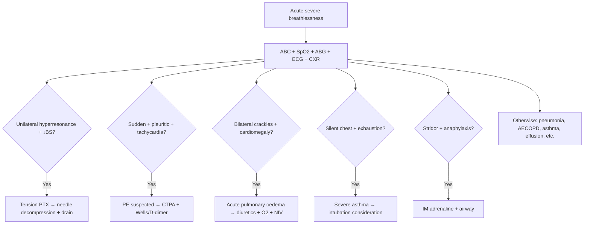

# Acute severe breathlessness approach

> [!important]
> **Acute severe breathlessness** is a **time-critical emergency**. Immediate management: A–B–C assessment, ABG, O₂, treat life-threatening causes (PTX, PE, severe asthma, pulmonary oedema, anaphylaxis, arrhythmia). Common differentials: **pneumonia, PE, asthma, COPD exacerbation, pneumothorax, pulmonary oedema, hyperventilation**.

Related: [[Dyspnea]], [[Acute hypoxemia approach]], [[Pneumothorax]], [[Pulmonary Embolism]], [[Respiratory Failure]]

> [!tip] **FCPS/MRCP pearl**: **Sudden dyspnoea + unilateral hyperresonance + ↓breath sounds = pneumothorax → needle decompression + chest drain**. **Sudden + pleuritic + tachycardia = PE**. **Acute severe asthma = silent chest = intubation consideration**. **Pulmonary oedema = bilateral crackles + S3 + cardiomegaly = diuretics**.

## Definition

**Acute breathlessness** = sudden onset dyspnoea (seconds to hours), often severe enough to require immediate assessment.

## Aetiology

### Life-threatening
| Cause | Clue |
|-------|------|
| **Tension pneumothorax** | Unilateral hyperresonance, ↓BS, tracheal deviation, shock |
| **Massive PE** | Sudden, pleuritic, tachycardia, hypotension, A-a gradient |
| **Severe asthma** | Silent chest, exhaustion, normal/↑PaCO₂ |
| **Acute pulmonary oedema** | Bilateral crackles, S3, cardiomegaly, pink frothy sputum |
| **Anaphylaxis** | Urticaria, angioedema, hypotension, stridor |
| **Cardiac arrest / arrhythmia** | Shock, no output, VT/VF |
| **Upper airway obstruction** | Stridor, drooling, tripod |
| **ARDS** | Refractory hypoxaemia, bilateral infiltrates |
| **Pneumothorax (simple)** | Sudden pleuritic pain, dyspnoea, ↓BS |
| **Massive haemoptysis** | Blood, airway compromise |

### Acute (less immediately life-threatening)
- **Pneumonia** (CAP, HAP)
- **Asthma exacerbation** (mild–moderate)
- **AECOPD**
- **Pleural effusion** (large)
- **Pulmonary embolism** (submassive)
- **Anxiety / hyperventilation** (after exclusion)
- **Panic attack**
- **Metabolic acidosis** (Kussmaul)
- **Anaemia** (acute drop, e.g. GI bleed)

## Pathophysiology

### Mechanisms of dyspnoea
- **↑Drive** (hypoxaemia, hypercapnia, acidosis)
- **↑Work** (obstructive/restrictive)
- **↑Ventilation** required (metabolic acidosis)
- **Weak muscles** (NM, fatigue)

## Clinical Assessment

### Immediate (ABCs)
- **A**irway (patent, no obstruction)
- **B**reathing (RR, SpO₂, breath sounds, stridor, wheeze)
- **C**irculation (HR, BP, JVP, oedema)
- **D**isability (GCS, confusion)
- **E**xposure (chest wall, legs)

### History (rapid)
- **Onset** (sudden vs gradual)
- **Triggers** (allergens, exertion, position, trauma)
- **Associated symptoms** (chest pain, palpitations, wheeze, fever, sputum, haemoptysis, leg swelling)
- **Past history** (asthma, COPD, HF, cancer, DVT/PE)
- **Drugs** (allergies, ACE-i, anticoagulants)
- **Smoking**, **occupation**

### Examination
- **General**: distress, cyanosis, clubbing, cachexia
- **Neck**: JVP, tracheal deviation, stridor
- **Chest**: inspection, percussion, auscultation
- **Cardiac**: murmurs, S3, S4, pericardial rub
- **Limbs**: oedema, calf swelling (DVT), cyanosis, clubbing

## Diagnosis

### Immediate investigations
| Test | Purpose |
|------|---------|
| **SpO₂** | Hypoxaemia |
| **ABG** | Hypoxaemia, hypercapnia, pH |
| **ECG** | MI, arrhythmia, RV strain, pericarditis |
| **CXR** (bedside) | Pneumothorax, oedema, consolidation |
| **Bedside echo** | Pericardial effusion, RV strain, LV function |
| **FBC, U&E, CRP, troponin, BNP, D-dimer** | As indicated |

### Algorithm

## Management

### General
- **Position**: sitting up (improves mechanics)
- **O₂**: target SpO₂ 94–98% (88–92% if hypercapnic risk)
- **IV access**
- **Monitoring**: SpO₂, RR, HR, BP, conscious level
- **Reassure** (anxiety worsens dyspnoea)
- **Specific Rx** by cause

### By cause

| Cause | Specific Rx |
|-------|-------------|
| **Tension PTX** | Needle decompression (2nd ICS, midclavicular) + chest drain |
| **Massive PE** | Thrombolysis (alteplase) + anticoagulation |
| **Acute pulmonary oedema** | O₂ + IV furosemide + GTN + NIV (CPAP) +/− morphine |
| **Severe asthma** | O₂ + SABA + ipratropium nebs + IV hydrocortisone + IV MgSO₄ + intubation if failing |
| **AECOPD** | O₂ (controlled 24–28%) + SABA + ipratropium + steroid + NIV (pH 7.25–7.35) + antibiotics |
| **Pneumonia** | Antibiotics + O₂ + supportive |
| **Anaphylaxis** | IM adrenaline 0.5 mg + O₂ + IV fluids + antihistamine + steroids +/− intubation |
| **Pleural effusion (large)** | Therapeutic thoracentesis |
| **Anxiety/panic** | Reassure, breathing exercises, treat cause |
| **Metabolic acidosis** | Treat cause (DKA, renal failure) |

## FCPS/MRCP High-Yield Summary

| Domain | Key points |
|--------|------------|
| **Life-threatening** | Tension PTX, massive PE, severe asthma, APO, anaphylaxis |
| **Sudden + pleuritic** | PE, PTX |
| **Stridor** | Upper airway obstruction, anaphylaxis |
| **Bilateral crackles** | APO, ARDS, pneumonia |
| **Wheeze** | Asthma, COPD |
| **Position** | Sitting up |
| **O₂ target** | 94–98% (88–92% if hypercapnic) |
| **Tension PTX** | Needle decompression (2nd ICS, midclavicular) |

## MCQs (10)

1. Sudden breathlessness + unilateral hyperresonance + ↓BS. First:
   A. CXR
   B. **Needle decompression (tension pneumothorax)**
   C. Wait
   D. Antibiotics
   E. None
   **Answer: B** — Decompress.

2. Sudden breathlessness + pleuritic chest pain + tachycardia + normal CXR. Next:
   A. Antibiotics
   B. **Wells score + D-dimer → CTPA (suspected PE)**
   C. Discharge
   D. Steroids
   E. None
   **Answer: B** — Workup for PE.

3. Acute severe breathlessness + bilateral crackles + S3 + cardiomegaly. First:
   A. Antibiotics
   B. **IV furosemide + O₂ + GTN (acute pulmonary oedema)**
   C. Steroids
   D. Wait
   E. None
   **Answer: B** — Pulmonary oedema.

4. Silent chest in acute severe asthma indicates:
   A. Improvement
   B. **Critical airflow obstruction (life-threatening)**
   C. Wheeze
   D. Recovery
   E. None
   **Answer: B** — Critical.

5. Anaphylaxis with stridor and hypotension. First:
   A. Steroids
   B. **IM adrenaline 0.5 mg (1:1000)**
   C. Antihistamine
   D. Wait
   E. None
   **Answer: B** — IM adrenaline.

6. The most common cause of acute breathlessness in ED:
   A. PE
   B. **Pneumonia / AECOPD / asthma**
   C. Tension PTX
   D. None
   E. APO
   **Answer: B** — Pneumonia/COPD/asthma.

7. Sudden dyspnoea with normal CXR, ECG S1Q3T3. Diagnosis:
   A. Pneumonia
   B. **Pulmonary embolism**
   C. Asthma
   D. None
   E. PTX
   **Answer: B** — PE.

8. The most useful bedside test for tension pneumothorax:
   A. CXR
   B. **Clinical diagnosis (hyperresonance + ↓BS + shock)**
   C. ABG
   D. None
   E. CT
   **Answer: B** — Clinical.

9. Position for acute severe breathlessness:
   A. Supine
   B. **Sitting up (improves diaphragm mechanics)**
   C. Prone
   D. Trendelenburg
   E. None
   **Answer: B** — Sitting.

10. Tension pneumothorax decompression site:
    A. 5th ICS, midaxillary
    B. **2nd ICS, midclavicular**
    C. Back
    D. None
    E. 4th ICS
    **Answer: B** — 2nd ICS, midclavicular.

## SBA Questions (10)

1. The most important first step in acute breathlessness:
   A. CXR
   B. **ABCs (airway, breathing, circulation)**
   C. ABG
   D. Spirogram
   E. None
    **Answer: B** — ABCs.

2. Tension pneumothorax first management:
   A. CXR
   B. **Needle decompression (don't wait for CXR)**
   C. CT
   D. Discharge
   E. None
    **Answer: B** — Decompress.

3. Acute breathlessness + ↓SpO₂ + bilateral crackles + normal CXR. Cause:
   A. PTX
   B. **Pulmonary embolism (or early APO)**
   C. None
   D. Asthma
   E. COPD
    **Answer: B** — PE.

4. Anxiety/panic-related hyperventilation. ABG:
   A. ↓PaO₂, ↓PaCO₂
   B. **↓PaO₂, ↓PaCO₂ (resp alkalosis) + normal A-a**
   C. ↑PaO₂
   D. ↑PaCO₂
   E. None
    **Answer: B** — Hypervent + resp alkalosis + normal A-a.

5. Pleural effusion (massive). Best management:
   A. Antibiotics
   B. **Therapeutic thoracentesis**
   C. Steroids
   D. Wait
   E. None
    **Answer: B** — Drain.

6. Acute breathlessness in COPD with pH 7.30, PaCO₂ 55. Best:
   A. Intubate
   B. **NIV (BiPAP) + bronchodilators + steroids + antibiotics**
   C. Discharge
   D. Steroids only
   E. None
    **Answer: B** — NIV bundle.

7. Acute breathlessness + history of PE + high Wells + positive D-dimer. Next:
   A. Discharge
   B. **CTPA + anticoagulate**
   C. Wait
   D. Steroids
   E. None
    **Answer: B** — CTPA + anticoag.

8. Tension pneumothorax signs include all EXCEPT:
   A. Unilateral hyperresonance
   B. ↓Breath sounds
   C. Tracheal deviation
   D. **Equal chest expansion**
   E. Shock
    **Answer: D** — Asymmetric expansion.

9. The most common cause of sudden death in asthma:
   A. Bronchospasm
   B. **Silent chest / inadequate ventilation**
   C. Pneumothorax
   D. None
   E. MI
    **Answer: B** — Silent chest.

10. A patient with asthma becomes drowsy with normal PaCO₂. Best:
    A. Wait
    B. **Intubate (impending respiratory failure)**
    C. Antibiotics
    D. Steroids
    E. None
    **Answer: B** — Intubate.

## Flashcards

- **Q: Tension PTX first Rx?**
  A: Needle decompression (2nd ICS, midclavicular).

- **Q: PE sudden + pleuritic?**
  A: Wells + D-dimer + CTPA.

- **Q: APO first Rx?**
  A: O₂ + IV furosemide + GTN + NIV.

- **Q: Silent chest?**
  A: Critical airflow obstruction in asthma.

- **Q: Anaphylaxis first Rx?**
  A: IM adrenaline 0.5 mg (1:1000).

- **Q: Position?**
  A: Sitting up.

- **Q: O₂ target?**
  A: 94–98% (88–92% if hypercapnic risk).

- **Q: COPD exacerbation pH 7.30?**
  A: NIV + bronchodilators + steroids + antibiotics.

- **Q: Tension PTX CXR wait?**
  A: No — clinical diagnosis, decompress.

- **Q: Silent chest meaning?**
  A: Critical airflow obstruction.

## Answer Key with Explanations

### MCQs
1. **B**  2. **B**  3. **B**  4. **B**  5. **B**  6. **B**  7. **B**  8. **B**  9. **B**  10. **B**

### SBAs
1. **B**  2. **B**  3. **B**  4. **B**  5. **B**  6. **B**  7. **B**  8. **D**  9. **B**  10. **B**

## Summary

Acute breathlessness: ABCs + O₂ + ABG + ECG + CXR. Life-threatening: tension PTX (needle decompression), massive PE (thrombolysis), severe asthma (silent chest → intubate), APO (diuretics + NIV), anaphylaxis (IM adrenaline). Position: sitting up. O₂ target 94–98%.

## Local Navigation
- **Parent Heading**: [[../Symptom Approach to Respiratory Disease|Symptom Approach to Respiratory Disease]]
- **Parent Topic Group**: [[../Symptom Approach to Respiratory Disease/Acute respiratory presentations|Acute respiratory presentations]]
- **Chapter Map**: [[../Davidson Chapter 17 - Respiratory Medicine Hierarchy|Respiratory Medicine Hierarchy]]
- **Chapter MOC**: [[../Respiratory MOC|Respiratory MOC]]
- **Related**: [[Dyspnea]] · [[Acute hypoxemia approach]] · [[Pneumothorax]] · [[Pulmonary Embolism]] · [[Respiratory Failure]]