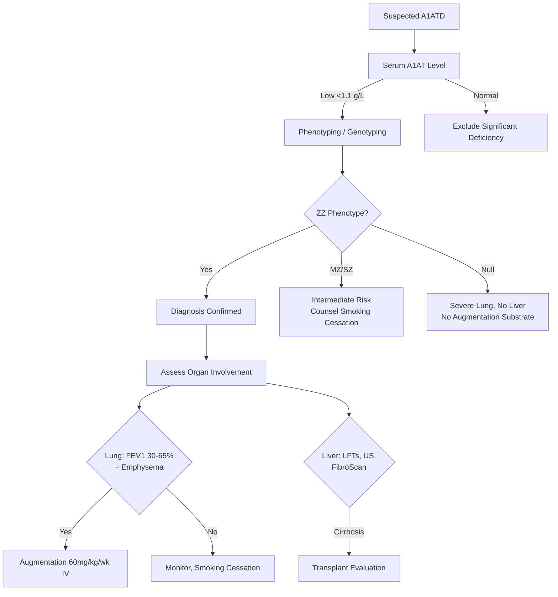

# Alpha-1 Antitrypsin Deficiency (A1ATD)

Related: [COPD], [Emphysema], [Cirrhosis], [Hepatology], [Liver transplantation], [Airway Diseases/Alpha-1 antitrypsin deficiency|Alpha-1 antitrypsin deficiency], [Airway Diseases/COPD spectrum|COPD spectrum]

> [!important]
> **A1ATD** = **autosomal co-dominant** deficiency of serine protease inhibitor (SERPINA1) → **unopposed neutrophil elastase** → **panacinar emphysema** (lower lobe) + **liver disease** (neonatal hepatitis, cirrhosis). **Most common genetic cause of early-onset emphysema**. Key FCPS/MRCP: phenotype (MM/MS/MZ/ZZ), augmentation therapy, screening criteria, liver vs lung phenotype.

## Learning Objectives
- Understand genetics (SERPINA1 alleles: M, S, Z) and phenotype correlation
- Apply screening criteria and interpret A1AT levels/phenotyping
- Distinguish lung (emphysema) vs liver (cirrhosis) manifestations
- Apply augmentation therapy indications and limitations
- Identify associated conditions (panniculitis, vasculitis, bronchiectasis)

## Definition
**Alpha-1 Antitrypsin Deficiency (A1ATD)** = inherited deficiency of **alpha-1 antitrypsin (A1AT)**, a serine protease inhibitor (serpin) that normally inhibits **neutrophil elastase**, leading to **uncontrolled tissue destruction** in lungs (emphysema) and polymer accumulation in liver (cirrhosis).

## Core Genetics
- **Gene**: **SERPINA1** on chromosome **14q32**
- **Inheritance**: **autosomal co-dominant** (both alleles expressed)
- **Normal allele**: **M** (normal function, 100% activity)
- **Deficient alleles**:
  - **Z** (Glu342Lys) → **severe deficiency** (10-15% activity); polymerises in hepatocytes
  - **S** (Glu264Val) → **moderate deficiency** (50-60% activity)
- **Phenotypes**: MM (normal), MS/MZ (heterozygous, intermediate risk), SS/SZ/ZZ (homozygous/compound het, high risk)

| Genotype | Serum A1AT Level | Lung Risk | Liver Risk |
|----------|------------------|-----------|------------|
| **MM** | Normal (100%) | None | None |
| **MZ** | ~50-60% | Slight (if smoking) | Low |
| **SZ** | ~40-50% | Moderate | Moderate |
| **ZZ** | **10-15%** | **High (early emphysema)** | **High (neonatal hepatitis, cirrhosis)** |
| **Null** | <5% | Very high | None (no polymer) |

## Pathophysiology
- **Lung**: A1AT normally inhibits **neutrophil elastase** (released by neutrophils during inflammation). Deficiency → **unopposed elastase** → destruction of **alveolar walls** → **panacinar emphysema** (predominantly **lower lobes**).
- **Liver**: **Z variant** misfolds → **polymerises in ER of hepatocytes** → **ER stress, autophagy impairment, mitochondrial dysfunction** → **hepatocyte injury** → neonatal hepatitis → cirrhosis → HCC.
- **Smoking**: **accelerates** lung disease (oxidative inactivation of remaining A1AT, ↑ neutrophil influx).

## Clinical Features

### Lung (Emphysema)
| Feature | Details |
|---------|---------|
| **Onset** | **30-40 yrs** (ZZ smokers); 50+ yrs (non-smokers) |
| **Symptoms** | Dyspnoea, wheeze, chronic cough, exercise intolerance |
| **Pattern** | **Panacinar emphysema**, **basal/lower lobe predominance** (vs smoking = upper lobe) |
| **Comorbidities** | Bronchiectasis (20-30%), asthma, recurrent infections |

### Liver
| Stage | Features |
|-------|----------|
| **Neonatal** | Jaundice, hepatomegaly, elevated transaminases (usually resolves) |
| **Childhood** | Asymptomatic hepatomegaly, mild LFT derangement |
| **Adult** | **Cirrhosis** (15-30% ZZ adults), portal hypertension, HCC risk ↑ 20x |

### Extra-pulmonary
- **Necrotising panniculitis** (rare, painful subcutaneous nodules/ulcers)
- **ANCA-positive vasculitis** (EGPA-like, GPA-like)
- **Bronchiectasis** (20-30%)
- **IgA deficiency** association

## Investigations

### Diagnostic Algorithm
1. **Serum A1AT level** (quantitative) — **first-line screen**
   - **Low** (<1.1 g/L or <11 µM) → proceed to phenotyping
   - **Normal** → excludes significant deficiency (but not null alleles)
2. **Phenotyping** (isoelectric focusing) — **definitive** for Z, S, rare variants
3. **Genotyping** (PCR) — confirms Z/S, detects rare/null alleles
4. **Liver**: LFTs, ultrasound, FibroScan, liver biopsy if cirrhosis suspected
5. **Lung**: CXR/HRCT (basal panacinar emphysema), spirometry (obstructive), DLCO ↓

### Key Values
| Test | Normal | ZZ | MZ |
|------|--------|----|----|
| **A1AT level** | 1.5-3.5 g/L (20-52 µM) | **<0.5 g/L** | 0.7-1.2 g/L |
| **Phenotype** | MM | **ZZ** | MZ |

> **FCPS/MRCP tip**: **Low A1AT level + ZZ phenotype = diagnostic**. MZ heterozygotes have intermediate levels; only high risk if smoking.

## Management

### 1. Lung — **Augmentation Therapy**
- **Purmist® (human A1AT)**: **60 mg/kg IV weekly** (lifelong)
- **Indications**: **ZZ phenotype + FEV₁ 30-65% predicted + evidence of emphysema**
- **Effect**: Slows FEV₁ decline (~50% reduction), **does not reverse** established emphysema
- **Not indicated**: MZ heterozygotes, asymptomatic ZZ with normal FEV₁, null alleles (no substrate)

### 2. Liver
- **No specific therapy** for liver disease
- **Monitor**: LFTs, ultrasound ± AFP q6-12mo (HCC surveillance)
- **Cirrhosis management**: standard (diuretics, variceal screening, transplant eval)
- **Liver transplantation**: curative for liver disease (donor liver produces normal A1AT)

### 3. General Measures
- **Smoking cessation** — **single most important intervention** (delays emphysema by decades)
- **Vaccination**: pneumococcal, influenza, **hepatitis A/B** (liver protection)
- **Avoid hepatotoxins**: alcohol, hepatotoxic drugs
- **Bronchiectasis**: airway clearance, targeted antibiotics

### 4. Associated Conditions
- **Panniculitis**: dapsone, doxycycline, augmentation therapy may help
- **ANCA vasculitis**: standard immunosuppression (rituximab/cyclophosphamide)

## Screening Criteria (Who to Test)
**ATS/ERS Guidelines — Test if ANY:**
- COPD diagnosed **<45 years** (or **non-smoker** with COPD)
- **Basal-predominant emphysema** on imaging
- **Family history** of COPD, liver disease, or known A1ATD
- **Unexplained liver disease** (neonatal hepatitis, cirrhosis, HCC)
- **Necrotising panniculitis**
- **C-ANCA positive vasculitis** (if no other cause)
- **Bronchiectasis** without obvious cause
- **First-degree relative** of known A1ATD

> **FCPS/MRCP tip**: **Basal emphysema in young non-smoker = A1ATD until proven otherwise**.

## Genetic Counselling
- **Autosomal co-dominant** → 50% chance offspring inherits allele from affected parent
- **ZZ x MM** → all offspring MZ (carriers)
- **ZZ x MZ** → 50% ZZ, 50% MZ
- **Prenatal diagnosis**: available (chorionic villus sampling/amniocentesis)

## Complications
| System | Complication |
|--------|--------------|
| **Lung** | Early panacinar emphysema, recurrent infections, respiratory failure |
| **Liver** | Cirrhosis, portal hypertension, HCC, liver failure |
| **Skin** | Necrotising panniculitis (painful ulcers, scars) |
| **Vasculature** | ANCA vasculitis (renal, sinuses, lungs) |
| **Malignancy** | HCC (cirrhosis), lung cancer (emphysema + smoking) |

## Prognosis
- **ZZ non-smoker**: median survival ~70 yrs
- **ZZ smoker**: median survival ~50 yrs (emphysema death)
- **Liver disease**: 15-30% ZZ develop cirrhosis; HCC risk 1-2%/yr if cirrhosis
- **Augmentation therapy**: slows FEV₁ decline by ~50%; no mortality benefit proven

## FCPS/MRCP High-Yield Points
1. **ZZ genotype** = severe deficiency (10-15% activity); **MZ** = carrier (50-60%)
2. **Panacinar emphysema, BASAL predominance** = hallmark (vs smoking = apical)
3. **Augmentation therapy**: 60 mg/kg IV weekly; **only for ZZ + FEV₁ 30-65%**
4. **Smoking cessation** = single most effective intervention
5. **Liver disease**: Z variant polymerises in hepatocytes → neonatal hepatitis → cirrhosis → HCC
5. **Screen**: COPD <45, basal emphysema, family history, unexplained liver disease
6. **A1AT level <1.1 g/L** → phenotype → ZZ = diagnostic
7. **Null alleles** = no protein, no liver disease, severe lung disease, unresponsive to augmentation
8. **Panniculitis** = rare skin manifestation; responds to dapsone/augmentation

## Common Viva Questions
1. Genetics of A1ATD (autosomal co-dominant, SERPINA1, Z allele)
2. Why basal emphysema? (A1AT diffuses better to bases; neutrophil elastase unopposed)
3. Augmentation therapy indications, dosing, limitations
4. Liver disease mechanism (Z polymerisation in hepatocytes)
5. Screening criteria (COPD <45, basal emphysema, family hx, unexplained liver disease)
5. MZ heterozygote risk (increased only with smoking)
6. Null allele vs Z allele (no liver disease, no augmentation substrate)

## Common Confusions / Exam Traps
- **MZ heterozygotes** ≠ get augmentation therapy (only ZZ)
- **Basal emphysema** ≠ smoking (smoking = apical; A1ATD = basal)
- **Null alleles** = no protein, severe lung disease, **no liver disease**, no augmentation benefit
- **Augmentation therapy** does **not reverse** emphysema; only slows progression
- **Liver disease** only with Z variant (polymerisation); null alleles = no liver disease
- **MZ heterozygotes** = **not** normal risk if smoking (2-3× risk vs MM)

## Mnemonics
- **A1ATD GENETICS**: **Z** = **Z**ero activity (10-15%); **S** = **S**ix-ish (50-60%); **M** = **M**ormal
- **EMPHYSEMA PATTERN**: **A**1AT = **A**pical? **NO** = **B**asal (**B**ottom)
- **AUGMENTATION**: **Z**Z only, **F**EV₁ 30-65%, **W**eekly 60 mg/kg
- **LIVER**: **Z** polymer = **Z**irrhosis
- **SCREENING**: **C**OPD <45, **B**asal emphysema, **F**amily hx, **L**iver disease, **P**anniculitis, **V**asculitis

## Mind Map
```mermaid
mindmap
  root((Alpha-1 Antitrypsin Deficiency))
    Genetics
      SERPINA1 chr14
      Co-dominant: M (normal), S, Z
      Null = no protein
    Lung
      Unopposed Neutrophil Elastase
      Panacinar Emphysema (BASAL)
      Augmentation 60mg/kg/wk IV
    Liver
      Z Polymer in Hepatocytes
      Neonatal Hepatitis → Cirrhosis → HCC
      Liver Transplant = Curative
    Screening
      A1AT Level <1.1 → Phenotype
      ZZ = Diagnostic
      Indications: COPD<45, Basal Emphysema, Family Hx
    Treatment
      Augmentation (ZZ + FEV1 30-65%)
      Smoking Cessation (Key)
      Liver: Monitor, Transplant if Cirrhosis
```

## Flowchart


## Suggested Visuals / Image Notes
- A1AT genetics (M/S/Z/Null alleles)
- Basal vs apical emphysema radiographic comparison
- Augmentation therapy effect on FEV₁ decline curve
- Z polymer in hepatocyte ER (electron micrograph concept)

## Suggested Video References
- A1ATD diagnosis and management (Alpha-1 Foundation, ATS)
- Augmentation therapy practical aspects

## One-Page Revision Summary
- **Genetics**: SERPINA1, autosomal co-dominant; **Z** = severe (10-15%), **S** = moderate (50-60%)
- **Lung**: unopposed neutrophil elastase → **panacinar BASAL emphysema** (vs smoking = apical)
- **Liver**: Z polymer in hepatocytes → neonatal hepatitis → cirrhosis → HCC
- **Screen**: A1AT level <1.1 g/L → phenotype → **ZZ = diagnostic**
- **Augmentation**: **60 mg/kg IV weekly** (lifelong); **only ZZ + FEV₁ 30-65% + emphysema**
- **Smoking cessation** = most important intervention
- **Screening**: COPD <45, basal emphysema, family hx, unexplained liver disease, panniculitis
- **Liver transplant** curative for liver disease

## 24-Hour Recall Prompts
- State A1AT inheritance and ZZ/MZ/Null phenotypes
- Explain why emphysema is BASAL not apical
- State augmentation indications and dose
- List screening criteria

## 7-Day / 15-Day / 30-Day Revision Tracker
- [ ] Day 1 completed
- [ ] 24-hour recall completed
- [ ] Day 7 revision completed
- [ ] Day 15 revision completed
- [ ] Day 30 revision completed

## Must Know / Should Know / Nice to Know
### Must Know
- Autosomal co-dominant, SERPINA1, Z allele
- BASAL panacinar emphysema (vs apical smoking)
- ZZ = severe deficiency; augmentation 60mg/kg/wk IV
- Smoking cessation critical
- Liver: Z polymer → cirrhosis; liver transplant curative

### Should Know
- MZ heterozygote risk (smoking interaction)
- Null alleles (no liver disease, no augmentation benefit)
- Augmentation doesn't reverse emphysema
- Panniculitis association
- Genetic counselling basics

### Nice to Know
- Rare variants (Mmalton, Mprocida, etc.)
- Recombinant A1AT vs plasma-derived
- Gene therapy trials
- Specific HCC risk in A1AT cirrhosis

## Self-Test Scorecard
- Understanding: /10
- Recall: /10
- MCQ Performance: /10
- SBA Performance: /10
- Viva Confidence: /10
- Total: /50

> [!tip]
> Interpretation: <35 = weak topic, 35-44 = acceptable but insecure, 45+ = strong exam-ready topic.

## Exam Answer Modes
### Long Answer Skeleton
- Definition, genetics (SERPINA1, co-dominant), alleles M/S/Z/Null
- Pathophysiology: lung (elastase unopposed) + liver (Z polymer)
- Clinical: basal emphysema, liver disease, panniculitis
- Investigations: A1AT level → phenotype → genotype
- Management: augmentation (indications/dose), smoking cessation, liver management
- Screening criteria
- Genetic counselling

### Short Note Skeleton
- Genetics table (MM/MZ/ZZ/Null)
- Emphysema pattern comparison (basal vs apical)
- Augmentation criteria box
- Screening criteria list

### Viva One-Liners
- "A1ATD = autosomal co-dominant, SERPINA1, Z allele = severe deficiency"
- "Emphysema = BASAL panacinar (A1AT) vs APICAL (smoking)"
- "Augmentation: 60 mg/kg IV weekly, ONLY ZZ + FEV₁ 30-65%"
- "Liver: Z polymer → cirrhosis → HCC; transplant curative"
- "Screen: COPD <45, BASAL emphysema, family hx, liver disease"
- "MZ heterozygote = risk only with smoking"
- "Null allele = severe lung, NO liver disease, NO augmentation benefit"
- "A1AT level <1.1 g/L → phenotype; ZZ = diagnostic"

### Ward-Case Discussion Points
- 35yo non-smoker with basal emphysema → check A1AT level
- ZZ patient with cirrhosis → hepatology referral, HCC surveillance, transplant eval
- Family screening: proband ZZ → parents obligate carriers, siblings 25% ZZ

### Last-Night-Before-Exam Sheet
- Genetics: Co-dominant, Z=10-15%, S=50-60%
- Lung: Basal panacinar emphysema
- Liver: Z polymer → cirrhosis
- Augmentation: 60mg/kg/wk IV (ZZ, FEV1 30-65%)
- Screen: COPD<45, Basal emphysema, Family, Liver
- Null: No liver, No augmentation substrate

## Summary
A1ATD = autosomal co-dominant SERPINA1 deficiency → **unopposed neutrophil elastase** → **basal panacinar emphysema** + **Z polymer liver disease**. **ZZ** = severe deficiency (10-15%). **Augmentation**: 60 mg/kg IV weekly (lifelong) for ZZ + FEV₁ 30-65% + emphysema. **Basal emphysema** = hallmark (vs smoking = apical). **Screen**: COPD <45, basal emphysema, family hx, unexplained liver disease. **Liver transplant curative** for cirrhosis. Smoking cessation = most important intervention.

## MCQs (10)
1. A 32-year-old non-smoker presents with progressive dyspnoea. CXR shows **basal panacinar emphysema**. Most likely diagnosis:
   A. Centrilobular emphysema (smoking)
   B. **Alpha-1 antitrypsin deficiency**
   C. Sarcoidosis
   D. Lymphangioleiomyomatosis
2. Alpha-1 antitrypsin deficiency augment therapy is indicated for:
   A. MZ heterozygote with FEV₁ 50%
   B. **ZZ with FEV₁ 45% and emphysema**
   C. Null allele with FEV₁ 30%
   D. SZ with FEV₁ 60%
3. Liver disease in A1ATD is caused by:
   A. Autoimmune hepatitis
   B. **Z polymer accumulation in hepatocyte ER**
   C. Iron overload
   D. Viral hepatitis
4. A 25-year-old ZZ non-smoker: expected lung disease onset:
   A. 20s
   B. **40-50s**
   C. 60s
   D. Never
5. Augmentation therapy dose:
   A. 30 mg/kg monthly
   B. **60 mg/kg weekly**
   C. 120 mg/kg biweekly
   D. 250 mg/kg monthly

## SBA Questions (10)
1. A 28-year-old man presents with dyspnoea. Non-smoker. CXR shows basal emphysema. Sibling has similar symptoms. Most likely:
   A. Sarcoidosis
   B. **Alpha-1 antitrypsin deficiency**
   C. Hypersensitivity pneumonitis
   D. LAM
2. Patient with A1ATD (ZZ phenotype). Most important intervention:
   A. Augmentation therapy
   B. **Smoking cessation**
   C. Liver transplant
   D. Corticosteroids
3. Basal emphysema in young non-smoker → screen for:
   A. Cystic fibrosis
   B. **Alpha-1 antitrypsin deficiency**
   C. LAM
   D. Sarcoidosis
4. A1AT augmentation therapy is indicated for:
   A. All ZZ regardless of lung function
   B. **ZZ + FEV₁ 30-65% + emphysema**
   C. MZ with FEV₁ <50%
   D. Null allele with low FEV₁
5. Liver disease mechanism in A1ATD:
   A. Autoimmune
   B. **Z polymer in ER → hepatocyte injury**
   C. Cholestasis
   D. Vascular obstruction
6. MZ heterozygote risk:
   A. Same as ZZ
   B. **Increased only if smoking**
   C. No risk
   D. Only liver risk
6. Liver transplant in A1ATD cirrhosis:
   A. Contraindicated
   B. **Curative (donor liver produces normal A1AT)**
   C. Only for HCC
   D. Not effective
7. Null allele phenotype:
   A. Severe liver disease
   B. **No liver disease, severe lung disease, no augmentation benefit**
   C. Mild disease
   D. Normal
8. Basal emphysema in 30yo smoker:
   A. Normal smoking pattern
   B. **Think A1ATD**
   C. Sarcoidosis
   D. LAM
9. Augmentation therapy effect:
   A. Reverses emphysema
   B. **Slows FEV₁ decline (~50%)**
   C. Improves liver function
   C. Prevents infections
10. Screening criteria for A1ATD include all EXCEPT:
    A. COPD diagnosed <45
    B. Basal emphysema
    C. Family history
    D. **Apical emphysema in smoker**

## Flashcards
- Q: A1ATD inheritance
  A: Autosomal co-dominant, SERPINA1 chr14
- Q: ZZ phenotype activity
  A: 10-15% normal
- Q: MZ phenotype activity
  A: 50-60%
- Q: Emphysema pattern
  A: Panacinar BASAL (vs apical smoking)
- Q: Augmentation indications
  A: ZZ + FEV1 30-65% + emphysema
- Q: Augmentation dose
  A: 60 mg/kg IV weekly
- Q: Liver mechanism
  A: Z polymer in hepatocyte ER
- Q: Screening criteria
  A: COPD<45, basal emphysema, family hx, liver disease
- Q: Smoking cessation
  A: Single most important intervention
- Q: Null allele
  A: No liver disease, no augmentation substrate

## Answer Key with Explanations
### MCQs
1. **B** — Basal panacinar emphysema in non-smoker = A1ATD hallmark.
2. **B** — Augmentation: ZZ + FEV₁ 30-65% + emphysema.
3. **B** — Z polymer accumulates in hepatocyte ER.
4. **B** — ZZ non-smokers develop emphysema 40-50s.
5. **B** — 60 mg/kg weekly IV.

### SBAs
1. **B** — Basal emphysema + family history in young non-smoker = A1ATD.
2. **B** — Smoking cessation is single most effective intervention.
3. **B** — Basal emphysema in young = A1ATD until proven otherwise.
4. **B** — Augmentation criteria: ZZ + FEV₁ 30-65% + emphysema.
5. **B** — Z polymer in hepatocyte ER.
6. **B** — MZ risk only with smoking.
7. **B** — Liver transplant curative (donor liver makes normal A1AT).
8. **B** — Null = no liver disease, severe lung, no augmentation substrate.
9. **B** — Basal emphysema in smoker = think A1ATD.
10. **B** — Augmentation slows FEV₁ decline ~50%; doesn't reverse.
9. **D** — Apical emphysema in smoker is typical smoking, not A1ATD indication.

---
## Additional MCQs (6–10)

6. The genetic inheritance of A1AT deficiency is:
   A. Autosomal dominant
   B. **Autosomal co-dominant**
   C. X-linked
   D. Mitochondrial
   E. Recessive
   **Answer: B** — Co-dominant (PiZZ most severe).

7. A1AT deficiency typically causes emphysema affecting:
   A. Upper lobes
   B. **Lower lobes (panacinar)**
   C. Diffuse
   D. Apical
   E. Random
   **Answer: B** — Panacinar, lower lobe predominance (vs smoking-related centriacinar upper lobe).

8. A1AT level diagnostic of severe deficiency:
   A. >50% normal
   B. **<20% normal (PiZZ phenotype)**
   C. <80% normal
   D. >100%
   E. 80–100%
   **Answer: B** — <20% = severe; PiZZ is most common severe genotype.

9. Which test confirms A1AT phenotype?
   A. CXR
   B. **Serum A1AT level + phenotyping (Pi typing by isoelectric focusing)**
   C. Spirometry
   D. CT
   E. ECG
   **Answer: B** — A1AT level + phenotyping confirms genotype.

10. Augmentation therapy in A1AT deficiency:
    A. First-line in all
    B. **Considered in non-smokers with severe deficiency and progressive disease**
    C. Never
    D. Routine
    E. Always
    **Answer: B** — Selective use in severe deficiency + progressive disease.

## Additional SBAs (6–10)

6. A 40-year-old non-smoker with lower-lobe emphysema and liver disease. Most likely diagnosis:
   A. Asthma
   B. **α1-antitrypsin deficiency (PiZZ)**
   C. Sarcoidosis
   D. CF
   E. COPD from second-hand smoke
   **Answer: B** — Lower-lobe emphysema in non-smoker + liver disease → A1AT deficiency.

7. A1AT deficiency also predisposes to:
   A. Renal disease
   B. **Liver disease (cirrhosis, HCC)**
   C. Cardiac disease
   D. Skin disease
   E. None
   **Answer: B** — Liver involvement (cirrhosis, HCC) is the second main manifestation.

8. PiMZ heterozygote state is associated with:
   A. Severe disease
   B. **Mildly increased risk, usually no disease without other factors**
   C. No risk
   D. Always disease
   E. Childhood onset
   **Answer: B** — Mildly increased risk; not severe.

9. First-line treatment of A1AT deficiency emphysema:
   A. Augmentation only
   B. **Standard COPD therapy (smoking cessation, bronchodilators, LABA/LAMA, oxygen) + augmentation in selected**
   C. Lung transplant first
   D. Steroids only
   E. Antibiotics
   **Answer: B** — Standard COPD Rx + augmentation in selected patients.

10. Smoking with A1AT deficiency:
    A. No effect
    B. **Dramatically accelerates disease (avoid absolutely)**
    C. Slight effect
    D. Beneficial
    E. No effect on liver
    **Answer: B** — Smoking dramatically accelerates disease; absolute contraindication.

## Local Navigation
- **Parent Heading**: [[../Airway Diseases|Airway Diseases]]
- **Parent Topic Group**: [[../Airway Diseases/COPD spectrum|COPD spectrum]]
- **Chapter Map**: [[../Davidson Chapter 17 - Respiratory Medicine Hierarchy|Respiratory Medicine Hierarchy]]
- **Chapter MOC**: [[../Respiratory MOC|Respiratory MOC]]
- **Drug Reference**: [[../../Clinical Therapeutics and Good Prescribing|Drugs]]
- **Related**: [[COPD]] · [[Chronic bronchitis and emphysema phenotypes]] · [[Long-term oxygen therapy in COPD]]
