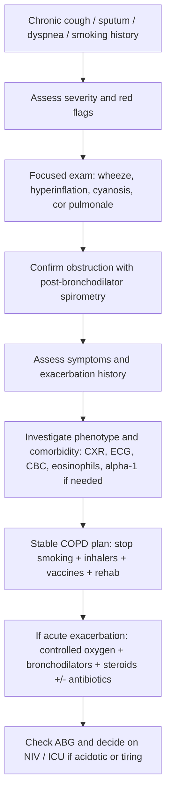
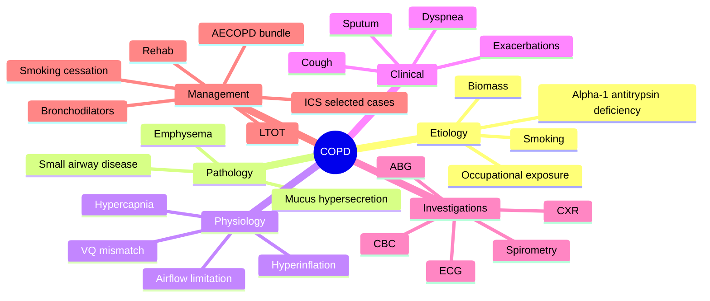
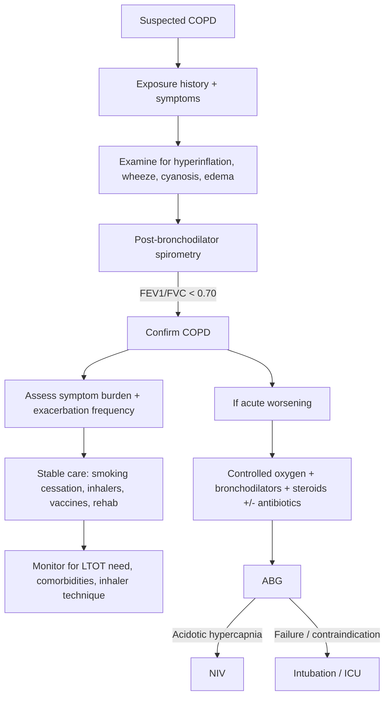

# COPD

> [!important]
> **COPD = chronic obstructive pulmonary disease**: a common, preventable, and treatable disease characterized by **persistent respiratory symptoms** and **airflow limitation that is not fully reversible**, usually due to **airway disease (chronic bronchiolitis)** and/or **alveolar destruction (emphysema)** caused by significant exposure to noxious particles or gases.

Related: [[Asthma]], [[Respiratory Failure]], [[ABG Interpretation]], [[Spirometry Interpretation]], [[Oxygen Therapy and NIV]], [[Bronchiectasis]], [[Lung Cancer]]

> [!tip]
> In FCPS/MRCP exams, COPD is tested through **symptom pattern recognition, spirometry, ABG interpretation, oxygen prescription, acute exacerbation management, NIV indications, and differentiation from asthma, bronchiectasis, heart failure, and lung cancer**.

## Learning Objectives
- Define COPD and distinguish it from asthma and other chronic respiratory disorders.
- Understand the airway and alveolar anatomy relevant to airflow obstruction, mucus retention, gas exchange, and hyperinflation.
- Explain the respiratory physiology behind airflow limitation, dynamic hyperinflation, V/Q mismatch, hypoxemia, hypercapnia, and cor pulmonale.
- Apply a stepwise approach to diagnosis using history, examination, spirometry, imaging, and ABG.
- Manage **stable COPD** and **acute exacerbation of COPD (AECOPD)** in an exam-oriented and bedside-safe way.
- Recognize oxygen therapy cautions, NIV indications, complications, and prognosis.

## Definition
COPD is a **heterogeneous syndrome** characterized by:
- **Chronic respiratory symptoms**: dyspnea, cough, sputum production, wheeze, chest tightness, reduced exercise tolerance.
- **Persistent airflow limitation** on spirometry, classically **post-bronchodilator FEV1/FVC < 0.70**.
- Structural abnormalities due to:
  - **Small airway disease**: chronic bronchiolitis, airway inflammation, fibrosis, mucus plugging.
  - **Parenchymal destruction**: emphysema with loss of alveolar walls and elastic recoil.

### Core clinical concept
COPD is not just “smoker’s cough.” It is a **systemic and pulmonary chronic disease** with repeated exacerbations, progressive disability, malnutrition/sarcopenia, pulmonary hypertension, cor pulmonale, and high cardiovascular risk.

## Core Anatomy
### 1. Conducting airways
Relevant structures from Gray’s and Davidson perspective:
- **Trachea → main bronchi → lobar bronchi → segmental bronchi → bronchioles**.
- Large airways are supported by cartilage; **small airways (<2 mm)** lack cartilage and are the major site of resistance in COPD.
- Bronchioles are lined by epithelium with mucus-producing elements proximally and club/ciliated cells distally.

### 2. Small airways
These are critical in COPD because:
- Inflammation causes **wall thickening**.
- Goblet cell metaplasia increases **mucus secretion**.
- Fibrosis narrows the lumen.
- Loss of radial traction from emphysema promotes expiratory collapse.

### 3. Alveoli and acinus
- Terminal bronchioles lead to **respiratory bronchioles, alveolar ducts, and alveolar sacs**.
- Normal alveoli provide a large gas-exchange surface area and support elastic recoil.
- In emphysema there is **destruction of alveolar walls**, reduced capillary bed, coalescence of air spaces, and reduced elastic recoil.

### 4. Respiratory muscle mechanics
- **Diaphragm** is the principal inspiratory muscle.
- Hyperinflation flattens the diaphragm, reducing mechanical efficiency.
- Accessory muscle use increases in advanced COPD.

### 5. Pulmonary vasculature
- Hypoxic vasoconstriction and vascular remodeling increase pulmonary vascular resistance.
- End result may be **pulmonary hypertension** and **cor pulmonale**.

> [!important]
> Small airways disease + emphysema together explain most COPD physiology: **airflow limitation, air trapping, hyperinflation, impaired gas exchange, and exertional dyspnea**.

## Core Physiology
### 1. Normal physiology relevant to COPD
- Airflow during expiration depends on:
  - airway caliber
  - elastic recoil of the lung
  - intrathoracic pressure relationships
- Gas exchange depends on:
  - alveolar ventilation
  - diffusion surface area
  - V/Q matching
  - pulmonary perfusion

### 2. Pathophysiologic physiology in COPD
#### A. Airflow limitation
Due to:
- airway inflammation and edema
- excess mucus
- bronchial wall thickening
- loss of elastic recoil
- dynamic airway collapse during expiration

This leads to:
- prolonged expiration
- wheeze
- reduced expiratory flow rates
- low FEV1 and low FEV1/FVC ratio

#### B. Air trapping and hyperinflation
Incomplete emptying of lungs during expiration causes:
- increased residual volume (RV)
- increased functional residual capacity (FRC)
- increased total lung capacity (TLC) in emphysema-predominant disease
- flattened diaphragm
- increased work of breathing

**Dynamic hyperinflation** worsens during exercise or exacerbation because expiratory time becomes too short.

#### C. V/Q mismatch
This is the main cause of hypoxemia in COPD.
- Poorly ventilated but perfused lung units create low V/Q areas.
- Emphysema may also reduce capillary bed and create high V/Q regions.

#### D. Diffusion impairment
- In emphysema there is reduced alveolar surface area.
- DLCO is often **reduced in emphysema**, relatively preserved in chronic bronchitis alone.

#### E. Hypercapnia
Hypercapnia occurs due to:
- severe airflow limitation
- increased dead space ventilation
- respiratory muscle fatigue
- reduced alveolar ventilation

#### F. Pulmonary circulation and cor pulmonale
Chronic hypoxemia causes:
- pulmonary vasoconstriction
- vascular remodeling
- pulmonary hypertension
- right ventricular strain and failure

### 3. Clinical physiology pearl
The sensation of dyspnea in COPD is strongly related to:
- dynamic hyperinflation
- increased inspiratory effort
- poor neuromechanical coupling

## Normal Values / Important Cut-offs
### Spirometry
- **Normal FEV1/FVC**: age-dependent, but in exams use about **>0.70–0.75** in younger adults.
- **COPD diagnostic threshold**: **post-bronchodilator FEV1/FVC <0.70**.
- FEV1 severity grading commonly used:
  - **GOLD 1**: FEV1 ≥80% predicted
  - **GOLD 2**: 50–79%
  - **GOLD 3**: 30–49%
  - **GOLD 4**: <30%

### ABG / oxygenation
- PaO2: **80–100 mmHg**
- PaCO2: **35–45 mmHg**
- pH: **7.35–7.45**
- HCO3-: **22–26 mmol/L**
- SaO2 target in most adults without CO2 retention risk: **94–98%**
- In COPD with risk of hypercapnic respiratory failure: **target SpO2 88–92%**

### Long-term oxygen therapy (LTOT) cut-offs
Classically indicated in stable COPD if:
- **PaO2 ≤7.3 kPa (55 mmHg)**, or
- **PaO2 7.3–8.0 kPa (55–60 mmHg)** with one of:
  - pulmonary hypertension
  - peripheral edema suggesting heart failure/cor pulmonale
  - secondary polycythemia

### Important symptom scales
- **mMRC dyspnea scale**: ≥2 suggests significant symptom burden.
- **CAT score**: ≥10 suggests more symptomatic disease.

### Alpha-1 antitrypsin deficiency clue
- COPD/emphysema at **young age**, especially **<45 years**, minimal smoking, or **basal emphysema**.

## Classification
## 1. Pathologic phenotype
- **Chronic bronchitis phenotype**: chronic productive cough for at least **3 months in each of 2 consecutive years**, after excluding other causes.
- **Emphysema phenotype**: destruction of alveolar walls and permanent enlargement of distal air spaces.
- Mixed phenotype is common.

## 2. Airflow limitation severity (spirometric)
| Grade | FEV1 (% predicted) | Clinical idea |
|---|---:|---|
| GOLD 1 | ≥80 | Mild obstruction |
| GOLD 2 | 50–79 | Moderate obstruction |
| GOLD 3 | 30–49 | Severe obstruction |
| GOLD 4 | <30 | Very severe obstruction |

## 3. Symptom/exacerbation-based clinical grouping
Useful bedside grouping:
- **Low symptoms / low exacerbation risk**
- **High symptoms / low exacerbation risk**
- **High exacerbation risk**: usually ≥2 moderate exacerbations/year or ≥1 hospitalization/year

## 4. By exacerbator phenotype
- infrequent exacerbator
- frequent exacerbator
- eosinophilic exacerbator
- chronic bronchitic frequent exacerbator

## 5. By respiratory failure status
- no respiratory failure
- type 1 respiratory failure (hypoxemic)
- type 2 respiratory failure (hypercapnic)

## Etiology / Causes
### Major causes
- **Tobacco smoking**: most important worldwide
- Biomass fuel exposure (wood, dung, crop residues)
- Occupational dusts, fumes, chemicals
- Outdoor and indoor air pollution
- Recurrent lower respiratory tract infections in early life
- Poor lung growth / low birth weight / childhood disadvantage
- **Alpha-1 antitrypsin deficiency**

### Contributors to progression
- continued smoking
- poor inhaler adherence
- recurrent infections/exacerbations
- malnutrition and muscle wasting
- comorbid heart disease

## Risk Factors
- Age >40 years
- Current or ex-smoker
- Biomass exposure, especially in poorly ventilated kitchens
- Occupational exposure: miners, factory workers, construction workers
- Low socioeconomic status
- Asthma-COPD overlap history
- Family history of emphysema or alpha-1 antitrypsin deficiency
- Prior tuberculosis or structural lung disease
- Repeated childhood respiratory infections

## Pathophysiology
### Inflammatory basis
COPD inflammation usually involves:
- neutrophils
- macrophages
- CD8+ T lymphocytes
- oxidant-antioxidant imbalance
- protease-antiprotease imbalance

### Major mechanisms
1. **Chronic inhalational injury** → epithelial damage
2. **Mucus hypersecretion** and impaired mucociliary clearance
3. **Small airway narrowing and fibrosis**
4. **Parenchymal destruction** with loss of elastic recoil
5. **Air trapping and hyperinflation**
6. **V/Q mismatch** → hypoxemia
7. **Chronic hypoxia** → pulmonary hypertension → cor pulmonale
8. Systemic effects:
   - muscle wasting
   - weight loss
   - osteoporosis
   - depression/anxiety
   - increased cardiovascular risk

### Chronic bronchitis-dominant disease
- mucus gland enlargement
- goblet cell hyperplasia
- chronic productive cough
- greater tendency to infection and hypoxemia

### Emphysema-dominant disease
- alveolar septal destruction
- bullae formation
- reduced diffusion capacity
- prominent hyperinflation and dyspnea

## Clinical Features
### Symptoms
- Progressive exertional dyspnea
- Chronic cough
- Sputum production
- Wheeze
- Chest tightness
- Reduced exercise tolerance
- Recurrent winter bronchitis or repeated exacerbations
- Fatigue, poor sleep, reduced activity

### Features suggesting exacerbation
- Increased breathlessness
- Increased sputum volume
- Increased sputum purulence
- Fever may occur but is not essential
- Reduced exercise tolerance
- Confusion, drowsiness, cyanosis in severe cases

### Examination findings
#### General
- tachypnea
- pursed-lip breathing
- use of accessory muscles
- weight loss/cachexia in advanced disease
- cyanosis in hypoxemia
- asterixis or drowsiness in CO2 retention

#### Chest
- hyperinflated “barrel” chest
- reduced chest expansion
- hyperresonant percussion note
- diminished breath sounds
- prolonged expiratory phase
- widespread wheeze or quiet chest in severe airflow obstruction

#### Signs of complications
- peripheral edema
- raised JVP
- loud P2 / parasternal heave suggesting pulmonary hypertension
- features of pneumonia, pneumothorax, or heart failure if present

> [!warning]
> A patient with severe COPD exacerbation and a **silent chest, exhaustion, or confusion** is at risk of impending ventilatory failure.

## Approach / Algorithm

### Bedside diagnostic approach
1. **Suspect COPD** in age >40 with smoking/biomass exposure + chronic dyspnea/cough/sputum.
2. Look for **red flags**:
   - severe distress
   - cyanosis
   - confusion
   - silent chest
   - hypotension
   - pneumothorax
3. Confirm persistent airflow obstruction by **post-bronchodilator spirometry**.
4. Grade disease severity by symptoms, FEV1, exacerbation history, exercise limitation, oxygenation.
5. Identify phenotype and comorbidities.
6. For acute deterioration, manage as **AECOPD** and assess for respiratory failure.

## Investigations
### 1. Spirometry — key diagnostic test
Findings:
- post-bronchodilator **FEV1/FVC <0.70**
- FEV1 reduced according to severity
- only partial bronchodilator reversibility

### 2. Peak expiratory flow
- Less useful for diagnosing COPD than spirometry.
- More variable and more useful in asthma monitoring.

### 3. Chest X-ray
May show:
- hyperinflation
- flattened diaphragms
- increased retrosternal air space
- attenuated vascular markings in emphysema
- bullae
- but may also be near normal early on

Useful mainly to:
- exclude pneumonia
- exclude pneumothorax
- detect lung cancer or heart failure

### 4. Arterial blood gas
Important when:
- severe exacerbation
- low oxygen saturation
- drowsiness/confusion
- cyanosis
- suspected CO2 retention

ABG may show:
- hypoxemia
- hypercapnia
- respiratory acidosis in acute decompensation
- chronic compensation with raised bicarbonate in longstanding CO2 retention

### 5. CBC
- polycythemia from chronic hypoxemia
- anemia as an alternative contributor to dyspnea
- leukocytosis in infection

### 6. Eosinophil count
- Helps predict likely benefit from inhaled corticosteroids in some patients.
- Higher eosinophils support steroid responsiveness.

### 7. ECG / echocardiography
- right heart strain or arrhythmia
- ischemic heart disease
- pulmonary hypertension / cor pulmonale

### 8. CT chest
Indications:
- uncertain diagnosis
- disproportionate symptoms
- suspected bronchiectasis, bullous disease, malignancy
- pre-surgical assessment

### 9. Alpha-1 antitrypsin level
Check if:
- early onset disease
- family history
- minimal smoking history
- basal emphysema pattern

### 10. Sputum culture
Useful in:
- frequent exacerbations
- severe purulent sputum
- failure of usual treatment
- suspected resistant organisms

### 11. Functional assessment
- pulse oximetry
- 6-minute walk test
- BMI, nutrition, muscle mass
- dyspnea scoring (mMRC)
- symptom scoring (CAT)

## Interpretation Frameworks
### 1. Spirometry interpretation in COPD
- Step 1: Ensure acceptable test quality.
- Step 2: If **FEV1/FVC low**, obstruction is present.
- Step 3: Assess bronchodilator response.
- Step 4: If obstruction persists post-bronchodilator, COPD is likely in the right clinical setting.
- Step 5: Grade severity by FEV1 % predicted.
- Step 6: Correlate with symptoms and exacerbation frequency, not FEV1 alone.

### 2. ABG interpretation in COPD
#### Common patterns
**Stable compensated chronic hypercapnia**
- low-ish pH or normal pH
- high PaCO2
- high HCO3-
- indicates renal compensation

**Acute on chronic type 2 respiratory failure**
- low pH
- high PaCO2
- HCO3- elevated but not enough to normalize pH
- urgent escalation; consider NIV

### 3. Oxygen therapy caution framework
In COPD, uncontrolled high-flow oxygen may worsen hypercapnia by:
- worsening V/Q mismatch
- reducing hypoxic pulmonary vasoconstriction
- Haldane effect
- minor reduction in respiratory drive in some patients

**Clinical rule:** if CO2 retention risk exists, prescribe oxygen to **88–92%**, not “oxygen as much as possible.”

### 4. CXR interpretation clues
Think of complications if deterioration is disproportionate:
- pneumonia
- pneumothorax
- pleural effusion
- lung cancer
- heart failure

## Diagnosis
COPD diagnosis requires a combination of:
- suggestive history: smoking/biomass exposure + chronic respiratory symptoms
- examination supportive of chronic airflow obstruction
- **spirometric confirmation: post-bronchodilator FEV1/FVC <0.70**

### Diagnostic statement example
“COPD, likely chronic bronchitis/emphysema mixed phenotype, GOLD 3 airflow limitation, frequent exacerbator, currently presenting with acute infective exacerbation and type 2 respiratory failure.”

## Differential Diagnosis
| Differential | Clues favoring it over COPD |
|---|---|
| [[Asthma]] | Earlier onset, atopy, marked variability, good reversibility |
| Heart failure | Orthopnea, PND, basal crepitations, cardiomegaly, edema with LV signs |
| [[Bronchiectasis]] | Large-volume purulent sputum, recurrent infections, clubbing, CT changes |
| Lung cancer | Weight loss, hemoptysis, focal signs, non-resolving symptoms |
| Tuberculosis | Fever, weight loss, night sweats, upper lobe lesions, exposure history |
| Interstitial lung disease | Restrictive pattern, fine bibasal crackles, low volumes not obstruction |
| Chronic pulmonary embolic disease | Disproportionate dyspnea, risk factors for thrombosis |
| Vocal cord dysfunction | Episodic symptoms with inspiratory component |

## Tables / Comparison Charts
### COPD vs Asthma
| Feature | COPD | Asthma |
|---|---|---|
| Typical age | >40 years | Often younger |
| Smoking link | Strong | Not essential |
| Symptoms | Persistent, progressive | Variable, episodic |
| Sputum | Common | Less prominent unless severe |
| Reversibility | Incomplete | Often marked |
| Spirometry | Persistent obstruction | Variable obstruction |
| DLCO | Often low in emphysema | Usually normal/high |
| Eosinophilic pattern | Sometimes | Common |

### Chronic bronchitis vs emphysema
| Feature | Chronic bronchitis | Emphysema |
|---|---|---|
| Dominant symptom | Productive cough | Dyspnea |
| Pathology | Mucus hypersecretion, airway inflammation | Alveolar destruction |
| Gas exchange | Earlier hypoxemia/hypercapnia | Lower DLCO, later gas failure initially |
| Body habitus | Edematous/cyanotic tendency | Thin, hyperinflated tendency |

### Stable COPD treatment summary
| Situation | Preferred step |
|---|---|
| All smokers | Smoking cessation support |
| Mild/intermittent symptoms | Short-acting bronchodilator PRN |
| Persistent symptoms | LABA or LAMA |
| More symptomatic / exacerbations | LABA + LAMA |
| Frequent exacerbations with eosinophilic tendency | Consider ICS-containing regimen |
| Very symptomatic / frequent exacerbator | Triple therapy LABA + LAMA + ICS |
| Chronic hypoxemia | LTOT if criteria met |
| Reduced exercise capacity | Pulmonary rehabilitation |

## Management
## A. Goals of management
- relieve symptoms
- improve exercise tolerance and quality of life
- reduce exacerbations and hospitalizations
- slow functional decline by smoking cessation
- manage complications and comorbidities
- improve survival in selected patients (especially smoking cessation and LTOT where indicated)

## B. Stable COPD management
### 1. Smoking cessation
Most effective intervention to slow disease progression.
Methods:
- counseling
- nicotine replacement therapy
- varenicline or bupropion when appropriate

### 2. Vaccination
- annual influenza vaccine
- pneumococcal vaccination as per guidance
- COVID and other indicated vaccines depending on local protocol

### 3. Inhaled bronchodilators
#### Short-acting
- SABA: salbutamol
- SAMA: ipratropium
Used for quick symptom relief.

#### Long-acting
- LABA
- LAMA
These are central in maintenance therapy.

### 4. Inhaled corticosteroids (ICS)
Not for everyone.
Consider when:
- frequent exacerbations
- eosinophilic tendency
- asthma overlap features

Avoid indiscriminate use because ICS may increase **pneumonia risk**.

### 5. Triple therapy
- LABA + LAMA + ICS
Useful in selected frequent exacerbators with symptoms despite dual therapy.

### 6. Pulmonary rehabilitation
Important for:
- exercise intolerance
- repeated hospitalization
- deconditioning
Improves exercise capacity and quality of life.

### 7. Nutrition and general care
- address weight loss and muscle wasting
- optimize protein/caloric intake
- breathing training and energy conservation
- treat anxiety/depression

### 8. LTOT
Indicated in chronic severe resting hypoxemia after assessment in stable state.
Typically most benefit when used **≥15 hours/day**.

### 9. Surgical/interventional options in selected cases
- bullectomy
- lung volume reduction procedures
- lung transplantation in advanced disease

## C. Acute exacerbation of COPD (AECOPD)
### Definition
Acute worsening of respiratory symptoms beyond usual day-to-day variation, requiring treatment change.

### Common triggers
- viral or bacterial infection
- air pollution
- pneumonia
- heart failure
- pulmonary embolism
- pneumothorax
- poor adherence / inhaler misuse

### Initial treatment bundle
1. **Controlled oxygen** to target **88–92%** if CO2 retention risk.
2. **Nebulized bronchodilators**:
   - salbutamol
   - ipratropium
3. **Systemic corticosteroids**:
   - e.g. prednisolone 40 mg daily for about 5 days in many protocols
4. **Antibiotics** if increased sputum purulence/volume or clinical infection/pneumonia.
5. **ABG** if severe or low saturation.
6. Identify and treat precipitant.
7. Consider **NIV** if acute hypercapnic acidosis.

### Antibiotic indications in exacerbation
Most useful when at least one of the following is prominent:
- increased sputum purulence
- increased sputum volume
- increased dyspnea
Especially if purulence is present or patient is severely unwell.

### NIV indications in AECOPD
Strongly consider when:
- persistent hypercapnic respiratory acidosis despite medical therapy
- increased work of breathing
- respiratory muscle fatigue
- severe dyspnea with use of accessory muscles

### When to intubate / ICU
- NIV failure
- worsening acidosis
- reduced consciousness
- hemodynamic instability
- inability to protect airway
- respiratory arrest or peri-arrest state

## Drug Interactions / Contraindications / Comorbidity Cautions
### Bronchodilator cautions
- **Beta-agonists** may cause tachycardia, tremor, hypokalemia; caution in arrhythmia/ischemic heart disease.
- **Antimuscarinics** may worsen urinary retention or angle-closure glaucoma risk in predisposed individuals.

### Steroid cautions
- Hyperglycemia in diabetes
- fluid retention / mood change
- infection risk
- osteoporosis with repeated courses

### ICS cautions
- increased risk of pneumonia
- oral candidiasis, dysphonia
- not a substitute for smoking cessation or bronchodilator optimization

### Theophylline cautions
Used less often, but exam-relevant:
- narrow therapeutic index
- arrhythmias and seizures in toxicity
- many drug interactions (macrolides, quinolones may increase levels)

### Oxygen caution
- Avoid indiscriminate high-concentration oxygen in known or possible CO2 retainers.
- Prescribe oxygen to a target, not as an unmonitored reflex.

### Comorbidity cautions
- Heart failure can mimic or coexist with COPD exacerbation.
- Pneumonia may coexist and worsen gas exchange.
- Osteoporosis, anxiety/depression, lung cancer, IHD, AF, sleep apnea often coexist.

## Procedures / Indications / Contraindications
### Important procedures in COPD care
- ABG sampling
- nebulization / inhaler technique review
- NIV
- intubation and invasive ventilation
- chest drain if secondary pneumothorax

## Procedure Mini-Sections
### 1. Arterial blood gas sampling
- **Indications:** severe exacerbation, low saturation, suspected hypercapnia, drowsiness
- **Contraindications/cautions:** poor collateral flow, local infection, anticoagulation caution
- **Complications:** pain, hematoma, arterial spasm, thrombosis
- **Viva pearl:** ABG is essential in severe AECOPD because pulse oximetry cannot diagnose hypercapnia.

### 2. Non-invasive ventilation (NIV)
- **Indications:** acute hypercapnic respiratory acidosis, increased work of breathing
- **Contraindications:** facial trauma, vomiting, inability to protect airway, severe agitation, arrest state
- **Complications:** aspiration, pressure sores, gastric distension, intolerance
- **Viva pearl:** NIV reduces intubation and mortality in suitable COPD exacerbations with acidotic hypercapnia.

### 3. Long-term oxygen therapy
- **Indications:** stable chronic severe hypoxemia meeting criteria
- **Contraindications/cautions:** active smoking is a major fire hazard; reassess when unstable
- **Complications:** fire risk, nasal dryness, over-oxygenation if misused
- **Viva pearl:** LTOT improves survival only in carefully selected chronically hypoxemic patients.

## Complications
- Acute exacerbations
- Type 1 or type 2 respiratory failure
- Pulmonary hypertension
- Cor pulmonale
- Secondary spontaneous pneumothorax
- Recurrent infections
- Polycythemia
- Weight loss and muscle wasting
- Osteoporosis
- Depression/anxiety
- Lung cancer association in smokers

## Red Flags / Emergencies
- Silent chest
- Exhaustion / inability to speak full sentences
- Cyanosis
- Confusion, drowsiness, CO2 narcosis
- Worsening acidosis on ABG
- Hemodynamic instability
- Suspected pneumothorax
- New focal chest signs suggesting pneumonia
- Massive hemoptysis

## Prognosis
Depends on:
- severity of airflow limitation
- frequency of exacerbations
- smoking continuation
- nutritional state
- exercise capacity
- chronic hypoxemia/hypercapnia
- cardiovascular comorbidity

Poor prognostic markers:
- recurrent hospital admissions
- low BMI / cachexia
- severe dyspnea
- cor pulmonale
- chronic hypercapnic failure

## Topic Correlation
- [[Asthma]]: differentiate by reversibility, atopy, variability.
- [[Respiratory Failure]]: COPD is a major cause of chronic and acute-on-chronic type 2 respiratory failure.
- [[ABG Interpretation]]: acid-base analysis is core in severe AECOPD.
- [[Spirometry Interpretation]]: confirms airflow obstruction.
- [[Oxygen Therapy and NIV]]: high-yield management crossover.
- [[Bronchiectasis]]: both may cause chronic sputum, but bronchiectasis often has large-volume purulence and CT changes.

## Special Situations
### 1. Alpha-1 antitrypsin deficiency
Think of it in young non-smoker with emphysema, especially basal disease.

### 2. Elderly patients
- Polypharmacy
- inhaler technique problems
- frailty and falls risk
- confusion during hypercapnia or infection

### 3. Diabetes
- systemic steroids may markedly worsen glucose control

### 4. Cardiovascular disease
- dyspnea may be mixed cardiac and pulmonary
- bronchodilator side effects may provoke tachyarrhythmia in vulnerable patients

### 5. Pregnancy
COPD is less common but management still prioritizes maternal oxygenation, infection treatment, and smoking cessation; specialist involvement is appropriate.

### 6. Suspected overlap with asthma
- eosinophilia / atopy / marked reversibility may justify stronger ICS consideration

## FCPS/MRCP High-Yield Points
- COPD diagnosis is confirmed by **post-bronchodilator spirometry**.
- **FEV1/FVC <0.70** is the classic exam threshold.
- Main causes of hypoxemia in COPD: **V/Q mismatch**.
- In severe COPD exacerbation, prescribe oxygen to **88–92%** if risk of CO2 retention.
- **NIV** is indicated in acute hypercapnic acidosis unless contraindicated.
- ICS is **not universal** in COPD; reserve for selected patients, especially frequent exacerbators/eosinophilic phenotype/asthma overlap.
- LTOT improves survival in chronic severe hypoxemia.
- Always search for alternative or additional causes of deterioration: **pneumonia, pneumothorax, PE, heart failure**.

## Common Viva Questions
1. Define COPD and how it differs from asthma.
2. What is the diagnostic spirometric criterion for COPD?
3. Why can uncontrolled oxygen worsen hypercapnia in COPD?
4. When do you use NIV in acute exacerbation of COPD?
5. What are the indications for LTOT in stable COPD?
6. What causes hypoxemia in COPD?
7. How do chronic bronchitis and emphysema differ pathologically?
8. What are the common complications of COPD?

## Common Confusions / Exam Traps
- **Trap:** Diagnosing COPD without spirometry.  
  **Correction:** Symptoms suggest it; spirometry confirms it.
- **Trap:** Giving uncontrolled oxygen to all breathless COPD patients.  
  **Correction:** Use controlled oxygen, target 88–92% if CO2 retention risk.
- **Trap:** Using ICS in every COPD patient.  
  **Correction:** ICS is selective, not routine for all.
- **Trap:** Assuming all wheeze is asthma.  
  **Correction:** COPD, HF, anaphylaxis, and airway lesions can wheeze too.
- **Trap:** Missing pneumothorax or pneumonia in a “COPD exacerbation.”

## Mnemonics
### Causes / risk factors: **SMOKE**
- **S**moking
- **M**ining / occupational exposure
- **O**utdoor/indoor pollution
- **K**itchen biomass fuel
- **E**nzyme deficiency (alpha-1 antitrypsin deficiency)

### Exacerbation treatment memory aid: **O-B-S-A-N**
- **O**xygen controlled
- **B**ronchodilators
- **S**teroids
- **A**ntibiotics when indicated
- **N**IV if acidotic hypercapnia

## Mind Map

## Flowchart

## Suggested Visuals / Image Notes
- Diagram of **normal alveolus vs emphysematous alveolus**.
- Small airway narrowing with mucus plugging.
- Hyperinflated chest X-ray with flattened diaphragms.
- Spirometry loop showing obstructive pattern.
- ABG interpretation ladder for acute-on-chronic respiratory failure.

## Suggested Video References
- “COPD pathophysiology and emphysema animation”
- “Spirometry interpretation in obstructive lung disease”
- “Oxygen therapy and NIV in COPD exacerbation”
- “ABG interpretation in chronic hypercapnic respiratory failure”

## One-Page Revision Summary
- COPD = persistent airflow limitation due to **small airway disease + emphysema**, usually from smoking/biomass exposure.
- Diagnose with **post-bronchodilator spirometry: FEV1/FVC <0.70**.
- Major symptoms: **progressive dyspnea, cough, sputum, wheeze, recurrent exacerbations**.
- Main physiology: **airflow obstruction, air trapping, hyperinflation, V/Q mismatch, hypoxemia, hypercapnia**.
- Emphysema lowers **elastic recoil** and **DLCO**.
- In severe exacerbation: **controlled oxygen 88–92%**, bronchodilators, steroids, antibiotics if indicated, ABG.
- **NIV** for acute hypercapnic acidosis if appropriate.
- LTOT improves survival in **chronic severe hypoxemia**.
- Important differentials: asthma, HF, bronchiectasis, lung cancer, pneumonia, PE.
- Always think of complications: cor pulmonale, pneumothorax, respiratory failure.

## 24-Hour Recall Prompts
- Define COPD in one sentence and list its two major structural components.
- Why is V/Q mismatch the major cause of hypoxemia in COPD?
- Write the diagnostic spirometry criterion from memory.
- State the oxygen target in COPD with risk of CO2 retention.
- List five causes of acute deterioration in a COPD patient.
- Distinguish chronic bronchitis from emphysema in a table from memory.
- When will you use NIV in AECOPD?

## 7-Day / 15-Day / 30-Day Revision Tracker
- [ ] Day 1 completed
- [ ] 24-hour recall completed
- [ ] Day 7 revision completed
- [ ] Day 15 revision completed
- [ ] Day 30 revision completed
- [ ] Re-attempt MCQs and SBAs after Day 7
- [ ] Re-draw the flowchart from memory after Day 15

## Must Know / Should Know / Nice to Know
### Must Know
- Definition and diagnostic spirometry criterion
- Pathophysiology of airflow limitation and hyperinflation
- Oxygen target 88–92% in CO2 retention risk
- AECOPD management bundle
- NIV indications
- LTOT indications

### Should Know
- DLCO difference in emphysema vs chronic bronchitis
- ICS selection principles
- COPD differentials and overlap states
- Cor pulmonale and pulmonary hypertension links

### Nice to Know
- Advanced interventions such as lung volume reduction
- detailed protease-antiprotease mechanisms
- phenotype-directed chronic management nuances

## My Weak Points
- [ ] I can confidently explain why oxygen may worsen hypercapnia.
- [ ] I can distinguish stable COPD treatment from acute exacerbation treatment.
- [ ] I can interpret an ABG showing acute-on-chronic type 2 respiratory failure.
- [ ] I can state LTOT criteria without checking the note.

## Self-Test Scorecard
- Understanding: /10
- Recall: /10
- MCQ Performance: /10
- SBA Performance: /10
- Viva Confidence: /10
- Total: /50

> [!tip]
> Interpretation: **<35 = weak topic**, **35–44 = acceptable but insecure**, **45+ = strong exam-ready topic**.

## Exam Answer Modes
### Long Answer Skeleton
- Definition
- Etiology/risk factors
- Pathophysiology
- Clinical features
- Investigations with spirometry
- Management of stable disease and acute exacerbation
- Complications and prognosis

### Short Note Skeleton
- COPD is persistent airflow limitation due to chronic airway disease and emphysema, usually from smoking.
- Diagnosis is by post-bronchodilator spirometry.
- Symptoms: dyspnea, cough, sputum.
- Management: smoking cessation, bronchodilators, selected ICS, rehab, LTOT if indicated, exacerbation bundle.

### Viva One-Liners
- “COPD is confirmed by post-bronchodilator obstruction on spirometry.”
- “Target oxygen saturation in CO2 retainers is 88–92%.”
- “NIV is used in acute hypercapnic acidosis if there is no contraindication.”

### Ward-Case Discussion Points
- baseline symptom burden and exercise tolerance
- smoking and biomass history
- exacerbation frequency and prior admissions
- inhaler technique/adherence
- ABG, CXR, ECG, comorbidities
- discharge plan: inhalers, rehab, vaccination, smoking cessation, follow-up

### Last-Night-Before-Exam Sheet
- FEV1/FVC <0.70 confirms persistent obstruction
- Chronic bronchitis = cough/sputum; emphysema = alveolar destruction
- V/Q mismatch causes hypoxemia
- O2 target 88–92% in hypercapnia risk
- Exacerbation: O2 + bronchodilator + steroid +/- antibiotic + ABG + NIV if acidotic
- LTOT for chronic severe hypoxemia

## Summary
COPD is a chronic disease of **persistent airflow limitation** caused by a mixture of **small airway disease** and **emphysema**. The major clinical hallmarks are progressive dyspnea, cough, sputum production, recurrent exacerbations, and eventual respiratory failure in advanced disease. Diagnosis rests on **spirometry**, while severity and treatment depend on symptoms, exacerbation history, oxygenation, and comorbidity burden. Stable management emphasizes **smoking cessation, bronchodilators, vaccination, pulmonary rehabilitation, and selective ICS use**, while acute exacerbation management centers on **controlled oxygen, bronchodilators, steroids, antibiotics when indicated, ABG assessment, and NIV for acute hypercapnic acidosis**.

## MCQs (10)
1. The spirometric criterion most classically used to diagnose COPD is:
   - A. Pre-bronchodilator FEV1 <80% predicted
   - B. Post-bronchodilator FEV1/FVC <0.70
   - C. Peak expiratory flow variability >20%
   - D. TLC <80% predicted

2. The most important modifiable risk factor for COPD is:
   - A. Atopy
   - B. Smoking
   - C. Obesity
   - D. Hyperuricemia

3. The major mechanism of hypoxemia in COPD is:
   - A. Right-to-left shunt only
   - B. Reduced inspired oxygen fraction
   - C. V/Q mismatch
   - D. Methemoglobinemia

4. Which physiologic change is most characteristic of emphysema?
   - A. Increased elastic recoil
   - B. Reduced alveolar surface area
   - C. Increased DLCO
   - D. Restrictive spirometry

5. In a COPD patient at risk of CO2 retention, the target oxygen saturation during acute exacerbation is usually:
   - A. 75–80%
   - B. 88–92%
   - C. 93–97%
   - D. 100%

6. Which investigation confirms persistent airflow obstruction in COPD?
   - A. Chest X-ray
   - B. Peak flow diary
   - C. Spirometry
   - D. Sputum culture

7. A 42-year-old minimal smoker with basal emphysema should raise suspicion of:
   - A. Sarcoidosis
   - B. Alpha-1 antitrypsin deficiency
   - C. Mitral stenosis
   - D. Silicosis

8. Which of the following is an accepted component of stable COPD management?
   - A. Routine antibiotics lifelong for all patients
   - B. Smoking cessation support
   - C. Long-term oral steroids for all patients
   - D. ICS for every patient irrespective of phenotype

9. NIV is particularly indicated in AECOPD when there is:
   - A. Hypercapnic acidosis
   - B. Mild cough only
   - C. Isolated eosinophilia
   - D. Asymptomatic desaturation to 95%

10. Which statement about inhaled corticosteroids in COPD is most accurate?
   - A. They are mandatory first-line therapy for every patient
   - B. They have no adverse effects
   - C. They are selective, especially useful in frequent exacerbators/eosinophilic or overlap phenotypes
   - D. They replace bronchodilators

## SBA Questions (10)
1. A 65-year-old smoker has progressive dyspnea, chronic cough, and sputum for 5 years. Post-bronchodilator spirometry shows FEV1/FVC 0.58. What is the most important next conclusion?
   - A. This excludes COPD because reversibility was not tested
   - B. COPD is confirmed in the appropriate clinical context
   - C. This pattern proves asthma only
   - D. This indicates restrictive lung disease

2. A 70-year-old man with known COPD presents with worsening breathlessness and purulent sputum. SpO2 is 80% on room air. What is the best initial oxygen strategy?
   - A. No oxygen until ABG returns
   - B. High-flow oxygen to 100% saturation
   - C. Controlled oxygen aiming 88–92%
   - D. Intubate immediately without oxygen

3. A 68-year-old woman with COPD is drowsy during an exacerbation. ABG: pH 7.28, PaCO2 68 mmHg, HCO3- 30 mmol/L. Best next step?
   - A. Discharge home with inhalers
   - B. Controlled oxygen only and review next week
   - C. Start NIV if no contraindication, alongside standard medical therapy
   - D. Stop all bronchodilators

4. A patient with COPD remains symptomatic despite a single long-acting bronchodilator and has frequent exacerbations with eosinophilia. Which escalation is most appropriate?
   - A. Stop inhalers completely
   - B. Consider ICS-containing regimen in addition to bronchodilator optimization
   - C. Use antibiotics every day without review
   - D. Give oxygen only during daytime regardless of oxygen level

5. A 59-year-old ex-smoker with severe dyspnea has emphysema-predominant COPD. Which lung function variable is most likely reduced compared with pure chronic bronchitis?
   - A. DLCO
   - B. Serum bicarbonate
   - C. Blood pressure
   - D. Hemoglobin always

6. Which one most strongly supports chronic bronchitis phenotype?
   - A. Sudden pleuritic pain
   - B. Chronic productive cough for 3 months in each of 2 consecutive years
   - C. Isolated hemoptysis only
   - D. Fine end-inspiratory crackles with restrictive spirometry

7. A COPD patient on repeated steroid courses develops worsening glucose control and proximal muscle weakness. The most likely contributor is:
   - A. Nebulized saline
   - B. Systemic corticosteroid exposure
   - C. Pulse oximetry
   - D. Chest physiotherapy

8. A known COPD patient acutely worsens but wheeze is minimal; there is sudden pleuritic chest pain and unilateral reduced breath sounds. What diagnosis must be excluded urgently?
   - A. Sinusitis
   - B. Pneumothorax
   - C. Migraine
   - D. GERD

9. Which intervention has the greatest impact on slowing long-term decline in lung function in a smoker with COPD?
   - A. Short-acting bronchodilator PRN alone
   - B. Smoking cessation
   - C. Empirical antifungals
   - D. Daily mucolytics for all patients

10. A stable COPD patient has persistent resting hypoxemia meeting criteria for LTOT. What is the major evidence-based benefit of LTOT in selected patients?
   - A. Cures airflow obstruction
   - B. Eliminates need for inhalers
   - C. Improves survival
   - D. Reverses emphysema structurally

## Flashcards
- Q: What spirometric value classically confirms COPD?
  A: Post-bronchodilator FEV1/FVC <0.70.
- Q: What are the two major structural components of COPD?
  A: Small airway disease and emphysema.
- Q: Main cause of hypoxemia in COPD?
  A: Ventilation-perfusion mismatch.
- Q: Oxygen saturation target in COPD with risk of hypercapnic respiratory failure?
  A: 88–92%.
- Q: What ABG pattern suggests acute-on-chronic type 2 respiratory failure?
  A: Low pH, high PaCO2, elevated HCO3- with incomplete compensation.
- Q: Which phenotype tends to have reduced DLCO?
  A: Emphysema-predominant COPD.
- Q: Name one major survival-improving intervention in COPD.
  A: Smoking cessation or LTOT in selected chronically hypoxemic patients.
- Q: When is NIV used in COPD exacerbation?
  A: In acute hypercapnic acidosis if no contraindication.
- Q: Which inherited condition causes early emphysema?
  A: Alpha-1 antitrypsin deficiency.
- Q: Why is ICS not used indiscriminately in COPD?
  A: Benefit is selective and it can increase pneumonia risk.

## Answer Key with Explanations
### MCQs
1. **B** — COPD is classically confirmed by **post-bronchodilator FEV1/FVC <0.70** in the right clinical context.
2. **B** — Smoking is the strongest modifiable risk factor.
3. **C** — V/Q mismatch is the principal mechanism of hypoxemia in COPD.
4. **B** — Emphysema destroys alveolar walls, reducing surface area and often DLCO.
5. **B** — Controlled oxygen targeting **88–92%** is standard in COPD patients at risk of CO2 retention.
6. **C** — Spirometry is the confirmatory diagnostic test.
7. **B** — Early/minimal-smoker emphysema suggests alpha-1 antitrypsin deficiency.
8. **B** — Smoking cessation is foundational and slows disease progression.
9. **A** — NIV is especially indicated in hypercapnic acidosis during AECOPD.
10. **C** — ICS use is selective, especially in frequent exacerbators/eosinophilic or overlap patterns.

### SBAs
1. **B** — Persistent post-bronchodilator obstruction with suggestive symptoms/exposure strongly supports COPD.
2. **C** — In suspected CO2 retainers, controlled oxygen with target 88–92% is safest initially.
3. **C** — This is acute-on-chronic hypercapnic respiratory acidosis; NIV is indicated if appropriate.
4. **B** — Frequent exacerbations plus eosinophilia support adding an ICS-containing regimen.
5. **A** — DLCO is often reduced in emphysema because gas-exchange surface area is lost.
6. **B** — This is the classic definition of chronic bronchitis.
7. **B** — Repeated systemic steroids can cause hyperglycemia and proximal myopathy.
8. **B** — Sudden pleuritic pain with unilateral reduced breath sounds in COPD raises concern for pneumothorax.
9. **B** — Smoking cessation most strongly alters long-term decline in lung function.
10. **C** — LTOT improves survival in selected stable COPD patients with chronic severe hypoxemia.
