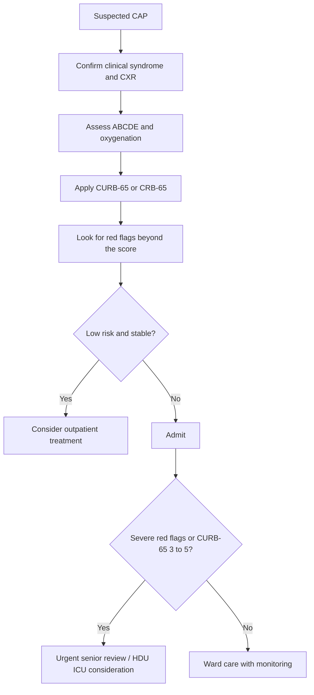
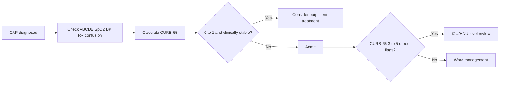

# Community-acquired pneumonia severity assessment

> [!important]
> **Community-acquired pneumonia (CAP) severity assessment** is the structured bedside process of deciding how ill the patient is, how high the mortality risk is, whether admission is needed, and whether the patient requires ward care, close monitoring, or ICU support.

Related: [[Pneumonia]], [[Respiratory Failure]], [[ABG Interpretation]], [[Chest X-Ray Approach]], [[Pleural Effusion]], [[COPD]]

> [!tip]
> FCPS/MRCP commonly test **CURB-65/CRB-65, clinical red flags, oxygenation assessment, confusion and hypotension as severity markers, sepsis overlap, and when scoring systems should not replace clinical judgment**.

## Learning Objectives
- Define CAP severity assessment and explain why it matters.
- Understand the anatomy and physiology behind hypoxemia, consolidation, sepsis, and respiratory failure in severe pneumonia.
- Apply CURB-65 and clinical red-flag thinking safely.
- Use investigations, ABG, and chest X-ray clues to stratify severity and disposition.
- Recognize limitations of scoring systems and know when ICU referral is needed.

## Definition
CAP severity assessment is the **clinical stratification of a patient with community-acquired pneumonia** into low-, intermediate-, or high-risk groups using bedside findings, physiology, laboratory tests, and validated scores such as **CURB-65**.

### Why it matters
It helps determine:
- outpatient vs inpatient management
- need for close monitoring
- need for HDU/ICU support
- intensity of antibiotics and supportive care
- prognosis and complication risk

## Core Anatomy
### 1. Alveolar involvement
- CAP mainly affects the **alveoli and distal air spaces**.
- Exudative filling causes reduced ventilation of affected lung regions.

### 2. Segmental/lobar anatomy relevance
- Lobar consolidation may produce major shunt physiology when a large region is affected.
- Multilobar disease increases severity and mortality risk.

### 3. Pleural relationship
- Pleural spread may lead to parapneumonic effusion or empyema.
- Pleural complications often indicate more severe or complicated pneumonia.

### 4. Pulmonary vascular and systemic link
- Severe infection can trigger systemic vasodilation, capillary leak, and sepsis physiology.

## Core Physiology
### 1. Oxygenation failure
Consolidated alveoli are perfused but poorly ventilated, causing:
- low V/Q mismatch
- shunt physiology
- hypoxemia

### 2. Increased work of breathing
- Reduced compliance and increased respiratory drive cause tachypnea.
- Tachypnea is an early severity signal.

### 3. Sepsis physiology
- Cytokine-driven vasodilation may lead to hypotension.
- Poor perfusion contributes to confusion, renal dysfunction, and lactate rise.

### 4. Respiratory failure logic
- Early disease: hypoxemia with low/normal PaCO2 from tachypnea
- Progressive severe disease: rising PaCO2 may indicate fatigue or severe ventilatory failure

> [!warning]
> A pneumonia patient who is **confused, hypotensive, tachypneic, or hypoxemic** is high risk even if not dramatically febrile.

## Normal Values / Important Cut-offs
### CURB-65 components
- **C**onfusion
- **U**rea > **7 mmol/L**
- **R**espiratory rate **≥30/min**
- **B**lood pressure: systolic **<90 mmHg** or diastolic **≤60 mmHg**
- Age **≥65 years**

### CURB-65 interpretation
| Score | Clinical meaning |
|---|---|
| 0–1 | low risk; often outpatient or short observation if otherwise stable |
| 2 | moderate risk; usually admit |
| 3–5 | severe pneumonia; urgent hospital care, consider HDU/ICU review |

### CRB-65
Useful where urea is not immediately available.

### Oxygenation red flags
- SpO2 <92% on air is concerning in many adults
- PaO2 <8 kPa suggests significant hypoxemia
- rising PaCO2 in pneumonia suggests tiring or severe respiratory failure

### Other important severity clues
- multilobar infiltrates
- sepsis/lactate elevation
- pleural complications
- inability to maintain oral intake
- major comorbidity or frailty

## Classification
### 1. By severity risk
- low severity CAP
- moderate severity CAP
- severe CAP

### 2. By clinical context
- uncomplicated CAP
- CAP with sepsis
- CAP with respiratory failure
- CAP with pleural complication

### 3. By site-of-care decision
- outpatient CAP
- inpatient ward CAP
- HDU/ICU-level CAP

## Etiology / Causes
Severity assessment is not about pathogen identification alone, but common pathogen context matters:
- Streptococcus pneumoniae
- Haemophilus influenzae
- atypical organisms
- respiratory viruses

Factors increasing severity risk:
- older age
- frailty
- COPD or heart failure
- diabetes, CKD, immunosuppression
- alcoholism or aspiration risk
- delayed presentation

## Risk Factors for Severe CAP
- age ≥65 years
- comorbidity
- frailty / nursing home status
- immunosuppression
- multilobar involvement
- septic physiology
- dehydration / poor intake
- delayed antibiotic initiation

## Pathophysiology
Severe CAP reflects a combination of:
- greater alveolar involvement
- more profound gas-exchange failure
- higher inflammatory burden
- greater systemic sepsis effects
- organ dysfunction risk

Clinical consequence:
- tachypnea, hypoxemia, hypotension, confusion, renal dysfunction, and need for higher-level care

## Clinical Features
### Symptoms/signs of pneumonia itself
- fever
- cough
- sputum
- pleuritic chest pain
- dyspnea
- crackles / bronchial breathing

### Severity markers
- confusion
- respiratory rate ≥30/min
- low BP
- hypoxemia
- cyanosis
- reduced urine output
- inability to eat/drink
- severe exhaustion
- multilobar disease or pleural complication

### Elderly presentation
- may present with confusion, falls, or functional decline rather than prominent fever/cough

## Approach / Severity Algorithm

## Investigations
### Essential
- pulse, BP, RR, temperature
- SpO2
- mental status assessment
- chest X-ray
- urea for CURB-65

### Additional high-yield tests
- FBC
- CRP
- U&E/creatinine
- ABG if hypoxemic, severe, or tiring
- blood cultures in severe CAP or before broad-spectrum therapy when appropriate
- sputum tests in selected severe/atypical cases
- lactate if sepsis suspected

## Interpretation Frameworks
### 1. CURB-65 stepwise use
1. Check confusion.
2. Check urea >7 mmol/L.
3. Check RR ≥30.
4. Check BP threshold.
5. Check age ≥65.
6. Total the score.
7. Combine score with clinical judgment.

### 2. ABG interpretation in severe CAP
| ABG pattern | Meaning |
|---|---|
| Low PaO2 + low PaCO2 | hypoxemic pneumonia with compensatory tachypnea |
| Low PaO2 + normal PaCO2 | worsening disease; compensation may be failing |
| Low PaO2 + high PaCO2 | severe pneumonia with ventilatory failure/tiring |

### 3. Chest X-ray severity clues
- multilobar consolidation
- rapidly progressive infiltrates
- pleural effusion
- cavitation/necrosis

### 4. Sepsis overlap framework
A patient with CAP plus:
- hypotension
- confusion
- raised lactate
- organ dysfunction
should be treated as severe infection/sepsis, not just “simple pneumonia.”

## Diagnosis
The diagnosis of severe vs non-severe CAP is based on:
- clinical pneumonia syndrome
- imaging evidence of pneumonia
- physiologic derangement
- CURB-65/CRB-65
- red-flag features and comorbidity context

## Differential Diagnosis
| Differential | Clues favoring it |
|---|---|
| **Pulmonary embolism** | pleuritic pain, disproportionate hypoxemia, VTE risk, less infective syndrome |
| **Acute heart failure** | orthopnea, edema, cardiogenic edema pattern on CXR |
| **COPD exacerbation** | wheeze, chronic obstructive history, may lack focal infiltrate |
| **Tuberculosis** | chronicity, weight loss, upper lobe/cavitating pattern, exposure history |
| **Lung malignancy with post-obstructive infection** | persistent focal shadow, weight loss, smoking history |

## Tables / Comparison Charts
### CURB-65 vs clinical judgment
| Tool/feature | Use | Limitation |
|---|---|---|
| CURB-65 | quick mortality risk stratification | may miss severity nuance in younger patients |
| CRB-65 | useful without lab urea | less precise than CURB-65 |
| Clinical judgment | catches sepsis, hypoxemia, frailty, multilobar disease | operator-dependent |

### Ward vs ICU concern
| Suggests ward admission | Suggests ICU/HDU review |
|---|---|
| CURB-65 = 2 | CURB-65 3–5 |
| oxygen need but stable BP | persistent hypoxemia or high oxygen need |
| no organ failure | hypotension, confusion, lactate rise, organ dysfunction |
| single-lobe disease | multilobar disease / rapidly progressive infiltrates |

## Management
### Initial management principles
1. Assess ABCDE.
2. Give oxygen if hypoxemic.
3. Perform severity assessment early.
4. Start empiric antibiotics promptly.
5. Decide on disposition: home, ward, or ICU-level care.
6. Monitor for pleural complication, sepsis, and respiratory failure.

### Oxygen therapy
- Use oxygen to maintain adequate saturation.
- If COPD/CO2 retention risk coexists, combine oxygen with ABG-guided caution.

### Antibiotics
- Choice depends on severity, guideline, comorbidity, and local resistance pattern.
- Severe CAP generally needs broader inpatient therapy and prompt delivery.

### Fluids and sepsis support
- treat dehydration or sepsis-associated hypoperfusion
- monitor urine output
- avoid fluid overload in cardiac patients

### ICU/HDU escalation triggers
- hypotension or septic shock
- escalating oxygen requirement
- rising CO2 / tiring
- altered mental status
- multilobar disease with physiological compromise

## Drug Interactions / Contraindications / Comorbidity Cautions
- Be cautious with fluids in heart failure.
- In COPD overlap, avoid unsafe over-oxygenation.
- Renal dysfunction may affect antibiotic choice/dose.
- QT-prolonging antibiotics require caution in susceptible patients.

## Procedures / Indications / Contraindications
### ABG
**Indication:** hypoxemia, severe CAP, worsening distress, or possible ventilatory failure.

### Blood cultures
**Indication:** severe CAP, sepsis, or selected hospitalized patients.

### Pleural aspiration
**Indication:** significant pleural effusion or suspected empyema.

## Procedure Mini-Sections
### ABG in CAP
- **Why:** defines oxygenation failure and detects tiring
- **Pearl:** normalizing PaCO2 in a distressed patient may be a bad sign
- **Complication:** pain, hematoma

### Pleural tap if effusion present
- **Why:** distinguish parapneumonic effusion/empyema
- **Pitfall:** missing a complicated effusion in a "non-improving pneumonia"

## Complications
- respiratory failure
- sepsis / septic shock
- parapneumonic effusion
- empyema
- lung abscess
- delirium in elderly
- acute kidney injury

## Red Flags / Emergencies
- confusion
- RR ≥30/min
- hypotension
- SpO2 <92% on air or significant hypoxemia
- multilobar disease
- pleural complication
- rising PaCO2 / exhaustion
- sepsis physiology

## Special Situations
### Elderly patient
- may score high because of age alone, but frailty and confusion make assessment even more important
- may present atypically with delirium or falls

### COPD overlap
- severity may be underestimated if wheeze dominates
- obtain ABG early if oxygenation or CO2-retention risk exists

### Immunocompromised patient
- broader pathogens and faster progression should be considered
- low threshold for admission

## Prognosis
- Low CURB-65 with stable physiology usually predicts good outcome.
- Severe CAP with confusion, hypotension, hypoxemia, or multilobar disease carries substantial mortality risk.
- Early antibiotics and appropriate disposition improve outcome.

## Topic Correlation
- [[Pneumonia]] covers the broader disease framework.
- [[ABG Interpretation]] and [[Chest X-Ray Approach]] support bedside severity logic.
- [[Pleural Effusion]] matters for complicated CAP.
- [[Respiratory Failure]] is the major escalation endpoint.

## FCPS/MRCP High-Yield Points
- **CURB-65** = confusion, urea >7, RR ≥30, low BP, age ≥65.
- **Score 0–1** often low risk; **2** generally needs admission; **3–5** suggests severe CAP.
- A score must **not replace clinical judgment**.
- Hypoxemia, sepsis, multilobar disease, and inability to maintain oral intake increase severity even if the score is modest.
- A normal PaCO2 in a very tachypneic pneumonia patient may indicate tiring.

## Common Viva Questions
- What is CURB-65?
- How do you interpret CURB-65 scores?
- What is CRB-65 and when is it useful?
- Name clinical red flags of severe CAP.
- When would you consider ICU referral?
- Why should scores not replace clinical judgment?

## Common Confusions / Exam Traps
- Using CURB-65 mechanically without looking at oxygenation or sepsis.
- Underestimating severity in younger patients with major hypoxemia but low age-based score.
- Missing pleural effusion/empyema in non-resolving CAP.
- Forgetting that elderly CAP may present mainly with confusion.

## Mnemonics
### **CURB** core danger memory aid
- **C**onfusion
- **U**rea high
- **R**espiratory rate high
- **B**lood pressure low
(+ age **65**)

## Mind Map
- CAP severity assessment
  - scoring
    - CURB-65
    - CRB-65
  - physiology
    - consolidation
    - hypoxemia
    - sepsis
  - red flags
    - confusion
    - hypotension
    - RR 30+
    - low oxygen
    - multilobar disease
  - disposition
    - home
    - admit
    - ICU/HDU

## Flowchart

## Suggested Visuals / Image Notes
- CURB-65 summary box
- Severe CAP red-flag chart
- CAP vs PE vs LVF comparison table
- CXR examples of single-lobe vs multilobar disease

## Suggested Video References
- Short review on **CURB-65 and CAP severity assessment**
- Video on **ABG and oxygenation assessment in pneumonia**
- Viva-style teaching on **CAP admission vs ICU criteria**

## One-Page Revision Summary
### CAP severity rapid sheet
- **Purpose:** decide mortality risk, admission need, and level of care
- **CURB-65:** confusion, urea >7, RR ≥30, BP low, age ≥65
- **0–1:** usually low risk if otherwise stable
- **2:** admit in most cases
- **3–5:** severe CAP, urgent senior review, consider HDU/ICU
- **Red flags beyond score:** hypoxemia, sepsis, multilobar disease, pleural complication, inability to drink, frailty, confusion
- **ABG pearl:** rising/normalizing PaCO2 in a distressed patient may indicate tiring
- **Do not:** use score alone without clinical judgment

## 24-Hour Recall Prompts
- State CURB-65 from memory.
- What score usually suggests admission?
- What findings make CAP severe even if the score is not very high?
- How does ABG help in severe CAP?
- Name three ICU/HDU escalation triggers.

## 7-Day / 15-Day / 30-Day Revision Tracker
- **Day 1:** Write CURB-65 and its cut-offs from memory.
- **Day 7:** Compare low-risk CAP vs severe CAP bedside features.
- **Day 15:** Explain why clinical judgment can overrule score-based reassurance.
- **Day 30:** Reproduce CAP ward vs ICU disposition logic from a blank page.

## Must Know / Should Know / Nice to Know
### Must Know
- CURB-65 criteria and interpretation
- hypoxemia/sepsis red flags
- admission vs ICU logic
- role of chest X-ray and ABG

### Should Know
- CRB-65 use when urea unavailable
- multilobar disease and pleural complications as severity clues
- pitfalls of age-based scoring alone

### Nice to Know
- broader pathogen-specific severe CAP nuances
- local guideline-specific antibiotic regimens

## My Weak Points
- Can I recall all CURB-65 components exactly?
- Do I remember that scores do not replace judgment?
- Can I spot severe CAP in a younger hypoxemic patient?
- Do I think of pleural complications and sepsis early enough?

## Self-Test Scorecard
- Understanding /10
- Recall /10
- Severity scoring /10
- MCQ performance /10
- Viva confidence /10

**Interpretation:**
- **<35/50** = weak topic
- **35–44/50** = fair
- **45+/50** = strong exam-ready topic

## Exam Answer Modes
### Short note mode
CAP severity assessment is the process of determining how sick a patient with community-acquired pneumonia is and what level of care is needed. The key bedside tool is CURB-65: confusion, urea >7 mmol/L, respiratory rate ≥30/min, low blood pressure, and age ≥65. Scores 0–1 usually suggest low risk, score 2 often requires admission, and scores 3–5 suggest severe CAP with need for urgent review and possible ICU care. Clinical judgment must always complement the score.

### Viva mode
- Define CAP severity assessment.
- State CURB-65.
- Interpret the score.
- Mention red flags beyond the score.
- State when ICU/HDU review is needed.

### Ward-case mode
In CAP, assess ABCDE, oxygenation, BP, RR, mental state, and urea early; confirm with CXR; calculate CURB-65; look for sepsis, hypoxemia, or multilobar disease; then decide on discharge, ward admission, or ICU-level escalation.

## Summary
CAP severity assessment is a high-yield exam and bedside skill centered on **CURB-65 plus clinical judgment**, with particular attention to **oxygenation, hypotension, confusion, sepsis, and respiratory failure risk**.

## MCQs (10)
1. Which of the following is part of the CURB-65 score?
   - A. Hemoglobin <10 g/dL
   - B. Urea >7 mmol/L
   - C. Platelets <100 ×10^9/L
   - D. Bilirubin >20 µmol/L
   - E. Pulse >120/min

2. In CAP, a respiratory rate of which value scores a CURB-65 point?
   - A. ≥20/min
   - B. ≥24/min
   - C. ≥28/min
   - D. ≥30/min
   - E. ≥35/min only

3. Which CURB-65 score generally suggests severe CAP?
   - A. 0 only
   - B. 1 only
   - C. 2 only
   - D. 3–5
   - E. Age alone

4. Which feature is a major severity clue even if CURB-65 is modest?
   - A. Stable appetite only
   - B. Multilobar infiltrates with hypoxemia
   - C. Mild isolated cough
   - D. Normal saturation and BP
   - E. Age 30 years

5. CRB-65 differs from CURB-65 mainly because it omits:
   - A. confusion
   - B. blood pressure
   - C. age
   - D. respiratory rate
   - E. urea

6. A normal PaCO2 in a very tachypneic pneumonia patient may indicate:
   - A. definite recovery
   - B. no need for admission
   - C. possible tiring and worsening ventilatory reserve
   - D. certain pulmonary embolism only
   - E. chronic asthma only

7. Which of the following best reflects the purpose of CAP severity assessment?
   - A. To identify the exact pathogen in all cases
   - B. To decide risk and level of care
   - C. To replace clinical judgment
   - D. To avoid chest X-ray
   - E. To determine smoking history only

8. Which blood pressure threshold gives one CURB-65 point?
   - A. SBP <100 only
   - B. SBP <90 or DBP ≤60
   - C. DBP <80 only
   - D. SBP <110 only
   - E. Any hypertension

9. Which complication strongly suggests more severe CAP?
   - A. Myopia
   - B. Pleural effusion/empyema
   - C. Chronic eczema
   - D. Hemorrhoids
   - E. Tinnitus

10. Which statement is most correct?
   - A. CURB-65 always overrides clinical judgment
   - B. Young patients cannot have severe CAP
   - C. Clinical red flags may mandate admission even with a lower score
   - D. ABG is never useful in CAP
   - E. Hypotension is irrelevant in pneumonia

## SBA Questions (10)
1. A 72-year-old man with CAP is confused, RR 32/min, BP 88/58 mmHg, and urea 9 mmol/L. What is the most appropriate assessment?
   - A. Low-risk CAP for home treatment
   - B. Moderate CAP only; no need for urgent review
   - C. Severe CAP with urgent hospital-level escalation required
   - D. Bronchitis only
   - E. Pulmonary embolism is certain

2. A 45-year-old woman with CAP has SpO2 86% on air and multilobar infiltrates, but CURB-65 is only 1. What is the best interpretation?
   - A. She is low risk because score is 1
   - B. Clinical judgment suggests severe disease despite low score
   - C. Age protects her from severe CAP
   - D. Discharge is mandatory
   - E. Chest X-ray should be ignored

3. A patient with CAP has RR 34/min, BP 110/70 mmHg, no confusion, age 50, and urea unavailable. Which bedside score is most useful initially?
   - A. MELD
   - B. CHADS2
   - C. CRB-65
   - D. Wells score
   - E. Child-Pugh

4. A man with CAP becomes drowsy and his ABG shows low PaO2 with rising PaCO2. What does this suggest?
   - A. Safe discharge
   - B. Ventilatory failure/tiring and need for urgent escalation
   - C. Mild outpatient pneumonia
   - D. Isolated anxiety
   - E. Artifact only

5. An elderly woman with CAP improves little after antibiotics and now has pleuritic pain with a moderate pleural effusion. What should be considered strongly?
   - A. Migraine
   - B. Parapneumonic effusion/empyema
   - C. Tension headache
   - D. Otitis externa
   - E. Chronic sinusitis

6. What is the strongest reason CURB-65 should not be used alone?
   - A. It is too long to calculate
   - B. It may miss important severity features such as hypoxemia and multilobar disease
   - C. It cannot be remembered
   - D. It has no respiratory component
   - E. It never includes age

7. A patient with CAP is hypotensive and lactate is raised. What is the best framework to apply in addition to pneumonia scoring?
   - A. Sleep study logic
   - B. Sepsis assessment and support
   - C. Dermatology severity scoring
   - D. Osteoporosis risk scoring
   - E. Dementia screening only

8. Which investigation is most essential to complete CURB-65 rather than CRB-65?
   - A. ECG
   - B. Serum urea
   - C. Sputum pH
   - D. Troponin
   - E. D-dimer

9. A COPD patient with CAP needs oxygen. What principle is best?
   - A. Avoid oxygen completely
   - B. Give oxygen, but use ABG-guided caution if CO2 retention risk exists
   - C. Always target 100%
   - D. Delay oxygen until antibiotics work
   - E. Only give bronchodilator

10. A patient with CAP has CURB-65 of 2, remains tachypneic, and is unable to maintain oral intake. What is the best disposition?
   - A. Routine discharge home
   - B. Admission for inpatient management
   - C. No treatment needed
   - D. Outpatient CT scan only
   - E. Ignore the score because age is under 65

## Flashcards
- Q: What does CURB-65 stand for?
  A: Confusion, Urea >7 mmol/L, Respiratory rate ≥30/min, low Blood pressure, age ≥65.
- Q: What CURB-65 score often suggests admission?
  A: **2**.
- Q: What CURB-65 score suggests severe CAP?
  A: **3–5**.
- Q: What is CRB-65 used for?
  A: CAP severity assessment when urea is not immediately available.
- Q: Name three CAP severity red flags beyond the score.
  A: Hypoxemia, multilobar disease, pleural complication, sepsis, poor oral intake.
- Q: Why can a normal PaCO2 be concerning in severe CAP?
  A: A tachypneic patient may be tiring if PaCO2 stops being low.
- Q: Which imaging finding increases CAP severity concern?
  A: **Multilobar consolidation**.
- Q: What pleural complication of CAP should you watch for?
  A: **Parapneumonic effusion/empyema**.
- Q: What is the key use of CAP severity assessment?
  A: To decide risk and level of care.
- Q: Does CURB-65 replace clinical judgment?
  A: No.

## Answer Key with Explanations
### MCQs
1. **B. Urea >7 mmol/L**
   - This is one of the five CURB-65 components.
2. **D. ≥30/min**
   - RR ≥30 earns one point.
3. **D. 3–5**
   - This range indicates severe CAP.
4. **B. Multilobar infiltrates with hypoxemia**
   - These are major severity red flags even if the score is not very high.
5. **E. urea**
   - CRB-65 omits urea.
6. **C. possible tiring and worsening ventilatory reserve**
   - A distressed pneumonia patient should often be hypocapnic early.
7. **B. To decide risk and level of care**
   - That is the purpose of severity assessment.
8. **B. SBP <90 or DBP ≤60**
   - This is the blood pressure criterion.
9. **B. Pleural effusion/empyema**
   - This complicates CAP and increases severity concern.
10. **C. Clinical red flags may mandate admission even with a lower score**
   - Clinical judgment remains essential.

### SBAs
1. **C. Severe CAP with urgent hospital-level escalation required**
   - He has several CURB-65 criteria and is clearly high risk.
2. **B. Clinical judgment suggests severe disease despite low score**
   - Hypoxemia and multilobar disease can trump a modest score.
3. **C. CRB-65**
   - It is the bedside version when urea is unavailable.
4. **B. Ventilatory failure/tiring and need for urgent escalation**
   - Rising CO2 in severe pneumonia is dangerous.
5. **B. Parapneumonic effusion/empyema**
   - A non-resolving pneumonia with effusion needs this consideration.
6. **B. It may miss important severity features such as hypoxemia and multilobar disease**
   - This is the key limitation.
7. **B. Sepsis assessment and support**
   - Hypotension and raised lactate indicate sepsis overlap.
8. **B. Serum urea**
   - That is the missing laboratory component.
9. **B. Give oxygen, but use ABG-guided caution if CO2 retention risk exists**
   - COPD overlap modifies oxygen strategy.
10. **B. Admission for inpatient management**
   - Score 2 plus poor intake and tachypnea supports admission.
