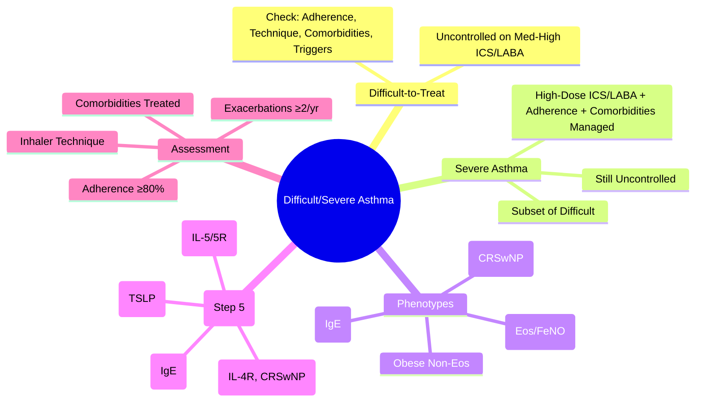

# Difficult-to-Treat and Severe Asthma

Related: [[Asthma]], [[Severe asthma]], [[Biologics]], [[Eosinophilic and phenotype-guided asthma]], [[Life-threatening asthma and status asthmaticus]]

> [!important]
> **Difficult-to-treat asthma** = uncontrolled despite **medium-high dose ICS/LABA** OR requires such to maintain control, after addressing **modifiable factors**. **Severe asthma** = subset of difficult-to-treat that remains uncontrolled **despite** high-dose ICS/LABA **with** good adherence, inhaler technique, comorbidity management. **Key FCPS/MRCP**: systematic assessment of difficult asthma, GINA Step 5 biologics, adherence/inhaler/comorbidity check, refractory vs severe distinction.

## Learning Objectives
- Distinguish **difficult-to-treat** from **severe asthma** (ERS/ATS definition)
- Apply systematic assessment: adherence, inhaler technique, comorbidities, triggers
- Apply GINA Step 5 treatment algorithm for severe asthma
- Select biologics based on phenotype/biomarkers
- Recognise when to refer to severe asthma clinic

## Definitions (ERS/ATS 2014, GINA 2023)

| Term | Definition |
|------|------------|
| **Difficult-to-treat asthma** | Uncontrolled despite **medium-high dose ICS/LABA** OR requires such to maintain control, after addressing modifiable factors |
| **Severe asthma** | **Subset** of difficult-to-treat: uncontrolled **despite** high-dose ICS/LABA **with** good adherence, correct inhaler technique, managed comorbidities |
| **Uncontrolled asthma** | **Any** of: daytime symptoms >2×/wk, night waking, reliever >2×/wk, activity limitation, FEV₁ <80% pred, exacerbations |

> **FCPS/MRCP tip**: **Severe asthma** = subset of difficult-to-treat that remains uncontrolled **after** addressing modifiable factors (adherence, technique, comorbidities, triggers). **Prevalence**: ~3-10% of asthma.

## Systematic Assessment of Difficult Asthma (The "Check List")

### 1. Confirm Diagnosis
- **Spirometry + reversibility** / **Bronchial challenge** / **Peak flow variability**
- **Exclude alternative**: VCD, dysfunctional breathing, bronchiectasis, COPD, heart failure, GERD, upper airway obstruction

### 2. Address Modifiable Factors (The "Big 4")
| Factor | Assessment | Intervention |
|--------|------------|--------------|
| **Adherence** | Pharmacy records, serum theophylline/FeNO, self-report | Simplify regimen, once-daily ICS/LABA, address beliefs |
| **Inhaler technique** | **Direct observation** at every visit | Teach, spacer, device switch, video coaching |
| **Comorbidities** | Treat or exclude | See table below |
| **Triggers** | Allergen/occupational/irritant exposure | Avoidance, immunotherapy, workplace modification |

### 3. Comorbidities Checklist (Treat First!)
| Comorbidity | Impact on Asthma | Screen |
|-------------|------------------|--------|
| **Allergic rhinitis / CRSwNP** | ↑ bronchial hyperresponsiveness | History, nasal endoscopy |
| **GERD** | Microaspiration, vagal reflex | PPI trial 8-12 weeks |
| **Obesity** | Mechanical + inflammatory | BMI ≥30 |
| **OSA** | ↑ airway inflammation, poor control | STOP-BANG, sleep study |
| **ABPA** | Eosinophilia, bronchiectasis | IgE, *Aspergillus* IgE, HRCT |
| **EGPA / Churg-Strauss** | Vasculitis + eosinophilia | ANCA, eosinophilia, neuropathy |
| **Psychological** | Anxiety, depression, dysfunctional breathing | HADS, Nijmegen questionnaire |

> **FCPS/MRCP tip**: **Treat comorbidities FIRST** — often "uncontrolled asthma" is actually uncontrolled rhinitis/GERD/obesity/OSA.

## Severe Asthma Phenotyping (Guides Biologic Selection)

| Phenotype | Biomarkers | Biologic Target |
|-----------|------------|-----------------|
| **Allergic (early onset)** | High IgE, eosinophils, FeNO | **Omalizumab** (anti-IgE) |
| **Late-onset eosinophilic** | High eos, FeNO, CRSwNP | **Mepolizumab/Benralizumab** (anti-IL5/5R) / **Dupilumab** (anti-IL4Rα) |
| **Aspirin-exacerbated (AERD)** | CRSwNP, eosinophilia, aspirin sensitivity | **Dupilumab** (IL-4Rα) / aspirin desensitisation |
| **Obese non-eosinophilic** | Low eos, high BMI, neutrophilic | Weight loss, LAMA/LABA, azithromycin |
| **Smoking-associated** | Low eos, smoking history | Smoking cessation, LAMA/LABA |

## GINA 2023 Step 5 Treatment Algorithm for Severe Asthma

### Step 5 Options (Add-on to High-Dose ICS/LABA)
| Option | Population | Agent |
|--------|------------|-------|
| **Anti-IgE** | Allergic, IgE 30-1500, ≥1 exacerbation/yr | **Omalizumab** |
| **Anti-IL5/5R** | Eosinophilic (≥150-300/µL), ≥2 exacerbations/yr | **Mepolizumab** (IL-5) / **Benralizumab** (IL-5R) |
| **Anti-IL4Rα** | Eosinophilic + CRSwNP / OCS-dependent | **Dupilumab** (IL-4Rα) |
| **Anti-TSLP** | Broad T2-high (eos ≥150, FeNO ≥25) | **Tezepelumab** |
| **Anti-IL13** | (Investigational) | Lebrikizumab, tralokinumab |

> **First biologic choice**: driven by **dominant phenotype/biomarkers** (see [[Eosinophilic and phenotype-guided asthma]]).

## Assessment for Biologic Eligibility (GINA Step 5)
| Criterion | Requirement |
|-----------|-------------|
| **Diagnosis confirmed** | Asthma + objective variability |
| **High-dose ICS/LABA** | ≥3 months |
| **Adherence** | ≥80% (pharmacy refill, FeNO suppression) |
| **Inhaler technique** | Correct at every visit |
| **Comorbidities managed** | Rhinitis, GERD, obesity, OSA, ABPA |
| **Exacerbations** | ≥2/yr requiring OCS **OR** ≥1 hospitalization/ICU **OR** OCS-dependent |
| **Lung function** | FEV₁ <80% predicted (or FeNO >25 ppb, eos ≥150) |

## Refractory Asthma vs Severe Asthma
| Term | Definition |
|------|------------|
| **Severe asthma** | Uncontrolled despite high-dose ICS/LABA + addressing modifiable factors |
| **Refractory asthma** | **Subset** of severe: remains uncontrolled despite **all** available biologics, OCS, adjuncts; may need bronchial thermoplasty, clinical trials |

## Management of OCS-Dependent Asthma
- **Goal**: eliminate or minimise OCS (≤7.5 mg prednisolone equiv)
- **Strategy**: add biologic → taper OCS by 2.5-5 mg q2-4wk to ≤5 mg → stop
- **Biologics with best OCS-sparing data**: **Benralizumab** (ZONDA), **Mepolizumab** (SIRIUS), **Dupilumab** (LIBERTY)

## Bronchial Thermoplasty (BT)
- **Mechanism**: radiofrequency energy → reduces airway smooth muscle mass
- **Indications**: severe asthma **uncontrolled on Step 5 + biologics**, FEV₁ >50%
- **Procedure**: 3 bronchoscopies (RML, LLL, RUL+LUL) at 3-week intervals
- **Evidence**: ↓ exacerbations, ↑ quality of life, ↑ FEV₁ modest; **not for severe obstruction** (FEV₁ <50%)
- **Risks**: transient worsening, hospitalisation, cost

## Severe Asthma Clinic Referral Criteria
- Uncontrolled on Step 4-5 despite adherence/comorbidity management
- ≥2 exacerbations/yr requiring OCS
- OCS-dependent
- Consideration for biologic/thermoplasty
- Complex comorbidities (EGPA, ABPA, AERD)

## FCPS/MRCP High-Yield Points
1. **Difficult-to-treat** = uncontrolled on med-high ICS/LABA; **Severe** = subset uncontrolled despite high-dose ICS/LABA + adherence/comorbidity check
2. **Modifiable factors first**: adherence, inhaler technique, rhinitis/GERD/obesity/OSA, triggers
3. **Severe asthma phenotypes**: allergic (IgE), eosinophilic (eos/FeNO), AERD (CRSwNP), obese non-eos
4. **Biologics**: omalizumab (IgE 30-1500), mepolizumab/benralizumab (eos ≥150-300), dupilumab (eos+CRSwNP/OCS-dep), tezepelumab (broad T2)
5. **Biologic eligibility**: high-dose ICS/LABA 3mo, adherence ≥80%, ≥2 exacerbations/yr or OCS-dependent
6. **OCS-dependent**: biologic → taper OCS; benralizumab/mepolizumab/dupilumab best OCS-sparing
7. **Bronchial thermoplasty**: FEV₁ >50%, on Step 5 + biologics, not for FEV₁ <50%
8. **Referral to severe asthma clinic**: uncontrolled Step 5, OCS-dependent, complex comorbidities

## Common Viva Questions
1. Difference between difficult-to-treat and severe asthma
2. Checklist for assessing difficult asthma (adherence, technique, comorbidities)
3. Severe asthma phenotypes and biologic selection
8. Biologic eligibility criteria (GINA Step 5)
9. OCS-dependent asthma management
9. Bronchial thermoplasty indications/contraindications
10. Refractory vs severe asthma distinction

## Common Confusions / Exam Traps
- **Difficult-to-treat ≠ severe** (severe = subset after modifiable factors addressed)
- **Poor adherence ≠ severe asthma** (severe = despite good adherence)
- **High-dose ICS alone ≠ Step 5** (must be ICS/LABA combination)
- **Biologic without addressing adherence/comorbidities** = waste
- **Bronchial thermoplasty** ≠ for FEV₁ <50% (safety)
- **All severe asthma needs biologic** = NO (some controlled on high-dose ICS/LABA + optimised comorbidities)
- **Omalizumab** = allergic (IgE 30-1500), **not** for non-allergic eosinophilic

## Mnemonics
- **DIFFICULT ASTHMA CHECKLIST**: **A**dherence, **I**nhaler technique, **F**FEV₁ <80%, **F**eNO/eos, **I**nhaler technique, **C**omorbidities (rhinitis, GERD, obesity), **U**nid­herence, **L**ate onset, **T**riggers → **A**Sthma **C**heck **L**ist
- **SEVERE ASTHMA PHENOTYPES**: **A**llergic (IgE), **E**osinophilic (eos/FeNO), **A**ERD (CRSwNP), **O**bese (non-eos)
- **BIOLOGICS**: **O**malizumab (IgE), **M**epolizumab (IL-5), **B**enralizumab (IL-5R), **D**upilumab (IL-4R), **T**ezepelumab (TSLP)

## Mind Map


## Flowchart
```mermaid
flowchart TD
  A[Uncontrolled Asthma on Med-High ICS/LABA] --> B[Address Modifiable Factors]
  B --> C1[Adherence ≥80%?]
  B --> C2[Inhaler Technique Correct?]
  B --> C3[Comorbidities Managed?]
  B --> C4[Triggers Addressed?]
  C1 & C2 & C3 & C4 --> D{Still Uncontrolled on High-Dose ICS/LABA?}
  D -->|Yes| E[Severe Asthma Confirmed]
  D -->|No| F[Continue Optimised Therapy]
  E --> G[Phenotype by Biomarkers]
  G --> H{T2-High?}
  H -->|eos≥150, FeNO≥25| I[Biologic Selection:\nOmalizumab (IgE)\nMepo/Benra (IL-5/5R)\nDupilumab (IL-4R, CRSwNP)\nTezepelumab (TSLP)]
  H -->|No| J[T2-Low: Azithromycin, Weight Loss, LAMA/LABA]
  I --> K[Response at 4mo:\n≥50% ↓ Exac, ↓ OCS, ↑ FEV1]
  K -->|Yes| L[Continue]
  K -->|No| M[Switch Biologic / Reassess Phenotype]
```

## Suggested Visuals / Image Notes
- Difficult vs severe asthma Venn diagram
- Biologic selection algorithm
- Step 5 treatment algorithm
- Exacerbation reduction with biologics

## Suggested Video References
- ERS/ATS severe asthma guidelines
- GINA 2023 severe asthma algorithm
- Biologic selection workshop

## One-Page Revision Summary
- **Difficult-to-treat** = uncontrolled on med-high ICS/LABA
- **Severe** = subset uncontrolled despite high-dose ICS/LABA + adherence/comorbidity check
- **Check first**: adherence, inhaler technique, rhinitis/GERD/obesity/OSA, triggers
- **Phenotypes**: allergic (IgE), eosinophilic (eos/FeNO), AERD (CRSwNP), obese non-eos
- **Biologics**: omalizumab (IgE 30-1500), mepolizumab/benralizumab (eos ≥150-300), dupilumab (eos+CRSwNP/OCS-dep), tezepelumab (broad T2)
- **Biologic eligibility**: high-dose ICS/LABA 3mo, adherence ≥80%, ≥2 exac/yr or OCS-dep
- **OCS-dependent**: biologic → taper; benralizumab/mepolizumab/dupilumab best OCS-sparing
- **Bronchial thermoplasty**: FEV₁ >50%, Step 5 + biologics
- **Refractory** = fails all biologics + OCS

## 24-Hour Recall Prompts
- Define difficult-to-treat vs severe asthma
- List 4 modifiable factors to check first
- Match biologics to biomarkers (IgE, IL-5, IL-5R, IL-4R, TSLP)
- State biologic eligibility criteria

## 7-Day / 15-Day / 30-Day Revision Tracker
- [ ] Day 1 completed
- [ ] 24-hour recall completed
- [ ] Day 7 revision completed
- [ ] Day 15 revision completed
- [ ] Day 30 revision completed

## Must Know / Should Know / Nice to Know
### Must Know
- Difficult-to-treat vs severe asthma distinction
- Modifiable factors checklist (adherence, technique, comorbidities, triggers)
- Severe asthma phenotypes and biologic selection
- Biologic eligibility (adherence, exacerbations, biomarkers)
- OCS-dependent management
- Bronchial thermoplasty indications

### Should Know
- Biologic selection algorithm details
- OCS tapering protocols with biologics
- Severe asthma clinic referral criteria
- Refractory asthma definition
- Cost-effectiveness considerations

### Nice to Know
- Specific trial data (SIRIUS, ZONDA, LIBERTY, NAVIGATOR)
- Biologic switching criteria
- Cost-effectiveness of biologics
- Long-term safety data
- Real-world effectiveness vs trial data

## Self-Test Scorecard
- Understanding: /10
- Recall: /10
- MCQ Performance: /10
- SBA Performance: /10
- Viva Confidence: /10
- Total: /50

> [!tip]
> Interpretation: <35 = weak topic, 35-44 = acceptable but insecure, 45+ = strong exam-ready topic.

## Exam Answer Modes
### Long Answer Skeleton
- Definitions: difficult-to-treat vs severe
- Modifiable factors checklist
- Severe asthma phenotypes table
- Biologics comparison table
- Step 5 algorithm
- OCS-dependent management
- Bronchial thermoplasty

### Short Note Skeleton
- Difficult vs severe box
- Modifiable factors checklist
- Biologics table (target, biomarker, indication)
- Eligibility criteria box

### Viva One-Liners
- "Difficult-to-treat = uncontrolled on med-high ICS/LABA; Severe = subset uncontrolled despite high-dose ICS/LABA + adherence/comorbidity check"
- "First check: adherence, inhaler technique, rhinitis/GERD/obesity/OSA, triggers"
- "Phenotypes: allergic (IgE), eosinophilic (eos/FeNO), AERD (CRSwNP), obese non-eos"
- "Biologics: omalizumab (IgE 30-1500), mep/benra (eos≥150-300), dupilumab (eos+CRSwNP/OCS-dep), tezepelumab (broad T2)"
- "Biologic eligibility: high-dose ICS/LABA 3mo, adherence ≥80%, ≥2 exac/yr or OCS-dep"
- "OCS-dependent: biologic → taper; benra/mepo/dupi best OCS-sparing"
- "Thermoplasty: FEV₁ >50%, Step 5 + biologics, NOT <50%"
- "Refractory = fails all biologics + OCS"

### Ward-Case Discussion Points
- Patient on high-dose ICS/LABA, 3 exacerbations, poor technique → teach technique first
- Severe eosinophilic asthma, eos 500, 3 exac/yr → mepolizumab/benralizumab/dupilumab
- OCS-dependent asthma, 10mg pred → add dupilumab → taper OCS
- Severe asthma, eos 50, obese, neutrophilic → azithromycin/weight loss, not biologic

### Last-Night-Before-Exam Sheet
- Difficult = uncontrolled med-high ICS/LABA
- Severe = despite high-dose ICS/LABA + adherence/comorbidity
- Check: Adherence, Technique, Comorbidities, Triggers
- Biologics: Omal(IgE), Mepo/Benra(IL-5/5R), Dupi(IL-4R, CRSwNP), Tezepe(TSLP)
- Eligibility: High-dose 3mo, Adh≥80%, ≥2 exac/yr or OCS-dep
- OCS-dep: Biologic → taper; Benra/Mepo/Dupi OCS-sparing
- Thermoplasty: FEV1>50%, Step 5+biologics
- Refractory = fails all biologics + OCS

## Summary
**Difficult-to-treat asthma** = uncontrolled on medium-high dose ICS/LABA. **Severe asthma** = subset uncontrolled **despite high-dose ICS/LABA** + **good adherence** + **managed comorbidities**. **Systematic check**: adherence, inhaler technique, comorbidities (rhinitis/GERD/obesity/OSA/ABPA/EGPA), triggers. **Severe phenotypes**: allergic (IgE), eosinophilic (eos/FeNO), AERD (CRSwNP), obese non-eos. **Biologics**: omalizumab (IgE 30-1500), mepolizumab/benralizumab (eos≥150-300), dupilumab (eos+CRSwNP/OCS-dep), tezepelumab (broad T2). **Eligibility**: high-dose ICS/LABA 3mo, adherence ≥80%, ≥2 exac/yr or OCS-dependent. **OCS-dependent** → biologic → taper. **Bronchial thermoplasty**: FEV₁ >50%, Step 5 + biologics. **Refractory** = fails all Step 5 options.

## MCQs (10)
1. **Difficult-to-treat asthma** vs **Severe asthma**: key difference is:
   A. Severe asthma requires OCS
   B. **Severe = subset of difficult-to-treat after modifiable factors addressed**
   C. Difficult-to-treat requires OCS
   D. Severe requires hospitalization
2. First step in assessing uncontrolled asthma on medium-high ICS/LABA:
   A. Order HRCT
   B. **Check adherence and inhaler technique**
   C. Start biologic
   D. Refer for bronchial thermoplasty
3. Blood eosinophil threshold for anti-IL5/5R biologic consideration:
   A. ≥100/µL
   B. **≥150-300/µL**
   C. ≥500/µL
   D. ≥1000/µL
4. Best biologic for **CRSwNP + eosinophilic asthma**:
   A. Omalizumab
   B. Mepolizumab
   C. Benralizumab
   D. **Dupilumab**
5. Bronchial thermoplasty contraindication:
   A. FEV₁ 60%
   B. **FEV₁ <50%**
   C. Age >60
   D. >2 exacerbations/yr

## SBA Questions (10)
1. A 42-year-old woman on high-dose fluticasone/salmeterol, adherent, good technique, treated rhinitis, has 3 exacerbations/yr requiring OCS. Blood eos 400, FeNO 50. Next step:
   A. Add LTRA
   B. **Add biologic (mepolizumab/benralizumab/dupilumab)**
   C. Increase ICS dose
   D. Add theophylline
2. Severe eosinophilic asthma, eos 500, no CRSwNP, on maintenance OCS 15mg. Best OCS-sparing biologic:
   A. Omalizumab
   B. Mepolizumab
   C. **Benralizumab** (best OCS-sparing)
   D. Dupilumab
3. Patient with severe asthma, IgE 500, eos 100, allergic history. Best biologic:
   A. Mepolizumab
   B. Benralizumab
   C. **Omalizumab**
   D. Dupilumab
4. Blood eosinophil threshold for anti-IL5/5R:
   A. ≥100/µL
   B. **≥150 (screen) / ≥300 (strong)**
   C. ≥500/µL
   D. ≥1000/µL
5. Difference between mepolizumab and benralizumab:
   A. Mepolizumab = IL-5R; Benralizumab = IL-5
   B. **Mepolizumab = anti-IL5 (ligand); Benralizumab = anti-IL5R (receptor, NK apoptosis, q8wk)**
   C. Same target, different dosing
   D. Benralizumab = anti-IL4R
6. Dupilumab target:
   A. IL-5
   B. IL-5R
   C. **IL-4Rα (blocks IL-4 & IL-13)**
   D. TSLP
7. Tezepelumab target:
   A. IL-5
   B. IL-4R
   C. IgE
   D. **TSLP (upstream)**
8. CRSwNP + eosinophilic asthma → preferred biologic:
   A. Omalizumab
   B. Mepolizumab
   C. Benralizumab
   D. **Dupilumab**
9. Blood eosinophil threshold for anti-IL5/5R therapy:
   A. 50
   B. **150/300**
   C. 500
   D. 1000
10. Non-T2 asthma phenotype treated with azithromycin:
    A. Eosinophilic
    B. **Neutrophilic**
    C. Obese
    D. Paucigranulocytic

## Flashcards
- Q: Difficult-to-treat vs Severe asthma
  A: Difficult = uncontrolled on med-high ICS/LABA; Severe = subset uncontrolled despite high-dose ICS/LABA + adherence/comorbidity check
- Q: First check in difficult asthma
  A: Adherence, inhaler technique, comorbidities, triggers
- Q: Biologics and targets
  A: Omal(IgE), Mepo(IL-5), Benra(IL-5R), Dupi(IL-4R), Tezepe(TSLP)
- Q: Benralizumab vs Mepolizumab
  A: Benra = IL-5R (receptor, NK apoptosis, q8wk); Mepo = IL-5 (ligand, q4wk)
- Q: Dupilumab indication
  A: CRSwNP + eosinophilic asthma, OCS-dependent
- Q: Omalizumab IgE range
  A: 30-1500 IU/mL
- Q: Eosinophil thresholds
  A: ≥150 screen T2-high; ≥300 anti-IL5/5R
- Q: FeNO T2-high
  A: ≥25 ppb
- Q: Dupilumab indication
  A: CRSwNP + eosinophilic asthma
- Q: Omalizumab IgE range
  A: 30-1500 IU/mL

## Answer Key with Explanations
### MCQs
1. **B** — Severe asthma = subset of difficult-to-treat after modifiable factors addressed.
2. **B** — First step: check adherence and inhaler technique (most common modifiable factors).
3. **B** — ≥150/µL screens T2-high; ≥300/µL strong indication for anti-IL5/5R.
4. **D** — Dupilumab (IL-4Rα) approved for CRSwNP + eosinophilic asthma.
5. **B** — FEV₁ <50% is contraindication to bronchial thermoplasty.

### SBAs
1. **B** — Uncontrolled on high-dose ICS/LABA + adherence + eosinophilia → biologic.
2. **C** — Benralizumab has best OCS-sparing data (ZONDA trial).
3. **C** — IgE 500, eos 100 → allergic phenotype → omalizumab.
4. **B** — ≥150 screen, ≥300 strong for anti-IL5/5R.
5. **B** — Mepolizumab = anti-IL5 ligand; Benralizumab = anti-IL5R receptor (NK apoptosis, q8wk).
6. **C** — Dupilumab = IL-4Rα, blocks IL-4 & IL-13.
7. **D** — Tezepelumab = TSLP (upstream).
8. **D** — CRSwNP + eosinophilic → dupilumab.
9. **B** — ≥150 screen, ≥300 strong.
10. **B** — Neutrophilic phenotype → azithromycin.

## Flashcards
- Q: Difficult vs Severe
  A: Difficult = uncontrolled on med-high ICS/LABA; Severe = subset despite high-dose + adherence + comorbidities
- Q: First check in difficult asthma
  A: Adherence, Technique, Comorbidities, Triggers
- Q: Biologics mapping
  A: Omal(IgE), Mepo(IL-5), Benra(IL-5R), Dupi(IL-4R), Tezepe(TSLP)
- Q: Benra vs Mepo
  A: Benra = IL-5R (receptor, NK apoptosis, q8wk); Mepo = IL-5 (ligand, q4wk)
- Q: Dupilumab indication
  A: CRSwNP + eosinophilic asthma, OCS-dependent
- Q: Omalizumab IgE range
  A: 30-1500 IU/mL
- Q: Eosinophil thresholds
  A: ≥150 screen T2-high; ≥300 anti-IL5/5R
- Q: FeNO T2-high
  A: ≥25 ppb
- Q: Dupilumab indication
  A: CRSwNP + eosinophilic asthma
- Q: Omalizumab IgE range
  A: 30-1500 IU/mL

## Answer Key with Explanations
### MCQs
1. **B** — Severe = subset of difficult-to-treat after addressing modifiable factors.
2. **B** — Check adherence and technique first (most common modifiable factors).
3. **B** — ≥150 screen, ≥300 strong for anti-IL5/5R.
4. **D** — Dupilumab = IL-4Rα, blocks IL-4/13, CRSwNP indication.
5. **B** — FEV₁ <50% contraindicated for bronchial thermoplasty.

### SBAs
1. **B** — Uncontrolled on high-dose ICS/LABA with adherence + eosinophilia → biologic.
2. **C** — Benralizumab best OCS-sparing (ZONDA).
3. **C** — IgE 500, eos 100 → allergic → omalizumab.
4. **B** — ≥150 screen, ≥300 strong for anti-IL5/5R.
5. **B** — Mepo = anti-IL5 ligand; Benra = anti-IL5R receptor (NK apoptosis, q8wk).
6. **C** — Dupilumab = IL-4Rα (blocks IL-4/13).
7. **D** — Tezepelumab = TSLP upstream.
8. **D** — CRSwNP + eosinophilic → dupilumab.
9. **B** — ≥150 screen, ≥300 strong.
10. **B** — Neutrophilic → azithromycin.

---
## Additional MCQs (6–10)

6. Before labelling asthma as "difficult-to-treat", confirm:
   A. Medication non-adherence is the cause
   B. **Adherence, inhaler technique, and comorbidities are addressed**
   C. Patient is exaggerating
   D. Spirometry is wrong
   E. The diagnosis is correct without question
   **Answer: B** — Confirm adherence/technique/comorbidities before escalating treatment.

7. The most common cause of "severe asthma" being uncontrolled is:
   A. Severe inflammation
   B. Genetic resistance
   C. **Poor adherence + incorrect inhaler technique**
   D. Drug interactions
   E. Diet
   **Answer: C** — Adherence and technique are the most common reasons.

8. A severe asthma patient on high-dose ICS-LABA + LAMA still has 4 exacerbations/year. Next step:
   A. Oral steroids long-term
   B. **Phenotype assessment + biologic (e.g. anti-IL5, anti-IgE, anti-IL4Rα)**
   C. Theophylline
   D. Macrolides only
   E. Hospital admission
   **Answer: B** — Biologics indicated for severe Type 2 asthma.

9. Which biologic is most appropriate for severe asthma with **blood eosinophils 600/µL, IgE normal**?
   A. Omalizumab
   B. **Mepolizumab (anti-IL5)**
   C. Montelukast
   D. Theophylline
   E. Infliximab
   **Answer: B** — Eosinophilic asthma → anti-IL5.

10. Which biologic is most appropriate for severe **allergic** asthma with elevated IgE?
    A. Mepolizumab
    B. **Omalizumab (anti-IgE)**
    C. Dupilumab
    D. Tezepelumab
    E. Methotrexate
    **Answer: B** — Allergic phenotype + ↑IgE → omalizumab.

## Additional SBAs (6–10)

6. A severe asthma patient on maximal inhaler therapy has ACT score 10 and 3 exacerbations. What should be done first?
   A. Refer for bronchial thermoplasty
   B. **Confirm adherence with prescription records, observe inhaler technique**
   C. Start oral steroids
   D. Add theophylline
   E. Lung transplant referral
   **Answer: B** — First step: confirm adherence/technique.

7. A 45-year-old with severe asthma on high-dose ICS-LABA has FeNO 80 ppb, eos 400/µL. Best biologic:
   A. Omalizumab
   B. **Dupilumab (anti-IL4Rα)**
   C. Infliximab
   D. Etanercept
   E. Cyclophosphamide
   **Answer: B** — High FeNO + high eos → Type 2 → dupilumab or anti-IL5.

8. In severe asthma, what % of patients have Type 2 inflammation?
   A. 10%
   B. 25%
   C. **~50–70%**
   D. 90%
   E. 100%
   **Answer: C** — Most severe asthma has Type 2 inflammation (eosinophils, FeNO, IgE).

9. Bronchial thermoplasty in severe asthma:
   A. First-line
   B. **Last-line for selected patients when biologics fail**
   C. Used in mild asthma
   D. Contraindicated
   E. Routine
   **Answer: B** — Reserved for selected severe asthma refractory to biologics.

10. Macrolides in severe asthma:
    A. First-line
    B. **Add-on trial in non-Type 2 severe asthma (azithromycin 3×/week)**
    C. Never used
    D. Only for infection
    E. Always with steroids
    **Answer: B** — Trial in non-Type 2 severe asthma.

## Local Navigation
- **Parent Heading**: [[../Airway Diseases|Airway Diseases]]
- **Parent Topic Group**: [[../Airway Diseases/Asthma spectrum|Asthma spectrum]]
- **Chapter Map**: [[../Davidson Chapter 17 - Respiratory Medicine Hierarchy|Respiratory Medicine Hierarchy]]
- **Chapter MOC**: [[../Respiratory MOC|Respiratory MOC]]
- **Drug Reference**: [[../../Clinical Therapeutics and Good Prescribing|Drugs]]
- **Related**: [[Asthma]] · [[Acute severe asthma]] · [[Occupational asthma]] · [[Eosinophilic and phenotype-guided asthma]] · [[Oxygen Therapy and NIV]]
