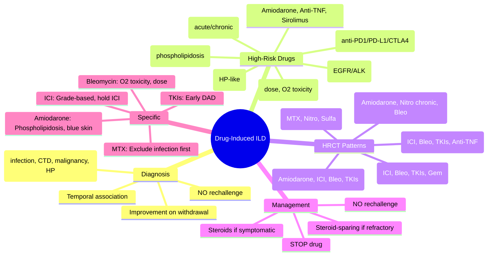
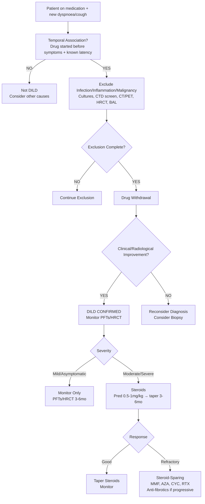

# Drug-Induced Interstitial Lung Disease (DILD)

Related: [[ILD framework]], [[Connective tissue disease-associated ILD]], [[Eosinophilic lung disease]], [[Hypersensitivity pneumonitis]], [[Chemotherapy]], [[Immunotherapy]], [[Biologics]], [[Amiodarone]], [[Nitrofurantoin]], [[Methotrexate]], [[Bleomycin]], [[Checkpoint inhibitors]]

> [!important]
> **Drug-induced ILD (DILD)** = **interstitial lung disease** caused by **medication**, diagnosed by **temporal association**, **exclusion of alternatives**, and **improvement on withdrawal**. **Key FCPS/MRCP**: **High-risk drugs** (bleomycin, amiodarone, nitrofurantoin, methotrexate, checkpoint inhibitors), **clinical patterns** (acute/subacute/chronic), **HRCT patterns** (NSIP, OP, DAD, HP-like, UIP-like), **diagnosis of exclusion**, **withdrawal + steroids** for symptomatic, **rechallenge = contraindicated**.

## Learning Objectives
- Identify **high-risk drug classes** and **specific agents** causing DILD
- Recognise **clinical presentations** (acute/subacute/chronic) and **time to onset**
- Apply **diagnostic criteria** (temporal relationship, exclusion of infection/CTD/malignancy, HRCT patterns)
- Interpret **HRCT patterns** (NSIP, OP, DAD, HP-like, UIP-like) and correlate with drug
- Manage **acute DILD** (stop drug, steroids, supportive) vs **chronic DILD** (stop drug, monitor, steroids if progressive)
- Recognise **specific high-risk drugs**: bleomycin, amiodarone, nitrofurantoin, methotrexate, checkpoint inhibitors, TKIs, anti-TNF
- Apply **rechallenge = contraindicated** principle

## Definition
**Drug-induced interstitial lung disease (DILD)** = **diffuse parenchymal lung injury** caused by a **medication**, with **no other identifiable cause** (infection, CTD, malignancy, HP, IPF), characterised by **temporal relationship** between drug initiation and symptom onset, and **improvement on drug withdrawal**.

> **FCPS/MRCP tip**: DILD is a **diagnosis of exclusion**. **Temporal association** is the cornerstone. **Rechallenge is absolutely contraindicated** (risk of fatal recurrence).

## High-Risk Drug Classes & Specific Agents
| Category | Agents | Typical Onset | HRCT Pattern | Key Features |
|----------|--------|---------------|--------------|--------------|
| **Chemotherapy** | **Bleomycin** (most classic), **Busulfan**, **Cyclophosphamide**, **Gemcitabine**, **Taxanes** (paclitaxel, docetaxel), **Vinca alkaloids** | Weeks–months (cumulative dose for bleomycin) | **NSIP**, **OP**, **DAD** (bleomycin), **Pulmonary fibrosis** | **Bleomycin**: dose-dependent (>400 units), **O2 toxicity** (avoid high FiO2 peri-op) |
| **Immunotherapy** | **Checkpoint inhibitors** (anti-PD-1: pembrolizumab, nivolumab; anti-PD-L1: atezolizumab, durvalumab; anti-CTLA-4: ipilimumab) | Weeks–months (median 2–3mo) | **NSIP**, **OP**, **DAD**, **HP-like** | **Fatal if not recognised**; **suspect in any new dyspnoea on ICI**; **steroids + hold ICI** |
| **Targeted Therapy** | **Tyrosine Kinase Inhibitors** (TKIs): **Gefitinib, Erlotinib, Osimertinib** (EGFR); **Crizotinib, Alectinib** (ALK); **Dasatinib, Nilotinib** (BCR-ABL) | Days–weeks (early) | **DAD**, **OP**, **NSIP** | **Dasatinib**: pleural effusion + ILD; **EGFR TKIs**: higher risk in Asians |
| **Anti-rheumatic** | **Methotrexate** (classic), **Leflunomide**, **Leflunomide**, **Sulfasalazine**, **Gold**, **Penicillamine**, **Hydroxychloroquine** (rare) | Months–years (MTX) | **HP-like** (centrilobular nodules, GGO, mosaic), **NSIP**, **OP** | **MTX pneumonitis**: acute/subacute, **hypersensitivity**; **exclude infection first** |
| **Anti-TNF / Biologics** | **Infliximab, Adalimumab, Etanercept, Certolizumab, Golimumab**; **Rituximab**, **Tocilizumab**, **Abatacept** | Variable | **NSIP**, **OP**, **DAD**, **Drug-induced lupus pneumonitis** | **Paradoxical**: used to treat CTD-ILD but can cause ILD |
| **Cardiovascular** | **Amiodarone** (most classic), **Beta-blockers** (rare), **ACE inhibitors**, **Statins** (rare) | Months–years (amiodarone) | **NSIP**, **OP**, **UIP-like**, **AEP-like** | **Amiodarone**: high-resolution CT = **high-attenuation alveolar opacities** (phospholipidosis); **blue-grey skin discoloration** |
| **Antibiotics** | **Nitrofurantoin** (acute/chronic), **Sulfonamides**, **Dapsone**, **Minocycline**, **Clarithromycin**, **Linezolid** | **Acute** (days–weeks, nitrofurantoin), **Chronic** (months, nitrofurantoin) | **Acute**: **HP-like** (centrilobular nodules, GGO, eosinophilia); **Chronic**: **NSIP/UIP-like** | **Nitrofurantoin**: acute = hypersensitivity (fever, eosinophilia), chronic = fibrosis |
| **Other** | **Sirolimus/Everolimus** (mTOR), **Interferon-alpha**, **BCG**, **Heroin/cocaine** (inhalational), **Talc** (IV), **Oxygen** (high FiO2 prolonged) | Variable | Variable | **Sirolimus**: non-infectious pneumonitis post-transplant |

## Clinical Patterns by Acuity
### Acute/Subacute (Days–Weeks)
| Pattern | Typical Drugs | Features |
|---------|---------------|----------|
| **Acute Hypersensitivity** | Nitrofurantoin, Sulfonamides, MTX, Abacavir, Minocycline | **Fever, rash, eosinophilia**, dyspnoea 1–2wks post-start |
| **Acute Eosinophilic Pneumonia (AEP-like)** | Nitrofurantoin, Sulfonamides, Minocycline, Dapsone | Acute hypoxaemia, BAL eos >25%, dramatic steroid response |
| **Diffuse Alveolar Damage (DAD)** | **Checkpoint inhibitors**, **Bleomycin**, **TKIs** (EGFR/ALK), **Gemcitabine** | **Fulminant**, ARDS, high mortality |
| **Organising Pneumonia (OP)** | **Checkpoint inhibitors**, **Bleomycin**, **TKIs**, **Anti-TNF**, **NSAIDs** | Subacute, migratory consolidation, steroid-responsive |

### Chronic (Months–Years)
| Pattern | Typical Drugs | Features |
|---------|---------------|----------|
| **NSIP** | **Amiodarone**, **Checkpoint inhibitors**, **MTX**, **Bleomycin**, **TKIs**, **Leflunomide** | Insidious dyspnoea, basal GGO/reticulation, subpleural sparing |
| **UIP-like Fibrosis** | **Amiodarone**, **Nitrofurantoin (chronic)**, **Bleomycin (late)**, **Methotrexate** | Basal honeycombing, traction bronchiectasis, **indistinguishable from IPF** |
| **Chronic Eosinophilic Pneumonia** | Nitrofurantoin, Minocycline, Dapsone, Sulfonamides | Peripheral eos, photo-negative CXR, steroid-responsive |

## Diagnosis
### Diagnostic Criteria (All Required)
1. **Temporal relationship**: Symptoms onset after drug initiation (latency known for drug)
2. **Clinical/radiological/histological ILD pattern** (dyspnoea, cough, HRCT changes, restrictive PFTs)
3. **Exclusion of alternatives**: Infection (bacterial, viral, TB, fungal, PJP), CTD-ILD, malignancy, HP, IPF, eosinophilic lung disease
4. **Improvement on drug withdrawal** (clinical, radiological, PFTs)
5. **Exclusion of other causes** (occupational, environmental)

> **FCPS/MRCP tip**: **Rechallenge = ABSOLUTELY CONTRAINDICATED** (fatal recurrence risk). **Diagnosis supported by**: temporal association + exclusion + improvement off drug.

### HRCT Pattern → Drug Clues
| HRCT Pattern | Suggestive Drugs |
|--------------|-----------------|
| **HP-like** (centrilobular nodules, GGO, mosaic attenuation) | **MTX, Nitrofurantoin, Sulfonamides, Minocycline, Dapsone** |
| **NSIP** (basal GGO, reticulation, subpleural sparing) | **Amiodarone, Checkpoint inhibitors, MTX, Bleomycin, TKIs** |
| **OP** (migratory consolidation, reversed halo) | **Checkpoint inhibitors, Bleomycin, TKIs, Anti-TNF, NSAIDs** |
| **DAD** (diffuse GGO, consolidation, hyaline membranes) | **Checkpoint inhibitors, Bleomycin, TKIs, Gemcitabine** |
| **UIP-like** (honeycombing, traction bronchiectasis, basal) | **Amiodarone, Nitrofurantoin (chronic), Bleomycin, MTX** |
| **AEP-like** (diffuse GGO, pleural effusion) | **Nitrofurantoin, Sulfonamides, Minocycline** |

## Specific High-Risk Drugs — Key Exam Details

### 1. Bleomycin
- **Dose-dependent**: >400 units lifetime = high risk
- **Pulmonary fibrosis** (NSIP → UIP) — **irreversible**
- **Oxygen toxicity**: **Avoid high FiO2** perioperatively (↑ ROS → fatal ARDS)
- **Monitoring**: PFTs (DLCO) q3mo during treatment

### 2. Amiodarone
- **Phospholipidosis** (high-attenuation alveolar opacities on HRCT)
- **Onset**: Months–years (long half-life 50–100d)
- **Blue-grey skin discoloration** (photo-sensitive)
- **Thyroid** (hypo/hyper), **liver**, **neuropathy**, **corneal deposits**
- **HRCT**: **High-attenuation GGO/consolidation** (basal), **subpleural sparing** — mimics NSIP

### 3. Nitrofurantoin
| Form | Onset | Features |
|------|-------|----------|
| **Acute** | Days–weeks | **Fever, rash, eosinophilia**, acute dyspnoea, **HP-like HRCT** |
| **Chronic** | Months–years | **Insidious fibrosis** (NSIP/UIP-like), often misdiagnosed as IPF |

### 4. Methotrexate (MTX)
- **Acute hypersensitivity pneumonitis** (fever, dyspnoea, eosinophilia, HP-like HRCT)
- **Onset**: Weeks–months (can occur at low dose)
- **Exclude infection first** (PJP, TB, fungal) — **opportunistic infections common**
- **Folate supplementation** (5mg weekly) reduces but doesn't eliminate risk

### 5. Checkpoint Inhibitors (ICI)
- **Anti-PD-1** (pembrolizumab, nivolumab, cemiplimab), **Anti-PD-L1** (atezolizumab, durvalumab, avelumab), **Anti-CTLA-4** (ipilimumab)
- **Incidence**: 3–5% (higher with combination)
- **Median onset**: 2–3 months
- **Patterns**: NSIP, OP, DAD, HP-like
- **Grades**: G1 (asymptomatic), G2 (symptomatic), G3 (severe), G4 (life-threatening)
- **Management**: **Hold ICI**, **G2+ → steroids (pred 1mg/kg)**, **G3/4 → high-dose IV steroids + infliximab/MMF if steroid-refractory**

### 6. EGFR TKIs (Gefitinib, Erlotinib, Osimertinib)
- **Incidence**: 1–4% (higher in Asians, smokers, pre-existing ILD)
- **Onset**: Early (median 1–2 months)
- **Pattern**: **DAD** (acute, high mortality), OP
- **Management**: **Stop TKI**, high-dose steroids, supportive

## Diagnostic Algorithm
```
New dyspnoea/cough on medication
    ↓
1. Temporal association? (Drug started before symptoms, known latency)
2. Exclude infection (sputum culture, viral PCR, PJP, TB, blood cultures)
3. Exclude CTD (ANA, RF, CCP, ENA), malignancy (CT, PET), HP (exposure, precipitins)
4. HRCT pattern + PFTs (restrictive, ↓DLCO)
5. BAL if diagnostic uncertainty (exclude infection, eosinophilia, CD4/CD8)
6. Drug withdrawal → monitor for improvement (2–4 weeks)
    ↓
Improvement → DILD CONFIRMED
No improvement → Reconsider diagnosis
```

## Management
### 1. Immediate Drug Withdrawal (First Step)
- **Stop offending drug immediately**
- **Do NOT rechallenge** (fatal recurrence)

### 2. Corticosteroids (If Symptomatic / Progressive)
| Severity | Regimen |
|----------|---------|
| **Mild** (asymptomatic, incidental HRCT) | **Drug withdrawal alone**, monitor (PFTs, HRCT 3–6mo) |
| **Moderate** (symptomatic, PaO2 >8kPa) | **Prednisolone 0.5–1mg/kg/day** (30–50mg) ×2–4wks → slow taper 3–6mo |
| **Severe/DAD** (hypoxaemia, ICU) | **IV Methylprednisolone 500–1000mg ×3–5d** → oral taper 4–8wks |

### 3. Steroid-Sparing / Immunosuppressants (Refractory)
- **Mycophenolate** (1.5–3g/day) — 1st line steroid-sparing
- **Azathioprine** (1.5–2.5mg/kg/day)
- **Cyclophosphamide** (IV pulse) — for severe/refractory
- **Rituximab** — for anti-TNF induced, SJÖGREN's associated
- **Anti-fibrotics** (Nintedanib/Pirfenidone) — if progressive fibrotic phenotype

### 4. Specific Drug Considerations
| Drug | Specific Management |
|------|---------------------|
| **Bleomycin** | **Avoid O2 >30%** perioperatively; lung transplant if end-stage |
| **Amiodarone** | **Stop amiodarone**; steroids if symptomatic; long washout (months) |
| **Checkpoint Inhibitors** | **Grade-based**: G1 monitor, G2+ steroids, G3/4 high-dose IV steroids + infliximab/MMF; restart ICI only if G1/G2 resolved (oncology decision) |
| **EGFR TKIs** | Stop TKI, high-dose steroids; consider chemotherapy switch |
| **Nitrofurantoin (acute)** | Stop drug, steroids (dramatic response) |
| **MTX** | Stop MTX, steroids, switch to alternative DMARD (RTX, ABA, TCZ) |

## Complications
- **Progressive fibrosis** → respiratory failure
- **Acute exacerbation** (DAD pattern) — high mortality
- **Pulmonary hypertension** → cor pulmonale
- **Secondary infection** (on steroids)
- **Corticosteroid toxicity** (osteoporosis, diabetes, infection)

## Red Flags / Emergencies
- **Rapid deterioration** (new hypoxaemia, rising FiO2) → ICU, high-dose IV steroids, exclude infection
- **DAD pattern on HRCT** → **Checkpoint inhibitors, Bleomycin, TKIs** — high mortality
- **Massive haemoptysis** (rare) → BAE
- **Pneumothorax** (amiodarone, sirolimus) → chest drain

## Special Situations
### Pregnancy
- **Avoid**: Methotrexate, Leflunomide, Mycophenolate, Cyclophosphamide, Nitrofurantoin (near term), Bleomycin
- **Steroids**: Prednisolone safe
- **Amiodarone**: Avoid (fetal thyroid)

### Post-Lung Transplant
- **Sirolimus/Everolimus** — pneumonitis risk (avoid early post-transplant)
- **Distinguish from**: Rejection, infection (CMV, PJP), recurrence

### Cancer Patients on ICI
- **Oncology co-management** essential
- **Restart ICI** only if G1/G2 resolved (multidisciplinary decision)
- **Prophylactic steroids not recommended** (may reduce efficacy)

## Prognosis
| Pattern | Prognosis |
|---------|-----------|
| **Acute hypersensitivity** | **Excellent** (full recovery with withdrawal + steroids) |
| **OP / AEP-like** | **Good** (steroid-responsive, low relapse) |
| **NSIP** | **Variable** (steroid-responsive, some progressive) |
| **DAD / Acute ICI pneumonitis** | **Poor** (mortality 30–50% if ventilated) |
| **UIP-like / Chronic fibrosis** | **Poor** (progressive, like IPF) |
| **Amiodarone / Nitrofurantoin chronic** | **Variable** (may stabilise or progress) |

## Topic Correlation
- [[ILD framework]] — diagnostic framework
- [[Connective tissue disease-associated ILD]] — MTX/anti-TNF overlap
- [[Eosinophilic lung disease]] — drug-induced eosinophilic pneumonia
- [[Hypersensitivity pneumonitis]] — MTX/nitrofurantoin mimic HP
- [[Checkpoint inhibitors]] — ICI pneumonitis
- [[Chemotherapy]] — bleomycin, gemcitabine

## FCPS/MRCP High-Yield Points
1. **DILD** = diagnosis of exclusion; **temporal association + exclusion + improvement off drug**
2. **High-risk drugs**: Bleomycin (dose>400u, O2 toxicity), Amiodarone (phospholipidosis, blue skin), Nitrofurantoin (acute hypersensitivity + chronic fibrosis), MTX (acute HP, exclude infection), Checkpoint inhibitors (3–5%, DAD/NSIP/OP, steroids + hold ICI), EGFR TKIs (early DAD, high mortality)
3. **HRCT patterns**: HP-like (MTX, nitrofurantoin), NSIP (amiodarone, ICI), DAD (ICI, bleomycin, TKIs), UIP-like (amiodarone, chronic nitrofurantoin)
4. **Diagnosis**: Temporal + exclusion + improvement off drug; **rechallenge = contraindicated**
5. **Management**: Stop drug first; steroids if symptomatic; steroid-sparing if refractory
6. **ICI grading**: G1 monitor, G2+ steroids, G3/4 IV steroids + infliximab/MMF
7. **Bleomycin**: Avoid high FiO2 peri-op; MTX: exclude infection first
8. **Amiodarone**: Phospholipidosis (high-attenuation GGO), blue skin, thyroid/liver/neuro
9. **Nitrofurantoin**: Acute (fever, eosinophilia, HP-like) vs Chronic (fibrosis)
10. **EGFR TKIs**: Early DAD, high mortality, higher in Asians/smokers

## Common Viva Questions
1. DILD diagnostic criteria
2. Common drugs causing ILD and their typical HRCT patterns
3. Checkpoint inhibitor pneumonitis (grading, management)
4. Bleomycin toxicity (dose, O2 toxicity)
5. Amiodarone pulmonary toxicity (HRCT, skin, thyroid)
6. MTX pneumonitis vs infection
7. EGFR TKI pneumonitis
8. Acute vs chronic nitrofurantoin
9. Rechallenge contraindication
10. Differential diagnosis (infection, CTD, IPF, HP)

## Common Confusions / Exam Traps
- **DILD = IPF** — NO (temporal drug association, may improve on withdrawal)
- **Rechallenge OK if better** — **ABSOLUTELY CONTRAINDICATED** (fatal)
- **MTX pneumonitis = treat with more MTX** — WRONG (stop MTX, steroids)
- **ICI pneumonitis = continue ICI + steroids** — WRONG (hold ICI for G2+)
- **Amiodarone = stop immediately if any cough** — monitor first, balance arrhythmia risk
- **Bleomycin + high O2 = safe** — WRONG (fatal ARDS)
- **EGFR TKI pneumonitis = continue TKI** — WRONG (stop TKI, steroids)
- **MTX pneumonitis = treat with more immunosuppression** — WRONG (stop MTX first)
- **Chronic nitrofurantoin = IPF** — may be drug-induced, stop drug
- **ICI pneumonitis = infective until proven** — WRONG (infection excluded first)

## Mnemonics
- **DILD HIGH-RISK DRUGS**: **B**leomycin, **A**miodarone, **M**TX, **N**itrofurantoin, **I**CI, **T**KIs, **A**nti-TNF = **BAMNITA**
- **BLEOMYCIN**: **B**leomycin = **D**ose >400u, **O**2 toxicity, **F**ibrosis, **I**rreversible, **L**ung transplant, **E**vidence (pulmonary fibrosis)
- **AMIODARONE**: **A**miodarone = **P**hospholipidosis (high-attenuation), **L**ong half-life, **M**onths–years, **I**ndistinguishable from NSIP, **O**xygen avoidance, **D**rug-induced, **A**rrhythmia control, **R**eversible?, **O**cular/Thyroid/Liver/Neuro, **N**ever rechallenge, **E**xclusion diagnosis
- **ICI PNEUMONITIS GRADES**: **G**1 asymptomatic, **G**2 symptomatic (steroids), **G**3 severe (IV steroids), **G**4 life-threatening (IV steroids + infliximab) = **G1-4**
- **NITROFURANTOIN**: **N**itro = **A**cute (fever, eos, HP), **C**hronic (fibrosis, NSIP/UIP), **U**TIs (indication), **L**ung injury, **O**bservation (stop), **F**ever, **U**nder-recognised, **R**ash, **A**llergy, **N**ever rechallenge, **T**emporal, **O**bstetric (avoid near term), **I**nflammatory, **N**ever give again

## Mind Map


## Flowchart


## One-Page Revision Summary
- **DILD** = temporal drug association + exclusion + improvement off drug; **NO rechallenge**
- **High-risk**: Bleomycin (dose, O2), Amiodarone (phospholipidosis), Nitrofurantoin (acute/chronic), MTX (HP-like), ICI (DAD/NSIP/OP), TKIs (early DAD)
- **HRCT clues**: HP-like (MTX, Nitro), NSIP (Amiodarone, ICI), DAD (ICI, Bleo, TKI), UIP-like (Amiodarone, chronic Nitro)
- **Management**: Stop drug first; steroids if symptomatic; progressive fibrotic → nintedanib/pirfenidone
- **Bleomycin**: >400u, avoid high FiO2; MTX: exclude infection first; ICI: grade-based, hold ICI; EGFR TKI: stop, steroids
- **Rechallenge = NEVER**

## 24-Hour Recall Prompts
- 5 high-risk drugs for DILD
- HRCT pattern → drug clues (HP-like, NSIP, DAD, UIP-like)
- Bleomycin key points (dose, O2)
- Amiodarone key points (phospholipidosis, blue skin)
- ICI pneumonitis grading & management
- MTX pneumonitis vs infection
- Rechallenge rule
- Acute vs chronic nitrofurantoin

## 7-Day / 15-Day / 30-Day Revision Tracker
- [ ] Day 1 completed
- [ ] 24-hour recall completed
- [ ] Day 7 revision completed
- [ ] Day 15 revision completed
- [ ] Day 30 revision completed

## Must Know / Should Know / Nice to Know
### Must Know
- DILD diagnosis (temporal + exclusion + improvement)
- High-risk drugs (BAMNITA: Bleomycin, Amiodarone, MTX, Nitrofurantoin, ICI, TKIs, Anti-TNF)
- HRCT patterns linked to drugs
- Rechallenge = absolutely contraindicated
- Management: stop drug → steroids if symptomatic
- ICI pneumonitis grading & management
- Bleomycin O2 toxicity
- MTX pneumonitis (exclude infection)

### Should Know
- Amiodarone phospholipidosis (high-attenuation GGO)
- EGFR TKI early DAD
- Bleomycin O2 toxicity
- Chronic nitrofurantoin = fibrosis
- Anti-fibrotics for progressive fibrotic DILD
- ICI restart criteria
- Bleomycin + high FiO2 = fatal

### Nice to Know
- Sirolimus pneumonitis
- Anti-TNF paradoxical ILD
- Sirolimus/everolimus post-transplant
- Genetic susceptibility (HLA, MTHFR for MTX)
- Novel biomarkers (KL-6, SP-D, CCL18)
- Cost-effectiveness of screening
- Liquid biopsy for DILD

## Self-Test Scorecard
- Understanding: /10
- Recall: /10
- MCQ Performance: /10
- SBA Performance: /10
- Viva Confidence: /10
- Total: /50

> [!tip]
> Interpretation: <35 = weak topic, 35-44 = acceptable but insecure, 45+ = strong exam-ready topic.

## Exam Answer Modes
### Long Answer Skeleton
- Definition, diagnostic criteria, temporal relationship
- High-risk drug table (agents, onset, HRCT pattern, key features)
- HRCT pattern → drug mapping
- Diagnostic algorithm
- Management algorithm (stop drug → steroids → steroid-sparing)
- Specific drug management (bleomycin, amiodarone, ICI, MTX, TKIs, nitrofurantoin)
- ICI pneumonitis grading & management
- Rechallenge contraindication
- Differential diagnosis

### Short Note Skeleton
- Definition box
- High-risk drugs table
- HRCT pattern → drug mapping table
- Management algorithm
- ICI grading box
- Specific drug key points

### Viva One-Liners
- "DILD = temporal drug association + exclusion + improvement off drug; NO rechallenge"
- "High-risk drugs: BAMNITA (Bleomycin, Amiodarone, MTX, Nitrofurantoin, ICI, TKIs, Anti-TNF)"
- "HRCT: HP-like (MTX, Nitro), NSIP (Amiodarone, ICI), DAD (ICI, Bleo, TKI), UIP-like (Amiodarone, chronic Nitro)"
- "Bleomycin: >400u = high risk; avoid high FiO2 peri-op (fatal ARDS)"
- "Amiodarone: phospholipidosis (high-attenuation GGO), blue-grey skin, thyroid/liver/neuro"
- "ICI pneumonitis: G1 monitor, G2+ steroids, G3/4 IV steroids + infliximab; hold ICI for G2+"
- "MTX pneumonitis: exclude infection FIRST (PJP, TB), then stop MTX + steroids"
- "EGFR TKIs: early DAD, high mortality, stop TKI + high-dose steroids"
- "Bleomycin: >400u cumulative; avoid high FiO2 (fatal ARDS); no antidote"
- "Amiodarone: phospholipidosis (high-attenuation GGO), blue-grey skin, thyroid/liver/neuro"
- "Nitrofurantoin: acute (fever, eos, HP-like) vs chronic (fibrosis, UIP-like)"
- "MTX pneumonitis = diagnosis of exclusion; STOP MTX, exclude infection, steroids"
- "Rechallenge = NEVER (fatal recurrence)"

### Ward-Case Discussion Points
- 65M on amiodarone 2yr, dyspnoea, HRCT basal high-attenuation GGO, blue-grey skin → amiodarone pneumonitis → stop amiodarone, steroids, monitor thyroid/liver
- 55F on pembrolizumab (cycle 4), new dyspnoea, HRCT diffuse GGO + consolidation → ICI pneumonitis G3 → hold pembrolizumab, IV methylpred 1g ×3d → taper, oncology MDD for restart
- 70M on bleomycin (350u) for lymphoma, post-op day 2, given 100% O2 → acute ARDS → bleomycin O2 toxicity → supportive, avoid high FiO2
- 50F on MTX for RA, fever, dyspnoea, HRCT centrilobular nodules + GGO → MTX pneumonitis vs PJP → stop MTX, BAL for PJP, steroids if PJP negative

### Last-Night-Before-Exam Sheet
- DILD = Temporal + Exclusion + Improvement off drug
- Rechallenge = NEVER
- High-risk: BAMNITA (Bleo, Amiodarone, MTX, Nitro, ICI, TKIs, Anti-TNF)
- HRCT: HP-like (MTX, Nitro), NSIP (Amiod, ICI), DAD (ICI, Bleo, TKI), UIP (Amiod, chronic Nitro)
- Bleomycin: >400u, NO high O2
- Amiodarone: Phospholipidosis (high-att GGO), blue skin, thyroid
- ICI: G1 monitor, G2+ steroids+hold, G3/4 IV steroids+infliximab
- MTX: Exclude infection (PJP/TB) FIRST
- TKI: Early DAD, stop TKI, steroids
- Nitro: Acute (fever/eos/HP) vs Chronic (fibrosis)
- Rechallenge = CONTRAINDICATED

## Summary
**Drug-induced ILD (DILD)** = **interstitial lung disease** caused by **medication**, diagnosed by **temporal association**, **exclusion of alternatives**, and **improvement on drug withdrawal**. **Rechallenge is absolutely contraindicated**. **High-risk drugs**: **Bleomycin** (dose >400u, **O2 toxicity**), **Amiodarone** (phospholipidosis, high-attenuation GGO, blue skin), **Methotrexate** (acute HP-like, exclude infection first), **Nitrofurantoin** (acute hypersensitivity vs chronic fibrosis), **Checkpoint inhibitors** (3–5%, ICI pneumonitis: NSIP/OP/DAD/HP-like, grading G1–4, hold ICI for G2+), **EGFR TKIs** (early DAD, high mortality), **Amiodarone** (phospholipidosis, blue skin, thyroid/liver/neuro), **Bleomycin** (dose >400u, **avoid high FiO2** — fatal ARDS). **HRCT patterns**: HP-like (MTX, nitrofurantoin), NSIP (amiodarone, ICI), DAD (ICI, bleomycin, TKIs), UIP-like (amiodarone, chronic nitrofurantoin), OP (ICI, anti-TNF). **Management**: **Stop drug first**; **steroids if symptomatic**; **steroid-sparing/anti-fibrotics if refractory**; **rechallenge = absolutely contraindicated**. **ICI pneumonitis**: grade-based (G1 monitor, G2+ steroids + hold ICI, G3/4 IV steroids + infliximab/MMF). **Bleomycin**: avoid high FiO2 perioperatively. **MTX**: exclude infection (PJP/TB) first. **EGFR TKIs**: stop TKI, high-dose steroids.

## MCQs (10)
1. **DILD diagnosis requires all EXCEPT**:
   A. Temporal relationship with drug
   B. Exclusion of infection/CTD/malignancy
   C. Improvement on drug withdrawal
   D. **Positive rechallenge test**

2. **Bleomycin** pulmonary toxicity — critical precaution:
   A. Avoid NSAIDs
   B. **Avoid high FiO2 (>30%) perioperatively**
   C. Monitor renal function
   D. Give prophylactic steroids

3. **Amiodarone pulmonary toxicity** — characteristic HRCT finding:
   A. Centrilobular nodules
   B. **High-attenuation ground-glass opacities (phospholipidosis)**
   C. Honeycombing only
   D. Pleural effusions

4. **Methotrexate pneumonitis** — first step before treatment:
   A. Start steroids immediately
   B. **Exclude infection (PJP, TB, fungal)**
   C. Increase MTX dose
   C. Add folinic acid

5. **Checkpoint inhibitor pneumonitis Grade 3** — management:
   A. Continue ICI + oral steroids
   B. **Hold ICI + IV methylprednisolone 1–2mg/kg/day**
   C. Continue ICI + IV steroids
   D. Stop ICI permanently, no steroids

6. **Nitrofurantoin** chronic pulmonary toxicity resembles:
   A. Acute eosinophilic pneumonia
   B. **Idiopathic pulmonary fibrosis (UIP-like fibrosis)**
   C. Organising pneumonia
   D. Acute hypersensitivity pneumonitis

7. **EGFR TKI pneumonitis** — typical onset and pattern:
   A. Late (>6mo), NSIP
   B. **Early (1–2mo), DAD**
   C. Late, OP
   D. Variable, UIP

8. **Rechallenge** in confirmed DILD:
   A. Safe if patient improved
   B. **Absolutely contraindicated (fatal recurrence)**
   C. OK with steroid cover
   D. Only for chemotherapy

9. **Bleomycin** cumulative dose threshold for high pulmonary toxicity risk:
   A. 200 units
   B. 300 units
   C. **400 units**
   D. 500 units

10. **Amiodarone** pulmonary toxicity — extra-pulmonary sign:
    A. Jaundice
    B. **Blue-grey skin discoloration**
    C. Rash
    D. Alopecia

## SBA Questions (10)
1. A 65M on amiodarone 2yr, progressive dyspnoea, HRCT: basal high-attenuation GGO, blue-grey skin discoloration. Best management?
   A. Increase amiodarone dose
   B. **Stop amiodarone, start prednisolone 0.5mg/kg, monitor thyroid/liver**
   C. Add furosemide
   D. Continue amiodarone, monitor

2. A 55F on pembrolizumab (cycle 4), new dyspnoea, HRCT: diffuse GGO + consolidation. Grade 2 pneumonitis. Management?
   A. Continue pembrolizumab + prednisolone
   B. **Hold pembrolizumab + prednisolone 1mg/kg**
   C. Switch to nivolumab
   C. Add antibiotics

3. A 70M on bleomycin (350u total) for lymphoma, post-op day 2, given 100% O2 for hypoxia → acute ARDS. Cause?
   A. Sepsis
   B. **Bleomycin oxygen toxicity**
   C. Transfusion reaction
   D. Cardiogenic pulmonary oedema

4. A 50F on MTX 20mg/week for RA, fever, dyspnoea, HRCT: centrilobular nodules + GGO. Next step?
   A. Increase MTX
   B. **Stop MTX, BAL for PJP/TB, start steroids if infection excluded**
   C. Add leflunomide
   D. Continue MTX, add antibiotics

5. A 50M on osimertinib (EGFR TKI) for NSCLC, 6 weeks, acute dyspnoea, HRCT: diffuse GGO + consolidation. Management?
   A. Continue osimertinib + steroids
   B. **Stop osimertinib + IV methylprednisolone 1g ×3d → steroid taper**
   C. Switch to gefitinib
   D. Add antibiotics

6. Acute nitrofurantoin pneumonitis — classic presentation:
   A. Insidious fibrosis over years
   B. **Fever, rash, eosinophilia, acute dyspnoea 1–2wks post-start**
   C. Asymptomatic CXR changes
   D. Chronic cough only

6. Chronic nitrofurantoin pneumonitis HRCT:
   A. Centrilobular nodules + mosaic attenuation
   B. **Basal honeycombing, traction bronchiectasis (UIP-like)**
   C. Diffuse consolidation
   D. Miliary pattern

7. ICI pneumonitis Grade 4 — management:
   A. Oral prednisolone 0.5mg/kg
   B. **IV methylprednisolone 1–2mg/kg + infliximab if steroid-refractory**
   C. Hold ICI only
   D. Continue ICI + steroids

8. EGFR TKI pneumonitis — high-risk group:
   A. Caucasians, non-smokers
   B. **Asians, smokers, pre-existing ILD**
   C. Children
   D. Non-smokers only

9. Bleomycin pulmonary toxicity — risk factor:
   A. Age <40
   B. **Cumulative dose >400 units**
   C. Renal impairment
   D. Liver disease

10. Which drug is LEAST likely to cause DILD?
    A. Bleomycin
    B. Amiodarone
    C. **Salbutamol**
    D. Methotrexate

## Flashcards
- Q: DILD diagnosis criteria
  A: Temporal + Exclusion + Improvement off drug (NO rechallenge)
- Q: High-risk drugs
  A: BAMNITA (Bleo, Amiodarone, MTX, Nitro, ICI, TKIs, Anti-TNF)
- Q: Bleomycin key
  A: >400u, NO high O2
- Q: Amiodarone HRCT
  A: High-attenuation GGO (phospholipidosis), blue skin
- Q: MTX pneumonitis
  A: Exclude infection FIRST, then stop MTX + steroids
- Q: ICI pneumonitis grades
  A: G1 monitor, G2+ steroids+hold, G3/4 IV steroids+infliximab
- Q: Bleomycin O2
  A: Avoid >30% FiO2 (fatal ARDS)
- Q: TKI pneumonitis
  A: Early DAD, high mortality
- Q: Nitro acute vs chronic
  A: Acute=fever/eos/HP; Chronic=fibrosis/UIP
- Q: Rechallenge
  A: NEVER (fatal)
- Q: MTX pneumonitis
  A: Exclude infection FIRST
- Q: ICI Grade 3
  A: Hold ICI, IV steroids

## Answer Key with Explanations
### MCQs
1. **D** — Rechallenge is absolutely contraindicated in DILD (fatal recurrence).
2. **B** — Bleomycin + high FiO2 = fatal ARDS; avoid >30% FiO2.
3. **B** — Amiodarone = phospholipidosis → high-attenuation GGO on HRCT.
4. **B** — MTX pneumonitis: MUST exclude infection (PJP, TB) before steroids.
5. **B** — ICI G3: hold ICI, IV steroids 1–2mg/kg, consider infliximab if refractory.
6. **B** — Chronic nitrofurantoin = UIP-like fibrosis (mimics IPF).
7. **B** — EGFR TKI pneumonitis = early onset (1–2mo), DAD pattern, high mortality.
8. **B** — Rechallenge = absolutely contraindicated (fatal recurrence).
9. **C** — Bleomycin >400 units cumulative = high pulmonary toxicity risk.
10. **B** — Amiodarone = blue-grey skin discoloration (photo-sensitive).

### SBAs
1. **B** — Amiodarone pneumonitis: stop drug, steroids, monitor thyroid/liver (long half-life).
2. **B** — ICI G2: hold ICI + prednisolone 1mg/kg; G1 monitor only; G3/4 IV steroids + infliximab.
3. **B** — Bleomycin + high FiO2 = oxygen toxicity ARDS (bleomycin + O2 = ROS damage).
4. **B** — MTX pneumonitis: exclude infection first (PJP/TB), then stop MTX + steroids.
5. **B** — EGFR TKI pneumonitis: stop TKI immediately, high-dose IV steroids.
6. **B** — Acute nitrofurantoin: fever, rash, eosinophilia, HP-like HRCT.
6. **B** — Chronic nitrofurantoin = UIP-like fibrosis (honeycombing, traction bronchiectasis).
7. **B** — ICI G4: IV steroids + infliximab if steroid-refractory.
8. **B** — EGFR TKI pneumonitis highest in Asians, smokers, pre-existing ILD.
9. **B** — Bleomycin >400 units cumulative = high pulmonary toxicity risk.
10. **C** — Salbutamol (beta-agonist) not associated with DILD.

### Flashcards
All correct as written.

---
