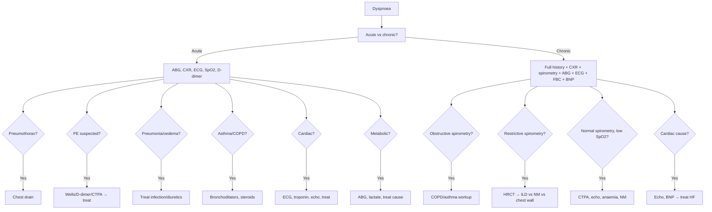

# Dyspnoea (Dyspnea)

> [!important]
> **Dyspnoea** is the **subjective experience of breathing discomfort**. It is one of the most common presenting symptoms in acute and chronic disease, with a wide differential spanning **respiratory, cardiac, neuromuscular, metabolic, psychogenic, and haematological** causes. Systematic assessment (acute vs chronic, exertional vs at rest, associated features) narrows the diagnosis.

Related: [[Respiratory Failure]], [[ABG Interpretation]], [[Oxygen Therapy and NIV]], [[Chest X-Ray Approach]], [[Spirometry Interpretation]], [[COPD]], [[Asthma]], [[Heart Failure]], [[Pneumonia]], [[Pulmonary Embolism]], [[Lung Cancer]], [[Pleural Effusion]], [[Interstitial Lung Disease]]

> [!tip] **FCPS/MRCP pearl**: Always assess **onset (acute vs chronic)**, **triggers (exertion, position, time of day)**, **associated features** (chest pain, cough, wheeze, sputum, orthopnoea, PND, leg swelling, fatigue), and **red flags** (syncope, stridor, hypoxia, JVP, murmurs, calf swelling). **First-line investigations**: SpO₂, ABG, CXR, ECG, FBC, BNP, troponin, D-dimer (if PE suspected).

## Definition

**Dyspnoea** (breathlessness) = **subjective experience of breathing discomfort**. Distinct from:
- **Tachypnoea** (↑RR, often without distress)
- **Hyperventilation** (↑minute ventilation, often with low PaCO₂)
- **Orthopnoea** (breathlessness lying flat — cardiac, COPD, OSA, OHS)
- **Platypnoea** (breathlessness upright — ASD, hepatopulmonary syndrome)
- **Trepopnoea** (breathlessness in one lateral position — unilateral lung disease, cardiac)

### Classification by onset
| Pattern | Examples |
|---------|----------|
| **Acute (seconds–minutes)** | Pneumothorax, PE, asthma attack, anaphylaxis, airway obstruction (FB, angioedema), panic attack |
| **Acute (hours)** | Pneumonia, AECOPD, pulmonary oedema, ARDS, metabolic acidosis |
| **Subacute (days–weeks)** | Pleural effusion, anaemia, thyrotoxicosis, NM weakness (GBS) |
| **Chronic (months–years)** | COPD, ILD, chronic heart failure, obesity, anaemia, deconditioning |

## Pathophysiology

### Mechanisms
- **Chemoreceptors** — peripheral (carotid/aortic body, hypoxaemia) + central (medulla, hypercapnia, acidosis)
- **Mechanoreceptors** — lung stretch (Hering-Breuer), J-receptors (pulmonary oedema), chest wall (muscle spindles)
- **Efferent signals** — motor cortex, brainstem respiratory centres
- **Afferent mismatch** — when expected ventilation ≠ actual → sense of effort

### Pathophysiology by cause
- **Airway obstruction** — ↑resistance → ↑work of breathing
- **Lung parenchymal disease** — ↓compliance → ↑elastic work
- **Airway dead space** — ↑ventilation needed
- **Cardiac** — ↓cardiac output → pulmonary congestion → J-receptor stimulation
- **Anaemia** — ↓O₂ carrying capacity → ↑cardiac output
- **NM weakness** — ↓respiratory muscle strength
- **Psychogenic** — hyperventilation, often with panic

## Aetiology — comprehensive differential

### Respiratory
| Cause | Clue |
|-------|------|
| **COPD** | Smoking, chronic cough, ↓FEV₁/FVC, hyperinflation |
| **Asthma** | Wheeze, nocturnal, BD reversibility, triggers |
| **Pneumonia** | Fever, productive cough, consolidation, ↑WCC/CRP |
| **PE** | Sudden, pleuritic pain, hypoxia, A-a gradient, risk factors |
| **Pneumothorax** | Sudden pleuritic pain, ↓breath sounds, hyperresonance |
| **Pleural effusion** | Stony dull, ↓breath sounds, ↓vocal fremitus |
| **ILD** | Progressive, dry cough, velcro crackles, clubbing |
| **Lung cancer** | Smoking, weight loss, hemoptysis, mass |
| **Upper airway obstruction** | Stridor, FB, angioedema |
| **Pulmonary oedema** | Orthopnoea, PND, bilateral crackles, ↑JVP, ↑BNP |
| **ARDS** | Acute, bilateral infiltrates, refractory hypoxaemia |
| **Pulmonary hypertension** | Progressive exertional, syncope, loud P2 |

### Cardiac
- **Heart failure** (HFrEF, HFpEF) — orthopnoea, PND, ↑JVP, S3, peripheral oedema
- **Acute coronary syndrome** — chest pain, ECG changes
- **Valvular heart disease** (AS, MS) — murmur, syncope
- **Arrhythmia** — palpitation, irregular pulse
- **Pericardial effusion/tamponade** — Beck's triad
- **Cardiomyopathy**

### Neuromuscular / chest wall
- **GBS, MG, ALS, polymyositis** — proximal weakness, ↓VC
- **Kyphoscoliosis, ankylosing spondylitis** — restrictive, deformed chest
- **Obesity hypoventilation syndrome** — BMI >30, daytime hypercapnia
- **Diaphragm palsy** — orthopnoea, paradoxical abdominal movement
- **Central hypoventilation** (stroke, opioids)

### Metabolic / endocrine
- **Metabolic acidosis** (DKA, AKI, salicylate) — Kussmaul breathing
- **Thyrotoxicosis** — weight loss, heat intolerance, tremor
- **Anaemia** — pallor, fatigue, ↓Hb

### Psychogenic
- **Anxiety / panic** — sighing, perioral tingling, normal SpO₂
- **Somatisation**

## Clinical Assessment

### History
| Feature | Significance |
|---------|--------------|
| **Onset** | Sudden (PTX, PE, FB) vs gradual (COPD, HF) |
| **Triggers** | Exertion, allergens, position, cold air, emotion |
| **Time of day** | Nocturnal (asthma, HF); morning (COPD) |
| **Position** | Orthopnoea (HF), platypnoea (ASD, HPS) |
| **Severity** | mMRC dyspnoea scale, Borg scale |
| **Associated symptoms** | Cough, sputum, wheeze, chest pain, haemoptysis, fever, leg swelling, oedema |
| **Past history** | Asthma, COPD, HF, cancer, DVT/PE |
| **Drugs** | Beta-blockers, aspirin, NSAIDs, ACEi |
| **Smoking** | Pack-years |
| **Occupation** | Asbestos, silica, coal, birds |
| **Travel** | Long flight, immobilisation (PE risk) |

### mMRC Dyspnoea Scale
| Grade | Description |
|-------|-------------|
| 0 | Not troubled by breathlessness except on strenuous exercise |
| 1 | Short of breath when hurrying on level ground or walking up slight hill |
| 2 | Walks slower than peers on level ground, or stops for breath |
| 3 | Stops for breath after walking ~100 m on level |
| 4 | Too breathless to leave house, or breathless on dressing/undressing |

### Examination
- **General**: cyanosis, pallor, cachexia, clubbing, nicotine staining
- **Vital signs**: RR, HR, BP, SpO₂, temperature
- **Neck**: JVP ↑ (HF, tamponade, TR), stridor, tracheal deviation
- **Chest**: inspection, palpation, percussion, auscultation
- **Cardiac**: murmurs, S3, S4, pericardial rub
- **Abdomen**: hepatomegaly, ascites
- **Limbs**: peripheral oedema, calf swelling/tenderness, cyanosis, clubbing

## Investigations

### First-line
| Test | Use |
|------|-----|
| **SpO₂** | All patients |
| **ABG** | Confirm hypoxaemia, hypercapnia, acidosis |
| **CXR** | Pneumonia, oedema, effusion, pneumothorax, mass, hyperinflation |
| **ECG** | Ischaemia, arrhythmia, RV strain, low voltage |
| **FBC** | Anaemia, infection (WCC, eosinophils) |
| **U&E, glucose** | Renal failure, DKA |
| **CRP** | Infection |
| **BNP / NT-proBNP** | Heart failure (high negative predictive value) |
| **Troponin** | ACS |
| **D-dimer** | PE (low pre-test) |
| **Spirometry** | Obstructive vs restrictive |
| **Peak flow** | Asthma severity |

### Second-line
- **CTPA** — suspected PE
- **Echocardiogram** — cardiac function, valves, PHT
- **HRCT chest** — ILD
- **Sputum** — culture, AFB, cytology
- **Cardiopulmonary exercise test** — undifferentiated dyspnoea, exercise-induced
- **Sleep study** — OSA, OHS
- **Lactate** — sepsis, tissue hypoxia

## Diagnosis — structured approach

## Management

### General
- **Position** — upright (relieves orthopnoea)
- **Oxygen** — target SpO₂ 94–98% (88–92% in Type 2 risk)
- **Treat underlying cause**:
  - **Bronchodilators + steroids** — asthma/COPD
  - **Diuretics, nitrates, ACEi** — pulmonary oedema
  - **Anticoagulation, thrombolysis** — PE
  - **Antibiotics** — pneumonia
  - **Chest drain** — pneumothorax
  - **Pleural drainage** — large effusion
  - **Transfusion, EPO, iron** — anaemia
  - **CPAP, weight loss** — OSA/OHS
  - **NIV / intubation** — respiratory failure
- **Psychological support** — anxiety, palliative dyspnoea
- **Pulmonary rehabilitation** — chronic dyspnoea
- **Palliative care** — dyspnoea at end of life (opioids, benzodiazepines)

## Common Viva Questions

| Question | Expected answer |
|----------|-----------------|
| What is the mMRC scale? | 0–4 grading of dyspnoea based on level of activity that provokes it. |
| Name 6 causes of acute dyspnoea. | Pneumothorax, PE, pneumonia, asthma, pulmonary oedema, anaphylaxis. |
| Name 6 causes of chronic dyspnoea. | COPD, asthma, ILD, heart failure, anaemia, obesity. |
| What is orthopnoea? Common causes? | Breathlessness lying flat; HF, COPD, OHS, diaphragmatic palsy, bilateral diaphragmatic paralysis. |
| What is platypnoea? | Breathlessness relieved by lying flat; ASD, hepatopulmonary syndrome, post-pneumonectomy. |
| What is the role of BNP? | High negative predictive value; ↑BNP supports heart failure, low BNP argues against. |
| What investigations for chronic dyspnoea of unclear cause? | CXR, spirometry, ABG, ECG, FBC, BNP, echo, CT chest (HRCT if ILD), CPET. |
| What is the Kussmaul sign? | Deep, laboured breathing in metabolic acidosis (DKA, renal failure). |
| What is sighing respiration? | Sighing respirations are a feature of anxiety/panic; not associated with hypoxaemia. |

## Confusions & Mnemonics

**Differential of dyspnoea** — **"CHAPS-PAID"**: **C**ardiac (HF, ACS, tamponade), **H**aematology (anaemia), **A**irway (asthma, COPD, FB), **P**sychogenic (panic), **S**tructural (PTX, effusion), **P**ulmonary (pneumonia, PE, ILD, cancer), **A**cid-base (metabolic acidosis), **I**diopathic/Immune (vasculitis), **D**rugs (opioids, salicylates)

**Orthopnoea causes** — **"CHOP"**: **C**HF, **H**iatus hernia (large), **O**besity, **P**aralysis (diaphragm) / **P**ulmonary (COPD)

**Acute dyspnoea** — **"4 P's"**: **P**TX, **P**E, **P**neumonia, **P**ulmonary oedema

**Red flags** — **"SHOCK"**: **S**yncope, **H**ypoxia, **O**rthopnoea, **C**yanosis, **K**ussmaul

## Local Navigation
- **Chapter MOC**: [[../Respiratory MOC|Respiratory MOC]]
- **Related**: [[COPD]] · [[Asthma]] · [[Pneumonia]] · [[Pulmonary Embolism]] · [[Pneumothorax]] · [[Pleural Effusion]] · [[Lung Cancer]] · [[Interstitial Lung Disease]] · [[Respiratory Failure]] · [[ABG Interpretation]] · [[Oxygen Therapy and NIV]] · [[Chest X-Ray Approach]] · [[Spirometry Interpretation]]

## MCQs (10)

1. A 60-year-old ex-smoker with progressive dyspnoea has FEV₁ 60% predicted, FEV₁/FVC 0.65. Most likely diagnosis:
   A. Asthma
   B. **COPD**
   C. ILD
   D. Heart failure
   E. PE
   **Answer: B** — Obstructive pattern + smoking = COPD.

2. A 30-year-old with episodic dyspnoea and wheeze, normal spirometry between attacks. Next test:
   A. CXR
   B. **Methacholine challenge**
   C. CT
   D. Bronchoscopy
   E. V/Q scan
   **Answer: B** — Bronchoprovocation to confirm/exclude asthma.

3. A 50-year-old with progressive dyspnoea, dry cough, fine inspiratory crackles, ↓DLCO, ↓FVC with normal FEV₁/FVC. Pattern:
   A. Obstructive
   B. **Restrictive**
   C. Mixed
   D. Normal
   E. Variable
   **Answer: B** — Restrictive pattern.

4. A 70-year-old with sudden dyspnoea, unilateral hyperresonance, ↓breath sounds. Most likely:
   A. Pneumonia
   B. **Pneumothorax**
   C. PE
   D. Asthma
   D. Pleural effusion
   **Answer: B** — Spontaneous PTX (thin elderly).

5. A 40-year-old with sudden dyspnoea, pleuritic pain, hypoxia, normal CXR. Wells score 4.5. Next step:
   A. D-dimer
   B. **CTPA**
   C. V/Q scan
   D. Treat empirically
   E. Discharge
   **Answer: B** — Wells >4 = PE likely → CTPA.

6. mMRC grade 3 dyspnoea means:
   A. Dyspnoea on strenuous exercise
   B. Dyspnoea on walking up hill
   C. **Stops for breath after walking ~100 m on level**
   D. Too breathless to leave house
   E. Breathless on dressing
   **Answer: C** — mMRC 3.

7. Platypnoea (breathless upright) is characteristic of:
   A. COPD
   B. **Atrial septal defect, hepatopulmonary syndrome**
   C. Heart failure
   D. Pleural effusion
   E. Pneumothorax
   **Answer: B** — ASD/HPS.

8. Kussmaul breathing (deep, laboured) suggests:
   A. COPD
   B. **Metabolic acidosis (DKA, renal failure)**
   C. Asthma
   D. PE
   E. Hyperventilation
   **Answer: B** — Compensation for metabolic acidosis.

9. First-line investigation in chronic dyspnoea of unclear cause:
   A. CXR
   B. **CXR + spirometry + ABG + ECG + FBC + BNP**
   C. CT
   D. Bronchoscopy
   E. Spirogram only
   **Answer: B** — First-line panel.

10. BNP/NT-proBNP in dyspnoea differential:
    A. Non-specific
    B. **High NPV for heart failure; supports cardiac cause**
    C. Specific for COPD
    D. Never used
    E. Diagnostic of PE
    **Answer: B** — High NPV for HF.

## SBA Questions (10)

1. A 65-year-old with progressive dyspnoea has FEV₁/FVC 0.65, FEV₁ 60%, ↑TLC, hyperinflation. Diagnosis:
   A. Asthma
   B. **COPD**
   C. ILD
   D. Bronchiectasis
   E. PE
   **Answer: B** — COPD.

2. A 35-year-old with episodic dyspnoea, normal exam, normal spirometry. Best test:
   A. CT
   B. **Methacholine challenge**
   C. CXR
   D. Bronchoscopy
   E. V/Q
   **Answer: B** — Challenge to confirm asthma.

3. A 50-year-old with progressive dyspnoea, dry cough, ↓DLCO (lowest sensitivity for ILD):
   A. **↓DLCO is the earliest spirometric change in ILD**
   B. ↓FVC is earliest
   C. ↓FEV₁ is earliest
   D. Normal spirometry
   E. All normal early
   **Answer: A** — DLCO earliest.

4. A 70-year-old ex-smoker with unilateral hyperresonance, ↓breath sounds. Best next step:
   A. CXR
   B. **CXR (confirm pneumothorax)**
   C. CT
   D. Bronchoscopy
   E. Antibiotics
   **Answer: B** — CXR confirms PTX.

5. A 40-year-old with sudden dyspnoea, pleuritic pain, hypoxia, D-dimer 1200. Wells 4.5. Next:
   A. Treat empirically
   B. **CTPA**
   C. V/Q
   D. Repeat D-dimer
   E. Discharge
   **Answer: B** — CTPA.

6. A 60-year-old with chronic dyspnoea, orthopnoea, bibasal crackles, S3, ↑BNP. Cause:
   A. COPD
   B. **Heart failure**
   C. PE
   D. Asthma
   E. Anxiety
   **Answer: B** — Heart failure.

7. A 30-year-old obese (BMI 38) with daytime somnolence, ↑PaCO₂ 7.0 kPa. Diagnosis:
   A. OSA only
   B. **Obesity hypoventilation syndrome (OHS)**
   C. COPD
   D. Asthma
   E. Cardiac
   **Answer: B** — OHS = obesity + daytime hypercapnia.

8. A 25-year-old with sudden dyspnoea after eating peanuts, urticaria, stridor. Action:
   A. Salbutamol
   B. **IM adrenaline 0.5 mg (1:1000)**
   C. IV hydrocortisone
   D. Inhaled steroids
   E. Observation
   **Answer: B** — Anaphylaxis → IM adrenaline.

9. Trepopnoea (worse in one lateral position) suggests:
   A. COPD
   B. **Unilateral lung disease, cardiac (e.g. ball-valve thrombus)**
   C. Asthma
   D. Anxiety
   E. Bilateral effusion
   **Answer: B** — Unilateral lung disease.

10. A 55-year-old with dyspnoea, normal CXR, normal spirometry, ↓DLCO, ↑A-a gradient. Most likely:
   A. COPD
   B. **ILD or pulmonary vascular disease**
   C. Heart failure
   D. Anxiety
   E. Obesity
   **Answer: B** — DLCO + A-a gradient with normal spirometry → ILD or PV disease.

## Flashcards

- **Q: Most sensitive bedside sign of dyspnoea?**
  A: Tachypnoea (≥20/min) is the most sensitive clinical sign.

- **Q: mMRC dyspnoea scale range?**
  A: 0 (no dyspnoea) to 4 (breathless on dressing/undressing).

- **Q: Platypnoea definition?**
  A: Breathlessness worse upright (relieved by lying flat); ASD, HPS.

- **Q: Kussmaul respiration?**
  A: Deep, laboured breathing in metabolic acidosis (DKA, renal failure).

- **Q: Most useful test for chronic unexplained dyspnoea?**
  A: Combined first-line panel: CXR + spirometry + ABG + ECG + FBC + BNP.

- **Q: Role of BNP in dyspnoea?**
  A: High negative predictive value for heart failure; helps differentiate cardiac from pulmonary cause.

- **Q: First test for suspected ILD?**
  A: HRCT chest (cornerstone).

- **Q: First test for suspected PE?**
  A: CTPA in stable; V/Q in pregnancy/CKD.

- **Q: Orthopnoea differential?**
  A: Heart failure, COPD, OHS, bilateral diaphragm palsy, large hiatus hernia.

- **Q: First-line therapy for dyspnoea at end of life?**
  A: Opioids (morphine) ± benzodiazepines; oxygen if hypoxaemic.

## Answer Key with Explanations

### MCQs
1. **B** — COPD.
2. **B** — Methacholine challenge.
3. **B** — Restrictive.
4. **B** — Pneumothorax.
5. **B** — CTPA.
6. **C** — mMRC 3.
7. **B** — ASD/HPS.
8. **B** — Metabolic acidosis.
9. **B** — First-line panel.
10. **B** — High NPV for HF.

### SBAs
1. **B** — COPD.
2. **B** — Methacholine.
3. **A** — DLCO earliest.
4. **B** — CXR.
5. **B** — CTPA.
6. **B** — Heart failure.
7. **B** — OHS.
8. **B** — IM adrenaline.
9. **B** — Unilateral disease.
10. **B** — ILD or PV disease.
