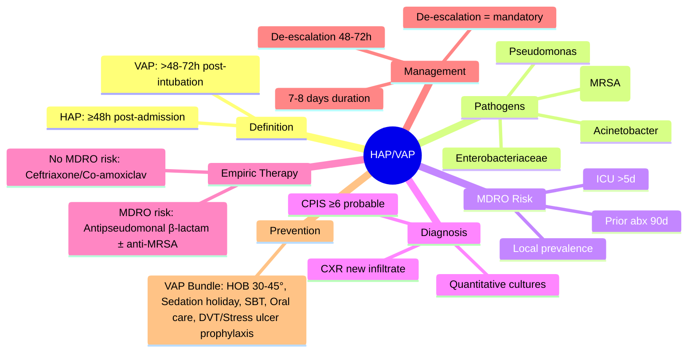

# Hospital-Acquired and Ventilator-Associated Pneumonia (HAP/VAP)

Related: [[Pneumonia]], [[Community-acquired pneumonia severity assessment]], [[Ventilatory support and escalation]], [[ARDS]], [[ICU management]], [[Sepsis]], [[Antimicrobial stewardship]], [[Multidrug-resistant organisms]]

> [!important]
> **HAP** = pneumonia occurring **≥48h after hospital admission** (not incubating at admission). **VAP** = pneumonia occurring **>48–72h after endotracheal intubation**. **Key FCPS/MRCP**: **VAP = most common ICU infection**; **MDROs** (P. aeruginosa, MRSA, Acinetobacter, ESBL) drive empiric therapy; **Clinical Pulmonary Infection Score (CPIS)** for diagnosis; **short-course therapy (7–8 days)** non-inferior; **de-escalation** critical; **ventilator bundle** for prevention.

## Learning Objectives
- Define **HAP** and **VAP** and distinguish from **CAP** and **aspiration pneumonia**
- Identify **MDRO risk factors** and apply **local antibiograms** for empiric therapy
- Apply **CPIS** for VAP diagnosis and understand limitations
- Prescribe **empiric therapy** per local epidemiology and severity
- Implement **de-escalation** at 48–72h based on cultures
- Apply **short-course (7–8 days)** therapy evidence
- Implement **ventilator bundle** for VAP prevention
- Recognise **VAP complications** (empyema, lung abscess, septic shock)

## Definition
| Term | Definition |
|------|------------|
| **HAP** | Pneumonia occurring **≥48h after hospital admission**, not incubating at admission |
| **VAP** | Pneumonia occurring **>48–72h after endotracheal intubation** (mechanical ventilation) |
| **HCAP** (historical) | Healthcare-associated pneumonia — **no longer a distinct category** (IDSA/ATS 2016) — treat as CAP or HAP based on MDRO risk |

> **FCPS/MRCP tip**: **VAP = most common ICU-acquired infection** (10–20% ventilated patients). **Mortality 10–20%** (attributable ~10%).

## Core Microbiology
### Typical Pathogens by Setting
| Pathogen | HAP | VAP | Notes |
|----------|-----|-----|-------|
| **Staphylococcus aureus** (MSSA/MRSA) | Common | **Most common** (20–30%) | MRSA ~20–50% of S. aureus |
| **Pseudomonas aeruginosa** | Common | **Very common** (15–25%) | **MDRO hallmark**, biofilm on tube |
| **Enterobacteriaceae** (E. coli, Klebsiella, Enterobacter) | Common | Common | **ESBL, carbapenemase** increasing |
| **Acinetobacter baumannii** | Increasing | **ICU-endemic** | **XDR/PDR** (pan-drug resistant) |
| **Stenotrophomonas maltophilia** | Rare | Increasing | Intrinsic resistance |
| **Haemophilus influenzae** | Common (non-ventilated) | Less common | Non-typable, biofilm |
| **Streptococcus pneumoniae** | HAP (non-ventilated) | Rare in VAP | CAP-like |
| **Anaerobes** | Aspiration-related | Aspiration-related | Peptostreptococcus, Prevotella |
| **Fungi** (Candida, Aspergillus) | Rare | **Colonisation vs infection** | Usually colonisation |

### MDRO Risk Factors (Guide Empiric Coverage)
| Risk Factor | Pathogens of Concern |
|-------------|---------------------|
| **Prior IV antibiotics** (90 days) | MRSA, Pseudomonas, ESBL, CRE |
| **ICU stay >5 days** | MDR Pseudomonas, Acinetobacter |
| **High local MDRO prevalence** | Know your ICU antibiogram |
| **Immunosuppression** | Fungi, CMV, PJP, resistant bacteria |
| **Structural lung disease** (bronchiectasis) | Pseudomonas, NTM |
| **Recent hospitalisation** (90 days) | MDROs |

## Clinical Features
### HAP (Non-Ventilated)
- **New/worsening cough** (purulent sputum)
- **Fever** (>38.3°C) or **hypothermia** (<36°C)
- **Leucocytosis** or **leucopenia**
- **New/worsening infiltrate** on CXR
- **Hypoxaemia**, increased O2 requirement
- **Tachypnoea**, tachycardia

### VAP (Ventilated)
- **New/worsening infiltrate** on CXR (often difficult to interpret)
- **Purulent tracheal secretions** (increased volume, colour change)
- **Fever/hypothermia**, leucocytosis/leucopenia
- **Worsening gas exchange** (↑ FiO2 requirement, ↓ PaO2/FiO2)
- **Haemodynamic instability** (septic shock)
- **NO single sign is specific** — need combination

> **FCPS/MRCP tip**: **Clinical diagnosis of VAP is unreliable** — need **CPIS + cultures + CXR**.

## Diagnosis
### 1. Clinical Pulmonary Infection Score (CPIS) — VAP
| Component | 0 Points | 1 Point | 2 Points |
|-----------|----------|---------|----------|
| **Temperature** | 36.5–38.4°C | 36–36.4 or 38.5–38.9 | <36 or >38.9 |
| **Leucocytes** | 4–11 ×10⁹/L | <4 or >11 | <4 or >11 + bands >5% |
| **Tracheal secretions** | Minimal | Moderate | **Purulent** |
| **CXR** | No infiltrate | Diffuse/patchy | **Localised infiltrate** |
| **PaO2/FiO2** | >240 / >3.2 kPa | — | **<240 / <3.2 kPa** |
| **Culture** (tracheal aspirate) | No growth | Growth | **Positive** (quantitative) |

**Score ≥6** = probable VAP; **<6** = unlikely VAP

> **Limitation**: CPIS **non-specific** (sensitivity ~70%, specificity ~60%). **Use with cultures + clinical judgement**.

### 2. Microbiological Sampling
| Sample | Method | Notes |
|--------|--------|-------|
| **Endotracheal aspirate (ETA)** | Non-bronchoscopic, quantitative/semi-quantitative | **Easy, routine**, contamination risk |
| **Bronchoscopic BAL / PSB** | Bronchoscopic, quantitative | **Higher specificity**, lower contamination |
| **Mini-BAL** | Non-bronchoscopic, plugged catheter | Compromise |
| **Blood cultures** | ×2 sets | Bacteraemia detection |

**Quantitative thresholds** (predict true infection):
- **ETA**: **≥10⁶ CFU/mL**
- **BAL**: **≥10⁴ CFU/mL**
- **PSB (protected specimen brush)**: **≥10³ CFU/mL**

### 3. Imaging
- **CXR**: New infiltrate (consolidation, GGO, cavitation) — **poor inter-observer agreement**
- **CT** (if diagnostic uncertainty): Better characterisation, complications (abscess, empyema)

## Management
### 1. Empiric Antibiotic Therapy (Start IMMEDIATELY after cultures)
**Principle**: Cover likely pathogens per **local MDRO epidemiology** and **patient risk factors**

| Scenario | Empiric Regimen (Examples — ADAPT TO LOCAL ANTIBIOGRAM) |
|----------|--------------------------------------------------------|
| **No MDRO risk** (early HAP, no prior abx) | **Ceftriaxone 2g IV daily** OR **Co-amoxiclav 1.2g TDS** OR **Cefuroxime 1.5g TDS** |
| **MDRO risk** (prior abx, ICU >5d, high local MDRO) | **Antipseudomonal β-lactam** (Pip-taz 4.5g QDS / Meropenem 1g TDS / Ceftazidime 2g TDS) **+ Anti-MRSA** (Vancomycin 15–20mg/kg q12h / Linezolid 600mg q12h) |
| **High Acinetobacter/Stenotrophomonas risk** | **Meropenem** OR **Colistin** (if carbapenem-R) **+ Anti-MRSA** |
| **Severe sepsis/septic shock** | **Double antipseudomonal** (β-lactam + aminoglycoside/fluoroquinolone) **+ Anti-MRSA** |

**Dosing adjustments**: Renal impairment, CRRT, obesity, augmented renal clearance

### 2. De-escalation at 48–72h (CRITICAL)
- **Review cultures** (blood, respiratory, urine)
- **Narrow spectrum** to target identified pathogen(s)
- **Stop redundant agents** (e.g., drop anti-MRSA if MRSA negative)
- **Switch IV to PO** when clinically stable (bioavailability considerations)

### 3. Duration of Therapy
| Evidence | Recommendation |
|----------|----------------|
| **RCTs (Chastre 2003, Pugh 2015)** | **7–8 days** non-inferior to 14–15 days |
| **Exceptions (longer 10–14 days)** | **Non-fermenters** (Pseudomonas, Acinetobacter), **immunocompromised**, **empyema/abscess**, **slow clinical response** |
| **Biomarker guidance** | **Procalcitonin** (stop if <0.25 or ↓80–90%) |

### 4. Adjunctive Measures
- **Source control**: Drain empyema, remove infected lines
- **Ventilator management**: Lung-protective, sedation holidays, daily SBT
- **VAP bundle** (see Prevention)
- **Nutrition**: Early enteral, protein 1.2–2 g/kg
- **DVT prophylaxis**, stress ulcer prophylaxis

## Prevention (VAP Bundle — BTS/NHS)
| Element | Intervention |
|---------|--------------|
| **Head of bed elevation** | **30–45°** (unless contraindicated) |
| **Sedation holiday / SBT** | **Daily** (assess extubation readiness) |
| **Peptic ulcer prophylaxis** | PPI/H2 blocker (avoid if low risk) |
| **DVT prophylaxis** | LMWH/UFH (mechanical if contraindicated) |
| **Oral care** | **Chlorhexidine 0.12–2% q6–12h** (evidence debated) |
| **Subglottic secretion drainage** | **Endotracheal tube with subglottic port** (if available) |
| **Cuff pressure** | **20–30 cmH2O** (monitor q4–8h) |
| **Early mobilisation** | As feasible |
| **Avoid unnecessary intubation** | NIV when appropriate |

> **FCPS/MRCP tip**: **Daily sedation holiday + SBT + head elevation** = most evidence-based bundle elements.

## Drug Interactions / Contraindications / Cautions
### Vancomycin
- **Nephrotoxicity** (AUC-guided dosing target 400–600 mg·h/L)
- **Red Man Syndrome** (infuse ≥60 min)
- **Ototoxicity** (monitor with concomitant aminoglycosides)

### Linezolid
- **Myelosuppression** (FBC weekly — thrombocytopenia)
- **Serotonin syndrome** (with SSRIs/SNRIs/MAOIs)
- **Peripheral/optic neuropathy** (>14 days)

### Colistin / Polymyxin B
- **Nephrotoxicity** (dose adjust, monitor creatinine)
- **Neurotoxicity** (confusion, paresthesias)
- **Dose**: **Colistin base activity (CBA) 2.5–5 mg/kg/day** IV (renal adjust)

### Aminoglycosides
- **Nephro-/oto-toxicity** (extended-interval dosing, monitor levels)
- **Contraindicated** if CrCl <20 without levels

### Carbapenems
- **Seizure risk** (imipenem > meropenem, especially renal impairment)
- **C. difficile** risk

## Complications
### VAP-Specific
- **Empyema / pleural effusion** (parapneumonic)
- **Lung abscess / necrotising pneumonia**
- **Bronchopleural fistula**
- **Septic shock / MODS**
- **MDRO emergence** (selection pressure)
- **Prolonged ventilation** → tracheostomy
- **ICU-acquired weakness**

### Attributable Mortality
- **VAP attributable mortality**: ~10% (range 0–20%)
- **Higher with**: MDRO, inadequate initial therapy, immunocompromise, delay >24h

## Red Flags / Emergencies
- **Rapid deterioration** (new septic shock, rising lactate) → broaden abx, source control, ICU
- **Massive haemoptysis** → BAE
- **Pneumothorax** (barotrauma, necrotising) → chest drain
- **Acute kidney injury** (nephrotoxic abx) → dose adjust, nephrology
- **New MDRO colonisation** → infection control, contact precautions

## Special Situations
### COVID-19 VAP (Co-infection)
- **High incidence** in intubated COVID
- **Pathogens**: S. aureus, Pseudomonas, Enterobacterales, fungi
- **Empiric**: Antipseudomonal β-lactam ± anti-MRSA per local MDRO
- **Dexamethasone** (if COVID indication) — may modify infection risk

### Post-Extubation Pneumonia
- **Within 48h of extubation**
- **Risk factors**: Reintubation, aspiration, prolonged intubation
- **Manage as HAP**

### Immunocompromised Host
- **Broader differential**: PJP, CMV, fungi (Aspergillus, Candida), Nocardia, TB
- **Lower threshold** for bronchoscopy, biopsy, galactomannan, PCR panels
- **Empiric broader coverage** (antifungal if high risk)

### Paediatric VAP
- **Similar definitions** (adjust for age)
- **ETT size**, cuff pressure, oral care adapted
- **Pathogens**: S. aureus, H. influenzae, S. pneumoniae, Pseudomonas

## Prognosis
- **VAP increases ICU LOS** by 4–7 days, hospital LOS by 7–9 days
- **Attributable mortality**: ~10% (higher with MDRO, shock, immunocompromise)
- **Long-term**: ICU-acquired weakness, cognitive impairment, reduced QoL

## Topic Correlation
- [[Pneumonia]] — CAP framework
- [[Community-acquired pneumonia severity assessment]] — CURB-65, PSI
- [[Ventilatory support and escalation]] — mechanical ventilation
- [[ARDS]] — severe complication
- [[Sepsis]] — septic shock pathway
- [[Antimicrobial stewardship]] — de-escalation, duration
- [[Multidrug-resistant organisms]] — MDRO epidemiology

## FCPS/MRCP High-Yield Points
1. **HAP** = pneumonia ≥48h post-admission; **VAP** = >48–72h post-intubation
2. **VAP most common ICU infection** (10–20% ventilated patients)
3. **Key pathogens**: S. aureus (MRSA), Pseudomonas, Enterobacteriaceae, Acinetobacter
4. **MDRO risk factors**: Prior abx (90d), ICU >5d, local MDRO prevalence
5. **CPIS** for VAP diagnosis (score ≥6 probable) — but limited specificity
6. **Quantitative cultures**: ETA ≥10⁶, BAL ≥10⁴, PSB ≥10³ CFU/mL
7. **Empiric therapy**: Cover local MDROs (antipseudomonal β-lactam ± anti-MRSA)
8. **De-escalation at 48–72h** = mandatory
9. **Short course (7–8 days)** non-inferior to 14–15 days (exceptions: non-fermenters, immunocompromised)
10. **VAP bundle**: HOB 30–45°, daily sedation holiday/SBT, oral care, DVT/stress ulcer prophylaxis

## Common Viva Questions
1. HAP vs VAP definition
2. Common pathogens and MDRO risk factors
3. CPIS components and limitations
4. Quantitative culture thresholds
5. Empiric antibiotic selection per MDRO risk
9. De-escalation and duration of therapy
10. VAP prevention bundle
10. Complications and attributable mortality

## Common Confusions / Exam Traps
- **HAP vs CAP** = 48h cut-off (not 72h)
- **VAP >48–72h** post-intubation (not immediately)
- **CPIS alone ≠ diagnosis** (use with cultures + clinical)
- **Vancomycin trough** — **AUC-guided dosing** now preferred (400–600)
- **Linezolid** = 28 days max (myelosuppression)
- **Colistin dosing** = **CBA (colistin base activity)** not CMS (colistin methanesulfonate)
- **7-day course** = standard (exceptions: non-fermenters, immunocompromised, slow response)
- **Procalcitonin** = adjunct for duration, not for diagnosis
- **Oral chlorhexidine** = evidence debated (some guidelines recommend, some not)
- **Subglottic secretion drainage** = effective but not universal

## Mnemonics
- **HAP VAP TIME**: **H**AP = **H**ospital ≥48h; **V**AP = **V**entilator >48–72h
- **VAP BUGS**: **P**seudomonas, **S**taph (MRSA), **E**nterobacteriaceae, **A**cinetobacter, **S**tenotrophomonas
- **CPIS**: **T**emp, **L**eucocytes, **S**ecretions, **X**-ray, **P**aO2/FiO2, **C**ulture = **TLSXPC**
- **VAP BUNDLE**: **H**ead up, **S**edation holiday, **O**ral care, **U**lcer prophylaxis, **D**VT prophylaxis, **S**ubglottic drainage = **HOUSDS**
- **DE-ESCALATE**: **D**ay 2-3, **E**valuate **C**ultures, **S**top **C**overage, **A**djust **L**ength, **T**arget **E**vidence

## Mind Map


## Flowchart
```mermaid
flowchart TD
    A[Suspected HAP/VAP\nNew infiltrate + clinical signs] --> B[Send Cultures\nBlood, Respiratory (ETA/BAL)]
    B --> C{MDRO Risk Factors?}
    C -- NO --> D[Empiric: Ceftriaxone/Co-amoxiclav\n7-8 days]
    C -- YES --> E[Empiric: Antipseudomonal β-lactam\n+ Anti-MRSA if MRSA risk]
    E --> F[Review Cultures at 48-72h]
    F --> G{Pathogen Identified?}
    G -- YES --> H[De-escalate to Targeted Therapy\nNarrowest spectrum]
    G -- NO --> I[Continue Empiric / Reassess\nConsider Non-infectious]
    H --> J{Clinical Response?}
    J -- Improving --> K[Complete 7-8 Day Course\n(10-14d if non-fermenter/immunocompromised)]
    J -- Not Improving --> L[Re-culture, Re-image\nBroaden / Source Control]
```

## Suggested Visuals / Image Notes
- CPIS scoring table
- VAP bundle diagram
- Empiric therapy algorithm by MDRO risk
- De-escalation decision tree
- Ventilator bundle checklist

## Suggested Video References
- IDSA/ATS 2016 HAP/VAP Guidelines
- BTS HAP/VAP Guidelines
- CPIS scoring tutorial
- Ventilator bundle implementation
- De-escalation case examples
- Antimicrobial stewardship in ICU

## One-Page Revision Summary
- **HAP** = pneumonia ≥48h post-admission; **VAP** = >48–72h post-intubation
- **Pathogens**: MRSA, Pseudomonas, Enterobacteriaceae, Acinetobacter
- **MDRO risk**: Prior abx (90d), ICU >5d, local prevalence
- **CPIS ≥6** = probable VAP (but use with cultures)
- **Quantitative thresholds**: ETA ≥10⁶, BAL ≥10⁴, PSB ≥10³ CFU/mL
- **Empiric**: No MDRO risk → ceftriaxone/co-amoxiclav; MDRO risk → antipseudomonal β-lactam ± anti-MRSA
- **De-escalation at 48–72h** mandatory
- **Duration**: 7–8 days (longer for non-fermenters, immunocompromised)
- **Prevention**: VAP bundle (HOB 30–45°, daily sedation holiday/SBT, oral care, DVT/stress ulcer prophylaxis)
- **Attributable mortality**: ~10%

## 24-Hour Recall Prompts
- HAP vs VAP time cut-offs
- Top 4 VAP pathogens
- 3 MDRO risk factors
- CPIS components and cut-off
- Quantitative culture thresholds
- Empiric therapy by MDRO risk
- De-escalation timing
- Standard duration vs exceptions
- 5 VAP bundle elements

## 7-Day / 15-Day / 30-Day Revision Tracker
- [ ] Day 1 completed
- [ ] 24-hour recall completed
- [ ] Day 7 revision completed
- [ ] Day 15 revision completed
- [ ] Day 30 revision completed

## Must Know / Should Know / Nice to Know
### Must Know
- HAP/VAP definitions and cut-offs
- Top pathogens (MRSA, Pseudomonas, Enterobacteriaceae, Acinetobacter)
- MDRO risk factors
- CPIS and quantitative culture thresholds
- Empiric therapy algorithm by MDRO risk
- De-escalation at 48–72h
- 7–8 day duration (exceptions)
- VAP bundle elements

### Should Know
- CPIS limitations
- Quantitative vs qualitative cultures
- Antibiotic dosing in renal failure/CRRT
- Linezolid vs vancomycin for MRSA
- Colistin dosing (CBA)
- Procalcitonin for duration guidance
- COVID-19 VAP specificities

### Nice to Know
- Post-extubation pneumonia
- Paediatric VAP
- Immunocompromised host VAP
- Novel pathogens (C. difficile pneumonia rare)
- Novel diagnostics (metagenomics, PCR panels)
- Economic burden of VAP
- Oral chlorhexidine debate

## Self-Test Scorecard
- Understanding: /10
- Recall: /10
- MCQ Performance: /10
- SBA Performance: /10
- Viva Confidence: /10
- Total: /50

> [!tip]
> Interpretation: <35 = weak topic, 35-44 = acceptable but insecure, 45+ = strong exam-ready topic.

## Exam Answer Modes
### Long Answer Skeleton
- Definitions (HAP, VAP, time cut-offs)
- Microbiology (pathogens table, MDROs)
- Risk factors for MDRO
- Diagnosis (clinical, CPIS, cultures, imaging)
- Empiric therapy algorithm (by MDRO risk)
- De-escalation and targeted therapy
- Duration of therapy (evidence for 7–8 days, exceptions)
- Prevention (VAP bundle)
- Complications and attributable mortality

### Short Note Skeleton
- Definition box
- Pathogens table
- MDRO risk table
- CPIS scoring box
- Empiric therapy algorithm
- De-escalation box
- Duration box
- VAP bundle checklist

### Viva One-Liners
- "HAP = pneumonia ≥48h post-admission; VAP = >48–72h post-intubation"
- "VAP pathogens: MRSA, Pseudomonas, Enterobacteriaceae, Acinetobacter"
- "MDRO risk: prior abx 90d, ICU >5d, local MDRO prevalence"
- "CPIS ≥6 = probable VAP; quantitative ETA ≥10⁶, BAL ≥10⁴, PSB ≥10³ CFU/mL"
- "Empiric: no MDRO risk → ceftriaxone/co-amoxiclav; MDRO risk → antipseudomonal β-lactam ± anti-MRSA"
- "De-escalation at 48–72h mandatory; duration 7–8 days (exceptions: non-fermenters, immunocompromised)"
- "VAP bundle: HOB 30–45°, daily sedation holiday + SBT, oral chlorhexidine, DVT/stress ulcer prophylaxis"
- "Attributable mortality ~10%; higher with MDRO, inadequate initial therapy, shock"
- "Subglottic secretion drainage reduces VAP (if tube available)"
- "Colistin dosing = CBA (colistin base activity), not CMS"

### Ward-Case Discussion Points
- 65M post-CABG day 5, new infiltrate, purulent ETA, no prior abx → empirical ceftriaxone, de-escalate at 48h if MSSA on culture
- 55F ARDS day 7, septic, purulent secretions, prior pip-taz 10d, ICU 7d → empirical meropenem + vancomycin, cultures at 48h, de-escalate
- 70M COPD exacerbation, intubated day 3, new fever + infiltrate, no prior abx → ceftriaxone + co-amoxiclav? (actually ceftriaxone alone if no MDRO risk)
- 45F post-liver transplant, intubated, new infiltrate, on tacrolimus/MMF → broader empiric (meropenem + anti-MRSA + consider antifungal), BAL for PJP/CMV/fungi

### Last-Night-Before-Exam Sheet
- HAP ≥48h; VAP >48-72h
- Bugs: MRSA, PsA, Enterobacteriaceae, Acinetobacter
- MDRO risk: abx 90d, ICU>5d, local prevalence
- CPIS ≥6 probable; QTL: ETA 10^6, BAL 10^4, PSB 10^3
- Empiric: no MDRO → ceftriaxone; MDRO → anti-PsA β-lactam ± anti-MRSA
- De-esc 48-72h; 7-8d (non-fermenter 10-14d)
- Bundle: HOB 30-45°, sed hol/SBT, oral care, DVT/PPI
- Mortality 10% attributable

## Summary
**Hospital-acquired pneumonia (HAP)** = pneumonia occurring **≥48h after hospital admission**. **Ventilator-associated pneumonia (VAP)** = pneumonia **>48–72h after endotracheal intubation**. **Most common ICU infection**; attributable mortality ~10%. **Key pathogens**: **MRSA, Pseudomonas aeruginosa, Enterobacteriaceae, Acinetobacter baumannii**. **MDRO risk factors**: prior IV antibiotics (90d), ICU stay >5d, high local MDRO prevalence. **Diagnosis**: Clinical + CXR + **CPIS ≥6** + **quantitative cultures** (ETA ≥10⁶, BAL ≥10⁴, PSB ≥10³ CFU/mL). **Empiric therapy** per **local MDRO epidemiology**: No MDRO risk → ceftriaxone/co-amoxiclav; MDRO risk → **antipseudomonal β-lactam (pip-taz/meropenem/ceftazidime) ± anti-MRSA (vancomycin/linezolid)**. **Mandatory de-escalation at 48–72h**; **duration 7–8 days** (exceptions: non-fermenters, immunocompromised, slow response). **Prevention**: **VAP bundle** (HOB 30–45°, daily sedation holiday/SBT, oral care, DVT/stress ulcer prophylaxis, subglottic drainage if available). **Attributable mortality ~10%**; higher with MDRO, inadequate initial therapy, delay.

## MCQs (10)
1. **VAP definition** — pneumonia occurring:
   A. ≥24h post-intubation
   B. **>48–72h post-intubation**
   C. ≥72h post-admission
   D. >72h post-intubation

2. **Most common VAP pathogen** in many ICUs:
   A. E. coli
   B. **Staphylococcus aureus (including MRSA)**
   C. Streptococcus pneumoniae
   D. Haemophilus influenzae

3. **CPIS score ≥6** indicates:
   A. VAP excluded
   B. **Probable VAP**
   C. Definite VAP
   C. Need bronchoscopy

4. **Quantitative culture threshold** for endotracheal aspirate (ETA):
   A. ≥10³ CFU/mL
   B. ≥10⁴ CFU/mL
   C. **≥10⁶ CFU/mL**
   D. ≥10⁷ CFU/mL

5. **Empiric therapy for VAP with NO MDRO risk factors**:
   A. Meropenem + Vancomycin
   B. **Ceftriaxone OR Co-amoxiclav**
   C. Piperacillin-tazobactam
   D. Ciprofloxacin

6. **Standard duration** of antibiotic therapy for VAP (per RCTs):
   A. 14–15 days
   B. **7–8 days**
   C. 10–14 days
   D. 21 days

7. **VAP bundle element** with strongest evidence:
   A. Oral chlorhexidine
   B. **Daily sedation holiday + spontaneous breathing trial**
   C. Subglottic secretion drainage
   D. Stress ulcer prophylaxis

8. **De-escalation** should occur at:
   A. 24h
   B. **48–72h**
   C. 5 days
   D. End of therapy

9. **Exceptions to 7–8 day course** (require 10–14 days):
   A. Early HAP
   B. **Non-fermenters (Pseudomonas, Acinetobacter), immunocompromised, slow response**
   C. All VAP
   D. No exceptions

10. **Attributable mortality** of VAP:
    A. <1%
    B. **~10%**
    C. 25%
    D. 50%

## SBA Questions (10)
1. A 65M post-CABG day 5, new fever, purulent sputum, new RLL infiltrate on CXR. No prior antibiotics. Best empiric therapy?
   A. Meropenem + Vancomycin
   B. **Ceftriaxone 2g IV daily**
   C. Piperacillin-tazobactam
   D. Ciprofloxacin

2. A 55F ARDS day 7 on ventilator, new infiltrate, purulent ETA, septic shock. Prior pip-taz 10 days. ICU 7 days. Best empiric therapy?
   A. Ceftriaxone
   B. **Meropenem + Vancomycin**
   C. Co-amoxiclav
   D. Aztreonam

3. Same patient, day 3 cultures: ETA grows MSSA 10⁶ CFU/mL, sensitive to flucloxacillin. Current: meropenem + vancomycin. Next step?
   A. Continue both
   B. **Switch to flucloxacillin (targeted), stop meropenem/vancomycin**
   C. Add rifampicin
   D. Continue vancomycin only

4. CPIS components — which is NOT included?
   A. Temperature
   B. Leucocyte count
   C. **Serum procalcitonin**
   D. Tracheal secretions quality

5. Quantitative BAL threshold for VAP diagnosis:
   A. ≥10³ CFU/mL
   B. **≥10⁴ CFU/mL**
   C. ≥10⁵ CFU/mL
   D. ≥10⁶ CFU/mL

6. Duration of therapy for VAP caused by Pseudomonas aeruginosa (non-fermenter):
   A. 7 days
   B. **10–14 days**
   C. 7–8 days
   D. 21 days

7. VAP bundle — which is NOT a core element?
   A. Head of bed 30–45°
   B. Daily sedation holiday + SBT
   C. **Routine prophylactic antifungals**
   D. DVT prophylaxis

8. Colistin dosing — correct unit:
   A. **Colistin base activity (CBA) mg/kg/day**
   B. Colistin methanesulfonate (CMS) mg/kg/day
   C. International units (IU)
   D. Millimoles

9. A 45M post-liver transplant, ventilated day 4, new infiltrate. On tacrolimus/MMF. Best empiric coverage?
   A. Ceftriaxone
   B. **Meropenem + Vancomycin + consider antifungal (if risk factors)**
   C. Co-amoxiclav
   D. Ciprofloxacin

10. Procalcitonin in VAP — best use:
    A. Diagnosis of VAP
    B. **Guidance for antibiotic duration (stop if <0.25 or ↓80-90%)**
    C. Replacement for cultures
    D. MDRO prediction

## Flashcards
- Q: HAP vs VAP cut-off
  A: HAP ≥48h admission; VAP >48-72h intubation
- Q: Top VAP bugs
  A: MRSA, Pseudomonas, Enterobacteriaceae, Acinetobacter
- Q: MDRO risk
  A: Prior abx 90d, ICU>5d, local prevalence
- Q: CPIS ≥6
  A: Probable VAP
- Q: ETA threshold
  A: ≥10^6 CFU/mL
- Q: BAL threshold
  A: ≥10^4 CFU/mL
- Q: Empiric no MDRO
  A: Ceftriaxone or Co-amoxiclav
- Q: Empiric MDRO
  A: Anti-PsA β-lactam ± anti-MRSA
- Q: Duration
  A: 7-8 days (10-14d non-fermenter/immunocompromised)
- Q: De-escalation
  A: 48-72h mandatory
- Q: Bundle
  A: HOB 30-45°, sed hol+SBT, oral care, DVT/PPI
- Q: Mortality
  A: ~10% attributable

## Answer Key with Explanations
### MCQs
1. **B** — VAP defined as pneumonia >48–72h after endotracheal intubation.
2. **B** — S. aureus (often MRSA) is the most frequently isolated VAP pathogen.
3. **B** — CPIS ≥6 = probable VAP (not definite).
4. **C** — ETA quantitative threshold = ≥10⁶ CFU/mL.
5. **B** — No MDRO risk → ceftriaxone or co-amoxiclav (standard CAP-like therapy).
6. **B** — Chastre 2003, Pugh 2015: 7–8 days non-inferior to 14–15.
7. **B** — Daily sedation holiday + SBT = strongest evidence for VAP reduction.
8. **B** — De-escalation at 48–72h is standard of care.
9. **B** — Non-fermenters, immunocompromised, slow response need 10–14 days.
10. **B** — VAP attributable mortality ~10%.

### SBAs
1. **B** — Post-op day 5, no prior abx, no MDRO risk → ceftriaxone (or co-amoxiclav).
2. **B** — ICU 7d, prior pip-taz, septic shock → meropenem + vancomycin (covers Pseudomonas, MRSA, ESBL).
3. **B** — MSSA on culture → targeted flucloxacillin, stop broad-spectrum (de-escalation).
4. **C** — CPIS includes temp, WCC, secretions, CXR, PaO2/FiO2, culture. Not procalcitonin.
5. **B** — BAL quantitative threshold = ≥10⁴ CFU/mL.
6. **B** — Non-fermenters (Pseudomonas) need 10–14 days per guidelines.
7. **C** — Routine antifungals not in VAP bundle.
8. **A** — Colistin dosed by CBA (colistin base activity), not CMS.
9. **B** — Transplant = immunosuppressed + healthcare exposure → broad empiric including antifungal consideration.
10. **B** — Procalcitonin best for duration guidance (stop if <0.25 or ↓80-90%).

### Flashcards
All correct as written.

---
