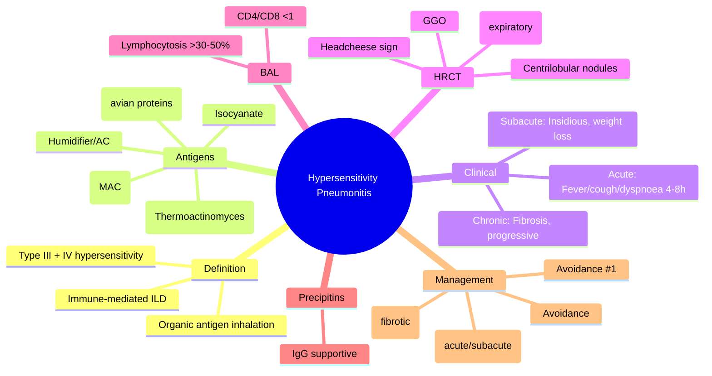

# Hypersensitivity Pneumonitis (HP) / Extrinsic Allergic Alveolitis (EAA)

Related: [[ILD framework]], [[Sarcoidosis]], [[Connective tissue disease-associated ILD]], [[Occupational and environmental lung disease]], [[Farmer's lung]], [[Bird fancier's lung]], [[Humidifier lung]], [[Drug-induced ILD]], [[Bronchiolitis]]

> [!important]
> **Hypersensitivity pneumonitis (HP)** = **immune-mediated inflammatory lung disease** caused by **repeated inhalation of organic antigens** in susceptible individuals. **Type III (immune complex) + Type IV (delayed hypersensitivity)**. **Key FCPS/MRCP**: **Exposure history** (birds, mould, farming, humidifiers), **Clinical triad** (fever, cough, dyspnoea 4–8h post-exposure), **HRCT** (centrilobular nodules, ground-glass, mosaic attenuation/air-trapping), **BAL lymphocytosis** (>30–50%, CD4/CD8 <1), **Serum precipitins** (supportive), **Avoidance + steroids** (acute/chronic), **Fibrotic HP** = poor prognosis, **Chronic HP mimics IPF/UIP**.

## Learning Objectives
- Recognise **acute, subacute, and chronic** clinical presentations
- Identify **common antigens** (farmer's lung, bird fancier's, humidifier, mushroom, cheese washer, etc.)
- Interpret **HRCT** findings (centrilobular nodules, GGO, mosaic attenuation, **headcheese sign**)
- Use **BAL** (lymphocytosis >30–50%, **CD4/CD8 <1**) and **serum precipitins** (supportive)
- Apply **diagnostic criteria** (clinical + exposure + HRCT + BAL + precipitins + histology)
- Manage with **antigen avoidance** (cornerstone), **steroids** (acute/subacute), **antifibrotics** (chronic fibrotic)
- Differentiate from **sarcoid, IPF, CTD-ILD, COP, infection**
- Recognise **prognostic factors** (fibrosis = poor, avoidance = key)

## Definition
**Hypersensitivity pneumonitis (HP)** = **immune-mediated interstitial lung disease** resulting from **repeated inhalation of organic antigens** (proteins, microorganisms, chemicals) in sensitised individuals, causing **alveolitis and bronchiolitis** with **non-caseating granulomas** and **lymphocytic infiltration**.

**Synonyms**: Extrinsic allergic alveolitis (EAA), Farmer's lung, Bird fancier's lung, Humidifier lung, etc. (named by antigen source).

> **FCPS/MRCP tip**: **Exposure history is essential** — no exposure = no HP. **Antigen avoidance is the single most important treatment**.

## Core Anatomy / Pathophysiology
### Immunological Mechanism (Type III + IV Hypersensitivity)
1. **Inhalation of antigen** (1–5 µm particles reach alveoli)
2. **Acute (Type III)**: **IgG/IgM immune complexes** → complement activation → neutrophil influx → **acute alveolitis** (4–8h post-exposure)
3. **Subacute/Chronic (Type IV)**: **CD4+ Th1/Th17** → **IFN-γ, TNF-α, IL-17** → macrophage activation → **epithelioid granulomas** + **lymphocytic bronchiolitis**
4. **Chronic** → **fibrosis** (TGF-β, fibroblast activation) → **UIP or NSIP pattern**

### Antigen Sources (Common)
| Syndrome | Antigen Source | Key Organism/Protein |
|----------|----------------|---------------------|
| **Farmer's lung** | Mouldy hay, straw, grain | **Thermoactinomyces vulgaris**, *Saccharopolyspora rectivirgula*, *Aspergillus* |
| **Bird fancier's lung** | Bird droppings, feathers, serum | **Avian proteins** (IgA, bloom), *Cryptococcus* |
| **Humidifier/AC lung** | Contaminated water systems | **Thermoactinomyces**, *Aureobasidium*, *Penicillium*, *Cladosporium* |
| **Mushroom worker's lung** | Mushroom compost spores | *Thermoactinomyces*, *Penicillium* |
| **Cheese washer's lung** | Cheese mould | *Penicillium casei*, *Aspergillus* |
| **Malt worker's lung** | Mouldy barley | *Aspergillus clavatus* |
| **Woodworker's lung** | Mouldy wood | *Alternaria*, *Penicillium* |
| **Hot tub lung** | Mycobacteria in aerosols | **Mycobacterium avium complex (MAC)** |
| **Isocyanate HP** | Chemical (diisocyanates) | **TDI, MDI, HDI** (occupational asthma + HP) |

## Clinical Features
### Acute HP (Hours after exposure)
- **Fever, chills** (often high)
- **Dry cough**
- **Dyspnoea** (exertional → at rest)
- **Chest tightness**
- **Myalgia, arthralgia, headache** (flu-like)
- **Onset 4–8 hours** post-exposure
- **Resolves in 12–48 hours** if no re-exposure
- **Exam**: Fever, tachypnoea, **bibasal inspiratory crackles**

### Subacute HP (Weeks–Months)
- **Insidious onset**
- **Progressive dyspnoea**, dry cough
- **Fatigue, weight loss, low-grade fever**
- **No clear temporal link** to exposure (continuous low-level)
- **Exam**: Bibasal crackles, clubbing (late)

### Chronic HP (Months–Years)
- **Progressive dyspnoea**, cough, fatigue, weight loss
- **Fibrosis** established → **UIP or NSIP pattern**
- **Clubbing** common
- **Cor pulmonale** (late)
- **May mimic IPF** (basal fibrosis, honeycombing)

### Physical Exam Clues
- **Inspiratory crackles** (bibasal, "Velcro" in fibrosis)
- **Clubbing** (chronic, ~30%)
- **Tachypnoea**, reduced expansion
- **Signs of pulmonary hypertension** (late)

## Investigations
### 1. Exposure History (CRITICAL)
- **Occupation**: Farming, bird keeping, woodworking, cheese, mushroom, metalworking
- **Hobbies**: Birds, hot tubs, home brewing, composting
- **Home/Work environment**: Damp, mould, humidifiers, AC units, water damage
- **Temporal relationship**: Symptoms 4–8h after exposure, improve on weekends/holidays

### 2. HRCT (Gold Standard Imaging)
| Finding | Acute/Subacute | Chronic Fibrotic |
|---------|----------------|------------------|
| **Centrilobular nodules** (3–5 mm) | **Classic** (diffuse) | May persist |
| **Ground-glass opacity** | **Diffuse, patchy** | Patchy + fibrosis |
| **Mosaic attenuation / Air-trapping** | **Expiratory HRCT** (key) | Persistent |
| **"Headcheese sign"** | GGO + nodules + air-trapping | GGO + fibrosis + air-trapping |
| **Upper/mid zone predominance** | Typical | Variable (may be basal if UIP-like) |
| **BHL** | Rare | Rare |
| **Fibrosis** (honeycombing, traction bronchiectasis) | Absent | **Present** (UIP/NSIP pattern) |

> **FCPS/MRCP tip**: **Mosaic attenuation on expiratory CT** = **small airways obstruction** (bronchiolitis) — **hallmark of HP**.

### 3. BAL (Bronchoalveolar Lavage)
| Parameter | HP Typical | Sarcoid | IPF |
|-----------|------------|---------|-----|
| **Total cell count** | **↑↑** (4–8× normal) | ↑ | Normal/↑ |
| **Lymphocytes** | **>30–50%** (often 60–80%) | >20% (often 30–50%) | <15% |
| **CD4/CD8 ratio** | **<1.0** (often 0.5–0.8) | **>3.5** (usually) | Normal/↑ |
| **Neutrophils** | <5% (unless acute) | <3% | Variable |
| **Eosinophils** | <1% | <1% | <1% |

> **FCPS/MRCP tip**: **BAL lymphocytosis >30% + CD4/CD8 <1** = **highly suggestive of HP** (vs sarcoid CD4/CD8 >3.5).

### 4. Serum Precipitins (IgG Antibodies)
- **Detects IgG** against specific antigens (farmer's, bird, etc.)
- **Sensitivity ~70%**, **Specificity ~80%** (supportive, not diagnostic)
- **False +**: Asymptomatic exposed individuals
- **False -**: Chronic fibrotic (antibodies wane), wrong antigen panel

### 5. Pulmonary Function Tests
| Pattern | Acute/Subacute | Chronic Fibrotic |
|---------|----------------|------------------|
| **Restrictive** (↓ TLC, ↓ FVC) | Mild-moderate | Moderate-severe |
| **↓ DLCO** | **Early, disproportionate** | Severe |
| **Obstructive** (small airways) | Possible (bronchiolitis) | Possible |

### 6. Histology (if biopsy needed)
- **Non-caseating granulomas** (loose, poorly formed vs sarcoid tight)
- **Peribronchiolar-inflammatory** (centrilobular)
- **Chronic bronchiolitis** (lymphocytic)
- **Interstitial fibrosis** (UIP or NSIP pattern in chronic)
- **Giant cells** (cholesterol clefts, asteroid bodies — less common than sarcoid)

### 7. Exclusion Workup
- **Sarcoidosis**: ACE, CXR staging, BAL CD4/CD8
- **IPF**: HRCT UIP pattern, no exposure, no BAL lymphocytosis
- **CTD-ILD**: Autoantibodies (ANA, RF, CCP, Scl-70)
- **Infection**: TB (AFB, culture), fungal (serology, culture), viral PCR
- **COP**: Rapid steroid response, organising pneumonia pattern
- **Drug-induced**: Temporal relationship, known culprit drugs

## Classification
### Clinical Course
| Type | Duration | Features | Reversibility |
|------|----------|----------|---------------|
| **Acute** | <1 month | Fever, chills, dyspnoea 4–8h post-exposure | **Fully reversible** with avoidance |
| **Subacute** | 1–6 months | Insidious, progressive, weight loss | **Largely reversible** with avoidance + steroids |
| **Chronic** | >6 months | Fibrosis established, progressive | **Partially reversible** (inflammation) / **Irreversible** (fibrosis) |

### By Antigen (Classic Syndromes)
| Syndrome | Antigen | Key Features |
|----------|---------|--------------|
| **Farmer's lung** | *Thermoactinomyces* in mouldy hay | Classic acute/subacute, high prevalence in farmers |
| **Bird fancier's lung** | Avian proteins (droppings, feathers) | Subacute/chronic, often insidious, high relapse if re-exposure |
| **Humidifier/AC lung** | Contaminated water systems | Acute/subacute, improves away from home |
| **Hot tub lung** | MAC in aerosols | Subacute, nodular HRCT, MAC culture +ve |
| **Isocyanate HP** | TDI/MDI/HDI | Occupational, coexisting asthma |

## Etiology / Risk Factors
### Host Factors
- **Genetic**: HLA-DR, HLA-DP associations (specific to antigen)
- **Immune dysregulation**: Reduced Treg, Th1/Th17 dominance
- **Smoking** — **paradoxically protective** (↓ risk, but worse fibrosis if develop)
- **Age**: Middle-aged (40–60) most common

### Exposure Factors
- **Intensity** (high antigen load)
- **Duration** (years of exposure)
- **Particle size** (1–5 µm reaches alveoli)
- **Repeated exposure** (sensitisation → disease)

## Clinical Features Summary
| Feature | Acute | Subacute | Chronic |
|---------|-------|----------|---------|
| **Onset** | 4–8h post-exposure | Insidious (weeks) | Insidious (months–years) |
| **Fever** | High | Low-grade | Absent/low |
| **Dyspnoea** | Severe | Progressive | Progressive |
| **Cough** | Dry | Dry | Dry/productive |
| **Weight loss** | No | Yes | Yes |
| **Clubbing** | No | Rare | Common |
| **Crackles** | Bibasal | Bibasal | Bibasal (Velcro) |
| **Reversibility** | Full | Good | Partial (fibrosis fixed) |

## Interpretation Frameworks
### 1. Diagnostic Algorithm (CHEST 2020 / AAAAI Guidelines)
```
Clinical suspicion (exposure + symptoms + crackles)
    ↓
HRCT: Centrilobular nodules + GGO + mosaic attenuation?
    YES → BAL: Lymphocytosis >30% + CD4/CD8 <1?
        YES → Precipitins positive?
            YES → **HP CONFIRMED**
            NO → Consider biopsy if high suspicion
        NO → Alternative (sarcoid, IPF, COP, infection)
    NO → Alternative (IPF, sarcoid, CTD-ILD, infection)
```

### 2. CHEST 2020 Diagnostic Confidence Levels
| Level | Criteria |
|-------|----------|
| **High confidence** | Exposure + typical HRCT + BAL lymphocytosis + precipitins (+ histology if done) |
| **Intermediate confidence** | Exposure + typical HRCT (+ BAL or precipitins) |
| **Low confidence** | Incomplete criteria (e.g., no exposure identified, atypical HRCT) |

### 3. Fibrotic vs Non-fibrotic HP
| Feature | Non-fibrotic (Acute/Subacute) | Fibrotic (Chronic) |
|---------|-------------------------------|---------------------|
| **HRCT** | Nodules, GGO, mosaic attenuation | **Fibrosis** (honeycombing, retraction) + GGO + mosaic |
| **PFTs** | Restrictive, ↓ DLCO | **Severe restrictive**, very low DLCO |
| **Prognosis** | **Good** (avoidance + steroids) | **Poor** (like IPF if UIP pattern) |
| **Treatment** | Avoidance + short steroids | Avoidance + steroids + **antifibrotics** (nintedanib/pirfenidone) |

## Diagnosis
**Clinical + Radiological + BAL + Serology + Exclusion**
**Definite HP**: Exposure + typical HRCT + BAL lymphocytosis (>30%, CD4/CD8 <1) + precipitins (+ histology)
**Probable HP**: Exposure + typical HRCT + (BAL or precipitins)
**Possible HP**: Incomplete criteria (e.g., no exposure identified, atypical HRCT)

## Differential Diagnosis
| Condition | Key Differentiators |
|-----------|---------------------|
| **Sarcoidosis** | **BHL + perilymphatic nodules**, ACE ↑, BAL CD4/CD8 >3.5, **no exposure** |
| **IPF** | **UIP pattern** (basal, subpleural honeycombing), **no GGO/nodules**, **no exposure**, BAL neutrophilia |
| **CTD-ILD** | **Autoantibodies +** (ANA, RF, CCP, Scl-70), joint/skin features |
| **COP** | **Rapid steroid response**, patchy consolidation, **no exposure**, no granulomas |
| **Infection** (TB, fungal) | **AFB/culture +ve**, caseating granuloma, fever prominent |
| **Drug-induced ILD** | **Temporal drug relationship**, improvement on withdrawal |
| **Bronchiolitis** | **Centrilobular nodules + mosaic**, but no HP exposure, no granulomas |

## Management
### 1. Antigen Avoidance (CORNERSTONE)
- **Complete removal** from environment (relocation if necessary)
- **Remediation** (mould removal, bird removal, humidifier/AC cleaning)
- **PPE** (PAPR, N95) if re-exposure unavoidable (occupational)
- **Relocation** often needed for bird fancier's, farmer's lung
- **Counselling** (psychological impact of lifestyle change)

### 2. Corticosteroids
| Presentation | Dose | Duration |
|--------------|------|----------|
| **Acute/Subacute** (symptomatic, progressive) | **Prednisolone 0.5–1 mg/kg** (30–50 mg/day) | **4–8 weeks** then taper over 3–6 months |
| **Chronic Fibrotic** (if active inflammation) | **Prednisolone 0.5 mg/kg** | **Taper over 6–12 months** (longer) |
| **Acute severe** (hypoxaemia) | **IV Methylprednisolone 500–1000 mg ×3–5 days** → oral | Then taper |

**Response**: Rapid (days-weeks) in acute/subacute; slow/incomplete in fibrotic.

### 3. Steroid-Sparing / Immunosuppressants
| Agent | Indication | Dose | Monitoring |
|-------|------------|------|------------|
| **Mycophenolate** (1st line) | Relapse on taper, steroid toxicity, fibrotic | 1–1.5 g BD | FBC, LFT, renal q3mo |
| **Azathioprine** | Alternative | 1.5–2.5 mg/kg/day (TPMT) | FBC, LFT q3mo |
| **Methotrexate** | Alternative (if no fibrosis) | 10–25 mg/week + folate | FBC, LFT, CXR q3mo |
| **Anti-fibrotics** (Nintedanib/Pirfenidone) | **Fibrotic HP with progressive phenotype** (INBUILD trial) | Standard IPF dose | LFT, GI, BP |
| **Rituximab** | Refractory (esp. connective tissue overlap) | 1g ×2, then q6mo | IgG, infection screen |

### 4. Antigen Avoidance Details
| Syndrome | Avoidance Strategy |
|----------|-------------------|
| **Farmer's lung** | Dry hay/storage, mechanised feeding, ventilation, PPE (PAPR) |
| **Bird fancier's** | **Remove birds** (relocation often needed), HEPA filters |
| **Humidifier/AC** | Clean/replace systems, UV sterilisation, regular maintenance |
| **Hot tub lung** | Remove hot tub, MAC treatment if culture +ve |
| **Occupational** | Engineering controls, PPE, redeployment if severe |

### 5. Supportive Care
- **Oxygen** (if hypoxaemic)
- **Pulmonary rehabilitation**
- **Vaccinations** (flu, pneumococcal, COVID)
- **Lung transplantation** (end-stage fibrotic HP, selective)

## Drug Interactions / Contraindications / Cautions
### Steroids
- **Diabetes** (monitor glucose)
- **Osteoporosis** (DEXA, calcium/vit D, bisphosphonate if >3mo)
- **Infection risk** (screen TB, hepatitis before high-dose)
- **Pregnancy** (prednisolone safe; avoid methotrexate, mycophenolate, leflunomide)

### Mycophenolate
- **Teratogenic** (contraindicated in pregnancy)
- **GI intolerance** (divide dose, MMF enteric-coated)
- **Myelosuppression** (monitor FBC)

### Anti-fibrotics (Nintedanib/Pirfenidone)
- **Nintedanib**: Diarrhoea, LFT elevation, bleeding risk (avoid anticoagulants)
- **Pirfenidone**: Photosensitivity, GI, LFT, rash
- **Both**: Avoid in pregnancy, hepatic impairment (Child-Pugh B/C)

## Procedures
### Transbronchial Biopsy (if needed)
- **Radial EBUS-guided** for peripheral lesions
- **Yield**: Granulomas + lymphocytic bronchiolitis (non-caseating)
- **Risk**: Pneumothorax, bleeding

### Surgical Lung Biopsy (VATS)
- **Indication**: Diagnostic uncertainty, fibrotic HP vs IPF vs CTD-ILD
- **Samples**: Multiple lobes, include pleura
- **Risk**: Air leak, prolonged drain (especially if fibrotic)

## Complications
- **Progressive pulmonary fibrosis** (UIP/NSIP pattern) → respiratory failure
- **Pulmonary hypertension** (vascular obliteration, hypoxic vasoconstriction) → RV failure
- **Cor pulmonale**
- **Respiratory failure** (acute exacerbation)
- **Recurrent acute episodes** (re-exposure)
- **Steroid complications** (osteoporosis, diabetes, infection)

## Red Flags / Emergencies
- **Acute severe hypoxaemia** (SpO2 <85% on O2) → HDU/ICU, IV steroids, NIV/intubation
- **Massive haemoptysis** (rare) → BAE
- **Acute exacerbation of fibrotic HP** (rapid worsening, new GGO) → IV steroids, exclude infection
- **Massive exposure** (acute massive inhalation) → IV steroids, supportive

## Special Situations
### Smoking and HP
- **Smoking ↓ risk** of developing HP (nicotine suppresses macrophage)
- **BUT** if HP develops in smoker → **worse fibrosis**, faster progression
- **Smoking cessation** still recommended (overall health)

### Pediatric HP
- **Similar phenotypes** (acute, subacute, chronic)
- **Bird fancier's, humidifier, farmer's** common
- **BAL CD4/CD8 <1** supportive
- **Avoidance + steroids** mainstay

### Pregnancy
- **Avoidance** critical
- **Prednisolone** safe (low dose)
- **Avoid** methotrexate, mycophenolate, leflunomide
- **Azathioprine, hydroxychloroquine** compatible

## Prognosis
| Factor | Better Prognosis | Worse Prognosis |
|--------|------------------|-----------------|
| **Fibrosis** | Absent (acute/subacute) | **Present (fibrotic HP)** |
| **Avoidance** | **Achieved** | Not achieved / continued exposure |
| **HRCT Pattern** | Centrilobular nodules, GGO, mosaic | **Fibrosis (UIP > NSIP)** |
| **Smoking** | Non-smoker | **Current smoker** |
| **Age** | <50 | >65 |
| **PFTs** | Mild impairment | **Severe restriction, very low DLCO** |
| **Antibodies** | Precipitins +ve (immune response) | Precipitins -ve (burnt out?) |

**Mortality**: Non-fibrotic HP <5% at 5 years; Fibrotic HP 5-year survival ~50–70% (UIP pattern worse).

## Topic Correlation
- [[ILD framework]] — diagnostic approach
- [[Sarcoidosis]] — differential (BAL CD4/CD8, HRCT pattern)
- [[COP]] — differential (steroid response)
- [[IPF]] — differential (chronic fibrotic HP)
- [[CTD-ILD]] — differential (autoantibodies)
- [[Drug-induced ILD]] — differential
- [[Occupational lung disease]] — farmer's, bird fancier's
- [[Pulmonary hypertension]] — complication

## FCPS/MRCP High-Yield Points
1. **HP** = immune-mediated ILD from **repeated organic antigen inhalation**
2. **Exposure history ESSENTIAL** — farmer's lung, bird fancier's, humidifier, hot tub, isocyanates
3. **Clinical triad**: Fever, cough, dyspnoea **4–8h post-exposure** (acute); insidious (subacute/chronic)
4. **HRCT**: **Centrilobular nodules + GGO + mosaic attenuation/air-trapping** (expiratory CT); **headcheese sign**
4. **BAL**: **Lymphocytosis >30–50%, CD4/CD8 <1** (vs sarcoid >3.5)
5. **Precipitins** (IgG) — supportive, not diagnostic
5. **Diagnosis**: Exposure + HRCT + BAL + precipitins + exclusion (TB, sarcoid, IPF, CTD, infection)
6. **Management**: **Avoidance is #1**, steroids for acute/subacute, antifibrotics for fibrotic
6. **Chronic fibrotic HP** = progressive fibrosis, UIP/NSIP, **nintedanib/pirfenidone** (INBUILD), poor prognosis
7. **Differentiate from sarcoid**: **No BHL, CD4/CD8 <1, exposure history, centrilobular nodules**
8. **Differentiate from IPF**: **Exposure, centrilobular nodules, GGO, mosaic attenuation, BAL lymphocytosis**
9. **Smoking**: Paradoxically protective for developing HP, but worse fibrosis if develops
10. **Prognosis**: Non-fibrotic = good with avoidance; Fibrotic = poor (like IPF if UIP)

## Common Viva Questions
1. Clinical features of acute vs chronic HP
2. HRCT findings (centrilobular nodules, GGO, mosaic attenuation, headcheese sign)
3. BAL findings (lymphocytosis, CD4/CD8 ratio) vs sarcoid
4. Common antigen sources and syndromes
5. Diagnostic criteria (CHEST 2020)
6. Treatment (avoidance, steroids, antifibrotics for fibrotic)
7. Differential diagnosis (sarcoid, IPF, COP, CTD-ILD)
10. Prognostic factors

## Common Confusions / Exam Traps
- **No exposure history = cannot be HP** (EXPOSURE IS MANDATORY)
- **BAL lymphocytosis = HP** — NO, sarcoid also has lymphocytosis; **CD4/CD8 ratio distinguishes** (<1 HP, >3.5 sarcoid)
- **Precipitins = diagnostic** — NO, supportive only (false + in exposed asymptomatic, false - in chronic)
- **HP = always acute** — NO, chronic fibrotic HP mimics IPF
- **Steroids = cure for chronic HP** — NO, only suppresses inflammation; **avoidance is key**
- **Nintedanib/pirfenidone for all HP** — NO, only **fibrotic progressive phenotype** (INBUILD)
- **HP vs sarcoid HRCT**: HP = centrilobular nodules + mosaic; Sarcoid = perilymphatic nodules + BHL
- **Bird fancier's lung**: Can develop years after getting birds; removal often needed

## Mnemonics
- **HP ANTIGENS**: **F**armer's (Thermoactinomyces), **B**ird (avian), **H**umidifier (Thermoactinomyces), **M**ushroom, **C**heese, **W**ood, **H**ot tub (MAC), **I**socyanate
- **HP HRCT**: **C**entrilobular **N**odules, **G**GO, **M**osaic attenuation, **H**eadcheese sign = **CGMH**
- **BAL RATIO**: **H**P = **L**ow CD4/CD8 (<1); **S**arcoid = **H**igh CD4/CD8 (>3.5)
- **HP vs SARCOID**: **H**P = **C**entrilobular + **M**osaic + **E**xposure; **S**arcoid = **P**erilymphatic + **B**HL + **N**o exposure
- **CHRONIC HP**: **F**ibrosis = **P**oor prognosis; **N**intedanib/**P**irfenidone if progressive

## Mind Map


## Flowchart
```mermaid
flowchart TD
    A[Suspected HP\nExposure + respiratory symptoms] --> B[HRCT Chest]
    B --> C{Typical HP pattern?\nCentrilobular nodules + GGO + Mosaic}
    C -- NO --> D[Alternative: IPF, Sarcoid, COP, CTD-ILD, Infection]
    C -- YES --> E[BAL\nLymphocytosis >30%?\nCD4/CD8 <1?]
    E -- YES --> F[Precipitins (if available)]
    F --> G{Exposure identified?}
    G -- YES --> H[HP CONFIRMED\nNon-fibrotic vs Fibrotic HRCT]
    G -- NO --> I[Probable HP\nSearch for occult exposure]
    E -- NO --> J[Alternative: Sarcoid (CD4/CD8>3.5), IPF, COP, CTD]
    H --> K{HRCT Pattern}
    K -- Non-fibrotic (nodules, GGO, mosaic) --> L[Acute/Subacute\nAvoidance + Prednisolone 0.5-1mg/kg 4-8wk taper]
    K -- Fibrotic (honeycombing, retraction) --> M[Chronic Fibrotic HP\nAvoidance + Prednisolone + Antifibrotics (Nintedanib/Pirfenidone)]
```

## Suggested Visuals / Image Notes
- HRCT: Centrilobular nodules (acute), Mosaic attenuation (expiratory), Headcheese sign
- HRCT: UIP pattern (chronic fibrotic HP) vs IPF
- BAL cytology: Lymphocytes, low CD4/CD8
- Precipitin test (Ouchterlony/ELISA)
- Clinical timeline: Acute 4-8h, Subacute weeks, Chronic years

## Suggested Video References
- CHEST 2020 HP Guidelines
- AAAAI/ACAAI HP Guidelines
- HRCT interpretation for HP
- BAL interpretation (lymphocytosis, CD4/CD8)
- Antigen avoidance strategies
- Fibrotic HP management (INBUILD trial)

## One-Page Revision Summary
- **HP** = immune ILD from repeated organic antigen inhalation (Type III + IV)
- **Exposure mandatory**: Farmer's, Bird, Humidifier, Hot tub, Isocyanate
- **Acute**: Fever/cough/dyspnoea 4-8h post-exposure
- **HRCT**: Centrilobular nodules + GGO + Mosaic attenuation (+ expiratory) = **headcheese sign**
- **BAL**: Lymphocytosis >30-50%, **CD4/CD8 <1** (vs sarcoid >3.5)
- **Precipitins**: IgG supportive (70% sens, 80% spec)
- **Diagnosis**: Exposure + HRCT + BAL + Precipitins + Exclusion
- **Acute/Subacute**: Avoidance + Pred 0.5-1mg/kg 4-8wk taper
- **Chronic Fibrotic**: **Avoidance + Pred + Antifibrotics** (Nintedanib/Pirfenidone)
- **Key differentiators**: Exposure, CD4/CD8 <1, centrilobular nodules, mosaic (vs sarcoid/IPF)
- **Prognosis**: Non-fibrotic good; Fibrotic poor (UIP worse)

## 24-Hour Recall Prompts
- 3 classic antigen syndromes
- Acute HP timeline (4-8h)
- HRCT triad (nodules, GGO, mosaic)
- BAL CD4/CD8 ratio HP vs sarcoid
- Precipitins role
- Treatment acute vs fibrotic
- Key differentials

## 7-Day / 15-Day / 30-Day Revision Tracker
- [ ] Day 1 completed
- [ ] 24-hour recall completed
- [ ] Day 7 revision completed
- [ ] Day 15 revision completed
- [ ] Day 30 revision completed

## Must Know / Should Know / Nice to Know
### Must Know
- Definition + exposure mandatory
- Clinical triad (acute 4-8h)
- HRCT classic triad (nodules, GGO, mosaic)
- BAL lymphocytosis + CD4/CD8 <1
- Precipitins supportive
- Avoidance = cornerstone treatment
- Steroids for acute/subacute; antifibrotics for fibrotic
- Differential: sarcoid (CD4/CD8 >3.5), IPF (UIP, no exposure)

### Should Know
- Expiratory HRCT for mosaic attenuation
- Headcheese sign
- Precipitins limitations
- Chronic fibrotic HP management (antifibrotics)
- Hot tub lung (MAC)
- Isocyanate HP (occupational)
- Smoking paradox

### Nice to Know
- Genetic associations (HLA)
- INBUILD trial details (nintedanib in progressive fibrotic ILD including HP)
- Rituximab in refractory
- Pediatric HP
- Genetic susceptibility (HLA-DR)
- Cost-effectiveness of antigen avoidance

## Self-Test Scorecard
- Understanding: /10
- Recall: /10
- MCQ Performance: /10
- SBA Performance: /10
- Viva Confidence: /10
- Total: /50

> [!tip]
> Interpretation: <35 = weak topic, 35-44 = acceptable but insecure, 45+ = strong exam-ready topic.

## Exam Answer Modes
### Long Answer Skeleton
- Definition, immunopathogenesis (Type III + IV)
- Common antigens and syndromes table
- Clinical presentations (acute, subacute, chronic)
- HRCT findings (centrilobular nodules, GGO, mosaic, headcheese)
- BAL and precipitins interpretation
- Diagnostic algorithm (CHEST 2020)
- Differential diagnosis table (sarcoid, IPF, COP, CTD, infection)
- Management: avoidance, steroids, antifibrotics, immunosuppressants
- Fibrotic HP management (antifibrotics, INBUILD)
- Prognostic factors

### Short Note Skeleton
- Definition + antigens box
- Clinical phenotypes box
- HRCT + BAL box
- Diagnostic criteria box
- Treatment algorithm
- Differential table

### Viva One-Liners
- "HP = immune ILD from repeated organic antigen inhalation; exposure MANDATORY"
- "Acute HP: fever, cough, dyspnoea 4–8 hours post-exposure"
- "HRCT: centrilobular nodules + GGO + mosaic attenuation (expiratory) = headcheese sign"
- "BAL: lymphocytosis >30–50%, **CD4/CD8 <1** (vs sarcoid >3.5)"
- "Precipitins: IgG antibodies, ~70% sens, 80% spec — supportive only"
- "Diagnosis: exposure + HRCT + BAL + precipitins + exclusion (TB, sarcoid, IPF, CTD, infection)"
- "Avoidance = cornerstone; steroids for acute/subacute; nintedanib/pirfenidone for fibrotic progressive"
- "Chronic fibrotic HP = UIP/NSIP pattern, nintedanib/pirfenidone (INBUILD), poor prognosis"
- "HP vs sarcoid: exposure + centrilobular + mosaic + CD4/CD8 <1 vs BHL + perilymphatic + CD4/CD8 >3.5"
- "IPF vs HP: IPF = basal UIP, no exposure, neutrophilic BAL; HP = exposure, centrilobular, lymphocytic BAL"

### Ward-Case Discussion Points
- 50M farmer, recurrent fever/cough/dyspnoea 6h after handling mouldy hay, HRCT centrilobular nodules + GGO + mosaic, BAL lymphocytosis 60% CD4/CD8 0.6, precipitins +ve → Farmer's lung → avoidance + prednisolone 40mg 6wk taper
- 40F bird owner, 1-year dyspnoea, weight loss, HRCT upper lobe fibrosis + GGO + mosaic, BAL lymphocytosis 50% CD4/CD8 0.7, no birds removed → Chronic fibrotic HP → prednisolone + nintedanib + **mandatory bird removal**
- 60F, progressive dyspnoea, HRCT basal UIP pattern, no exposure, BAL neutrophilia → IPF (not HP)

### Last-Night-Before-Exam Sheet
- HP = Exposure + Immune ILD
- Antigens: Farmer, Bird, Humidifier, Hot tub, Isocyanate
- Acute: Fever/cough/dyspnoea 4-8h post-exposure
- HRCT: Centrilobular nodules + GGO + Mosaic (expiratory) = Headcheese
- BAL: Lymphs >30%, CD4/CD8 <1 (Sarcoid >3.5)
- Precipitins: Supportive only
- Avoidance #1
- Acute/Subacute: Pred 0.5-1mg/kg 4-8wk
- Chronic fibrotic: Pred + Nintedanib/Pirfenidone
- Diff: Sarcoid (CD4/CD8>3.5, BHL), IPF (UIP basal, no exposure)

## Summary
**Hypersensitivity pneumonitis (HP)** = **immune-mediated ILD** from **repeated inhalation of organic antigens** in sensitised individuals (**Type III + IV hypersensitivity**). **Exposure history is mandatory** (farmer's lung, bird fancier's lung, humidifier lung, hot tub lung, isocyanate HP). **Clinical**: Acute (fever, cough, dyspnoea 4–8h post-exposure), subacute (insidious, weeks), chronic (fibrosis, months–years). **HRCT hallmark**: **Centrilobular nodules + ground-glass opacity + mosaic attenuation/air-trapping** (expiratory CT) = **headcheese sign**. **BAL**: **Lymphocytosis >30–50%**, **CD4/CD8 ratio <1.0** (vs sarcoid >3.5). **Serum precipitins** (IgG) supportive. **Diagnosis**: Exposure + typical HRCT + BAL lymphocytosis + precipitins + exclusion of mimics (TB, sarcoid, IPF, CTD-ILD, COP, infection). **Management**: **Antigen avoidance = cornerstone**; **steroids** (prednisolone 0.5–1 mg/kg) for acute/subacute; **antifibrotics (nintedanib/pirfenidone)** for **chronic fibrotic progressive HP** (INBUILD trial). **Differentiation**: HP = exposure + centrilobular nodules + mosaic + CD4/CD8 <1; Sarcoid = BHL + perilymphatic nodules + CD4/CD8 >3.5; IPF = basal UIP, no exposure, no BAL lymphocytosis. **Prognosis**: Non-fibrotic good with avoidance; Fibrotic poor (UIP pattern worse).

## MCQs (10)
1. **Exposure history** in HP — which statement is CORRECT?
   A. Not required if HRCT is typical
   B. **Mandatory for diagnosis**
   C. Only needed for chronic HP
   D. Only for occupational HP

2. **Acute HP** symptoms typically onset:
   A. Immediately during exposure
   B. **4–8 hours after exposure**
   C. 24 hours after exposure
   D. 1 week after exposure

3. **HRCT hallmark** of HP (classic triad):
   A. Centrilobular nodules + GGO + mediastinal lymphadenopathy
   B. **Centrilobular nodules + GGO + mosaic attenuation**
   C. Perilymphatic nodules + BHL + upper lobe fibrosis
   D. Basal honeycombing + traction bronchiectasis + volume loss

4. **BAL CD4/CD8 ratio** in HP vs Sarcoidosis:
   A. HP >3.5, Sarcoid <1
   B. **HP <1, Sarcoid >3.5**
   C. Both <1
   D. Both >3.5

5. **Mosaic attenuation** on HRCT in HP — best seen on:
   A. Inspiratory CT only
   B. **Expiratory CT**
   C. Prone CT
   C. Contrast-enhanced CT

6. **Serum precipitins** in HP — sensitivity/specificity and role:
   A. 95%/95%, diagnostic
   B. **70%/80%, supportive only**
   C. 50%/50%, not useful
   D. 100%/100%, gold standard

7. **Chronic fibrotic HP** — first-line antifibrotic (INBUILD trial):
   A. **Nintedanib or Pirfenidone**
   B. Azathioprine
   C. Methotrexate
   D. Rituximab

8. **HP vs Sarcoidosis** — key HRCT difference:
   A. **HP: centrilobular nodules + mosaic; Sarcoid: perilymphatic nodules + BHL**
   B. HP: perilymphatic + BHL; Sarcoid: centrilobular + mosaic
   C. Both identical
   D. HP: basal honeycombing; Sarcoid: upper lobe nodules

9. **Acute HP** management — cornerstone:
   A. Steroids alone
   B. **Antigen avoidance**
   C. Antifibrotics
   D. Oxygen alone

10. **Hot tub lung** — causative agent:
    A. *Thermoactinomyces*
    B. Avian proteins
    C. **Mycobacterium avium complex (MAC)**
    D. *Aspergillus*

## SBA Questions (10)
1. A 50M farmer, recurrent fever/cough/dyspnoea 6h after handling mouldy hay. HRCT: diffuse centrilobular nodules, GGO, mosaic attenuation on expiratory CT. BAL: lymphocytosis 65%, CD4/CD8 0.6. Precipitins +ve. Diagnosis?
   A. Sarcoidosis
   B. **Farmer's lung (HP)**
   C. TB
   D. COP

2. A 40F bird owner, 18-month dyspnoea, weight loss. HRCT: upper lobe fibrosis + GGO + mosaic attenuation. No birds removed. BAL lymphocytosis 50%, CD4/CD8 0.7. Best management?
   A. Prednisolone alone
   B. **Prednisolone + Nintedanib + MANDATORY bird removal**
   C. Nintedanib alone
   D. Observation

3. A 45M, acute fever, cough, dyspnoea 6h after cleaning mouldy AC unit. HRCT: centrilobular nodules, GGO, mosaic. BAL lymphocytosis 60%, CD4/CD8 0.5. Precipitins pending. Most likely?
   A. TB
   B. **Humidifier/AC lung (HP)**
   C. COP
   D. Acute eosinophilic pneumonia

4. BAL CD4/CD8 ratio — which pair is CORRECT for HP vs Sarcoidosis?
   A. HP >3.5, Sarcoid <1
   B. **HP <1, Sarcoid >3.5**
   C. HP <1, Sarcoid <1
   D. HP >3.5, Sarcoid >3.5

5. A 60F, progressive dyspnoea, HRCT basal honeycombing + traction bronchiectasis (UIP pattern), no exposure history, BAL neutrophilia. Most likely?
   A. Chronic fibrotic HP
   B. **Idiopathic pulmonary fibrosis (IPF)**
   C. Connective tissue disease-ILD
   D. Sarcoidosis

6. Farmer's lung — causative organism:
   A. *Aspergillus fumigatus*
   B. **Thermoactinomyces vulgaris / Saccharopolyspora rectivirgula**
   C. *Mycobacterium avium complex*
   D. Avian proteins

7. HP vs Sarcoidosis — HRCT pattern difference:
   A. **HP: centrilobular nodules + mosaic attenuation; Sarcoid: perilymphatic nodules + BHL**
   B. HP: perilymphatic + BHL; Sarcoid: centrilobular + mosaic
   C. Both show centrilobular nodules and mosaic
   D. HP: basal honeycombing; Sarcoid: upper lobe nodules

8. Precipitins in HP — role:
   A. Diagnostic gold standard
   B. **Supportive only (sens 70%, spec 80%)**
   C. Not useful
   D. Only for monitoring

9. Chronic fibrotic HP with progressive phenotype — first-line antifibrotic:
   A. Methotrexate
   B. **Nintedanib or Pirfenidone**
   C. Azathioprine
   D. Rituximab

10. Acute HP — cornerstone of management:
    A. High-dose steroids
    B. **Antigen avoidance**
    C. Oxygen therapy
    D. Antifibrotics

## Flashcards
- Q: HP definition
  A: Immune ILD from repeated organic antigen inhalation (Type III+IV)
- Q: Exposure mandatory?
  A: YES
- Q: Acute HP timeline
  A: 4-8h post-exposure
- Q: HRCT triad
  A: Centrilobular nodules + GGO + Mosaic attenuation
- Q: Expiratory CT for
  A: Mosaic attenuation / air-trapping
- Q: Headcheese sign
  A: GGO + nodules + mosaic
- Q: BAL HP
  A: Lymphs >30%, CD4/CD8 <1
- Q: Sarcoid BAL
  A: Lymphs, CD4/CD8 >3.5
- Q: Precipitins
  A: Supportive only (70/80)
- Q: Avoidance
  A: Cornerstone treatment
- Q: Acute treatment
  A: Avoidance + Pred 0.5-1mg/kg 4-8wk
- Q: Chronic fibrotic
  A: Pred + Nintedanib/Pirfenidone
- Q: HP vs Sarcoid HRCT
  A: Centrilobular+mosaic vs Perilymphatic+BHL
- Q: HP vs Sarcoid BAL
  A: CD4/CD8 <1 vs >3.5
- Q: Farmer's lung agent
  A: Thermoactinomyces
- Q: Bird fancier
  A: Avian proteins
- Q: Hot tub lung
  A: MAC

## Answer Key with Explanations
### MCQs
1. **B** — Exposure history is mandatory for HP diagnosis (no exposure = no HP).
2. **B** — Acute HP symptoms classically begin 4–8 hours after antigen exposure.
3. **B** — Classic HRCT triad: centrilobular nodules + GGO + mosaic attenuation.
4. **B** — HP: CD4/CD8 <1; Sarcoidosis: CD4/CD8 >3.5.
5. **B** — Mosaic attenuation (air-trapping) best visualised on expiratory CT.
6. **B** — Precipitins: ~70% sensitivity, ~80% specificity; supportive, not diagnostic.
7. **A** — INBUILD trial: nintedanib/pirfenidone for progressive fibrotic ILD including HP.
8. **A** — HP: centrilobular nodules + mosaic; Sarcoid: perilymphatic nodules + BHL.
9. **B** — Antigen avoidance is the single most important intervention.
10. **C** — Hot tub lung caused by Mycobacterium avium complex (MAC).

### SBAs
1. **B** — Classic farmer's lung presentation with typical HRCT, BAL, precipitins.
2. **B** — Chronic fibrotic HP + ongoing exposure → antifibrotic (nintedanib) + avoidance + steroids.
3. **B** — Classic humidifier lung (AC unit), acute timeline, typical HRCT/BAL.
4. **B** — HP CD4/CD8 <1; Sarcoid CD4/CD8 >3.5.
5. **B** — Basal UIP + no exposure + neutrophilic BAL = IPF.
6. **B** — Farmer's lung: Thermoactinomyces vulgaris / Saccharopolyspora rectivirgula.
7. **A** — HP: centrilobular + mosaic; Sarcoid: perilymphatic + BHL.
8. **B** — Precipitins supportive only (70% sens, 80% spec).
9. **B** — INBUILD: nintedanib/pirfenidone for progressive fibrotic ILD.
10. **B** — Antigen avoidance is the single most important intervention.

### Flashcards
All correct as written.

---
