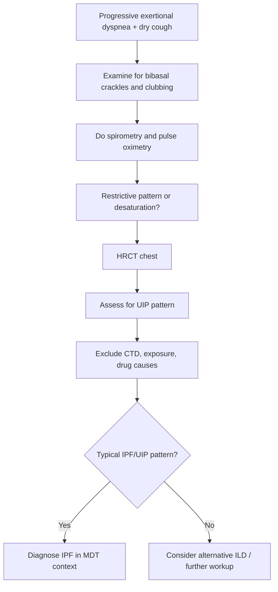

# Idiopathic pulmonary fibrosis

> [!important]
> **Idiopathic pulmonary fibrosis (IPF)** is a chronic, progressive, fibrosing interstitial lung disease of unknown cause, usually occurring in older adults, characterized radiologically and/or histologically by a **usual interstitial pneumonia (UIP)** pattern. In FCPS/MRCP it is tested through **progressive exertional dyspnea, dry cough, clubbing, bibasal fine end-inspiratory crackles, restrictive spirometry, reduced DLCO, HRCT UIP pattern, and antifibrotic-focused management rather than steroid-heavy treatment**.

Related: [[Interstitial Lung Disease]], [[Respiratory Failure]], [[ABG Interpretation]], [[Spirometry Interpretation]], [[Chest X-Ray Approach]], [[Interstitial and Diffuse Parenchymal Lung Diseases/Hypersensitivity pneumonitis|Hypersensitivity pneumonitis]], [[Interstitial and Diffuse Parenchymal Lung Diseases/Connective tissue disease-associated ILD|Connective tissue disease-associated ILD]]

> [!tip]
> High-yield differentiation: **IPF = older patient + progressive dry cough/dyspnea + bibasal Velcro crackles + restrictive pattern + low DLCO + UIP on HRCT**.

## Learning Objectives
- Define IPF and distinguish it from other interstitial lung diseases.
- Understand the alveolar-interstitial anatomy and fibrotic physiology behind restrictive lung disease and gas-transfer failure.
- Recognize the clinical, spirometric, radiologic, and gas-exchange pattern of IPF.
- Apply an exam-focused diagnostic approach including exclusion of alternative causes of ILD.
- Outline supportive care, antifibrotic therapy, complications, and prognosis.

## Definition
Idiopathic pulmonary fibrosis is a **specific chronic fibrosing interstitial pneumonia** of unknown cause, usually limited to the lungs, and associated with the **UIP pattern** on HRCT and/or histology.

### Core bedside idea
- It is **not** just any ILD.
- It is a **progressive fibrotic disorder** with poor prognosis and limited reversibility.
- Diagnosis requires excluding other causes such as connective tissue disease, occupational exposure, and drug-related ILD.

## Core Anatomy
### 1. Alveolar-capillary unit
- Normal gas exchange occurs across thin alveolar walls and interstitium.
- In IPF, there is distortion and fibrosis of the **alveolar interstitium**.

### 2. Lung periphery and subpleural zones
- UIP/IPF classically affects **subpleural** and **basal** lung regions.
- This explains typical bibasal crackles and lower-zone imaging changes.

### 3. Interstitium
- The interstitium includes connective tissue around alveoli, capillaries, and small airways.
- Fibrosis thickens and distorts this framework, impairing compliance and diffusion.

### 4. Honeycomb change
- Advanced fibrosis produces cystic end-stage remodeling known as **honeycombing**.
- This represents structurally destroyed lung rather than treatable inflammation.

## Core Physiology
### 1. Reduced compliance
Fibrosis makes lungs stiff:
- work of breathing increases
- tidal expansion falls
- rapid shallow breathing occurs

### 2. Restrictive pattern
- TLC and FVC fall
- FEV1 also falls, but often proportionally
- FEV1/FVC is normal or increased

### 3. Diffusion defect
- Thickened/fibrotic interstitium reduces gas transfer
- **DLCO falls early and markedly**
- exertional desaturation is common

### 4. Hypoxemia logic
- Early: exertional hypoxemia
- Later: resting hypoxemia
- Advanced disease may progress to respiratory failure and pulmonary hypertension

> [!important]
> IPF is a classic **restrictive + low DLCO + exertional desaturation** disease.

## Normal Values / Important Cut-offs
### Spirometry pattern
- Reduced **FVC** and **TLC**
- FEV1/FVC usually **normal or high**

### ABG / oxygenation
- normal ABG may occur early at rest
- exercise-induced desaturation is common
- severe disease may show resting hypoxemia

### HRCT pattern clues of UIP
Typical UIP features:
- **subpleural predominance**
- **basal predominance**
- reticulation
- traction bronchiectasis
- honeycombing
- absence of major features strongly suggesting an alternative diagnosis

## Classification
### 1. Within fibrosing ILD
- IPF is the prototypic progressive fibrosing ILD

### 2. By disease stage / severity idea
- mild disease with exertional symptoms only
- moderate fibrotic disease with clear physiological restriction
- advanced disease with resting hypoxemia / respiratory failure / pulmonary hypertension

### 3. By course
- slowly progressive
- rapidly progressive
- acute exacerbation of IPF

## Etiology / Causes
### Cause
- **Idiopathic** = no known definitive cause

### Associated risk factors
- increasing age
- smoking history
- male sex
- possible genetic predisposition in some patients
- abnormal epithelial repair/microinjury concepts

## Risk Factors
- older age
- male sex
- smoking
- family history of fibrotic lung disease
- gastroesophageal reflux association in some patients

## Pathophysiology
Current model emphasizes:
- repetitive epithelial microinjury
- abnormal wound-healing response
- fibroblast activation
- excessive extracellular matrix deposition
- progressive architectural distortion

### Important exam pearl
IPF is now thought of more as an **aberrant fibrotic repair disease** than a purely inflammatory one.

## Clinical Features
### Symptoms
- progressive exertional dyspnea
- chronic dry cough
- fatigue
- reduced exercise tolerance

### Signs
- bibasal fine end-inspiratory **Velcro crackles**
- finger clubbing in many patients
- tachypnea in advanced disease
- cyanosis in late disease
- signs of pulmonary hypertension/cor pulmonale late

## Approach / Algorithm

## Investigations
### 1. Spirometry and lung volumes
- restrictive pattern
- reduced FVC and TLC

### 2. DLCO
- often markedly reduced
- one of the most useful physiological clues

### 3. Pulse oximetry / exercise assessment
- exertional desaturation common
- 6-minute walk test often useful

### 4. HRCT chest
Key test for diagnosis:
- basal subpleural reticulation
- traction bronchiectasis
- honeycombing in classic UIP

### 5. Blood tests
Used mainly to exclude alternatives:
- autoimmune/connective tissue disease screen
- routine inflammatory and baseline labs

### 6. Echocardiography
- assess pulmonary hypertension when suspected

### 7. Histology / biopsy
- not always needed if HRCT is classic UIP
- considered when diagnosis remains uncertain and patient is suitable

## Interpretation Frameworks
### 1. Spirometry interpretation
| Pattern | IPF expectation |
|---|---|
| FVC | reduced |
| TLC | reduced |
| FEV1/FVC | normal or raised |
| DLCO | reduced |

### 2. ABG / oxygen logic
- normal resting ABG does not exclude meaningful disease
- exertional desaturation is important
- advanced disease causes resting hypoxemia

### 3. HRCT interpretation framework
Look for:
1. subpleural distribution
2. basal predominance
3. reticulation
4. traction bronchiectasis
5. honeycombing
6. features arguing against another ILD

### 4. Obstructive vs restrictive logic
| Feature | Obstructive disease | IPF / restrictive disease |
|---|---|---|
| FEV1/FVC | low | normal/high |
| TLC | normal/high often | low |
| Cough | may be productive | usually dry |
| Imaging | hyperinflation possible | reticular fibrotic change |

## Diagnosis
Diagnosis is based on:
- compatible clinical syndrome
- restrictive physiology / reduced DLCO
- HRCT showing UIP pattern
- exclusion of known causes of ILD
- multidisciplinary integration when needed

## Differential Diagnosis
| Differential | Clues favoring it |
|---|---|
| **Hypersensitivity pneumonitis** | exposure history, different radiology, may have upper/mid-zone or air-trapping clues |
| **CTD-associated ILD** | autoimmune symptoms/signs/serology |
| **Sarcoidosis** | hilar lymphadenopathy, multisystem clues |
| **Drug-induced ILD** | relevant medication history |
| **Asbestosis** | exposure history, pleural plaques |
| **Heart failure** | edema/cardiac clues, not classic UIP pattern |

## Tables / Comparison Charts
### IPF vs COPD
| Feature | IPF | COPD |
|---|---|---|
| Main physiology | restrictive | obstructive |
| Cough | dry | often productive |
| Crackles | bibasal fine crackles | wheeze/rhonchi more common |
| DLCO | low | variable, often low in emphysema |
| HRCT | fibrosis/honeycombing | emphysema/air trapping |

## Management
### 1. General principles
- confirm diagnosis carefully
- avoid labeling all ILD as IPF without exclusion workup
- supportive care plus disease-modifying antifibrotic therapy where appropriate

### 2. Antifibrotic therapy
Important drugs:
- **pirfenidone**
- **nintedanib**

These aim to **slow decline**, not cure disease.

### 3. Supportive care
- smoking cessation
- pulmonary rehabilitation
- vaccination
- oxygen therapy if hypoxemic
- nutritional support / exercise advice
- early palliative discussion in advanced disease

### 4. Transplant consideration
- lung transplant referral in appropriate selected patients

### 5. Acute exacerbation care
- supportive management
- exclude infection, PE, pneumothorax, and heart failure triggers/mimics

## Drug Interactions / Contraindications / Comorbidity Cautions
- Antifibrotic agents have adverse-effect and monitoring issues; liver function and GI tolerance matter.
- Steroids are **not** the central chronic disease-modifying treatment for established IPF in the way many older exam approaches implied.
- Be careful not to over-treat as inflammatory ILD without sufficient basis.

## Procedures / Indications / Contraindications
### HRCT
**Indication:** suspected fibrosing ILD.

### Lung biopsy
**Indication:** uncertain diagnosis after imaging/clinical review in suitable patient.

### Oxygen assessment / 6MWT
**Indication:** symptom severity and exertional desaturation evaluation.

## Procedure Mini-Sections
### HRCT in ILD
- **Why:** defines pattern, especially UIP clues
- **Pearl:** HRCT may remove the need for biopsy in classic IPF
- **Pitfall:** calling all basal reticulation IPF without excluding CTD/exposure causes

### 6-minute walk test
- **Why:** functional assessment and exertional desaturation
- **Complication:** minimal; stop if unsafe desaturation or distress occurs

## Complications
- progressive respiratory failure
- acute exacerbation of IPF
- pulmonary hypertension
- cor pulmonale
- recurrent respiratory infections
- deconditioning and weight loss

## Red Flags / Emergencies
- rapidly worsening dyspnea
- new resting hypoxemia
- acute drop in exercise tolerance
- suspected acute exacerbation
- sudden pleuritic pain or asymmetry suggesting pneumothorax/PE mimic

## Special Situations
### Acute exacerbation
- may present like sudden diffuse worsening with new infiltrates
- high mortality
- exclude infection, PE, edema, pneumothorax

### Elderly patient
- common age group
- frailty affects rehab, oxygen use, and transplant candidacy

### Coexistent pulmonary hypertension
- worsens prognosis significantly

## Prognosis
- IPF generally has a poor long-term prognosis compared with many other chronic lung diseases.
- It is progressive and irreversible.
- Disease trajectory varies but decline is common even with treatment.

## Topic Correlation
- [[Interstitial Lung Disease]] is the broader umbrella note.
- [[Spirometry Interpretation]] and [[ABG Interpretation]] are central for restrictive physiology and oxygenation logic.
- [[Respiratory Failure]] becomes relevant in advanced disease.

## FCPS/MRCP High-Yield Points
- IPF is the classic **UIP-pattern fibrosing ILD**.
- Symptoms: progressive dyspnea + dry cough.
- Signs: bibasal Velcro crackles + clubbing.
- Spirometry: **restrictive pattern**.
- DLCO: **reduced**.
- HRCT: **basal subpleural reticulation, traction bronchiectasis, honeycombing**.
- Antifibrotics slow decline; they do not reverse fibrosis.
- Always exclude CTD, exposure, and drug causes before labeling IPF.

## Common Viva Questions
- Define IPF.
- What is a UIP pattern?
- What are the clinical features of IPF?
- How does spirometry look in IPF?
- What is the role of DLCO and HRCT?
- Name two antifibrotic drugs.

## Common Confusions / Exam Traps
- Calling any ILD “IPF” without exclusion of secondary causes.
- Thinking chronic steroids are the main disease-modifying therapy.
- Missing restrictive physiology because FEV1 is also reduced.
- Confusing dry fibrotic crackles with infective crepitations.

## Mnemonics
### **IPF FIBROSIS**
- **F**ibrotic ILD
- **I**ncreasing age
- **B**asal subpleural disease
- **R**estrictive spirometry
- **O**xygen desaturation on exertion
- **S**tiff lungs
- **I**magining shows UIP
- **S**low with antifibrotics, not cure

## Mind Map
- IPF
  - symptoms
    - progressive dyspnea
    - dry cough
  - signs
    - Velcro crackles
    - clubbing
  - tests
    - restrictive spirometry
    - low DLCO
    - HRCT UIP
  - management
    - antifibrotics
    - rehab
    - oxygen
    - transplant referral
  - dangers
    - respiratory failure
    - pulmonary hypertension
    - acute exacerbation

## Flowchart

## Suggested Visuals / Image Notes
- UIP HRCT pattern sketch
- Restrictive spirometry vs obstructive spirometry comparison
- Subpleural basal fibrosis diagram
- Honeycombing illustration

## Suggested Video References
- Short review on **UIP pattern and idiopathic pulmonary fibrosis**
- Video on **restrictive spirometry and DLCO interpretation**
- Viva-style summary on **IPF management and antifibrotics**

## One-Page Revision Summary
### IPF rapid sheet
- **Definition:** chronic progressive fibrosing ILD with UIP pattern
- **Patient profile:** older adult, smoker/ex-smoker often
- **Symptoms:** progressive exertional dyspnea, dry cough
- **Signs:** bibasal Velcro crackles, clubbing
- **Spirometry:** restrictive; FEV1/FVC normal/high
- **DLCO:** low
- **HRCT:** basal subpleural reticulation, traction bronchiectasis, honeycombing
- **Management:** antifibrotics, rehab, oxygen, supportive care, transplant referral if suitable
- **Do not forget:** exclude CTD, exposure, drug causes first

## 24-Hour Recall Prompts
- Define IPF and UIP.
- What are the classic symptoms and signs?
- What spirometry pattern is expected?
- Why is DLCO important?
- Name two antifibrotic drugs.
- How do you distinguish IPF from obstructive disease physiologically?

## 7-Day / 15-Day / 30-Day Revision Tracker
- **Day 1:** Write the UIP HRCT features from memory.
- **Day 7:** Compare IPF vs COPD vs hypersensitivity pneumonitis.
- **Day 15:** Reproduce the diagnosis pathway including exclusion of secondary causes.
- **Day 30:** Explain IPF management in 2 minutes without notes.

## Must Know / Should Know / Nice to Know
### Must Know
- UIP pattern
- restrictive physiology
- low DLCO
- bibasal crackles/clubbing
- antifibrotic therapy concept

### Should Know
- acute exacerbation and pulmonary hypertension complications
- biopsy role when HRCT is not definitive

### Nice to Know
- detailed genetics and molecular fibrosis pathways

## My Weak Points
- Can I recall UIP pattern accurately?
- Do I remember to exclude secondary causes?
- Can I explain why FEV1/FVC is often normal/high?
- Do I confuse antifibrotics with steroids?

## Self-Test Scorecard
- Understanding /10
- Recall /10
- Imaging interpretation /10
- MCQ performance /10
- Viva confidence /10

**Interpretation:**
- **<35/50** = weak topic
- **35–44/50** = fair
- **45+/50** = strong exam-ready topic

## Exam Answer Modes
### Short note mode
Idiopathic pulmonary fibrosis is a chronic progressive fibrosing interstitial pneumonia of unknown cause associated with the UIP pattern. It typically presents in older adults with exertional dyspnea, dry cough, bibasal fine crackles, and clubbing. Investigations show restrictive spirometry, low DLCO, and characteristic basal subpleural fibrotic change on HRCT. Management focuses on antifibrotic therapy, oxygen/supportive care, and transplant consideration in selected patients.

### Viva mode
- Define IPF.
- What is UIP?
- State symptoms and signs.
- Give spirometry and HRCT findings.
- Name two antifibrotic drugs.

### Ward-case mode
In a patient with chronic progressive dyspnea, dry cough, bibasal Velcro crackles, and clubbing, think fibrotic ILD. Confirm restrictive physiology and low DLCO, obtain HRCT looking for UIP, exclude CTD/exposure/drug causes, then plan antifibrotic and supportive management.

## Summary
IPF is the prototypic progressive fibrotic ILD characterized by **dry cough, exertional dyspnea, restrictive physiology, low DLCO, and UIP on HRCT**. Exam success depends on distinguishing it from other ILDs and from obstructive lung disease, and understanding that **antifibrotic/supportive care—not simple steroid-based reversal—is the central management concept**.

## MCQs (10)
1. Idiopathic pulmonary fibrosis is most strongly associated with which radiologic pattern?
   - A. Tree-in-bud pattern
   - B. Usual interstitial pneumonia pattern
   - C. Lobar consolidation only
   - D. Cavitating upper-lobe lesion
   - E. Pleural effusion

2. Which symptom is typical of IPF?
   - A. Progressive exertional dyspnea
   - B. Recurrent massive purulent sputum only
   - C. Episodic wheeze with full reversibility only
   - D. Sudden tearing chest pain
   - E. Hematemesis

3. Which sign is classically associated with IPF?
   - A. Inspiratory stridor
   - B. Bibasal fine end-inspiratory crackles
   - C. Isolated unilateral wheeze
   - D. Stony dullness at one base
   - E. Loud pleural rub only

4. The spirometry pattern in IPF is usually:
   - A. obstructive with low FEV1/FVC
   - B. restrictive with normal/high FEV1/FVC
   - C. normal in all patients
   - D. only bronchodilator-responsive
   - E. variable but typically hyperinflated

5. Which physiological measurement is often markedly reduced in IPF?
   - A. DLCO
   - B. Serum sodium
   - C. Anion gap
   - D. Pulse pressure
   - E. INR

6. Which HRCT feature supports UIP/IPF?
   - A. Apical cavitation only
   - B. Basal subpleural honeycombing
   - C. Large pleural effusion
   - D. Central hilar mass only
   - E. Isolated bronchial wall thickening

7. Which treatment concept is most accurate in IPF?
   - A. Disease is usually reversed by antibiotics
   - B. Antifibrotic therapy may slow decline
   - C. Bronchodilator alone cures the disease
   - D. All patients require emergency thoracotomy
   - E. Steroids always cure fibrosis

8. Which differential must be excluded before calling a case IPF?
   - A. Connective tissue disease-associated ILD
   - B. Myopia
   - C. Otitis externa
   - D. Appendicitis
   - E. Renal colic

9. Which combination most strongly suggests IPF?
   - A. Dry cough + clubbing + restrictive pattern + low DLCO
   - B. Productive cough + hyperinflation + low FEV1/FVC only
   - C. Fever + lobar consolidation only
   - D. Sudden pleuritic pain + hyperresonance
   - E. Central obesity + sleepiness only

10. A major late complication of IPF is:
   - A. pulmonary hypertension
   - B. nephrotic syndrome
   - C. acute appendicitis
   - D. hyperthyroidism
   - E. glaucoma

## SBA Questions (10)
1. A 68-year-old ex-smoker presents with gradually progressive exertional dyspnea and dry cough. On examination he has bibasal fine crackles and clubbing. Spirometry shows a restrictive pattern. What is the most likely diagnosis?
   - A. COPD
   - B. Idiopathic pulmonary fibrosis
   - C. Asthma
   - D. Pleural effusion
   - E. Tension pneumothorax

2. HRCT in a suspected IPF patient is most likely to show:
   - A. Basal subpleural reticulation with honeycombing
   - B. Massive pleural effusion
   - C. Central hilar tumor only
   - D. Isolated pneumomediastinum
   - E. Upper airway collapse

3. Which pulmonary function pattern best fits IPF?
   - A. Low FEV1/FVC with hyperinflation
   - B. Restrictive pattern with reduced TLC and low DLCO
   - C. Completely normal test in all cases
   - D. Purely upper-airway flattening
   - E. Only exercise ECG abnormality

4. Which management principle is most appropriate in confirmed IPF?
   - A. Antifibrotic therapy plus supportive care
   - B. Routine antibiotics as curative treatment
   - C. Delay all treatment until cavitation develops
   - D. Ignore exertional desaturation
   - E. Treat all cases as asthma

5. A patient with fibrotic ILD has positive autoimmune markers and systemic features. What is the best interpretation?
   - A. This still proves idiopathic pulmonary fibrosis
   - B. Consider connective tissue disease-associated ILD instead
   - C. Exclude ILD completely
   - D. Call it emphysema
   - E. Diagnose pleural disease only

6. Why is DLCO useful in IPF?
   - A. It reflects gas-transfer impairment
   - B. It measures airway reversibility only
   - C. It confirms pleural effusion
   - D. It diagnoses tension pneumothorax
   - E. It replaces HRCT always

7. A patient with known IPF suddenly becomes much more breathless and hypoxemic over a few days. What important severe event should be considered?
   - A. Acute exacerbation of IPF
   - B. Migraine
   - C. Otitis media
   - D. Carpal tunnel syndrome
   - E. Isolated rhinitis

8. Which statement about IPF is most correct?
   - A. It is usually fully reversible
   - B. It is a progressive fibrosing interstitial lung disease
   - C. It always presents with massive sputum production
   - D. It is an obstructive airway disease
   - E. It is diagnosed by CXR alone

9. Which physical sign is often described as “Velcro crackles”?
   - A. Fine bibasal end-inspiratory crackles
   - B. Expiratory wheeze
   - C. Pleural rub only at apex
   - D. Loud rhonchi
   - E. Stridor

10. A suitable selected patient with advanced IPF may be considered for:
   - A. Lung transplant referral
   - B. Appendectomy
   - C. Permanent bronchodilator cure
   - D. Antacid alone as definitive therapy
   - E. Dialysis

## Flashcards
- Q: What radiologic pattern is classically associated with IPF?
  A: **UIP (usual interstitial pneumonia)**.
- Q: What are the classic symptoms of IPF?
  A: Progressive exertional dyspnea and dry cough.
- Q: What are the classic signs of IPF?
  A: Bibasal Velcro crackles and clubbing.
- Q: What spirometry pattern is seen in IPF?
  A: Restrictive pattern with normal/high FEV1/FVC.
- Q: What diffusion measurement is often low in IPF?
  A: **DLCO**.
- Q: Name two antifibrotic drugs used in IPF.
  A: **Pirfenidone** and **nintedanib**.
- Q: What HRCT distribution is typical of UIP?
  A: Basal, subpleural predominance.
- Q: Is IPF an obstructive or restrictive disease?
  A: Restrictive.
- Q: What major late vascular complication may occur in IPF?
  A: Pulmonary hypertension.
- Q: What key step is required before labeling disease as IPF?
  A: Exclude secondary causes of fibrosing ILD.

## Answer Key with Explanations
### MCQs
1. **B. Usual interstitial pneumonia pattern**
   - UIP is the hallmark pattern associated with IPF.
2. **A. Progressive exertional dyspnea**
   - This is one of the classic symptoms.
3. **B. Bibasal fine end-inspiratory crackles**
   - Velcro-like crackles are a classic sign.
4. **B. restrictive with normal/high FEV1/FVC**
   - Restriction lowers volumes but preserves/increases the ratio.
5. **A. DLCO**
   - Diffusing capacity is often markedly reduced.
6. **B. Basal subpleural honeycombing**
   - This strongly supports UIP/IPF.
7. **B. Antifibrotic therapy may slow decline**
   - It slows progression rather than reversing fibrosis.
8. **A. Connective tissue disease-associated ILD**
   - This must be excluded before diagnosing IPF.
9. **A. Dry cough + clubbing + restrictive pattern + low DLCO**
   - This cluster is highly suggestive.
10. **A. pulmonary hypertension**
   - A recognized late complication.

### SBAs
1. **B. Idiopathic pulmonary fibrosis**
   - The clinical picture is classic for IPF.
2. **A. Basal subpleural reticulation with honeycombing**
   - This is the typical HRCT pattern.
3. **B. Restrictive pattern with reduced TLC and low DLCO**
   - This best matches IPF physiology.
4. **A. Antifibrotic therapy plus supportive care**
   - This is the core management concept.
5. **B. Consider connective tissue disease-associated ILD instead**
   - “Idiopathic” requires exclusion of secondary causes.
6. **A. It reflects gas-transfer impairment**
   - DLCO is useful because interstitial fibrosis impairs diffusion.
7. **A. Acute exacerbation of IPF**
   - This is a severe recognized complication.
8. **B. It is a progressive fibrosing interstitial lung disease**
   - This is the most accurate summary.
9. **A. Fine bibasal end-inspiratory crackles**
   - These are the Velcro crackles of fibrosis.
10. **A. Lung transplant referral**
   - This is appropriate in selected advanced cases.
