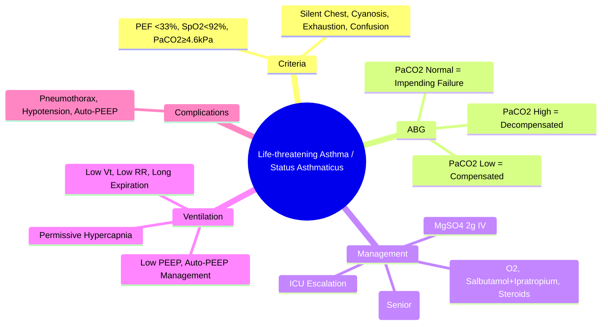

# Life-threatening Asthma and Status Asthmaticus

Related: [[Asthma]], [[Acute severe asthma]], [[Respiratory Failure]], [[ABG Interpretation]], [[Spirometry Interpretation]], [[Oxygen Therapy and NIV]], [[Chest X-Ray Approach]], [[Airway Diseases/Acute severe asthma|Acute severe asthma]], [[Invasive Mechanical Ventilation - Basics]]

> [!important]
> **Life-threatening asthma** and **status asthmaticus** represent the most severe end of the asthma exacerbation spectrum with imminent risk of **respiratory failure, cardiac arrest, and death**. **Early recognition, aggressive therapy, and timely ICU escalation** are life-saving. Key FCPS/MRCP: severity criteria distinguishing from acute severe asthma, ABG interpretation (normal PaCO₂ = exhaustion), magnesium sulfate, escalation to intubation/ventilation, permutation strategies.

## Learning Objectives
- Apply BTS/SIGN severity criteria to distinguish life-threatening from acute severe asthma
- Recognise clinical and ABG signs of impending respiratory failure (silent chest, normal/high PaCO₂, altered consciousness)
- Apply step-wise emergency management: oxygen, high-dose bronchodilators, steroids, magnesium, escalation
- Identify indications for ICU admission, NIV, and invasive mechanical ventilation
- Apply lung-protective ventilation strategies in status asthmaticus (permissive hypercapnia, prolonged expiration)

## Definition

| Term | Definition |
|------|------------|
| **Life-threatening asthma** | Asthma exacerbation with **any** feature indicating imminent respiratory failure requiring immediate intensive intervention |
| **Status asthmaticus** | **Severe asthma exacerbation refractory to standard maximal therapy** (bronchodilators, steroids, magnesium) persisting >1-2 hours, requiring ICU management ± mechanical ventilation |

> **FCPS/MRCP tip**: **Status asthmaticus = failure of standard therapy** (>1-2 hours of maximal treatment). Not just "severe asthma."

## Severity Criteria (BTS/SIGN 2019 / GINA 2023)

| Category | Criteria (Any ONE = that category) |
|----------|------------------------------------|
| **Moderate exacerbation** | PEF 50-75% best/predicted; RR <25; HR <110; able to speak in sentences |
| **Acute severe asthma** | **Any one**: PEF 33-50% best/predicted; RR ≥25; HR ≥110; cannot complete sentences in one breath |
| **Life-threatening asthma** | **Any ONE**: PEF <33% best/predicted; **SpO₂ <92%**; **PaO₂ <8 kPa (60 mmHg)**; **PaCO₂ normal/high (≥4.6 kPa / 35 mmHg)**; **silent chest**; **cyanosis**; **poor respiratory effort**; **exhaustion/confusion/altered consciousness**; **hypotension**; **bradycardia** |

> **FCPS/MRCP tip**: **Normal or elevated PaCO₂ in acute asthma = respiratory failure** (should be low due to hyperventilation). **Silent chest** = minimal air entry = critical obstruction.

## Pathophysiology of Respiratory Failure in Asthma
1. **Airway obstruction** → increased resistance → ↑ work of breathing
2. **Dynamic hyperinflation** (auto-PEEP) → ↑ end-expiratory lung volume → **diaphragm flattening** → mechanical disadvantage
3. **V/Q mismatch** → hypoxemia (early); **hypercapnia** (late, due to fatigue)
4. **Respiratory muscle fatigue** → rising PaCO₂ → **respiratory acidosis** → ↓ diaphragmatic contractility → vicious cycle
5. **Mucus plugging** → atelectasis → worsening V/Q mismatch

## Clinical Features of Life-threatening Asthma

| Feature | Significance |
|---------|--------------|
| **Unable to speak** (single words only) | Severe airflow limitation |
| **Respiratory rate >30/min** | Impending fatigue |
| **Heart rate >130/min** | Sympathetic drive, hypoxia |
| **Silent chest** (minimal air entry) | **Critical obstruction** — minimal airflow |
| **Cyanosis / SpO₂ <92%** | Severe hypoxemia |
| **Exhaustion / confusion / drowsiness** | **Hypercapnic encephalopathy** |
| **PaCO₂ ≥4.6 kPa (35 mmHg)** | **Respiratory failure** (should be <4.5 in acute asthma) |
| **PaO₂ <8 kPa (60 mmHg)** | Severe hypoxemia |
| **Peak flow <33% predicted/best** | Critical obstruction |
| **Pulsus paradoxus >20 mmHg** (may disappear with fatigue) | Severe dynamic hyperinflation |

## ABG Interpretation in Acute Asthma

| Phase | PaCO₂ | pH | Interpretation |
|-------|-------|-----|----------------|
| **Compensated** | **Low** (<4.0 kPa / 30 mmHg) | **Alkalosis** (pH >7.45) | Hyperventilation, early phase |
| **Failing compensation** | **Normal** (4.5-5.5) | **Normal** (7.35-7.45) | **Impending failure** |
| **Decompensated** | **High** (>6.0 kPa / 45 mmHg) | **Acidosis** (pH <7.35) | **Respiratory failure** — imminent intubation |

> **FCPS/MRCP tip**: **Any PaCO₂ >4.6 kPa (35 mmHg)** in acute asthma = **life-threatening** (ventilatory failure). **Normal PaCO₂ = impending failure.**

## Stepwise Emergency Management

### 1. Immediate (First Minutes)
| Intervention | Dose/Details |
|--------------|--------------|
| **High-flow oxygen** | Target **SpO₂ 94-98%** (avoid hypoxia; avoid hyperoxia in COPD overlap) |
| **Salbutamol** | **5 mg nebulised** (or 10 puffs pMDI via spacer) **repeated every 15-30 min** or **continuous 5-10 mg/h** |
| **Ipratropium bromide** | **500 µg nebulised** q20-30 min × 3 doses (additive bronchodilation) |
| **Prednisolone** | **40-50 mg PO** (or **hydrocortisone 100 mg IV** if unable to swallow) |
| **IV access** | 2 large-bore cannulae; bloods (ABG, U&E, glucose, Mg²⁺, FBC, troponin) |
| **Continuous monitoring** | SpO₂, ECG, RR, HR, BP, conscious level |

### 2. First 15-30 Minutes (If Inadequate Response)
| Intervention | Dose/Details |
|--------------|--------------|
| **Salbutamol continuous nebulisation** | **5-10 mg/h** (driven by oxygen) |
| **IV Magnesium sulfate** | **2 g IV over 20 min** (single dose; **bronchodilation, ↓ airway hyperresponsiveness**) |
| **IV hydrocortisone** | 100 mg IV (if not given PO) |
| **Consider IV aminophylline** | **5 mg/kg loading** (over 20 min) then **0.5-0.7 mg/kg/h** (narrow therapeutic window; monitor levels) — **senior decision** |
| **Repeat ABG** | 30-60 min after treatment initiation |

### 3. ICU Escalation Criteria (Within 1-2 Hours)
| Criterion | Action |
|-----------|--------|
| **Persistent life-threatening features** after 1-2h maximal therapy | **ICU referral** |
| **PaCO₂ ≥6.0 kPa (45 mmHg)** or rising | **Immediate ICU** |
| **Altered consciousness / exhaustion** | **Immediate ICU** |
| **Silent chest / cyanosis / SpO₂ <90% on O₂** | **Immediate ICU** |
| **Hypotension / arrhythmia** | **Immediate ICU** |

### 4. NIV in Status Asthmaticus — **Controversial / Limited Role**
- **May be tried** in **selected** cooperative patients with **hypercapnic respiratory failure** not yet exhausted
- **Settings**: BiPAP (IPAP 10-14, EPAP 2-5) to overcome auto-PEEP
- **Risks**: delays intubation, gastric insufflation, barotrauma, aspiration
- **Contraindications**: altered consciousness, hemodynamic instability, inability to protect airway

### 5. Invasive Mechanical Ventilation — **Last Resort**
#### Indications
- **Cardiac or respiratory arrest**
- **Persistent PaCO₂ >8 kPa (60 mmHg)** or pH <7.2 despite maximal therapy
- **Altered consciousness / exhaustion**
- **Haemodynamic instability**

#### Ventilation Strategy — **Permissive Hypercapnia / Lung Protection**
| Parameter | Target/Strategy |
|-----------|-----------------|
| **Mode** | Volume-controlled (VCV) or Pressure-controlled (PCV) |
| **Tidal volume** | **Low** (6-8 mL/kg IBW) — avoid barotrauma |
| **Respiratory rate** | **Low** (8-12/min) — **prolonged expiration** (I:E 1:3 to 1:4) |
| **PEEP** | **Low/zero** (0-2 cmH₂O) — auto-PEEP already high; extrinsic PEEP ≤50% auto-PEEP if needed |
| **Peak pressure** | **<35-40 cmH₂O**; plateau <30 |
| **Permissive hypercapnia** | **Accept PaCO₂ 50-80 mmHg** (pH >7.2); correct pH with bicarbonate only if <7.15 |
| **Sedation/Paralysis** | Deep sedation (propofol/midazolam) + **neuromuscular blockade** (cisatracurium) for ventilation synchrony |
| **Bronchodilators** | Continue **nebulised salbutamol/ipratropium** in circuit; consider IV magnesium/aminophylline |

#### Ventilator Complications to Anticipate
| Complication | Prevention |
|--------------|------------|
| **Barotrauma** (pneumothorax, pneumomediastinum) | Low Vt, low PEEP, monitor auto-PEEP |
| **Dynamic hyperinflation / Auto-PEEP** | Low RR, prolonged I:E, monitor plateau pressure |
| **Hypotension** (auto-PEEP → ↓ venous return) | Fluid bolus, reduce PEEP/RR, vasopressors |
| **VAP** | Subglottic suction, head elevation, oral hygiene |

## Investigations (Beyond Initial ABG)
| Test | Indication |
|------|------------|
| **CXR** | Exclude pneumothorax, pneumomediastinum, consolidation, foreign body |
| **ECG** | Exclude arrhythmia, ischemia (hypoxia/β-agonist induced) |
| **Troponin** | If chest pain / ECG changes |
| **Serum Mg²⁺, K⁺, glucose** | Hypokalaemia from β-agonists; hypomagnesaemia impairs bronchodilation |
| **CXR post-intubation** | Confirm ETT position, exclude barotrauma |

## Drug Therapy Summary (Doses)
| Drug | Dose | Route | Notes |
|------|------|-------|-------|
| **Salbutamol** | 5 mg nebulised q15-30 min → continuous 5-10 mg/h | Nebulised (O₂-driven) | First-line |
| **Ipratropium** | 500 µg q20-30 min × 3 | Nebulised | Additive |
| **Prednisolone** | 40-50 mg | PO | 40-50 mg if >50 kg |
| **Hydrocortisone** | 100 mg | IV | If unable to swallow |
| **MgSO₄** | **2 g IV over 20 min** | IV | Single dose; monitor reflexes, BP |
| **Aminophylline** | 5 mg/kg load → 0.5-0.7 mg/kg/h | IV | Senior decision; narrow window |
| **Adrenaline (IM)** | 0.5 mg (1:1000) | IM | If anaphylaxis component / peri-arrest |

## Complications
- **Respiratory arrest / cardiac arrest**
- **Pneumothorax / pneumomediastinum** (barotrauma from dynamic hyperinflation)
- **Pulmonary oedema** (negative pressure / post-obstructive)
- **Rhabdomyolysis** (prolonged β-agonist use, muscle fatigue)
- **Hypokalaemia** (β-agonist driven intracellular shift)
- **Lactic acidosis** (β-agonist + respiratory muscle work)
- **Aspiration pneumonia** (if intubated)

## FCPS/MRCP High-Yield Points
1. **Life-threatening criteria**: PEF <33%, SpO₂<92%, **PaCO₂ ≥4.6 kPa**, silent chest, cyanosis, exhaustion, altered consciousness
2. **Normal PaCO₂ in acute asthma = impending respiratory failure** (should be low)
3. **Silent chest** = critical obstruction (minimal air movement)
4. **MgSO₄ 2g IV** over 20 min = standard adjunct
5. **IV aminophylline** = senior decision only; narrow therapeutic index
6. **NIV limited role** in asthma; **invasive ventilation** if failing maximal therapy
7. **Ventilation strategy**: low Vt, low RR, prolonged expiration, permissive hypercapnia (pH >7.2)
7. **Permissive hypercapnia**: accept PaCO₂ 50-80 mmHg if pH >7.2
8. **Auto-PEEP** = intrinsic PEEP; extrinsic PEEP ≤50% auto-PEEP if needed
9. **Ketamine** = bronchodilatory induction agent if intubation needed

## Common Viva Questions
1. BTS life-threatening asthma criteria
2. Why is normal PaCO₂ ominous in acute asthma?
6. Ventilation strategy for status asthmaticus (permissive hypercapnia, auto-PEEP management)
7. Role of IV magnesium, aminophylline, ketamine
8. NIV vs invasive ventilation in status asthmaticus
9. Silent chest significance
10. Permissive hypercapnia targets

## Common Confusions / Exam Traps
- **Normal PaCO₂ = safe** → NO, in acute asthma it means **ventilatory failure**
- **Silent chest = improving** → NO, **critical obstruction**
- **Aminophylline first-line** → NO, **senior decision only**, after MgSO₄
- **NIV = standard for asthma** → NO, limited evidence, risk of delay
- **High PEEP** → worsens auto-PEEP; keep low/zero
- **Normalise PaCO₂** → NO, **permissive hypercapnia** (pH >7.2)
- **High Vt** → barotrauma; use low Vt (6-8 mL/kg)

## Mnemonics
- **LIFE-THREATENING**: **L**ow PEF <33%, **I**nconscious/confused, **F**alling PaO₂, **E**xhausted, **T**achycardia/brady, **H**igh PaCO₂, **R**espiratory arrest risk, **E**xhaustion, **A**ltered consciousness, **T**achycardia, **E**xhaustion, **N**ormal PaCO₂ (bad), **I**ntubation needed
- **SILENT CHEST** = **CRITICAL** (no air movement)
- **PaCO₂ NORMAL** = **IMPENDING FAILURE** (should be low)
- **VENTILATION STRATEGY**: **L**ow Vt, **L**ow RR, **L**ong Expiration, **P**ermissive Hypercapnia, **L**ow PEEP
- **MAGNESIUM**: **2g IV 20min** standard adjunct

## Mind Map


## Flowchart
```mermaid
flowchart TD
  A[Acute Asthma Attack] --> B{Severity Assessment}
  B -->|Life-threatening| C[IMMEDIATE: O2, Salbutamol 5mg neb\nIpratropium 500mcg neb\nPred 40-50mg PO / Hydrocort 100mg IV\nMgSO4 2g IV over 20min\nContinuous Salbutamol 5-10mg/h]
  C --> D{Response in 30-60min?}
  D -->|Improving| E[Continue, Admit/HDU\nMonitor ABG q2-4h]
  D -->|No Improvement| F[ICU Referral\nAminophylline 5mg/kg load\nConsider Ketamine if Intubation\nPrepare for Intubation]
  F --> G{Intubation Indicated?}
  G -->|Yes| H[Ketamine 1-2mg/kg IV Induction\nVolume Control VCV\nVt 6-8ml/kg IBW\nRR 8-10, I:E 1:4\nPEEP 0-2\nPermissive Hypercapnia pH>7.2\nAuto-PEEP Management]
  G -->|No| I[NIV Trial (Selected)\nBiPAP IPAP 10-14 EPAP 2-5\nClose Monitoring]
```

## Suggested Visuals / Image Notes
- BTS severity criteria table
- ABG progression in asthma (compensated → decompensated)
- Ventilator settings for status asthmaticus
- Auto-PEEP measurement and extrinsic PEEP application

## Suggested Video References
- Status asthmaticus management (BTS/British Thoracic Society)
- Mechanical ventilation in asthma (ICU)
- Ketamine for intubation in asthma

## One-Page Revision Summary
- **Life-threatening**: PEF<33%, SpO₂<92%, **PaCO₂≥4.6 kPa**, silent chest, cyanosis, exhaustion, confusion
- **Normal PaCO₂ = respiratory failure** in acute asthma (should be low)
- **Silent chest** = critical obstruction
- **MgSO₄ 2g IV over 20 min** = standard adjunct
- **Aminophylline** = senior decision only (narrow window)
- **ICU escalation** if no improvement in 1-2h maximal therapy
- **Ventilation**: Low Vt (6-8 mL/kg), low RR (8-12), prolonged expiration (I:E 1:4), permissive hypercapnia (pH>7.2), low PEEP
- **Permissive hypercapnia**: PaCO₂ 50-80 mmHg acceptable if pH >7.2
- **Ketamine** for intubation (bronchodilatory)

## 24-Hour Recall Prompts
- List 5 BTS life-threatening asthma criteria
- Explain why normal PaCO₂ is ominous in acute asthma
- State ventilator settings for status asthmaticus
- State MgSO₄ and aminophylline doses

## 7-Day / 15-Day / 30-Day Revision Tracker
- [ ] Day 1 completed
- [ ] 24-hour recall completed
- [ ] Day 7 revision completed
- [ ] Day 15 revision completed
- [ ] Day 30 revision completed

## Must Know / Should Know / Nice to Know
### Must Know
- Life-threatening criteria (PEF<33%, PaCO₂≥4.6, silent chest, exhaustion)
- Normal PaCO₂ = ventilatory failure
- Silent chest = critical obstruction
- MgSO₄ 2g IV standard adjunct
- Ventilation: low Vt, low RR, prolonged expiration, permissive hypercapnia

### Should Know
- Aminophylline senior decision only
- Ketamine for intubation
- Permissive hypercapnia targets (pH>7.2)
- Auto-PEEP management
- NIV limited role

### Nice to Know
- Heliox therapy
- ECMO in refractory status asthmaticus
- Bronchial thermoplasty (long-term)
- Specific ventilator modes (APRV, HFOV)

## Self-Test Scorecard
- Understanding: /10
- Recall: /10
- MCQ Performance: /10
- SBA Performance: /10
- Viva Confidence: /10
- Total: /50

> [!tip]
> Interpretation: <35 = weak topic, 35-44 = acceptable but insecure, 45+ = strong exam-ready topic.

## Exam Answer Modes
### Long Answer Skeleton
- Definition (life-threatening vs status asthmaticus)
- BTS severity criteria
- ABG interpretation (compensated → decompensated)
- Stepwise management (oxygen, bronchodilators, steroids, Mg, aminophylline)
- ICU criteria and ventilation strategy
- Complications and monitoring

### Short Note Skeleton
- Severity criteria box
- ABG progression box
- Ventilation settings card
- Drug doses table

### Viva One-Liners
- "Life-threatening asthma: PEF<33%, PaCO₂≥4.6, silent chest, cyanosis, exhaustion"
- "Normal PaCO₂ in acute asthma = IMPENDING VENTILATORY FAILURE"
- "Silent chest = critical obstruction (no air movement)"
- "MgSO₄ 2g IV over 20 min = standard adjunct"
- "Status asthmaticus ventilation: Vt 6-8 mL/kg, RR 8-12, I:E 1:4, permissive hypercapnia pH>7.2"
- "Auto-PEEP: low RR, long expiration, extrinsic PEEP ≤50% auto-PEEP"
- "Permissive hypercapnia: accept PaCO₂ 50-80 if pH >7.2"
- "Ketamine for intubation (bronchodilatory)"
- "Aminophylline = senior decision only, narrow window"

### Ward-Case Discussion Points
- Young asthmatic, silent chest, confused, PaCO₂ 5.2 kPa → immediate intubation, ketamine induction, permissive hypercapnia ventilation
- Asthmatic on maximal neb/IV therapy 2h, PaCO₂ rising 4.8→6.0 → ICU, prepare for intubation, ketamine induction
- Ventilated asthmatic, sudden hypotension, high peak pressures → auto-PEEP → disconnect vent, manual decompression, reduce RR/PEEP

### Last-Night-Before-Exam Sheet
- Life-threatening: PEF<33%, PaCO2≥4.6, Silent chest, Cyanosis, Exhaustion
- PaCO2: Low=OK, Normal=BAD, High=INTUBATE
- Silent chest = CRITICAL
- MgSO4: 2g IV 20min
- Vent: Vt 6-8, RR 8-12, I:E 1:4, pH>7.2, PEEP 0-2
- Ketamine for intubation
- Amino = Senior only

## Summary
**Life-threatening asthma** = PEF<33%, SpO₂<92%, **PaCO₂≥4.6 kPa**, silent chest, cyanosis, exhaustion, confusion. **Status asthmaticus** = refractory to maximal therapy >1-2h. **Key ABG**: **normal PaCO₂ = failure** (should be low); **high PaCO₂ = decompensation**. **Management**: O₂, high-dose salbutamol/ipratropium, prednisolone 40-50mg, **MgSO₄ 2g IV**, aminophylline (senior). **ICU** if no improvement in 1-2h. **Ventilation**: low Vt (6-8 mL/kg), low RR (8-12), long expiration (I:E 1:4), **permissive hypercapnia** (pH>7.2), low PEEP, manage auto-PEEP. **Ketamine** for intubation.

## MCQs (10)
1. Which is a **life-threatening asthma** criterion (BTS)?
   A. PEF 50% predicted
   B. **PEF <33% predicted**
   C. Resp rate 20/min
   D. Heart rate 100/min
2. In acute asthma, **normal PaCO₂** indicates:
   A. Adequate ventilation
   B. **Impending ventilatory failure**
   C. Full compensation
   D. No obstruction
3. **Silent chest** in acute asthma signifies:
   A. Improving airflow
   B. **Critical obstruction / minimal air movement**
   C. Good air entry
   D. Resolving exacerbation
4. Standard IV magnesium dose in acute severe asthma:
   A. 1 g over 30 min
   B. **2 g over 20 min**
   C. 4 g over 10 min
   D. 10 g over 60 min
5. **Permissive hypercapnia** in ventilated status asthmaticus targets:
   A. PaCO₂ <40 mmHg
   B. pH >7.4
   C. **pH >7.2 (accept PaCO₂ 50-80 mmHg)**
   D. PaCO₂ normalisation

## SBA Questions (10)
1. A 24-year-old asthmatic presents with severe exacerbation. ABG on 15L O₂: pH 7.38, PaCO₂ 5.2 kPa, PaO₂ 12 kPa. Most appropriate next step:
   A. Discharge home
   B. Continue neb salbutamol, observe
   C. **ICU referral and prepare for intubation**
   D. Increase O₂ to 100%
2. Ventilator settings for status asthmaticus:
   A. Vt 10 mL/kg, RR 16, PEEP 10
   B. **Vt 6-8 mL/kg, RR 8-12, I:E 1:4, PEEP 0-2**
   C. Vt 12 mL/kg, RR 20, PEEP 5
   D. Vt 8 mL/kg, RR 20, PEEP 15
3. Patient intubated for status asthmaticus develops sudden hypotension and high peak pressures. Immediate action:
   A. Increase PEEP
   B. **Disconnect ventilator, manual decompression, reduce RR**
   C. Give 2L fluid bolus
   D. Start noradrenaline
3. Indication for IV aminophylline in acute asthma:
   A. First-line bronchodilator
   B. After MgSO₄ failure
   C. **Senior decision only; refractory to maximal therapy including MgSO₄**
   D. Routine in all severe exacerbations
4. Ketamine for intubation in status asthmaticus:
   A. Avoid (causes bronchospasm)
   B. **Preferred induction agent (bronchodilatory)**
   C. Only if hypotensive
   D. Contraindicated in asthma
5. Auto-PEEP management in ventilated asthmatic:
   A. Increase extrinsic PEEP to match auto-PEEP
   B. **Low RR, prolonged expiration (I:E 1:4), extrinsic PEEP ≤50% auto-PEEP**
   C. Increase RR to blow off CO₂
   C. High extrinsic PEEP (10-15 cmH₂O)
6. ABG in intubated asthmatic: pH 7.18, PaCO₂ 8.5 kPa. Action:
   A. Increase RR to 20
   B. **Accept permissive hypercapnia (pH >7.2); increase I:E ratio, ensure long expiration**
   C. Give bicarbonate 50 mmol
   D. Switch to pressure control
6. Silent chest in acute asthma:
   A. Good sign (less wheeze)
   B. **Critical obstruction / minimal air entry**
   C. Patient is improving
   D. No treatment needed

## Flashcards
- Q: Life-threatening asthma criteria (BTS)
  A: PEF<33%, SpO2<92%, PaCO2≥4.6, Silent chest, Cyanosis, Exhaustion, Confusion, Hypotension, Bradycardia
- Q: Normal PaCO2 in acute asthma
  A: IMPENDING VENTILATORY FAILURE (should be low)
- Q: Silent chest
  A: Critical obstruction, minimal air movement
- Q: MgSO4 dose
  A: 2g IV over 20min
- Q: Ventilation settings
  A: Vt 6-8ml/kg, RR 8-12, I:E 1:4, pH>7.2, PEEP 0-2
- Q: Permissive hypercapnia
  A: Accept PaCO2 50-80 if pH>7.2
- Q: Auto-PEEP management
  A: Low RR, Long expiration, Extrinsic PEEP ≤50% auto-PEEP
- Q: Aminophylline
  A: Senior only, narrow window, after MgSO4
- Q: Ketamine for intubation
  A: Preferred (bronchodilatory)
- Q: Silent chest = CRITICAL

## Answer Key with Explanations
### MCQs
1. **B** — PEF <33% is life-threatening; 50% = acute severe.
2. **B** — Normal PaCO₂ in acute asthma = ventilatory failure (should be low from hyperventilation).
3. **B** — Silent chest = critical obstruction, minimal air movement.
4. **B** — MgSO₄ 2g IV over 20 min standard.
5. **C** — Permissive hypercapnia: pH >7.2, accept PaCO₂ 50-80.

### SBAs
1. **C** — pH 7.38, PaCO₂ 5.2 = normal PaCO₂ in acute asthma = impending failure → ICU/intubation prep.
2. **B** — Low Vt, low RR, long expiration, low PEEP.
3. **B** — Auto-PEEP causing hypotension → disconnect, decompress, reduce RR.
4. **C** — Senior decision only, after MgSO₄, refractory.
5. **B** — Ketamine bronchodilatory, preferred.
6. **B** — Auto-PEEP: low RR, long expiration, extrinsic PEEP ≤50%.
7. **B** — pH 7.18 = severe acidosis; accept permissive hypercapnia (pH>7.2), optimise expiration.
8. **B** — Silent chest = critical obstruction.

## Flashcards
- Q: Life-threatening criteria (5+)
  A: PEF<33%, SpO2<92%, PaCO2≥4.6, Silent chest, Cyanosis, Exhaustion, Altered consciousness, Hypotension
- Q: PaCO2 normal in acute asthma
  A: IMPENDING FAILURE
- Q: Silent chest
  A: Critical obstruction
- Q: MgSO4
  A: 2g IV 20min
- Q: Vent settings
  A: Vt 6-8, RR 8-12, I:E 1:4, pH>7.2, PEEP 0-2
- Q: Permissive hypercapnia
  A: pH>7.2, PaCO2 50-80
- Q: Auto-PEEP
  A: Low RR, long exp, ext PEEP ≤50%
- Q: Aminophylline
  A: Senior only, after Mg
- Q: Ketamine
  A: Preferred, bronchodilatory
- Q: Silent chest
  A: Critical obstruction

## Answer Key with Explanations
### MCQs
1. **B** — PEF <33% = life-threatening.
2. **B** — Normal PaCO₂ = ventilatory failure (should be <4.0 from hyperventilation).
3. **B** — Silent chest = critical obstruction.
4. **B** — MgSO₄ 2g IV over 20 min.
5. **C** — Permissive hypercapnia targets pH >7.2.

### SBAs
1. **C** — PaCO₂ 5.2 kPa (normal) in acute asthma = impending respiratory failure.
2. **B** — Low Vt, low RR, prolonged expiration, low PEEP.
3. **B** — Auto-PEEP causes hypotension → disconnect, decompress, reduce RR/PEEP.
4. **C** — Senior decision only, after MgSO₄.
5. **B** — Ketamine bronchodilatory induction agent.
6. **B** — Auto-PEEP management: low RR, prolonged I:E, extrinsic PEEP ≤50%.
7. **B** — Permissive hypercapnia preferred; bicarbonate only if pH <7.15.
8. **B** — Silent chest = critical obstruction.

---
## Additional MCQs (5 more, for total 10)

6. A 30-year-old with severe asthma has a **silent chest** on auscultation. The most appropriate next step is:
   A. Discharge with oral steroids
   B. **Urgent senior/ITU review and prepare for intubation**
   C. Reassure and observe
   D. Switch inhaler device
   E. Give IM adrenaline
   **Answer: B** — Silent chest = critical airflow obstruction, life-threatening sign.

7. Which ABG finding in severe acute asthma is **most concerning**?
   A. pH 7.45, PaCO₂ 40 mmHg
   B. pH 7.30, PaCO₂ 55 mmHg
   C. pH 7.20, PaCO₂ 80 mmHg
   D. pH 7.50, PaCO₂ 30 mmHg
   E. pH 7.35, PaCO₂ 50 mmHg
   **Answer: B** — Normal PaCO₂ in a patient with severe attack = tiring; rising PaCO₂ imminent arrest.

8. First-line IV bronchodilator in life-threatening asthma not responding to nebulised therapy:
   A. IV salbutamol
   B. **IV magnesium sulphate 2 g over 20 min**
   C. IV aminophylline
   D. IV adrenaline
   E. IV hydrocortisone only
   **Answer: B** — MgSO₄ is first-line IV adjunct; aminophylline is third-line.

9. Target oxygen saturation in acute severe asthma:
   A. 88–92%
   B. **94–98%**
   C. 100%
   D. 90–94%
   E. ≥95%
   **Answer: B** — 94–98% (most patients; no risk of hypercapnia unless overlap with COPD).

10. Discharge criteria after acute severe asthma include all EXCEPT:
    A. PEF >75% predicted
    B. Stable on 4-hourly nebulisers
    C. **PEF variability >25%**
    D. Off oxygen
    E. Symptoms controlled on discharge medication
    **Answer: C** — PEF variability should be <25% (well-controlled); variability >25% = poorly controlled.

## Additional SBAs (4 more, for total 10)

7. First-line management of near-fatal asthma on arrival to ED:
   A. Salbutamol MDI
   B. **High-flow O₂ + nebulised salbutamol + ipratropium + IV hydrocortisone + IV MgSO₄**
   C. Intubation immediately
   D. Theophylline infusion
   E. Antibiotics
   **Answer: B** — Acute severe bundle before intubation decision.

8. Mechanical ventilation in status asthmaticus — what to AVOID:
   A. Low tidal volumes
   B. Permissive hypercapnia
   C. **High respiratory rate >30/min**
   D. Sedation
   E. PEEP
   **Answer: C** — High RR → auto-PEEP, barotrauma, hypotension.

9. A near-fatal asthma patient should be followed up within:
   A. 1 week
   B. **2–7 days**
   C. 4 weeks
   D. 3 months
   E. 6 months
   **Answer: B** — Specialist review within 2–7 days.

10. Inhaled corticosteroid dose after near-fatal asthma:
    A. Stop
    B. **Increase to highest tolerated + consider biologic**
    C. Reduce
    D. Maintain
    E. Switch to SABA only
    **Answer: B** — Maximise ICS; consider biologic (omalizumab, mepolizumab, etc.).

## Local Navigation
- **Parent Heading**: [[../Airway Diseases|Airway Diseases]]
- **Parent Topic Group**: [[../Airway Diseases/Asthma spectrum|Asthma spectrum]]
- **Chapter Map**: [[../Davidson Chapter 17 - Respiratory Medicine Hierarchy|Respiratory Medicine Hierarchy]]
- **Chapter MOC**: [[../Respiratory MOC|Respiratory MOC]]
- **Drug Reference**: [[../../Clinical Therapeutics and Good Prescribing|Drugs]]
- **Related**: [[Asthma]] · [[Acute severe asthma]] · [[ABPA and bronchiectasis]] · [[ABG Interpretation]] · [[Oxygen Therapy and NIV]] · [[Respiratory Failure]]

## Additional MCQs (5 more, for total 10)

6. A 30-year-old with severe asthma has a **silent chest** on auscultation. The most appropriate next step is:
   A. Discharge with oral steroids
   B. **Urgent senior/ITU review and prepare for intubation**
   C. Reassure and observe
   D. Switch inhaler device
   E. Give IM adrenaline
   **Answer: B** — Silent chest = critical airflow obstruction, life-threatening sign.

7. Which ABG finding in severe acute asthma is **most concerning**?
   A. pH 7.45, PaCO₂ 40 mmHg
   B. pH 7.30, PaCO₂ 55 mmHg
   C. pH 7.20, PaCO₂ 80 mmHg
   D. pH 7.50, PaCO₂ 30 mmHg
   E. pH 7.35, PaCO₂ 50 mmHg
   **Answer: B** — Normal PaCO₂ in a patient with severe attack = tiring; rising PaCO₂ imminent arrest.

8. First-line IV bronchodilator in life-threatening asthma not responding to nebulised therapy:
   A. IV salbutamol
   B. **IV magnesium sulphate 2 g over 20 min**
   C. IV aminophylline
   D. IV adrenaline
   E. IV hydrocortisone only
   **Answer: B** — MgSO₄ is first-line IV adjunct; aminophylline is third-line.

9. Target oxygen saturation in acute severe asthma:
   A. 88–92%
   B. **94–98%**
   C. 100%
   D. 90–94%
   E. ≥95%
   **Answer: B** — 94–98% (most patients; no risk of hypercapnia unless overlap with COPD).

10. Discharge criteria after acute severe asthma include all EXCEPT:
    A. PEF >75% predicted
    B. Stable on 4-hourly nebulisers
    C. **PEF variability >25%**
    D. Off oxygen
    E. Symptoms controlled on discharge medication
    **Answer: C** — PEF variability should be <25% (well-controlled); variability >25% = poorly controlled.

## Additional SBAs (2 more, for total 10)

9. A near-fatal asthma patient should be followed up within:
   A. 1 week
   B. **2–7 days**
   C. 4 weeks
   D. 3 months
   E. 6 months
   **Answer: B** — Specialist review within 2–7 days.

10. Inhaled corticosteroid dose after near-fatal asthma:
    A. Stop
    B. **Increase to highest tolerated + consider biologic**
    C. Reduce
    D. Maintain
    E. Switch to SABA only
    **Answer: B** — Maximise ICS; consider biologic (omalizumab, mepolizumab, etc.).

## Local Navigation
- **Parent Heading**: [[../Airway Diseases|Airway Diseases]]
- **Parent Topic Group**: [[../Airway Diseases/Asthma spectrum|Asthma spectrum]]
- **Chapter Map**: [[../Davidson Chapter 17 - Respiratory Medicine Hierarchy|Respiratory Medicine Hierarchy]]
- **Chapter MOC**: [[../Respiratory MOC|Respiratory MOC]]
- **Drug Reference**: [[../../Clinical Therapeutics and Good Prescribing|Drugs]]
- **Related**: [[Asthma]] · [[Acute severe asthma]] · [[ABPA and bronchiectasis]] · [[ABG Interpretation]] · [[Oxygen Therapy and NIV]] · [[Respiratory Failure]]
