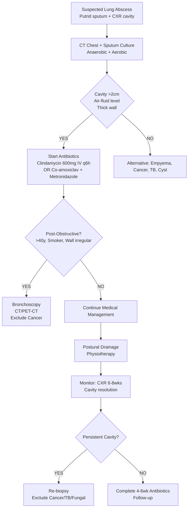

# Lung Abscess and Necrotizing Pneumonia

Related: [[Pneumonia]], [[Aspiration pneumonia]], [[Empyema and pleural infection]], [[Bronchiectasis]], [[Anaerobic infections]], [[Post-obstructive pneumonia]], [[Airway obstruction]], [[Bronchial carcinoid tumor]], [[Lung cancer]]

> [!important]
> **Lung abscess** = **necrotising pneumonia** with **cavitation** containing **pus/necrotic debris**, usually from **aspiration of oropharyngeal anaerobes** or **post-obstructive** (tumour, foreign body). **Key FCPS/MRCP**: **Cavitating lesion with air-fluid level** on CXR, **putrid sputum**, **anaerobic + mixed flora**, **prolonged antibiotics** (clindamycin/β-lactam+metronidazole), **drainage rarely needed**, **exclude malignancy** (post-obstructive), **TB**, **fungal**, **necrotising pneumonia** = fulminant, often **S. aureus (PVL+)** or **Strep. pyogenes**, **high mortality**.

## Learning Objectives
- Define **lung abscess** and **necrotizing pneumonia** and distinguish from **empyema**, **pneumonia**, **lung cancer**
- Identify **aetiology** (aspiration anaerobes, post-obstructive, haematogenous, necrotising pneumonia)
- Recognise **clinical features** (putrid sputum, air-fluid level, digital clubbing)
- Apply **diagnostic criteria** (CXR/CT: cavity with air-fluid level, thick wall, putrid sputum, anaerobes)
- Manage with **prolonged antibiotics** (clindamycin, β-lactam+metronidazole, carbapenems) and **postural drainage**
- Recognise **complications** (empyema, bronchopleural fistula, haemoptysis, metastatic spread)
- Differentiate from **empyema**, **TB**, **lung cancer**, **fungal abscess**, **metastases**

## Definition
| Term | Definition |
|------|------------|
| **Lung abscess** | **Cavitating lesions** in lung parenchyma containing **purulent material** (pus/necrotic debris), usually >2cm, thick wall, air-fluid level, caused by **necrotising pneumonia** |
| **Necrotizing pneumonia** | **Fulminant, rapidly progressive** pneumonia with **extensive parenchymal necrosis**, often **multiple small cavities** or **single large cavity**, high mortality |

> **FCPS/MRCP tip**: **Lung abscess = cavity with air-fluid level, putrid sputum, anaerobes**. **Necrotising pneumonia = rapid, multiple cavities, S. aureus (PVL+)/Strep. pyogenes, high mortality**.

## Aetiology
### 1. Aspiration (Most Common, ~60-80%)
- **Oropharyngeal anaerobes** (Peptostreptococcus, Prevotella, Porphyromonas, Fusobacterium, Bacteroides) + **aerobes** (Strep, Staph, H. influenzae) → **polymicrobial**
- **Risk factors**: Alcoholism, seizure, stroke, anaesthesia, poor dentition, dysphagia, drug overdose, elderly, debilitated
- **Location**: **Right lower lobe** (most common), **posterior segment upper lobe** (if supine)

### 2. Post-Obstructive (Bronchial Obstruction)
- **Bronchogenic carcinoma** (most common), **benign tumour** (carcinoid), **foreign body**, **enlarged lymph nodes**, **endobronchial TB**, **mucous plug**
- **Pathophysiology**: Obstruction → distal atelectasis → secondary infection → abscess
- **Key**: **Always exclude malignancy** in new lung abscess, especially >40y, smoker

### 3. Haematogenous (Septic Emboli)
- **Right-sided endocarditis** (tricuspid valve, IVDU), **septic thrombophlebitis**, **metastatic septic emboli**
- **Multiple bilateral cavities**, often peripheral
- **Organisms**: Staph aureus (tricuspid endocarditis), Gram-negatives, fungi

### 4. Necrotising Pneumonia (Primary)
- **S. aureus** (PVL+ community-acquired, MRSA), **Strep. pyogenes** (Group A strep), **Klebsiella**, **Gram-negatives**
- **Fulminant**, rapid necrosis, multiple cavities, **high mortality (30-50%)**

### 5. Other
- **Immunocompromised**: Nocardia, Actinomyces, fungi (Aspergillus, Mucor), TB, PJP
- **Connective tissue**: GPA, rheumatoid nodules
- **Inhalation**: Chemical, hydrocarbon, foreign body

## Clinical Features
### Lung Abscess (Subacute/Chronic)
| Feature | Description |
|---------|-------------|
| **Cough** | **Productive, putrid/foul-smelling sputum** (hallmark) |
| **Fever** | Low-grade, intermittent, night sweats |
| **Weight loss**, anorexia | Chronic |
| **Haemoptysis** | Common (streaks to massive) |
| **Pleuritic chest pain** | If pleural involvement |
| **Digital clubbing** | **Rapid onset** (2–4 weeks), indicates chronicity |

### Necrotizing Pneumonia (Acute/Fulminant)
- **High fever**, rigors, **severe dyspnoea**, **haemoptysis**, **confusion**, **shock**
- **Rapid progression** (hours–days), **bilateral/multiple cavities**
- **Septic shock**, ARDS, multi-organ failure common

### Examination
| Finding | Abscess | Necrotising Pneumonia |
|---------|---------|----------------------|
| **Fever** | Low-grade, intermittent | **High, rigors** |
| **Breath sounds** | Bronchial breathing over cavity | Reduced, crackles |
| **Percussion** | Dull over consolidation | Dull |
| **Clubbing** | **Early (2-4 wks)** | Late/absent |
| **Cyanosis** | If severe | **Common** |

## Investigations
### 1. Imaging
| Modality | Findings |
|----------|----------|
| **CXR** | **Cavitation with air-fluid level** (classic), thick irregular wall (>1cm), surrounding consolidation, usually single, RLL > posterior upper lobe |
| **CT Chest** | **Cavity with thick wall**, air-fluid level, surrounding GGO/consolidation, **vessel extension to wall** (feeding vessels), exclude malignancy (wall nodules), detect multiple/bilateral |
| **Ultrasound** | Pleural effusion (parapneumonic/empyema), peripheral abscess localisation |

> **FCPS/MRCP tip**: **Lung abscess = single cavity, air-fluid level, thick wall, putrid sputum**. **Necrotising pneumonia = multiple cavities, rapid, S. aureus PVL+. Exclude cancer (wall thickening/nodularity) — CT + bronchoscopy if >40y/smoker.**

### 2. Sputum/Microbiology
| Sample | Key Findings |
|--------|--------------|
| **Sputum (expectorated)** | **Putrid/foul smell** (anaerobes), **mixed flora** (anaerobes + aerobes) |
| **Gram stain** | **Mixed Gram+/Gram-**, **Gram-negative rods/anaerobes** |
| **Culture** | **Polymicrobial**: **Anaerobes** (Peptostreptococcus, Prevotella, Bacteroides, Fusobacterium) + **Aerobes** (Strep milleri, Staph, H. influenzae, Klebsiella) |
| **Blood cultures** | Positive in 10-20% (haematogenous spread, endocarditis) |
| **Anaerobic culture** | Essential (send in anaerobic transport) |

### 3. Exclusion of Malignancy (Critical if >40y, smoker)
- **CT Chest with contrast**: Wall thickness, nodularity, enhancement
- **Bronchoscopy**: Exclude endobronchial tumour, foreign body, obtain samples
- **CT-guided biopsy** if wall nodularity/suspicious
- **PET-CT**: Metabolic activity (SUV max)

### 4. TB/Other Exclusions
- **GeneXpert MTB/RIF Ultra** on sputum
- **AFB smear/culture** (TB can cause abscess)
- **Fungal serology/culture** (Aspergillus, endemic fungi)
- **Serology**: Actinomyces, Nocardia, Legiona, Q fever

## Management
### 1. Medical (Antibiotics — Prolonged Course)
| Agent | Regimen | Duration |
|-------|---------|----------|
| **Clindamycin** (1st line for anaerobes) | 600mg IV q6h → 300mg PO q6h | **4–6 weeks** (then oral to complete) |
| **β-lactam + Metronidazole** | Co-amoxiclav 1.2g IV TDS + Metronidazole 500mg IV TDS | 4–6 weeks |
| **Carbapenem** (meropenem/imipenem) | If resistant/complex | 4–6 weeks |
| **Cephalosporin + Metronidazole** | Ceftriaxone 2g OD + Metronidazole 500mg TDS | 4–6 weeks |
| **Piperacillin-tazobactam** | 4.5g QDS IV | 4–6 weeks |

> **Key**: **Anaerobic coverage essential**. **Duration**: **IV 2–4 weeks → oral to complete 4–6 weeks total**. **Longer if slow response, large cavity, immunocompromised.**

### 2. Adjunctive Measures
- **Postural drainage** (physiotherapy) — **drain cavity** (head down, affected side up)
- **Bronchoscopy** — if large cavity, mucus plugging, or to exclude obstruction
- **Bronchial artery embolisation (BAE)** — for massive haemoptysis
- **Surgery** (lobectomy) — **rare**: failed medical, massive haemoptysis, bronchopleural fistula, suspected cancer

### 3. Post-Obstructive Abscess (Suspected Cancer)
- **Bronchoscopy** mandatory
- **CT/PET-CT** staging
- **MDT** — resection if resectable cancer

### 4. Necrotizing Pneumonia (S. aureus PVL+, Strep. pyogenes)
- **IV Vancomycin** (or linezolid if MRSA) **+ Clindamycin** (toxin suppression) **+/- IVIG** (toxin-neutralising)
- **Supportive**: ICU, ventilatory support, vasopressors, renal replacement
- **Consider** clindamycin + flucloxacillin for MSSA PVL+

### 5. Post-Treatment Follow-Up
- **Repeat CXR/CT at 6–8 weeks** → cavity should shrink, wall thin, air-fluid level resolve
- **Persistent cavity** → reconsider diagnosis (cancer, TB, fungal, bronchopleural fistula)
- **Sputum cultures** → should be negative

## Complications
| Complication | Details |
|--------------|---------|
| **Empyema** | Rupture into pleural space (parapneumonic → empyema) |
| **Bronchopleural fistula** | Cavity communicates with pleural space (air-fluid level in pleural space) |
| **Massive haemoptysis** | Bronchial artery erosion (BAE definitive) |
| **Bronchiectasis** | Chronic damage to airways |
| **Septic metastases** | Brain abscess, metastatic abscesses (haematogenous) |
| **Bronchiectasis** | Chronic airway damage |
| **Amyloidosis (AA)** | Chronic inflammation |
| **Carcinoma** | Post-obstructive abscess (diagnose early!) |

## Differential Diagnosis
| Condition | Key Differentiators |
|-----------|---------------------|
| **Empyema** | Fluid in pleural space (not parenchymal cavity), frank pus, pH<7.2, Drain → pus |
| **TB** | Upper lobe, chronic, night sweats, AFB+, GeneXpert+, caseating granuloma |
| **Lung Cancer** | **Irregular thick wall (>15mm), nodularity, enhancement on CT**, age >40, smoker, weight loss |
| **Fungal Abscess** | Aspergillus (invasive, angioinvasive), endemic fungi (Histoplasma, Coccidioides) |
| **Metastases** | Multiple, round, sharp margins, known primary |
| **Rheumatoid Nodule** | Rheumatoid history, thin-walled cavity, RF+, often asymptomatic |
| **Septic Emboli** | Multiple, bilateral, peripheral, tricuspid endocarditis history |

## Special Situations
### Post-Obstructive Abscess (Cancer)
- **Bronchoscopy** within 48h if >40y/smoker
- **PET-CT** for staging
- **Multidisciplinary** decision (surgery vs chemo/radiotherapy)

### Immunocompromised
- **Broad differential**: Nocardia, Aspergillus, Mucor, CMV, PJP, TB, NTM
- **BAL + biopsy** often needed
- **Broad empiric coverage** (antifungal, antiviral, broad-spectrum)

### Paediatric
- **Aspiration** common (foreign body, dysphagia)
- **Staph aureus** common (including PVL+)
- **Congenital anomalies** (sequestration, CPAM) predispose

## Prognosis
| Scenario | Mortality | Outcome |
|----------|-----------|---------|
| **Uncomplicated anaerobic abscess** | **<5%** (with antibiotics) | Full resolution (cavity shrinks, wall thins) |
| **Necrotizing pneumonia (S. aureus PVL+)** | **30–50%** | ARDS, shock, multi-organ failure |
| **Post-obstructive (cancer)** | Depends on cancer stage | Often recurrent if cancer unresected |
| **Immunocompromised** | Higher | Depends on immune recovery |

## Topic Correlation
- [[Pneumonia]] — CAP/HAP framework
- [[Aspiration pneumonia]] — common cause
- [[Empyema and pleural infection]] — complication
- [[Bronchiectasis]] — complication/sequelae
- [[Post-obstructive pneumonia]] — cancer cause
- [[Bronchial carcinoid tumor]] — obstruction cause

## FCPS/MRCP High-Yield Points
1. **Lung abscess** = cavitating necrotising pneumonia, **air-fluid level, thick wall, putrid sputum**, anaerobes
2. **Aspiration anaerobes** = most common cause (alcohol, seizure, stroke, poor dentition)
3. **Post-obstructive** = **exclude malignancy** (bronchoscopy, CT, PET)
4. **CXR**: **Single cavity, air-fluid level, thick wall** (RLL most common)
4. **Sputum**: **Putrid/foul**, polymicrobial (anaerobes + aerobes)
4. **Antibiotics**: **Clindamycin** or **β-lactam + metronidazole** × **4–6 weeks** (anaerobic coverage!)
5. **Postural drainage** = adjunct
6. **Necrotizing pneumonia** = S. aureus PVL+ / Strep. pyogenes, **multiple cavities, rapid, high mortality**
5. **Complications**: Empyema, bronchopleural fistula, massive haemoptysis (BAE), metastatic spread
6. **Exclude cancer** in new abscess >40y/smoker (bronchoscopy + CT)

## Common Viva Questions
1. Lung abscess definition, aetiology, CXR findings
2. Aspiration lung abscess — risk factors, location, microbiology
6. Antibiotic choice and duration (anaerobic coverage)
6. Post-obstructive abscess — cancer exclusion
7. Necrotizing pneumonia vs lung abscess
7. Complications (empyema, BAE, haemoptysis)
8. Differential: abscess vs empyema vs TB vs cancer

## Common Confusions / Exam Traps
- **Lung abscess = empyema** — NO (abscess = parenchymal cavity; empyema = pleural pus)
- **Single antibiotic (penicillin) for abscess** — WRONG (need anaerobic coverage: clindamycin/β-lactam+metronidazole)
- **Short course (7–10d) for abscess** — WRONG (4–6 weeks needed)
- **Bronchoscopy not needed** — WRONG (must exclude cancer if >40y/smoker)
- **Necrotising pneumonia = lung abscess** — different (fulminant, multiple cavities, S. aureus PVL+)
- **Clubbing absent in abscess** — WRONG (early clubbing 2–4 weeks typical)
- **Anaerobic culture not needed** — WRONG (essential for diagnosis)
- **Bronchoscopy only if cancer suspected** — should be routine in new abscess >40y

## Mnemonics
- **ABSCESSES CAUSES**: **A**spiration (anaerobes), **B**ronchial obstruction (cancer), **S**eptic emboli, **C**hemical, **E**ndemic fungi, **S**trep/Staph necrotising, **E**ndobronchial TB, **S**tudies (post-obstructive)
- **ABSCESS MICROBIOLOGY**: **A**naerobes (Peptostrept, Prevotella, Bacteroides), **A**erobes (Strep, Staph, H. flu) = **Polymicrobial**
- **ANTIBIOTICS ABSCESS**: **C**lindamycin (1st line), **B**eta-lactam + **M**etronidazole, **C**arbapenem, **P**ip-taz = **CBMC**
- **NECROTISING PNEUMONIA**: **N**ecrotising = **S**trep pyogenes, **S**taph aureus **PVL+**, **F**ulminant, **M**ultiple cavities, **H**igh mortality
- **ABSCESS VS EMPYEMA**: **A**bscess = **P**arenchyma (cavity), **E**mpyema = **P**leura (fluid)
- **POST-OBSTRUCTIVE**: **P**ost-obstructive = **C**ancer (bronchoscopy), **F**oreign body, **E**ndobronchial TB, **M**ucous plug

## Mind Map
```mermaid
mindmap
  root((Lung Abscess))
    Definition
      Cavitating necrosis >2cm
      Pus/necrotic debris
      Air-fluid level
    Aetiology
      Aspiration (anaerobes) 60-80%
      Post-obstructive (cancer)
      Haematogenous (endocarditis)
      Necrotising pneumonia
    Clinical
      Putrid sputum
      Fever, weight loss
      Clubbing (2-4 weeks)
      Haemoptysis
    CXR/CT
      Cavity + air-fluid level
      Thick wall
      RLL most common
    Microbiology
      Polymicrobial (anaerobes + aerobes)
      Anaerobes: Peptostrept, Prevotella, Bacteroides
      Aerobes: Strep milleri, Staph, H flu
    Management
      Clindamycin or B-lactam+Metro
      4-6 weeks (IV→PO)
      Postural drainage
      Bronchoscopy if >40y/smoker
    Complications
      Empyema
      BP fistula
      Haemoptysis (BAE)
      Cancer recurrence
```

## Flowchart


## One-Page Revision Summary
- **Lung abscess** = necrotising pneumonia → cavity >2cm, air-fluid level, thick wall, putrid sputum
- **Aetiology**: Aspiration anaerobes (60-80%), post-obstructive (cancer), haematogenous, necrotising pneumonia
- **CXR**: Cavity + air-fluid level, thick wall, RLL most common
- **Microbiology**: Polymicrobial (anaerobes + aerobes), putrid sputum
- **Antibiotics**: Clindamycin OR β-lactam+metronidazole × 4–6 weeks (anaerobic coverage!)
- **Postural drainage** + physiotherapy
- **Bronchoscopy** if >40y/smoker (exclude cancer)
- **Necrotising pneumonia**: S. aureus PVL+ / Strep. pyogenes, multiple cavities, high mortality
- **Complications**: Empyema, BP fistula, massive haemoptysis (BAE), cancer recurrence
- **Exclude cancer** if >40y/smoker

## 24-Hour Recall Prompts
- Lung abscess definition + classic CXR
- Aspiration risk factors + location
- Microbiology (polymicrobial anaerobes)
- Antibiotic choice + duration
- Bronchoscopy indication
- Necrotising pneumonia vs abscess
- Post-obstructive = exclude cancer
- Complications (empyema, BAE, fistula)
- Sputum characteristics
- Differential: abscess vs empyema vs TB vs cancer

## 7-Day / 15-Day / 30-Day Revision Tracker
- [ ] Day 1 completed
- [ ] 24-hour recall completed
- [ ] Day 7 revision completed
- [ ] Day 15 revision completed
- [ ] Day 30 revision completed

## Must Know / Should Know / Nice to Know
### Must Know
- Lung abscess definition + CXR findings
- Aspiration = main cause, anaerobes
- Putrid sputum = hallmark
- Clindamycin or β-lactam+metronidazole ×4-6wks
- Bronchoscopy to exclude cancer (>40y/smoker)
- Necrotising pneumonia = S. aureus PVL+, high mortality
- Complications: empyema, haemoptysis, cancer

### Should Know
- Postural drainage technique
- Empyema vs abscess differentiation
- Bronchopleural fistula
- Septic metastases
- Malignancy exclusion protocol
- Bronchopleural fistula diagnosis
- Paediatric considerations

### Nice to Know
- Surgical indications (rare)
- Amoebic liver abscess rupture → lung abscess
- Actinomycosis, Nocardia abscess
- Echinococcal cyst rupture
- Bronchial artery embolisation technique
- Long-term follow-up imaging
- Quality of life after abscess

## Self-Test Scorecard
- Understanding: /10
- Recall: /10
- MCQ Performance: /10
- SBA Performance: /10
- Viva Confidence: /10
- Total: /50

> [!tip]
> Interpretation: <35 = weak topic, 35-44 = acceptable but insecure, 45+ = strong exam-ready topic.

## Exam Answer Modes
### Long Answer Skeleton
- Definition, aetiology (aspiration, post-obstructive, haematogenous, necrotising)
- Clinical features (putrid sputum, fever, clubbing, haemoptysis)
- CXR/CT findings (cavity, air-fluid level, thick wall, location)
- Microbiology (polymicrobial anaerobes + aerobes, anaerobic culture essential)
- Management: antibiotics (clindamycin/β-lactam+metronidazole, 4-6wks), postural drainage, bronchoscopy (cancer exclusion)
- Post-obstructive abscess (cancer workup)
- Necrotizing pneumonia (S. aureus PVL+, Strep pyogenes, high mortality)
- Complications (empyema, BP fistula, haemoptysis/BAE, cancer)
- Differential diagnosis (empyema, TB, cancer, fungal, metastases)

### Short Note Skeleton
- Definition + CXR box
- Aetiology table
- Microbiology box
- Management algorithm
- Necrotising pneumonia box
- Differential table

### Viva One-Liners
- "Lung abscess = necrotising pneumonia with cavity >2cm, air-fluid level, thick wall"
- "Aspiration = most common cause; anaerobes (Peptostreptococcus, Prevotella, Bacteroides, Fusobacterium)"
- "Putrid sputum = hallmark of anaerobic lung abscess"
- "Antibiotics: Clindamycin 600mg IV q6h OR Co-amoxiclav + Metronidazole ×4–6 weeks (anaerobic coverage!)"
- "Bronchoscopy mandatory if >40y/smoker to exclude post-obstructive cancer"
- "Postural drainage = adjunct to antibiotics"
- "Necrotising pneumonia = S. aureus PVL+ / Strep. pyogenes, fulminant, multiple cavities, high mortality"
- "Empyema vs Abscess: Empyema = pleural pus; Abscess = parenchymal cavity"
- "Massive haemoptysis = bronchial artery embolisation (BAE)"
- "Exclude cancer in new abscess >40y/smoker (bronchoscopy + CT)"

### Ward-Case Discussion Points
- 50M alcoholic, aspiration, RLL cavity with air-fluid level, putrid sputum → clindamycin + metronidazole, postural drainage, bronchoscopy (smoker >40)
- 65M smoker, new cavity, irregular thick wall, nodularity → CT + bronchoscopy → bronchogenic carcinoma with post-obstructive abscess
- 25M IVDU, tricuspid endocarditis, multiple bilateral cavities → septic emboli, Staph aureus, IV vancomycin, cardiac surgery referral
- 40F post-influenza, rapid deterioration, bilateral cavities, PVL+ Staph aureus → necrotising pneumonia, vancomycin + clindamycin, ICU

### Last-Night-Before-Exam Sheet
- Lung abscess = Cavity >2cm, air-fluid level, thick wall, putrid sputum
- Aspiration = Anaerobes (Peptostrept, Prevotella, Bacteroides, Fusobacterium)
- Antibiotics: Clindamycin or Co-amoxiclav+Metro ×4-6wks
- Postural drainage adjunct
- Bronchoscopy if >40y/smoker (cancer)
- Necrotising pneumonitis: S. aureus PVL+, Strep pyogenes, multiple cavities, high mortality
- Empyema = pleural fluid; Abscess = parenchymal
- Haemoptysis → BAE
- Exclude cancer if >40y

## Summary
**Lung abscess** = **necrotising pneumonia** with **cavitation** (>2cm) containing **pus/necrotic debris**, **air-fluid level**, **thick wall**. **Aspiration of oropharyngeal anaerobes** = most common cause (~60-80%). **CXR**: **single cavity, air-fluid level, thick wall** (RLL most common). **Sputum**: **putrid/foul**, **polymicrobial** (anaerobes + aerobes). **Antibiotics**: **clindamycin** OR **β-lactam + metronidazole** × **4–6 weeks** (anaerobic coverage essential). **Postural drainage** adjunct. **Bronchoscopy mandatory** if >40y/smoker (exclude post-obstructive cancer). **Necrotizing pneumonia** = **S. aureus PVL+ / Strep. pyogenes**, **fulminant**, **multiple cavities**, **high mortality**. **Complications**: empyema, bronchopleural fistula, massive haemoptysis (BAE), cancer recurrence. **Exclude cancer** in new abscess >40y/smoker.

## MCQs (10)
1. **Most common cause** of lung abscess:
   A. Haematogenous spread
   B. Post-obstructive (cancer)
   C. **Aspiration of oropharyngeal anaerobes**
   D. Tuberculosis

2. **Classic CXR finding** in lung abscess:
   A. **Cavity with air-fluid level and thick wall**
   B. Diffuse bilateral GGO
   C. Pleural effusion
   D. Miliary nodules

3. **Characteristic sputum** in anaerobic lung abscess:
   A. Mucoid
   B. **Putrid/foul-smelling**
   C. Rusty
   D. Pink frothy

4. **First-line antibiotic** for anaerobic lung abscess:
   A. Penicillin G
   B. **Clindamycin**
   C. Ceftriaxone alone
   D. Gentamicin

5. **Standard duration** of antibiotic therapy for lung abscess:
   A. 7–10 days
   B. 2 weeks
   C. **4–6 weeks**
   D. 8–12 weeks

5. **Most common location** of aspiration lung abscess:
   A. Left upper lobe
   B. **Right lower lobe**
   C. Right middle lobe
   D. Left lower lobe

6. **Bronchoscopy** is mandatory in lung abscess if:
   A. Patient <40 years
   C. **Patient >40 years, smoker**
   C. Cavity <2cm
   D. No haemoptysis

7. **Necrotizing pneumonia** most commonly caused by:
   A. Streptococcus pneumoniae
   B. **Staphylococcus aureus (PVL+) or Streptococcus pyogenes**
   C. Klebsiella pneumoniae
   D. Pseudomonas aeruginosa

8. **Empyema vs Lung abscess** — key difference:
   A. Empyema has air-fluid level
   B. **Empyema = pleural space pus; Abscess = parenchymal cavity**
   C. Abscess has pleural effusion
   D. Both are the same

9. **Massive haemoptysis** from lung abscess — definitive treatment:
   A. High-dose steroids
   B. **Bronchial artery embolisation (BAE)**
   C. Pneumonectomy
   D. Intubation only

10. **Post-obstructive lung abscess** — most common cause:
    A. Foreign body
    B. **Bronchogenic carcinoma**
    C. Enlarged lymph nodes
    D. Mucous plug

## SBA Questions (10)
1. A 55M alcoholic, found unconscious, aspirated. RLL cavity with air-fluid level, putrid sputum. Best initial antibiotic?
   A. Ceftriaxone alone
   B. **Clindamycin 600mg IV q6h** (or Co-amoxiclav + Metronidazole)
   C. Ceftriaxone + Azithromycin
   D. Penicillin G

2. Same patient, CXR at 6 weeks: cavity shrinking, wall thinning. Best next step?
   A. Stop antibiotics
   B. **Continue antibiotics to complete 6 weeks total, repeat CXR at 8 weeks**
   C. Bronchoscopy
   D. Surgery

3. A 65M smoker, 3-week cough, weight loss, CXR: RUL cavity with irregular thick wall (18mm), nodularity. Best next step?
   A. Clindamycin 6 weeks
   B. **Bronchoscopy + CT/PET-CT to exclude malignancy**
   C. Anti-TB therapy
   D. Surgery

4. A 25M IVDU, tricuspid endocarditis, multiple bilateral cavities. Likely organism?
   A. anaerobes
   B. **Staphylococcus aureus**
   C. Mycobacterium tuberculosis
   D. Aspergillus

5. Necrotizing pneumonia post-influenza, bilateral cavities, PVL+ Staph aureus. Best antibiotic combo?
   A. Ceftriaxone + Azithromycin
   B. **Vancomycin + Clindamycin (toxin suppression)**
   C. Co-amoxiclav + Metronidazole
   D. Meropenem alone

6. Lung abscess complication — bronchial artery embolisation indicated for:
   A. Empyema
   B. **Massive haemoptysis**
   C. Bronchopleural fistula
   C. Empyema

6. Lung abscess vs Empyema — key distinction:
   A. Abscess has thicker wall
   B. **Abscess = parenchymal cavity; Empyema = pleural space pus**
   C. Empyema has air-fluid level
   D. Abscess always foul-smelling

7. Post-obstructive lung abscess — most common cause:
   A. Foreign body
   B. **Bronchogenic carcinoma**
   C. Lymph nodes
   D. TB

8. Duration of antibiotics for uncomplicated anaerobic lung abscess:
   A. 2 weeks
   B. **4–6 weeks**
   C. 2 months
   D. 6 months

9. Clindamycin vs β-lactam+metronidazole for lung abscess:
   A. Clindamycin inferior
   B. **Equivalent (both cover anaerobes well)**
   C. β-lactam+metro superior
   D. Clindamycin contraindicated

10. Persistent cavity after 8 weeks of antibiotics — next step:
    A. Extend antibiotics 4 more weeks
    B. **Re-biopsy/exclude cancer, TB, fungal**
    C. Surgery
    D. Bronchial artery embolisation

## Flashcards
- Q: Lung abscess definition
  A: Cavitation >2cm, air-fluid level, thick wall, necrotic debris
- Q: Aspiration cause
  A: 60-80%, alcohol, seizure, stroke, poor dentition
- Q: Microbiology
  A: Polymicrobial anaerobes + aerobes, putrid sputum
- Q: Antibiotics
  A: Clindamycin or β-lactam+metronidazole x4-6wks
- Q: Duration
  A: 4-6 weeks
- Q: Bronchoscopy
  A: >40y/smoker to exclude cancer
- Q: Necrotising pneumonia
  A: S. aureus PVL+, Strep pyogenes, rapid, multiple cavities, high mortality
- Q: Complications
  A: Empyema, BP fistula, haemoptysis (BAE), cancer
- Q: Location
  A: RLL > posterior upper lobe
- Q: Sputum
  A: Putrid/foul (anaerobes)

## Answer Key with Explanations
### MCQs
1. **C** — Aspiration of oropharyngeal anaerobes (alcoholism, seizure, stroke, etc.) is most common.
2. **A** — Cavity with air-fluid level and thick wall is classic.
3. **B** — Putrid/foul-smelling sputum is hallmark of anaerobic infection.
4. **B** — Clindamycin (or β-lactam+metronidazole) provides reliable anaerobic coverage.
5. **C** — Standard course 4–6 weeks (IV then oral).
6. **B** — RLL most common due to vertical right main bronchus.
7. **B** — Bronchoscopy mandatory >40y/smoker to exclude post-obstructive cancer.
8. **B** — Necrotising pneumonia = S. aureus PVL+ or Strep. pyogenes, fulminant.
9. **B** — Empyema = pleural pus; Abscess = parenchymal cavity.
10. **B** — BAE is definitive for massive haemoptysis.

### SBAs
1. **B** — Anaerobic lung abscess → clindamycin (or co-amoxiclav + metronidazole).
2. **B** — Cavity resolving → complete 6-week course, repeat imaging.
3. **B** — >40y smoker + irregular thick-walled cavity → must exclude malignancy (bronchoscopy + CT/PET).
4. **B** — Septic emboli from tricuspid endocarditis in IVDU → Staph aureus.
5. **B** — Necrotising pneumonia: vancomycin (MRSA cover) + clindamycin (toxin suppression).
6. **B** — BAE is definitive for massive haemoptysis.
7. **B** — Bronchogenic carcinoma most common cause of post-obstructive abscess.
8. **B** — 4–6 weeks standard.
9. **B** — Clindamycin and β-lactam+metronidazole are equivalent for anaerobic coverage.
10. **B** — Persistent cavity → exclude malignancy (CT-guided biopsy/bronchoscopy), TB, fungal.

### Flashcards
All correct as written.

---
