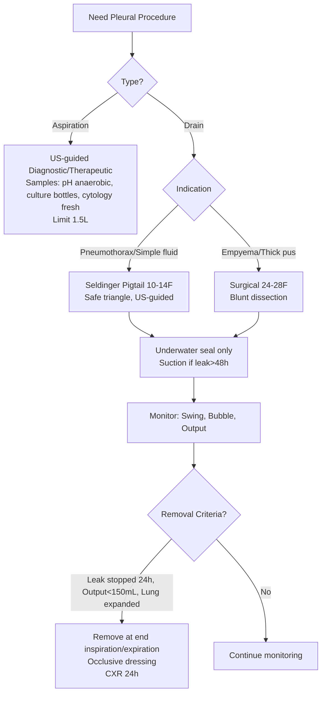

# Pleural Aspiration and Chest Drain Basics

Related: [[Transudate vs exudate framework]], [[Parapneumonic effusion]], [[Empyema and pleural infection]], [[Malignant pleural effusion]], [[Chylothorax]], [[Tension pneumothorax]], [[Primary spontaneous pneumothorax]], [[Secondary spontaneous pneumothorax]], [[Pleural fluid disorders]]

> [!important]
> **Pleural procedures** are core Skills for FCPS/MRCP. **US-guidance is mandatory** for aspiration and drain insertion (reduces complications). **Safe triangle** (4th–5th ICS, anterior to midaxillary line) is the **standard site** for drains. **Underwater seal** without suction initially. **Small-bore pigtail (10–14F)** preferred for air/simple fluid; **large-bore (24–28F)** for thick pus/empyema. Key FCPS/MRCP: **anatomy landmarks**, **indications/contraindications**, **complications** (organ injury, re-expansion oedema), **re-expansion oedema prevention**, **drain management** (swing, bubble, clamp trial NOT needed).

## Learning Objectives
- Identify **surface anatomy landmarks** for safe pleural procedures
- Perform **US-guided diagnostic/therapeutic aspiration** with correct sample handling
- Insert **chest drain** (Seldinger pigtail and surgical) using **safe triangle**
- Manage **drain postoperatively** (underwater seal, swing, bubble, suction indications)
- Recognise and prevent **complications** (re-expansion oedema, organ injury, infection)
- Apply **BTS guidelines** for drain size selection and management
- Differentiate **aspiration vs drain** indications for pneumothorax vs effusion

## Core Anatomy
### 1. Surface Landmarks (Critical for Safety)
| Structure | Landmark | Clinical Relevance |
|-----------|----------|-------------------|
| **2nd ICS** | **Sternal angle (angle of Louis)** → move laterally | **Needle decompression** (tension pneumothorax) |
| **4th–5th ICS** | **Nipple line** (male) / **Inframammary fold** (female) | **Chest drain site** (safe triangle) |
| **6th ICS** | **Xiphisternum** | Lower limit of pleural reflection |
| **Midclavicular line (MCL)** | Mid-clavicle | Traditional needle site |
| **Anterior axillary line (AAL)** | Anterior axillary fold | Preferred drain site |
| **Midaxillary line (MAL)** | Apex of axilla | Alternative drain site |

### 2. Safe Triangle (BTS Standard for Drain Insertion)
| Border | Structure |
|--------|-----------|
| **Anterior** | Lateral edge of **pectoralis major** |
| **Posterior** | Lateral edge of **latissimus dorsi** |
| **Base (inferior)** | **5th ICS** (nipple line in males) |
| **Apex** | **Axilla** |
| **Site** | **4th–5th ICS, anterior to midaxillary line** (within triangle) |

> **Why safe triangle?** Avoids breast tissue, internal mammary artery, thoracic duct (left), liver/spleen (low), heart (medial). **Muscle layers thin** here.

### 3. Pleural Recesses (Depths for Aspiration/Drain)
| Recess | Depth (supine) | Clinical Note |
|--------|----------------|---------------|
| **Costodiaphragmatic** | 5–10 cm (largest) | **Primary target** for aspiration/drain |
| **Costomediastinal** | 2–3 cm | Anterior, small |
| **Vertebromediastinal** | Posterior, small | Paravertebral collections |

### 4. Neurovascular Bundle
- Runs **inferior border of each rib** (vein, artery, nerve)
- **Insert needle JUST ABOVE the rib** (avoid bundle)
- **Rib spacing**: ~2–2.5 cm in adults

## Indications
### Pleural Aspiration (Diagnostic ± Therapeutic)
| Indication | Details |
|------------|---------|
| **New undiagnosed effusion** | >10 mm on lateral decubitus CXR / US |
| **Suspected parapneumonic/empyema** | pH, glucose, LDH, culture |
| **Suspected malignancy** | Cytology (send 50–100 mL fresh) |
| **Suspected TB** | ADA, lymphocyte count, culture |
| **Therapeutic relief** | Large effusion causing dyspnoea (limit 1–1.5 L/session) |
| **Chylothorax / Pseudochylothorax** | TG, cholesterol, lipoprotein electrophoresis |
| **Haemothorax** | Haematocrit vs peripheral blood |

### Chest Drain Insertion
| Indication | Details |
|------------|---------|
| **Pneumothorax** | Large (>2 cm rim), symptomatic, tension (after needle), failed aspiration, bilateral |
| **Effusion** | Complicated parapneumonic (pH <7.2), empyema, large malignant (for pleurodesis), haemothorax >500 mL |
| **Empyema** | Frank pus, positive Gram/culture |
| **Chylothorax** | High-output >500 mL/day, failed conservative |
| **Post-operative** | Prophylactic (cardiothoracic), air leak >5–7 days |

## Contraindications
### Absolute (Relative in Emergency)
- **Uncorrected coagulopathy** (INR >1.5, platelets <50) — **correct if possible, but don't delay life-saving drain**
- **Skin infection at site** — choose alternative site
- **No pleural fluid/air on imaging** — don't insert blindly

### Relative
- **Anticoagulation** (therapeutic) — hold/reverse if elective; proceed if urgent
- **Small loculated collection** — may need US/CT-guided drain, not free-hand
- **Severe respiratory compromise** — intubate first if needed
- **Previous pleurodesis / trapped lung** — lung won't expand, drain may not help

## Equipment
### Diagnostic Aspiration
- **US machine** (linear probe 5–10 MHz)
- **Chlorhexidine 2%**, sterile drapes, gloves
- **Local anaesthetic**: 1% lidocaine 10–20 mL
- **Needle**: 21G (diagnostic) or 16–18G (therapeutic) × 9–12 cm
- **Syringe**: 50 mL (three-way tap if therapeutic)
- **Sample bottles**: Plain (protein, LDH, glucose, pH), EDTA (cell count), blood culture bottles (aerobic + anaerobic for culture), cytology pot (50–100 mL fresh)

### Chest Drain — Seldinger (Pigtail) — PREFERRED for Air/Simple Fluid
| Component | Specification |
|-----------|---------------|
| **Guidewire** | J-tip, 0.035" / 0.038", 70–100 cm |
| **Introducer needle** | 18G × 7 cm (echogenic preferred) |
| **Dilator** | Single tapered (for ≤14F) or serial |
| **Pigtail catheter** | **10–14F** (10F air, 12–14F fluid), side holes, curl tip |
| **Connection** | Three-way tap → underwater seal (bottle or digital) |

### Chest Drain — Surgical (Blunt Dissection) — For Thick Pus/Empyema
| Component | Specification |
|-----------|---------------|
| **Scalpel** | No. 11 (incision) |
| **Artery forceps** | Curved (blunt dissection) |
| **Tube** | **24–28F** (straight, trocar or non-trocar) |
| **Sutures** | 1/0 silk (purse-string + mattress) |
| **Connection** | Underwater seal bottle |

## Procedures
### 1. US-Guided Diagnostic Aspiration
```mermaid
flowchart TD
    A[Patient sitting, leaning forward on pillow] --> B[US: Identify fluid, measure depth, mark skin\nAvoid lung, diaphragm, heart, vessels]
    B --> C[Prep: Chlorhexidine, drape, sterile gloves]
    C --> D[Anaesthetise: 1% lidocaine\nSkin → muscle → parietal pleura\nAspirate air/fluid = confirms depth]
    D --> E[Insert needle under US guidance\nAspirate fluid]
    E --> F{Diagnostic only?}
    F -- YES --> G[Send samples: pH (ABG syringe, anaerobic!), protein, LDH, glucose, cell count, Gram, culture (blood bottles), cytology]
    F -- NO (Therapeutic) --> H[Attach 3-way tap + 50mL syringe\nAspirate up to 1.5L\nStop if pain/cough/resistance]
    G --> I[Post-procedure CXR if >1L removed or symptoms]
    H --> I
```

**Key Technical Points:**
- **pH sample**: **Heparinised blood gas syringe**, **anaerobic** (no air bubbles), **on ice**, **analyse <1 hour**
- **Culture**: **Inoculate blood culture bottles** (aerobic + anaerobic) bedside — ↑ yield 20–30%
- **Cytology**: **50–100 mL fresh** (not formalin), send promptly
- **Limit**: **1–1.5 L per session** (prevent re-expansion pulmonary oedema)

### 2. Chest Drain — Seldinger Pigtail (US-Guided)
```mermaid
flowchart TD
    A[US: Confirm fluid/air, choose largest pocket,\nmark skin at 4th-5th ICS safe triangle] --> B[Prep: Chlorhexidine, drape, local anaesthetic\nSkin → parietal pleura (aspirate confirms)]
    B --> C[18G introducer needle under US\nAspirate fluid/air = pleural entry]
    C --> D[Guidewire (J-tip) advance 15-20 cm\nConfirm smooth passage]
    D --> E[Dilator over wire (single for ≤14F)]
    E --> F[Pigtail catheter (10-14F) over wire\nCurl tip in pleural space]
    F --> G[Remove wire, connect to underwater seal\nSecure with suture/statlock, dressing]
    G --> H[Post-procedure CXR: position, re-expansion]
```

### 3. Chest Drain — Surgical (Blunt Dissection) — Empyema/Thick Pus
```mermaid
flowchart TD
    A[Site: 4th-5th ICS safe triangle\nMark, prep, anaesthetise deeply] --> B[Incision: 2 cm horizontal over 5th rib\n(along superior border of 6th rib)]
    B --> C[Blunt dissection: Artery forceps through\nmuscle layers → puncture parietal pleura]
    C --> D[Finger sweep: confirm pleural entry,\nclear adhesions, direct posteriorly/superiorly]
    D --> E[Insert tube (24-28F) with clamp/forceps\nDirect posteriorly and superiorly]
    E --> F[Confirm: Fogging, swing, air/fluid return]
    F --> G[Suture: Purse-string + mattress\nConnect to underwater seal, secure]
    G --> H[Post-procedure CXR]
```

## Post-Procedure Drain Management
### Underwater Seal System
| Component | Function |
|-----------|----------|
| **Collection chamber** | Collects drainage |
| **Water seal** | **One-way valve** — allows air/fluid OUT, prevents air IN |
| **Suction control** | Regulates negative pressure (if applied) |

### Monitoring (Hourly → 4-hourly)
| Parameter | Normal | Abnormal → Action |
|-----------|--------|-------------------|
| **Swing** (tidaling) | Yes (respiratory variation) | **No swing** = blocked, kinked, lung expanded, drain against pleura |
| **Bubble** (air leak) | Intermittent/continuous | **Continuous bubble** = persistent air leak; **No bubble** = leak sealed |
| **Drain output** | Decreasing | **Sudden increase** = haemorrhage, chyle; **Bright red blood >200 mL/h** = surgical |
| **Pain** | Manageable | Severe = malposition, infection, re-expansion oedema |

### Suction Indications
- **NOT routinely** applied initially
- **Apply if**: Persistent air leak >24–48h, incomplete lung re-expansion, large residual effusion
- **Pressure**: **-10 to -20 cmH2O** (gentle)
- **Monitor**: Increased pain, re-expansion oedema risk

### Drain Removal Criteria
1. **Air leak**: **Stopped for 24 hours** (no bubble on cough/Valsalva)
2. **Fluid output**: **<100–150 mL/day** (for effusions)
3. **Lung re-expanded**: **CXR confirms** full expansion
4. **No fever/sepsis**
5. **Clamp trial NOT required** (BTS: increases recurrence risk)

**Removal technique**: Remove at **end of inspiration** OR **end of expiration** (both acceptable), quick pull, immediate occlusive dressing.

## Complications
### Immediate
| Complication | Prevention | Management |
|--------------|------------|------------|
| **Organ injury** (lung, heart, liver, spleen, diaphragm) | **US-guidance**, safe triangle, avoid low insertion | Chest X-ray, surgery if major |
| **Bleeding** (intercostal artery, lung parenchyma) | Anaesthetise parietal pleura, avoid low insertion | Observe, transfuse, surgery if massive |
| **Pneumothorax** (drain insertion) | US guidance, aspiration confirms entry | Small: observe; Large: second drain |
| **Re-expansion pulmonary oedema** | **Limit drainage to 1–1.5 L initially**, clamp if chronic | Supportive, diuretics, NIV/intubation if severe |

### Delayed
| Complication | Presentation | Management |
|--------------|--------------|------------|
| **Empyema** (drain site) | Fever, purulent discharge, sepsis | Antibiotics, drain exchange, surgery |
| **Blockage/kinking** | No swing, no output | Flush with saline, alteplase if fibrin, replace |
| **Drain dislodgement** | Output stops, drain falls out | Replace if still indicated |
| **Subcutaneous emphysema** | Crepitus around site | Usually self-limiting, check drain position |
| **Tract metastasis** (IPC/malignant) | Nodule at site months later | Radiotherapy |

### Re-expansion Pulmonary Oedema (RPO)
- **Risk**: Chronic collapse >3–7 days + **rapid large-volume drainage** (>1.5 L)
- **Mechanism**: Surfactant depletion, capillary stress failure, reperfusion injury
- **Prevention**: **Drain 1–1.5 L max initially**, clamp, repeat in 4–6h if needed
- **Management**: O2, diuretics, NIV/intubation if severe, **do NOT re-insert drain immediately**

## Special Situations
### Pneumothorax Drain
- **Small-bore (10–14F pigtail)** for simple pneumothorax
- **Underwater seal ONLY** (no suction — increases air leak)
- **Large air leak** → consider suction -10 to -20 cmH2O after 24–48h
- **Tension**: Needle decompression **2nd ICS MCL** → then drain **5th ICS AAL/MAL**

### Empyema Drain
- **Thick pus** → **12–14F pigtail** (MIST2) or **24–28F surgical**
- **MIST2**: tPA 10mg + DNase 5mg BD ×3 days via drain (clamp 1h)
- **Large bore** if very thick, need for manual stripping

### Malignant Effusion (for Pleurodesis)
- **Confirm expandible lung** (post-drain CXR: lung to chest wall)
- **Drain output <100–150 mL/day** before talc
- **Talc 4g graded** in 50 mL slurry via drain, clamp 1–2h, rotate

### Haemothorax
- **>1.5 L initial** or **>200 mL/h for 2–4h** → **thoracotomy**
- **Autotransfusion** if fresh (<6h), filtered
- **Retained haemothorax** → fibrinolytics (tPA/DNase) or VATS

## Paediatric Considerations
- **Smaller catheters** (8–12F pigtail)
- **US-guidance essential** (thinner chest wall)
- **Analgesia/sedation** often needed (midazolam + ketamine or GA)
- **Safe triangle** same principles, smaller anatomy

## Quality Indicators (Audit Standards)
- **US-guidance rate**: >95%
- **Complication rate**: <5% (pneumothorax, bleeding, organ injury)
- **Re-expansion oedema**: <1%
- **Drain duration**: <5 days for simple pneumothorax/effusion
- **Pigtail vs surgical**: >80% pigtail for simple fluid/air
- **Sample adequacy**: pH analysed <1h, culture in blood bottles

## FCPS/MRCP High-Yield Points
1. **Safe triangle**: 4th–5th ICS, anterior to midaxillary line (pectoralis major → latissimus dorsi)
2. **Needle decompression (tension)**: **2nd ICS MCL**, 14–16G, ≥5 cm
3. **Chest drain site**: **5th ICS AAL/MAL** (safe triangle) — NOT 2nd ICS
4. **US-guidance mandatory** — reduces complications from 10–30% to <5%
5. **Pigtail 10–14F** for air/simple fluid; **24–28F surgical** for thick pus/empyema
5. **Underwater seal** only initially; suction only if persistent leak >24–48h
6. **Swing** = respiratory variation (patent); **Bubble** = air leak
7. **Re-expansion oedema prevention**: Limit to 1–1.5 L initially, clamp if chronic
7. **Clamp trial NOT needed** before removal (increases recurrence)
8. **pH sample**: Blood gas syringe, anaerobic, ice, <1h
9. **Culture**: Inoculate blood culture bottles at bedside
10. **Sample volumes**: Cytology 50–100 mL fresh; pH 2–3 mL in ABG syringe

## Common Viva Questions
1. Safe triangle boundaries and why use it
2. Needle decompression vs chest drain sites
3. Seldinger vs surgical drain technique
4. Underwater seal system components and function
5. Re-expansion pulmonary oedema prevention
6. pH sample handling
6. Drain removal criteria
7. Complications and management
8. Pigtail vs surgical drain indications

## Common Confusions / Exam Traps
- **Using 2nd ICS MCL for chest drain** — WRONG (needle decompression only)
- **Applying suction immediately** — WRONG (underwater seal first)
- **Clamp trial before removal** — WRONG (not needed, increases recurrence)
- **Draining >1.5 L rapidly from chronic effusion** — WRONG (re-expansion oedema)
- **Measuring pH in normal syringe** — WRONG (air exposure falsely ↑ pH)
- **Sending cytology in formalin** — WRONG (need fresh fluid)
- **Not using blood culture bottles for pleural culture** — ↓ yield
- **Inserting drain without US** — WRONG (mandatory per BTS)

## Mnemonics
- **SAFE TRIANGLE**: **S**ite 5th ICS, **A**nterior **P**ectoralis major, **F**ront **L**at dorsi, **E**xpand lung, **T**riangle **R**ight **I**ntercostal **A**rtery **N**erve **G**o **L**ateral **E**asy
- **NEEDLE DECOMPRESSION**: **N**eedle 14-16G, **E**xpose chest, **E**nter 2nd ICS MCL, **D**irectly above 3rd rib, **L**isten for hiss, **E**valuate improvement
- **DRAIN SITE**: **D**rain 5th ICS, **R**ight at **A**nterior **A**xillary **L**ine, **I**n **S**afe **T**riangle, **E**xpand lung
- **SWING BUBBLE**: **S**wing = patent (respiratory variation); **B**ubble = air leak (bubbling on expiration/cough)
- **RE-EXPANSION PREVENTION**: **L**imit 1-1.5L, **I**ntermittent clamping, **M**onitor for symptoms, **I**t's chronic (>3d) = high risk, **T**aper drainage rate
- **REMOVAL**: **R**emove at end of **I**nspiration OR **E**xpiration, **M**attress suture pull, **O**cclusive dressing, **V**erify no recurrence CXR 24h, **A**void clamp trial

## Mind Map
```mermaid
mindmap
  root((Pleural Procedures))
    Anatomy
      2nd ICS MCL = Needle decompression
      5th ICS AAL/MAL = Chest drain (Safe triangle)
      Safe triangle: Pectoralis → Latissimus, base 5th ICS
    Aspiration
      US-guided
      Samples: pH (ABG syringe, anaerobic!), culture (blood bottles), cytology (50-100mL fresh)
      Limit 1-1.5L/session
    Chest Drain
      Seldinger pigtail 10-14F (air/simple fluid)
      Surgical 24-28F (empyema/thick pus)
      Underwater seal (no suction initially)
    Monitoring
      Swing = patent
      Bubble = air leak
      Suction if leak >24-48h
    Removal
      Leak stopped 24h
      Output <150mL/day
      Lung expanded
      NO clamp trial
    Complications
      Re-expansion oedema (limit 1.5L)
      Organ injury (US guidance)
      Blockage (flush/alteplase)
```

## Flowchart


## Suggested Visuals / Image Notes
- Safe triangle surface anatomy
- Neurovascular bundle (avoid)
- Seldinger pigtail steps
- Surgical drain blunt dissection
- Underwater seal system diagram
- Swing/bubble monitoring
- Re-expansion oedema CXR

## Suggested Video References
- BTS pleural procedure videos
- US-guided aspiration technique
- Seldinger pigtail insertion
- Surgical chest drain (blunt dissection)
- Drain management and troubleshooting
- Re-expansion oedema prevention

## One-Page Revision Summary
- **Needle decompression (tension)**: 2nd ICS MCL, 14-16G
- **Chest drain**: 5th ICS AAL/MAL (Safe triangle: ant. pectoralis → post. latissimus, base 5th ICS)
- **US-guidance mandatory**
- **Pigtail 10-14F** (Seldinger) for air/simple fluid; **Surgical 24-28F** for empyema
- **Underwater seal only** initially; suction -10 to -20 if leak >24-48h
- **Swing** = patent; **Bubble** = air leak
- **Re-expansion oedema**: Limit 1–1.5L initially, clamp if chronic >3d
- **Removal**: Leak stopped 24h + output <150mL + lung expanded; NO clamp trial
- **pH sample**: ABG syringe, anaerobic, ice, <1h
- **Culture**: Blood bottles at bedside
- **Cytology**: 50–100mL fresh

## 24-Hour Recall Prompts
- Safe triangle boundaries
- Needle decompression vs drain sites
- Pigtail vs surgical indications
- Underwater seal components
- Re-expansion oedema prevention
- Drain removal criteria
- pH/culture/cytology sample handling

## 7-Day / 15-Day / 30-Day Revision Tracker
- [ ] Day 1 completed
- [ ] 24-hour recall completed
- [ ] Day 7 revision completed
- [ ] Day 15 revision completed
- [ ] Day 30 revision completed

## Must Know / Should Know / Nice to Know
### Must Know
- Safe triangle anatomy and boundaries
- Needle decompression (2nd ICS MCL) vs chest drain (5th ICS AAL/MAL) sites
- Pigtail (10–14F Seldinger) vs surgical (24–28F blunt) indications
- Underwater seal management (swing, bubble, suction indications)
- Re-expansion pulmonary oedema prevention
- Drain removal criteria (no clamp trial)
- Sample handling: pH (anaerobic), culture (blood bottles), cytology (fresh)

### Should Know
- MIST2 tPA/DNase administration via drain
- Talc slurry pleurodesis via drain
- Haemothorax management thresholds (>1.5L, >200mL/h)
- Paediatric drain size adjustments
- Organ injury patterns by insertion site

### Nice to Know
- Digital drainage systems (Thopaz, etc.)
- Autotransfusion for haemothorax
- IPC vs chest drain for malignant effusion
- Cost-effectiveness pigtail vs surgical
- Long-term outcomes of drain complications

## Self-Test Scorecard
- Understanding: /10
- Recall: /10
- MCQ Performance: /10
- SBA Performance: /10
- Viva Confidence: /10
- Total: /50

> [!tip]
> Interpretation: <35 = weak topic, 35-44 = acceptable but insecure, 45+ = strong exam-ready topic.

## Exam Answer Modes
### Long Answer Skeleton
- Surface anatomy (2nd ICS MCL, 5th ICS AAL/MAL, safe triangle)
- Aspiration technique (US-guided, samples, limits)
- Chest drain insertion (Seldinger pigtail vs surgical, step-by-step)
- Drain management (underwater seal, swing, bubble, suction)
- Complications (re-expansion oedema, organ injury, blockage, empyema)
- Removal criteria and technique
- Sample handling protocols
- Special situations (pneumothorax, empyema, malignant, haemothorax)

### Short Note Skeleton
- Anatomy landmarks box
- Aspiration checklist
- Drain insertion comparison (Seldinger vs surgical)
- Monitoring box (swing, bubble, suction)
- Removal box
- Sample handling box

### Viva One-Liners
- "Needle decompression: 2nd ICS MCL, 14-16G; Chest drain: 5th ICS AAL/MAL in safe triangle"
- "Safe triangle: anterior pectoralis major, posterior latissimus dorsi, base 5th ICS"
- "Pigtail 10-14F Seldinger for air/simple fluid; Surgical 24-28F for thick pus/empyema"
- "Underwater seal only initially; suction only if persistent leak >24-48h"
- "Swing = respiratory variation (patent); Bubble = air leak"
- "Re-expansion oedema: limit 1-1.5L initially, clamp if chronic >3d"
- "Removal: leak stopped 24h + output <150mL + lung expanded; NO clamp trial"
- "pH: blood gas syringe, anaerobic, ice, <1h; Culture: blood bottles; Cytology: 50-100mL fresh"
- "Tension PTX: needle 2nd ICS MCL → then drain 5th ICS AAL"
- "Empyema drain: 12-14F for MIST2 or 24-28F surgical; MIST2 tPA+DNase BD×3d"

### Ward-Case Discussion Points
- 60M post-CABG, R effusion 800mL, US-guided 12F pigtail inserted, output 400mL/day day 3 → continue drain, consider talc if malignant, remove when <150mL
- 25M tension PTX post-stab, BP 80/50, trachea deviated, absent L breath sounds → immediate 14G needle 2nd ICS MCL L → hiss → 14F pigtail 5th ICS AAL L
- 50F empyema, thick pus, 28F surgical drain, day 2 incomplete drainage → MIST2 tPA/DNase BD×3d via drain, clamp 1h
- 70M chronic effusion 2 weeks, therapeutic aspiration 1.5L → sudden cough, hypoxia, frothy sputum → re-expansion oedema → NIV, diuretics, NO further drainage

### Last-Night-Before-Exam Sheet
- Needle: 2nd ICS MCL, 14-16G
- Drain: 5th ICS AAL/MAL (Safe triangle)
- Pigtail 10-14F (Seldinger) air/simple; Surgical 24-28F empyema
- UW seal only; Suction if leak>48h
- Swing=patent, Bubble=leak
- Re-expansion: 1.5L limit, clamp chronic
- Removal: leak stop 24h, out<150, lung up, NO clamp trial
- pH: ABG syringe, anaerobic, ice, <1h
- Culture: blood bottles
- Cytology: 50-100mL fresh

## Summary
**Pleural procedures** are core Skills. **Surface anatomy**: **Needle decompression (tension)** = **2nd ICS MCL**; **Chest drain** = **5th ICS AAL/MAL** in **safe triangle** (anterior pectoralis major → posterior latissimus dorsi, base 5th ICS). **US-guidance mandatory**. **Aspiration**: diagnostic + therapeutic (limit 1.5 L/session). **Samples**: **pH** (blood gas syringe, anaerobic, ice, <1h), **culture** (blood bottles at bedside), **cytology** (50–100 mL fresh). **Drain insertion**: **Seldinger pigtail 10–14F** (air/simple fluid) or **surgical 24–28F** (thick pus/empyema). **Management**: **underwater seal** only initially; **suction -10 to -20 cmH2O** only if persistent leak >24–48h. **Monitoring**: **swing** = patent, **bubble** = air leak. **Re-expansion oedema prevention**: limit 1–1.5 L initially, clamp if chronic >3 days. **Removal**: air leak stopped 24h + output <150 mL/day + lung expanded on CXR; **NO clamp trial**. **Complications**: re-expansion oedema, organ injury, blockage, empyema, tract metastasis.

## MCQs (10)
1. **Safe triangle** for chest drain insertion — anterior border:
   A. Latissimus dorsi
   B. **Pectoralis major**
   C. Serratus anterior
   D. External oblique

2. **Needle decompression** for tension pneumothorax — correct site:
   A. 5th ICS AAL
   B. **2nd ICS MCL**
   C. 4th ICS MAL
   D. 6th ICS MCL

3. **Chest drain** for simple pneumothorax — preferred size and technique:
   A. 28F surgical
   B. **10–14F pigtail (Seldinger)**
   C. 24F surgical
   D. 32F surgical

4. **Underwater seal** — "swing" indicates:
   A. Air leak
   B. **Patent drain (respiratory variation)**
   C. Blocked drain
   D. Correct position

5. **Re-expansion pulmonary oedema** prevention — maximum initial drainage:
   A. 500 mL
   B. **1–1.5 L**
   C. 2 L
   D. No limit

6. **Chest drain removal** — clamp trial:
   A. Required for 6 hours before removal
   B. Required for 24 hours before removal
   C. **NOT required (increases recurrence risk)**
   D. Only if air leak was present

7. **Pleural fluid pH** sample handling:
   A. Plain syringe, room temp, analyse <6h
   B. **Heparinised blood gas syringe, anaerobic, on ice, analyse <1h**
   C. EDTA tube, refrigerate, analyse <24h
   D. Heparinised syringe, room temp, analyse <4h

8. **Pleural fluid culture** — maximum yield:
   A. Syringe to lab in plain container
   B. **Inoculate blood culture bottles (aerobic + anaerobic) at bedside**
   C. Formalin-fixed sample
   D. Cytology pot

9. **Suction** on chest drain — when to apply:
   A. Immediately on insertion
   B. **Only if persistent air leak >24–48h or incomplete re-expansion**
   C. Always for pneumothorax
   D. Only for effusions

10. **Seldinger pigtail** vs **Surgical drain** — indication for surgical:
    A. Simple pneumothorax
    B. **Thick pus / empyema**
    C. Malignant effusion for pleurodesis
    D. Small parapneumonic effusion

## SBA Questions (10)
1. A 65M post-oesophagectomy, day 3, R drain output 1.2L milky fluid/day (chylothorax). Drain size for high-output chylothorax?
   A. 10F pigtail
   B. **12–14F pigtail (or 24F surgical if very high)**
   C. 28F surgical
   D. 8F pigtail

2. A 30M tension pneumothorax post-stabbing. Immediate management before CXR?
   A. CXR then chest drain
   B. **Needle decompression 2nd ICS MCL L side → then chest drain 5th ICS AAL**
   C. Chest drain 5th ICS AAL immediately
   D. Pericardiocentesis

3. A 50F with malignant pleural effusion, expandible lung, undergoing talc pleurodesis via drain. When to instil talc?
   A. Immediately after drain insertion
   B. **When drain output <100–150 mL/day and lung fully expanded on CXR**
   C. After 24 hours regardless of output
   D. Only if patient asymptomatic

4. A patient with chest drain has continuous bubbling in the water seal chamber on coughing. This indicates:
   A. Drain blocked
   B. **Persistent air leak**
   C. Lung fully expanded
   D. Drain in subcutaneous tissue

5. Re-expansion pulmonary oedema risk highest when:
   A. Draining 500 mL from acute effusion
   B. **Draining 2 L rapidly from chronic effusion (>1 week)**
   C. Applying suction -5 cmH2O
   D. Removing drain at end-expiration

6. A 70M with large L effusion, US-guided 12F pigtail inserted. Day 2: no swing, output 50 mL. Likely cause?
   A. Lung fully expanded
   B. **Drain blocked/kinked or against pleura**
   C. Pleural fluid loculated
   D. Drain in subcutaneous tissue

7. Pleural fluid for cytology — optimal sample:
   A. 10 mL in formalin
   B. **50–100 mL fresh (no fixative)**
   C. 20 mL in EDTA
   D. 5 mL in heparin

8. MIST2 intrapleural tPA/DNase protocol:
   A. tPA 10mg alone BD ×3d
   B. DNase 5mg alone BD ×3d
   C. **tPA 10mg + DNase 5mg BD ×3d, clamp 1h after each dose**
   D. Streptokinase 250,000 IU BD ×3d

9. Chest drain for empyema — which size is used in MIST2 trial?
   A. 28F surgical
   B. **12–14F pigtail**
   C. 24F surgical
   D. 32F surgical

10. Indications for **surgical (blunt dissection) chest drain** over Seldinger pigtail:
    A. Simple pneumothorax
    B. **Thick pus / empyema**
    C. Malignant effusion for pleurodesis
    D. Chylothorax

## Flashcards
- Q: Safe triangle boundaries
  A: Ant pectoralis, Post latissimus, Base 5th ICS
- Q: Needle decompression site
  A: 2nd ICS MCL, 14-16G
- Q: Drain site
  A: 5th ICS AAL/MAL (safe triangle)
- Q: Pigtail vs Surgical
  A: Pigtail 10-14F air/simple fluid; Surgical 24-28F thick pus/empyema
- Q: UW seal management
  A: No suction initially; suction if leak>48h
- Q: Swing vs Bubble
  A: Swing=patent, Bubble=air leak
- Q: Re-expansion oedema
  A: Limit 1-1.5L, clamp chronic
- Q: Removal criteria
  A: Leak stop 24h, out<150mL, lung expanded, NO clamp trial
- Q: pH sample
  A: ABG syringe, anaerobic, ice, <1h
- Q: Culture
  A: Blood bottles at bedside
- Q: Cytology
  A: 50-100mL fresh
- Q: MIST2
  A: tPA10+DNase5 BDx3d clamp1h

## Answer Key with Explanations
### MCQs
1. **B** — Safe triangle anterior border = lateral edge of pectoralis major.
2. **B** — Needle decompression = 2nd ICS MCL (current ATLS/BTS).
3. **B** — Small-bore pigtail (10-14F) preferred for simple pneumothorax/fluid.
4. **B** — Swing = respiratory variation = patent drain.
5. **B** — Limit initial drainage to 1–1.5 L to prevent re-expansion oedema.
6. **C** — Clamp trial NOT required before removal (BTS).
7. **B** — pH must be in heparinised blood gas syringe, anaerobic, on ice, analysed <1h.
8. **B** — Blood culture bottles at bedside increase yield 20-30%.
9. **B** — Suction only if persistent leak >24-48h or incomplete re-expansion.
10. **B** — Thick pus/empyema requires larger bore (24-28F surgical) or 12-14F for MIST2.

### SBAs
1. **B** — High-output chylothorax → 12-14F pigtail adequate; 28F if very thick.
2. **B** — Tension PTX = immediate needle 2nd ICS MCL affected side → then drain 5th ICS AAL.
3. **B** — Talc pleurodesis: lung expanded + output <100-150 mL/day.
4. **B** — Continuous bubbling on cough = persistent air leak.
5. **B** — Chronic effusion + rapid large-volume drainage = highest RPO risk.
6. **B** — No swing + low output = drain blocked/kinked or against pleura.
7. **B** — Cytology needs 50-100 mL fresh fluid (no formalin).
8. **C** — MIST2: tPA 10mg + DNase 5mg BD ×3d, clamp 1h.
9. **B** — MIST2 used 12-14F pigtail drains.
10. **B** — Thick pus/empyema = surgical drain (or 12-14F for MIST2).

### Flashcards
All correct as written.

---
