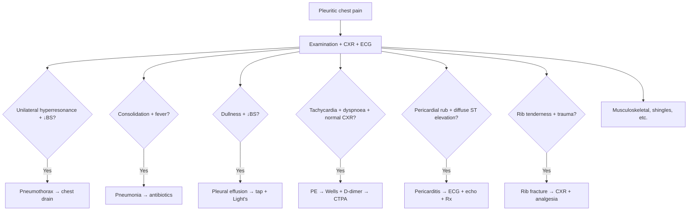

# Pleuritic chest pain approach

> [!important]
> **Pleuritic chest pain** is sharp, well-localised pain that worsens with **inspiration, coughing, and movement**. Common causes: **PE, pneumothorax, pneumonia (pleurisy), pericarditis, pleural effusion, rib fracture, malignancy**. Always exclude **PE and PTX** in acute pleuritic pain.

Related: [[Pulmonary Embolism]], [[Pneumothorax]], [[Pneumonia]], [[Pleural Effusion]], [[Acute severe breathlessness approach]]

> [!tip] **FCPS/MRCP pearl**: **Pleuritic pain + dyspnoea + tachycardia = PE until proven otherwise**. **Pleuritic pain + unilateral hyperresonance + ↓BS = PTX**. **Pleuritic + fever + consolidation = pneumonia with pleurisy**. Always consider **pericarditis** (relief on leaning forward, diffuse ST elevation, pericardial rub).

## Definition

**Pleuritic chest pain** = sharp, well-localised pain that **worsens with inspiration, coughing, and movement** due to parietal pleural irritation.

### Characteristics
- **Sharp, stabbing**
- Worse with **deep inspiration, cough, movement, lying on affected side**
- Better with **breath-holding, lying on unaffected side**
- **Reproducible** on palpation
- Localised to a specific dermatome

## Aetiology

### Pleural causes (most common)
| Cause | Notes |
|-------|-------|
| **Pneumonia with pleurisy** | Fever, cough, consolidation |
| **Pulmonary embolism** | Pleuritic + dyspnoea + tachycardia (small infarct) |
| **Pneumothorax** | Sudden, unilateral, dyspnoea |
| **Pleural effusion** | Dullness, ↓BS |
| **Malignant pleural disease** | Mesothelioma, metastatic, weight loss |
| **Pleural infection (empyema)** | Fever, effusion |
| **Asbestos-related pleurisy** | Benign, exposure history |
| **Dressler syndrome** | Post-MI, autoimmune |
| **Connective tissue disease** | RA, SLE |

### Non-pleural causes
| Cause | Notes |
|-------|-------|
| **Pericarditis** | Relief leaning forward, pericardial rub, ST elevation |
| **Rib fracture** | Trauma, focal tenderness, crepitus |
| **Musculoskeletal** | Reproducible, often positional |
| **Chest wall (shingles)** | Dermatomal, vesicular rash |
| **Costochondritis (Tietze)** | Reproducible, swelling |
| **Cervical radiculopathy** | Dermatomal, with movement |
| **Aortic dissection** | Tearing, interscapular, BP differential |
| **MI (atypical)** | Pressure, central, radiation |
| **PE** (also pleuritic) | Pleuritic + tachycardia |

## Pathophysiology

### Pleural anatomy
- **Visceral pleura**: no pain (autonomic innervation)
- **Parietal pleura**: **rich somatic innervation** → pain
- **Diaphragmatic pleura**: phrenic nerve (C3–C5) → referred to shoulder

### Mechanism of pleuritic pain
- **Inflammation** of parietal pleura
- **Stretching** during respiration
- **Friction** between inflamed surfaces
- **Cough** triggers pain

## Clinical Features

### Symptoms
- **Sharp, well-localised pain** (often unilateral)
- Worse with **breath, cough, sneeze, movement**
- Relief with **shallow breathing, breath-holding, lying on unaffected side**
- May be associated with **dyspnoea** (especially PE, PTX)
- ± **fever** (pneumonia, empyema)
- ± **cough, sputum** (pneumonia)
- ± **haemoptysis** (PE, cancer)
- ± **pleural rub** (audible/feelable)

### Signs
- **Pleural rub** (creaking, leathery)
- **Focal tenderness** (reproducible)
- **Dullness** (effusion)
- **↓Breath sounds** (effusion, PTX)
- **Hyperresonance** (PTX)
- **Consolidation** (pneumonia)
- **Tachycardia, tachypnoea**
- **Cyanosis** (severe)

## Diagnosis

### Investigations
| Test | Purpose |
|------|---------|
| **CXR** (PA + lateral) | Pneumothorax, effusion, consolidation |
| **ECG** | Pericarditis, MI, RV strain (PE) |
| **ABG** | Hypoxaemia, A-a gradient (PE) |
| **D-dimer** (Wells) | PE rule-out |
| **Troponin** | MI, RV strain |
| **CTPA** | Suspected PE |
| **Pleural US** | Effusion (faster than CXR) |
| **Pleural tap** | Effusion → Light's criteria |
| **CT chest** | Lung cancer, mesothelioma, PE |

### Algorithm

## Management

### General
- **Treat underlying cause**
- **Analgesia**: paracetamol, NSAIDs (avoid masking)
- **Position**: sitting up, lean forward (pericarditis)
- **O₂** if hypoxaemic
- **Cough suppression** (if distressing)

### Specific
| Cause | Rx |
|-------|-----|
| **Pneumothorax** | Chest drain (or aspiration if small) |
| **PE** | Anticoagulation ± thrombolysis |
| **Pneumonia with pleurisy** | Antibiotics + analgesia |
| **Pleural effusion** | Treat cause; therapeutic tap if large |
| **Malignant** | Oncology, palliative, drain + pleurodesis |
| **Pericarditis** | NSAIDs + colchicine |
| **Rib fracture** | Analgesia (NSAIDs, opioids, nerve block), chest physiotherapy |
| **Musculoskeletal** | Analgesia, heat, physiotherapy |
| **Shingles** | Antivirals (acyclovir) + analgesia |

## FCPS/MRCP High-Yield Summary

| Domain | Key points |
|--------|------------|
| **Definition** | Sharp, worse with inspiration/cough/movement |
| **Most concerning** | PE, PTX |
| **Pneumonia + pleurisy** | Common |
| **Pericarditis** | Relief leaning forward, pericardial rub |
| **Rib fracture** | Trauma, focal tenderness |
| **First steps** | CXR + ECG + Wells + ABG |
| **Pleural rub** | Audible leathery sound |
| **Treatment** | Cause + analgesia (NSAIDs) |

## MCQs (10)

1. The most common cause of pleuritic chest pain is:
   A. PE
   B. **Pneumonia with pleurisy**
   C. PTX
   D. None
   E. MI
   **Answer: B** — Pneumonia.

2. Pleuritic pain is sharp and:
   A. Worse at rest
   B. **Worse with inspiration/cough/movement**
   C. Constant
   D. Dull
   E. None
   **Answer: B** — Worse with movement.

3. The most life-threatening cause of pleuritic pain:
   A. Pericarditis
   B. **PE**
   C. Pneumonia
   D. Musculoskeletal
   E. None
   **Answer: B** — PE.

4. A pleural rub sounds like:
   A. Snoring
   B. **Leathery/creaking**
   C. Wheeze
   D. None
   E. Clicking
   **Answer: B** — Leathery/creaking.

5. The most appropriate first investigation in pleuritic pain:
   A. CT
   B. **CXR + ECG**
   C. ABG
   D. None
   E. Echo
   **Answer: B** — CXR + ECG.

6. Pericarditis pain is relieved by:
   A. Lying flat
   B. **Sitting up and leaning forward**
   C. Exercise
   D. None
   E. Eating
   **Answer: B** — Sitting/leaning forward.

7. Pericarditis ECG shows:
   A. ST depression
   B. **Diffuse ST elevation (concave) + PR depression**
   C. Q waves
   D. Tall R V1
   E. None
   **Answer: B** — Diffuse ST elevation.

8. Rib fracture management includes:
   A. Steroids
   B. **Analgesia (NSAIDs, opioids, nerve block) + chest physiotherapy**
   C. Antibiotics
   D. Surgery
   E. None
   **Answer: B** — Analgesia + physio.

9. The most important step in pleuritic chest pain is to:
   A. Prescribe NSAIDs
   B. **Exclude PE and PTX**
   C. X-ray only
   D. Wait
   E. None
   **Answer: B** — Exclude serious.

10. Pleuritic pain in a patient with cancer suggests:
    A. Muscle strain
    B. **Malignant pleural disease (mesothelioma, metastasis)**
    C. None
    D. PE
    E. Pneumonia
    **Answer: B** — Malignant.

## SBA Questions (10)

1. The first step in acute pleuritic chest pain is:
   A. NSAIDs
   B. **CXR + ECG + Wells for PE**
   C. CT
   D. Discharge
   E. None
   **Answer: B** — Imaging + ECG.

2. A 30-year-old with sudden pleuritic pain, unilateral hyperresonance. Diagnosis:
   A. PE
   B. **Pneumothorax**
   C. Pneumonia
   D. None
   E. Pericarditis
   **Answer: B** — PTX.

3. Pleuritic pain with fever and consolidation. Diagnosis:
   A. PE
   B. **Pneumonia with pleurisy**
   C. PTX
   D. None
   E. Pericarditis
   **Answer: B** — Pneumonia.

4. The treatment of pericarditis is:
   A. **NSAIDs + colchicine**
   B. Steroids alone
   C. Antibiotics
   D. Surgery
   E. None
   **Answer: A** — NSAIDs + colchicine.

5. A 50-year-old with known cancer has new pleuritic pain. Most likely:
   A. Pneumonia
   B. **Malignant pleural disease**
   C. None
   D. PE
   E. Pericarditis
   **Answer: B** — Malignant.

6. The most important bedside sign of pleurisy is:
   A. Cyanosis
   B. **Pleural rub**
   C. Tachycardia
   D. None
   E. Wheeze
   **Answer: B** — Rub.

7. Pleuritic pain is described as:
   A. Dull, constant
   B. **Sharp, worse with movement**
   C. Burning
   D. None
   E. Cramping
   **Answer: B** — Sharp, worse with movement.

8. Diaphragmatic pleural pain is referred to:
   A. Chest
   B. **Shoulder (C3–C5 via phrenic)**
   C. Back
   D. None
   E. Abdomen
   **Answer: B** — Shoulder.

9. Pleuritic pain from PE typically arises from:
   A. Main pulmonary artery
   B. **Peripheral infarction of small subpleural vessels**
   C. Pleural effusion
   D. None
   E. Heart
   **Answer: B** — Peripheral infarction.

10. Pleuritic pain management includes:
    A. Steroids
    B. **NSAIDs (ibuprofen) + treat cause**
    C. Antibiotics
    D. Wait
    E. None
    **Answer: B** — NSAIDs + cause.

## Flashcards

- **Q: Pleuritic pain definition?**
  A: Sharp, worse with inspiration/cough/movement.

- **Q: Most common cause?**
  A: Pneumonia with pleurisy.

- **Q: Most life-threatening?**
  A: PE.

- **Q: First step?**
  A: CXR + ECG + Wells.

- **Q: Pericarditis relief?**
  A: Sitting up + leaning forward.

- **Q: Pericarditis ECG?**
  A: Diffuse ST elevation + PR depression.

- **Q: Pleural rub sound?**
  A: Leathery/creaking.

- **Q: Diaphragmatic pleurisy referred to?**
  A: Shoulder (C3–C5).

- **Q: Rib fracture Rx?**
  A: Analgesia + physio.

- **Q: Malignant pleuritic pain?**
  A: Mesothelioma, metastasis.

## Answer Key with Explanations

### MCQs
1. **B**  2. **B**  3. **B**  4. **B**  5. **B**  6. **B**  7. **B**  8. **B**  9. **B**  10. **B**

### SBAs
1. **B**  2. **B**  3. **B**  4. **A**  5. **B**  6. **B**  7. **B**  8. **B**  9. **B**  10. **B**

## Summary

Pleuritic chest pain = sharp, worse with inspiration/cough/movement. Most common: pneumonia. Most concerning: PE, PTX. First step: CXR + ECG + Wells for PE. Pericarditis: relief leaning forward, diffuse ST elevation. Treatment: cause + analgesia (NSAIDs).

## Local Navigation
- **Parent Heading**: [[../Symptom Approach to Respiratory Disease|Symptom Approach to Respiratory Disease]]
- **Parent Topic Group**: [[../Symptom Approach to Respiratory Disease/Common respiratory presentations|Common respiratory presentations]]
- **Chapter Map**: [[../Davidson Chapter 17 - Respiratory Medicine Hierarchy|Respiratory Medicine Hierarchy]]
- **Chapter MOC**: [[../Respiratory MOC|Respiratory MOC]]
- **Related**: [[Pulmonary Embolism]] · [[Pneumothorax]] · [[Pneumonia]] · [[Pleural Effusion]]