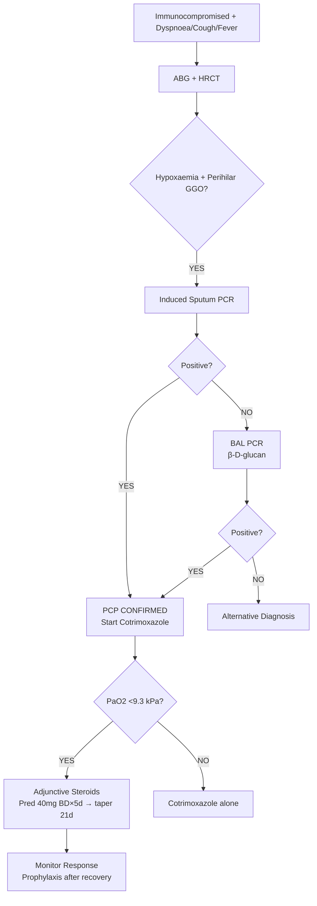

# Pneumocystis jirovecii Pneumonia (PCP)

Related: [[HIV]], [[Opportunistic pulmonary infections]], [[Atypical pneumonia]], [[Immunocompromised host]], [[ARDS]], [[ABG Interpretation]], [[Indications for intubation in respiratory disease]], [[Cotrimoxazole]], [[Dapsone]], [[Pentamidine]]

> [!important]
> **PCP** = **opportunistic fungal pneumonia** caused by **Pneumocystis jirovecii** (formerly P. carinii). **Classic in HIV/AIDS (CD4 <200)**, also in **iatrogenic immunosuppression** (steroids, chemo, transplant, biologics). **Key FCPS/MRCP**: **Subacute dyspnoea, dry cough, fever**, **hypoxaemia out of proportion to CXR**, **bilateral perihilar ground-glass on HRCT**, **induced sputum/BAL for PCR/GMS stain**, **cotrimoxazole 1st line**, **adjunctive steroids if PaO2 <9.3 kPa (70 mmHg)**, **prophylaxis if CD4 <200**.

## Learning Objectives
- Recognise **classic clinical presentation** in HIV and non-HIV immunosuppressed hosts
- Apply **diagnostic algorithm** (clinical + HRCT + induced sputum/BAL PCR + β-D-glucan)
- Interpret **HRCT** (bilateral perihilar ground-glass, sparing apices/bases, cysts in chronic)
- Initiate **treatment** (cotrimoxazole 1st line, alternatives for intolerance)
- Apply **adjunctive steroid criteria** (PaO2 <9.3 kPa or A-a gradient >35 mmHg)
- Manage **prophylaxis** (indications, agents, discontinuation)
- Differentiate from **other pneumonias** (TB, bacterial, viral, fungal, PJP IRIS)

## Definition
**Pneumocystis jirovecii pneumonia (PCP)** = **opportunistic pneumonia** caused by the **fungus Pneumocystis jirovecii** (obligate extracellular pulmonary pathogen). **Affects immunocompromised hosts**: HIV (CD4 <200), **steroids** (>20mg prednisolone ×4 weeks), **chemotherapy**, **transplant**, **biologics** (anti-TNF, rituximab), **primary immunodeficiency**.

> **FCPS/MRCP tip**: **Non-HIV PCP** often **more acute, severe, higher mortality** than HIV-PCP. **Steroids are the #1 risk factor in non-HIV**.

## Core Anatomy / Pathophysiology
### Pneumocystis jirovecii
- **Fungus** (formerly classified as protozoan), **obligate extracellular pulmonary pathogen**
- **Life cycle**: Trophic forms → cysts (5–8 µm) → release trophic forms
- **Transmission**: Airborne, person-to-person (asymptomatic carriers)
- **Attachment**: Type I pneumocytes → **surfactant depletion** → alveolar collapse

### Immune Evasion / Pathogenesis
1. **CD4+ T-cell depletion** → loss of macrophage activation (IFN-γ, TNF-α)
2. **Impaired phagocytosis** → uncontrolled replication in alveoli
3. **Foamy exudate** (trophic forms, cysts, surfactant proteins) fills alveoli
4. **Type I pneumocyte injury** → surfactant dysfunction → atelectasis
5. **Inflammatory response** → **β-D-glucan release** (diagnostic marker)
6. **Non-HIV**: More intense inflammation → **worse hypoxaemia, faster progression**

## Clinical Features
### HIV-Associated PCP (Classic)
- **Subacute onset** (days–weeks)
- **Progressive dyspnoea** (exertional → rest)
- **Dry, non-productive cough**
- **Low-grade fever**
- **Weight loss**, night sweats
- **Chest discomfort** (vague)
- **CD4 <200** (often <100), **high viral load**
- **Often on no prophylaxis** or failed adhesion

### Non-HIV PCP (Iatrogenic Immunosuppression)
- **Acute, fulminant onset** (hours–days)
- **High fever**, severe dyspnoea, **rapid progression to ARDS**
- **Higher mortality** (30–50% vs 10–20% HIV)
- **Risk factors**: **Steroids >20mg pred ×4 weeks**, chemo, transplant, biologics, rheumatology
- **CXR may be normal early** (but HRCT shows GGO)

### Examination
- **Tachypnoea**, tachycardia
- **Bibasal fine crackles** (often late)
- **Cyanosis** (severe hypoxaemia)
- **Normal or reduced breath sounds**
- **No focal signs** (unlike bacterial pneumonia)
- **Oral thrush** (concurrent candidiasis clue in HIV)

## Investigations
### 1. ABG / Oxygenation (KEY)
| Parameter | Typical PCP |
|-----------|-------------|
| **PaO2** | **Markedly reduced** (<8 kPa / 60 mmHg) |
| **A-a gradient** | **Markedly elevated** (>35 mmHg) |
| **pH** | Respiratory alkalosis (early), then respiratory acidosis (late) |
| **SpO2** | **Hypoxaemia out of proportion to CXR findings** |

> **FCPS/MRCP tip**: **Hypoxaemia disproportionate to CXR** = classic PCP clue. **A-a gradient >35 mmHg = adjunctive steroids indicated**.

### 2. HRCT (Gold Standard Imaging)
| Finding | Description |
|---------|-------------|
| **Bilateral perihilar ground-glass opacity** | **Classic** — "bat's wings" but **perihilar**, sparing apices and bases |
| **Upper lobe sparing** | Early disease often spares apices |
| **Cysts** | Thin-walled, multiple (chronic/infected), **pneumatoceles** |
| **Pneumothorax** | **Increased risk** (cyst rupture), especially non-HIV |
| **No consolidation** | Unless bacterial co-infection |
| **No significant lymphadenopathy** | Unless lymphoma co-infection |
| **Normal in 10–15%** | Especially early/non-HIV |

### 3. Microbiological Diagnosis (Definitive)
| Sample | Method | Sensitivity |
|--------|--------|-------------|
| **Induced sputum** (hypertonic saline) | **PCR (real-time)** | 80–90% (HIV), 50–70% (non-HIV) |
| | **GMS stain (Gomori methenamine silver)** | 60–80% |
| | **Immunofluorescence (DFA)** | 70–90% |
| **Bronchoalveolar lavage (BAL)** | **PCR** | **>95%** (gold standard) |
| | **GMS / DFA / Toluidine blue O** | 90–95% |
| **Serum β-D-glucan** | **Fungitell assay** | **95% sensitivity**, 80% specificity (supportive) |

> **FCPS/MRCP tip**: **Induced sputum PCR = first-line non-invasive**. **BAL PCR = gold standard if sputum negative**. **β-D-glucan = supportive, not diagnostic** (false + in other fungi, bacteraemia, haemodialysis).

### 4. HIV / Immunological Workup
- **HIV test** (4th gen Ag/Ab) if unknown status
- **CD4 count**, **viral load** (if HIV+)
- **Immunoglobulins**, **lymphocyte subsets** (if non-HIV immunosuppressed)
- **Drug history** (steroids, chemo, biologics, transplant drugs)

### 5. Exclusion of Co-infections
- **Sputum culture** (bacterial, AFB, fungal)
- **Blood cultures** (×2)
- **Legionella / Pneumococcal urinary antigen**
- **Viral PCR panel** (influenza, RSV, COVID, CMV)
- **CMV PCR** (if transplant/immunosuppressed)

## Interpretation Frameworks
### 1. Diagnostic Probability Algorithm
```
Immunocompromised host + subacute dyspnoea + fever + dry cough
    ↓
ABG: Marked hypoxaemia, ↑ A-a gradient
HRCT: Bilateral perihilar GGO (classic)
    ↓
Induced sputum PCR (first-line)
    ↓
Positive → PCP CONFIRMED
Negative → BAL PCR (gold standard)
    ↓
β-D-glucan positive (supportive)
```

### 2. Adjunctive Steroid Indication (Critical)
| Parameter | Threshold | Action |
|-----------|-----------|--------|
| **PaO2** | **<9.3 kPa (70 mmHg) on room air** | **GIVE STEROIDS** |
| **A-a gradient** | **>35 mmHg (4.7 kPa)** | **GIVE STEROIDS** |
| **SpO2** | **<92% on room air** | Consider steroids |

> **Evidence**: Steroids reduce mortality and intubation in moderate-severe PCP (PaO2 <70 mmHg). **Start WITHIN 72h of antibiotics**.

### 3. Severity Assessment
| Severity | Criteria | Management |
|----------|----------|------------|
| **Mild** | PaO2 ≥9.3 kPa, ambulatory | Oral cotrimoxazole, outpatient possible |
| **Moderate** | PaO2 <9.3 kPa, not ventilated | IV cotrimoxazole + **adjunctive steroids**, admit |
| **Severe** | Mechanical ventilation / ICU | IV cotrimoxazole + steroids, ICU |

## Diagnosis
**Confirmed**: Positive PCR/GMS/DFA on induced sputum **OR** BAL
**Probable**: Clinical + HRCT + β-D-glucan + exclusion of alternatives (no microbiological confirmation)
**Clinical diagnosis**: In resource-limited settings, treat empirically if high probability

## Differential Diagnosis
| Condition | Differentiating Features |
|-----------|-------------------------|
| **Bacterial pneumonia** | Acute, productive cough, focal consolidation, neutrophilia, responds to antibiotics |
| **TB** | Subacute/chronic, night sweats, weight loss, upper lobe, cavitation, AFB+ |
| **Viral pneumonia** (influenza, COVID, CMV) | Viral PCR positive, variable CXR, often + fever/myalgia |
| **Fungal** (Aspergillus, Cryptococcus) | Immunocompromised, nodules/cavities, galactomannan/antigen +ve |
| **PCP-IRIS** | Worsening 2–8 weeks post-ART, paradoxical, neutrophilic BAL |
| **PJP drug reaction** | Rash, fever, eosinophilia, temporal with cotrimoxazole |

## Management
### 1. First-Line Treatment: Cotrimoxazole (TMP-SMX)
| Route | Dose | Duration |
|-------|------|----------|
| **IV** (moderate-severe) | **TMP 15–20 mg/kg/day + SMX 75–100 mg/kg/day** in 3–4 divided doses | **21 days** |
| **PO** (mild, step-down) | **TMP 15–20 mg/kg/day + SMX 75–100 mg/kg/day** (2–3 divided doses) | **21 days** |

**Renal adjustment**: Reduce dose if CrCl <30 mL/min
**Folinic acid** (10–25 mg/day) — reduces haematological toxicity (optional, not standard in all guidelines)

### 2. Adjunctive Corticosteroids (CRITICAL for Moderate-Severe)
| Indication | Regimen |
|------------|---------|
| **PaO2 <9.3 kPa (70 mmHg)** OR **A-a gradient >35 mmHg** | **Prednisolone 40 mg BD ×5 days** → **40 mg OD ×5 days** → **20 mg OD ×11 days** (21 days total) |
| | **OR Methylprednisolone IV** 75% of oral dose if NPO |

**Timing**: **Start within 72h of cotrimoxazole** (ideally simultaneously)
**Mechanism**: Reduces inflammation-mediated lung injury

### 3. Alternative Regimens (Cotrimoxazole Intolerance/Allergy)
| Regimen | Dose | Duration | Notes |
|---------|------|----------|-------|
| **Dapsone 100 mg/day + TMP 15 mg/kg/day** | PO | 21 days | Alternative for mild-moderate sulfa allergy |
| **Clindamycin 600 mg IV/PO q6h + Primaquine 30 mg/day** | PO/IV | 21 days | G6PD test before primaquine |
| **Atovaquone 750 mg BD** | PO (with food) | 21 days | Mild-moderate only, expensive, ↓ absorption |
| **Pentamidine 4 mg/kg IV daily** | IV | 21 days | **Nephrotoxic**, pancreatic toxicity, hypotension, hypoglycaemia — **last resort** |

### 4. Prophylaxis (Primary & Secondary)
| Indication | Agent | Dose |
|------------|-------|------|
| **HIV: CD4 <200** or **oropharyngeal candidiasis** or **AIDS-defining illness** | **Cotrimoxazole 960 mg daily** (or 480 mg daily) | Lifelong until CD4 >200 ×3–6 months on ART |
| **HIV: Cotrimoxazole allergy** | **Dapsone 50 mg daily** (or 100 mg 3x/week) | Same |
| | **Atovaquone 1500 mg daily** | |
| | **Aerosolised pentamidine 300 mg monthly** | Nebulised |
| **Non-HIV immunosuppression** (steroids >20mg ×4w, chemo, transplant, biologics) | **Cotrimoxazole 960 mg 3x/week** (or daily) | Duration of immunosuppression |
| **Post-transplant** (solid organ/HSCT) | **Cotrimoxazole 960 mg daily** | 6–12 months (lung/HSCT longer) |

### 5. Discontinuation of Prophylaxis (HIV)
| Criteria | Action |
|----------|--------|
| **CD4 >200 for ≥3–6 months** on **effective ART** (viral load suppressed) | **STOP prophylaxis** |
| **CD4 100–200** with **viral suppression** | Consider stopping (case-by-case) |
| **Treatment failure / viral rebound** | **RESTART prophylaxis** |

### 6. Secondary Prophylaxis (After PCP Treatment)
- **Continue prophylaxis** indefinitely (CD4 <200) or until CD4 >200 ×3–6 months on ART

## Drug Interactions / Contraindications / Cautions
### Cotrimoxazole
- **Sulfa allergy**: **Desensitisation** if mild; alternatives if severe
- **Bone marrow suppression** (monitor FBC weekly ×2, then weekly)
- **Hyperkalaemia** (monitor K+, especially with ACEi/ARB, potassium-sparing diuretics)
- **Renal impairment** (dose adjust, monitor creatinine)
- **Hepatotoxicity** (monitor LFTs)
- **Pregnancy**: Avoid 1st trimester (folate antagonism); if needed, add folinic acid
- **G6PD deficiency** (risk of haemolysis — test if possible)

### Dapsone
- **Haemolysis** (G6PD deficiency — **test before starting**)
- **Methaemoglobinaemia** (monitor if symptomatic)
- **Sulfa cross-allergy** possible

### Pentamidine
- **Nephrotoxicity** (monitor creatinine daily)
- **Pancreatitis**, **hypoglycaemia** (monitor glucose)
- **Hypotension** (IV infusion over 1–2h, monitor BP)
- **QT prolongation** (ECG monitoring)

### Steroids
- **Hyperglycaemia** (monitor glucose, adjust insulin)
- **Infection risk** (already immunocompromised)
- **GI bleed** (PPI prophylaxis)

## Procedures
### Induced Sputum
1. **Nebulised hypertonic saline** (3–5%) ×15–20 min
2. **Chest physiotherapy** (percussion, postural drainage)
3. **Collect specimen** in sterile container
4. **Send for PCR, GMS, DFA, culture**

### Bronchoscopy + BAL
1. **Conscious sedation** (midazolam ± fentanyl)
2. **Topical lidocaine** (airway anaesthesia)
3. **BAL**: 100–200 mL saline instilled, aspirated in aliquots
4. **Send for PCR, GMS, DFA, culture, cytology, CD4/CD8**

## Complications
### PCP-Specific
- **Pneumothorax** (cyst rupture, higher in non-HIV, on mechanical ventilation)
- **ARDS** (severe PCP, non-HIV higher risk)
- **Respiratory failure** (requiring intubation)
- **Pulmonary hypertension** (chronic)
- **IRIS** (HIV: 2–8 weeks post-ART, paradoxical worsening)

### Treatment-Related
- **Cotrimoxazole**: Rash, Stevens-Johnson/TEN, bone marrow suppression, hyperkalaemia, renal failure, hepatitis
- **Dapsone**: Haemolysis (G6PD), methaemoglobinaemia
- **Pentamidine**: Nephrotoxicity, pancreatitis, hypoglycaemia, hypotension
- **Steroids**: Hyperglycaemia, infection, GI bleed, myopathy

## Red Flags / Emergencies
- **Rapid deterioration** (SpO2 dropping, rising RR, confusion) → ICU, NIV/intubation
- **Pneumothorax** (sudden pleuritic pain, hypotension, absent breath sounds) → needle decompression → chest drain
- **Massive haemoptysis** (rare) → BAE
- **Stevens-Johnson/TEN** (cotrimoxazole) → STOP drug, ICU, supportive
- **Severe methaemoglobinaemia** (dapsone) → methylene blue

## Special Situations
### PCP Immune Reconstitution Inflammatory Syndrome (PCP-IRIS)
- **Timing**: 2–8 weeks after **ART initiation** in HIV
- **Features**: Worsening dyspnoea, fever, new/worsening infiltrates, neutrophilic BAL
- **Management**: **Continue ART**, **add steroids** (pred 1 mg/kg), continue cotrimoxazole
- **Diagnosis of exclusion** (exclude recurrence, new infection)

### Non-HIV PCP (Steroids, Transplant, Chemo, Biologics)
- **More severe**, faster progression, **higher mortality**
- **HRCT may show consolidate + GGO** (less typical)
- **β-D-glucan very helpful** (high sensitivity)
- **Treat aggressively**: IV cotrimoxazole + **early steroids** + ICU if needed
- **Prophylaxis critical** for at-risk groups

### Pregnancy
- **Cotrimoxazole**: Avoid 1st trimester (use atovaquone or dapsone+TMP if urgent)
- **Steroids**: Prednisolone safe
- **Pentamidine**: Avoid (teratogenic)
- **Prophylaxis**: Continue if indicated

## Prognosis
| Group | Mortality (Treated) | Key Prognostic Factors |
|-------|---------------------|------------------------|
| **HIV-PCP** | **10–20%** (mild) → **30–50%** (ventilated) | PaO2 on presentation, APACHE II, age, prior PCP |
| **Non-HIV PCP** | **30–50%** (overall) → **50–80%** (ventilated) | Steroid dose, underlying disease, time to treatment |
| **With steroids (moderate-severe)** | **Reduced mortality** (NNT ~10) | Early initiation (<72h) critical |

## Topic Correlation
- [[HIV]] — primary risk group
- [[Opportunistic pulmonary infections]] — broader context
- [[Atypical pneumonia]] — differential
- [[ARDS]] — severe complication
- [[Indications for intubation in respiratory disease]] — escalation
- [[Immunocompromised host]] — broader context

## FCPS/MRCP High-Yield Points
1. **PCP** = opportunistic fungal pneumonia (P. jirovecii) in immunocompromised
2. **Classic HIV**: CD4 <200, subacute dyspnoea, dry cough, fever, **hypoxaemia out of proportion to CXR**
3. **Non-HIV**: Steroids >20mg ×4w, chemo, transplant, biologics — **more acute, severe, higher mortality**
4. **HRCT**: **Bilateral perihilar ground-glass** (classic), upper lobe sparing, cysts, pneumothorax risk
5. **Diagnosis**: **Induced sputum PCR** (1st line), **BAL PCR** (gold standard), **β-D-glucan** (supportive)
5. **Treatment**: **Cotrimoxazole 1st line** (TMP 15–20 mg/kg + SMX 75–100 mg/kg IV/PO ×21 days)
6. **Adjunctive steroids** if **PaO2 <9.3 kPa (70 mmHg) or A-a gradient >35 mmHg** (pred 40mg BD×5d → taper 21d)
6. **Prophylaxis**: HIV CD4 <200 → cotrimoxazole 960mg daily; non-HIV immunosuppression → cotrimoxazole 3x/week
7. **Alternatives**: Dapsone+TMP, clindamycin+primaquine, atovaquone, pentamidine (last resort)
8. **PCP-IRIS**: Worsening 2–8 weeks post-ART → steroids + continue ART/cotrimoxazole
9. **Non-HIV PCP**: More severe, higher mortality, steroids #1 risk factor

## Common Viva Questions
1. Clinical features of PCP in HIV vs non-HIV
2. HRCT findings and differential
3. Diagnostic tests (induced sputum PCR, BAL, β-D-glucan)
4. Cotrimoxazole dosing (IV/PO, duration, renal adjust)
5. Adjunctive steroid criteria and regimen
6. Prophylaxis indications and agents (HIV vs non-HIV)
7. Alternative regimens for sulfa allergy
8. PCP-IRIS definition and management

## Common Confusions / Exam Traps
- **Prophylaxis CD4 threshold** = **<200** (not <100)
- **Steroids indicated for PaO2 <9.3 kPa (70 mmHg)** — not for all PCP
- **Duration of treatment** = **21 days** (not 14)
- **Steroids must start within 72h** of antibiotics (not after)
- **Non-HIV PCP** = **more severe, higher mortality**, steroids #1 risk factor
- **β-D-glucan** = supportive, **not diagnostic** (false + in other fungi)
- **Pentamidine** = **last resort** (nephrotoxic, pancreatic toxicity)
- **Discontinue prophylaxis** when CD4 >200 ×3–6 months on ART (not just CD4 >200)
- **PCP-IRIS** = worsens after ART, NOT treatment failure

## Mnemonics
- **PCP CLASSIC**: **P**neumocystis **J**irovecii, **C**D4 <200, **L**ung (GGO perihilar), **A**rterial gas (hypoxaemia), **S**teroids if PaO2<70, **S**MX/TMP 1st line, **I**nduced sputum PCR, **C**otrimoxazole prophylaxis CD4<200
- **PCP STEROIDS**: **P**aO2 <9.3 kPa (70 mmHg) → **S**teroids **W**ithin 72h → **R**educes mortality
- **PCP PROPHYLAXIS**: **C**D4 <200 → **C**otrimoxazole 960mg daily → **D**iscontinue when CD4 >200 ×3-6mo on ART
- **NON-HIV PCP**: **S**teroids >20mg ×4w = **#1 risk** → **M**ore severe, **H**igher mortality
- **PCP DIAGNOSIS**: **I**nduced sputum **P**CR (1st) → **B**AL **P**CR (gold) → **β**-D-glucan (supportive)

## Mind Map
```mermaid
mindmap
  root((PCP))
    Host
      HIV: CD4 <200
      Non-HIV: Steroids (>20mg×4w), chemo, transplant, biologics
    Clinical
      Subacute dyspnoea, dry cough, fever
      Hypoxaemia >> CXR findings
    HRCT
      Bilateral perihilar GGO
      Upper lobe sparing
      Cysts, pneumothorax risk
    Diagnosis
      Induced sputum PCR (1st line)
      BAL PCR (gold standard)
      β-D-glucan (supportive)
    Treatment
      Cotrimoxazole 1st line (21 days)
      Steroids if PaO2 <9.3 kPa
      Alternatives: Dapsone/TMP, Clinda/Prima, Atovaquone, Pentamidine
    Prophylaxis
      HIV CD4 <200: Cotrimoxazole daily
      Non-HIV immunosuppressed: Cotrimoxazole 3x/week
    Complications
      Pneumothorax, ARDS, IRIS
```

## Flowchart


## Suggested Visuals / Image Notes
- HRCT: Bilateral perihilar GGO, upper lobe sparing, cysts
- Induced sputum technique
- BAL cellularity (foamy macrophages, cysts)
- β-D-glucan assay
- Steroid taper schedule
- PCP-IRIS timeline

## Suggested Video References
- BTS PCP Guidelines
- IDSA/ATS PCP Guidelines
- Induced sputum technique
- BAL for PCP
- PCP-IRIS case discussion
- Non-HIV PCP management

## One-Page Revision Summary
- **PCP** = P. jirovecii pneumonia in immunocompromised
- **HIV**: CD4 <200, subacute, hypoxaemia >> CXR
- **Non-HIV**: Steroids >20mg×4w, acute, severe, higher mortality
- **HRCT**: Bilateral perihilar GGO, upper lobe sparing, cysts
- **Diagnosis**: Induced sputum PCR (1st), BAL PCR (gold), β-D-glucan supportive
- **Treatment**: Cotrimoxazole TMP 15-20mg/kg + SMX 75-100mg/kg IV/PO ×21d
- **Steroids**: PaO2 <9.3 kPa (70 mmHg) or A-a >35 mmHg → Pred 40mg BD×5d → taper 21d
- **Prophylaxis**: HIV CD4<200 → cotrimoxazole 960mg daily; Non-HIV immunosuppressed → cotrimoxazole 3x/week
- **Alternatives**: Dapsone+TMP, Clindamycin+Primaquine, Atovaquone, Pentamidine (last)
- **PCP-IRIS**: Worsening 2-8w post-ART → steroids + continue ART/cotrimoxazole

## 24-Hour Recall Prompts
- HIV PCP classic triad + CD4 threshold
- HRCT classic findings (3 features)
- Induced sputum vs BAL PCR sensitivity
- Steroid indication (PaO2 threshold)
- Cotrimoxazole dose (TMP/SMX mg/kg)
- Prophylaxis CD4 threshold
- Non-HIV risk factors
- PCP-IRIS timing

## 7-Day / 15-Day / 30-Day Revision Tracker
- [ ] Day 1 completed
- [ ] 24-hour recall completed
- [ ] Day 7 revision completed
- [ ] Day 15 revision completed
- [ ] Day 30 revision completed

## Must Know / Should Know / Nice to Know
### Must Know
- PCP definition, risk groups (HIV CD4<200, steroids, immunosuppression)
- Clinical presentation (hypoxaemia disproportionate to CXR)
- HRCT: perihilar GGO, upper lobe sparing
- Induced sputum PCR (1st), BAL PCR (gold), β-D-glucan supportive
- Cotrimoxazole dosing (TMP 15-20 + SMX 75-100 mg/kg ×21d)
- Steroids if PaO2 <9.3 kPa (70 mmHg) or A-a >35 mmHg
- Prophylaxis: HIV CD4<200, non-HIV immunosuppressed
- Alternatives for sulfa allergy

### Should Know
- PCP-IRIS definition and management
- Non-HIV PCP differences (more severe, steroid risk factor)
- β-D-glucan limitations
- Pregnancy considerations
- Cotrimoxazole desensitisation
- Discontinuation of prophylaxis criteria

### Nice to Know
- PCP pathophysiology (surfactant depletion)
- Cyst formation and pneumothorax risk
- Long-term outcomes (chronic pulmonary hypertension)
- Cost-effectiveness of prophylaxis
- Novel diagnostics (NGS, METAGENOMICS)
- Geographic epidemiology

## Self-Test Scorecard
- Understanding: /10
- Recall: /10
- MCQ Performance: /10
- SBA Performance: /10
- Viva Confidence: /10
- Total: /50

> [!tip]
> Interpretation: <35 = weak topic, 35-44 = acceptable but insecure, 45+ = strong exam-ready topic.

## Exam Answer Modes
### Long Answer Skeleton
- Definition, epidemiology, risk groups (HIV vs non-HIV)
- Clinical features (classic HIV, non-HIV differences)
- Pathophysiology (surfactant depletion, CD4 depletion)
- HRCT and CXR findings
- Diagnostic algorithm (induced sputum PCR → BAL PCR → β-D-glucan)
- Treatment (cotrimoxazole dosing, alternatives, steroids criteria/regimen)
- Prophylaxis (indications, agents, discontinuation)
- Complications (pneumothorax, ARDS, IRIS)
- Differential diagnosis table

### Short Note Skeleton
- Definition + risk groups box
- HRCT findings box
- Diagnostic algorithm flowchart
- Treatment table (cotrimoxazole, steroids, alternatives)
- Prophylaxis table
- Differential diagnosis table

### Viva One-Liners
- "PCP = P. jirovecii pneumonia in immunocompromised; classic HIV CD4<200"
- "Clinical: Subacute dyspnoea, dry cough, fever, **hypoxaemia >> CXR findings**"
- "HRCT: **Bilateral perihilar GGO**, upper lobe sparing, cysts, pneumothorax risk"
- "Diagnosis: Induced sputum PCR (1st line), BAL PCR (gold), β-D-glucan supportive"
- "Cotrimoxazole: TMP 15-20 + SMX 75-100 mg/kg IV/PO ×21 days"
- "Steroids: **PaO2 <9.3 kPa (70 mmHg) or A-a >35 mmHg** → Pred 40mg BD×5d → taper 21d"
- "Prophylaxis: HIV CD4<200 → cotrimoxazole 960mg daily; Non-HIV immunosuppressed → 3x/week"
- "Alternatives: Dapsone+TMP, Clindamycin+Primaquine, Atovaquone, Pentamidine (last resort)"
- "Non-HIV PCP: Steroids >20mg×4w = #1 risk; more acute, severe, higher mortality"
- "PCP-IRIS: Worsening 2-8w post-ART → steroids + continue ART/cotrimoxazole"
- "β-D-glucan: 95% sens, 80% spec — supportive only (false + in other fungi)"

### Ward-Case Discussion Points
- 30M HIV+ (CD4 50), 2-week dyspnoea, fever, SpO2 88% RA, CXR bilateral perihilar GGO → induced sputum PCR+ → cotrimoxazole IV + prednisolone 40mg BD (PaO2 8.5 kPa)
- 55F on prednisolone 30mg for vasculitis (6 weeks), acute dyspnoea, fever, SpO2 82% RA, HRCT diffuse GGO → BAL PCR+ → cotrimoxazole IV + steroids (already on) + ICU
- 40M HIV+ on ART 4 weeks (CD4 180→350), worsening dyspnoea, new GGO on HRCT, neutrophilic BAL → PCP-IRIS → add prednisolone 1mg/kg, continue ART/cotrimoxazole

### Last-Night-Before-Exam Sheet
- PCP = Immunocompromised + P. jirovecii
- HIV: CD4<200; Non-HIV: Steroids >20mg×4w
- Clinical: Subacute dyspnoea, dry cough, fever, Hypoxaemia >> CXR
- HRCT: Bilateral perihilar GGO, upper lobe sparing, cysts
- Dx: Induced sputum PCR (1st), BAL PCR (gold), β-D-glucan supportive
- Tx: Cotrimoxazole TMP 15-20 + SMX 75-100 mg/kg ×21d
- Steroids: PaO2<9.3kPa or A-a>35mmHg → Pred 40mg BD×5d taper 21d
- Prophylaxis: HIV CD4<200 daily; Non-HIV immunosuppressed 3x/week
- Alts: Dapsone+TMP, Clinda+Prima, Atovaquone, Pentamidine (last)
- Non-HIV: More severe, steroid risk, higher mortality

## Summary
**Pneumocystis jirovecii pneumonia (PCP)** = **opportunistic fungal pneumonia** in **immunocompromised** hosts. **HIV**: CD4 <200, subacute dyspnoea, dry cough, fever, **hypoxaemia disproportionate to CXR**. **Non-HIV**: **steroids >20mg ×4 weeks** = #1 risk, **more acute, severe, higher mortality (30–50%)**. **HRCT hallmark**: **bilateral perihilar ground-glass opacity**, upper lobe sparing, cysts, pneumothorax risk. **Diagnosis**: **induced sputum PCR** (1st line), **BAL PCR** (gold standard), **β-D-glucan** (supportive). **Treatment**: **cotrimoxazole** (TMP 15–20 + SMX 75–100 mg/kg IV/PO ×21 days) **1st line**; alternatives for sulfa allergy. **Adjunctive steroids** if **PaO2 <9.3 kPa (70 mmHg) or A-a gradient >35 mmHg** (prednisolone 40mg BD ×5d → taper over 21 days). **Prophylaxis**: **HIV CD4 <200** → cotrimoxazole 960mg daily; **non-HIV immunosuppressed** → cotrimoxazole 960mg 3x/week. **PCP-IRIS**: paradoxical worsening 2–8 weeks post-ART → steroids + continue ART/cotrimoxazole.

## MCQs (10)
1. **Classic HRCT finding** in PCP:
   A. Upper lobe cavitation
   B. **Bilateral perihilar ground-glass opacity**
   C. Lobar consolidation
   D. Pleural effusion

2. **Adjunctive steroid indication** in PCP:
   A. All PCP cases
   B. **PaO2 <9.3 kPa (70 mmHg) or A-a gradient >35 mmHg**
   C. Only if mechanically ventilated
   D. Only HIV-PCP

3. **Cotrimoxazole treatment duration** for PCP:
   A. 7 days
   B. 14 days
   C. **21 days**
   D. 28 days

4. **Primary PCP prophylaxis** in HIV — CD4 threshold:
   A. <50
   B. <100
   C. **<200**
   D. <350

5. **Non-HIV PCP** — most common risk factor:
   A. Chemotherapy
   B. **Corticosteroids >20mg prednisolone ×4 weeks**
   C. Biologics
   D. Transplant

6. **Gold standard diagnostic test** for PCP:
   A. Induced sputum PCR
   B. **BAL PCR**
   C. Serum β-D-glucan
   D. CXR

7. **Serum β-D-glucan** in PCP:
   A. Diagnostic
   B. **Supportive (95% sens, 80% spec)**
   C. Not useful
   D. Specific for P. jirovecii

8. **Adjunctive steroid regimen** for moderate-severe PCP:
   A. Dexamethasone 8mg BD ×7d
   B. **Prednisolone 40mg BD ×5d → 40mg OD ×5d → 20mg OD ×11d (21d total)**
   C. Hydrocortisone 100mg IV TDS ×5d
   D. Methylprednisolone 1g IV daily ×3d

9. **Primary PCP prophylaxis** in non-HIV immunocompromised:
   A. Cotrimoxazole daily
   B. **Cotrimoxazole 960mg 3x/week**
   C. Dapsone daily
   D. Atovaquone daily

10. **PCP-IRIS** timing:
    A. Within 48h of ART
    B. **2–8 weeks post-ART initiation**
    C. 3–6 months post-ART
    D. Only after CD4 >200

## SBA Questions (10)
1. A 30M HIV+ (CD4 80), not on ART/prophylaxis, 2-week dyspnoea, fever, dry cough. SpO2 89% RA. CXR: bilateral perihilar GGO. ABG: PaO2 8.5 kPa. Induced sputum PCR+. Best management?
   A. Oral cotrimoxazole alone
   B. **IV cotrimoxazole + prednisolone 40mg BD (PaO2 <9.3 kPa)**
   C. IV pentamidine
   D. Observation

2. A 55F on prednisolone 30mg for SLE (8 weeks), acute dyspnoea, fever, SpO2 82% RA. HRCT: diffuse GGO. BAL PCR+. Best management?
   A. Oral cotrimoxazole
   B. **IV cotrimoxazole + continue steroids + ICU referral**
   C. IV pentamidine
   D. Atovaquone

3. A 40M HIV+ on ART 4 weeks (CD4 180→350, VL suppressed), worsening dyspnoea, new GGO on HRCT. BAL: neutrophilia, PCR+. Diagnosis?
   A. PCP treatment failure
   B. **PCP-IRIS (paradoxical worsening post-ART)**
   C. Bacterial superinfection
   D. CMV pneumonia

4. PCP prophylaxis in HIV — when to discontinue?
   A. CD4 >100
   B. CD4 >200
   C. **CD4 >200 for ≥3–6 months on effective ART (VL suppressed)**
   D. Never

5. Alternative for cotrimoxazole allergy (mild-moderate PCP):
   A. Pentamidine 1st line
   B. **Dapsone 100mg + TMP 15mg/kg/day**
   C. Atovaquone only if severe
   D. Clindamycin alone

6. Adjunctive steroids in PCP — evidence-based threshold:
   A. PaO2 <8 kPa
   B. **PaO2 <9.3 kPa (70 mmHg) or A-a gradient >35 mmHg**
   C. SpO2 <90%
   D. FiO2 >0.4

7. Non-HIV PCP vs HIV-PCP — which statement is TRUE?
   A. Non-HIV has lower mortality
   B. **Non-HIV more acute, severe, higher mortality; steroids #1 risk factor**
   C. Non-HIV presents more subacutely
   D. Steroids not indicated in non-HIV

8. PCP treatment duration with cotrimoxazole:
   A. 10 days
   B. 14 days
   C. **21 days**
   D. 28 days

9. First-line diagnostic test for PCP:
   A. BAL PCR
   B. **Induced sputum PCR**
   C. Serum β-D-glucan
   D. CXR

10. Cotrimoxazole dose for PCP treatment (TMP component):
    A. 5–10 mg/kg/day
    B. **15–20 mg/kg/day**
    C. 25–30 mg/kg/day
    D. 30–40 mg/kg/day

## Flashcards
- Q: PCP classic HRCT
  A: Bilateral perihilar GGO, upper lobe sparing
- Q: PCP steroid indication
  A: PaO2 <9.3 kPa (70 mmHg) or A-a >35 mmHg
- Q: Cotrimoxazole dose
  A: TMP 15-20 + SMX 75-100 mg/kg ×21d
- Q: 1st line diagnostic
  A: Induced sputum PCR
- Q: Gold standard
  A: BAL PCR
- Q: β-D-glucan
  A: Supportive (95% sens, 80% spec)
- Q: Prophylaxis HIV
  A: CD4<200 → cotrimoxazole 960mg daily
- Q: Prophylaxis non-HIV
  A: Immunosuppressed → cotrimoxazole 3x/week
- Q: Alternatives
  A: Dapsone+TMP, Clinda+Prima, Atovaquone, Pentamidine (last)
- Q: Non-HIV PCP
  A: Steroids >20mg×4w = #1 risk, more severe
- Q: PCP-IRIS
  A: Worsening 2-8w post-ART → steroids + continue ART
- Q: Steroid regimen
  A: Pred 40mg BD×5d → 40mg OD×5d → 20mg OD×11d (21d total)

## Answer Key with Explanations
### MCQs
1. **B** — Classic PCP HRCT = bilateral perihilar ground-glass opacity.
2. **B** — Steroids indicated if PaO2 <9.3 kPa (70 mmHg) or A-a gradient >35 mmHg.
3. **C** — Standard treatment duration = 21 days.
4. **C** — HIV PCP prophylaxis threshold = CD4 <200.
5. **B** — Steroids >20mg prednisolone ×4 weeks = #1 non-HIV risk factor.
6. **B** — BAL PCR = gold standard (>95% sensitivity).
7. **B** — β-D-glucan supportive only (95% sens, 80% spec).
8. **B** — Standard steroid taper: 40mg BD×5d → 40mg OD×5d → 20mg OD×11d.
9. **B** — Non-HIV prophylaxis = cotrimoxazole 960mg 3x/week during immunosuppression.
10. **B** — PCP-IRIS typically 2–8 weeks post-ART initiation.

### SBAs
1. **B** — HIV PCP, PaO2 8.5 kPa (<9.3 kPa) → cotrimoxazole IV + adjunctive steroids.
2. **B** — Non-HIV PCP on steroids, severe hypoxaemia → IV cotrimoxazole + ICU (steroids already on board).
3. **B** — Worsening 4 weeks post-ART with neutrophilic BAL = PCP-IRIS.
4. **C** — Discontinue when CD4 >200 for ≥3–6 months on ART with viral suppression.
5. **B** — Dapsone + TMP = 1st alternative for mild-moderate sulfa allergy.
6. **B** — Evidence-based threshold: PaO2 <9.3 kPa or A-a gradient >35 mmHg.
7. **B** — Non-HIV PCP more acute, severe, higher mortality; steroids #1 risk factor.
8. **C** — Standard duration = 21 days.
9. **B** — Induced sputum PCR = first-line non-invasive diagnostic test.
10. **B** — TMP 15–20 mg/kg/day is standard cotrimoxazole dosing.

### Flashcards
All correct as written.

---
