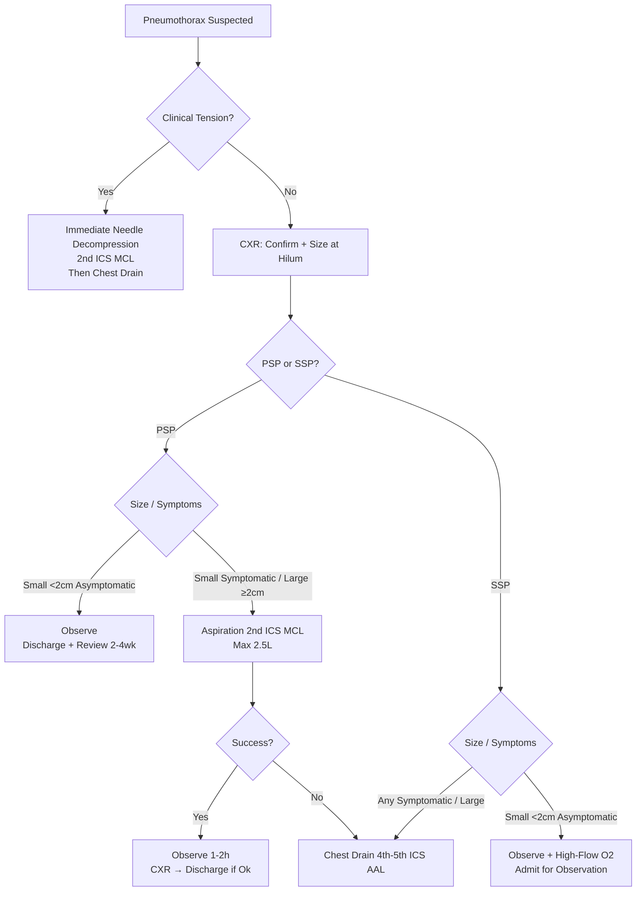

# Pneumothorax

Related: [[Pleural Diseases/Pneumothorax|Pneumothorax]], [[Pleural Diseases/Tension pneumothorax|Tension pneumothorax]], [[Airway Diseases/Other obstructive and small-airway disorders|Other obstructive and small-airway disorders]]

> [!important]
> **Pneumothorax** = air in pleural space. **Primary spontaneous (PSP)** = no underlying lung disease. **Secondary spontaneous (SSP)** = underlying lung disease (COPD, CF, PCD, LAM, malignancy). **Tension** = haemodynamic compromise (medical emergency). **Key FCPS/MRCP**: BTS size criteria, aspiration vs chest drain, recurrence rates, surgery indications, air travel advice.

## Learning Objectives
- Classify pneumothorax (PSP, SSP, tension, iatrogenic, traumatic)
- Apply BTS size criteria and management algorithm
- Perform needle aspiration and chest drain insertion (landmarks, technique)
- Recognise and treat tension pneumothorax immediately
- Advise on recurrence prevention, surgery, air travel

## Definitions & Classification
| Type | Definition |
|------|------------|
| **Primary Spontaneous (PSP)** | No known underlying lung disease; typically tall, thin young males (smokers) |
| **Secondary Spontaneous (SSP)** | Underlying lung disease present (COPD, CF, PCD, LAM, TB, malignancy, IPF) |
| **Tension Pneumothorax** | Progressive air accumulation → mediastinal shift → **haemodynamic compromise** (medical emergency) |
| **Iatrogenic** | Post-procedure (central line, biopsy, ventilation, CPR) |
| **Traumatic** | Penetrating/blunt chest trauma (rib fractures) |

## Aetiology & Risk Factors
| Type | Causes / Risk Factors |
|------|----------------------|
| **PSP** | Tall thin young male, **smoking** (↑ risk 20x), subpleural blebs (apical), familial (rare) |
| **SSP** | COPD (most common), CF, PCD, LAM, TB, malignancy, pneumonia, LIP, RA, Marfan, Ehlers-Danlos |
| **Tension** | One-way valve leak (ball-valve mechanism); positive pressure ventilation ↑ risk |
| **Iatrogenic** | Central venous catheter (subclavian/IJ), transthoracic biopsy, thoracentesis, CPR, mechanical ventilation |
| **Traumatic** | Rib fractures, penetrating injury, blast injury |

## Clinical Features

| Feature | PSP | SSP | Tension |
|---------|-----|-----|---------|
| **Age/Sex** | Young (20-30), male > female | Older (50-70), underlying lung disease | Any age |
| **Onset** | Sudden, at rest | Sudden, often on exertion | Sudden, rapid deterioration |
| **Dyspnoea** | Mild-moderate | **Severe** (baseline impairment) | **Severe, rapidly progressive** |
| **Pleuritic pain** | Common, ipsilateral | Common | May be absent (shock dominates) |
| **Tachycardia** | Mild | Moderate-severe | **Severe** (>130) |
| **Hypotension** | No | Possible | **Yes (shock)** |
| **Tracheal deviation** | No | Possible | **Yes (away from affected side)** |
| **JVP** | Normal | Elevated (if cor pulmonale) | **Elevated + distended** |
| **Breath sounds** | Reduced ipsilateral | Reduced/absent ipsilateral | **Absent** ipsilateral |
| **Percussion** | Hyperresonant | Hyperresonant | **Hyperresonant** |

## Investigations

### Chest X-Ray (Diagnostic Standard)
| Finding | Description |
|---------|-------------|
| **Visible pleural line** | Thin white line separating lung from pleural air; **no lung markings beyond** |
| **Size estimation** (BTS): measure at hilum (horizontal distance from lateral chest wall to lung edge) | **Small**: <2 cm; **Large**: ≥2 cm |
| **Expiratory CXR** | Increases sensitivity (air expands) |
| **Lateral decubitus** | If supine only (e.g., ICU); affected side up |

### CT Chest
- **Indicated**: uncertain diagnosis, complex loculated pneumothorax, underlying pathology suspected (LAM, malignancy)
- **Sensitivity**: >95% (detects small pneumothoraces)
- **Not routine** for uncomplicated PSP/SSP

### Ultrasound (Bedside, Point-of-Care)
- **Lung sliding** absent on affected side
- **Lung point** (transition sliding ↔ no sliding) = specific for pneumothorax
- **Seashore sign** (sliding = seashore; no sliding = stratosphere)
- **Sensitivity >95%**, faster than CXR in trauma

## Management Algorithm (BTS Guidelines)

### 1. Tension Pneumothorax — **Immediate Needle Decompression**
- **Clinical diagnosis** (do NOT wait for CXR)
- **Needle**: 14-16G cannula, **2nd intercostal space, midclavicular line** (or 4th-5th ICS anterior axillary line)
- **Follow immediately** with chest drain insertion

### 2. Primary Spontaneous Pneumothorax (PSP)

| Size / Clinical | Management |
|-----------------|------------|
| **Small (<2 cm)** + **asymptomatic** | **Observation** (discharge with advice, review 2-4 weeks) |
| **Small (<2 cm)** + **symptomatic** | **Aspiration** (14-16G, 2nd ICS MCL); if successful → observe; if fails → chest drain |
| **Large (≥2 cm)** | **Aspiration first attempt** (14-16G, 2nd ICS MCL); if successful → observe; if fails → chest drain |

> **Aspiration technique**: 14-16G cannula, 2nd ICS MCL, 3-way tap, 50ml syringe; aspirate up to 2.5L; stop if cough/resistance; repeat CXR

### 3. Secondary Spontaneous Pneumothorax (SSP)

| Size / Clinical | Management |
|-----------------|------------|
| **Any size** + **symptomatic** | **Chest drain** (aspiration less successful, higher recurrence) |
| **Small (<2 cm)** + **asymptomatic** | **Admit, observe**, high-flow O₂ (accelerates resorption); consider aspiration if ≥50 yrs |
| **Any size** + **breathless** | **Chest drain** (Seldinger 10-14Fr) |

> **SSP**: lower threshold for drainage; higher recurrence; underlying disease needs treatment

### 3. Chest Drain Insertion (Seldinger Technique)
| Step | Details |
|------|---------|
| **Site** | **4th-5th intercostal space, anterior to mid-axillary line** (safe triangle: bordered by latissimus dorsi, pectoralis major, 5th rib) |
| **Technique** | Seldinger (guidewire) preferred over open trocar |
| **Drain size** | 10-14Fr (small for air, larger for fluid) |
| **Connection** | Underwater seal (bottle) or digital drainage system; **no suction initially** |
| **Suction** | Only if persistent air leak >48h; -10 to -20 cmH₂O |
| **Secure** | Suture + adhesive dressing; chest X-ray post-insertion |

### 4. Tension Pneumothorax — Immediate Algorithm
1. **Clinical diagnosis**: hypotension, tracheal deviation, absent breath sounds, JVP ↑
2. **Immediate needle decompression**: 14-16G, 2nd ICS MCL
3. **Immediate chest drain**: 4th-5th ICS, anterior axillary line
4. **High-flow O₂**, fluid resuscitation, cardiac monitoring

## Recurrence Rates & Prevention
| Type | Recurrence Rate | Prevention |
|------|-----------------|------------|
| **PSP** | 30-50% (1st), higher after 2nd | **VATS pleurectomy + bulbectomy** (after 2nd ipsilateral or 1st contralateral) |
| **SSP** | Higher (30-60%) | Treat underlying disease; **VATS pleurectomy + bulbectomy** if recurrent |
| **Tension** | N/A (acute emergency) | — |

### Surgical Indications (VATS)
- **2nd ipsilateral** PSP/SSP
- **1st contralateral** PSP
- **Persistent air leak** >5-7 days
- **Incomplete re-expansion** after drain
- **High-risk profession** (pilot, diver) after 1st episode
- **Bilateral simultaneous** pneumothorax

### Surgical Procedure
- **VATS** (Video-Assisted Thoracoscopic Surgery)
- **Apical pleurectomy** + **bullectomy** (staple resection of blebs)
- **Pleurodesis** (talc/mechanical) if high surgical risk

## Air Travel & Diving Advice
| Activity | Timing After Complete Resolution |
|----------|----------------------------------|
| **Commercial air travel** | **≥2 weeks** (BTS); ≥1 week if fully resolved + CXR clear |
| **Diving** | **Permanent contraindication** after PSP/SSP (risk of barotrauma) |
| **High altitude** | Avoid until 2 weeks post-resolution |

## Oxygen Therapy
- **High-flow O₂** (10-15 L/min via NRB) → **accelerates resorption** ~4x (nitrogen washout)
- **Not a substitute** for drainage in large/tension pneumothorax

## Complications
| Complication | Management |
|--------------|------------|
| **Persistent air leak** (>5-7 days) | Consider suction (-10 to -20 cmH₂O); VATS pleurectomy if >7-10 days |
| **Re-expansion pulmonary oedema** | Rare; rapid re-expansion of collapsed lung; manage supportively (diuretics, oxygen) |
| **Infection (empyema)** | Antibiotics; drain repositioning; surgical decortication if organised |
| **Drain blockage/kinking** | Flush with saline; reposition; replace if needed |
| **Subcutaneous emphysema** | Usually benign; ensure drain patency |

## Follow-up
| Timeline | Actions |
|----------|---------|
| **24-48h post-drain** | CXR; if re-expanded + no leak → remove drain |
| **2-4 weeks post-drain removal** | CXR review; lung function (spirometry) |
| **Recurrence counselling** | Smoking cessation (critical for PSP); avoid diving; air travel advice |

## FCPS/MRCP High-Yield Points
1. **Tension pneumothorax** = clinical diagnosis; **immediate needle decompression** 2nd ICS MCL
2. **PSP**: small asymptomatic → observe; symptomatic/large → aspiration first; chest drain if aspiration fails
3. **SSP**: any symptomatic → **chest drain** (aspiration less successful); small asymptomatic → observe + O₂
4. **BTS size**: measure at hilum; **<2 cm = small**, **≥2 cm = large**
4. **Aspiration**: 2nd ICS MCL, 14-16G, up to 2.5L; success = aspiration + re-expansion
4. **Chest drain**: 4th-5th ICS anterior axillary line (safe triangle); Seldinger preferred
5. **O₂ 10-15 L/min** accelerates resorption ~4x
5. **Recurrence**: PSP 30-50%; SSP higher; **VATS pleurectomy + bullectomy** after 2nd ipsilateral
6. **Air travel**: ≥2 weeks post-resolution; **diving contraindicated**
7. **High-flow O₂** accelerates resorption ~4x
8. **Chest drain site**: 4th-5th ICS anterior axillary line (safe triangle)

## Common Viva Questions
1. Tension pneumothorax immediate management
2. BTS size criteria and PSP/SSP management differences
4. Aspiration vs chest drain indications
4. Recurrence rates and surgical indications
5. Air travel and diving advice
6. Chest drain insertion site and technique
7. Tension pneumothorax clinical signs

## Common Confusions / Exam Traps
- **Tension pneumothorax** = clinical diagnosis; **do NOT wait for CXR**
- **Aspiration** = 2nd ICS MCL; **Chest drain** = 4th-5th ICS anterior axillary (safe triangle)
- **SSP** = chest drain first-line (aspiration less successful)
- **O₂ accelerates resolution** but NOT substitute for drainage in large/tension
- **Recurrence after 2nd ipsilateral** = surgical referral
- **Air travel** ≥2 weeks; **diving = permanent contraindication**
- **Chest drain site** = safe triangle (4th-5th ICS, anterior to mid-axillary)

## Mnemonics
- **TENSION PNEUMO**: **T**racheal deviation, **E**levated JVP, **N**o breath sounds, **S**hock, **I**psilateral hyperresonance, **O**ne-way valve, **N**eedle decompression
- **PSP vs SSP**: **P**SP = **P**rimary (no lung disease); **S**SP = **S**econdary (lung disease)
- **BTS SIZE**: **S**mall <**2**cm at **H**ilum; **L**arge ≥**2**cm
- **ASPIRATION**: **2**nd **I**CS **M**CL (Anterior); **D**rain = **4**th-5**th** **I**CS **A**AL
- **SAFE TRIANGLE**: **4**th-5**th** **I**CS, **A**nterior to **M**id-**A**xillary **L**ine
- **AIR TRAVEL**: **2** **W**eeks after resolution; **D**iving = **NO**
- **OXYGEN**: **H**igh-flow **O**₂ = **4**x **R**esorption rate

## Mind Map
```mermaid
mindmap
  root((Pneumothorax))
    Types
      PSP: Young, Thin, Male, Smoker, Blebs
      SSP: COPD, CF, LAM, TB, Malignancy
      Tension: Haemodynamic Compromise
      Iatrogenic/Traumatic
    Diagnosis
      CXR: Visible Pleural Line, No Lung Markings
      Size at Hilum: Small <2cm, Large ≥2cm
      Ultrasound: No Sliding, Lung Point
      CT if Uncertain/Complex
    Tension
      Clinical Diagnosis
      Needle Decompression 2nd ICS MCL
      Chest Drain Immediate
    PSP Management
      Small <2cm Asymptomatic → Observe
      Small Symptomatic / Large → Aspiration 2nd ICS MCL
      Aspiration Fails → Chest Drain
    SSP Management
      Any Symptomatic → Chest Drain
      Small Asymptomatic → Observe + O2
    Chest Drain
      Site: 4th-5th ICS AAL (Safe Triangle)
      Seldinger Preferred
      Suction Only if Persistent Leak
    Recurrence
      PSP: 30-50% (1st), VATS after 2nd
      SSP: Higher
    Advice
      Air Travel ≥2wks; Diving = NO
      O2 Accelerates Resorption 4x
```

## Flowchart


## Suggested Visuals / Image Notes
- CXR pneumothorax sizes (small vs large at hilum)
- Tension pneumothorax CXR (tracheal deviation, mediastinal shift)
- Needle decompression site (2nd ICS MCL)
- Chest drain site (safe triangle 4th-5th ICS AAL)
- Ultrasound lung point
- Aspiration technique

## Suggested Video References
- Tension pneumothorax needle decompression
- Chest drain insertion (Seldinger)
- Aspiration technique
- Ultrasound lung point

## One-Page Revision Summary
- **Tension** = clinical diagnosis; **needle 2nd ICS MCL** → chest drain
- **PSP**: <2cm asymptomatic → observe; symptomatic/large → aspirate 2nd ICS MCL; fail → chest drain
- **SSP**: any symptomatic → **chest drain**; small asymptomatic → observe + O₂
- **BTS size**: <2cm small, ≥2cm large (at hilum)
- **Aspiration**: 2nd ICS MCL, 14-16G, up to 2.5L
- **Chest drain**: 4th-5th ICS anterior axillary line (safe triangle)
- **O₂ 10-15 L/min** → 4x faster resorption
- **Recurrence**: PSP 30-50%, SSP higher → VATS pleurectomy+bullectomy after 2nd ipsilateral
- **Air travel**: ≥2 weeks; **Diving = contraindicated**
- **O₂** accelerates resorption ~4x

## 24-Hour Recall Prompts
- State tension pneumothorax immediate management
- State BTS size criteria and PSP/SSP management differences
- State aspiration vs chest drain sites
- State air travel and diving advice

## 7-Day / 15-Day / 30-Day Revision Tracker
- [ ] Day 1 completed
- [ ] 24-hour recall completed
- [ ] Day 7 revision completed
- [ ] Day 15 revision completed
- [ ] Day 30 revision completed

## Must Know / Should Know / Nice to Know
### Must Know
- Tension = clinical diagnosis; immediate needle 2nd ICS MCL
- PSP: small asymp observe; symp/large → aspirate 2nd ICS; fail → drain
- SSP: symptomatic → chest drain; small asymp → observe + O₂
- BTS size: <2cm small, ≥2cm large (at hilum)
- Aspiration site: 2nd ICS MCL; drain: 4th-5th ICS AAL (safe triangle)
- O₂ 10-15 L/min accelerates resorption 4x
- Recurrence: VATS pleurectomy+bullectomy after 2nd ipsilateral

### Should Know
- SSP management differences from PSP
- O₂ accelerates resorption 4x
- Surgical indications (2nd ipsilateral, 1st contralateral, persistent leak)
- Air travel ≥2 weeks; diving contraindicated
- High-flow O₂ accelerates resorption

### Nice to Know
- Re-expansion pulmonary oedema management
- Digital drainage systems
- Ambulatory Heimlich valves
- Pregnancy considerations
- Paediatric differences

## Self-Test Scorecard
- Understanding: /10
- Recall: /10
- MCQ Performance: /10
- SBA Performance: /10
- Viva Confidence: /10
- Total: /50

> [!tip]
> Interpretation: <35 = weak topic, 35-44 = acceptable but insecure, 45+ = strong exam-ready topic.

## Exam Answer Modes
### Long Answer Skeleton
- Classification (PSP, SSP, Tension, Iatrogenic, Traumatic)
- Clinical features table
- Investigations (CXR, US, CT)
- Tension immediate management
- PSP algorithm (size + symptoms)
- SSP algorithm
- Aspiration vs drain technique
- Recurrence & surgical indications
- Air travel/diving advice

### Short Note Skeleton
- Tension pneumothorax immediate algorithm
- BTS size criteria box
- PSP vs SSP management table
- Aspiration vs drain site comparison
- Recurrence/surgery box
- Air travel/diving box

### Viva One-Liners
- "Tension pneumothorax: clinical diagnosis; immediate needle 2nd ICS MCL, then chest drain"
- "PSP: <2cm asymptomatic observe; symptomatic/large → aspirate 2nd ICS MCL; fail → chest drain"
- "SSP: any symptomatic → chest drain; small asymptomatic → observe + O₂"
- "BTS size: <2cm small, ≥2cm large at hilum"
- "Aspiration: 2nd ICS MCL; Chest drain: 4th-5th ICS anterior axillary (safe triangle)"
- "O₂ 10-15 L/min → 4x faster resorption"
- "Recurrence: 2nd ipsilateral → VATS pleurectomy + bullectomy"
- "Air travel: ≥2 weeks post-resolution; Diving = contraindicated"
- "O₂ 10-15 L/min accelerates resorption 4x"

### Ward-Case Discussion Points
- Tall thin smoker, sudden pleuritic pain, CXR 3cm pneumothorax → aspirate 2nd ICS MCL
- COPD patient, sudden dyspnoea, 1.5cm pneumothorax → chest drain (SSP, symptomatic)
- Trauma patient, hypotension, tracheal deviation, absent breath sounds left → tension → immediate needle 2nd ICS MCL
- Post-drain, persistent air leak day 5 → consider suction → VATS if >7 days

### Last-Night-Before-Exam Sheet
- Tension: Needle 2nd ICS MCL → Drain
- PSP: <2cm Asymp=Obs; Symp/Large=Aspirate→Drain
- SSP: Symp=Drain; <2cm Asymp=Obs+O2
- Size: <2cm Small, ≥2cm Large (Hilum)
- Aspirate: 2nd ICS MCL; Drain: 4-5th ICS AAL
- O2: 10-15L/min = 4x resorption
- Recurrence: 2nd Ipsilateral → VATS Pleurectomy+Bullectomy
- Air Travel: ≥2wks; Diving=NO

## Summary
**Pneumothorax**: air in pleural space. **Tension** = clinical emergency → **immediate needle decompression 2nd ICS MCL** → chest drain. **PSP** (no lung disease): <2cm asymptomatic → observe; symptomatic/large → **aspiration 2nd ICS MCL** (up to 2.5L); if fails → chest drain. **SSP** (lung disease): any symptomatic → **chest drain**; small asymptomatic → observe + high-flow O₂. **BTS size**: <2cm small, ≥2cm large (at hilum). **Aspiration**: 2nd ICS MCL; **Chest drain**: 4th-5th ICS anterior axillary line (safe triangle). **High-flow O₂** (10-15 L/min) → 4x faster resorption. **Recurrence**: 2nd ipsilateral → VATS pleurectomy + bullectomy. **Air travel**: ≥2 weeks; **diving contraindicated**.

## MCQs (10)
1. Tension pneumothorax requires immediate:
   A. Chest X-ray confirmation
   B. **Needle decompression 2nd ICS MCL**
   C. Chest drain insertion
   D. High-flow oxygen only
2. BTS size criteria for large pneumothorax:
   A. ≥1 cm at hilum
   B. **≥2 cm at hilum**
   C. ≥3 cm at hilum
   D. ≥50% hemithorax
3. PSP management: small (<2cm) asymptomatic:
   A. Aspiration
   B. Chest drain
   C. **Observation**
   D. High-flow oxygen only
4. SSP management: any symptomatic pneumothorax:
   A. Observation
   B. Aspiration
   C. **Chest drain**
   D. High-flow oxygen only
5. Needle decompression site for tension pneumothorax:
   A. 4th ICS mid-axillary
   B. **2nd ICS midclavicular**
   C. 4th ICS anterior axillary
   D. 2nd ICS anterior axillary

## SBA Questions (10)
1. A 22-year-old tall thin smoker presents with sudden pleuritic chest pain and dyspnoea. CXR shows 3cm pneumothorax at hilum. Asymptomatic? No, breathless. Best management:
   A. Observe
   B. **Aspiration 2nd ICS MCL**
   C. Chest drain
   D. High-flow oxygen only
2. A 65-year-old man with COPD presents with sudden dyspnoea. CXR shows 1.5cm pneumothorax. He is breathless at rest. Management:
   A. Observe
   B. Aspiration
   C. **Chest drain**
   D. High-flow oxygen only
3. Tension pneumothorax: immediate life-saving intervention:
   A. Chest X-ray
   B. **Needle decompression 2nd ICS MCL**
   C. Chest drain insertion
   D. Intubation
4. Needle decompression site for tension pneumothorax:
   A. 4th ICS anterior axillary
   B. **2nd ICS midclavicular**
   C. 4th ICS mid-axillary
   D. 2nd ICS anterior axillary
5. PSP small (<2cm) asymptomatic:
   A. Aspiration
   B. Chest drain
   C. **Observation**
   D. High-flow oxygen
6. SSP small (<2cm) asymptomatic:
   A. Aspiration
   B. Chest drain
   C. **Observe + high-flow oxygen**
   D. Discharge
7. Chest drain insertion site (safe triangle):
   A. **4th-5th ICS anterior axillary line**
   B. 2nd ICS midclavicular
   C. 4th ICS mid-axillary
   D. 2nd ICS anterior axillary
8. High-flow oxygen effect on pneumothorax resorption:
   A. No effect
   B. 2x faster
   C. **4x faster**
   D. 8x faster
9. Recurrence after 2nd ipsilateral pneumothorax: definitive management:
   A. Repeated aspiration
   B. Long-term chest drain
   C. **VATS pleurectomy + bullectomy**
   D. Chemical pleurodesis only
10. Air travel after pneumothorax resolution:
    A. Immediately
    B. **≥2 weeks**
    C. 1 week
    D. 4 weeks

## Flashcards
- Q: Tension pneumothorax immediate action
  A: Needle decompression 2nd ICS MCL
- Q: BTS size criteria
  A: <2cm small, ≥2cm large (at hilum)
- Q: PSP management
  A: <2cm asymp=observe; symp/large=aspirate→drain if fail
- Q: SSP management
  A: Symptomatic=drain; <2cm asymp=observe+O2
- Q: Aspiration site
  A: 2nd ICS MCL
- Q: Chest drain site
  A: 4th-5th ICS AAL (safe triangle)
- Q: O2 effect
  A: 10-15L/min = 4x faster resorption
- Q: Recurrence surgery
  A: 2nd ipsilateral → VATS pleurectomy+bullectomy
- Q: Air travel
  A: ≥2 weeks
- Q: Diving
  A: Contraindicated

## Answer Key with Explanations
### MCQs
1. **B** — Tension = immediate needle decompression 2nd ICS MCL.
2. **B** — BTS: ≥2cm at hilum = large.
3. **C** — PSP small asymptomatic = observation.
4. **C** — SSP symptomatic = chest drain.
5. **B** — Needle decompression 2nd ICS MCL.

### SBAs
1. **B** — PSP, large (3cm), symptomatic → aspiration 2nd ICS MCL.
2. **C** — SSP, symptomatic → chest drain.
3. **B** — Tension = immediate needle decompression 2nd ICS MCL.
4. **B** — Needle decompression = 2nd ICS MCL.
4. **C** — PSP small asymptomatic = observation.
5. **C** — SSP small asymptomatic = observe + O₂.
5. **A** — Chest drain = 4th-5th ICS anterior axillary (safe triangle).
6. **C** — High-flow O₂ 10-15 L/min → 4x faster resorption.
6. **C** — 2nd ipsilateral → VATS pleurectomy + bullectomy.
7. **B** — Air travel ≥2 weeks post-resolution.

## Flashcards
- Q: Tension immediate
  A: Needle 2nd ICS MCL
- Q: PSP small asymp
  A: Observe
- Q: PSP large/symp
  A: Aspirate 2nd ICS MCL
- Q: SSP symp
  A: Chest drain
- Q: SSP small asymp
  A: Observe + O2
- Q: Aspiration site
  A: 2nd ICS MCL
- Q: Drain site
  A: 4th-5th ICS AAL
- Q: O2 effect
  A: 4x faster
- Q: Recurrence surgery
  A: VATS pleurectomy+bullectomy (2nd ipsi)
- Q: Air travel
  A: ≥2 weeks

## Answer Key with Explanations
### MCQs
1. **B** — Tension = immediate needle decompression 2nd ICS MCL.
2. **B** — BTS size: ≥2cm at hilum = large.
3. **C** — PSP <2cm asymptomatic = observe.
4. **C** — SSP symptomatic = chest drain.
5. **B** — Needle decompression 2nd ICS MCL.

### SBAs
1. **B** — PSP, large (3cm), symptomatic → aspirate 2nd ICS MCL.
2. **C** — SSP, symptomatic → chest drain.
3. **B** — Tension = needle decompression 2nd ICS MCL.
4. **B** — Needle decompression 2nd ICS MCL.
5. **C** — PSP small asymptomatic = observe.
5. **C** — SSP small asymptomatic = observe + O₂.
6. **A** — Chest drain = safe triangle (4th-5th ICS AAL).
7. **C** — High-flow O₂ 10-15 L/min → 4x faster.
7. **C** — 2nd ipsilateral → VATS pleurectomy + bullectomy.
8. **B** — Air travel ≥2 weeks.

---