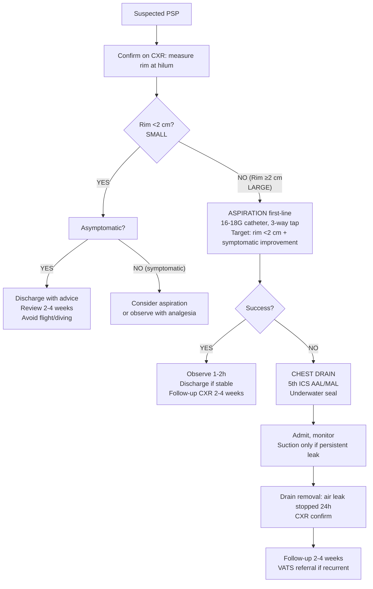
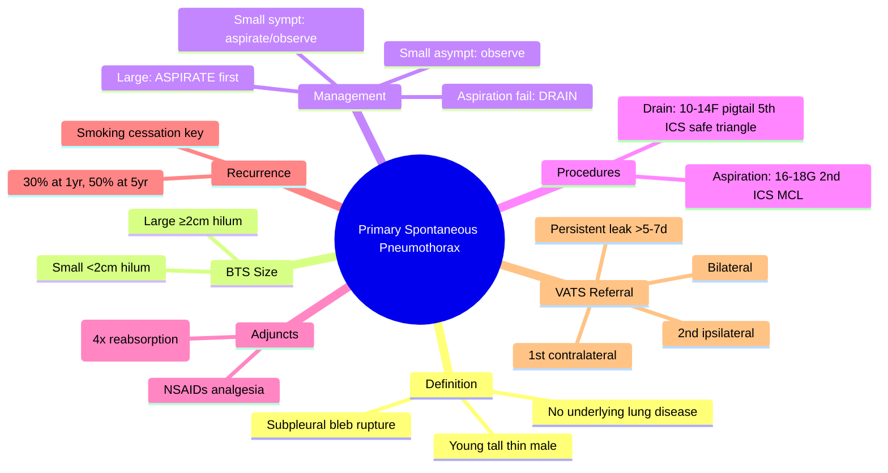
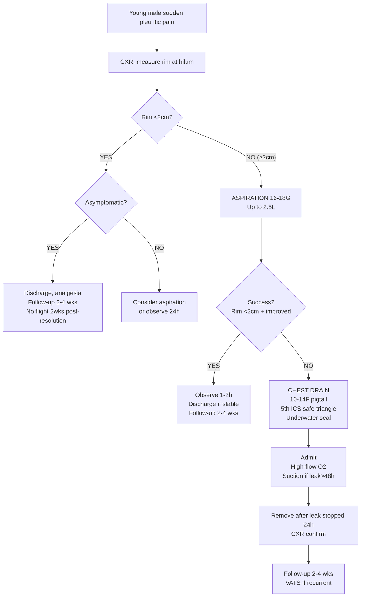

# Primary Spontaneous Pneumothorax (PSP)

Related: [[Pleural air disorders]], [[Pneumothorax]], [[Secondary spontaneous pneumothorax]], [[Tension pneumothorax]], [[Pleural aspiration and chest drain basics]]

> [!important]
> **Primary spontaneous pneumothorax (PSP)** = pneumothorax **without underlying lung disease** in a **tall, thin young male** (typically 15–35 years). Caused by **subpleural bleb rupture**. Key FCPS/MRCP: BTS size classification (rim <2cm vs ≥2cm), management algorithm (observe vs aspirate vs drain), recurrence risk ~30%, VATS referral criteria, differentiation from secondary/tension.

## Learning Objectives
- Define PSP and distinguish from secondary spontaneous and tension pneumothorax
- Apply **BTS size classification** (small vs large by rim measurement) and management algorithm
- Perform **aspiration** (first-line for large PSP) and **chest drain insertion**
- Recognise **tension pneumothorax** as emergency requiring immediate decompression
- Counsel on **recurrence risk** (~30% at 1 year, ~50% at 5 years) and **VATS referral criteria**
- Differentiate from secondary, catamenial, traumatic, iatrogenic pneumothorax

## Definition
**Primary spontaneous pneumothorax (PSP)** = accumulation of air in the pleural space **without clinically apparent underlying lung disease**, occurring **spontaneously** (not traumatic/iatrogenic).

**Typical patient**: Tall, thin male, age **15–35 years**, often smoker.

## Core Anatomy
### 1. Subpleural blebs/bullae
- **Blebs**: air-filled spaces <1 cm in visceral pleura / subpleural region
- **Bullae**: >1 cm
- Located at **lung apices** (mechanical stress highest)
- Rupture → air enters pleural space → pneumothorax

### 2. Pleural space physiology
- Normally negative pressure (-5 cmH2O)
- Air entry → pressure equalises → lung collapses
- **Re-absorption**: pleural capillaries absorb air (~1.25% volume/day); accelerated by high-flow O2 (nitrogen washout → diffusion gradient)

### 3. Surface anatomy for procedures
- **Aspiration/Drain**: **2nd ICS MCL** (traditional) or **4th–5th ICS AAL/MAL** (safe triangle, preferred by BTS)
- **Needle**: 16–18G cannula for aspiration; 10–14F pigtail or 24–28F surgical drain

## Core Physiology
### Gas re-absorption
- Rate: ~**1.25% of hemithorax volume per day** (room air)
- **High-flow O2** (FiO2 1.0) → nitrogen washout from blood → ↑ diffusion gradient → **~4x faster re-absorption** (~4–5%/day)
- **Mechanism**: N2 in pleural air diffuses into capillary blood (low PN2 on O2 therapy)

### Haemodynamic effects
- Small PSP: minimal, compensated
- Large PSP: ↓ venous return, mild hypotension, tachycardia
- **Tension physiology**: one-way valve → progressive +ve pressure → obstructive shock (see [[Tension pneumothorax]])

## Normal Values / Important Cut-offs
### BTS Size Classification (CXR - AP/Supine or PA/Erect)
| Size | Rim of air (at hilum level) | Management |
|------|----------------------------|------------|
| **Small** | **<2 cm** | Observe / consider discharge if asymptomatic |
| **Large** | **≥2 cm** | **Aspiration first-line** (then drain if failed) |

> **Note**: BTS uses **rim at hilum level** (not apex). Light's criteria uses **≥3 cm apex-to-cupola** for "large" — BTS is standard for UK exams.

### Aspiration success criteria
- **Clinical improvement** + **rim <2 cm on repeat CXR** + **no tension features**

### Recurrence rates
- **~30% at 1 year**
- **~50% at 5 years**
- Higher in smokers, tall males, bilateral blebs on CT

## Classification
### By aetiology
1. **Primary spontaneous** (PSP) — no underlying lung disease
2. **Secondary spontaneous** (SSP) — underlying lung disease (COPD, CF, TB, etc.)
3. **Traumatic** — penetrating/blunt
4. **Iatrogenic** — CVC, biopsy, ventilation, CPR
5. **Catamenial** — thoracic endometriosis (right-sided, perimenstrual)
6. **Tension** — haemodynamic compromise (can complicate any type)

### By size (BTS)
- **Small**: rim <2 cm at hilum
- **Large**: rim ≥2 cm at hilum

## Etiology / Causes
### PSP mechanism
1. **Subpleural bleb formation** at apices (congenital/developmental, smoking-related inflammation)
2. **Rupture** → air leak into pleural space
3. **Usually self-seals** within hours-days
4. **Recurrence** if blebs persist or new blebs form

### Risk factors
- **Male sex** (M:F ~ 3:1 to 6:1)
- **Tall, thin habitus** (long apex, mechanical stress)
- **Age 15–35 years** (peak incidence)
- **Smoking** (↑ risk 9-fold in men, 22-fold in women; dose-dependent)
- **Genetic**: Marfan, Ehlers-Danlos, α1-antitrypsin deficiency, Birt-Hogg-Dubé (FLCN gene)
- **Familial** pneumothorax

## Risk Factors (modifiable)
- **Smoking cessation** — single most effective preventive measure
- Avoid scuba diving / high altitude / unpressurised flight until 2 weeks post-resolution + normal CXR

## Pathophysiology
1. **Bleb rupture** at apex (high mechanical stress, low perfusion)
2. **Air enters pleural space** → intrapleural pressure rises toward atmospheric
3. **Lung collapses** proportionally to air volume
4. **Pleural inflammation** → fibrin deposition, adhesions (may limit recurrence)
5. **Re-absorption** via pleural capillaries (nitrogen diffusion gradient)
6. **Leak usually seals** spontaneously (minutes to days)

## Clinical Features
### History
- **Sudden onset** pleuritic chest pain (sharp, ipsilateral)
- **Dyspnoea** (mild to moderate; severe if large/underlying disease)
- **Dry cough** (occasionally)
- Often at rest, not exertion
- **No fever** (unless superinfection)
- **Previous episodes** (recurrence clue)

### Examination
| Finding | Small PSP | Large PSP |
|---------|-----------|-----------|
| **Respiratory rate** | Normal / slightly ↑ | ↑↑ |
| **Heart rate** | Normal / slightly ↑ | ↑↑ |
| **BP** | Normal | Normal / slightly ↓ |
| **Trachea** | Central | Central (deviation = TENSION) |
| **JVP** | Normal | Normal (distended = TENSION) |
| **Chest expansion** | Reduced ipsilateral | Markedly reduced ipsilateral |
| **Percussion** | Hyperresonant ipsilateral | Hyperresonant ipsilateral |
| **Breath sounds** | Reduced ipsilateral | Absent/very reduced ipsilateral |
| **Vocal fremitus** | Reduced | Reduced/absent |

> **FCPS/MRCP tip**: **Tracheal deviation and JVP distension = TENSION pneumothorax**, not simple PSP.

## Approach / Management Algorithm (BTS 2023)

## Investigations
### Essential
- **CXR (PA erect preferred)**: measure **rim at hilum level**, check for tension signs, underlying pathology
- **Supine/AP CXR** (if unable to stand): air collects anteriorly → **deep costophrenic angle**, **lucent hemithorax**, **visible pleural line**

### Optional / Selected
- **CT thorax**: if diagnostic uncertainty, planned surgery, suspected underlying disease, bilateral, recurrent
  - Shows **blebs/bullae** at apices
  - Guides **VATS planning** (apical pleurectomy + bullectomy)
- **ABG**: if hypoxic or severe dyspnoea (usually mild hypoxaemia)
- **Spirometry**: after resolution (baseline, rule out occult COPD)

## Interpretation Frameworks
### 1. BTS Size Measurement
**On PA erect CXR**: Measure **horizontal distance from lung edge to inner chest wall at level of hilum**.
- **<2 cm** = Small
- **≥2 cm** = Large

**On supine/AP CXR**: Air anterior → look for **deep sulcus sign** (deep costophrenic angle), **lucent upper quadrant**, **visible pleural line**.

### 2. Aspiration success
**Success = ALL of**:
- Patient comfortable, RR/HR normalising
- **Repeat CXR: rim <2 cm**
- No tension features

**Failure = any of**:
- Persistent rim ≥2 cm
- Ongoing symptoms
- Tension features develop

### 3. Recurrence risk stratification
| Factor | Recurrence Risk |
|--------|----------------|
| First PSP, non-smoker | ~20-30% |
| Smoker | ~40-50% |
| Bilateral blebs on CT | ↑↑ |
| Previous recurrence | ~50% per episode |

## Diagnosis
**Clinical + Radiological**:
1. Typical patient: young, tall, thin male, sudden pleuritic pain + dyspnoea
2. **CXR**: visible pleural line, no lung vessels beyond, rim measurement
3. **No underlying lung disease** on history, exam, imaging
4. **Exclude tension** (haemodynamic compromise)

## Differential Diagnosis
| Differential | Clues Against PSP |
|--------------|-------------------|
| **Secondary spontaneous (SSP)** | Known lung disease (COPD, CF, TB, malignancy, PJP), older, sicker |
| **Tension pneumothorax** | **Hypotension, JVP distended, tracheal deviation, shock** |
| **Traumatic pneumothorax** | History of trauma (blunt/penetrating), rib fractures |
| **Iatrogenic pneumothorax** | Recent CVC, biopsy, ventilation, CPR |
| **Pulmonary embolism** | Pleuritic pain, but **no pleural line on CXR**, risk factors, CTPA |
| **Pericarditis** | Positional pain, friction rub, ECG changes (ST elevation), no pneumothorax on CXR |
| **Musculoskeletal pain** | Reproducible, no respiratory signs, normal CXR |
| **Oesophageal rupture (Boerhaave)** | Vomiting + chest pain, subcutaneous emphysema, CXR: pneumomediastinum ± pneumothorax, Gastrografin swallow |

## Management
### Small PSP (<2 cm rim)
**Asymptomatic**:
- **Discharge** with written advice
- **Analgesia** (NSAIDs first-line; avoid opioids if possible)
- **Avoid air travel / scuba diving** until 2 weeks after **complete radiological resolution**
- **Follow-up CXR at 2–4 weeks**

**Symptomatic** (pain, dyspnoea):
- **Analgesia**
- **Consider aspiration** (16–18G) if significant symptoms
- Or observe with repeat CXR 24h

### Large PSP (≥2 cm rim) — **Aspiration FIRST-LINE**
1. **Aspiration** (16–18G cannula, 2nd ICS MCL or 4th–5th ICS AAL, 3-way tap, 50mL syringe):
   - Aspirate **up to 2.5 L** (stop if resistance, cough, >2.5L)
   - Target: **rim <2 cm + symptomatic improvement**
2. **If successful**: Observe 1–2h, repeat CXR, discharge if stable, follow-up 2–4 weeks
3. **If failed**: **Chest drain** (see below)

### Chest Drain Indications
- Failed aspiration (rim ≥2 cm or persistent symptoms)
- Tension pneumothorax (after emergency needle decompression)
- Large PSP with significant symptoms where aspiration not feasible
- Bilateral PSP
- Persistent air leak >24–48h after drain

### Chest Drain Technique (BTS)
- **Site**: **4th–5th ICS, anterior to midaxillary line (safe triangle)**
- **Tube**: **Small-bore (10–14F pigtail via Seldinger) preferred** over large surgical (24–28F) — less pain, similar efficacy for air
- **Connection**: **Underwater seal** (bottle or digital) — **NO suction initially**
- **Suction**: Only if **persistent air leak >24–48h** or **incomplete re-expansion** (-10 to -20 cmH2O)
- **Removal**: After **air leak stopped for 24h** + **CXR confirms re-expansion** (clamp trial NOT required)

### High-flow Oxygen
- **FiO2 1.0** via non-rebreather mask
- **Accelerates re-absorption ~4x** (nitrogen washout)
- Use in **admitted patients** (large PSP, post-drain)
- **Caution**: avoid in COPD/CO2 retention risk (but PSP patients usually young, no COPD)

### Analgesia
- **NSAIDs** (ibuprofen, diclofenac) — first-line, no respiratory depression
- **Paracetamol** — adjunct
- **Opioids** — avoid if possible (respiratory depression, constipation); if needed, low-dose with monitoring

### Discharge Criteria (after aspiration/successful drain)
- Clinically stable
- CXR: rim <2 cm (or complete resolution)
- Pain controlled on oral analgesia
- Written advice: no flight/diving 2 weeks post-resolution, smoking cessation, return if recurrent symptoms

### Follow-up
- **CXR at 2–4 weeks** to confirm resolution
- **Smoking cessation advice** (critical for recurrence reduction)
- **VATS referral** if:
  - **2nd ipsilateral** recurrence
  - **1st contralateral** recurrence
  - **Bilateral simultaneous**
  - **Persistent air leak >5–7 days**
  - **Occupational requirement** (pilot, diver, miner)

## Drug Interactions / Contraindications / Cautions
### Oxygen
- High-flow O2 accelerates re-absorption
- **Caution**: theoretical CO2 retention risk, but PSP patients typically young, no COPD

### Analgesia
- **NSAIDs**: safe, no respiratory depression
- **Opioids**: avoid if possible; if used, monitor RR/SpO2

### Anticoagulation
- Relative contraindication for drain insertion
- Correct if possible, but **do not delay life-saving drain**

## Procedures / Indications / Contraindications
### Aspiration
**Indication**: Large PSP (≥2 cm rim) as first-line; symptomatic small PSP
**Contraindication**: Tension (need immediate needle decompression → drain), coagulopathy (relative)
**Equipment**: 16–18G IV cannula, 3-way tap, 50mL syringe, sterile prep, local anaesthetic
**Success**: >50% for first large PSP (BTS data)

### Chest Drain (Small-bore pigtail / Seldinger)
**Indication**: Failed aspiration, tension (after needle), bilateral, persistent leak
**Contraindication**: Uncorrected coagulopathy (relative), skin infection at site (relative)
**Equipment**: 10–14F pigtail kit, Seldinger technique, ultrasound guidance optional but recommended

### Surgical (VATS)
**Indication**: Recurrence criteria above
**Procedure**: **Apical pleurectomy + bullectomy ± talc pleurodesis** (poudrage or slurry)
**Success**: >95% recurrence prevention

## Procedure Mini-Sections
### Aspiration (BTS technique)
1. **Position**: Sitting, leaning forward slightly
2. **Site**: **2nd ICS MCL** (traditional) or **4th–5th ICS AAL** (safe triangle)
3. **Anaesthetise**: 1% lidocaine 5–10 mL (skin → parietal pleura; aspirate air confirms)
4. **Insert**: 16–18G cannula over needle, advance until air aspirated
5. **Attach**: 3-way tap + 50mL syringe
6. **Aspirate**: Up to **2.5 L** (stop if resistance, severe cough, >2.5L)
7. **Remove cannula**, apply dressing
8. **Repeat CXR** at 1h: check rim <2 cm
9. **Observe 1–2h**, discharge if successful

### Chest Drain (Seldinger pigtail)
1. **Site**: **4th–5th ICS, safe triangle** (anterior to midaxillary line)
2. **Ultrasound**: Confirm pleural space, avoid lung/vascular structures
3. **Anaesthetise**: 1% lidocaine along track to parietal pleura
4. **Needle entry**: 18G needle, aspirate air → confirm pleural entry
5. **Guidewire**: Advance J-tip wire 15–20 cm
6. **Dilate**: Single dilator over wire
7. **Insert pigtail**: Over wire, curl in pleural space
8. **Remove wire**, connect to underwater seal
9. **Secure**, dressing, CXR

## Complications
### Aspiration
- Failure (~30-50%)
- Vasovagal syncope
- Coughing fit
- Re-expansion pulmonary oedema (rare, if large volume rapidly drained from chronic collapse)

### Chest Drain
- **Malposition** (subcutaneous, intraparenchymal, abdominal)
- **Bleeding** (intercostal artery, lung parenchyma)
- **Infection** (empyema ~1-2%)
- **Persistent air leak** (>5-7 days → surgical)
- **Re-expansion pulmonary oedema** (limit drainage rate if chronic)
- **Recurrence** after removal (~20-30%)

### Re-expansion Pulmonary Oedema
- **Risk**: Chronic collapse (>3–7 days) + rapid large-volume drainage
- **Prevention**: **Limit drainage to 1–1.5 L initially**, clamp if needed, avoid high suction
- **Management**: Supportive, diuretics, NIV/ventilation if severe

## Red Flags / Emergencies
- **Tension pneumothorax**: hypotension, JVP ↑, tracheal deviation → **immediate needle decompression**
- **Bilateral pneumothorax**: rare, catastrophic — bilateral drains
- **Haemopneumothorax**: drain → blood >1L or ongoing >200mL/h → surgical
- **Persistent air leak >5-7 days** → VATS

## Special Situations
### Bilateral PSP
- Rare but life-threatening
- **Bilateral chest drains** (or sequential if one side tension)
- High-flow O2, urgent surgical opinion

### PSP in Pregnancy
- Management similar
- **VATS preferred** in 2nd trimester if recurrence
- Avoid radiation (CXR with shielding, ultrasound for drain)

### PSP in HIV / Immunocompromised
- Think **PJP** (bilateral, cysts) — not true PSP
- CT needed, PJP treatment, higher threshold for invasive procedures

### Catamenial Pneumothorax
- **Right-sided**, perimenstrual (within 72h of menses)
- **Thoracic endometriosis** (diaphragmatic deposits)
- Recurrent, often right-sided
- Management: hormonal (OCP, GnRH agonist) + VATS (diaphragmatic excision + pleurectomy)

## Prognosis
- **First episode**: ~70% resolve with aspiration/observation
- **Recurrence**: ~30% at 1 year, ~50% at 5 years
- **Smoking cessation** reduces recurrence by ~50%
- **VATS pleurectomy**: >95% success, low morbidity
- **Mortality**: Very low (<1%) in young healthy patients

## Topic Correlation
- [[Pleural air disorders]] — classification framework
- [[Pneumothorax]] — overview
- [[Secondary spontaneous pneumothorax]] — underlying lung disease
- [[Tension pneumothorax]] — emergency variant
- [[Pleural aspiration and chest drain basics]] — procedure details

## FCPS/MRCP High-Yield Points
1. **PSP**: young tall thin male, smoker, no lung disease
2. **BTS size**: rim at hilum <2 cm = small, ≥2 cm = large
3. **Small + asymptomatic**: discharge, follow-up 2-4 weeks
4. **Large**: **Aspiration first-line** (16-18G, up to 2.5L)
5. **Aspiration success**: rim <2 cm + symptomatic improvement
6. **Aspiration failed** → **Chest drain** (small-bore pigtail, 4th-5th ICS safe triangle)
6. **Oxygen**: high-flow accelerates re-absorption 4x
7. **Recurrence**: ~30% at 1 yr, ~50% at 5 yr; smoking cessation critical
8. **VATS referral**: 2nd ipsilateral, 1st contralateral, bilateral, persistent leak >5-7d
9. **Tension signs** (hypotension, JVP ↑, tracheal deviation) = emergency decompression, NOT simple PSP

## Common Viva Questions
1. BTS size classification and management algorithm for PSP
2. Aspiration technique and success criteria
3. Chest drain site (safe triangle) and tube choice
4. Recurrence rates and risk factors
5. VATS referral criteria
6. Difference between PSP and SSP
7. Tension pneumothorax detection
8. Re-expansion pulmonary oedema prevention

## Common Confusions / Exam Traps
- **Light's criteria (≥3 cm apex)** vs **BTS (≥2 cm hilum)** — **BTS is UK standard**
- **Aspiration is first-line for LARGE PSP** — not small, not tension
- **Chest drain site**: 2nd ICS MCL = needle (aspiration/tension); **4th-5th ICS safe triangle = drain**
- **Suction immediately** = NO; underwater seal first, suction only if persistent leak
- **Clamp trial before removal** = NOT required (increases recurrence)
- **High-flow O2** = accelerates re-absorption; safe in PSP (no COPD)
- **Smoking cessation** = most effective recurrence prevention

## Mnemonics
- **PSP PATIENT**: **P**rimary, **S**pontaneous, **P**neumothorax — **P**atient: Young, **A**pex blebs, **T**all, **I**n male, **E**x-smoker? No, current smoker, **N**o lung disease
- **BTS SIZE**: **B**ig = **T**wo cm at hilum = **S**mall = <2cm = observe; **L**arge = ≥2cm = **A**spirate first
- **ASPIRATE**: **A**spirate 16-18G, **S**top at 2.5L or cough, **P**leural line <2cm, **I**mproved symptoms, **R**epeat CXR 1h, **A**dmit if fail, **T**hen drain, **E**valuate for VATS
- **SAFE TRIANGLE**: **S**ite: **A**pex 5th ICS, **F**ront: Pectoralis major, **E**nd: Latissimus dorsi, **T**riangle **R**ight **I**ntercostal **A**rtery **N**erve **G**entle **L**ateral **E**xpansion

## Mind Map

## Flowchart

## Suggested Visuals / Image Notes
- CXR: small vs large PSP (rim measurement at hilum)
- CT: apical blebs/bullae
- Surface anatomy: 2nd ICS MCL, 4th-5th ICS safe triangle
- Aspiration technique
- Seldinger pigtail drain insertion
- VATS: apical pleurectomy + bullectomy

## Suggested Video References
- BTS pleural disease guideline: pneumothorax algorithm
- Aspiration technique (BTS)
- Small-bore chest drain insertion (Seldinger)
- VATS for recurrent pneumothorax
- Re-expansion pulmonary oedema prevention

## One-Page Revision Summary
- **PSP**: young tall thin male, smoker, no lung disease, apical bleb rupture
- **BTS**: rim at hilum <2cm = small, ≥2cm = large
- **Small asymptomatic**: discharge, follow-up 2-4 wks
- **Large**: ASPIRATE first (16-18G, up to 2.5L, 2nd ICS MCL)
- **Aspiration success**: rim <2cm + improved → discharge
- **Aspiration fail**: CHEST DRAIN (10-14F pigtail, 5th ICS safe triangle, underwater seal)
- **High-flow O2** 4x re-absorption
- **Recurrence**: 30% 1yr, 50% 5yr; smoking cessation halves risk
- **VATS**: 2nd ipsilateral, 1st contralateral, bilateral, leak >5-7d

## 24-Hour Recall Prompts
- BTS size cut-off and measurement level
- Aspiration first-line for which size?
- Aspiration success criteria
- Chest drain site and tube size
- VATS referral criteria (4 indications)

## 7-Day / 15-Day / 30-Day Revision Tracker
- [ ] Day 1 completed
- [ ] 24-hour recall completed
- [ ] Day 7 revision completed
- [ ] Day 15 revision completed
- [ ] Day 30 revision completed

## Must Know / Should Know / Nice to Know
### Must Know
- PSP definition and typical patient
- BTS size classification (<2cm vs ≥2cm at hilum)
- Management algorithm: small observe, large aspirate first
- Aspiration technique and success criteria
- Chest drain: small-bore pigtail, safe triangle, underwater seal
- Recurrence rates and smoking cessation
- VATS referral criteria

### Should Know
- Re-expansion pulmonary oedema prevention
- High-flow O2 mechanism
- Catamenial pneumothorax features
- Bilateral PSP management
- PSP in pregnancy/HIV

### Nice to Know
- Genetic causes (Birt-Hogg-Dubé, Marfan, FLCN)
- Light's criteria vs BTS historical context
- Digital vs analogue drainage systems
- Talc poudrage vs slurry in VATS
- Cost-effectiveness of aspiration vs drain first

## Self-Test Scorecard
- Understanding: /10
- Recall: /10
- MCQ Performance: /10
- SBA Performance: /10
- Viva Confidence: /10
- Total: /50

> [!tip]
> Interpretation: <35 = weak topic, 35-44 = acceptable but insecure, 45+ = strong exam-ready topic.

## Exam Answer Modes
### Long Answer Skeleton
- Definition, typical patient, pathophysiology (apical blebs)
- BTS size classification with measurement technique
- Full management algorithm (small vs large, aspiration vs drain)
- Aspiration technique, success criteria, failure pathway
- Chest drain insertion (site, tube, technique, suction)
- Adjuncts: O2, analgesia, discharge advice
- Recurrence, risk factors, smoking cessation
- VATS referral criteria and procedure
- Complications, red flags, special situations

### Short Note Skeleton
- Definition + typical patient box
- BTS size table
- Management algorithm flowchart
- Aspiration vs drain comparison
- VATS referral box

### Viva One-Liners
- "PSP = young tall thin male, smoker, no lung disease, apical bleb rupture"
- "BTS: measure rim at HILUM; <2cm small, ≥2cm large"
- "Small asymptomatic: discharge, follow-up 2-4 weeks"
- "Large PSP: ASPIRATION first-line (16-18G, up to 2.5L, 2nd ICS MCL)"
- "Aspiration success: rim <2cm + symptomatic improvement → discharge"
- "Aspiration fail → chest drain: 10-14F pigtail, 5th ICS safe triangle, underwater seal"
- "High-flow O2 = 4x faster re-absorption (nitrogen washout)"
- "Recurrence: 30% at 1yr, 50% at 5yr; smoking cessation halves risk"
- "VATS referral: 2nd ipsilateral, 1st contralateral, bilateral, persistent leak >5-7d"
- "Re-expansion oedema: chronic collapse + rapid drainage → limit rate, no high suction"

### Ward-Case Discussion Points
- 22M tall thin smoker, sudden R chest pain, CXR rim 3cm at hilum → LARGE PSP → aspirate 2nd ICS MCL, success → discharge, follow-up 2wks, smoking cessation
- 19F first PSP small asymptomatic → discharge, advice no flight 2wks post-CXR clearance
- 25M 2nd LEFT PSP → VATS referral (apical pleurectomy + bullectomy + talc)
- 30M post-drain day 3, persistent bubbling, no re-expansion → consider suction, if >5-7d → VATS

### Last-Night-Before-Exam Sheet
- PSP: Young tall thin male, smoker, apical bleb
- BTS: Hilum rim <2cm small, ≥2cm large
- Small asympt: Discharge
- Large: ASPIRATE 1st (16-18G, 2.5L, 2nd ICS MCL)
- Aspiration success: <2cm + improved
- Fail → Drain: 10-14F pigtail, 5th ICS safe triangle, UW seal
- O2: 4x reabsorption
- Recurrence: 30% 1yr, stop smoking
- VATS: 2nd ipsi, 1st contra, bilateral, leak>5d
- Tension: Hypotension, JVP↑, Trachea deviate → NEEDLE NOW

## Summary
**Primary spontaneous pneumothorax (PSP)** = pneumothorax without underlying lung disease in **young tall thin male smokers** due to **apical bleb rupture**. **BTS size**: measure **rim at hilum** — **<2cm = small, ≥2cm = large**. **Management**: Small asymptomatic → discharge/follow-up; Large → **aspiration first-line** (16–18G, up to 2.5L, 2nd ICS MCL); success = rim <2cm + improved → discharge. Aspiration fail → **small-bore pigtail drain (10–14F) at 5th ICS safe triangle**, underwater seal. **High-flow O2 accelerates re-absorption 4x**. **Recurrence ~30% at 1yr, 50% at 5yr**; **smoking cessation critical**. **VATS referral**: 2nd ipsilateral, 1st contralateral, bilateral, persistent leak >5–7d. **Tension signs** = emergency needle decompression.

## MCQs (10)
1. **BTS size measurement** for pneumothorax is taken at:
   A. Apex of lung
   B. **Level of hilum**
   C. 5th intercostal space
   D. Costophrenic angle

2. **Large PSP** (BTS) defined as rim:
   A. <1 cm
   B. <2 cm
   C. **≥2 cm**
   D. ≥3 cm

3. **First-line management for LARGE PSP** (BTS):
   A. Chest drain insertion
   B. **Aspiration (16–18G)**
   C. High-flow oxygen only
   D. Observe with analgesia

4. **Aspiration success criteria** include:
   A. Rim <3 cm on repeat CXR
   B. **Rim <2 cm + symptomatic improvement**
   C. Complete resolution on CXR
   D. No air aspirated

5. **Chest drain site** for pneumothorax (BTS safe triangle):
   A. 2nd ICS MCL
   B. **4th–5th ICS anterior to midaxillary line**
   C. 6th ICS MAL
   D. 3rd ICS AAL

6. **Preferred chest drain** for simple pneumothorax (BTS):
   A. 28F surgical drain
   B. 24F surgical drain
   C. **10–14F pigtail (Seldinger)**
   D. 32F surgical drain

7. **High-flow oxygen** accelerates pneumothorax re-absorption by:
   A. 2x
   B. **~4x**
   C. 10x
   D. No effect

8. **Recurrence rate** of PSP at 1 year:
   A. 10%
   B. **~30%**
   C. 50%
   D. 70%

9. **VATS referral** indicated for:
   A. First PSP, successful aspiration
   B. **Second ipsilateral PSP**
   C. Small asymptomatic PSP
   D. All PSP with smoking history

10. **Re-expansion pulmonary oedema** risk highest with:
    A. Acute small PSP drained rapidly
    B. **Chronic collapse (>3–7 days) + rapid large-volume drainage**
    C. Tension pneumothorax decompression
    D. Aspiration of 500 mL

## SBA Questions (10)
1. A 22M tall thin smoker presents with sudden R pleuritic pain. CXR shows R pneumothorax with rim 3 cm at hilum. He is haemodynamically stable. Best initial management?
   A. Chest drain 28F
   B. **Aspiration 16–18G 2nd ICS MCL**
   C. High-flow O2 and discharge
   D. VATS referral

2. Same patient after aspiration. Repeat CXR shows rim 1.5 cm, pain resolved. Next step?
   A. Insert chest drain
   B. **Discharge with follow-up 2 weeks, smoking cessation advice**
   C. Admit for high-flow O2
   D. Repeat aspiration

3. A 25M presents with 2nd LEFT PSP (first was 6 months ago, treated with aspiration). Current CXR: LEFT pneumothorax rim 3 cm. Best management?
   A. Aspiration again
   B. Chest drain then discharge
   C. **Chest drain then VATS referral (recurrent ipsilateral)**
   D. High-flow O2 only

4. A 19F first PSP, rim 1 cm at hilum, asymptomatic. Management?
   A. Aspiration
   B. Chest drain
   C. **Discharge, analgesia, follow-up 2–4 weeks, no flight 2wks post-resolution**
   D. Admit for observation

5. Chest drain inserted for large PSP. Underwater seal bubbling. When to apply suction?
   A. Immediately at -20 cmH2O
   B. **Only if persistent air leak >24–48h or incomplete re-expansion**
   C. After 1 hour
   D. Never for pneumothorax

6. Re-expansion pulmonary oedema prevention:
   A. Apply high suction immediately
   B. **Limit initial drainage to 1–1.5L, avoid high suction in chronic collapse**
   C. Clamp drain for 24h routinely
   D. Give prophylactic furosemide

7. A 30M PSP, drain day 5, persistent air leak, lung not fully expanded. Next step?
   A. Increase suction to -30 cmH2O
   B. **VATS referral (persistent leak >5–7 days)**
   C. Second drain
   D. Chemical pleurodesis via drain

8. Catamenial pneumothorax — typical features:
   A. Left-sided, mid-cycle
   B. **Right-sided, perimenstrual (within 72h menses)**
   C. Bilateral, post-menopausal
   D. Left-sided, random timing

9. Smoking cessation effect on PSP recurrence:
   A. No effect
   B. **Reduces recurrence by ~50%**
   C. Increases recurrence
   D. Only effective if >10 pack-years

10. Tension pneumothorax vs simple PSP — key clinical difference:
    A. Tension has pleuritic pain
    B. **Tension has hypotension, JVP distension, tracheal deviation**
    C. Simple PSP has tracheal deviation
    D. Simple PSP has JVP distension

## Flashcards
- Q: BTS size measurement level
  A: Hilum (not apex)
- Q: Large PSP cut-off
  A: Rim ≥2cm at hilum
- Q: Large PSP first-line
  A: Aspiration 16-18G
- Q: Aspiration success
  A: Rim <2cm + improved
- Q: Drain site
  A: 5th ICS AAL/MAL (safe triangle)
- Q: Drain size
  A: 10-14F pigtail (Seldinger)
- Q: O2 effect
  A: 4x faster reabsorption
- Q: Recurrence 1yr
  A: ~30%
- Q: VATS referral
  A: 2nd ipsi, 1st contra, bilateral, leak>5-7d
- Q: Re-expansion oedema
  A: Chronic collapse + rapid drainage

## Answer Key with Explanations
### MCQs
1. **B** — BTS measures horizontal rim at hilum level on PA erect CXR.
2. **C** — Large = rim ≥2 cm at hilum (BTS); Light's uses ≥3 cm at apex.
3. **B** — BTS: aspiration first-line for large PSP.
4. **B** — Success = rim <2 cm + symptomatic improvement.
5. **B** — Safe triangle: 4th–5th ICS, anterior to midaxillary line.
6. **C** — Small-bore pigtail (10–14F) preferred; less pain, similar efficacy.
7. **B** — High-flow O2 → nitrogen washout → ~4x faster re-absorption.
8. **B** — ~30% at 1 year, ~50% at 5 years.
9. **B** — 2nd ipsilateral = VATS referral.
10. **B** — Chronic collapse + rapid large-volume drainage = highest risk.

### SBAs
1. **B** — Large PSP (rim ≥2cm) → aspiration first-line (BTS).
2. **B** — Aspiration successful (rim <2cm, pain resolved) → discharge, follow-up, smoking cessation.
3. **C** — 2nd ipsilateral PSP → VATS referral after drain.
4. **C** — Small (<2cm) asymptomatic → discharge, follow-up.
5. **B** — Suction only if persistent leak >24-48h or incomplete re-expansion.
6. **B** — Limit drainage rate, avoid high suction in chronic collapse.
7. **B** — Persistent leak >5-7d → VATS.
8. **B** — Catamenial: right-sided, perimenstrual, thoracic endometriosis.
9. **B** — Smoking cessation reduces recurrence by ~50%.
10. **B** — Tension = hypotension + JVP↑ + tracheal deviation (obstructive shock).

### Flashcards
All correct as written.

---
