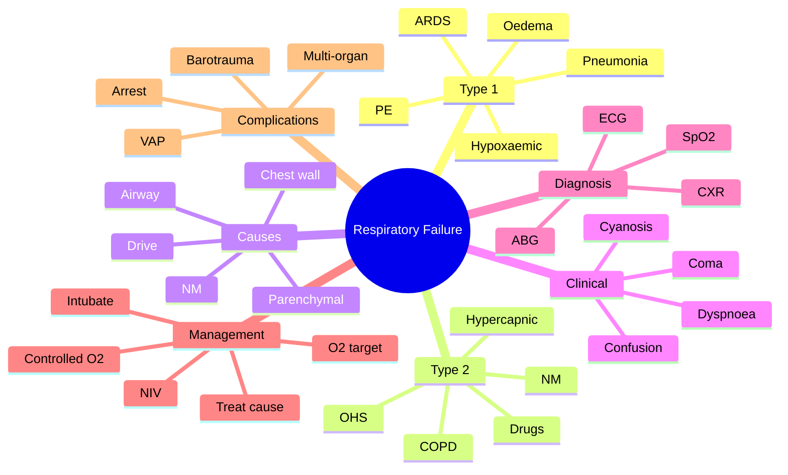
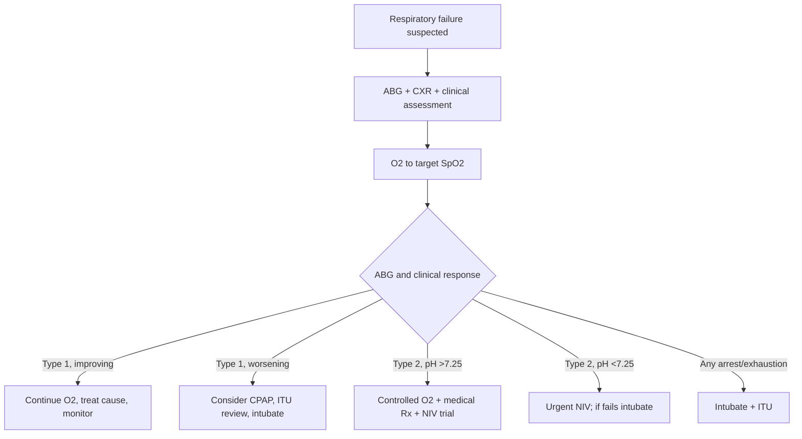

# Respiratory Failure

> [!important]
> **Respiratory failure** is defined as **inadequate gas exchange** by the respiratory system, with **arterial PaO₂ <8.0 kPa (60 mmHg)** ± **PaCO₂ >6.0 kPa (45 mmHg)** at rest at sea level. It is classified as **Type 1 (hypoxaemic, normal/low PaCO₂)** or **Type 2 (hypercapnic, PaCO₂ >6.0 kPa)**.

Related: [[ABG Interpretation]], [[Oxygen Therapy and NIV]], [[Pneumonia]], [[COPD]], [[Asthma]], [[Pulmonary Embolism]], [[Respiratory Failure and Ventilatory Support/Type 1 respiratory failure|Type 1 respiratory failure]], [[Respiratory Failure and Ventilatory Support/Type 2 respiratory failure|Type 2 respiratory failure]]

> [!tip] **FCPS/MRCP pearl**: **Type 1** = alveolar filling / V/Q mismatch / shunt (pneumonia, ARDS, PE, pulmonary oedema). **Type 2** = ventilatory failure (COPD, severe asthma, opioid, NM weakness, kyphoscoliosis). **SpO₂ target**: 94–98% (88–92% if hypercapnic risk). **Don't give high-flow O₂** to Type 2 patients without controlled oxygen + ABG monitoring.

## Definition

### Diagnostic thresholds (sea level, room air)
- **PaO₂ <8.0 kPa (60 mmHg)** — defining feature
- ± **PaCO₂ >6.0 kPa (45 mmHg)** — defines Type 2

### Classification by PaCO₂
| Type | PaO₂ | PaCO₂ | Mechanism |
|------|------|-------|-----------|
| **Type 1 (hypoxaemic)** | <8.0 kPa | Normal or low (<6.0) | V/Q mismatch, shunt, diffusion limitation |
| **Type 2 (hypercapnic)** | <8.0 kPa | >6.0 kPa | Hypoventilation (↓minute ventilation) |
| **Combined/“mixed”** | <8.0 kPa | Variable | e.g. COPD + pneumonia |

### Classification by onset
- **Acute** — hours to days
- **Chronic** — weeks to months (compensated; e.g. stable COPD)
- **Acute on chronic** — acute deterioration in patient with chronic failure (e.g. AECOPD)

## Pathophysiology

### Five mechanisms of hypoxaemia
1. **Hypoventilation** — ↓minute ventilation → ↓PaO₂, ↑PaCO₂ (Type 2)
2. **V/Q mismatch** — most common cause; perfusion of poorly ventilated lung; corrects with O₂
3. **Shunt** — perfusion of unventilated lung (alveolar collapse, fluid, consolidation); does NOT correct with O₂
4. **Diffusion limitation** — thickened alveolar-capillary membrane (fibrosis, oedema)
5. **Low inspired O₂ (FiO₂)** — high altitude, fire, suffocation

### Causes of hypercapnia
- **↓Drive** — opioids, sedatives, brainstem lesion
- **NM weakness** — GBS, MG, ALS, muscular dystrophy
- **Chest wall** — kyphoscoliosis, obesity (OHS), flail chest
- **Airway obstruction** — severe asthma, COPD, OSA
- **↑Dead space** — COPD, advanced ILD

## Aetiology

### Type 1 (hypoxaemic)
- **Pneumonia** (CAP, HAP, COVID-19)
- **ARDS** (any cause)
- **Pulmonary oedema** (cardiogenic, non-cardiogenic)
- **Pulmonary embolism**
- **Pulmonary fibrosis / ILD**
- **Pneumothorax**
- **Asthma (early)**
- **Atelectasis**

### Type 2 (hypercapnic)
- **COPD exacerbation** (most common)
- **Severe acute asthma**
- **Opioid / sedative overdose**
- **NM disorders** — GBS, MG crisis, ALS, polymyositis
- **Chest wall disorders** — kyphoscoliosis, ankylosing spondylitis, flail chest
- **Obesity hypoventilation syndrome**
- **Central hypoventilation** — brainstem stroke, encephalitis
- **Upper airway obstruction** — OSA, foreign body, angioedema
- **Myxoedema coma** (rare)

## Clinical Features

### Symptoms
- **Dyspnoea** (always in acute)
- **Confusion, agitation, drowsiness** (hypercapnia, hypoxaemia)
- **Headache** (especially morning — CO₂ retention)
- **Visual disturbance, tremor, asterixis** (CO₂ narcosis)
- **Chest pain, palpitations**

### Signs
- **Cyanosis** (severe hypoxaemia)
- **Tachypnoea** (unless tiring, opioid, NM)
- **Tachycardia** (or bradycardia if pre-arrest)
- **Use of accessory muscles, paradoxical breathing** (tiring)
- **Central cyanosis, peripheral oedema** (chronic)
- **Bounding pulse, flap** (CO₂ retention)
- **Papilloedema** (severe CO₂ retention)

### Signs of severity / impending arrest
- **Reduced conscious level**
- **Slow, irregular breathing**
- **Bradycardia, hypotension**
- **Cyanosis despite O₂**
- **PaO₂ <6.0 kPa, PaCO₂ rising**

## Investigations

| Test | Role | Typical finding |
|------|------|-----------------|
| **ABG** | Essential for diagnosis and monitoring | PaO₂ <8, PaCO₂ >6 (Type 2) or normal/low (Type 1); pH, HCO₃, lactate |
| **CXR** | Identify cause | Consolidation, pneumothorax, oedema, fibrosis |
| **FBC, U&E, glucose, CRP** | Cause / complications | Infection, metabolic |
| **ECG** | Cause / complications | Ischaemia, arrhythmia, RV strain |
| **Spirometry / peak flow** | Severity of obstruction | ↓PEF, ↓FEV₁ in obstructive |
| **Blood cultures** | If sepsis | Identify pathogen |
| **CTPA** | Suspected PE | Filling defect |
| **BNP / troponin** | Cardiac cause | ↑BNP in heart failure |
| **Toxicology** | Suspected overdose | Opioid, benzo, CO |
| **SpO₂** | Continuous monitoring | Guide O₂ therapy |

## Management

### A–B–C approach
1. **Airway** — patency, suction, consider airway adjunct
2. **Breathing** — O₂, ventilation support
3. **Circulation** — IV access, fluids, vasopressors if needed
4. **Treat cause** — antibiotics, bronchodilators, diuretics, naloxone, anticoagulation, chest drain
5. **Monitor** — continuous SpO₂, ABG, RR, HR, conscious level

### Oxygen therapy (see [[Oxygen Therapy and NIV]])
- **Target SpO₂ 94–98%** (most patients)
- **Target 88–92%** if hypercapnic risk (COPD, OHS, NM weakness, severe asthma)
- **Use controlled O₂** (Venturi mask) for Type 2 patients
- **Titrate to ABG within 30–60 min**

### Ventilatory support
- **NIV (BiPAP)** — first-line for hypercapnic respiratory failure (pH 7.25–7.35, PaCO₂ >6.0) in COPD, ACOS, OHS, NM weakness, post-extubation
- **CPAP** — cardiogenic pulmonary oedema, OSA
- **Invasive ventilation** — NIV failure, severe hypoxaemia (PaO₂/FiO₂ <200), exhaustion, GCS <8, cardiopulmonary arrest

### Indications for ICU / intubation
- **Severe hypoxaemia** (PaO₂ <6.0 despite high FiO₂)
- **Severe acidosis** (pH <7.20, rising PaCO₂)
- **Exhaustion, decreasing conscious level**
- **Cardiopulmonary arrest**
- **Haemodynamic instability**

## Complications
- **Cardiac arrest** (hypoxaemia, acidosis)
- **Arrhythmias** (hypoxia, acidosis, electrolyte)
- **Aspiration / VAP** (if intubated)
- **Barotrauma** (pneumothorax, pneumomediastinum)
- **Critical illness myopathy / neuropathy**
- **Multi-organ failure**
- **Cognitive impairment** (post-ICU)
- **Death**

## Prognosis
- **Mortality in ICU** with respiratory failure: 20–40% depending on cause
- **ARDS**: 30–40% mortality
- **COPD NIV failure**: ~30% mortality
- **Cardiogenic pulmonary oedema**: ~10–20% mortality
- **Post-arrest**: high mortality if prolonged hypoxaemia

## FCPS/MRCP High-Yield Summary

| Domain | Key points |
|--------|------------|
| **Definition** | PaO₂ <8.0 kPa ± PaCO₂ >6.0 kPa |
| **Type 1** | Hypoxaemic, normal/low PaCO₂ — pneumonia, ARDS, PE, oedema |
| **Type 2** | Hypercapnic, PaCO₂ >6.0 — COPD, severe asthma, NM, chest wall |
| **Acute on chronic** | Acute deterioration in chronic failure |
| **O₂ target** | 94–98% (88–92% if hypercapnic risk) |
| **Controlled O₂** | Venturi mask for Type 2 (start 24–28%) |
| **NIV** | First-line for hypercapnic failure (pH 7.25–7.35) in COPD, OHS, NM |
| **Intubation** | pH <7.20, GCS <8, exhaustion, refractory hypoxaemia, arrest |
| **ABG** | Essential — repeat within 30–60 min after O₂ started |
| **Cause-specific** | Antibiotics, bronchodilators, diuretics, naloxone, anticoagulation, drain |
| **Cardiac arrest signs** | Bradycardia, hypotension, low GCS, irregular breathing |

## Common Viva Questions

| Question | Expected answer |
|----------|-----------------|
| Define respiratory failure. | PaO₂ <8.0 kPa (60 mmHg) ± PaCO₂ >6.0 kPa (45 mmHg) at sea level. |
| Type 1 vs Type 2? | Type 1 = hypoxaemic with normal/low PaCO₂; Type 2 = hypercapnic with PaCO₂ >6.0. |
| Give 3 causes of Type 1. | Pneumonia, ARDS, PE, pulmonary oedema, ILD. |
| Give 3 causes of Type 2. | COPD, severe asthma, NM weakness, OHS, opioids. |
| O₂ target in COPD? | 88–92%, controlled O₂ via Venturi. |
| When to start NIV? | Hypercapnic failure with pH 7.25–7.35, PaCO₂ >6.0, dyspnoea, after optimisation of medical Rx. |
| NIV failure criteria? | pH <7.25 after 1–2 h, ↑RR, ↓GCS, worsening ABG. |
| When to intubate? | pH <7.20, GCS <8, exhaustion, refractory hypoxaemia, cardiac arrest. |

## Confusions & Mnemonics

**Type 1 = Trouble with O₂** (alveolar pathology: V/Q, shunt, oedema, PE)
**Type 2 = Trouble with Ventilation** (hypoventilation: drive, NM, chest wall, airway)

**Causes of Type 2** — **"ABCDE-OP"**: **A**irway (asthma, COPD), **B**rain (drive), **C**hest wall (kypho, OHS), **D**rugs (opioids), **E**ndocrine (myxoedema), **N**M (GBS, MG, ALS), **O**besity (OHS), **P**ulmonary (advanced COPD)

**O₂ target** — **"94-98 unless you risk CO₂ retain, then 88-92"**

## Local Navigation
- **Parent Heading**: [[../Respiratory Failure and Ventilatory Support|Respiratory Failure and Ventilatory Support]]
- **Parent Topic Group**: [[../Respiratory Failure and Ventilatory Support/Respiratory failure syndromes|Respiratory failure syndromes]]
- **Chapter Map**: [[../Davidson Chapter 17 - Respiratory Medicine Hierarchy|Respiratory Medicine Hierarchy]]
- **Chapter MOC**: [[../Respiratory MOC|Respiratory MOC]]
- **Related**: [[Respiratory Failure and Ventilatory Support/Type 1 respiratory failure|Type 1 RF]] · [[Respiratory Failure and Ventilatory Support/Type 2 respiratory failure|Type 2 RF]] · [[Respiratory Failure and Ventilatory Support/ARDS|ARDS]] · [[ABG Interpretation]] · [[Oxygen Therapy and NIV]] · [[Pneumonia]] · [[COPD]] · [[Asthma]] · [[Pulmonary Embolism]]

## Drug Details Table

| Drug | Class | Dose (typical) | Indication | FCPS/MRCP pearl |
|------|-------|----------------|-----------|------------------|
| **Oxygen** | Gas | SpO₂ 94–98% (88–92% in Type 2 risk) | All respiratory failure | Controlled O₂ (Venturi) for Type 2 to avoid CO₂ retention |
| **Salbutamol** | SABA | 2.5–5 mg neb | Obstructive (asthma, COPD) | First-line bronchodilator |
| **Ipratropium** | SAMA | 500 µg neb | Obstructive | Add to SABA in severe |
| **Prednisolone** | Corticosteroid | 30–40 mg oral / hydrocortisone 200 mg IV | Asthma, COPD, some ILD | Reduces inflammation; onset hours |
| **Furosemide** | Loop diuretic | 40–80 mg IV | Pulmonary oedema | Preload reduction |
| **Naloxone** | Opioid antagonist | 0.4–2 mg IV (titrate) | Opioid-induced | Short half-life — may need re-dosing/infusion |
| **Flumazenil** | Benzodiazepine antagonist | 0.2 mg IV | BZD overdose | Caution in chronic BZD users — seizures |
| **Doxapram** | Respiratory stimulant | 1.5–4 mg/min IV | Hypercapnia when NIV not available | Narrow therapeutic index |
| **LMWH** | Anticoagulant | 1 mg/kg SC BD | PE prophylaxis/treatment | Reduce VTE risk in immobile |
| **Propofol** | Sedative | 1–3 mg/kg/h | Intubated patient | Hypotension, propofol infusion syndrome |
| **Midazolam** | Benzodiazepine | 0.02–0.1 mg/kg/h | Sedation in ICU | Accumulation in renal failure |
| **Rocuronium / Atracurium** | NM blocker | Per weight | Paralysis for intubation/ARDS | Atracurium — organ independent |
| **Fentanyl / Morphine** | Opioid analgesia | Titrate | Pain, sedation, intubation | Hypotension, respiratory depression |
| **Norepinephrine** | Vasopressor | 0.05–0.5 µg/kg/min | Septic/cardiogenic shock | First-line vasopressor in shock |
| **Empirical antibiotics** | Various | Per local protocol | Pneumonia, sepsis | Within 1 h if sepsis |

## Common Viva Questions (extended)

| Question | Expected answer |
|----------|-----------------|
| What is "acute on chronic" respiratory failure? | Acute deterioration in a patient with pre-existing chronic respiratory failure (e.g. AECOPD). |
| Why is Type 2 failure risky with high-flow O₂? | Hypoxic drive theory + Haldane effect; ↑PaCO₂, narcosis, ↓consciousness. |
| When is NIV contraindicated? | GCS <8, vomiting, unable to fit mask, pneumothorax, recent facial/upper-airway surgery, cardiopulmonary arrest. |
| What is the "do-not-intubate" approach? | Treat with NIV + medical therapy if patient/SDM has decided against intubation; treat symptoms. |
| How is ARDS different from cardiogenic oedema? | ARDS = non-cardiogenic, bilateral infiltrates, PaO₂/FiO₂ <300, no cardiac cause. |
| What is APRV? | Airway pressure release ventilation — alternative mode for ARDS. |
| What is prone ventilation? | 12–16 h/day prone positioning for moderate-severe ARDS; ↓mortality. |

## Confusions & Mnemonics (extended)

**Type 1 = Trouble with O₂** (alveolar pathology: V/Q, shunt, oedema, PE)
**Type 2 = Trouble with Ventilation** (hypoventilation: drive, NM, chest wall, airway)

**Causes of Type 2** — **"ABCDE-OP"**: **A**irway (asthma, COPD), **B**rain (drive), **C**hest wall (kypho, OHS), **D**rugs (opioids), **E**ndocrine (myxoedema), **N**M (GBS, MG, ALS), **O**besity (OHS), **P**ulmonary (advanced COPD)

**O₂ target** — **"94-98 unless you risk CO₂ retain, then 88-92"**

**NIV failure signs** — **"pH 7.25, RR up, GCS down"**

**Tracheal intubation indications** — **"GCS 8, intubate"**

**PEEP** = positive end-expiratory pressure; ↑ oxygenation by recruiting alveoli (ARDS)

## Mind Map

## Flowchart — Management

## One-Page Revision Summary

- **Respiratory failure** = PaO₂ <8.0 ± PaCO₂ >6.0 kPa
- **Type 1** = hypoxaemic (pneumonia, ARDS, PE, oedema)
- **Type 2** = hypercapnic (COPD, NM, OHS, drugs, chest wall)
- **Acute on chronic** = AECOPD on chronic Type 2
- **O₂ target** = 94–98% (88–92% in Type 2 risk)
- **Controlled O₂** (Venturi 24–28%) in Type 2
- **NIV** for Type 2 (pH 7.25–7.35), CPAP for oedema/OSA
- **Intubate** if pH <7.20, GCS <8, exhaustion, refractory hypoxaemia
- **Treat cause**: antibiotics, bronchodilators, diuretics, naloxone, anticoag, drain
- **Monitor**: ABG, SpO₂, RR, conscious level

## MCQs (10)

1. Type 1 respiratory failure is defined by:
   - A) PaO₂ <8, PaCO₂ >6
   - B) **PaO₂ <8, normal/low PaCO₂**
   - C) PaO₂ <6, PaCO₂ >8
   - D) SpO₂ <90 only
   - E) PaCO₂ >8 only
   **Answer: B** — Type 1 = hypoxaemic with normal/low PaCO₂.

2. Most appropriate O₂ target in a COPD patient with Type 2 failure:
   - A) 100% O₂
   - B) 94–98%
   - C) **88–92%**
   - D) 80–85%
   - E) No O₂
   **Answer: C** — Lower target to avoid CO₂ retention.

3. First-line treatment for opioid-induced respiratory failure:
   - A) NIV
   - B) CPAP
   - C) **Naloxone**
   - D) Intubation
   - E) Doxapram
   **Answer: C** — Naloxone reverses opioids.

4. A COPD patient has pH 7.30, PaCO₂ 7.5 kPa, RR 30 on controlled O₂. Best next step:
   - A) Increase O₂
   - B) **Start NIV (BiPAP)**
   - C) Intubate immediately
   - D) Stop O₂
   - E) Discharge
   **Answer: B** — NIV first-line for hypercapnic failure (pH 7.25–7.35).

5. Indications for intubation in respiratory failure include all except:
   - A) pH <7.20
   - B) GCS <8
   - C) Refractory hypoxaemia
   - D) **Mild dyspnoea**
   - E) Cardiac arrest
   **Answer: D** — Mild dyspnoea is not an indication.

6. Type 2 respiratory failure is most commonly due to:
   - A) Pneumonia
   - B) PE
   - C) ARDS
   - D) **COPD**
   - E) Pulmonary oedema
   **Answer: D** — COPD is the most common cause of Type 2.

7. Which is the first-line ventilation mode for cardiogenic pulmonary oedema?
   - A) Intubation
   - B) **CPAP**
   - C) BiPAP
   - D) High-flow O₂ only
   - E) Doxapram
   **Answer: B** — CPAP recruits alveoli and reduces preload/afterload.

8. The most useful bedside test to confirm respiratory failure is:
   - A) SpO₂
   - B) **ABG**
   - C) CXR
   - D) ECG
   - E) Spirometry
   **Answer: B** — ABG confirms diagnosis and type.

9. Which of the following is a contraindication to NIV?
   - A) COPD exacerbation
   - B) Cardiogenic pulmonary oedema
   - C) **GCS 5 with vomiting**
   - D) OHS
   - E) Post-extubation
   **Answer: C** — Reduced GCS + vomiting = aspiration risk; intubate.

10. A patient with severe pneumonia has PaO₂ 7.0, PaCO₂ 4.5, SpO₂ 88% on 15 L O₂. Best next step:
    - A) Reduce O₂
    - B) **Intubation and mechanical ventilation**
    - C) Discharge
    - D) Oral antibiotics
    - E) Doxapram
    **Answer: B** — Refractory hypoxaemia despite high O₂; intubate.

## SBA Questions (10)

1. Most appropriate initial O₂ delivery in suspected Type 2 failure:
   - A) Nasal cannula 4 L
   - B) Non-rebreather 15 L
   - C) **Venturi mask 24–28%**
   - D) Intubation
   - E) No O₂
   **Answer: C** — Controlled O₂.

2. In a patient with COPD exacerbation and pH 7.28, PaCO₂ 7.0, after 1 h of NIV the pH is 7.18. Next step:
   - A) Continue NIV
   - B) **Intubate**
   - C) Reduce NIV
   - D) Stop NIV
   - E) Doxapram
   **Answer: B** — Worsening acidosis = NIV failure → intubate.

3. A 65-year-old with NM weakness has VC 800 mL, RR 28, ABG: pH 7.30, PaCO₂ 7.0. Best management:
   - A) Discharge
   - B) Antibiotics
   - C) **NIV + consider elective intubation**
   - D) Doxapram
   - E) Tracheostomy
   **Answer: C** — NIV trial; monitor closely, low threshold for intubation.

4. Which is **not** a feature of hypercapnic encephalopathy?
   - A) Headache
   - B) Asterixis
   - C) Papilloedema
   - D) **Bradycardia with hypertension**
   - E) Confusion
   **Answer: D** — Hypertension + tachycardia is more typical of CO₂ retention; bradycardia is pre-arrest.

5. Best indicator of adequate oxygenation in a ventilated patient:
   - A) SpO₂
   - B) **PaO₂/FiO₂ ratio**
   - C) PaCO₂
   - D) RR
   - E) HR
   **Answer: B** — P/F ratio is the standard (used in ARDS Berlin definition).

6. Oxygen titration target in a patient with previous hypercapnic respiratory failure:
   - A) 100%
   - B) 94–98%
   - C) **88–92%**
   - D) 75–80%
   - E) No O₂
   **Answer: C** — 88–92% to avoid CO₂ retention.

7. First step in respiratory failure management:
   - A) Intubate
   - B) **A–B–C assessment + O₂**
   - C) CTPA
   - D) Bronchoscopy
   - E) Antibiotics
   **Answer: B** — Stabilise airway, breathing, circulation first.

8. A patient with severe pneumonia, PaO₂ 7.5 on 15 L NRB, RR 38, GCS 14. Next step:
   - A) **Trial of NIV or HFNC, escalate to intubation if fails**
   - B) Discharge
   - C) Doxapram
   - D) Observation
   - E) Oral antibiotics
   **Answer: A** — Trial of NIV/HFNC; intubate if fails.

9. Theophylline toxicity in COPD — which is not a feature:
   - A) Nausea
   - B) Arrhythmia
   - C) Seizure
   - D) **Bradycardia**
   - E) Tremor
   **Answer: D** — Tachycardia, not bradycardia.

10. Which patient should be admitted to ITU?
    - A) Mild asthma
    - B) **Massive PE with shock**
    - C) Stable COPD on home O₂
    - D) Pneumonia CURB-65 1
    - E) Snoring without daytime symptoms
    **Answer: B** — Massive PE needs ITU.

## Flashcards

- **Q: Define Type 1 respiratory failure.**
  A: PaO₂ <8.0 kPa, PaCO₂ normal or low.

- **Q: Define Type 2 respiratory failure.**
  A: PaO₂ <8.0 kPa, PaCO₂ >6.0 kPa.

- **Q: O₂ target in Type 2 risk patient?**
  A: 88–92%.

- **Q: First-line ventilation in hypercapnic failure (pH 7.25–7.35)?**
  A: NIV (BiPAP).

- **Q: First-line ventilation in cardiogenic pulmonary oedema?**
  A: CPAP.

- **Q: When to intubate in respiratory failure?**
  A: pH <7.20, GCS <8, exhaustion, refractory hypoxaemia, arrest.

- **Q: Reversal agent for opioid-induced respiratory failure?**
  A: Naloxone.

- **Q: Reversal agent for benzodiazepine overdose?**
  A: Flumazenil.

- **Q: Most common cause of Type 2 respiratory failure?**
  A: COPD.

- **Q: 5 mechanisms of hypoxaemia?**
  A: Hypoventilation, V/Q mismatch, shunt, diffusion limitation, low FiO₂.

## Answer Key

### MCQs
1. **B**  2. **C**  3. **C**  4. **B**  5. **D**  6. **D**  7. **B**  8. **B**  9. **C**  10. **B**

### SBAs
1. **C**  2. **B**  3. **C**  4. **D**  5. **B**  6. **C**  7. **B**  8. **A**  9. **D**  10. **B**

## Summary

Respiratory failure is **inadequate gas exchange** (PaO₂ <8.0 kPa ± PaCO₂ >6.0 kPa). **Type 1** (hypoxaemic) arises from V/Q mismatch, shunt, or diffusion limitation (pneumonia, ARDS, PE, oedema); **Type 2** (hypercapnic) from hypoventilation (COPD, NM, OHS, drugs, chest wall). **O₂ targets**: 94–98% (88–92% if hypercapnic risk — use **Venturi mask 24–28%** for controlled O₂). **NIV** is first-line for hypercapnic failure (pH 7.25–7.35); **CPAP** for cardiogenic oedema/OSA. **Intubate** if pH <7.20, GCS <8, exhaustion, refractory hypoxaemia, or arrest. **Treat the cause** (antibiotics, bronchodilators, diuretics, naloxone, anticoagulation, drain).
