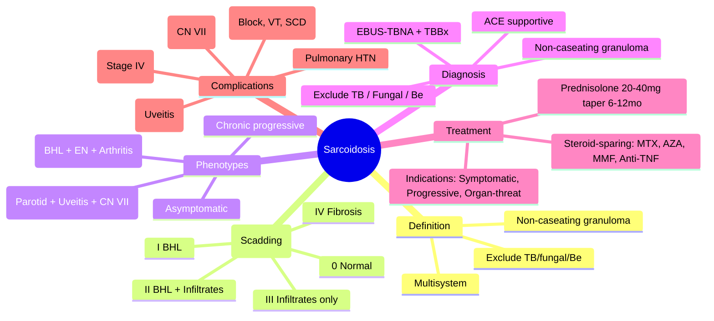

# Sarcoidosis

Related: [[ILD framework]], [[Connective tissue disease-associated ILD]], [[Hypersensitivity pneumonitis]], [[TB]], [[Lymphoma]], [[Pneumoconiosis]], [[Silicosis]], [[Berylliosis]], [[Löfgren's syndrome]], [[Heerfordt's syndrome]]

> [!important]
> **Sarcoidosis** = multisystem **granulomatous disorder** of unknown aetiology, characterised by **non-caseating granulomas**. **Lungs involved in >90%**. **Peak age 20–40**, slight female predominance, higher in Black populations. Key FCPS/MRCP: **Clinical phenotypes** (Löfgren's, Heerfordt's, asymptomatic radiographic), **Chest X-ray staging** (0–IV), **ACE level** (supportive, not diagnostic), **Tissue diagnosis** (non-caseating granuloma + exclusion of TB/fungal), **Treatment indications** (symptomatic, progressive, organ-threatening), **First-line prednisolone**, **Steroid-sparing agents** (methotrexate, azathioprine, mycophenolate, anti-TNF), **Pulmonary hypertension** complication.

## Learning Objectives
- Recognise **clinical presentations** (asymptomatic radiographic, Löfgren's, Heerfordt's, chronic progressive)
- Apply **CXR staging** (0–IV) and correlate with prognosis
- Interpret **serum ACE** (sensitivity 60%, specificity 70%; not diagnostic)
- Obtain **tissue diagnosis** (non-caseating granuloma + exclusion of TB/fungal/berylliosis)
- Determine **treatment indications** (symptomatic, progressive lung function decline, hypercalcaemia, neurosarcoid, cardiac, ocular)
- Prescribe **first-line prednisolone** (dose, taper schedule) and **steroid-sparing agents**
- Monitor **treatment response** (symptoms, PFTs, CXR, ACE, calcium)
- Recognise **complications** (pulmonary fibrosis, pulmonary hypertension, cardiac sarcoid, neurosarcoid)

## Definition
**Sarcoidosis** = systemic **granulomatous disease** of unknown cause, defined by **histological presence of non-caseating epithelioid granulomas** in affected organs, with **exclusion of infectious (TB, fungal) and other granulomatous causes** (berylliosis, GPA, Crohn's).

**Epidemiology**: Peak incidence **20–40 years**, second peak >60 (women); **female predominance**; **higher incidence and severity in Black populations** (especially African-American, Afro-Caribbean); **familial clustering** (HLA-DRB1*1101, BTNL2).

## Core Anatomy / Pathophysiology
### Granuloma Formation
1. **Antigen exposure** (unknown — microbial, environmental, self) → **macrophage activation**
2. **CD4+ Th1 polarisation** → **IFN-γ, IL-2, TNF-α** → **macrophage → epithelioid cell transformation**
3. **Epithelioid cells fuse** → **multinucleated giant cells** (Langhans type)
4. **Lymphocytic cuff** (CD4+ T-cells) surrounds granuloma
5. **Fibrosis** (late) → collagen deposition by fibroblasts

### Key Immunology
- **Th1 dominance**: IFN-γ, IL-2, TNF-α, IL-12, IL-18
- **CD4/CD8 ratio** ↑ in BAL fluid (>3.5:1 supportive)
- **Regulatory T-cell (Treg) dysfunction** → persistent inflammation
- **Genetic susceptibility**: HLA class II (DRB1*1101, DRB1*1301), BTNL2, ANXA11, NFKB1

### Organ Involvement Frequency
| Organ | Frequency | Typical Manifestations |
|-------|-----------|------------------------|
| **Lungs** | >90% | Bilateral hilar lymphadenopathy (BHL), parenchymal nodules, fibrosis |
| **Skin** | 20–35% | Erythema nodosum, lupus pernio, plaques, maculopapular, scars |
| **Eyes** | 20–30% | **Uveitis** (anterior > posterior), conjunctival nodules |
| **Liver** | 50–80% (biopsy) | Granulomas, usually asymptomatic; rarely portal hypertension |
| **Spleen** | ~50% | Splenomegaly |
| **Heart** | 5–25% (autopsy) | **Conduction defects**, arrhythmias, cardiomyopathy, HF |
| **Nervous** | 5–10% | **Cranial nerve palsies** (VII most common), meningitis |
| **Kidney** | <5% | Hypercalcaemia, nephrocalcinosis, granulomatous interstitial nephritis |
| **Bone** | <5% | Lytic lesions (phalanx), dactylitis |
| **Joints** | 10–15% | Acute arthritis (Löfgren's), chronic arthralgia |

## Normal Values / Important Cut-offs
### CXR Staging (Scadding Classification) — **Prognostic**
| Stage | Findings | Spontaneous Remission | Progression to Fibrosis |
|-------|----------|----------------------|------------------------|
| **0** | Normal CXR | ~90% | Rare |
| **I** | **Bilateral hilar lymphadenopathy (BHL)** | **~70%** | Low |
| **II** | **BHL + parenchymal infiltrates** | ~50% | Moderate |
| **III** | **Parenchymal infiltrates only** (no BHL) | ~30% | Higher |
| **IV** | **Pulmonary fibrosis** (honeycombing, volume loss, retraction) | **Rare** | Established |

> **FCPS/MRCP tip**: **Stage 0/I** = excellent prognosis; **Stage II/III** = intermediate; **Stage IV** = irreversible fibrosis, poor prognosis.

### ACE Level
- **Sensitivity ~60%**, **Specificity ~70%** (not diagnostic)
- **Elevated in 60% active pulmonary sarcoidosis**
- **False +**: Gaucher's, leprosy, TB, silicosis, hyperthyroidism, diabetes, pregnancy
- **False -**: Inactive disease, steroid treatment, early disease
- **Use**: Supportive, monitoring (trends correlate with activity)

### Calcium
- **Hypercalcaemia** ~10% (↑ 1,25-(OH)2 Vit D by granuloma macrophages)
- **Hypercalciuria** ~30% (nephrolithiasis risk)
- **Check**: Corrected calcium, PTH (suppressed), 1,25 Vit D (↑), 25 Vit D (normal/low)

### Pulmonary Function Tests (PFTs)
| Pattern | Stage Correlation |
|---------|-------------------|
| **Normal** | Stage 0, I |
| **Restrictive** (↓ TLC, ↓ FVC, normal FEV1/FVC) | Stage II, III, IV |
| **Obstructive** (rare, endobronchial) | Advanced |
| **↓ DLCO** (disproportionate) | Early marker of gas exchange impairment |

### HRCT Findings
| Pattern | Description |
|---------|-------------|
| **Perilymphatic nodules** | Along fissures, bronchoovascular bundles, subpleural, septa — **CLASSIC** |
| **Upper/mid zone predominance** | Typical |
| **BHL** | Symmetrical, discrete (1-1.5 cm) |
| **Fibrosis** | Stage IV: honeycombing, traction bronchiectasis, volume loss |
| **Galaxy sign** | Cluster of perilymphatic nodules |
| **Lymphadenopathy** | Mediastinal, hilar (often calcified late) |

## Classification
### Clinical Phenotypes
| Phenotype | Features | Prognosis |
|-----------|----------|-----------|
| **Asymptomatic radiographic** | Incidental BHL, normal PFTs | Excellent (often spontaneous remission) |
| **Löfgren's syndrome** | **Acute**: BHL + **erythema nodosum** + **fever** + **ankle arthritis** (± uveitis) | **Excellent** (>90% remission in 2 years) |
| **Heerfordt's syndrome** | **Uveoparotid fever**: parotid enlargement + uveitis + facial nerve palsy + fever | Good |
| **Chronic progressive** | Insidious dyspnoea, cough, fatigue, extrapulmonary | Variable (risk of fibrosis) |
| **Cardiac sarcoid** | Conduction defects, arrhythmias, HF | Serious (sudden death risk) |
| **Neurosarcoid** | Cranial nerve palsies, meningitis, hypothalamic | Serious |
| **Asymptomatic hypercalcaemia** | Incidental finding | Depends on renal involvement |

### Extra-pulmonary "Red Flag" Presentations
- **Cardiac**: Syncope, palpitations, HF, conduction defects (AV block, VT) — **ECG, Holter, MRI, PET mandatory**
- **Neurological**: Cranial nerve palsies (VII), meningitis, seizures, diabetes insipidus
- **Ocular**: Uveitis (pain, photophobia, floaters) — **slit-lamp essential**
- **Renal**: Nephrolithiasis, renal impairment (hypercalcaemia)

## Etiology / Causes
### Unknown Aetiology
- **Multifactorial**: Genetic susceptibility + environmental trigger(s)
- **Candidate triggers**: *Mycobacterium* (DNA/RNA in granulomas), *Propionibacterium acnes*, environmental antigens (mould, pesticides), silica
- **Not infectious** (non-transmissible, non-caseating granulomas)
- **Not malignant** (but lymphoma risk slightly ↑)

### Risk Factors
- **Age 20–40** (peak)
- **Female sex** (slight)
- **Black ethnicity** (higher incidence, severity, chronicity)
- **Family history** (5% first-degree relatives)
- **Occupational**: Firefighters, navy, agriculture, pesticides, mould exposure
- **HLA associations**: DRB1*1101 (protection?), DRB1*1301 (susceptibility), BTNL2

## Clinical Features
### Respiratory
- **Dry cough** (most common)
- **Exertional dyspnoea** (progressive)
- **Chest discomfort** (vague)
- **Haemoptysis** (rare, endobronchial involvement)

### Constitutional
- **Fatigue** (very common, multifactorial)
- **Weight loss** (active disease)
- **Low-grade fever** (active granulomatous inflammation)
- **Night sweats**

### Löfgren's Syndrome (Acute, Good Prognosis)
- **Triad**: **BHL + Erythema nodosum + Ankle arthritis** (often bilateral, symmetric)
- **Fever**, malaise
- **Erythema nodosum**: Tender, red nodules on anterior shins (± arms)
- **Arthritis**: Periarticular swelling, ankles > knees > wrists
- **Often self-limiting** (weeks-months), >90% remission

### Heerfordt's Syndrome (Uveoparotid Fever)
- **Parotid enlargement** (bilateral, painless)
- **Uveitis** (anterior, painful, photophobia)
- **Facial nerve palsy** (often bilateral)
- **Low-grade fever**

### Cardiac Sarcoidosis (Screen ALL)
- **Conduction defects**: AV block (1st, 2nd, 3rd), RBBB, LBBB
- **Arrhythmias**: VT (monomorphic, often RV outflow), AF
- **Heart failure**: Cardiomyopathy (LV/RV)
- **Sudden death risk** (VT/VF)
- **Screening**: **ECG, 24h Holter, Echo, Cardiac MRI (LGE), FDG-PET**

### Neurosarcoidosis
- **Cranial nerve palsies**: **CN VII** (facial, often bilateral), II, III, IV, VI, VIII
- **Meningitis** (chronic, lymphocytic)
- **Hypothalamic**: Diabetes insipidus, hyperprolactinaemia
- **Peripheral neuropathy** (rare)

### Ocular Sarcoidosis
- **Uveitis**: **Anterior** (iritis, anterior chamber cells, synechiae) > posterior (vitritis, retinal periphlebitis)
- **Conjunctival nodules** (yellowish, at limbus)
- **Lacrimal gland enlargement** (sicca)

### Skin
- **Erythema nodosum** (acute, tender, shins) — **Löfgren's**
- **Lupus pernio** (chronic, violaceous plaques, nose/cheeks/ears) — chronic, poor prognosis
- **Scar sarcoidosis** (activity in old scars)
- **Maculopapular, plaques, subcutaneous nodules**

## Investigations
### 1. Tissue Diagnosis (Gold Standard)
**Principle**: **Non-caseating granuloma** + **exclusion of TB/fungal/berylliosis**
| Site | Yield | Method |
|------|-------|--------|
| **Endobronchial ultrasound (EBUS-TBNA)** | **80–90%** (mediastinal nodes) | Outpatient, low risk |
| **Endobronchial biopsy** | 40–70% (if visible) | Bronchoscopy |
| **Transbronchial biopsy (TBBx)** | 60–80% (parenchymal) | Bronchoscopy (radial EBUS guidance) |
| **EBUS + TBBx combined** | **>90%** | Preferred first-line |
| **CT-guided percutaneous biopsy** | 90% (peripheral) | If central nodes inaccessible |
| **Mediastinoscopy** | >95% | Surgical, if EBUS negative/non-diagnostic |
| **Skin/Conjunctival/Node biopsy** | High (if accessible) | Minor procedure |
| **Lung biopsy (VATS)** | >95% | If diagnosis uncertain, fibrosis assessment |

**Exclusion studies on tissue**: **AFB stain/culture** (TB), **fungal stain/culture**, **beryllium lymphocyte proliferation test (BeLPT)** if exposure.

### 2. Imaging
**CXR (PA erect)** — **Staging (Scadding 0–IV)**
**HRCT** — Perilymphatic nodules, BHL, fibrosis assessment, complications
**Cardiac MRI** (LGE pattern: mid-myocardial, basal septum/inferolateral) — **Cardiac sarcoid gold standard**
**FDG-PET/CT** — Activity assessment, occult sites, cardiac (with fasting prep)

### 3. Pulmonary Function Tests
- **Restrictive pattern** (↓ TLC, ↓ FVC, normal ratio)
- **↓ DLCO** (early, disproportionate)
- **Serial PFTs** for monitoring (3–6 monthly if active)

### 4. Laboratory
- **Serum ACE** (supportive, trend monitoring)
- **Calcium** (corrected), **PTH** (suppressed), **1,25 Vit D** (↑), **25 Vit D**
- **FBC, U&E, LFT, CRP, ESR**
- **BAL** (if bronchoscopy): **Lymphocytosis >20%**, **CD4/CD8 >3.5:1** (supportive)
- **72h urinary calcium** (hypercalciuria)
- **Ophthalmology**: Slit-lamp (all patients)
- **Cardiac**: ECG, 24h Holter, Echo (all); MRI/PET if abnormal or symptoms

### 5. Screening for Exclusion
- **TB**: CXR, AFB (sputum ×3), IGRA/TST (but IGRA can be false - in sarcoid)
- **Fungal**: Serology, culture (if endemic)
- **Berylliosis**: BeLPT (if occupational exposure)

## Interpretation Frameworks
### 1. Diagnostic Criteria (Consensus)
**Definite**: Histology (non-caseating granuloma) + clinical/radiological compatibility + exclusion of alternatives
**Probable**: Compatible clinical/radiological + elevated ACE + BAL lymphocytosis/CD4:8 >3.5 + exclusion (no histology)
**Possible**: Clinical/radiological compatible + exclusion (no tissue, no ACE/BAL)

### 2. Staging & Prognosis
| Stage | Remission Rate | Treatment Usually Needed |
|-------|----------------|--------------------------|
| **0/I** | 80–90% | Rare (observation) |
| **II** | 50–60% | ~50% (symptomatic/progressive) |
| **III** | 30–40% | Often (symptomatic/progressive) |
| **IV** | <10% | Always (fibrosis management) |

### 3. Treatment Indications (BTS/ERS/ATS)
| "Must Treat" | "Consider Treat" | "Observe" |
|--------------|------------------|-----------|
| Symptomatic (dyspnoea, cough) | Asymptomatic but progressive PFT decline | Asymptomatic Stage 0/I |
| **Progressive PFT decline** (>10% FVC/DLCO drop) | Hypercalcaemia/calciuria | Stable Stage II/III with normal PFTs |
| **Organ-threatening**: Cardiac, neurosarcoid, ocular (severe), renal | Severe skin (lupus pernio) | Löfgren's (usually self-limiting) |
| Pulmonary hypertension | | |

### 4. Treatment Response Criteria
| Domain | Response Definition |
|--------|---------------------|
| **Symptoms** | Improvement in dyspnoea, cough, fatigue |
| **PFTs** | **FVC ↑ ≥10%** or **DLCO ↑ ≥15%** |
| **Imaging** | **CXR/HRCT improvement** (reduction in nodules, BHL) |
| **ACE** | **Normalisation** (if initially elevated) |
| **Calcium** | Normalisation |

## Diagnosis
**Multidisciplinary approach**:
1. **Clinical suspicion** (age, symptoms, CXR BHL ± parenchymal)
2. **Exclude mimics** (TB, fungal, lymphoma, berylliosis, GPA, CTD)
3. **Tissue confirmation** (EBUS-TBNA + TBBx preferred) → non-caseating granuloma
4. **Exclude TB/fungal** (stains, cultures, PCR on tissue/BAL)
5. **Staging** (CXR Scadding 0–IV, HRCT, PFTs)
5. **Organ screening** (eyes, heart, nerves, kidneys, skin, liver, calcium)
6. **Assess treatment need** (symptoms, progression, organ threat)

## Differential Diagnosis
| Mimic | Key Differentiators |
|-------|---------------------|
| **TB** | **Caseating granuloma**, AFB +ve, culture +ve, IGRA +ve, constitutional symptoms, apical |
| **Fungal** (histo, cocci, blastomyces) | Endemic area, **caseating/non-caseating**, culture +ve, serology |
| **Lymphoma** | **Malignant cells**, flow cytometry, FDG-PET (high SUV), B symptoms |
| **Berylliosis** | **Occupational exposure**, **BeLPT +ve**, identical histology |
| **GPA/EGPA** | **ANCA +ve**, vasculitis features (renal, sinus, neuropathy), necrotising granuloma |
| **CTD-ILD** (RA, Sjögren's, SSc) | **Autoantibodies** (RF, CCP, ANA, Scl-70), joint/skin features |
| **Hypersensitivity pneumonitis** | **Exposure history**, centrilobular nodules, BAL lymphocytosis (CD4/CD8 often <1) |
| **Pneumoconiosis** (silicosis, coal) | **Occupational history**, upper lobe fibrosis, eggshell calcification (silicosis) |
| **IgG4-related disease** | **IgG4+ plasma cells**, storiform fibrosis, elevated serum IgG4, multi-organ |

## Management
### 1. First-Line: Prednisolone
| Scenario | Dose | Duration |
|----------|------|----------|
| **Pulmonary (symptomatic/progressive)** | **20–40 mg/day** (0.5 mg/kg) | **4–8 weeks** then taper |
| **Severe/Organ-threatening** (cardiac, neuro, ocular) | **40–60 mg/day** (1 mg/kg) | **4–8 weeks** then slow taper |
| **Löfgren's** (if severe symptoms) | **20–30 mg/day** | **2–4 weeks** (often self-limiting) |
| **Hypercalcaemia** | **20–40 mg/day** | Until normocalcaemic |

**Taper Schedule** (example 40 mg start):
- 40 mg × 4 weeks → 30 mg × 2w → 20 mg × 2w → 15 mg × 2w → 10 mg × 2w → 5 mg × 2w → stop
- **Total duration typically 6–12 months** (chronic sarcoid); **shorter for Löfgren's**

**Monitoring on steroids**: Weight, BP, glucose, bone density (DEXA), eyes (cataract/glaucoma), infection risk

### 2. Steroid-Sparing Agents (Refractory, Relapse, Steroid Toxicity)
| Agent | Dose | Monitoring | Key Adverse Effects |
|-------|------|------------|---------------------|
| **Methotrexate** | **10–25 mg/week** (folic acid 5 mg weekly) | FBC, LFT monthly | Hepatotoxicity, pneumonitis, myelosuppression |
| **Azathioprine** | **1.5–2.5 mg/kg/day** (TPMT test) | FBC, LFT monthly | Myelosuppression, hepatotoxicity, pancreatitis |
| **Mycophenolate** | **1–1.5 g BD** | FBC, LFT monthly | GI, myelosuppression, teratogenic |
| **Anti-TNF** (Infliximab 3–5 mg/kg, Adalimumab 40 mg SC q2w) | **Refractory cardiac/neuro/lupus pernio** | Infection screen (TB, hepatitis), LFT | Infections, infusion reactions, demyelination |
| **Hydroxychloroquine** | 200–400 mg/day | Eyes (retinopathy) | Retinopathy, GI |
| **Leflunomide** | 10–20 mg/day | BP, LFT, FBC | Hepatotoxicity, hypertension, teratogenic |

### 3. Specific Organ Management
| Organ | Management |
|-------|------------|
| **Cardiac** | **High-dose steroids** (1 mg/kg), **ICD** for VT/syncope, **anti-arrhythmics**, **pacing** for AV block, **anti-TNF** (infliximab) if refractory |
| **Neurosarcoid** | **High-dose steroids**, **methotrexate/azathioprine**, **anti-TNF** (infliximab) |
| **Ocular (uveitis)** | **Topical steroids** (prednisolone drops), **systemic if posterior/severe**, **immunosuppressants** (methotrexate, anti-TNF) |
| **Hypercalcaemia** | **Steroids** + hydration + bisphosphonates (if severe) |
| **Pulmonary hypertension** | **PAH-specific therapy** (ERA, PDE5i, prostacyclin) + steroids if active sarcoid |
| **Skin (lupus pernio)** | **Anti-TNF** (infliximab/adalimumab) + methotrexate |
| **Fatigue** | Non-pharmacological (graded exercise, CBT), treat active inflammation, exclude anaemia/thyroid/depression |

### 4. Advanced/Refractory
- **Lung transplantation** (end-stage fibrosis, selective)
- **Anti-fibrotics** (nintedanib, pirfenidone) — **if progressive fibrotic phenotype** (INBUILD trial extrapolation)
- **JAK inhibitors** (emerging)

## Drug Interactions / Contraindications / Cautions
### Steroids
- **Diabetes** (monitor glucose, adjust OHAs/insulin)
- **Osteoporosis** (DEXA, calcium/vitamin D, bisphosphonate if >3 months)
- **Infection risk** (screen TB, hepatitis, HIV before high-dose)
- **Psychiatric** (mood changes, psychosis)
- **Cataract/glaucoma** (ophthalmology review)

### Methotrexate
- **Folic acid 5 mg weekly** (reduce mucositis, hepatotoxicity)
- **Avoid in pregnancy** (teratogenic)
- **Renal/hepatic impairment** (dose adjust/avoid)
- **Alcohol** (avoid)

### Anti-TNF (Infliximab/Adalimumab)
- **Screen TB (IGRA, CXR), Hepatitis B/C, HIV** before starting
- **Avoid live vaccines**
- **Monitor infections** (reactivation TB, hepatitis, fungal)
- **Malignancy risk** (lymphoma, skin)

## Procedures
### EBUS-TBNA (Preferred Tissue Sampling)
1. **Conscious sedation** (midazolam ± fentanyl) or GA
2. **Convex EBUS scope** → identify stations 4R, 4L, 7, 10, 11
2. **22G needle** → 3–5 passes per node → **ROSE** (rapid on-site evaluation)
3. **Samples**: Cytology, cell block (IHC), **AFB/fungal culture**, **flow cytometry** (lymphoma)
4. **Post-procedure**: Observe 2h, CXR if transbronchial biopsy also done

### Cardiac MRI (Late Gadolinium Enhancement)
- **Pattern**: **Mid-myocardial / subepicardial LGE**, basal septum, inferolateral wall (non-ischaemic)
- **T1/T2 mapping** for active inflammation (oedema)

## Complications
### Disease-Related
- **Pulmonary fibrosis** (Stage IV) → chronic respiratory failure
- **Pulmonary hypertension** (vascular obliteration, fibrosis, compression) → RV failure
- **Cardiac sarcoid** → AV block, VT, sudden death, HF
- **Neurosarcoid** → cranial nerve palsies, meningitis, DI
- **Renal** → nephrolithiasis, nephrocalcinosis, CKD
- **Ocular** → glaucoma, cataract, blindness (uveitis)
- **Malignancy risk** ↑ (lymphoma, lung cancer)

### Treatment-Related
- **Steroid**: Osteoporosis, diabetes, cataract, glaucoma, infection, avascular necrosis, myopathy
- **Methotrexate**: Hepatotoxicity, pneumonitis, myelosuppression
- **Anti-TNF**: Infections (TB reactivation), demyelination, malignancy

## Red Flags / Emergencies
- **Cardiac**: Syncope, VT, high-degree AV block → **ICD, pacing, high-dose steroids, anti-TNF**
- **Neurological**: Acute cranial nerve palsy, seizures, confusion → **high-dose IV steroids (methylprednisolone 500–1000 mg ×3–5 days) + cyclophosphamide/anti-TNF**
- **Ocular**: Acute vision loss, severe pain → **urgent ophthalmology + systemic steroids**
- **Hypercalcaemic crisis** (>3.0 mmol/L) → **IV fluids, furosemide, steroids, bisphosphonates**
- **Massive haemoptysis** (rare) → BAE

## Special Situations
### Pregnancy
- **Steroids safe** (prednisolone preferred, crosses placenta minimally)
- **Methotrexate, mycophenolate, leflunomide** **CONTRAINDICATED**
- **Azathioprine, hydroxychloroquine, anti-TNF (certolizumab preferred)** — compatible
- **ACE** unreliable in pregnancy
- **Breastfeeding**: Prednisolone, azathioprine, hydroxychloroquine compatible

### Löfgren's Syndrome
- **Self-limiting** (weeks–months)
- **NSAIDs** for arthritis/fever
- **Steroids** only if severe (prednisolone 20–30 mg ×2–4 weeks)
- **Excellent prognosis** (>90% remission)

### Asymptomatic Stage 0/I
- **Observation** (CXR, PFTs, ACE at 3–6 months)
- **No treatment** unless progression

### Cardiac Sarcoidosis Screening (ALL patients)
- **ECG, 24h Holter, Echo** — baseline for all
- **Cardiac MRI (LGE)** / **FDG-PET** if abnormal screen or symptoms

## Prognosis
| Factor | Good | Poor |
|--------|------|------|
| **Stage** | 0, I, Löfgren's | III, IV, chronic progressive |
| **Race** | White | Black (more chronic, severe) |
| **Phenotype** | Löfgren's, asymptomatic | Lupus pernio, cardiac, neuro, fibrosis |
| **ACE** | Normalises | Persistently elevated |
| **PFTs** | Stable/improving | Progressive decline |
| **Treatment response** | Rapid | Steroid-refractory |

**Overall**: ~60% remit within 2–5 years; ~30% chronic; ~10% progressive fibrosis; **mortality 1–5%** (cardiac, pulmonary fibrosis, pulmonary hypertension)

## Topic Correlation
- [[ILD framework]] — diagnostic approach
- [[Connective tissue disease-associated ILD]] — differential
- [[Hypersensitivity pneumonitis]] — differential
- [[TB]] — differential exclusion
- [[Lymphoma]] — differential exclusion
- [[Pneumoconiosis]] — differential
- [[Pulmonary hypertension]] — complication
- [[Cardiac sarcoid]] — critical complication

## FCPS/MRCP High-Yield Points
1. **Sarcoidosis** = non-caseating granulomas, unknown cause, multisystem, peak 20–40, Black > White
2. **CXR Staging (Scadding)**: 0 normal, **I BHL**, **II BHL + infiltrates**, **III infiltrates only**, **IV fibrosis** → prognosis worsens with stage
3. **ACE**: 60% sensitivity, 70% specificity — **supportive, not diagnostic**; trend monitoring
4. **Diagnosis**: **Non-caseating granuloma on biopsy + exclusion of TB/fungal/berylliosis**
5. **EBUS-TBNA + TBBx** = preferred tissue sampling (>90% yield)
6. **Löfgren's**: BHL + erythema nodosum + ankle arthritis + fever → **excellent prognosis**, NSAIDs ± short steroids
6. **Heerfordt's**: Uveoparotid fever (parotid + uveitis + facial palsy)
7. **Screen ALL for cardiac**: ECG, Holter, Echo; MRI/PET if abnormal
7. **Treatment indications**: Symptomatic, progressive PFT decline, hypercalcaemia, organ-threatening (cardiac, neuro, ocular, renal)
8. **First-line**: Prednisolone 20–40 mg/day, taper over 6–12 months
8. **Steroid-sparing**: Methotrexate (1st), azathioprine, mycophenolate, anti-TNF (infliximab/adalimumab)
9. **Complications**: Fibrosis (Stage IV), pulmonary hypertension, cardiac (AV block, VT, sudden death), neuro, ocular
10. **Always exclude TB/fungal/berylliosis** before diagnosing sarcoidosis

## Common Viva Questions
1. CXR staging (Scadding) and prognosis
2. ACE level utility and limitations
3. Diagnostic criteria (histology + exclusion)
6. Löfgren's vs Heerfordt's syndrome
7. Cardiac sarcoidosis screening and management
8. Treatment indications and steroid taper
6. Steroid-sparing agents (methotrexate, anti-TNF)
7. Differential diagnosis (TB, lymphoma, berylliosis, GPA, HP)
8. Complications (fibrosis, PH, cardiac, neuro)
9. Löfgren's vs chronic sarcoidosis

## Common Confusions / Exam Traps
- **ACE = diagnostic** — NO (60% sens, 70% spec; supportive only)
- **Löfgren's = needs long steroids** — NO (NSAIDs ± short course, self-limiting)
- **ACE normal = no sarcoidosis** — NO (false - in inactive, treated, early)
- **CXR normal = no sarcoidosis** — NO (Stage 0 exists, also isolated extra-pulmonary)
- **All Stage II/III need steroids** — NO (only if symptomatic/progressive/organ threat)
- **Cardiac sarcoid rare** — NO (5–25% autopsy, screen ALL)
- **Anti-TNF first-line** — NO (steroid-refractory/organ-threatening only)
- **BAL CD4/CD8 >3.5 = diagnostic** — NO (supportive only; can be low in chronic/fibrotic)

## Mnemonics
- **SCADDING STAGES**: **S**tage 0 = **S**tart (normal); **I** = **I**sland (BHL only); **II** = **I**nfiltrates + island; **III** = **I**nfiltrates only; **IV** = **I**rreversible fibrosis
- **LÖFGREN'S**: **L** = **L**ymphadenopathy (BHL); **Ö** = **Ö**edema (ect erythema nodosum); **F** = **F**ever; **G** = **G**out-like (ankle arthritis); **R** = **R**esolution (excellent prognosis)
- **HEERFORDT'S**: **H** = **H**eerfordt; **E** = **E**yes (uveitis); **E** = **E**ars (parotid); **R** = **R**espiratory (BHL); **F** = **F**acial nerve; **O** = **O**u uveoparotid fever
- **ACE**: **A**pproximately 60% **S**ensitivity, 70% **E**specificity = **AS**E
- **CARDIAC SARCOID**: **C**onduction defects, **A**rrhythmias (VT), **R**ight heart failure, **D**ilated cardiomyopathy, **I**CD indication, **A**nti-TNF, **C**ardiac MRI

## Mind Map


## Flowchart
```mermaid
flowchart TD
    A[Suspected Sarcoidosis\nYoung adult, BHL ± infiltrates, fatigue] --> B[Exclude TB/Fungal/Be\nAFB, culture, IGRA, BeLPT]
    B --> C[EBUS-TBNA + TBBx\nNon-caseating granuloma?]
    C -- YES --> D[SARCOIDOSIS CONFIRMED]
    C -- NO --> E[Clinical + ACE + BAL + Imaging\nProbable/Possible]
    D --> F[Staging CXR (Scadding 0-IV)]
    F --> G[Organ Screening\nEyes, Heart, Nerves, Kidney, Skin, Calcium]
    F --> H[Treatment Indicated?]
    H -- YES (Symptomatic/Progressive/Organ-threat) --> I[Prednisolone 20-40mg/day\nTaper 6-12mo]
    H -- NO (Asymptomatic Stage 0/I) --> J[Observe\nCXR/PFT/ACE q3-6mo]
    I --> K{Response}
    K -- YES --> L[Taper → Steroid-sparing if needed\nMTX, AZA, MMF, Anti-TNF]
    K -- NO (Refractory) --> M[Steroid-sparing +/− Anti-TNF\nCardiac/Neuro: High-dose + Anti-TNF]
    J --> N{Progression?}
    N -- YES --> I
    N -- NO --> O[Continue Observe]
```

## Suggested Visuals / Image Notes
- CXR Stages 0–IV
- HRCT: perilymphatic nodules, galaxy sign, BHL
- Cardiac MRI LGE pattern
- Löfgren's: erythema nodosum, ankle swelling
- Heerfordt's: parotid enlargement, uveitis
- Lupus pernio
- Treatment algorithm

## Suggested Video References
- BTS/ERS/ATS Sarcoidosis guidelines
- EBUS-TBNA for sarcoidosis
- Cardiac sarcoidosis MRI/PET
- Löfgren's syndrome
- Anti-TNF in refractory sarcoidosis
- Sarcoidosis-associated PH

## One-Page Revision Summary
- **Sarcoidosis** = non-caseating granuloma, multisystem, unknown cause
- **CXR Stages**: 0 normal, I BHL, II BHL+infiltrates, III infiltrates only, IV fibrosis
- **Prognosis**: Stage 0/I excellent, II/III intermediate, IV poor
- **ACE**: 60% sens, 70% spec — supportive, trend monitoring
- **Diagnosis**: Non-caseating granuloma + exclude TB/fungal/Be
- **EBUS-TBNA + TBBx** >90% yield
- **Löfgren's**: BHL + EN + ankle arthritis + fever → self-limiting, NSAIDs
- **Heerfordt's**: Parotid + uveitis + CN VII palsy
- **Screen ALL for cardiac**: ECG, Holter, Echo → MRI/PET if +
- **Treat if**: Symptomatic, progressive PFT, hypercalcaemia, organ-threat
- **Prednisolone 20-40mg** taper 6-12mo
- **Steroid-sparing**: MTX, AZA, MMF, Anti-TNF (infliximab)
- **Complications**: Fibrosis, PH, Cardiac (AV block, VT), Neuro, Ocular

## 24-Hour Recall Prompts
- Scadding stages 0-IV
- Löfgren's features
- Heerfordt's features
- ACE sensitivity/specificity
- Diagnosis requirements
- Treatment indications
- Steroid taper
- Cardiac screening
- Complications

## 7-Day / 15-Day / 30-Day Revision Tracker
- [ ] Day 1 completed
- [ ] 24-hour recall completed
- [ ] Day 7 revision completed
- [ ] Day 15 revision completed
- [ ] Day 30 revision completed

## Must Know / Should Know / Nice to Know
### Must Know
- Scadding stages 0–IV and prognosis
- Non-caseating granuloma + exclusion = diagnosis
- ACE limitations (supportive only)
- Löfgren's and Heerfordt's phenotypes
- Cardiac screening (ALL patients)
- Treatment indications and prednisolone taper
- Steroid-sparing agents (MTX, AZA, anti-TNF)
- Complications: fibrosis, PH, cardiac, neuro, ocular

### Should Know
- Löfgren's vs Heerfordt's distinction
- Cardiac MRI LGE pattern
- Anti-TNF indications (cardiac, neuro, lupus pernio)
- Hypercalcaemia mechanism (1,25 Vit D)
- BAL CD4/CD8 ratio (supportive)
- Pregnancy management

### Nice to Know
- Genetic associations (HLA, BTNL2)
- IgG4-related disease differential
- Anti-fibrotics in sarcoid fibrosis (nintedanib)
- JAK inhibitors emerging
- Cost-effectiveness of screening
- Long-term QoL outcomes

## Self-Test Scorecard
- Understanding: /10
- Recall: /10
- MCQ Performance: /10
- SBA Performance: /10
- Viva Confidence: /10
- Total: /50

> [!tip]
> Interpretation: <35 = weak topic, 35-44 = acceptable but insecure, 45+ = strong exam-ready topic.

## Exam Answer Modes
### Long Answer Skeleton
- Definition, epidemiology, aetiology
- Clinical phenotypes (asymptomatic, Löfgren's, Heerfordt's, chronic)
- CXR Scadding staging with prognosis table
- Diagnostic pathway (imaging → tissue → exclusion)
- ACE utility and limitations
- Organ involvement and screening (eyes, heart, nerves, kidneys, skin, calcium)
- Treatment indications and algorithms (prednisolone taper, steroid-sparing)
- Specific organ management (cardiac, neuro, ocular, hypercalcaemia, PH)
- Complications and prognosis

### Short Note Skeleton
- Definition + epidemiology box
- Scadding staging table
- Clinical phenotypes box
- Diagnostic algorithm flowchart
- ACE box
- Treatment algorithm
- Complications box

### Viva One-Liners
- "Sarcoidosis = non-caseating granulomas, multisystem, unknown cause, peak 20-40, Black > White"
- "Scadding: 0 normal, I BHL, II BHL+infiltrates, III infiltrates only, IV fibrosis — prognosis worsens"
- "ACE: 60% sens, 70% spec — supportive, NOT diagnostic; trend monitoring useful"
- "Diagnosis: Non-caseating granuloma on biopsy + exclusion of TB/fungal/berylliosis"
- "EBUS-TBNA + TBBx = preferred tissue sampling (>90% yield)"
- "Löfgren's = BHL + erythema nodosum + ankle arthritis + fever → self-limiting, NSAIDs"
- "Heerfordt's = parotid enlargement + uveitis + facial nerve palsy + fever"
- "Screen ALL for cardiac: ECG, Holter, Echo; MRI/PET if abnormal"
- "Treat if: symptomatic, progressive PFT decline, hypercalcaemia, organ-threat (cardiac, neuro, ocular, renal)"
- "Prednisolone 20-40mg/day, taper over 6-12 months"
- "Steroid-sparing: Methotrexate 1st, Azathioprine, Mycophenolate, Anti-TNF (infliximab/adalimumab)"
- "Complications: Fibrosis (Stage IV), Pulmonary HTN, Cardiac (AV block, VT, SCD), Neurosarcoid (CN VII), Uveitis"

### Ward-Case Discussion Points
- 28F Black, asymptomatic, CXR BHL, ACE 85 → Stage I, asymptomatic → observe, CXR/PFT/ACE q6mo
- 32M, acute fever, bilateral ankle swelling, tender shins, CXR BHL → Löfgren's → NSAIDs, observe, >90% remission
- 45F, dyspnoea, CXR Stage III, ACE 120, FVC 65% predicted, DLCO 55% → prednisolone 30mg taper 12mo, add methotrexate at 15mg for steroid-sparing
- 50M, syncope, CXR BHL, ECG: complete heart block → cardiac sarcoid → cardiac MRI LGE, ICD, high-dose steroids ± infliximab

### Last-Night-Before-Exam Sheet
- Sarcoid = non-caseating granuloma, multisystem
- Stages: 0 normal, I BHL, II BHL+infilt, III infilt, IV fibrosis
- ACE: 60% sens, 70% spec, trend monitoring
- Diagnosis: Granuloma + exclude TB/fungal/Be
- Löfgren's: BHL + EN + ankle arthritis = self-limiting
- Heerfordt's: Parotid + Uveitis + CN VII
- Screen ALL: Eyes, Heart, Nerves, Kidney, Calcium
- Treat: Symptomatic, Progressive, Organ-threat
- Pred 20-40mg taper 6-12mo
- Steroid-sparing: MTX, AZA, Anti-TNF
- Cardiac: Block, VT, MRI LGE
- Neuro: CN VII
- Ocular: Uveitis

## Summary
**Sarcoidosis** = multisystem **non-caseating granulomatous disease** of unknown aetiology. **Peak age 20–40**, female predominance, higher severity in Black populations. **CXR Scadding staging**: **0 normal**, **I BHL**, **II BHL + parenchymal infiltrates**, **III infiltrates only**, **IV fibrosis** — prognosis worsens with stage. **Clinical phenotypes**: **asymptomatic**, **Löfgren's syndrome** (BHL + erythema nodosum + ankle arthritis + fever — **excellent prognosis, self-limiting**), **Heerfordt's syndrome** (uveoparotid fever: parotid + uveitis + facial nerve palsy), **chronic progressive**. **Diagnosis**: **non-caseating granuloma on histology** + **exclusion of TB, fungal, berylliosis** (EBUS-TBNA + TBBx preferred, >90% yield). **ACE**: 60% sens, 70% spec — **supportive, not diagnostic**. **Screen ALL for cardiac** (ECG, Holter, Echo; MRI/PET if abnormal). **Treatment indications**: symptomatic, progressive PFT decline, hypercalcaemia, organ-threat (cardiac, neuro, ocular, renal). **First-line**: **prednisolone 20–40 mg/day**, taper over 6–12 months. **Steroid-sparing**: methotrexate (1st), azathioprine, mycophenolate, anti-TNF (infliximab/adalimumab). **Complications**: fibrosis (Stage IV), pulmonary hypertension, **cardiac sarcoid (AV block, VT, sudden death)**, neurosarcoid (CN VII palsy), uveitis.

## MCQs (10)
1. **Scadding Stage II** sarcoidosis on CXR shows:
   A. Normal CXR
   B. Bilateral hilar lymphadenopathy only
   C. **Bilateral hilar lymphadenopathy + parenchymal infiltrates**
   D. Parenchymal infiltrates only

2. **ACE level** in sarcoidosis — sensitivity and specificity:
   A. 90% / 90%
   B. 80% / 80%
   C. **60% / 70%**
   D. 40% / 60%

3. **Löfgren's syndrome** classic triad:
   A. BHL + uveitis + parotid enlargement
   B. **BHL + erythema nodosum + ankle arthritis** (often + fever)
   C. BHL + facial nerve palsy + uveitis
   D. BHL + hypercalcaemia + nephrolithiasis

3. **Definitive diagnosis** of sarcoidosis requires:
   A. Elevated ACE + BHL on CXR
   B. **Non-caseating granuloma on biopsy + exclusion of TB/fungal/berylliosis**
   C. BAL lymphocytosis + CD4/CD8 >3.5
   D. CXR Stage II + compatible symptoms

4. **Cardiac sarcoidosis screening** — recommended for:
   A. Only symptomatic patients
   B. Only Stage III/IV
   C. **ALL patients with sarcoidosis**
   D. Only Black patients

5. **First-line treatment** for symptomatic pulmonary sarcoidosis:
   A. Methotrexate
   B. **Prednisolone 20–40 mg/day**
   C. Anti-TNF (infliximab)
   D. Hydroxychloroquine

6. **Steroid-sparing agent** — first-line choice:
   A. Azathioprine
   B. Mycophenolate
   C. **Methotrexate**
   D. Anti-TNF

7. **Heerfordt's syndrome** (uveoparotid fever) includes:
   A. Parotid + uveitis + facial nerve palsy
   B. Parotid + erythema nodosum + arthritis
   C. Uveitis + facial palsy + hypercalcaemia
   D. Parotid + facial palsy + neuropathy

8. **Scadding Stage IV** represents:
   A. Normal CXR
   B. BHL only
   C. Parenchymal infiltrates only
   D. **Pulmonary fibrosis (honeycombing, volume loss)**

9. **Hypercalcaemia** in sarcoidosis — mechanism:
   A. PTH hypersecretion
   B. **Granuloma macrophages produce 1,25-(OH)2 Vitamin D**
   C. Bone metastases
   D. Renal failure

10. **Best tissue sampling method** for sarcoidosis (highest yield):
    A. Sputum cytology
    B. **EBUS-TBNA + transbronchial biopsy**
    C. CT-guided percutaneous biopsy
    D. Mediastinoscopy (first-line)

## SBA Questions (10)
1. A 28M Black, asymptomatic, CXR bilateral hilar lymphadenopathy, ACE 65. No symptoms. PFTs normal. Management?
   A. Prednisolone 20mg
   B. **Observation with CXR/PFT/ACE at 3–6 months**
   C. EBUS biopsy
   D. Methotrexate

2. A 30F, 2-week history fever, bilateral ankle swelling, tender red nodules on shins. CXR: BHL. Diagnosis?
   A. TB
   B. **Löfgren's syndrome**
   C. Rheumatic fever
   D. Sarcoidosis Stage II (treat with steroids)

3. A 45F sarcoidosis Stage III, dyspnoea, FVC 60% predicted, declining over 6 months. ACE 110. Best initial treatment?
   A. Observation
   B. **Prednisolone 30 mg/day taper over 12 months**
   C. Methotrexate 15 mg/week
   D. Infliximab

4. A 50M sarcoidosis, syncope. ECG: 3rd degree AV block. Echo: mild LV dysfunction. Next investigation?
   A. 24h Holter only
   B. **Cardiac MRI (LGE) + FDG-PET**
   C. Coronary angiography
   D. Electrophysiology study

5. A 35F Löfgren's syndrome (BHL + erythema nodosum + ankle arthritis). Management?
   A. Prednisolone 30mg ×3 months
   B. **NSAIDs for arthritis/fever; observe (self-limiting)**
   C. Methotrexate 10mg/week
   D. Hydroxychloroquine

6. Which organ manifestation is an ABSOLUTE indication for treatment?
   A. Asymptomatic hypercalciuria
   B. **Cardiac sarcoidosis (conduction defects/arrhythmias)**
   C. Asymptomatic splenomegaly
   C. Stage II on CXR

7. Anti-TNF (infliximab) in sarcoidosis — best indication:
   A. First-line for all
   B. **Refractory cardiac/neurosarcoid/lupus pernio**
   C. All Stage III/IV
   D. All Black patients

8. BAL CD4/CD8 ratio in sarcoidosis:
   A. **>3.5:1 (supportive, not diagnostic)**
   B. <1.0 (diagnostic)
   C. 1.5:1 (normal)
   D. Not useful

9. Löfgren's syndrome prognosis:
   A. 50% progress to chronic
   B. **>90% spontaneous remission within 2 years**
   C. Requires lifelong steroids
   D. 30% develop pulmonary fibrosis

10. Cardiac sarcoidosis MRI late gadolinium enhancement (LGE) pattern:
    A. Subendocardial (ischaemic)
    B. **Mid-myocardial / subepicardial, basal septum/inferolateral (non-ischaemic)**
    C. Diffuse transmural
    D. No LGE typically

## Flashcards
- Q: Scadding stages
  A: 0 normal, I BHL, II BHL+infilt, III infilt, IV fibrosis
- Q: ACE sens/spec
  A: 60%/70% (supportive only)
- Q: Löfgren's triad
  A: BHL + EN + ankle arthritis (+fever)
- Q: Heerfordt's
  A: Parotid + uveitis + CN VII palsy (+fever)
- Q: Diagnosis
  A: Non-caseating granuloma + exclude TB/fungal/Be
- Q: Cardiac screen
  A: ALL patients (ECG, Holter, Echo)
- Q: First-line treatment
  A: Prednisolone 20-40mg taper 6-12mo
- Q: Steroid-sparing 1st line
  A: Methotrexate
- Q: Anti-TNF indication
  A: Refractory cardiac/neuro/lupus pernio
- Q: Löfgren's prognosis
  A: >90% remission, self-limiting

## Answer Key with Explanations
### MCQs
1. **C** — Stage II = BHL + parenchymal infiltrates.
2. **C** — ACE sensitivity ~60%, specificity ~70%.
3. **B** — Löfgren's = BHL + erythema nodosum + ankle arthritis (+/- fever).
4. **B** — Definitive = histology (non-caseating granuloma) + exclusion of mimics.
5. **C** — Screen ALL patients (BTS/ERS/ATS consensus).
6. **B** — Prednisolone 20–40 mg/day is first-line for symptomatic disease.
7. **C** — Methotrexate is preferred first steroid-sparing agent.
8. **A** — Heerfordt's = uveoparotid fever: parotid + uveitis + facial nerve palsy.
9. **D** — Stage IV = pulmonary fibrosis (honeycombing, volume loss).
10. **B** — Granuloma macrophages express 1α-hydroxylase → ↑ 1,25 Vit D → hypercalcaemia.

### SBAs
1. **B** — Asymptomatic Stage I → observation (CXR/PFT/ACE q3–6mo).
2. **B** — Acute fever + EN + ankle arthritis + BHL = Löfgren's.
3. **B** — Progressive Stage III symptomatic → prednisolone 20-40mg taper 6-12mo.
4. **B** — AV block + LV dysfunction = cardiac sarcoid → MRI (LGE) + PET for activity.
5. **B** — Löfgren's = self-limiting, NSAIDs ± short steroids only if severe.
6. **B** — Cardiac sarcoid (conduction/arrhythmia) = absolute indication.
7. **B** — Anti-TNF reserved for refractory cardiac/neuro/lupus pernio.
8. **A** — CD4/CD8 >3.5 supportive (not diagnostic; can be low in chronic).
9. **B** — Löfgren's >90% spontaneous remission.
10. **B** — Cardiac sarcoid LGE: mid-myocardial/subepicardial, basal septum/inferolateral (non-ischaemic).

### Flashcards
All correct as written.

---
