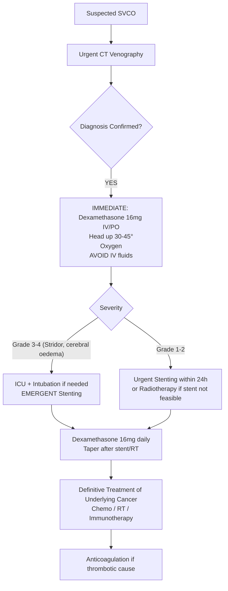

# Superior Vena Cava Obstruction (SVCO)

Related: [[Lung cancer]], [[Mesothelioma]], [[Lymphoma]], [[Thrombosis]], [[Thoracic Malignancy]], [[Pancoast tumor]], [[Superior mediastinal syndrome]], [[Oncologic emergencies]]

> [!important]
> **Superior vena cava obstruction (SVCO)** = **partial or complete occlusion** of the **SVC** → **impaired venous return** from head, neck, upper limbs, upper thorax. **Oncological emergency** (85–95% malignant). **Key FCPS/MRCP**: **Lung cancer (SCLC, NSCLC) #1 cause**, **Lymphoma** (especially DLBCL, PMBCL), **Thrombosis** (catheter, pacemaker), **Benign** (fibrosing mediastinitis, aortic aneurysm). **Clinical**: Facial/neck/arm swelling, dyspnoea, distended neck veins, collateral veins. **Diagnosis**: CT venography (gold standard), MR venography. **Management**: **Dexamethasone 16mg IV/PO** (immediate), **Stenting** (definitive palliative, >90% success), **Radiotherapy** (if stent not feasible), **Anticoagulation** (if thrombotic), **Chemotherapy** (for underlying malignancy).

## Learning Objectives
- Recognise **SVCO as an oncological emergency** requiring urgent intervention
- Identify **malignant vs benign causes** and **risk factors**
- Apply **clinical scoring** (SVC syndrome severity grading)
- Interpret **imaging** (CT venography, MR venography, ultrasound)
- Initiate **immediate management**: Dexamethasone, head elevation, oxygen, avoid fluids
- Arrange **definitive treatment**: **Endovascular stenting** (first-line palliative), Radiotherapy, Anticoagulation
- Coordinate **oncology referral** for underlying malignancy treatment
- Recognise **complications** (stent migration, thrombosis, infection, perforation)

## Definition
**Superior vena cava obstruction (SVCO)** = **partial or complete blockage** of the **superior vena cava** → **impaired venous drainage** from **head, neck, upper extremities, upper thorax** → **increased venous pressure** → **collateral circulation development**.

> **FCPS/MRCP tip**: **SVCO is an ONCOLOGICAL EMERGENCY** (85–95% malignant). **Immediate dexamethasone + urgent stenting/radiotherapy** = standard of care.

## Core Anatomy
### SVC Anatomy
- **Formation**: Right + left brachiocephalic veins unite behind 1st right costal cartilage
- **Course**: Vertical, right of midline, descends behind 1st intercostal space → enters right atrium at **3rd costal cartilage** level
- **Relations**:
  - **Anterior**: Thymus, sternum, right phrenic nerve
  - **Posterior**: Right main bronchus, trachea, oesophagus, azygos vein
  - **Right**: Right pleural, lung, phrenic nerve
  - **Left**: Ascending aorta, pulmonary trunk
- **Tributaries**: Azygos vein (arches over right main bronchus), pericardial, mediastinal, bronchial veins

### Collateral Circulation (Develops over days-weeks)
1. **Azygos system** → azygos/hemiazygos → IVC
2. **Internal thoracic (mammary) veins** → subclavian → brachiocephalic
3. **Vertebral venous plexus** → azygos/IVC
4. **Subcutaneous veins** (chest wall, neck) → external jugular → subclavian

## Etiology / Causes
### Malignant (85–95%)
| Malignancy | Frequency | Mechanism |
|------------|-----------|-----------|
| **Lung cancer** (SCLC > NSCLC) | **~75–85%** | Direct invasion, external compression, lymphadenopathy |
| **Lymphoma** (DLBCL, PMBCL, HL) | **~10–15%** | Mediastinal nodal mass compression |
| **Metastatic** (breast, testicular, GI, melanoma) | <5% | Metastatic nodes |
| **Thymoma / Thymic carcinoma** | Rare | Anterior mediastinal mass |
| **Mesothelioma** | Rare | Pleural invasion |
| **Germ cell tumours** | Rare | Mediastinal primary |

### Benign (5–15%)
| Cause | Mechanism |
|-------|-----------|
| **Thrombosis** (catheter, pacemaker, dialysis line) | **Intraluminal clot** — increasing with device use |
| **Fibrosing mediastinitis** (histoplasmosis, TB, radiation, idiopathic) | Fibrotic encasement |
| **Aortic aneurysm** (ascending) | External compression |
| **Goitre** (retrosternal) | Compression |
| **Trauma** (iatrogenic, blunt) | Vascular injury |
| **Behçet's disease** | Vascular thrombosis |

## Clinical Features
### History
- **Dyspnoea** (most common, >90%) — worsens on lying flat (orthopnoea)
- **Facial/neck swelling** (puffiness, periorbital oedema) — **worse in morning**
- **Arm swelling** (unilateral or bilateral)
- **Headache** (worse bending forward, Valsalva)
- **Visual disturbances** (blurred vision, papilloedema)
- **Confusion, drowsiness** (cerebral oedema, severe)
- **Cough, hoarseness** (laryngeal oedema, recurrent laryngeal nerve)
- **Stridor** (upper airway oedema — **impending airway obstruction**)

### Examination
| Sign | Description |
|------|-------------|
| **Facial/neck swelling** | Puffiness, periorbital oedema, "plethoric" appearance |
| **Distended neck veins** | **Non-pulsatile**, **prominent** (JVP not measurable) |
| **Collateral veins** | **Chest wall** (superficial epigastric, thoracoepigastric), **neck** (external jugular), **arms** |
| **Arm swelling** | Unilateral (if unilateral SVC occlusion) or bilateral |
| **Periorbital oedema** | Worse in morning (gravity) |
| **Cyanosis** (face, arms) | **Cyanosis of upper body only** (lower body pink) |
| **Papilloedema** | Fundoscopy (raised ICP from venous congestion) |
| **Stridor** | **Laryngeal oedema** — **AIRWAY EMERGENCY** |
| **Neurological** | Confusion, drowsiness, seizures (cerebral oedema) |

### Severity Grading (Clinical)
| Grade | Features |
|-------|----------|
| **Grade 1 (Mild)** | Facial swelling, distended neck veins, no dyspnoea at rest |
| **Grade 2 (Moderate)** | Above + dyspnoea on exertion, arm swelling, collateral veins |
| **Grade 3 (Severe)** | Above + dyspnoea at rest, orthopnoea, stridor, confusion |
| **Grade 4 (Life-threatening)** | **Impending airway obstruction**, cerebral oedema, hemodynamic instability |

> **FCPS/MRCP tip**: **Stridor = impending airway obstruction = ICU + urgent stenting/radiotherapy ± intubation**.

## Investigations
### 1. Imaging (Diagnosis + Staging)
**CT Chest with Contrast (CT Venography) — GOLD STANDARD**
- **SVC occlusion/thrombus** (filling defect)
- **Extrinsic compression** (mass, nodes)
- **Collateral circulation** (azygos, internal mammary, vertebral, subcutaneous)
- **Underlying malignancy** (lung primary, nodal metastases)
- **Associated findings**: Pleural effusion, pericardial effusion, lung collapse

**MR Venography** — Alternative (no radiation, no contrast nephrotoxicity)

**Ultrasound (Venous Doppler)** — **Internal jugular / subclavian / femoral veins** (thrombus detection, flow)

**CXR** — Widened mediastinum, pleural effusion, mass, SVC "silhouette sign"

### 2. Tissue Diagnosis (If Not Already Known)
- **CT-guided biopsy** (lung mass, nodes)
- **EBUS-TBNA** (mediastinal nodes) — **preferred** (minimally invasive, high yield)
- **Mediastinoscopy** (if EBUS negative/non-diagnostic)
- **Lymph node excision biopsy** (if accessible)

### 3. Blood Tests
- **FBC, U&E, LFT, CRP, coagulation**
- **Troponin** (if cardiac compression suspected)
- **D-dimer** (if thrombotic cause suspected — but often elevated in cancer)
- **Tumour markers** (CEA, CYFRA 21-1, NSE, AFP, β-hCG, LDH — for staging/type)

### 4. Functional Assessment
- **ECG** (arrhythmia, pericardial effusion)
- **Echocardiogram** (pericardial effusion, RV function, SVC flow)
- **Pulmonary function** (if chronic SVC obstruction → fixed airflow limitation)

## Interpretation Frameworks
### 1. Malignant vs Benign SVCO
| Feature | Malignant | Benign (Thrombotic) |
|---------|-----------|---------------------|
| **Onset** | Subacute (weeks) | **Acute** (hours–days post-device) |
| **Risk factors** | Smoking, known cancer | **CVC, pacemaker, dialysis catheter** |
| **Imaging** | Mass/nodes compressing SVC | **Intraluminal thrombus**, no mass |
| **D-dimer** | Elevated (cancer) | **Very high** |
| **Collaterals** | Developed (weeks) | **Less developed** (acute) |

### 2. SVC Syndrome vs Pancoast Syndrome
| Feature | SVC Obstruction | Pancoast Tumour |
|---------|-----------------|-----------------|
| **Primary** | SVC compression/occlusion | Apical lung tumour (T3/T4) |
| **Key signs** | Facial/neck swelling, collaterals | **Shoulder/arm pain, Horner's, hand wasting** |
| **Venous** | SVC occlusion | Subclavian/brachiocephalic compression |
| **Neurological** | Cerebral oedema (late) | **Brachial plexus (C8/T1), sympathetic chain** |

### 3. Stenting vs Radiotherapy Decision
| Factor | Favours Stenting | Favours Radiotherapy |
|--------|------------------|---------------------|
| **Urgency** | **Immediate relief needed** (severe) | Can wait days |
| **Anatomy** | **Short focal stenosis** | Long diffuse infiltration |
| **Malignant type** | SCLC (radiosensitive) — both work | Lymphoma (radiosensitive) — radiotherapy often 1st |
| **Life expectancy** | >3 months (stent durability) | Any |
| **Access** | **Interventional radiology available** | No IR access |

## Management
### 1. IMMEDIATE (First 30–60 Minutes)
```mermaid
flowchart TD
    A[Suspected SVCO\nFacial swelling, distended JVP, dyspnoea] --> B[ABCDE Assessment]
    B --> C[Urgent CT Venography / MR Venography]
    C --> D[**DEXAMETHASONE 16mg IV/PO STAT**\n(then 8mg q6h or 16mg daily)]
    D --> E[Head of bed ELEVATED (30–45°)]
    E --> F[Oxygen if hypoxaemic\nTarget SpO2 94–98%]
    F --> G[**AVOID IV FLUIDS**\n(↑ venous pressure → worsens oedema)]
    G --> H[**URGENT ONCOLOGY / INTERVENTIONAL RADIOLOGY REFERRAL**]
    H --> I{Severity}
    I -- Grade 3-4 (Stridor, cerebral oedema) --> J[ICU + INTUBATION if airway threatened\nEMERGENT STENTING / RADIOTHERAPY]
    I -- Grade 1-2 --> K[STENTING within 24–48h\nor RADIOTHERAPY if stent not feasible]
```

### 2. Dexamethasone (Immediate, Anti-oedema)
- **Dose**: **16 mg IV/PO stat**, then **8 mg q6h** or **16 mg daily**
- **Mechanism**: Reduces peritumoural oedema, decreases venous congestion
- **Duration**: Continue until definitive treatment (stent/radiotherapy), then taper over 1–2 weeks
- **Monitor**: Glucose, electrolytes, infection risk

### 3. Definitive Palliative Treatment
#### A. Endovascular Stenting (FIRST-LINE PALLIATIVE)
- **Success rate**: **>90% technical success**, **>80% symptomatic relief** at 1 month
- **Stent type**: **Self-expanding metal stent (SEMS)** — nitinol, covered/uncovered
- **Procedure**: Percutaneous femoral/jugular access → venography → stent deployment across obstruction
- **Anticoagulation**: **LMWH/UFH peri-procedure**, then **aspirin 75mg daily** (if uncovered) / **DAPT** (if covered, per cardiology)
- **Complications**: Migration (<5%), thrombosis (5–10%), fracture, perforation, infection

#### B. Radiotherapy (If Stent Not Feasible / Lymphoma / SCLC)
- **Indication**: Stent not feasible, long diffuse disease, SCLC/lymphoma (radiosensitive)
- **Dose**: **30 Gy in 10 fractions** (2 weeks) or **20 Gy in 5 fractions** (1 week) for palliation
- **Response**: Symptom relief in **70–80%** at 2–4 weeks
- **Side effects**: Oesophagitis, pneumonitis, skin reaction, myelosuppression

#### C. Chemotherapy (Underlying Malignancy)
- **SCLC**: **Cisplatin/carboplatin + etoposide** — rapid response, SVC relief in days
- **NSCLC**: **Platinum doublet** + immunotherapy (if PD-L1+)
- **Lymphoma**: **R-CHOP** (DLBCL), **DA-EPOCH** (PMBCL), **ABVD** (Hodgkin)
- **Thymoma**: Surgery ± chemo/radiotherapy

#### D. Anticoagulation (If Thrombotic Cause)
- **LMWH** (1 mg/kg BD) or **UFH infusion** → **DOAC/warfarin** (3–6 months)
- **IVC filter** if anticoagulation contraindicated
- **Catheter removal** (if catheter-related thrombosis)

### 4. Supportive Care
- **Head elevation 30–45°** (reduces venous pressure)
- **Oxygen** (target SpO2 94–98%)
- **Avoid IV fluids** (worsens venous congestion)
- **Analgesia** (avoid NSAIDs if thrombocytopenia)
- **DVT prophylaxis** (LMWH, unless bleeding risk)
- **Palliative care** referral (advanced malignancy)

## Drug Interactions / Contraindications / Cautions
### Dexamethasone
- **Hyperglycaemia** (monitor glucose, adjust insulin)
- **Immunosuppression** (infection risk, avoid live vaccines)
- **Psychiatric** (mood changes, psychosis)
- **Gastric irritation** (PPI prophylaxis)
- **Fluid retention** (monitor — but avoid IV fluids in SVCO)

### Stenting
- **Antiplatelet/anticoagulant** (bleeding risk with procedure)
- **Contrast nephropathy** (hydration, NAC if CKD)
- **Stent thrombosis** (aspirin/DAPT compliance)

### Radiotherapy
- **Oesophagitis** (PPI, analgesia, dietary advice)
- **Pneumonitis** (monitor 1–3 months post-RT)
- **Myelosuppression** (monitor FBC)

## Procedures
### Endovascular SVC Stenting
1. **Access**: Right femoral vein (preferred) or right internal jugular
2. **Venography** (confirm occlusion, map collaterals)
2. **Pre-dilation** (balloon) if tight stenosis
3. **Stent deployment** (self-expanding nitinol SEMS, covered if thrombosis risk)
4. **Post-stent venography** (confirm flow, patency)
5. **Aspirin 75mg daily** (uncovered) or **DAPT** (covered) + **LMWH 24h post-procedure**

### SVC Thrombectomy / Thrombolysis (Acute Thrombotic)
- **Catheter-directed thrombolysis** (alteplase 1–2 mg/h ×24–48h)
- **Mechanical thrombectomy** (aspiration, rotational)
- **Stenting** after thrombus clearance if extrinsic compression persists

## Complications
### Stent-Related
- **Migration** (<5%) — re-stent or surgical retrieval
- **Thrombosis** (5–10%) — thrombolysis, re-stenting, anticoagulation
- **Fracture** (rare) — re-stent
- **Perforation** (rare) — haemothorax, emergency surgery
- **Infection** (stent infection — rare, antibiotics, removal if severe)

### Radiotherapy
- **Oesophagitis** (grade 1–3)
- **Radiation pneumonitis** (1–3 months post-RT)
- **Pulmonary fibrosis** (late)
- **Myelosuppression**

### Disease Progression
- **Stent occlusion** by tumour ingrowth → re-stent or radiotherapy
- **New SVC obstruction** at different level
- **Superior mediastinal syndrome** progression

## Red Flags / Emergencies
- **Stridor / laryngeal oedema** → **ICU, intubation, emergent stenting**
- **Cerebral oedema** (confusion, seizures, papilloedema) → **Dexamethasone 16mg IV + emergent stenting**
- **Haemodynamic instability** (SVC syndrome + pericardial tamponade) → pericardiocentesis + stenting
- **Airway obstruction** (tumour + oedema) → intubation ± stenting
- **Massive haemoptysis** → BAE

## Special Situations
### Catheter-Related Thrombosis (Benign SVCO)
- **Remove catheter** (if possible)
- **Anticoagulation** (LMWH → DOAC/warfarin ×3–6 months)
- **Thrombolysis** (if acute <14 days, extensive)
- **Stenting** rarely needed (unless extrinsic compression coexists)

### Pregnancy
- **Dexamethasone safe** (crosses placenta minimally)
- **Stenting** (radiation to fetus — shield abdomen, minimise fluoro)
- **Radiotherapy** — avoid if possible (teratogenic)
- **Anticoagulation** — LMWH preferred (warfarin teratogenic, DOACs not recommended)

### Paediatric
- **Similar principles** (rare)
- **Malignancy**: Lymphoma, germ cell tumours
- **Benign**: Thrombosis (catheter), fibrosing mediastinitis
- **Stenting** (size-appropriate stents)

### Superior Mediastinal Syndrome (SVC + Tracheal + Nerve Compression)
- **Combined SVC obstruction + airway compression + recurrent laryngeal/phrenic nerve palsy**
- **Urgent stenting + radiotherapy** often needed
- **Airway stenting** (if tracheal compression) + SVC stenting

## Prognosis
| Factor | Better | Worse |
|--------|--------|-------|
| **Cause** | Benign (thrombosis) | Malignant (especially SCLC, lymphoma) |
| **Stent success** | Technical success + symptomatic relief | Stent failure, early occlusion |
| **Malignancy type** | Lymphoma (radiosensitive, chemo-responsive) | SCLC (aggressive), NSCLC |
| **Life expectancy** | Months–years (benign) | Weeks–months (malignant) |
| **Symptom relief** | Stent >90% | Radiotherapy 70–80% |

**Median survival**: Malignant SVCO **1–6 months** (depends on underlying cancer); **Benign** → normal if treated.

## Topic Correlation
- [[Lung cancer]] — #1 cause
- [[Lymphoma]] — #2 cause
- [[Pancoast tumor]] — differential (apical tumour)
- [[Thrombosis]] — benign cause
- [[Thoracic Malignancy]] — broader context
- [[Oncologic emergencies]] — SVCO is one

## FCPS/MRCP High-Yield Points
1. **SVCO = Oncological Emergency** (85–95% malignant)
2. **Lung cancer** (SCLC > NSCLC) = #1 cause; **Lymphoma** = #2
3. **Clinical**: Facial/neck/arm swelling, distended non-pulsatile JVP, collateral veins, **cyanosis of upper body only**
4. **Stridor** = **impending airway obstruction** = ICU + emergent stenting
5. **Immediate**: **Dexamethasone 16mg IV/PO** + head elevation + O2 + **avoid IV fluids** + urgent stenting
6. **Definitive**: **Endovascular stenting (SEMS) >90% success** = first-line palliative
6. **Radiotherapy** = alternative (stent not feasible, SCLC/lymphoma)
7. **Chemotherapy** for underlying cancer (SCLC = cisplatin+etoposide rapid response)
8. **Benign SVCO** = catheter thrombosis → anticoagulation ± thrombectomy
9. **SVC vs Pancoast**: SVC = facial swelling/collaterals; Pancoast = shoulder pain + Horner's + hand wasting
9. **Anticoagulation** for thrombotic SVCO (LMWH → DOAC/warfarin)

## Common Viva Questions
1. Causes of SVCO (malignant vs benign)
2. Clinical features and severity grading
9. Immediate management (dexamethasone, positioning, fluids)
10. Stenting vs radiotherapy indications
10. SVC vs Pancoast syndrome differentiation
10. Benign vs malignant SVCO differentiation
9. Stenting complications
9. Anticoagulation in thrombotic SVCO

## Common Confusions / Exam Traps
- **Giving IV fluids** in SVCO — **WRONG** (worsens venous congestion)
- **Lying flat** — WRONG (head elevation 30–45° reduces venous pressure)
- **Stridor = wait for stent** — WRONG (stridor = impending airway obstruction = intubate + emergent stenting)
- **Radiotherapy before stent** for severe SVCO — WRONG (stent gives immediate relief; RT takes days)
- **Anticoagulation alone for malignant SVCO** — insufficient (need stent/RT for extrinsic compression)
- **SVC syndrome = Pancoast** — NO (Pancoast = apical tumour + Horner's + ulnar wasting; SVC = facial swelling)
- **Dexamethasone dose** — 16mg stat, then 8mg q6h or 16mg daily (not 4mg)
- **Benign SVCO** — not all SVCO is cancer; catheter thrombosis is common benign cause

## Mnemonics
- **SVCO CAUSES**: **L**ung cancer (SCLC > NSCLC), **L**ymphoma, **M**etastatic, **T**hrombosis (catheter), **F**ibrosing mediastinitis, **A**ortic aneurysm, **G**oitre
- **SVCO SIGNS**: **F**acial swelling, **A**rm swelling, **C**ollarbone (JVP distension), **E**levation (head up), **S**tridor = emergency
- **IMMEDIATE MANAGEMENT**: **D**examethasone 16mg, **E**levate head, **F**luids avoid, **R**eferral (stent/RT) = **DEFR**
- **STENT vs RT**: **S**tent = **S**peedy (immediate), **S**hort segment; **R**T = **R**adiosensitive (SCLC, lymphoma), **D**iffuse
- **SVC vs PANCOAST**: **S**VC = **S**welling (face/arms), **C**ollaterals; **P**ancoast = **P**ain (shoulder/arm), **H**orner's, **U**lnar wasting, **B**rachial plexus

## Mind Map
```mermaid
mindmap
  root((SVCO))
    Causes
      Malignant (85-95%)
        Lung Cancer (SCLC > NSCLC) 75%
        Lymphoma (DLBCL, PMBCL) 15%
        Metastatic, Thymoma
      Benign (5-15%)
        Thrombosis (catheter, pacemaker)
        Fibrosing mediastinitis
        Aortic aneurysm
    Clinical
      Facial/neck/arm swelling
      Distended JVP (non-pulsatile)
      Collateral veins
      Cyanosis upper body
      Stridor = airway emergency
    Diagnosis
      CT Venography (gold)
      MR Venography
      US Doppler
      Tissue biopsy
    Management
      IMMEDIATE: Dex 16mg + Head up + No fluids + Stent/RT
      Stent (SEMS) >90% success
      RT if stent not feasible / SCLC / Lymphoma
      Chemo for underlying cancer
      Anticoagulation if thrombotic
```

## Flowchart


## Suggested Visuals / Image Notes
- CT venography: SVC occlusion, collateral veins (azygos, internal mammary)
- Stent deployment across SVC
- Collateral venous pathways diagram
- SVC anatomy with relations
- SVC vs Pancoast comparison table
- Stent deployment steps

## Suggested Video References
- BTS SVC obstruction guideline
- Interventional radiology SVC stenting
- Radiotherapy for SVCO
- SVC syndrome clinical examination
- SVC vs Pancoast differentiation

## One-Page Revision Summary
- **SVCO** = SVC occlusion → impaired venous return from upper body
- **85–95% malignant**: Lung cancer (SCLC > NSCLC) #1, Lymphoma #2
- **Clinical**: Facial/neck/arm swelling, distended non-pulsatile JVP, collateral veins, **upper body cyanosis**, stridor = airway emergency
- **Immediate**: **Dexamethasone 16mg IV/PO** + head elevation + O2 + **AVOID IV fluids** + urgent stenting
- **Definitive**: **Endovascular stenting (SEMS) >90% success** = 1st line palliative
- **Radiotherapy**: Alternative (stent not feasible, SCLC/lymphoma)
- **Chemo**: Underlying cancer (SCLC rapid response)
- **Benign**: Catheter thrombosis → anticoagulation ± thrombectomy
- **SVC vs Pancoast**: SVC = facial swelling/collaterals; Pancoast = shoulder pain + Horner's + hand wasting
- **Anticoagulation**: Thrombotic SVCO → LMWH → DOAC/warfarin

## 24-Hour Recall Prompts
- Top 2 causes of SVCO
- Immediate management (4 steps)
- Stridor = what action?
- Stenting vs radiotherapy indications
- SVC vs Pancoast differences
- Dexamethasone dose
- Benign vs malignant causes

## 7-Day / 15-Day / 30-Day Revision Tracker
- [ ] Day 1 completed
- [ ] 24-hour recall completed
- [ ] Day 7 revision completed
- [ ] Day 15 revision completed
- [ ] Day 30 revision completed

## Must Know / Should Know / Nice to Know
### Must Know
- SVCO = oncological emergency (85–95% malignant)
- Lung cancer (SCLC > NSCLC) #1, Lymphoma #2
- Clinical: facial/neck/arm swelling, distended JVP, collaterals, upper body cyanosis
- Stridor = airway emergency
- Immediate: Dex 16mg + head up + no fluids + urgent stenting
- Stenting >90% success = 1st line palliative
- Radiotherapy alternative
- Benign SVCO = catheter thrombosis → anticoagulation

### Should Know
- Benign causes (thrombosis, fibrosing mediastinitis, aneurysm)
- SVC vs Pancoast differentiation
- Stenting vs RT decision factors
- Chemo regimens per malignancy (SCLC rapid relief)
- Anticoagulation in thrombotic SVCO
- Complications (stent migration, thrombosis)
- SVC vs Pancoast syndrome

### Nice to Know
- Stent types (covered vs uncovered)
- Anticoagulation regimens post-stent
- SVC syndrome in pregnancy/paediatrics
- Superior mediastinal syndrome
- Cost-effectiveness stent vs RT
- Long-term stent patency data

## Self-Test Scorecard
- Understanding: /10
- Recall: /10
- MCQ Performance: /10
- SBA Performance: /10
- Viva Confidence: /10
- Total: /50

> [!tip]
> Interpretation: <35 = weak topic, 35-44 = acceptable but insecure, 45+ = strong exam-ready topic.

## Exam Answer Modes
### Long Answer Skeleton
- Definition, anatomy (SVC relations, collaterals)
- Causes (malignant 85-95%: lung cancer, lymphoma; benign: thrombosis, fibrosing mediastinitis)
- Clinical features (facial/neck/arm swelling, JVP, collaterals, cyanosis, stridor)
- Severity grading
- Diagnosis (CT venography gold standard, MRV, US, tissue biopsy)
- Immediate management (dexamethasone 16mg, head elevation, O2, avoid fluids, urgent referral)
- Definitive treatment: stenting (first-line, >90% success), radiotherapy (alternative), chemo for underlying cancer
- Benign SVCO (catheter thrombosis) management
- SVC vs Pancoast syndrome differentiation
- Complications, prognosis, special situations

### Short Note Skeleton
- Definition box
- Causes table
- Clinical features box
- Immediate management box
- Stenting vs RT decision box
- SVC vs Pancoast comparison table

### Viva One-Liners
- "SVCO = oncological emergency (85–95% malignant); Lung cancer (SCLC > NSCLC) #1, Lymphoma #2"
- "Clinical: Facial/neck/arm swelling, distended non-pulsatile JVP, collateral veins, **upper body cyanosis**"
- "Stridor = impending airway obstruction = ICU + emergent stenting"
- "Immediate: Dexamethasone 16mg IV/PO + head elevation 30–45° + O2 + AVOID IV fluids + urgent stenting"
- "Stenting: SEMS >90% success, immediate relief, first-line palliative"
- "Radiotherapy: Alternative (stent not feasible, SCLC/lymphoma radiosensitive)"
- "Benign SVCO = catheter thrombosis → anticoagulation ± thrombectomy/stenting"
- "SVC vs Pancoast: SVC = facial swelling + collaterals; Pancoast = shoulder pain + Horner's + hand wasting"
- "Dexamethasone: 16mg IV/PO stat, then 8mg q6h or 16mg daily"
- "Chemo: SCLC = cisplatin+etoposide (rapid SVC relief); Lymphoma = R-CHOP/DA-EPOCH"

### Ward-Case Discussion Points
- 65M SCLC, facial swelling, distended JVP, collateral veins, stridor → ICU, dexamethasone 16mg, intubation, emergent SVC stenting, then cisplatin+etoposide
- 55F with PICC line, sudden arm swelling, facial puffiness, no mass on CT → catheter thrombosis → remove line, LMWH → DOAC ×3mo
- 70M NSCLC, SVCO stent placed, 3 months later recurrent swelling, stent occlusion → re-stent or radiotherapy
- 45M Pancoast tumour, shoulder pain radiating to ulnar side, Horner's, hand wasting, no facial swelling → Pancoast not SVCO → chemoradiotherapy

### Last-Night-Before-Exam Sheet
- SVCO = Oncological emergency (85-95% malignant)
- Lung cancer (SCLC) #1, Lymphoma #2
- Clinical: Facial/neck/arm swelling, JVP, collaterals, upper body cyanosis
- Stridor = Airway emergency
- Dex 16mg + Head up + No fluids + Stent
- Stent >90% success 1st line
- RT alternative (stent not feasible, SCLC/lymphoma)
- Benign = Catheter thrombosis → Anticoagulation
- SVC vs Pancoast: Swelling vs Pain+Horner's
- Chemo: SCLC rapid relief

## Summary
**Superior vena cava obstruction (SVCO)** = **partial/complete SVC occlusion** → **impaired venous return** from upper body. **Oncological emergency** (85–95% malignant). **Causes**: **Lung cancer (SCLC > NSCLC) ~75–80%**, **Lymphoma ~15%**, benign (catheter thrombosis, fibrosing mediastinitis). **Clinical**: **Facial/neck/arm swelling**, distended non-pulsatile JVP, **collateral veins**, **upper body cyanosis**, **stridor = airway emergency**. **Diagnosis**: **CT venography** (gold standard), MR venography, ultrasound. **Immediate management**: **Dexamethasone 16mg IV/PO**, **head elevation 30–45°**, **oxygen**, **AVOID IV fluids**, **urgent stenting**. **Definitive**: **Endovascular stenting (SEMS) >90% success** = first-line palliative; **radiotherapy** alternative (stent not feasible, SCLC/lymphoma). **Chemotherapy** for underlying malignancy (SCLC rapid response). **Benign SVCO** (catheter thrombosis) → **anticoagulation ± thrombectomy**. **Stridor** = **airway emergency** → ICU + intubation + emergent stenting. **SVC vs Pancoast**: SVC = facial swelling + collaterals; Pancoast = shoulder pain + Horner's + hand wasting.

## MCQs (10)
1. **Most common cause** of SVCO:
   A. Lymphoma
   B. **Lung cancer (SCLC > NSCLC)**
   C. Catheter thrombosis
   D. Fibrosing mediastinitis

2. **Classic clinical feature** of SVCO — facial swelling with:
   A. Distended pulsatile JVP
   B. **Distended non-pulsatile JVP**
   C. Collapsed neck veins
   D. Normal JVP

3. **Stridor in SVCO** indicates:
   A. Mild disease
   B. **Impending airway obstruction**
   C. Pleural effusion
   D. Pneumothorax

4. **Immediate first-line drug** for SVCO:
   A. Furosemide
   B. **Dexamethasone 16mg IV/PO**
   C. Morphine
   D. Oxygen alone

5. **Fluid management** in SVCO:
   A. **AVOID IV fluids**
   B. Aggressive hydration
   C. Maintain euvolaemia with crystalloids
   D. Restrict to 500mL/day

6. **Definitive palliative treatment** with >90% success:
   A. Radiotherapy
   B. **Endovascular stenting (SEMS)**
   C. Chemotherapy alone
   D. Surgical bypass

7. **SVC obstruction vs Pancoast tumour** — key differentiating feature:
   A. Both cause facial swelling
   B. **SVC = facial swelling/collaterals; Pancoast = shoulder pain + Horner's + hand wasting**
   C. Both cause Horner's syndrome
   D. Pancoast causes facial swelling

8. **Benign SVCO** most common cause:
   A. Aortic aneurysm
   B. **Catheter-related thrombosis**
   C. Fibrosing mediastinitis
   D. Goitre

9. **Dexamethasone dose** for SVCO:
   A. 4mg IV
   B. 8mg IV
   C. **16mg IV/PO**
   D. 24mg IV

10. **Radiotherapy for SVCO** preferred over stenting when:
    A. Focal short stenosis
    B. **Stent not feasible, long diffuse disease, SCLC/lymphoma (radiosensitive)**
    C. Patient refuses stent
    D. Malignant cause

## SBA Questions (10)
1. A 65M SCLC, facial swelling, distended JVP, collateral veins, stridor. Immediate management?
   A. Furosemide 40mg IV
   B. **Dexamethasone 16mg IV + head elevation + urgent SVC stenting + ICU/intubation**
   C. Radiotherapy today
   C. Observation

2. A 55F with PICC line for chemotherapy, sudden left arm swelling, facial puffiness. CT: thrombus in SVC at PICC tip, no mass. Management?
   A. **Remove PICC, LMWH → DOAC ×3 months**
   B. SVC stenting
   C. Radiotherapy
   D. Thrombolysis only

3. A 70M NSCLC, SVC stent placed 3 months ago, recurrent facial swelling. Venography: stent occluded by tumour ingrowth. Next step?
   A. Repeat stenting
   B. **Radiotherapy (or re-stenting if feasible)**
   C. Increase dexamethasone
   D. Chemotherapy only

4. SVC obstruction vs Pancoast tumour — distinguishing feature:
   A. Both cause facial swelling
   B. **SVC: facial swelling/collaterals; Pancoast: shoulder pain + Horner's + ulnar wasting**
   C. Both cause Horner's
   D. Both cause upper body cyanosis

8. Dexamethasone dosing in SVCO:
   A. 4mg IV stat
   B. 8mg IV stat then 4mg q6h
   C. **16mg IV/PO stat, then 8mg q6h or 16mg daily**
   D. 24mg IV stat

9. Catheter-related SVC thrombosis — optimal anticoagulation duration:
   A. 1 month
   B. **3–6 months**
   C. 12 months
   D. Lifelong

10. SVC stent type preferred:
    A. Balloon-expandable bare metal
    B. **Self-expanding metal stent (SEMS), nitinol, covered/uncovered**
    C. Covered balloon-expandable
    D. Biodegradable

## Flashcards
- Q: SVCO top cause
  A: Lung cancer (SCLC > NSCLC)
- Q: SVCO signs
  A: Facial/neck/arm swelling, JVP, collaterals, cyanosis upper body
- Q: Stridor
  A: Airway emergency → ICU + stent
- Q: Immediate management
  A: Dex 16mg + head up + O2 + no fluids + stent
- Q: Stent success
  A: >90% (SEMS)
- Q: RT indication
  A: Stent not feasible / SCLC / lymphoma
- Q: Benign SVCO
  A: Catheter thrombosis → anticoagulation
- Q: Dex dose
  A: 16mg stat, then 8mg q6h or 16mg daily
- Q: SVC vs Pancoast
  A: Swelling vs Pain+Horner's
- Q: Chemo SCLC
  A: Cisplatin+etoposide rapid relief

## Answer Key with Explanations
### MCQs
1. **B** — Lung cancer (especially SCLC) accounts for ~75–80% of malignant SVCO.
2. **B** — JVP is distended but **non-pulsatile** (venous obstruction prevents waveforms).
3. **B** — Stridor = laryngeal oedema = impending airway obstruction → emergency.
4. **B** — Dexamethasone 16mg IV/PO immediate (reduces peritumoural oedema).
5. **A** — IV fluids increase venous pressure → worsens oedema; avoid.
6. **B** — SEMS stenting >90% technical success, immediate symptom relief.
7. **B** — SVC = facial swelling/collaterals; Pancoast = shoulder pain + Horner's + ulnar wasting.
8. **B** — Catheter thrombosis most common benign cause (increasing with device use).
9. **C** — Dexamethasone 16mg IV/PO stat, then 8mg q6h or 16mg daily.
10. **B** — RT preferred for diffuse disease, radiosensitive tumours (SCLC, lymphoma), or if stent not feasible.

### SBAs
1. **B** — Stridor + SVC syndrome = airway emergency → ICU/intubation + dexamethasone + emergent stenting.
2. **A** — Catheter thrombosis → remove catheter + anticoagulation (LMWH → DOAC/warfarin ×3–6mo).
3. **B** — Stent occlusion by tumour → radiotherapy (or re-stenting if feasible).
4. **B** — Key difference: SVC = venous obstruction signs; Pancoast = brachial plexus/sympathetic invasion.
8. **C** — Correct dexamethasone regimen for SVCO.
9. **B** — Standard duration 3–6 months for catheter-related thrombosis.
10. **B** — Self-expanding nitinol stent (SEMS) is standard for venous stenting.

### Flashcards
All correct as written.

---

## Additional MCQs (5 more, for total 10)

6. The most common cause of SVC obstruction is:
   A. Lymphoma
   B. **Bronchogenic carcinoma (especially small cell + squamous)**
   C. Thyroid goitre
   D. Aortic aneurysm
   E. Fibrous mediastinitis
   **Answer: B** — Lung cancer accounts for 70–80% of SVC obstruction.

7. Most common clinical feature of SVC obstruction:
   A. Chest pain
   B. **Facial swelling (especially on bending forward)**
   C. Stridor
   D. Syncope
   E. Cough
   **Answer: B** — Facial swelling (worse on bending) is most common.

8. Pemberton's sign is:
   A. Pulsus paradoxus
   B. **Raising arms above head → facial plethora (SVC obstruction)**
   C. Tracheal deviation
   D. Vocal cord paralysis
   E. Horner's syndrome
   **Answer: B** — Raising arms above head → facial plethora in SVC obstruction.

9. Treatment of SVC obstruction due to small cell lung cancer:
   A. Surgery
   B. **Endovascular stenting + chemo/radiotherapy**
   C. Long-term anticoagulation
   D. Diuretics
   E. No treatment
   **Answer: B** — Stenting provides rapid relief; chemo for SCLC.

10. Best imaging for SVC obstruction:
    A. CXR alone
    B. **CT with contrast (defines extent + cause)**
    C. MRI
    D. Ultrasound
    E. PET
    **Answer: B** — CT with contrast for diagnosis + planning.

## Additional SBAs (4 more, for total 10)

7. A patient with SVC obstruction and stridor. Most urgent action:
   A. Diuretics
   B. **Endovascular stenting for airway compromise**
   C. Steroids only
   D. Antibiotics
   E. Anticoagulation
   **Answer: B** — Urgent stenting if airway compromised.

8. SVC obstruction due to lymphoma:
   A. Surgery
   B. **Steroids + chemo (definitive treatment)**
   C. Anticoagulation
   D. Diuretics
   E. Watch and wait
   **Answer: B** — Chemo is definitive for lymphoma.

9. Most important prognostic factor in malignant SVC obstruction:
   A. Severity of facial swelling
   B. **Underlying tumour type and stage**
   C. Age
   D. Bilateral vs unilateral obstruction
   E. Speed of onset
   **Answer: B** — Tumour type/stage dictates survival.

10. Steroids in SVC obstruction due to lung cancer:
    A. Never
    B. **Adjunct to reduce oedema; not definitive**
    C. First-line
    D. Always
    E. Surgery
    **Answer: B** — Adjunct only; definitive treatment is tumour-directed.

## Local Navigation
- **Parent Heading**: [[../Thoracic Malignancy|Thoracic Malignancy]]
- **Parent Topic Group**: [[../Thoracic Malignancy/Thoracic oncologic emergencies and nodules|Thoracic oncologic emergencies and nodules]]
- **Chapter Map**: [[../Davidson Chapter 17 - Respiratory Medicine Hierarchy|Respiratory Medicine Hierarchy]]
- **Chapter MOC**: [[../Respiratory MOC|Respiratory MOC]]
- **Drug Reference**: [[../../Clinical Therapeutics and Good Prescribing|Drugs]]
- **Related**: [[Lung Cancer]] · [[Small-cell vs non-small-cell lung cancer]] · [[Pancoast tumor and local invasion syndromes]] · [[Mesothelioma]]

## Additional SBAs (3 more, for total 10)

11. A patient with SVC obstruction due to lymphoma responds to:
    A. Diuretics alone
    B. **Steroids + chemotherapy**
    C. Anticoagulation only
    D. Stent only
    E. Surgery
    **Answer: B** — Lymphoma is chemosensitive; steroids reduce oedema.

12. SVC obstruction from indwelling central venous catheter (thrombosis):
    A. Chemo
    B. **Anticoagulation + catheter removal ± thrombolysis**
    C. Stent
    D. Surgery
    E. Watch
    **Answer: B** — Catheter-related SVC thrombosis: anticoagulate + remove.

13. SVC stent complications include:
    A. PE
    B. **Stent migration, thrombosis, SVC perforation, infection**
    C. Pleural effusion
    D. Pneumothorax
    E. None
    **Answer: B** — Stent-specific complications; requires monitoring.

## Local Navigation
- **Parent Heading**: [[../Thoracic Malignancy|Thoracic Malignancy]]
- **Parent Topic Group**: [[../Thoracic Malignancy/Thoracic oncologic emergencies and nodules|Thoracic oncologic emergencies and nodules]]
- **Chapter Map**: [[../Davidson Chapter 17 - Respiratory Medicine Hierarchy|Respiratory Medicine Hierarchy]]
- **Chapter MOC**: [[../Respiratory MOC|Respiratory MOC]]
- **Drug Reference**: [[../../Clinical Therapeutics and Good Prescribing|Drugs]]
- **Related**: [[Lung Cancer]] · [[Small-cell vs non-small-cell lung cancer]] · [[Pancoast tumor and local invasion syndromes]] · [[Mesothelioma]]
