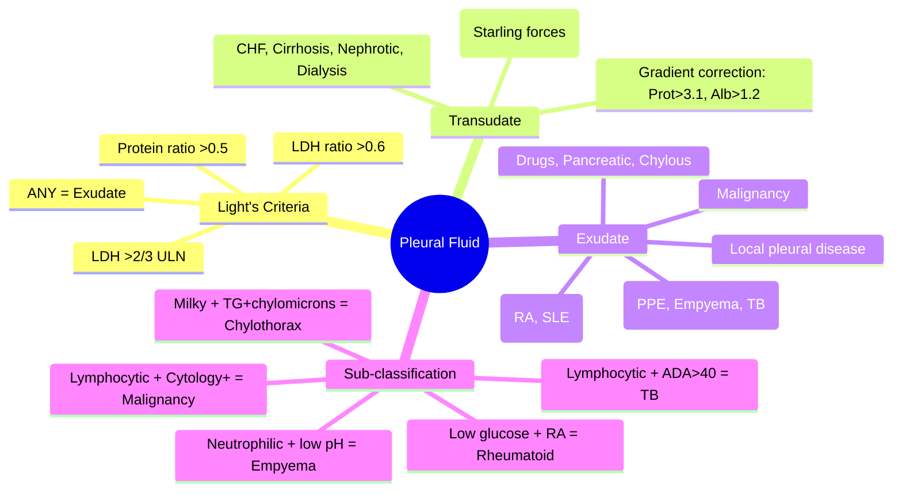
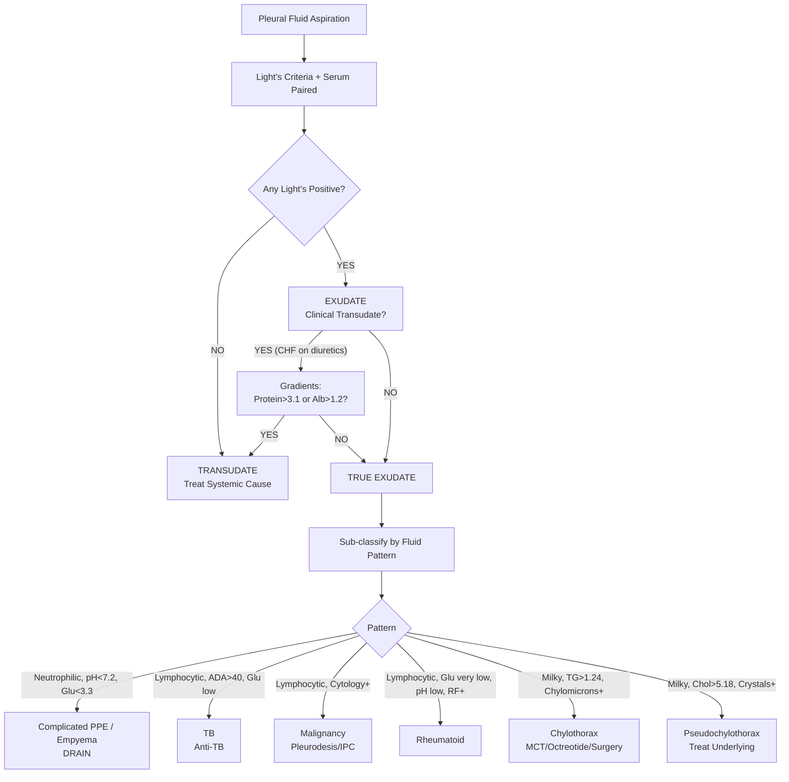

# Transudate vs Exudate Framework

Related: [[Pleural fluid disorders]], [[Parapneumonic effusion]], [[Empyema and pleural infection]], [[Malignant pleural effusion]], [[Chylothorax]], [[Pleural aspiration and chest drain basics]]

> [!important]
> **Transudate vs Exudate** classification is the **first step** in pleural fluid analysis. **Light's criteria** is the gold standard. **Transudate** = systemic factors (hydrostatic/oncotic pressure) — **NO pleural disease**. **Exudate** = local pleural inflammation/permeability increase — **PLEURAL DISEASE PRESENT**. Key FCPS/MRCP: **Light's criteria** (3 criteria, 1 positive = exudate), **protein/albumin gradients** for misclassified transudates, **common causes** table, **pseudochylothorax vs chylothorax**.

## Learning Objectives
- Apply **Light's criteria** to classify pleural fluid
- Use **serum-effusion protein/albumin gradients** to correct misclassification
- List **common causes** of transudate and exudate
- Differentiate **chylothorax** (high TG, chylomicrons) from **pseudochylothorax** (high cholesterol, crystals)
- Interpret **pleural fluid ADA** for TB
- Apply **diagnostic algorithm** for undiagnosed exudate

## Definition
| Type | Mechanism | Key Feature |
|------|-----------|-------------|
| **Transudate** | Systemic alteration of **Starling forces** (↑ hydrostatic pressure, ↓ oncotic pressure) | **Intact pleural capillaries**, no pleural inflammation |
| **Exudate** | **Local pleural inflammation** → ↑ capillary permeability, ↓ lymphatic drainage | **Pleural disease present** (infection, malignancy, inflammation) |

> **FCPS/MRCP tip**: **Transudate = "systemic problem"**, **Exudate = "local pleural problem"**. Always classify FIRST before further workup.

## Core Physiology
### Normal pleural fluid dynamics
- **Formation**: Filtration from **parietal pleural capillaries** (low pressure, high permeability)
- **Removal**: **Lymphatic stomata** on parietal pleura (diaphragm, mediastinum) → capacity ~0.2 mL/kg/h
- **Normal volume**: 10–20 mL
- **Normal composition**: Protein <1.5 g/dL, LDH <50% ULN serum, pH 7.60–7.64, glucose = serum

### Transudate pathophysiology
1. **↑ Hydrostatic pressure** (LV failure, fluid overload) → ↑ filtration
2. **↓ Oncotic pressure** (hypoalbuminaemia: nephrotic, cirrhosis, malnutrition) → ↓ reabsorption
3. **Lymphatics overwhelmed** → fluid accumulates
3. **Protein remains low** (intact capillaries, no inflammation)

### Exudate pathophysiology
1. **Pleural inflammation** (infection, malignancy, autoimmune) → **cytokines** (VEGF, IL-6, TNF-α)
2. **↑ Capillary permeability** → protein, cells, LDH leak into pleural space
3. **Lymphatic obstruction** (malignancy, TB) → impaired drainage
4. **High protein, high LDH, low glucose, low pH** (if bacterial)

## Normal Values / Important Cut-offs
### Light's Criteria (Exudate if ANY POSITIVE)
| Criterion | Threshold |
|-----------|-----------|
| **1. Pleural fluid protein / Serum protein** | **> 0.5** |
| **2. Pleural fluid LDH / Serum LDH** | **> 0.6** |
| **3. Pleural fluid LDH** | **> 2/3 upper limit of normal (ULN) serum LDH** |

**Performance**: Sensitivity ~98%, Specificity ~80% for exudate

### Correcting Misclassification (Transudate misclassified as Exudate)
**Common in**: Diuretic-treated CHF, hepatic hydrothorax, peritoneal dialysis
| Gradient | Threshold | Indicates |
|----------|-----------|-----------|
| **Serum protein – Pleural fluid protein** | **> 3.1 g/dL** | **Transudate** |
| **Serum albumin – Pleural fluid albumin** | **> 1.2 g/dL** | **Transudate** |

> **Algorithm**: If Light's says exudate BUT clinical picture = transudate → check gradients.
> **If either gradient positive → RECLASSIFY AS TRANSUDATE**

### Additional Tests
| Test | Transudate | Exudate |
|------|------------|---------|
| **Cholesterol** | <60 mg/dL (1.55 mmol/L) | >60 mg/dL |
| **Cholesterol / Triglyceride ratio** | >1 | <1 (chylothorax) |
| **NT-proBNP** (if CHF suspected) | **>1500 pg/mL** | Not diagnostic |

## Classification
### Transudate Causes (Systemic)
| Category | Examples |
|----------|----------|
| **Cardiac** | **Congestive heart failure** (most common), constrictive pericarditis |
| **Hepatic** | **Cirrhosis** (hepatic hydrothorax, usually right-sided), portal hypertension |
| **Renal** | **Nephrotic syndrome**, peritoneal dialysis (dialysate leak), uraemia |
| **Endocrine** | **Hypothyroidism** (myxoedema), Meigs syndrome (benign ovarian tumour + ascites + effusion) |
| **Other** | Atelectasis, trapped lung (chronic), superior vena cava obstruction, urinothorax |

### Exudate Causes (Local Pleural Disease)
| Category | Examples |
|----------|----------|
| **Infection** | **Parapneumonic/empyema** (bacterial), **TB**, viral, fungal, parasitic |
| **Malignancy** | **Lung, breast, lymphoma, mesothelioma**, metastatic |
| **Autoimmune** | **RA** (rheumatoid effusion), **SLE**, vasculitis (GPA, EGPA) |
| **Drug-induced** | Nitrofurantoin, methotrexate, amiodarone, dasatinib, checkpoint inhibitors |
| **Pancreatic** | **Acute/chronic pancreatitis** (amylase-rich, usually left) |
| **Post-procedure** | Post-CABG (Dressler's), post-radiation, post-esophageal rupture |
| **Other** | Chylothorax, pseudochylothorax, haemothorax, uraemic pleuritis, eosinophilic |

## Etiology / Causes — High-Yield Tables
### Top 5 Transudate Causes (Account for >90%)
1. **Congestive heart failure** (~50%)
2. **Cirrhosis / hepatic hydrothorax** (~15%)
3. **Nephrotic syndrome** (~10%)
4. **Peritoneal dialysis** (~5%)
5. **Hypoalbuminaemia** (malnutrition, protein-losing enteropathy)

### Top 5 Exudate Causes (Account for >85%)
1. **Parapneumonic effusion / Empyema** (~40%)
2. **Malignancy** (~25%) — lung, breast, lymphoma, mesothelioma
3. **Tuberculosis** (~15%)
4. **Autoimmune** (RA, SLE, vasculitis) ~5%
5. **Drug-induced / Pancreatic / Other** ~5%

## Clinical Features
### Transudate
- Usually **bilateral** or **right-sided** (CHF, hepatic)
- **No fever** (unless concurrent infection)
- **No pleuritic pain** (unless atelectasis)
- **Signs of underlying cause**: JVP ↑, peripheral oedema, ascites, asterixis

### Exudate
- Usually **unilateral**
- **Fever** (infection), **weight loss** (malignancy, TB)
- **Pleuritic chest pain** (pleural inflammation)
- **Signs of underlying cause**: consolidation, lymphadenopathy, clubbing, rash

## Investigations
### Mandatory (All Pleural Fluids)
1. **Appearance** (clear, turbid, bloody, milky, serosanguineous)
2. **Protein** (pleural + serum)
3. **LDH** (pleural + serum)
4. **Glucose** (pleural)
5. **pH** (blood gas syringe, anaerobic, ice, <1h)
6. **Cell count + differential** (WBC, RBC, neutrophils, lymphocytes)
7. **Cytology** (if exudate, >50 mL fresh)
8. **Gram stain + culture** (aerobic + anaerobic, blood culture bottles)

### As Needed (Exudates)
| Test | Indication |
|------|------------|
| **ADA** (adenosine deaminase) | **TB suspicion** (>40 U/L = high probability) |
| **Amylase** | Pancreatic / oesophageal rupture |
| **Triglycerides + lipoprotein electrophoresis** | Milky fluid → chylothorax vs pseudochylothorax |
| **Cholesterol + crystals** | Pseudochylothorax |
| **Rheumatoid factor, ANA, ANCA** | Autoimmune |
| **NT-proBNP** | CHF misclassification |
| **Biomarkers** (mesothelin, CYFRA 21-1, CEA) | Malignancy (not routine) |

## Interpretation Frameworks
### 1. Light's Criteria Algorithm
```
Pleural fluid protein & LDH + Serum protein & LDH
    ↓
Calculate 3 ratios:
1. PF protein / Serum protein > 0.5?
2. PF LDH / Serum LDH > 0.6?
3. PF LDH > 2/3 ULN serum LDH?
    ↓
ANY YES → EXUDATE
ALL NO → TRANSUDATE
    ↓
If EXUDATE by Light's but clinical TRANSUDATE (CHF on diuretics):
    → Check gradients:
       Serum protein - PF protein > 3.1 g/dL? → TRANSUDATE
       Serum albumin - PF albumin > 1.2 g/dL? → TRANSUDATE
```

### 2. Exudate Sub-classification (Clinical Context + Fluid Analysis)
| Fluid Pattern | Suggests |
|---------------|----------|
| **Neutrophilic**, pH <7.2, glucose <3.3, LDH >1000 | **Complicated parapneumonic / Empyema** |
| **Lymphocytic**, low glucose, high LDH, ADA >40 | **TB** |
| **Lymphocytic**, normal glucose, normal pH, cytology +ve | **Malignancy** |
| **Lymphocytic**, low glucose, low pH, high LDH, RF +ve | **Rheumatoid effusion** |
| **Eosinophilic** (>10% eos) | Air/blood in pleura (pneumothorax, haemothorax), drug, parasitic |
| **Milky**, TG >1.24, chylomicrons +ve | **Chylothorax** |
| **Milky**, cholesterol >5.18, crystals, NO chylomicrons | **Pseudochylothorax** |

### 3. Chylothorax vs Pseudochylothorax
| Parameter | Chylothorax | Pseudochylothorax |
|-----------|-------------|-------------------|
| **Triglycerides** | **>1.24 mmol/L (110 mg/dL)** | <1.24 mmol/L |
| **Cholesterol** | Normal/mild ↑ | **>5.18 mmol/L (200 mg/dL)** |
| **Chylomicrons** | **PRESENT** | **ABSENT** |
| **Cholesterol crystals** | Absent | **PRESENT** |
| **Cause** | Thoracic duct leak | Chronic effusion (TB, RA) |

## Diagnosis
**Stepwise approach:**
1. **Aspirate pleural fluid** (US-guided if <20mm on lateral decubitus)
2. **Send mandatory tests** (protein, LDH, glucose, pH, cell count, cytology, Gram/culture)
3. **Apply Light's criteria** → Transudate vs Exudate
4. **If Transudate**: Treat underlying cause (diurese CHF, albumin for cirrhosis, etc.)
5. **If Exudate**: Sub-classify using fluid pattern + clinical context → targeted workup

## Differential Diagnosis
| Clinical Scenario | Key Differentiator |
|-------------------|-------------------|
| **CHF on diuretics** → Exudate by Light's | **Gradients** (protein >3.1, albumin >1.2) = **Transudate** |
| **Hepatic hydrothorax** | Right-sided, ascites, low protein, **gradient +ve** |
| **Nephrotic syndrome** | Massive proteinuria, hypoalbuminaemia, bilateral |
| **Parapneumonic vs Empyema** | pH <7.2 / glucose <3.3 / LDH >1000 / pus / Gram+ = **Empyema** |
| **TB vs Malignancy (lymphocytic)** | ADA >40 + low glucose = TB; Cytology +ve = Malignancy |
| **Chylothorax vs Pseudochylothorax** | TG + chylomicrons vs Cholesterol + crystals |
| **Rheumatoid effusion** | Low glucose (<1.7), low pH, high LDH, RF +ve in fluid |

## Management
### Transudate
**Treat the underlying systemic cause:**
- **CHF**: **Diuretics** (loop), fluid/salt restriction, GDMT
- **Cirrhosis**: **Salt restriction**, diuretics (spironolactone + furosemide), **TIPS** if refractory, **thoracentesis** for symptom relief
- **Nephrotic syndrome**: **ACEi/ARB**, diuretics, treat primary glomerular disease
- **Peritoneal dialysis**: Reduce dwell volume, icodextrin, thoracic duct ligation if persistent

### Exudate
**Treat the underlying pleural disease:**
- **Parapneumonic/Empyema**: Antibiotics + drainage (see [[Parapneumonic effusion]], [[Empyema and pleural infection]])
- **Malignancy**: Talc pleurodesis vs IPC (see [[Malignant pleural effusion]])
- **TB**: Anti-TB therapy (2HRZE/4HR) (see [[Pulmonary tuberculosis]])
- **Autoimmune**: Treat underlying (steroids, immunosuppressants)
- **Drug-induced**: Stop offending drug
- **Pancreatic**: Treat pancreatitis, octreotide, drainage if infected

## Complications
### Transudate
- **Large effusion** → dyspnoea, atelectasis
- **Infection** (spontaneous bacterial empyema in cirrhotic hydrothorax)
- **Loculation** if chronic

### Exudate
- **Loculation** (fibrin) → incomplete drainage
- **Trapped lung** (visceral peel) → chronic dyspnoea
- **Empyema** (if parapneumonic untreated)
- **Bronchopleural fistula** (TB, malignancy, post-surgery)
- **Fibrothorax** (chest wall restriction)

## Red Flags / Emergencies
- **Large effusion** causing mediastinal shift + haemodynamic compromise → **urgent thoracentesis**
- **Empyema** with sepsis → **urgent drain + antibiotics + ICU**
- **Massive haemothorax** → **chest drain + surgery** if >1.5L or >200mL/h
- **Tension physiology** (rare for effusion) → urgent drainage

## Special Situations
### Hepatic Hydrothorax
- **Right-sided** (90%), **transudate**, ascites present
- **Gradient positive** even if Light's misclassifies
- **Refractory**: TIPS, thoracic duct ligation, pleuroperitoneal shunt

### Trapped Lung
- **Chronic exudate** → **visceral pleural peel** → lung cannot re-expand
- **Post-drain CXR**: Lung stays collapsed, pleural peel visible
- **Management**: IPC (pleurodesis CONTRAINDICATED)

### Chylothorax
- **TG >1.24 mmol/L + chylomicrons**
- **Conservative**: MCT diet + octreotide + TPN
- **High-output >1L/day** → thoracic duct ligation/embolisation

## Prognosis
| Type | Prognosis |
|------|-----------|
| **Transudate** | Depends on underlying (CHF, cirrhosis, nephrotic) |
| **Parapneumonic** | Good if drained early; empyema 15-20% mortality |
| **Malignancy** | Median survival 3-12 months |
| **TB** | Cure >90% with standard regimen |
| **Autoimmune** | Depends on underlying disease control |

## Topic Correlation
- [[Pleural fluid disorders]] — overview
- [[Parapneumonic effusion]] — exudate, pH <7.2
- [[Empyema and pleural infection]] — exudate, pus
- [[Malignant pleural effusion]] — exudate, cytology +ve
- [[Chylothorax]] — TG, chylomicrons
- [[Tuberculosis]] — lymphocytic, ADA, low glucose
- [[Pleural aspiration and chest drain basics]] — procedures

## FCPS/MRCP High-Yield Points
1. **Light's criteria**: 1 positive = exudate (protein ratio >0.5, LDH ratio >0.6, LDH >2/3 ULN)
2. **Specificity ~80%** → transudates misclassified (especially diuretic-treated CHF)
3. **Correction**: Serum-protein gradient >3.1 g/dL OR serum-albumin gradient >1.2 g/dL = **TRANSUDATE**
4. **Transudate causes**: CHF, cirrhosis, nephrotic, peritoneal dialysis, atelectasis
5. **Exudate causes**: Parapneumonic/empyema, malignancy, TB, autoimmune, drugs, pancreatitis
6. **pH <7.2** = complicated parapneumonic → **DRAIN**
7. **ADA >40 U/L** + lymphocytic + low glucose = TB
8. **Chylothorax**: TG >1.24 + chylomicrons; **Pseudochylothorax**: cholesterol >5.18 + crystals, NO chylomicrons
9. **Rheumatoid effusion**: very low glucose (<1.7), low pH, high LDH, RF +ve
10. **Trapped lung** = visceral peel → NO pleurodesis → IPC

## Common Viva Questions
1. Light's criteria (3 criteria, thresholds)
2. Transudate vs exudate pathophysiology
3. Misclassification of CHF on diuretics — how to correct (gradients)
4. Common causes of each
4. pH threshold for drainage in parapneumonic effusion
5. TB pleural fluid findings (ADA, glucose, lymphocytes)
6. Chylothorax vs pseudochylothorax
7. Rheumatoid effusion features
8. Diagnostic algorithm for undiagnosed exudate

## Common Confusions / Exam Traps
- **Applying Light's without simultaneous serum** — MUST have paired serum
- **Misclassifying diuretic-treated CHF as exudate** — use gradients to correct
- **Using pleural fluid cholesterol alone** — need chylomicrons for chylothorax
- **Confusing low glucose in TB vs RA vs empyema** — all low, but context differs
- **ADA >40 = TB** — not absolute (can be elevated in empyema, RA, lymphoma); use with clinical context
- **Pleurodesis for trapped lung** — CONTRAINDICATED (lung can't oppose parietal pleura)
- **Transudate = no pleural disease** — TRUE, treat systemic cause only

## Mnemonics
- **LIGHT'S**: **L**DH ratio >0.6, **I**G (protein) ratio >0.5, **G**lucose not in Light's, **H** LDH absolute >2/3 ULN, **T**ransudate if NONE, **S**ensitivity 98%
- **TRANSUDATE CAUSES**: **C**HF (heart), **H**epatic (liver), **F**ailure = **CHF**... wait: **C**HF, **H**epatic, **F**luid overload (renal/dialysis), **A**lbumin low (nephrotic, malnutrition), **T**rapped lung (chronic), **E**ndocrine (hypothyroid), **S**VC obstruction
- **EXUDATE CAUSES**: **P**neumonia/empyema, **M**alignancy, **T**B, **A**utoimmune, **D**rugs, **P**ancreatic, **E**osinophilic, **C**hylous, **H**aemothorax
- **GRADIENTS**: **P**rotein gradient >**3.1** = Transudate; **A**lbumin gradient >**1.2** = Transudate

## Mind Map


## Flowchart


## Suggested Visuals / Image Notes
- Light's criteria table
- Gradient correction algorithm
- Pleural fluid appearance gallery
- TB vs malignancy fluid comparison
- Chylothorax vs pseudochylothorax
- Diagnostic flowchart for undiagnosed exudate

## Suggested Video References
- Light's criteria explanation
- Pleural fluid analysis algorithm
- TB vs malignant effusion differentiation
- Chylothorax diagnosis
- Rheumatoid effusion

## One-Page Revision Summary
- **Light's**: Protein ratio >0.5, LDH ratio >0.6, LDH >2/3 ULN → ANY = Exudate
- **Misclassification**: Diuretic CHF → gradients (protein >3.1, albumin >1.2) = Transudate
- **Transudate**: CHF, cirrhosis, nephrotic, dialysis, hypothyroid, atelectasis
- **Exudate**: PPE/empyema, malignancy, TB, autoimmune, drugs, pancreatic, chylous
- **pH <7.2** = complicated PPE → DRAIN
- **TB**: Lymphocytic, ADA >40, glucose low
- **Malignancy**: Lymphocytic, cytology +ve
- **RA effusion**: Glucose <1.7, pH low, LDH high, RF +ve
- **Chylothorax**: TG >1.24 + chylomicrons
- **Pseudochylothorax**: Cholesterol >5.18 + crystals, NO chylomicrons
- **Trapped lung** = NO pleurodesis → IPC

## 24-Hour Recall Prompts
- Light's 3 criteria and thresholds
- Gradient correction values (3.1, 1.2)
- Top 3 transudate causes
- Top 3 exudate causes
- pH threshold for drainage
- TB fluid findings
- Chylothorax vs pseudochylothorax

## 7-Day / 15-Day / 30-Day Revision Tracker
- [ ] Day 1 completed
- [ ] 24-hour recall completed
- [ ] Day 7 revision completed
- [ ] Day 15 revision completed
- [ ] Day 30 revision completed

## Must Know / Should Know / Nice to Know
### Must Know
- Light's criteria (3 thresholds)
- Gradient correction for misclassified transudates
- Common causes of transudate vs exudate
- pH <7.2 = drain in parapneumonic
- TB fluid: lymphocytic, ADA >40, low glucose
- Chylothorax vs pseudochylothorax differentiation

### Should Know
- Rheumatoid effusion features
- NT-proBNP for CHF
- ADA limitations (false + in empyema, lymphoma)
- Trapped lung recognition
- Pancreatic effusion (amylase)
- Drug-induced exudates

### Nice to Know
- Biomarkers (mesothelin, CYFRA 21-1, sTREM-1)
- Cholesterol criteria alternative to Light's
- Pleural fluid metabolomics
- Cost-effectiveness of routine vs targeted testing

## Self-Test Scorecard
- Understanding: /10
- Recall: /10
- MCQ Performance: /10
- SBA Performance: /10
- Viva Confidence: /10
- Total: /50

> [!tip]
> Interpretation: <35 = weak topic, 35-44 = acceptable but insecure, 45+ = strong exam-ready topic.

## Exam Answer Modes
### Long Answer Skeleton
- Light's criteria with thresholds
- Pathophysiology (Starling forces vs inflammation)
- Gradient correction algorithm
- Causes tables (transudate vs exudate)
- Exudate sub-classification by fluid pattern
- Diagnostic algorithm for undiagnosed exudate
- Special fluid types (chylous, pseudochylous, haemorrhagic, eosinophilic)
- Management principles

### Short Note Skeleton
- Light's criteria box
- Gradient correction box
- Causes comparison table
- Exudate pattern table
- Diagnostic flowchart

### Viva One-Liners
- "Light's: Protein ratio >0.5, LDH ratio >0.6, LDH >2/3 ULN — ANY positive = Exudate"
- "Transudate = systemic (Starling); Exudate = local pleural inflammation"
- "CHF on diuretics → Light's says exudate → CHECK GRADIENTS: protein >3.1 OR albumin >1.2 = TRANSUDATE"
- "Transudate: CHF, cirrhosis, nephrotic, dialysis; Exudate: PPE/empyema, malignancy, TB, autoimmune"
- "pH <7.2 in parapneumonic = complicated → DRAIN"
- "TB fluid: lymphocytic, ADA >40, glucose low, pH low"
- "Malignancy: lymphocytic, cytology +ve"
- "RA effusion: glucose <1.7, pH low, LDH very high, RF +ve in fluid"
- "Chylothorax: TG >1.24 + chylomicrons; Pseudochylo: cholesterol >5.18 + crystals, NO chylomicrons"
- "Trapped lung = visceral peel → NO pleurodesis → IPC"

### Ward-Case Discussion Points
- 70M CHF on furosemide, bilateral effusions, Light's exudate, serum protein 6.0, PF protein 3.5 (ratio 0.58), gradient 2.5 → actually transudate (gradient 2.5 <3.1, but albumin gradient may help) → diurese
- 50M pneumonia, R effusion, pH 6.9, glucose 1.0, LDH 5000 → complicated PPE → drain + antibiotics
- 40F cough, night sweats, L effusion, lymphocytic, ADA 65, glucose 1.5 → TB → 2HRZE/4HR
- 65M smoker, R effusion, cytology +ve for adenocarcinoma → MPE → IPC vs talc (LIFE score)

### Last-Night-Before-Exam Sheet
- Light's: Prot>0.5, LDH>0.6, LDH>2/3ULN → ANY=Exudate
- CHF diuretics misclassify → Gradients: Prot>3.1, Alb>1.2 = Transudate
- Transudate: CHF, Cirrhosis, Nephrotic, Dialysis
- Exudate: PPE, Malignancy, TB, Autoimmune
- pH<7.2 = Drain (PPE)
- TB: Lymphs, ADA>40, Glu low
- Malig: Lymphs, Cyto+
- RA: Glu<1.7, pH low, LDH high, RF+
- Chylo: TG>1.24 + chylomicrons
- Pseudochylo: Chol>5.18 + crystals
- Trapped lung = IPC only

## Summary
**Transudate vs Exudate** classification using **Light's criteria** is the **first step** in pleural fluid analysis. **Light's**: protein ratio >0.5, LDH ratio >0.6, LDH >2/3 ULN serum → **any positive = exudate**. **Misclassification** (diuretic-treated CHF) corrected by **serum-effusion gradients**: protein gradient >3.1 g/dL or albumin gradient >1.2 g/dL = **transudate**. **Transudate causes**: CHF, cirrhosis, nephrotic syndrome, peritoneal dialysis. **Exudate causes**: parapneumonic/empyema, malignancy, TB, autoimmune, drugs, pancreatitis. **Exudate sub-classification**: pH <7.2/glucose <3.3/LDH >1000 = complicated PPE/empyema → drain; lymphocytic + ADA >40 + low glucose = TB; lymphocytic + cytology +ve = malignancy; very low glucose + low pH + high LDH + RF = rheumatoid; milky + TG >1.24 + chylomicrons = chylothorax; milky + cholesterol >5.18 + crystals = pseudochylothorax. **Trapped lung** = visceral peel → **no pleurodesis** → IPC.

## MCQs (10)
1. **Light's criteria** for exudate — which is NOT a criterion?
   A. Pleural fluid protein / Serum protein > 0.5
   B. Pleural fluid LDH / Serum LDH > 0.6
   C. Pleural fluid glucose / Serum glucose < 0.5
   D. Pleural fluid LDH > 2/3 ULN serum LDH

2. **Diuretic-treated CHF** misclassified as exudate by Light's — correct using:
   A. Pleural fluid cholesterol
   B. **Serum - pleural fluid protein gradient > 3.1 g/dL OR albumin gradient > 1.2 g/dL**
   C. Pleural fluid pH
   D. NT-proBNP alone

3. **Most common cause of transudative effusion**:
   A. Cirrhosis
   B. Nephrotic syndrome
   C. **Congestive heart failure**
   D. Peritoneal dialysis

4. **pH threshold** for chest drainage in parapneumonic effusion:
   A. <7.0
   B. **<7.2**
   C. <7.4
   D. <7.6

5. **TB pleural effusion** typical findings:
   A. Neutrophilic, pH >7.2, glucose normal
   B. **Lymphocytic, ADA >40 U/L, glucose low, pH low**
   C. Lymphocytic, glucose normal, pH normal
   D. Eosinophilic, high ADA

6. **Chylothorax** diagnosis requires:
   A. Triglycerides >1.24 mmol/L only
   B. **Triglycerides >1.24 mmol/L AND chylomicrons on lipoprotein electrophoresis**
   C. Cholesterol >5.18 mmol/L
   C. Milky appearance only

7. **Pseudochylothorax** (cholesterol effusion) characteristic:
   A. Triglycerides >1.24, chylomicrons present
   B. **Cholesterol >5.18 mmol/L, cholesterol crystals present, NO chylomicrons**
   C. Low pH, low glucose
   D. High ADA

8. **Rheumatoid pleural effusion** — characteristic:
   A. Glucose >3.3, pH >7.2
   B. **Glucose <1.7 mmol/L, pH <7.2, LDH very high, RF positive in fluid**
   C. Neutrophilic, Gram stain positive
   D. ADA >40

9. **Trapped lung** management:
   A. Talc pleurodesis
   B. **Indwelling pleural catheter (IPC) — pleurodesis contraindicated**
   C. Surgical decortication only
   D. Repeated therapeutic aspiration

10. **Serum - pleural fluid protein gradient** indicating transudate:
    A. >2.0 g/dL
    B. >2.5 g/dL
    C. **>3.1 g/dL**
    D. >4.0 g/dL

## SBA Questions (10)
1. A 72M on furosemide for CHF develops bilateral effusions. Pleural fluid: protein 3.2, LDH 180, serum protein 5.8, LDH 160. Light's: protein ratio 0.55, LDH ratio 1.1. Gradients: protein 2.6, albumin 1.0. Classification?
   A. Exudate (Light's positive)
   B. **Transudate (clinical CHF, gradients not diagnostic but clinical picture fits)**
   C. Indeterminate
   D. Chylothorax

2. A 50M with pneumonia, R effusion. Aspirate: pH 6.9, glucose 1.2, LDH 4500, neutrophils 80%. Management?
   A. Antibiotics alone
   B. **Antibiotics + chest drain (pH <7.2)**
   C. Thoracoscopy
   D. Observation

3. A 30F, cough 3 weeks, night sweats, L effusion. Fluid: lymphocytic, ADA 55, glucose 1.8, pH 7.1. Diagnosis?
   A. Malignancy
   B. **Tuberculosis**
   C. Rheumatoid effusion
   D. Parapneumonic

4. A 60M RA (seropositive), L effusion. Fluid: glucose 0.8, pH 6.9, LDH 8000, RF positive in fluid. Diagnosis?
   A. TB
   B. **Rheumatoid effusion**
   C. Malignancy
   D. Empyema

5. Milky pleural fluid, TG 2.5 mmol/L, chylomicrons present on electrophoresis. Diagnosis?
   A. Pseudochylothorax
   B. **Chylothorax**
   C. High lipid empyema
   D. Malignant effusion

6. Milky pleural fluid, cholesterol 6.5 mmol/L, cholesterol crystals seen, lipoprotein electrophoresis: NO chylomicrons. Diagnosis?
   A. Chylothorax
   B. **Pseudochylothorax**
   C. TB effusion
   D. Rheumatoid effusion

7. A 65M lung cancer, large R effusion, trapped lung on CT (visceral peel). Best palliation?
   A. Talc pleurodesis via drain
   B. VATS talc poudrage
   C. **Indwelling pleural catheter (IPC)**
   D. Repeated thoracentesis

8. ADA >40 U/L in pleural fluid — which condition does NOT typically cause elevated ADA?
   A. Tuberculosis
   B. Empyema
   C. Lymphoma
   D. **Congestive heart failure**

9. NT-proBNP in pleural fluid — most useful for:
   A. Diagnosing TB
   B. **Identifying CHF effusion misclassified as exudate**
   C. Diagnosing malignancy
   D. Diagnosing chylothorax

10. Light's criteria sensitivity for exudate:
    A. 85%
    B. 90%
    C. **~98%**
    D. 70%

## Flashcards
- Q: Light's 3 criteria
  A: Prot ratio>0.5, LDH ratio>0.6, LDH>2/3ULN
- Q: Gradient correction
  A: Prot grad>3.1, Alb grad>1.2 = Transudate
- Q: Transudate causes
  A: CHF, Cirrhosis, Nephrotic, Dialysis
- Q: Exudate causes
  A: PPE, Malignancy, TB, Autoimmune
- Q: pH threshold
  A: <7.2 = Drain
- Q: TB fluid
  A: Lymphs, ADA>40, Glu low
- Q: Malignancy fluid
  A: Lymphs, Cytology+
- Q: RA effusion
  A: Glu<1.7, pH low, LDH high, RF+
- Q: Chylo vs Pseudochylo
  A: TG+chylomicrons vs Chol+crystals
- Q: Trapped lung
  A: IPC only (no pleurodesis)

## Answer Key with Explanations
### MCQs
1. **C** — Glucose ratio not in Light's criteria.
2. **B** — Protein gradient >3.1 or albumin gradient >1.2 reclassifies as transudate.
3. **C** — CHF is most common transudate cause.
4. **B** — pH <7.2 = complicated parapneumonic → drain.
5. **B** — TB: lymphocytic, ADA>40, low glucose, low pH.
6. **B** — Chylothorax requires BOTH TG >1.24 AND chylomicrons.
7. **B** — Pseudochylothorax: high cholesterol, crystals, NO chylomicrons.
8. **B** — RA effusion: very low glucose, very low pH, very high LDH, RF+.
9. **B** — Trapped lung = visceral peel prevents apposition → pleurodesis fails → IPC.
10. **C** — Protein gradient >3.1 g/dL indicates transudate.

### SBAs
1. **B** — Clinical CHF + gradients not diagnostic but Light's misleads; transudate. (Note: protein gradient 2.6 <3.1, albumin 1.0 <1.2, but clinical picture is classic CHF; in practice, this is transudate).
2. **B** — pH <7.2 = complicated PPE → antibiotics + drain.
3. **B** — Lymphocytic + ADA>40 + low glucose = TB.
4. **B** — RA effusion: very low glucose, very low pH, very high LDH, RF+.
5. **B** — TG >1.24 + chylomicrons = chylothorax.
6. **B** — Cholesterol >5.18 + crystals + NO chylomicrons = pseudochylothorax.
7. **C** — Trapped lung → IPC (pleurodesis contraindicated).
8. **D** — CHF = transudate, ADA not elevated (ADA elevated in TB, empyema, lymphoma, RA).
9. **B** — NT-proBNP helps identify CHF effusion misclassified by Light's.
10. **C** — Light's sensitivity ~98% for exudate.

### Flashcards
All correct as written.

---
