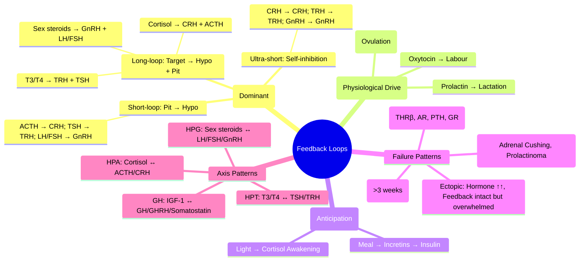

# Feedback Loops in Endocrinology

> [!info]
> **Feedback loops are the central homeostatic mechanism of the endocrine system.** Negative feedback maintains stability; positive feedback drives transitions; ultra-short loops provide fine-tuning. The pattern of hormone levels (tropic vs target) reveals the level of pathology.

---

## 1. Learning Objectives
By the end of this note you should be able to:
- [ ] Classify feedback loops by type (negative, positive, ultra-short, short, long)
- [ ] Apply feedback logic to distinguish primary, secondary, and tertiary endocrine disorders
- [ ] Predict hormone patterns in feedback disruption (tumours, resistance, exogenous administration)
- [ ] Interpret dynamic tests through the lens of feedback physiology
- [ ] Explain clinical consequences of feedback failure (Cushing, thyrotoxicosis, adrenal insufficiency)

---

## 2. Feedback Loop Types

| Loop Type | Direction | Components | Example | Clinical Relevance |
|-----------|-----------|------------|---------|-------------------|
| **Long-loop Negative** | Target hormone → Hypothalamus + Pituitary | Target gland hormone → inhibits releasing hormone + tropic hormone | Cortisol → CRH + ACTH; T3/T4 → TRH + TSH; Oestradiol/Testosterone → GnRH + LH/FSH | **Primary vs Secondary diagnosis**: High target + Low tropic = Primary; Low target + Low tropic = Secondary |
| **Short-loop Negative** | Pituitary hormone → Hypothalamus | Tropic hormone → inhibits its own releasing hormone | ACTH → CRH; TSH → TRH; LH/FSH → GnRH | Pituitary tumour autonomy = loss of short-loop feedback |
| **Ultra-short-loop Negative** | Hypothalamic hormone → Hypothalamus (autocrine) | Releasing hormone → inhibits its own secretion | CRH → CRH; TRH → TRH; GnRH → GnRH | Fine-tuning; prevents runaway secretion |
| **Positive Feedback** | Target hormone → stimulates releasing/tropic hormone | Target hormone → ↑ releasing hormone → ↑ tropic hormone | **Oestradiol → GnRH/LH surge** (mid-cycle); Oxytocin → uterine contractions → more oxytocin | **Ovulation**; Parturition; Lactation (suckling → prolactin/oxytocin) |
| **Feed-forward** | Anticipatory regulation | Upstream signal → primes downstream response | **Meal → GIP/GLP-1 → Insulin** (before glucose rises); Light → SCN → Cortisol awakening response | Anticipatory homeostasis; explains cephalic phase insulin release |

---

## 3. Negative Feedback — The Dominant Principle

### General Architecture
```
Stimulus → Releasing Hormone (Hypothalamus)
    ↓
Tropic Hormone (Pituitary)
    ↓
Target Hormone (End-organ)
    ↓
        ┌─────────────────────────────────────┐
        │  NEGATIVE FEEDBACK                  │
        │  Target Hormone ──────┬──→ Inhibits │
        │                       │   Releasing │
        │                       └──→ Inhibits │
        │                           Tropic    │
        └─────────────────────────────────────┘
```

### Feedback Sensitivity & Set Points
| Concept | Definition | Clinical Example |
|---------|------------|------------------|
| **Set Point** | Hormone level at which feedback is 50% maximal | TSH set point shifts in thyroid disease |
| **Gain** | Steepness of feedback response | High gain = tight control (thyroid); Low gain = wide variation (cortisol) |
| **Hysteresis** | Different set points for increasing vs decreasing stimulus | Not prominent in human endocrine axes |

---

## 4. Major Endocrine Axes — Feedback Patterns

### HPA Axis (Cortisol)
```
CRH (Hypothalamus) → ACTH (Pituitary) → Cortisol (Adrenal)
    ↑______________|______________|
          Negative Feedback
```
| Level | Cortisol | ACTH | CRH | Interpretation |
|-------|----------|------|-----|----------------|
| **Normal** | Normal | Normal | Normal | — |
| **Primary AI (Addison)** | ↓↓ | **↑↑** | ↑↑ | Adrenal failure |
| **Secondary AI (Pituitary)** | ↓ | **↓/N** | ↑ | Pituitary failure |
| **Tertiary AI (Hypothalamic/Steroid)** | ↓ | ↓/N | **↓** | Steroid withdrawal, hypothalamic lesion |
| **Cushing Disease** | ↑↑ | **N/↑** | ↓ | Pituitary ACTH adenoma |
| **Adrenal Cushing** | ↑↑ | **↓↓** | ↓↓ | Adrenal autonomy |
| **Ectopic ACTH** | ↑↑ | ↑↑ | ↓ | Ectopic ACTH source |

### HPT Axis (Thyroid)
```
TRH (Hypothalamus) → TSH (Pituitary) → T4/T3 (Thyroid)
    ↑______________|______________|
          Negative Feedback (mainly T3 at pituitary)
```
| Level | TSH | fT4/fT3 | Interpretation |
|-------|-----|---------|----------------|
| **Normal** | Normal | Normal | — |
| **Primary Hyper** | **↓↓ (suppressed)** | ↑↑ | Graves, Toxic nodule, Thyroiditis |
| **Primary Hypo** | **↑↑** | ↓ | Hashimoto, Post-ablation, Iodine deficiency |
| **Central Hypo** | **↓/N (inappropriately low)** | ↓↓ | Pituitary/Hypothalamic disease |
| **Subclinical Hyper** | **↓↓** | Normal | Early Graves, Toxic nodule, Excess thyroxine |
| **Subclinical Hypo** | **↑** | Normal | Early Hashimoto |
| **T3 Thyrotoxicosis** | **↓↓** | fT4 Normal, **fT3 ↑** | Early Graves, T3-secreting nodule |

### HPG Axis (Gonadal)
```
GnRH (Hypothalamus) → LH/FSH (Pituitary) → Testosterone/Oestradiol (Gonads)
    ↑_______________|________________|
          Negative Feedback (Oestradiol/Testosterone + Inhibin)
```
| Level | LH/FSH | Sex Steroid | Interpretation |
|-------|--------|-------------|----------------|
| **Primary Hypogonadism** | **↑↑** | ↓ | Klinefelter, Turner, Mumps, Chemo |
| **Secondary Hypogonadism** | **↓/N** | ↓ | Pituitary adenoma, Hyperprolactinaemia, Kallmann, Functional |
| **PCOS** | **LH ↑↑, FSH N/↓** (LH:FSH >2:1) | Testosterone ↑ | Ovarian resistance + insulin resistance |
| **Menopause** | **↑↑** | ↓↓ (Oestradiol) | Ovarian failure |

### GH/IGF-1 Axis
```
GHRH → GH (Pituitary) → IGF-1 (Liver)
    ↑____________|____________|
    Somatostatin inhibits GH
    IGF-1 negative feedback at pituitary + hypothalamus
```

---

## 5. Positive Feedback — Key Physiological Examples

| System | Trigger | Mechanism | Outcome |
|--------|---------|-----------|---------|
| **Ovulation (Mid-cycle LH Surge)** | Rising Oestradiol (>200 pg/mL for >50h) | Oestradiol switches from negative → **positive feedback** on pituitary → **LH surge** | Ovulation |
| **Parturition** | Fetal head → Cervical stretch | Oxytocin → Uterine contraction → More cervical stretch → More oxytocin | Labour & Delivery |
| **Lactation** | Suckling → Nipple stimulation | Prolactin + Oxytocin release → Milk ejection → More suckling | Milk production/ejection |

---

## 6. Feedback Failure — Clinical Patterns

### 1. Hormone Resistance (Receptor/Post-receptor Defect)
| Condition | Hormone Pattern | Mechanism |
|-----------|-----------------|-----------|
| **Thyroid Hormone Resistance (THRβ mutation)** | **fT4/fT3 ↑↑, TSH N/↑** (inappropriately normal) | Impaired negative feedback at pituitary |
| **Androgen Insensitivity (AR mutation)** | Testosterone ↑↑, LH ↑↑ | Impaired feedback at hypothalamus/pituitary |
| **Pseudohypoparathyroidism (GNAS mutation)** | PTH ↑↑, Calcium ↓, Phosphate ↑ | End-organ resistance to PTH |
| **Glucocorticoid Resistance (GR mutation)** | Cortisol ↑↑, ACTH ↑↑ | Impaired feedback |

### 2. Autonomous Secretion (Tumours)
| Tumour | Feedback Status | Hormone Pattern |
|--------|-----------------|-----------------|
| **Adrenal Adenoma (Cushing)** | **Lost** (autonomous) | Cortisol ↑, ACTH ↓↓ |
| **Prolactinoma** | **Lost** (dopamine resistance) | Prolactin ↑↑, LH/FSH ↓ |
| **TSH-oma** | Lost (TRH resistance) | TSH N/↑, fT4/fT3 ↑ |
| **Insulinoma** | Lost (glucose sensing lost) | Insulin ↑ despite hypoglycaemia |

### 3. Ectopic Hormone Production
| Source | Hormone | Feedback Effect |
|--------|---------|-----------------|
| **Small Cell Lung Ca** | ACTH | ACTH ↑↑ → Cortisol ↑↑ (feedback intact but overwhelmed) |
| **Squamous Ca** | PTHrP | PTHrP ↑ → Calcium ↑ → PTH Suppressed (intact) |
| **Renal Cell Ca** | EPO | EPO ↑ → Hb ↑ (feedback intact) |

### 4. Exogenous Hormone Administration
| Steroid Type | HPA Axis Suppression | Recovery |
|--------------|---------------------|----------|
| **Short-course (<3 weeks)** | Minimal | Rapid |
| **Long-course (>3 weeks)** | **Significant** (adrenal atrophy) | **Weeks-months**; taper required |
| **Inhaled/Topical (high dose)** | Significant | Variable |
| **Physiological replacement** | No suppression | N/A |

---

## 7. Dynamic Testing — Feedback in Action

| Test | Feedback Principle | Interpretation |
|------|-------------------|----------------|
| **Dexamethasone Suppression (DST)** | Exogenous glucocorticoid → Negative feedback → ↓ ACTH → ↓ Cortisol | **Non-suppression** = Autonomous cortisol (Cushing) or ectopic ACTH |
| **TRH Stimulation** | TRH → TSH release (if pituitary intact) → fT4 rise | **Blunted TSH** = Hyperthyroidism / Pituitary failure; **Exaggerated** = Primary hypothyroidism |
| **GnRH Stimulation** | GnRH → LH/FSH release | Prepubertal: FSH > LH; Puberty: LH > FSH; PCOS: LH > FSH; Hypogonadotropic: Low response |
| **Synacthen (ACTH) Test** | Exogenous ACTH → Cortisol rise (if adrenal intact) | **Cortisol <400-500 nmol/L at 30min** = Adrenal insufficiency |
| **Water Deprivation + Desmopressin** | ADH feedback → Urine concentration | Central DI: Response to desmopressin; Nephrogenic DI: No response |

---

## 8. Feedback in Pregnancy — Unique Adaptations

| Axis | Change | Mechanism |
|------|--------|-----------|
| **HPT** | ↑ TBG (oestrogen) → ↑ Total T4/T3; **fT4/fT3 reliable**; hCG cross-reacts with TSH → **TSH ↓ 1st trimester** | hCG weak TSH agonist; TBG ↑ 2-3x |
| **HPA** | ↑ CBG (oestrogen) → ↑ Total cortisol; Free cortisol ↑ 2-3x; HPA axis hyperplasia | Oestrogen ↑ CBG synthesis; Placental CRH |
| **HPG** | Prolactin ↑ (oestrogen stimulates lactotrophs); **FSH/LH suppressed** | Oestrogen negative feedback + high progesterone |
| **Prolactin** | **↑↑** (10-20x) | Oestrogen stimulates lactotroph hyperplasia |

---

## 9. Exam Pearls (FCPS/MRCP)

| Topic | Key Point |
|-------|-----------|
| **Primary vs Secondary** | Primary: Target hormone abnormal + Tropic hormone **opposite direction**; Secondary: Both **same direction** (low) |
| **Addison vs Secondary AI** | Addison: Cortisol ↓ + **ACTH ↑↑ + Hyperpigmentation**; Secondary: Cortisol ↓ + ACTH ↓/N + **No hyperpigmentation** |
| **Cushing Disease vs Adrenal Cushing** | Cushing Disease: **ACTH N/↑**; Adrenal Cushing: **ACTH ↓↓** |
| **Primary Hypothyroidism** | **TSH ↑↑, fT4 ↓** (most common thyroid pattern) |
| **Central Hypothyroidism** | **TSH ↓/N (inappropriately low), fT4 ↓** — Think pituitary tumour |
| **Subclinical Hyperthyroidism** | **TSH suppressed, fT4/fT3 normal** — Treat if TSH <0.1, elderly, cardiac risk |
| **Subclinical Hypothyroidism** | **TSH ↑, fT4 normal** — Treat if TSH >10, antibodies +ve, pregnancy, lipid abnormality |
| **Positive Feedback** | **Oestradiol → LH surge** (ovulation); Oxytocin (parturition); Prolactin (lactation) |
| **Steroid withdrawal** | HPA suppression after >3 weeks; Taper over weeks-months |
| **Thyroid Hormone Resistance** | fT4/fT3 ↑, **TSH N/↑** (inappropriately normal) — THRβ mutation |

---

## 10. Confusions & Mnemonics

| Confusion | Clarification |
|-----------|---------------|
| **Primary vs Secondary** | "Primary = problem in the gland itself" → Target hormone bad, Tropic hormone tries to compensate (opposite direction) |
| **ACTH in Cushing** | Cushing Disease = Pituitary ACTH ↑; Adrenal Cushing = ACTH suppressed; Ectopic = ACTH very high |
| **TSH in Central Hypo** | TSH is **NOT elevated** (inappropriately normal/low) despite low fT4 — this IS the clue |
| **Positive Feedback** | Not "bad" feedback — physiological drive for ovulation/parturition; Oestradiol flips from inhibitor to stimulator at high sustained levels |
| **Subclinical Thyroid** | Biochemical only (TSH abnormal, fT4/fT3 normal); Treat based on TSH level, age, antibodies, pregnancy, cardiac risk |
| **Steroid Taper** | >3 weeks steroids = HPA suppression; Taper over weeks-months; Stress doses for illness/surgery |

**Mnemonic: FEEDBACK LOOP TYPES**
- **L**ong-loop = Target → Hypo + Pit (Cortisol→CRH+ACTH)
- **S**hort-loop = Pituitary → Hypothalamus (ACTH→CRH)
- **U**ltra-short = Self-inhibition (CRH→CRH)
- **P**ositive = Oestrogen→LH surge; Oxytocin→Labour
- **F**eed-forward = Meal→Incretins→Insulin

**Mnemonic: PRIMARY vs SECONDARY HORMONE PATTERNS**
- **P**rimary: **P**roblem in the **P**eripheral gland → Target bad, Tropic **O**pposite
- **S**econdary: **S**ystemic (central) failure → Target low, Tropic **S**ame (low)
- **T**ertiary: **T**op (hypothalamus) failure → Same as secondary but **releasing hormone low**

---

## 11. Mind Map



---

## 12. One-Page Revision Card

| Domain | Key Points |
|--------|------------|
| **Feedback Types** | Long: Target→Hypo+Pit; Short: Pit→Hypo; Ultra-short: Self; Positive: Ovulation/Labour |
| **Primary Pattern** | Target bad + Tropic **opposite** (e.g., Cortisol↓ + ACTH↑ = Addison) |
| **Secondary Pattern** | Target bad + Tropic **same/low** (e.g., Cortisol↓ + ACTH↓ = Secondary AI) |
| **Tertiary Pattern** | Like secondary but **CRH/Releasing hormone low** (steroid withdrawal) |
| **Cushing Patterns** | Disease: ACTH N/↑; Adrenal: ACTH ↓↓; Ectopic: ACTH ↑↑ |
| **Thyroid Patterns** | Primary Hypo: TSH↑↑, fT4↓; Central: TSH↓/N, fT4↓; Subclinical: TSH abnormal, fT4 normal |
| **Positive Feedback** | Oestrogen→LH surge (ovulation); Oxytocin (labour); Prolactin (lactation) |
| **Resistance Syndromes** | Hormone↑↑ + Tropic↑/N (THRβ, AR, PTH, GR) |
| **Steroid Withdrawal** | >3 weeks = HPA suppression; Taper over weeks-months |
| **Key Discriminators** | ACTH in Cushing; TSH in thyroid; LH/FSH in hypogonadism |

---

## 13. Spaced Repetition Trackers

| Review Interval | Date Completed | Confidence (1-5) | Notes |
|-----------------|----------------|------------------|-------|
| 24 hours | | | |
| 7 days | | | |
| 15 days | | | |
| 30 days | | | |
| 90 days | | | |

---

## 14. Self-Test Scorecard

| Section | Score /5 | Last Attempt |
|---------|----------|--------------|
| Feedback Types | | |
| Axis Patterns (HPA, HPT, HPG, GH) | | |
| Primary vs Secondary vs Tertiary | | |
| Cushing/Thyroid/Gonadal Patterns | | |
| Resistance Syndromes | | |
| Autonomous Tumours | | |
| Dynamic Tests & Feedback | | |
| Pregnancy Adaptations | | |

---

## 15. Local Navigation (for Dashboard UI)

> **Parent**: [[../General Principles|General Principles]]  
> **Hierarchy**: [[../../Davidson Chapter 20 - Endocrinology Hierarchy|Endocrinology Hierarchy]]  
> **Template**: [[../../../Templates/Endocrinology Topic Template|Endocrinology Topic Template]]  
> **See also**: [[Hormone Synthesis, Secretion & Transport]], [[Dynamic Testing Principles]], [[Endocrine Investigation Algorithms]], [[Hypothalamic-Pituitary Axis]]
## 16. MCQs (10)
1. **Cortisol inhibiting CRH is which feedback type?**
   A. Long-loop negative feedback
   B. Short-loop negative feedback
   C. Ultra-short-loop feedback
   D. Positive feedback

2. **ACTH inhibiting CRH is?**
   A. Short-loop negative feedback
   B. Long-loop negative feedback
   C. Positive feedback
   D. Feedforward

3. **Oestrogen causing LH surge is?**
   A. Positive feedback
   B. Negative feedback
   C. Ultra-short-loop
   D. Short-loop

4. **In primary hypothyroidism, TSH is?**
   A. Elevated
   B. Suppressed
   C. Normal
   D. Undetectable

5. **In secondary hypothyroidism, TSH is?**
   A. Low/Normal (inappropriately)
   B. Elevated
   C. Suppressed
   D. Pulsatile

6. **TRH test in secondary hypothyroidism shows?**
   A. Blunted TSH response
   B. Exaggerated TSH response
   C. Normal TSH response
   D. Delayed peak

7. **Dexamethasone suppression test: failure to suppress cortisol suggests?**
   A. Cushing syndrome
   B. Adrenal insufficiency
   C. Normal HPA axis
   D. Pituitary adenoma

8. **In Cushing disease, high-dose dexamethasone:**
   A. Suppresses cortisol
   B. Does not suppress cortisol
   C. Elevates ACTH
   D. Suppresses ACTH only

9. **Thyroid hormone feedback on TSH is?**
   A. Long-loop negative feedback
   B. Short-loop
   C. Ultra-short-loop
   D. Positive feedback

10. **Autonomous gland hyperfunction results in?**
   A. High hormone + low/normal tropic hormone
   B. Low hormone + high tropic hormone
   C. High hormone + high tropic hormone
   D. Low hormone + low tropic hormone

## 17. SBA Questions (10)
1. **Low cortisol, high ACTH, high CRH. Diagnosis?**
   A. Primary adrenal insufficiency (Addison's)
   B. Secondary adrenal insufficiency
   C. Cushing disease
   D. Ectopic ACTH syndrome
   E. Pseudo-Cushing

2. **High cortisol, low ACTH, low CRH. Diagnosis?**
   A. Adrenal Cushing (ACTH-independent)
   B. Cushing disease
   C. Ectopic ACTH
   D. Pseudo-Cushing
   E. Factitious Cushing

3. **Thyroid hormone resistance: TSH level?**
   A. Inappropriately normal/elevated with high fT4/fT3
   B. Suppressed
   C. Normal with low fT4
   D. Elevated with low fT3
   E. Low with high fT3

4. **40yo woman: amenorrhoea, low oestradiol, low LH/FSH. Diagnosis?**
   A. Hypothalamic amenorrhoea (functional)
   B. Premature ovarian insufficiency
   C. PCOS
   D. Prolactinoma
   E. Sheehan syndrome

5. **Acromegaly: GH high, IGF-1 high, OGTT fails to suppress GH. Mechanism?**
   A. Loss of negative feedback by IGF-1 on somatotroph adenoma
   B. GHRH excess
   C. Ghrelin excess
   D. Somatostatin deficiency
   E. TRH excess

6. **Primary hyperparathyroidism: PTH high → Calcium?**
   A. High (hypercalcaemia)
   B. Low (hypocalcaemia)
   C. Normal
   D. Variable
   E. Low-normal

7. **Long-term steroids: low cortisol, low ACTH. Diagnosis?**
   A. Tertiary (steroid-withdrawal) adrenal insufficiency
   B. Primary AI
   C. Cushing syndrome
   D. Secondary AI (pituitary)
   E. Adrenal crisis

8. **SIADH: ADH high despite?**
   A. Low plasma osmolality
   B. High plasma osmolality
   C. Normal plasma osmolality
   D. Low volume
   E. High volume

9. **Prolactinoma: Prolactin high → GnRH/LH/FSH?**
   A. Suppressed (via dopamine/prolactin effect on hypothalamus)
   B. Elevated
   C. Normal
   D. Pulsatile only
   E. Absent

10. **Cushing disease: midnight salivary cortisol?**
   A. Elevated (loss of diurnal rhythm)
   B. Normal
   C. Low
   D. Variable
   E. Suppressed

## 18. Flashcards
- **Q: Long-loop negative feedback**
  **A: Target hormone → inhibits tropic hormone (e.g., Cortisol → ↓CRH/↓ACTH)**

- **Q: Short-loop negative feedback**
  **A: Tropic hormone → inhibits releasing hormone (e.g., ACTH → ↓CRH)**

- **Q: Ultra-short-loop feedback**
  **A: Releasing hormone → self-inhibition (e.g., CRH → ↓CRH)**

- **Q: Positive feedback**
  **A: Oestrogen → ↑LH surge (mid-cycle); Oxytocin → ↑Oxytocin in labour**

- **Q: Primary gland failure**
  **A: Target hormone LOW, Tropic hormone HIGH (e.g., Primary hypothyroidism: ↓T4, ↑TSH)**

- **Q: Central (secondary/tertiary) failure**
  **A: Target hormone LOW, Tropic hormone LOW/NORMAL (inappropriately)**

- **Q: Autonomous gland hyperfunction**
  **A: Target hormone HIGH, Tropic hormone LOW (e.g., Adrenal adenoma: ↑Cortisol, ↓ACTH)**

- **Q: Dexamethasone suppression**
  **A: Low dose: Suppresses normal HPA; High dose: Suppresses pituitary (Cushing disease) but not ectopic/adrenal**

- **Q: TRH test**
  **A: Normal: TSH ↑; Primary hypo: TSH ↑↑ (exaggerated); Secondary: TSH blunted/absent; Hyperthyroidism: TSH no rise**

- **Q: Synacthen test**
  **A: Normal: Cortisol ≥500-550 nmol/L; AI: Cortisol <400-500 nmol/L**

- **Q: OGTT in acromegaly**
  **A: Normal: GH suppresses <1 µg/L; Acromegaly: GH fails to suppress (↑ or paradoxical ↑)**

- **Q: Water deprivation test**
  **A: Normal: Urine osmolality >800; Central DI: No concentrate → DDAVP → ↑Uosm; Nephrogenic DI: No response to DDAVP**

- **Q: TRH test in secondary hypothyroidism**
  **A: Blunted/delayed TSH response (pituitary dysfunction)**

- **Q: Dexamethasone in Cushing disease vs ectopic**
  **A: High-dose DST: Cushing disease → cortisol suppression (>50%); Ectopic → no suppression**

## 19. Answer Key with Explanations
### MCQs
1. **Long-loop negative feedback** — Cortisol inhibiting CRH is which feedback type?

2. **Short-loop negative feedback** — ACTH inhibiting CRH is?

3. **Positive feedback** — Oestrogen causing LH surge is?

4. **Elevated** — In primary hypothyroidism, TSH is?

5. **Low/Normal (inappropriately)** — In secondary hypothyroidism, TSH is?

6. **Blunted TSH response** — TRH test in secondary hypothyroidism shows?

7. **Cushing syndrome** — Dexamethasone suppression test: failure to suppress cortisol suggests?

8. **Suppresses cortisol** — In Cushing disease, high-dose dexamethasone:

9. **Long-loop negative feedback** — Thyroid hormone feedback on TSH is?

10. **High hormone + low/normal tropic hormone** — Autonomous gland hyperfunction results in?


### SBAs
1. **Primary adrenal insufficiency (Addison's)** — Low cortisol, high ACTH, high CRH. Diagnosis?

2. **Adrenal Cushing (ACTH-independent)** — High cortisol, low ACTH, low CRH. Diagnosis?

3. **Inappropriately normal/elevated with high fT4/fT3** — Thyroid hormone resistance: TSH level?

4. **Hypothalamic amenorrhoea (functional)** — 40yo woman: amenorrhoea, low oestradiol, low LH/FSH. Diagnosis?

5. **Loss of negative feedback by IGF-1 on somatotroph adenoma** — Acromegaly: GH high, IGF-1 high, OGTT fails to suppress GH. Mechanism?

6. **High (hypercalcaemia)** — Primary hyperparathyroidism: PTH high → Calcium?

7. **Tertiary (steroid-withdrawal) adrenal insufficiency** — Long-term steroids: low cortisol, low ACTH. Diagnosis?

8. **Low plasma osmolality** — SIADH: ADH high despite?

9. **Suppressed (via dopamine/prolactin effect on hypothalamus)** — Prolactinoma: Prolactin high → GnRH/LH/FSH?

10. **Elevated (loss of diurnal rhythm)** — Cushing disease: midnight salivary cortisol?

