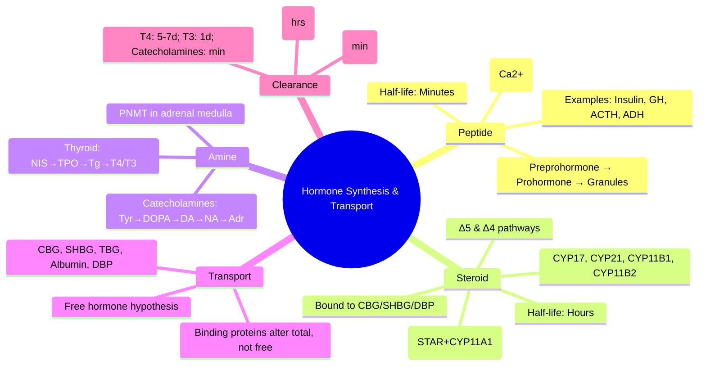

# Hormone Synthesis, Secretion & Transport

> [!info]
> **Hormone classification dictates mechanism of action, secretion regulation, half-life, transport in blood, and assay methodology.** Understanding this is foundational for all endocrine pathology.

---

## 1. Learning Objectives
By the end of this note you should be able to:
- [ ] Classify hormones by chemical structure and mechanism of action
- [ ] Describe synthesis pathways for peptide, steroid, and amine hormones
- [ ] Explain secretion mechanisms (regulated vs constitutive)
- [ ] Identify transport proteins and their clinical significance
- [ ] Apply knowledge to interpret hormone assays and dynamic tests

---

## 2. Hormone Classification by Chemical Structure

| Class | Examples | Synthesis Site | Precursor | Mechanism of Action | Half-life | Transport in Blood |
|-------|----------|----------------|-----------|---------------------|-----------|-------------------|
| **Peptide/Protein** | Insulin, GH, ACTH, TSH, ADH, Oxytocin, PTH, Calcitonin | Rough ER → Golgi | Preprohormone → Prohormone → Active hormone | **Cell surface receptors** → cAMP, IP3/DAG, JAK-STAT | **Minutes** (3-30 min) | Free (unbound) |
| **Steroid** | Cortisol, Aldosterone, Oestradiol, Testosterone, Vit D, 1,25(OH)₂D | Smooth ER / Mitochondria | Cholesterol | **Intracellular nuclear receptors** → Gene transcription | **Hours** (60-90 min) | **Bound to binding globulins** (CBG, SHBG, DBP) + Albumin |
| **Amine (Tyrosine-derived)** | T4/T3, Catecholamines (Adrenaline, Noradrenaline) | Thyroid follicular cells / Adrenal medulla | Tyrosine | **Mixed**: T4/T3 = nuclear; Catecholamines = surface (α/β adrenergic) | T4: **Days** (5-7d); Catecholamines: **Minutes** | T4/T3: **TBG, Transthyretin, Albumin**; Catecholamines: Free |
| **Eicosanoid** | Prostaglandins, Leukotrienes, Thromboxanes | Membrane phospholipids | Arachidonic acid | Local autocrine/paracrine (GPCRs) | **Seconds** | Local (not systemic) |

---

## 3. Peptide Hormone Synthesis Pathway

```
Gene Transcription → Preprohormone (signal peptide + prohormone)
         ↓
Signal peptide cleaved in ER → Prohormone
         ↓
Golgi Processing → Prohormone convertases (PC1/3, PC2) → Active hormone + C-peptide fragments
         ↓
Packaged into Secretory Granules (immature → mature)
         ↓
**Regulated Secretion** (stimulus → Ca²⁺ influx → Exocytosis)
```

| Step | Enzyme/Process | Clinical Relevance |
|------|----------------|-------------------|
| **Preprohormone → Prohormone** | Signal peptidase | Mutations → misfolding (e.g., proinsulin mutations → diabetes) |
| **Prohormone → Active hormone** | **Prohormone convertases (PC1/3, PC2)** | PC1/3 deficiency → obesity, hypogonadism, cortisol deficiency |
| **Granule maturation** | Carboxypeptidase E | CPE deficiency → obesity in mice |
| **Regulated secretion** | Ca²⁺-dependent exocytosis | Sulfonylureas close KATP → Ca²⁺ influx → Insulin secretion |

**Key Example — Insulin**: Preproinsulin (110aa) → Proinsulin (86aa, C-peptide connecting A&B chains) → Insulin (51aa, A&B chains linked by disulphide bonds) + C-peptide (31aa). **C-peptide** = marker of endogenous insulin secretion.

---

## 4. Steroid Hormone Synthesis Pathway

### Cholesterol → Steroid Hormones (Adrenal Cortex / Gonads / Placenta)

```
Cholesterol → (STAR protein) → Inner mitochondrial membrane
         ↓
CYP11A1 (P450scc) → **Pregnenolone** (rate-limiting step)
         ↓
         ├─→ **Δ5 Pathway** (Zona fasciculata/reticularis)
         │    17α-hydroxylase (CYP17A1) → 17-OH Pregnenolone
         │    17,20-lyase (CYP17A1) → DHEA → Androstenedione → Testosterone/Oestradiol
         │    21-hydroxylase (CYP21A2) → 17-OH Progesterone → 11-Deoxycortisol → **Cortisol** (CYP11B1)
         │    21-hydroxylase → Deoxycorticosterone → **Aldosterone** (CYP11B2)
         │
         └─→ **Δ4 Pathway** (Zona glomerulosa)
              Progesterone → 21-hydroxylase → Deoxycorticosterone → Aldosterone
```

### Key Enzymes & Clinical Deficiencies

| Enzyme | Gene | Product | Deficiency Syndrome |
|--------|------|---------|---------------------|
| **STAR** | STAR | Cholesterol transfer | **Lipoid CAH** (lethal, salt-wasting) |
| **CYP11A1** | CYP11A1 | Pregnenolone | **Lipoid CAH** (rare) |
| **CYP17A1** (17α-hydroxylase/17,20-lyase) | CYP17A1 | 17-OH steroids, DHEA | **17α-hydroxylase deficiency** → HTN, sexual infantilism |
| **CYP21A2** (21-hydroxylase) | CYP21A2 | 11-Deoxycortisol, DOC | **21-hydroxylase deficiency (95% CAH)** → Salt-wasting/virilising |
| **CYP11B1** (11β-hydroxylase) | CYP11B1 | Cortisol | **11β-hydroxylase deficiency** → HTN + virilisation |
| **CYP11B2** (Aldosterone synthase) | CYP11B2 | Aldosterone | Aldosterone deficiency / excess |
| **5α-reductase** | SRD5A2 | DHT | **5α-reductase deficiency** → 46,XY DSD |
| **Aromatase** | CYP19A1 | Oestradiol | Aromatase deficiency → virilisation in pregnancy |

---

## 5. Amine Hormone Synthesis

### Thyroid Hormones (T4/T3) — Thyroid Follicular Cells

```
Iodide uptake (NIS) → Thyroglobulin synthesis (RER) → Iodination (TPO + H₂O₂) → MIT + DIT → Coupling (TPO) → T4 (2 DIT) / T3 (MIT+DIT) → Stored in colloid
         ↓
TSH stimulation → Endocytosis of colloid → Lysosomal proteolysis → T4/T3 released into circulation
```

| Step | Enzyme/Process | Clinical Relevance |
|------|----------------|-------------------|
| **Iodide uptake** | **NIS (Sodium-Iodide Symporter)** | Perchlorate discharge test; NIS mutations → dyshormonogenesis |
| **Iodination** | **TPO (Thyroid Peroxidase)** | **Anti-TPO antibodies** (Hashimoto); PTU inhibits TPO |
| **Coupling** | TPO | TPO mutations → dyshormonogenesis |
| **Proteolysis** | Lysosomal enzymes | Iodine excess inhibits (Wolff-Chaikoff effect) |
| **Deiodination** | **DIO1, DIO2** (activate T4→T3); **DIO3** (inactivate) | Selenium deficiency impairs DIOs; Amiodarone inhibits DIO1 |

**Key Ratios**: T4:T3 secretion ≈ **10:1** (but T3 is 4x more potent). **Peripheral conversion** (DIO1/DIO2) provides ~80% of circulating T3.

### Catecholamines — Adrenal Medulla / Sympathetic Neurones

```
Tyrosine → (Tyrosine hydroxylase) → L-DOPA → (Dopa decarboxylase) → Dopamine → (Dopamine β-hydroxylase) → Noradrenaline → (PNMT) → Adrenaline
```

| Enzyme | Location | Clinical Relevance |
|--------|----------|-------------------|
| **Tyrosine hydroxylase** | Cytoplasm | Rate-limiting; inhibited by Metyrosine |
| **PNMT** | Adrenal medulla (cortisol-induced) | PNMT in adrenal → distinguishes adrenal vs extra-adrenal phaeo |
| **MAO/COMT** | Metabolism | Metabolites: VMA, Metanephrines (measured in urine/plasma) |

---

## 6. Hormone Secretion Patterns

| Pattern | Examples | Mechanism |
|---------|----------|-----------|
| **Pulsatile** | GH, LH, FSH, ACTH, TSH, Prolactin | Hypothalamic pulse generator; essential for receptor sensitivity |
| **Circadian/Diurnal** | Cortisol (peak 08:00, nadir 24:00), Prolactin (sleep), GH (sleep) | SCN → Hypothalamic drive |
| **Ultradian** | Cortisol (hourly pulses), GnRH (60-90 min pulses) | Pulse frequency encodes information (e.g., LH pulse freq → FSH/LH ratio) |
| **Stress-responsive** | ACTH, Cortisol, Adrenaline, GH, Prolactin | CRH, sympathetic activation |
| **Feedback-regulated** | Thyroid (TSH-T4), Gonadal (GnRH-LH/FSH-sex steroids), Adrenal (ACTH-cortisol) | Negative feedback dominant |

---

## 7. Transport Proteins in Blood

| Binding Protein | Hormones Bound | % Bound | Half-life Effect | Clinical Relevance |
|-----------------|----------------|---------|------------------|-------------------|
| **CBG (Corticosteroid Binding Globulin / Transcortin)** | Cortisol, Corticosterone, Progesterone | ~90% | Prolongs t½ | ↑ in pregnancy, OCP, hyperoestrogenism → ↑ total cortisol (free normal) |
| **SHBG (Sex Hormone Binding Globulin)** | Testosterone, Oestradiol, DHT | ~60-70% | Prolongs t½ | ↓ in insulin resistance, obesity, hypothyroidism; ↑ in hyperthyroidism, OCP |
| **TBG (Thyroxine Binding Globulin)** | T4 > T3 | T4: 99.97%; T3: 99.7% | Prolongs t½ (T4: 5-7d) | ↑ in pregnancy, OCP → ↑ total T4/T3 (free normal); ↓ in nephrotic, steroids |
| **Transthyretin (Prealbumin)** | T4 (minor) | ~10-15% | Minor | Mutations → familial amyloid polyneuropathy |
| **Albumin** | Cortisol, T4, T3, Steroid hormones (low affinity) | Remaining | Minor | ↓ in nephrotic, malnutrition, liver disease |
| **DBP (Vitamin D Binding Protein)** | 25-OH D, 1,25(OH)₂D | >99% | Prolongs t½ | GC gene polymorphisms affect levels |

**Free Hormone Hypothesis**: Only **free (unbound)** hormone is biologically active. Total hormone assays can be misleading if binding proteins altered.

---

## 8. Clearance and Half-life

| Hormone | Primary Clearance | Half-life | Clinical Implication |
|---------|-------------------|-----------|---------------------|
| **Peptide (Insulin, ACTH, GH)** | Renal filtration, hepatic/renal degradation | **Minutes** (3-30) | Frequent dosing needed; C-peptide (t½ 30min) > Insulin (t½ 5min) |
| **Steroid (Cortisol, Aldosterone)** | Hepatic conjugation (glucuronidation/sulphation) → Renal excretion | **60-90 min** | Once/twice daily dosing; Renal/hepatic impairment → accumulation |
| **Thyroid (T4)** | Deiodination, conjugation, biliary excretion | **5-7 days** | Slow onset/offset; steady state ~6 weeks |
| **Thyroid (T3)** | Deiodination, conjugation | **1 day** | Faster onset; used in myxoedema coma |
| **Catecholamines** | MAO/COMT → VMA, Metanephrines | **Minutes** | Metabolites measured (not parent hormone) |

---

## 9. Exam Pearls (FCPS/MRCP)

| Topic | Key Point |
|-------|-----------|
| **Peptide hormone synthesis** | Preprohormone → Prohormone (ER) → Active hormone + C-peptide (Golgi) → Secretory granules |
| **Steroid synthesis** | Cholesterol → Pregnenolone (STAR + CYP11A1, rate-limiting) → Δ5/Δ4 pathways |
| **Rate-limiting steroid step** | **Cholesterol → Pregnenolone** (STAR + CYP11A1) |
| **21-hydroxylase deficiency** | Most common CAH (95%) → Salt-wasting (aldosterone ↓) + Virilisation (androgens ↑) |
| **11β-hydroxylase deficiency** | HTN (DOC ↑) + Virilisation (androgens ↑) |
| **17α-hydroxylase deficiency** | HTN (mineralocorticoid excess) + Sexual infantilism (sex steroids ↓) |
| **T4 synthesis** | Iodide → NIS → TPO (iodination + coupling) → Thyroglobulin colloid → TSH → Endocytosis → T4/T3 release |
| **TPO function** | Iodination + Coupling; Anti-TPO in Hashimoto; PTU inhibits |
| **Deiodinases** | DIO1/DIO2 = T4→T3 (activation); DIO3 = Inactivation; Selenium-dependent |
| **STAR protein** | Cholesterol transfer to inner mitochondrial membrane; Mutations → Lipoid CAH |
| **Catecholamine synthesis** | Tyrosine → L-DOPA → Dopamine → Noradrenaline → (PNMT) → Adrenaline |
| **PNMT** | Cortisol-induced; Adrenal medulla specific; Distinguishes adrenal vs extra-adrenal phaeo |
| **Free hormone hypothesis** | Only unbound hormone active; Measure free T4/T3, not total if TBG altered |
| **CBG/SHBG/TBG** | ↑ in pregnancy/OCP → Total hormone ↑ but Free normal |
| **Half-lives** | Peptides: minutes; Steroids: hours; T4: days (5-7d); T3: 1 day; Catecholamines: minutes |

---

## 10. Confusions & Mnemonics

| Confusion | Clarification |
|-----------|---------------|
| **Total vs Free hormone** | Total = Free + Bound; Only Free is active. If TBG/CBG/SHBG altered (pregnancy, OCP, nephrotic), Total misleads → Measure Free |
| **C-peptide vs Insulin** | C-peptide = endogenous secretion marker (not in exogenous insulin); t½ 30min vs Insulin 5min; No hepatic extraction |
| **T4 vs T3 half-life** | T4: 5-7 days (bound to TBG); T3: 1 day (less bound); T3 = 4x potency |
| **DHEA vs Androstenedione** | DHEA = 17,20-lyase product (adrenal); Androstenedione = DHEA conversion (adrenal/gonadal) |
| **Cortisol vs Corticosterone** | Cortisol = 11β-hydroxylase product (human glucocorticoid); Corticosterone = rodent glucocorticoid |

**Mnemonic: STEROID SYNTHESIS PATHWAY**
- **S**TAR moves cholesterol in
- **T**he first step is CYP11A1 (Pregnenolone)
- **E**nzyme CYP17A1 makes sex steroids
- **R**ate-limiting = STAR + CYP11A1
- **O**ther enzymes: CYP21 (cortisol/aldo), CYP11B1/B2
- **I**nherited deficiencies = CAH types
- **D**rug PTU inhibits TPO (not steroid synthesis)

**Mnemonic: THYROID HORMONE SYNTHESIS**
- **N**IS brings iodide in
- **I**odination by TPO
- **T**hyroglobulin stores it
- **R**elease by TSH (endocytosis)
- **O**rganification = TPO iodination + coupling
- **I**nactivation by DIO3
- **D**eiodination: DIO1/DIO2 make T3

---

## 11. Mind Map



---

## 12. One-Page Revision Card

| Domain | Key Points |
|--------|------------|
| **Peptide Synthesis** | Prepro → Pro (ER) → Active + frag (Golgi) → Granules → Ca²⁺ exocytosis |
| **Steroid Synthesis** | Cholesterol → **Pregnenolone** (STAR+CYP11A1, rate-limiting) → Δ5/Δ4 pathways |
| **Key Enzymes** | CYP17A1 (17α-OH/17,20-lyase), CYP21A2 (21-OH), CYP11B1 (11β-OH cortisol), CYP11B2 (aldo synthase) |
| **CAH Types** | 21-OH (95%): salt-wasting + virilising; 11β-OH: HTN + virilising; 17α-OH: HTN + infantilism |
| **Thyroid** | NIS uptake → TPO iodination/coupling → Thyroglobulin → TSH endocytosis → T4/T3 |
| **Deiodinases** | DIO1/DIO2: T4→T3 (activation); DIO3: inactivation; Se-dependent |
| **Catecholamines** | Tyr → DOPA → DA → NA → (PNMT) → Adr; Metanephrines/VMA measured |
| **Transport** | CBG (cortisol), SHBG (sex steroids), TBG (thyroid), Albumin (low affinity) |
| **Free Hormone** | Only unbound active; Measure free if binding proteins altered |
| **Half-lives** | Peptides: min; Steroids: 1-2hr; T4: 5-7d; T3: 1d; Catecholamines: min |

---

## 13. Spaced Repetition Trackers

| Review Interval | Date Completed | Confidence (1-5) | Notes |
|-----------------|----------------|------------------|-------|
| 24 hours | | | |
| 7 days | | | |
| 15 days | | | |
| 30 days | | | |
| 90 days | | | |

---

## 14. Self-Test Scorecard

| Section | Score /5 | Last Attempt |
|---------|----------|--------------|
| Hormone Classification | | |
| Peptide Synthesis | | |
| Steroid Synthesis & Enzymes | | |
| CAH Types | | |
| Thyroid Hormone Synthesis | | |
| Amine Hormones | | |
| Transport & Free Hormone | | |
| Clearance & Half-lives | | |

---


1. **Which hormone class is synthesised as a preprohormone in the rough ER?**
   A. Peptide/protein hormones (e.g., insulin, GH, ACTH)
   B. Steroid hormones
   C. Thyroid hormones
   D. Catecholamines

2. **What is the rate-limiting step in steroid hormone synthesis?**
   A. Cholesterol → Pregnenolone (STAR + CYP11A1)
   B. Pregnenolone → 17-OH Pregnenolone
   C. 11-Deoxycortisol → Cortisol
   D. DOC → Aldosterone

3. **Which enzyme deficiency causes 21-hydroxylase deficiency (95% of CAH)?**
   A. CYP21A2
   B. CYP17A1
   C. CYP11B1
   D. CYP11B2

4. **What is the half-life of T4 and its main binding protein?**
   A. 5-7 days; TBG
   B. 1 day; TBG
   C. 60-90 min; CBG
   D. Minutes; Albumin

5. **Which transport protein is increased in pregnancy and OCP use?**
   A. TBG, CBG, SHBG (all increased)
   B. Only TBG
   C. Only CBG
   D. Albumin

6. **C-peptide is a marker of what?**
   A. Endogenous insulin secretion
   B. Insulin resistance
   C. Beta-cell mass
   D. Glucagon secretion

7. **Which deiodinase activates T4 to T3?**
   A. DIO1 and DIO2
   B. DIO3
   C. DIO1 only
   D. DIO2 only

8. **17,20-lyase activity is part of which enzyme?**
   A. CYP17A1
   B. CYP21A2
   C. CYP11B1
   D. CYP11B2

9. **PNMT is induced by what?**
   A. Cortisol
   B. ACTH
   C. Angiotensin II
   D. Potassium

10. **Free hormone hypothesis states:**
    A. Only unbound hormone is biologically active
    B. Total hormone correlates with activity
    C. Bound hormone is active
    D. Albumin-bound hormone is active

---


1. **A 30-year-old woman on combined OCP has total T4 180 nmol/L (ref 60-160), TSH 1.5 mIU/L. Explanation?**
   A. Increased TBG → elevated total T4, free T4 normal
   B. Primary hyperthyroidism
   C. TSH-secreting adenoma
   D. Thyroid hormone resistance
   E. Exogenous thyroxine intake

2. **Patient with suspected insulinoma has low glucose. Best test for endogenous hyperinsulinaemia?**
   A. C-peptide level
   B. Proinsulin level
   C. Insulin antibodies
   D. HbA1c
   E. Fasting insulin

3. **In 21-hydroxylase deficiency, which steroid causes virilisation?**
   A. 17-OH Progesterone → Androstenedione/Testosterone
   B. DOC → Aldosterone
   C. Cortisol
   D. Corticosterone
   E. 11-Deoxycortisol

4. **Patient on high-dose prednisolone for 6 months stops abruptly. Main risk?**
   A. Adrenal crisis (HPA suppression)
   B. Hyperglycaemia
   C. Hypertension
   D. Osteoporosis
   E. Electrolyte imbalance

5. **Which hormone has the longest half-life?**
   A. T4 (5-7 days)
   B. T3 (1 day)
   C. Cortisol (60-90 min)
   D. Insulin (5 min)
   E. ACTH (10 min)

6. **Anti-TPO antibodies are most associated with?**
   A. Hashimoto's thyroiditis
   B. Graves disease
   C. Thyroid cancer
   D. Subacute thyroiditis
   E. Toxic nodular goitre

7. **25yo male with hypertension, hypokalaemia, elevated 17-OH progesterone. Diagnosis?**
   A. 17α-hydroxylase deficiency
   B. 11β-hydroxylase deficiency
   C. 21-hydroxylase deficiency
   D. Aldosterone synthase deficiency
   E. 17β-hydroxysteroid dehydrogenase deficiency

8. **Correct statement about catecholamine synthesis?**
   A. PNMT converts noradrenaline to adrenaline in adrenal medulla
   B. Tyrosine hydroxylase is not rate-limiting
   C. Dopamine β-hydroxylase is in cytoplasm
   D. MAO is the main clearance pathway
   E. COMT converts dopamine to adrenaline

9. **Selenium deficiency impairs?**
   A. Peripheral T4 to T3 conversion (DIOs)
   B. Iodide uptake (NIS)
   C. Iodination (TPO)
   D. TSH receptor signalling
   E. Thyroglobulin synthesis

10. **Nephrotic syndrome: low total T4, normal TSH. Why?**
    A. Low albumin → low total T4, free T4 normal
    B. Primary hypothyroidism
    C. Central hypothyroidism
    D. Non-thyroidal illness
    E. TSH-secreting adenoma

---

## 15. Flashcards

- **Q: Peptide hormone synthesis**
  **A: Preprohormone → Prohormone (ER) → Active hormone + C-peptide (Golgi) → Granules → Regulated secretion (Ca2+)**

- **Q: Steroid synthesis rate-limiting**
  **A: Cholesterol → Pregnenolone via STAR + CYP11A1 (P450scc) in inner mitochondrial membrane**

- **Q: 21-hydroxylase deficiency (95% CAH)**
  **A: ↓ Cortisol, ↓ Aldosterone → ↑ 17-OH Progesterone → ↑ Androgens → Salt-wasting + Virilisation**

- **Q: 11β-hydroxylase deficiency**
  **A: ↓ Cortisol → ↑ 11-Deoxycortisol + ↑ DOC (mineralocorticoid) → HTN + Virilisation**

- **Q: 17α-hydroxylase deficiency**
  **A: ↓ Sex steroids → Sexual infantilism; ↑ Mineralocorticoids (DOC) → HTN**

- **Q: T4 synthesis steps**
  **A: Iodide → NIS → TPO (iodination + coupling on Thyroglobulin) → Colloid storage → TSH → Endocytosis → T4/T3 release**

- **Q: Deiodinases**
  **A: DIO1/DIO2 (Se-dependent): T4→T3 activation; DIO3: Inactivation (rT3, T2)**

- **Q: Catecholamine pathway**
  **A: Tyrosine → DOPA → Dopamine → Noradrenaline → (PNMT, cortisol-induced) → Adrenaline**

- **Q: Transport proteins**
  **A: CBG: Cortisol (~90%); SHBG: Testosterone/Oestradiol; TBG: T4>T3 (99.97%); Albumin: Low affinity carrier**

- **Q: Free hormone hypothesis**
  **A: Only free (unbound) hormone is biologically active; Total hormone misleading if binding proteins altered**

- **Q: Half-lives**
  **A: Peptides: 3-30 min; Steroids: 60-90 min; T4: 5-7 d; T3: 1 d; Catecholamines: min**

- **Q: STAR protein**
  **A: Cholesterol transfer to inner mitochondrial membrane; Mutations → Lipoid CAH (lethal salt-wasting)**

- **Q: Anti-TPO antibodies**
  **A: Hashimoto's (90-95%), Graves (80%), Postpartum thyroiditis; PTU inhibits TPO**

- **Q: C-peptide vs Insulin**
  **A: C-peptide: Endogenous secretion marker, t½ 30 min, no hepatic extraction; Insulin: t½ 5 min**

---

## 16. Answer Key with Explanations

### MCQs

1. **A. Peptide/protein hormones (e.g., insulin, GH, ACTH)** — Peptide hormones are synthesised as preprohormones in the rough ER; steroids are synthesised in smooth ER/mitochondria from cholesterol; thyroid hormones from tyrosine/iodide in follicular cells; catecholamines from tyrosine in adrenal medulla.

2. **A. Cholesterol → Pregnenolone (STAR + CYP11A1)** — The conversion of cholesterol to pregnenolone by STAR and CYP11A1 (P450scc) is the rate-limiting step in all steroid hormone synthesis.

3. **A. CYP21A2** — 21-hydroxylase deficiency accounts for ~95% of congenital adrenal hyperplasia cases.

4. **A. 5-7 days; TBG** — T4 is bound to thyroxine-binding globulin (TBG), giving it a half-life of 5-7 days. T3 has a half-life of ~1 day.

5. **A. TBG, CBG, SHBG (all increased)** — Oestrogen (pregnancy, OCP) increases hepatic synthesis of TBG, CBG, and SHBG, raising total hormone levels while free levels remain normal.

6. **A. Endogenous insulin secretion** — C-peptide is co-secreted with insulin in equimolar amounts but is not present in exogenous insulin preparations, making it a marker of endogenous beta-cell function.

7. **A. DIO1 and DIO2** — Both DIO1 (liver, kidney) and DIO2 (brain, pituitary, brown fat) convert T4 to T3 (activation). DIO3 inactivates T4/T3.

8. **A. CYP17A1** — CYP17A1 has both 17α-hydroxylase and 17,20-lyase activities; the latter is required for sex steroid synthesis.

9. **A. Cortisol** — PNMT (phenylethanolamine N-methyltransferase) is cortisol-induced and converts noradrenaline to adrenaline specifically in the adrenal medulla.

10. **A. Only unbound hormone is biologically active** — The free hormone hypothesis states that only the unbound fraction of hormone can cross cell membranes and exert biological effects.

### SBAs

1. **A. Increased TBG → elevated total T4, free T4 normal** — OCP increases TBG, raising total T4; free T4 and TSH remain normal. This is a classic "euthyroid hyperthyroxinaemia" pattern.

2. **A. C-peptide level** — C-peptide is not present in exogenous insulin and has a longer half-life; elevated C-peptide with hypoglycaemia confirms endogenous hyperinsulinaemia.

3. **A. 17-OH Progesterone → Androstenedione/Testosterone** — In 21-hydroxylase deficiency, 17-OH progesterone accumulates and is shunted to androgen synthesis, causing virilisation.

4. **A. Adrenal crisis (HPA suppression)** — >3 weeks of exogenous steroids causes HPA axis suppression; abrupt withdrawal leads to adrenal crisis due to inability to mount stress cortisol response.

5. **A. T4 (5-7 days)** — T4 bound to TBG has the longest half-life (5-7 days) compared to T3 (1 day), cortisol (60-90 min), insulin (5 min), ACTH (10 min).

6. **A. Hashimoto's thyroiditis** — Anti-TPO antibodies are present in 90-95% of Hashimoto's, ~80% of Graves, and postpartum thyroiditis.

7. **A. 17α-hydroxylase deficiency** — Impaired sex steroid synthesis (sexual infantilism) with mineralocorticoid excess (DOC) causing hypertension and hypokalaemia.

8. **A. PNMT converts noradrenaline to adrenaline in adrenal medulla** — PNMT is adrenal medulla-specific (cortisol-induced), distinguishing adrenal from extra-adrenal phaeochromocytoma.

9. **A. Peripheral T4 to T3 conversion (DIOs)** — Deiodinases (DIO1, DIO2) are selenoenzymes; selenium deficiency impairs peripheral T4→T3 conversion.

10. **A. Low albumin → low total T4, free T4 normal** — Nephrotic syndrome reduces albumin (low-affinity thyroid hormone carrier), lowering total T4 but free T4 and TSH remain normal.

---

## 17. Local Navigation (for Dashboard UI)

> **Parent**: [[../General Principles|General Principles]]  
> **Hierarchy**: [[../../Davidson Chapter 20 - Endocrinology Hierarchy|Endocrinology Hierarchy]]  
> **Template**: [[../../../Templates/Endocrinology Topic Template|Endocrinology Topic Template]]  
> **See also**: [[Feedback Loops]], [[Dynamic Testing Principles]], [[Endocrine Investigation Algorithms]]
## 18. MCQs (10)
1. **Which hormone class is synthesised as a preprohormone in the rough ER?**
   A. Peptide/protein hormones (e.g., insulin, GH, ACTH)
   B. Steroid hormones
   C. Thyroid hormones
   D. Catecholamines

2. **What is the rate-limiting step in steroid hormone synthesis?**
   A. Cholesterol → Pregnenolone (STAR + CYP11A1)
   B. Pregnenolone → 17-OH Pregnenolone
   C. 11-Deoxycortisol → Cortisol
   D. DOC → Aldosterone

3. **Which enzyme deficiency causes 21-hydroxylase deficiency (95% of CAH)?**
   A. CYP21A2
   B. CYP17A1
   C. CYP11B1
   D. CYP11B2

4. **What is the half-life of T4 and its main binding protein?**
   A. 5-7 days; TBG
   B. 1 day; TBG
   C. 60-90 min; CBG
   D. Minutes; Albumin

5. **Which transport protein is increased in pregnancy and OCP use?**
   A. TBG, CBG, SHBG (all increased)
   B. Only TBG
   C. Only CBG
   D. Albumin

6. **C-peptide is a marker of what?**
   A. Endogenous insulin secretion
   B. Insulin resistance
   C. Beta-cell mass
   D. Glucagon secretion

7. **Which deiodinase activates T4 to T3?**
   A. DIO1 and DIO2
   B. DIO3
   C. DIO1 only
   D. DIO2 only

8. **17,20-lyase activity is part of which enzyme?**
   A. CYP17A1
   B. CYP21A2
   C. CYP11B1
   D. CYP11B2

9. **PNMT is induced by what?**
   A. Cortisol
   B. ACTH
   C. Angiotensin II
   D. Potassium

10. **Free hormone hypothesis states:**
   A. Only unbound hormone is biologically active
   B. Total hormone correlates with activity
   C. Bound hormone is active
   D. Albumin-bound hormone is active

## 19. SBA Questions (10)
1. **A 30-year-old woman on combined OCP has total T4 180 nmol/L (ref 60-160), TSH 1.5 mIU/L. Explanation?**
   A. Increased TBG → elevated total T4, free T4 normal
   B. Primary hyperthyroidism
   C. TSH-secreting adenoma
   D. Thyroid hormone resistance
   E. Exogenous thyroxine intake

2. **Patient with suspected insulinoma has low glucose. Best test for endogenous hyperinsulinaemia?**
   A. C-peptide level
   B. Proinsulin level
   C. Insulin antibodies
   D. HbA1c
   E. Fasting insulin

3. **In 21-hydroxylase deficiency, which steroid causes virilisation?**
   A. 17-OH Progesterone → Androstenedione/Testosterone
   B. DOC → Aldosterone
   C. Cortisol
   D. Corticosterone
   E. 11-Deoxycortisol

4. **Patient on high-dose prednisolone for 6 months stops abruptly. Main risk?**
   A. Adrenal crisis (HPA suppression)
   B. Hyperglycaemia
   C. Hypertension
   D. Osteoporosis
   E. Electrolyte imbalance

5. **Which hormone has the longest half-life?**
   A. T4 (5-7 days)
   B. T3 (1 day)
   C. Cortisol (60-90 min)
   D. Insulin (5 min)
   E. ACTH (10 min)

6. **Anti-TPO antibodies are most associated with?**
   A. Hashimoto's thyroiditis
   B. Graves disease
   C. Thyroid cancer
   D. Subacute thyroiditis
   E. Toxic nodular goitre

7. **25yo male with hypertension, hypokalaemia, elevated 17-OH progesterone. Diagnosis?**
   A. 17α-hydroxylase deficiency
   B. 11β-hydroxylase deficiency
   C. 21-hydroxylase deficiency
   D. Aldosterone synthase deficiency
   E. 17β-hydroxysteroid dehydrogenase deficiency

8. **Correct statement about catecholamine synthesis?**
   A. PNMT converts noradrenaline to adrenaline in adrenal medulla
   B. Tyrosine hydroxylase is not rate-limiting
   C. Dopamine β-hydroxylase is in cytoplasm
   D. MAO is the main clearance pathway
   E. COMT converts dopamine to adrenaline

9. **Selenium deficiency impairs?**
   A. Peripheral T4 to T3 conversion (DIOs)
   B. Iodide uptake (NIS)
   C. Iodination (TPO)
   D. TSH receptor signalling
   E. Thyroglobulin synthesis

10. **Nephrotic syndrome: low total T4, normal TSH. Why?**
   A. Low albumin → low total T4, free T4 normal
   B. Primary hypothyroidism
   C. Central hypothyroidism
   D. Non-thyroidal illness
   E. TSH-secreting adenoma

## 20. Flashcards
- **Q: Peptide hormone synthesis**
  **A: Preprohormone → Prohormone (ER) → Active hormone + C-peptide (Golgi) → Granules → Regulated secretion (Ca2+)**

- **Q: Steroid synthesis rate-limiting**
  **A: Cholesterol → Pregnenolone via STAR + CYP11A1 (P450scc) in inner mitochondrial membrane**

- **Q: 21-hydroxylase deficiency (95% CAH)**
  **A: ↓ Cortisol, ↓ Aldosterone → ↑ 17-OH Progesterone → ↑ Androgens → Salt-wasting + Virilisation**

- **Q: 11β-hydroxylase deficiency**
  **A: ↓ Cortisol → ↑ 11-Deoxycortisol + ↑ DOC (mineralocorticoid) → HTN + Virilisation**

- **Q: 17α-hydroxylase deficiency**
  **A: ↓ Sex steroids → Sexual infantilism; ↑ Mineralocorticoids (DOC) → HTN**

- **Q: T4 synthesis steps**
  **A: Iodide → NIS → TPO (iodination + coupling on Thyroglobulin) → Colloid storage → TSH → Endocytosis → T4/T3 release**

- **Q: Deiodinases**
  **A: DIO1/DIO2 (Se-dependent): T4→T3 activation; DIO3: Inactivation (rT3, T2)**

- **Q: Catecholamine pathway**
  **A: Tyrosine → DOPA → Dopamine → Noradrenaline → (PNMT, cortisol-induced) → Adrenaline**

- **Q: Transport proteins**
  **A: CBG: Cortisol (~90%); SHBG: Testosterone/Oestradiol; TBG: T4>T3 (99.97%); Albumin: Low affinity carrier**

- **Q: Free hormone hypothesis**
  **A: Only free (unbound) hormone is biologically active; Total hormone misleading if binding proteins altered**

- **Q: Half-lives**
  **A: Peptides: 3-30 min; Steroids: 60-90 min; T4: 5-7 d; T3: 1 d; Catecholamines: min**

- **Q: STAR protein**
  **A: Cholesterol transfer to inner mitochondrial membrane; Mutations → Lipoid CAH (lethal salt-wasting)**

- **Q: Anti-TPO antibodies**
  **A: Hashimoto's (90-95%), Graves (80%), Postpartum thyroiditis; PTU inhibits TPO**

- **Q: C-peptide vs Insulin**
  **A: C-peptide: Endogenous secretion marker, t½ 30 min, no hepatic extraction; Insulin: t½ 5 min**

## 21. Answer Key with Explanations
### MCQs
1. **Peptide/protein hormones (e.g., insulin, GH, ACTH)** — Which hormone class is synthesised as a preprohormone in the rough ER?

2. **Cholesterol → Pregnenolone (STAR + CYP11A1)** — What is the rate-limiting step in steroid hormone synthesis?

3. **CYP21A2** — Which enzyme deficiency causes 21-hydroxylase deficiency (95% of CAH)?

4. **5-7 days; TBG** — What is the half-life of T4 and its main binding protein?

5. **TBG, CBG, SHBG (all increased)** — Which transport protein is increased in pregnancy and OCP use?

6. **Endogenous insulin secretion** — C-peptide is a marker of what?

7. **DIO1 and DIO2** — Which deiodinase activates T4 to T3?

8. **CYP17A1** — 17,20-lyase activity is part of which enzyme?

9. **Cortisol** — PNMT is induced by what?

10. **Only unbound hormone is biologically active** — Free hormone hypothesis states:


### SBAs
1. **Increased TBG → elevated total T4, free T4 normal** — A 30-year-old woman on combined OCP has total T4 180 nmol/L (ref 60-160), TSH 1.5 mIU/L. Explanation?

2. **C-peptide level** — Patient with suspected insulinoma has low glucose. Best test for endogenous hyperinsulinaemia?

3. **17-OH Progesterone → Androstenedione/Testosterone** — In 21-hydroxylase deficiency, which steroid causes virilisation?

4. **Adrenal crisis (HPA suppression)** — Patient on high-dose prednisolone for 6 months stops abruptly. Main risk?

5. **T4 (5-7 days)** — Which hormone has the longest half-life?

6. **Hashimoto's thyroiditis** — Anti-TPO antibodies are most associated with?

7. **17α-hydroxylase deficiency** — 25yo male with hypertension, hypokalaemia, elevated 17-OH progesterone. Diagnosis?

8. **PNMT converts noradrenaline to adrenaline in adrenal medulla** — Correct statement about catecholamine synthesis?

9. **Peripheral T4 to T3 conversion (DIOs)** — Selenium deficiency impairs?

10. **Low albumin → low total T4, free T4 normal** — Nephrotic syndrome: low total T4, normal TSH. Why?

