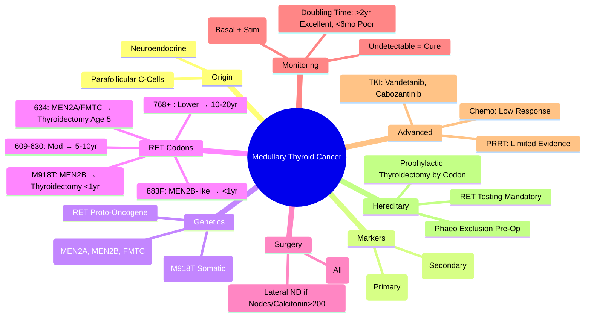

# Medullary Thyroid Cancer (MTC)

> [!info]
> **Medullary Thyroid Cancer (MTC) = Neuroendocrine Tumour from Parafollicular C-Cells.** **Calcitonin = Tumour Marker.** **25% Hereditary (MEN2A/B, FMTC); 75% Sporadic.** **RET Proto-Oncogene Mutation.** **No RAI Uptake.** **Surgery = Only Curative Treatment.**

---

## 1. Learning Objectives
By the end of this note you should be able to:
- [ ] Differentiate sporadic vs hereditary MTC
- [ ] Apply RET codon-based risk stratification for prophylactic thyroidectomy
- [ ] Use calcitonin and CEA for diagnosis, staging, and monitoring
- [ ] Outline surgical management and lymphadenectomy
- [ ] Manage advanced disease (TKI, PRRT)

---

## 2. Aetiology & Genetics

| Type | Frequency | RET Mutation | Associated Syndromes |
|------|-----------|--------------|---------------------|
| **Sporadic** | **75%** | Somatic (M918T 50%) | None |
| **Hereditary** | **25%** | Germline | **MEN2A, MEN2B, FMTC** |

### RET Proto-Oncogene — Key Codons
| Codon | Syndrome | MTC Risk | Phaeo Risk | PHPT Risk | Prophylactic Thyroidectomy Age |
|-------|----------|----------|------------|-----------|-------------------------------|
| **634 (Cys)** | MEN2A, FMTC | **100%** | 50% | 20-30% | **5 Years** |
| **M918T** | MEN2B | **100%** (Earliest, Most Aggressive) | 50% | 0% | **<1 Year (6-12mo)** |
| **883F** | MEN2B-like | High | 50% | 0% | <1 Year |
| **609, 611, 618, 620, 630** | MEN2A, FMTC | High | 50% | 20-30% | 5-10 Years |
| **768, 804, 891** | FMTC | Moderate | Low | Low | 10-20 Years |

---

## 3. Clinical Presentation

| Feature | Details |
|---------|---------|
| **Thyroid Nodule** | Most Common Presentation (Solitary, Firm, Fixed) |
| **Diarrhoea** | Secretory (Calcitonin, Serotonin, Prostaglandins) |
| **Flushing** | Vasoactive Peptides |
| **Cervical Lymphadenopathy** | Common at Presentation |
| **Distant Mets** | Liver, Lung, Bone (Late) |
| **Paraneoplastic** | Cushing (ACTH), SIADH |

---

## 4. Diagnosis & Staging

### Biochemical Markers
| Marker | Significance |
|--------|--------------|
| **Calcitonin** | **Primary Tumour Marker**; Correlates with Tumour Burden |
| **CEA** | **Secondary Marker**; Doubling Time Prognostic |
| **Basal Calcitonin** | >100 pg/mL → Suspicion; >1000 pg/mL → High Probability MTC |
| **Stimulated Calcitonin** | Pentagastrin/Ca²⁺ Stimulation (If Basal Equivocal) |

### Calcitonin Thresholds
| Calcitonin (pg/mL) | Interpretation |
|-------------------|---------------|
| **<10** | Normal (Male <10, Female <10) |
| **10-100** | Indeterminate (C-cell Hyperplasia, Renal Impairment, PPI) |
| **>100** | **Suggestive of MTC** |
| **>1000** | **High Probability MTC** (Often Nodal Mets) |

### Genetic Testing
| Indication | Action |
|-------------|--------|
| **All MTC Patients** | **Mandatory RET Sequencing** (Germline) |
| **Family Members** | **Cascade Testing** (If Germline Mutation Identified) |
| **Prenatal** | CVS/Amniocentesis (If Familial Mutation Known) |

---

## 5. Staging (AJCC 8th) — MTC Specific

| Stage | Age <55 | Age ≥55 |
|-------|---------|---------|
| **I** | T1-T2, N0, M0 | T1, N0, M0 |
| **II** | T3-T4, N0, M0 | T2-T3, N0, M0 |
| **III** | Any T, N1, M0 | T4, N0, M0 |
| **IV (IVA/IVB)** | N1, M0 | Any T, N1, M0 |
| **IVC** | Any T, Any N, **M1** | Any T, Any N, **M1** |

---

## 6. Management

### Surgery — Only Curative Treatment
| Procedure | Indication |
|-----------|------------|
| **Total Thyroidectomy** | **All MTC** |
| **Central Neck Dissection (Level VI)** | **All MTC** (Therapeutic + Prophylactic) |
| **Lateral Neck Dissection (Levels II-V)** | **Clinically Node-Positive** |
| **Prophylactic Lateral Neck** | Controversial (Consider if Basal Calcitonin >200 pg/mL) |

### Lymphadenectomy Extent
| Calcitonin Level | Recommended Surgery |
|------------------|---------------------|
| **<20 pg/mL** | Total Thyroidectomy + Central Neck Dissection |
| **20-200 pg/mL** | Total Thyroidectomy + Central + Lateral (II-V) |
| **>200 pg/mL** | Total Thyroidectomy + Central + Lateral + Consider Mediastinal |

---

## 7. Post-Op Monitoring

| Timepoint | Tests |
|-----------|-------|
| **Post-Op** | Calcitonin, CEA (Basal + Stimulated) |
| **3 Months** | Calcitonin, CEA, Neck US |
| **6 Months** | Calcitonin, CEA, Neck US |
| **Annual** | Calcitonin, CEA, Neck US, Chest CT (If Mets Risk) |

### Response Criteria
| Calcitonin/CEA | Interpretation |
|---------------|----------------|
| **Undetectable (Calcitonin <10 pg/mL)** | **Biochemical Cure** (Excellent Prognosis) |
| **Detectable but Stable** | **Persistent Disease** (Often Micromets) |
| **Rising** | **Structural Recurrence** → Imaging (Neck US, CT, PET-CT, ⁶⁸Ga-DOTATATE) |

### Calcitonin/CEA Doubling Time
| Doubling Time | Prognosis |
|---------------|-----------|
| **>2 Years** | Excellent (Near-Normal Survival) |
| **6 Months - 2 Years** | Intermediate |
| **<6 Months** | Poor (Aggressive Disease) |

---

## 8. Advanced/Metastatic Disease

### Tyrosine Kinase Inhibitors (TKI)
| Agent | Dose | Indication |
|-------|------|------------|
| **Vandetanib** | 300mg OD | **FDA/EMA Approved** (Progressive, Unresectable MTC) |
| **Cabozantinib** | 140mg OD | **FDA/EMA Approved** (Progressive MTC) |
| **Lenvatinib/Sorafenib** | Off-Label | Used if Vandetanib/Cabozantinib Failed |

### PRRT (Peptide Receptor Radionuclide Therapy)
| Indication | Details |
|------------|---------|
| **SSTR2+ Progressive MTC** | **⁶⁸Ga-DOTATATE PET Positive** |
| **Agent** | **¹⁷⁷Lu-DOTATATE** (Evidence Limited vs NETs) |

### Chemotherapy
| Regimen | Efficacy |
|---------|----------|
| **Dacarbazine + 5-FU** | Low Response |
| **Streptozocin** | Limited Data |

---

## 9. Hereditary MTC — Prophylactic Thyroidectomy

| RET Risk Level | Codon | Surgery Timing |
|----------------|-------|----------------|
| **Level A (Highest)** | **M918T, 883F** | **<1 Year (6-12 Months)** |
| **Level B (High)** | **634** (Cysteine) | **5 Years** |
| **Level C (Moderate)** | 609, 611, 618, 620, 630 | **5-10 Years** |
| **Level D (Lower)** | 768, 804, 891 | **10-20 Years** (Calcitonin-Guided) |

**Pre-Op**: Alpha-Blockade for Phaeochromocytoma (If MEN2A/B) **Before** Thyroid Surgery.

---

## 10. Exam Pearls (FCPS/MRCP)

| Topic | Key Point |
|-------|-----------|
| **MTC Origin** | **Parafollicular C-Cells** (Neuroendocrine) |
| **Tumour Marker** | **Calcitonin** (Primary); **CEA** (Secondary) |
| **Genetics** | **RET Proto-Oncogene**; 25% Hereditary (MEN2A/B, FMTC) |
| **Sporadic MTC** | **75%**; Often M918T Somatic |
| **Hereditary MTC** | **25%**; MEN2A (634), MEN2B (M918T), FMTC |
| **No RAI Uptake** | **C-Cells Don't Concentrate Iodine** |
| **Surgery** | **Total Thyroidectomy + Central Neck Dissection** (All MTC) |
| **Prophylactic Thyroidectomy** | RET Codon-Guided: **634 = 5yr; M918T = <1yr** |
| **Calcitonin Thresholds** | >100 = Suggestive; >1000 = High Probability |
| **Post-Op Cure** | **Calcitonin Undetectable (<10 pg/mL)** |
| **Doubling Time** | **>2yr = Excellent; <6mo = Poor** |
| **TKI** | **Vandetanib (300mg OD)**, **Cabozantinib (140mg OD)** |
| **Staging <55** | Stage I/II Only (No Stage III/IV) |
| **Phaeochromocytoma** | **Must Exclude Before Surgery** (Alpha-Blockade First) |

---

## 11. Mind Map

---

## 12. Exam Pearls (FCPS/MRCP)

| Topic | Key Point |
|-------|-----------|
| **MTC Origin** | C-Cells (Neuroendocrine) |
| **Tumour Marker** | **Calcitonin** (Primary); CEA (Secondary) |
| **Genetics** | **RET Proto-Oncogene**; 25% Hereditary |
| **Sporadic MTC** | 75%; M918T Somatic Common |
| **Hereditary MTC** | 25%; MEN2A (634), MEN2B (M918T), FMTC |
| **No RAI Uptake** | C-Cells Don't Concentrate Iodine |
| **Surgery** | Total Thyroidectomy + Central Neck Dissection |
| **Prophylactic Thyroidectomy** | RET Codon: 634=5yr; M918T=<1yr |
| **Calcitonin** | >100 Suggestive; >1000 High Probability |
| **Biochemical Cure** | Calcitonin Undetectable (<10 pg/mL) |
| **Doubling Time** | >2yr Excellent; <6mo Poor |
| **TKI** | Vandetanib, Cabozantinib (FDA Approved) |
| **Phaeochromocytoma** | Exclude Pre-Op (Alpha-Blockade First) |
| **Staging <55** | Stage I/II Only |
| **CEA** | Doubling Time Also Prognostic |

---

## 13. Local Navigation (for Dashboard UI)

> **Parent**: [[../Differentiated Thyroid Cancer (Papillary, Follicular)|Differentiated Thyroid Cancer]]  
> **Hierarchy**: [[../../Davidson Chapter 20 - Endocrinology Hierarchy|Endocrinology Hierarchy]]  
> **Template**: [[../../../Templates/Endocrinology Topic Template|Endocrinology Topic Template]]  
> **See also**: [[MEN2A]], [[MEN2B]], [[RET Proto-Oncogene]], [[Phaeochromocytoma/Paraganglioma]], [[Multiple Endocrine Neoplasia]]
## 14. MCQs (10)
1. **Medullary thyroid cancer origin:**
   A. Parafollicular C-cells
   B. Follicular cells
   C. Pituitary
   D. Adrenal
   E. Parathyroid

2. **MTC genetic basis:**
   A. RET proto-oncogene mutation (sporadic 50%, hereditary 100%)
   B. BRAF
   C. RAS
   D. TP53
   E. TERT

3. **MTC marker:**
   A. Calcitonin + CEA
   B. Tg
   C. TRAb
   D. TSH
   E. PTH

4. **MTC association with MEN:**
   A. MEN2A (RET): MTC + phaeo + hyperparathyroidism; MEN2B: MTC + phaeo + marfanoid + neuromas
   B. MEN1
   C. MEN4
   D. Isolated only
   E. No association

5. **MTC treatment:**
   A. Total thyroidectomy + central/lateral neck dissection; NO RAI; calcitonin/CEA monitoring
   B. RAI + TSH suppression
   C. Chemo first
   D. Observation
   E. EBRT only

6. **MTC prognosis:**
   A. 10-yr survival 75-85% (if confined); worse if mets; hereditary depends on RET mutation
   B. Fatal in 1yr
   C. 100% cure
   D. Same as ATC
   E. Poor regardless

7. **Calcitonin doubling time:**
   A. <6mo = poor prognosis; 6-24mo = intermediate; >24mo = good
   B. Not prognostic
   C. Only for screening
   D. Only post-op
   E. Only in MEN

8. **Hereditary MTC screening:**
   A. RET mutation testing; prophylactic thyroidectomy if positive (timing by mutation level)
   B. Calcitonin only
   C. TSH
   D. US only
   E. No screening

9. **MTC vs DTC:**
   A. MTC: C-cell, calcitonin, RET, no RAI, neck dissection; DTC: follicular, Tg, BRAF, RAI
   B. Same
   C. Both RAI avid
   D. Both follicular
   E. MTC better always

10. **Newer MTC treatments:**
   A. TKIs (vandetanib, cabozantinib) for progressive metastatic MTC
   B. RAI
   C. TSH suppression
   D. Chemo only
   E. Hormone therapy

## 15. SBA Questions (10)
1. **40yo man: thyroid nodule, calcitonin 500, CEA 50, RET mutation. Family screen?**
   A. RET testing for family; prophylactic thyroidectomy if positive
   B. Calcitonin only
   C. TSH
   D. US only
   E. No screening

2. **Same patient: surgery?**
   A. Total thyroidectomy + central/lateral neck dissection (no RAI)
   B. Hemithyroidectomy
   C. RAI after surgery
   D. Observation
   E. EBRT

3. **MEN2A family: RET codon 634 mutation. Prophylactic thyroidectomy age?**
   A. 5 years (or earlier based on calcitonin)
   B. Birth
   C. 10 years
   D. 18 years
   E. 30 years

4. **MTC with liver mets, calcitonin doubling time 4 months. Rx?**
   A. Vandetanib or cabozantinib (TKI); clinical trial
   B. RAI
   C. More surgery
   D. TSH suppression
   E. Observation

5. **Sporadic MTC: no RET mutation. Family screening?**
   A. Not needed (sporadic); monitor calcitonin
   B. Full RET testing
   C. TSH screen
   D. US screen
   E. CEA screen

## 16. Flashcards
- **Q: MTC origin**
  **A: Parafollicular C-cells (neural crest)**

- **Q: MTC genetics**
  **A: RET proto-oncogene: sporadic 50%, hereditary 100% (MEN2A/2B)**

- **Q: MTC markers**
  **A: Calcitonin (sensitive) + CEA (specificity); doubling time prognostic**

- **Q: MTC + MEN**
  **A: MEN2A: MTC + phaeo + hyperparathyroidism; MEN2B: MTC + phaeo + marfanoid + neuromas**

- **Q: MTC treatment**
  **A: Total TT + central/lateral neck dissection; NO RAI; calcitonin/CEA monitoring**

- **Q: MTC prognosis**
  **A: 10-yr 75-85% if confined; worse with mets; hereditary varies by RET codon**

- **Q: Calcitonin DT**
  **A: <6mo = poor; 6-24mo = intermediate; >24mo = good**

- **Q: Hereditary Tx**
  **A: RET testing → prophylactic TT (timing by codon: D/H/E/K = 5yr; C/M = 1yr; A/B = <1yr)**

- **Q: MTC vs DTC**
  **A: MTC: C-cell, calcitonin, RET, no RAI, neck dissection; DTC: follicular, Tg, BRAF, RAI**

- **Q: Progressive MTC**
  **A: TKIs: vandetanib, cabozantinib (for progressive metastatic)**

## 17. Answer Key with Explanations
### MCQs
1. **Parafollicular C-cells** — Medullary thyroid cancer origin:

2. **RET proto-oncogene mutation (sporadic 50%, hereditary 100%)** — MTC genetic basis:

3. **Calcitonin + CEA** — MTC marker:

4. **MEN2A (RET): MTC + phaeo + hyperparathyroidism; MEN2B: MTC + phaeo + marfanoid + neuromas** — MTC association with MEN:

5. **Total thyroidectomy + central/lateral neck dissection; NO RAI; calcitonin/CEA monitoring** — MTC treatment:

6. **10-yr survival 75-85% (if confined); worse if mets; hereditary depends on RET mutation** — MTC prognosis:

7. **<6mo = poor prognosis; 6-24mo = intermediate; >24mo = good** — Calcitonin doubling time:

8. **RET mutation testing; prophylactic thyroidectomy if positive (timing by mutation level)** — Hereditary MTC screening:

9. **MTC: C-cell, calcitonin, RET, no RAI, neck dissection; DTC: follicular, Tg, BRAF, RAI** — MTC vs DTC:

10. **TKIs (vandetanib, cabozantinib) for progressive metastatic MTC** — Newer MTC treatments:

### SBAs
1. **RET testing for family; prophylactic thyroidectomy if positive** — 40yo man: thyroid nodule, calcitonin 500, CEA 50, RET mutation. Family screen?

2. **Total thyroidectomy + central/lateral neck dissection (no RAI)** — Same patient: surgery?

3. **5 years (or earlier based on calcitonin)** — MEN2A family: RET codon 634 mutation. Prophylactic thyroidectomy age?

4. **Vandetanib or cabozantinib (TKI); clinical trial** — MTC with liver mets, calcitonin doubling time 4 months. Rx?

5. **Not needed (sporadic); monitor calcitonin** — Sporadic MTC: no RET mutation. Family screening?

