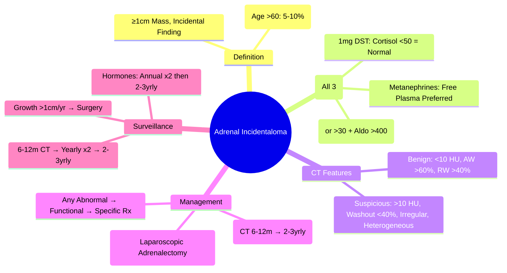

# Adrenal Incidentaloma

> [!info]
> **Adrenal Incidentaloma = Adrenal Mass Discovered Incidentally on Imaging Performed for Unrelated Reason.** Prevalence 3-5% on CT/MRI; Increases with Age. **Mandatory 3-Test Hormonal Workup** (1mg DST, Metanephrines, Aldosterone/Renin Ratio). Management by Size, Function, and Imaging Features.

---

## 1. Learning Objectives
By the end of this note you should be able to:
- [ ] Define adrenal incidentaloma and its epidemiology
- [ ] Apply the mandatory 3-test hormonal workup (DST, Metanephrines, ARR)
- [ ] Interpret CT/MRI features (Hounsfield Units, Washout)
- [ ] Apply size-based and function-based management algorithms
- [ ] Outline surveillance protocol for non-functioning incidentalomas

---

## 2. Epidemiology & Definition

| Feature | Details |
|--------|---------|
| **Definition** | **Adrenal Mass ≥1 cm** Discovered Incidental on Imaging (CT/MRI) for Non-Adrenal Indication |
| **Prevalence** | **3-5%** on CT/MRI (Autopsy: Up to 10%); Increases with Age |
| **Age** | Rare <40y; **>60y: 5-10%** |
| **Sex** | Female > Male (2:1) |
| **Bilaterality** | 10-15% Bilateral |
| **Functional Status** | **80-85% Non-Functioning**, 10-15% Cortisol, 2-5% Phaeo, 1-2% Aldosterone |

---

## 3. Mandatory Hormonal Workup (All 3 Required)

| Test | Purpose | Abnormal = Further Workup |
|------|---------|---------------------------|
| **1. 1mg Overnight Dexamethasone Suppression Test (DST)** | Screen for **Cushing Syndrome** | Cortisol **≥50 nmol/L (1.8 µg/dL)** = Positive |
| **2. Plasma Free Metanephrines** | Screen for **Phaeochromocytoma** | **Metanephrine ≥ Upper Limit** or Normetanephrine ≥ ULN = Positive |
| **3. Aldosterone/Renin Ratio (ARR)** | Screen for **Primary Aldosteronism** | **ARR >70** (or >30 + Aldo >400 pmol/L) = Positive |

**Critical**: **All 3 Tests Must Be Performed** — Missed Functioning Tumour = Missed Cushing/Phaeo/Conn

---

## 4. Interpretation of Hormonal Workup

| Scenario | Action |
|----------|--------|
| **All 3 Normal** | **Non-Functioning** → Proceed to Size/Imaging Assessment |
| **Any Abnormal** | **Functioning** → Specific Management Pathway (Cushing / Phaeo / Conn) |

### Common Pitfalls
| Test | Pitfall | Solution |
|------|---------|----------|
| **DST** | False Positive: Obesity, Depression, Alcohol, Drugs (Enzyme Inducers), Pregnancy/OCP | Confirm with 24h UFC + Late-Night Salivary Cortisol |
| **Metanephrines** | False Positive: Drugs (L-DOPA, SRI, TCA), Stress, Renal Failure | Repeat Fasting, Supine; Confirm with 24h Urine or Clonidine Suppression Test |
| **ARR** | False Positive: K+ Depletion, High Salt Diet, ACEi/ARB/Diuretics | Correct K+, Stop Interfering Drugs 4-6wk; Confirm with Saline Infusion Test |

---

## 5. Imaging Assessment — CT/MRI Features

### CT Attenuation (Hounsfield Units - HU)
| Finding | Interpretation |
|---------|----------------|
| **<10 HU (Non-Contrast)** | **Lipid-Rich Adenoma** (Benign, Likely Non-Functioning) |
| **10-20 HU** | Indeterminate (May Be Lipid-Poor Adenoma) |
| **>20 HU** (Non-Contrast) | **Suspicious** (Carcinoma, Metastasis, Phaeo, Lipid-Poor Adenoma) |

### Washout Study (Contrast-Enhanced CT)
| Washout Type | Formula | Adenoma Threshold | Phaeo/Carcinoma |
|--------------|---------|-------------------|-----------------|
| **Absolute Washout (AW)** | `(Enhanced - Delayed) / (Enhanced - Unenhanced) × 100%` | **>60%** | **<60%** |
| **Relative Washout (RW)** | `(Enhanced - Delayed) / Enhanced × 100%` | **>40%** | **<40%** |

### MRI Features
| Feature | Adenoma | Carcinoma | Phaeochromocytoma |
|---------|---------|-----------|-------------------|
| **T1 Signal** | Low/Intermediate | Variable | High (Fat/T1 Hyperintense) |
| **T2 Signal** | Intermediate | High | **Very High** (Lightbulb Bright) |
| **Chemical Shift (Opposed Phase)** | **Signal Drop** (Lipid) | No Drop | No Drop |
| **Enhancement** | Homogeneous | Heterogeneous | Intense Avid Enhancement |

---

## 6. Management Algorithm

```
Adrenal Incidentaloma Discovered
         │
         ▼
MANDATORY 3-TEST HORMONAL WORKUP
         │
         ├── 1mg DST (Cortisol <50 nmol/L = Excluded)
         ├── Plasma Free Metanephrines (Normal = Excluded)
         └── ARR (Normal = Excluded)
         │
         ├── ALL 3 NORMAL → NON-FUNCTIONING
         │       │
         │       ├── SIZE <4cm + BENIGN FEATURES (<10 HU, Washout >60%)
         │       │       → **SURVEILLANCE**
         │       │           CT 6-12mo → Yearly ×2 → Hormonal Recheck 1yr
         │       │
         │       └── SIZE ≥4cm OR SUSPICIOUS (>10 HU, Washout <40%, Heterogeneous, Irregular)
         │               → **SURGERY** (Laparoscopic Adrenalectomy)
         │
         └── ANY ABNORMAL → FUNCTIONING → SPECIFIC MANAGEMENT
                 ├── Cushing → Surgery (Adrenalectomy)
                 ├── Phaeo → Alpha-Blockade → Surgery
                 └── Conn → AVS → Surgery (Unilateral) / Medical (Bilateral)
```

---

## 7. Surveillance Protocol (Non-Functioning, <4cm, Benign Features)

| Timepoint | Investigations |
|-----------|---------------|
| **6-12 Months** | CT Adrenal (1mm, Contrast), Hormonal Recheck (DST, Metanephrines, ARR) |
| **Yearly ×2** | CT + Hormonal Recheck |
| **Then** | If Stable → **Every 2-3 Years** (CT + Hormones) |
| **If Growth >1cm/yr or New Abnormality** | Reassess → Consider Surgery |

---

## 8. Surgery Indications (Non-Functioning)

| Indication | Threshold |
|------------|-----------|
| **Size ≥4cm** | **Strong Indication** (Malignancy Risk ↑) |
| **Size 2-4cm + Suspicious Features** | >10 HU, Washout <40%, Heterogeneous, Irregular Margins |
| **Growth >1cm/year** | On Surveillance |
| **Patient Preference / Anxiety** | After Counselling |

### Surgical Approach
| Approach | Indication |
|----------|-----------|
| **Laparoscopic Adrenalectomy** | **Gold Standard** (Size <8-10cm, No Invasion) |
| **Open Adrenalectomy** | Large (>10cm), Suspected Carcinoma, Invasion, Prior Surgery |

---

## 9. Follow-up Post-Surgery (Functioning Tumours)

| Timepoint | Assessments |
|-----------|-------------|
| **Day 1-2** | Cortisol, Electrolytes, Glucose, Visual Fields (If Pituitary) |
| **6 Weeks** | Full Hormone Panel, Weight, BP, Visual Fields |
| **3 Months** | Full Hormones, MRI (If Pituitary), Visual Fields |
| **6 Months** | Hormones, MRI (If Indicated), DEXA (Baseline) |
| **Annual ×5 Years** | MRI + Hormones + Visual Fields |
| **Long-term** | 2-3 Yearly MRI + Hormones + Visual Fields |

---

## 10. Exam Pearls (FCPS/MRCP)

| Topic | Key Point |
|-------|-----------|
| **Adrenal Incidentaloma Definition** | **≥1cm** Mass Found Incidentally on Imaging |
| **Prevalence** | **3-5%** on CT/MRI; Increases with Age (>60y: 5-10%) |
| **Mandatory 3 Tests** | **1mg DST, Metanephrines, ARR** (All 3 Mandatory) |
| **DST Cut-off** | Cortisol **<50 nmol/L (1.8 µg/dL)** = Normal Suppression |
| **Metanephrines** | Plasma Free Metanephrines Preferred; False Positives: Drugs, Stress |
| **ARR Cut-off** | **ARR >70** (or >30 + Aldo >400 pmol/L) |
| **Non-Functioning <4cm + Benign CT** | **Surveillance** (CT 6-12mo → Yearly ×2 → 2-3yrly) |
| **Non-Functioning ≥4cm** | **Surgery** (Laparoscopic Adrenalectomy) |
| **CT Benign Features** | **<10 HU (Non-Contrast), Washout >60% (Absolute), >40% (Relative)** |
| **CT Suspicious Features** | >10 HU (Non-Contrast), Washout <40%, Heterogeneous, Irregular Margins |
| **Functioning Incidentaloma** | Cushing (DST+), Phaeo (Metanephrines+), Conn (ARR+) → Specific Management |
| **Surveillance Protocol** | CT 6-12mo → Yearly ×2 → 2-3yrly; Hormones 1yr then 2-3yrly |

---

## 11. Confusions & Mnemonics

| Confusion | Clarification |
|-----------|---------------|
| **Incidentaloma vs Functioning** | Incidentaloma = Incidental Finding; May Be Functioning (10-15%) or Non-Functioning |
| **DST False Positives** | Obesity, Depression, Alcohol, Enzyme Inducers (Phenytoin, Rifampicin), Pregnancy/OCP |
| **Metanephrines False Positives** | Drugs (L-DOPA, SSRIs, TCAs), Stress, Renal Failure, Catecholamine Diet |
| **ARR False Positives** | Hypokalaemia, Diuretics, ACEi/ARB, High Salt Diet |
| **Size Cutoff** | **<4cm + Benign CT = Observe**; **≥4cm or Suspicious = Surgery** |
| **HU Thresholds** | **<10 HU** = Lipid-Rich Adenoma (Benign); **>20 HU** = Suspicious |
| **Washout** | **AW >60%** or **RW >40%** = Adenoma; <60%/<40% = Suspicious |

---

## 12. Mind Map



---

## 13. Exam Pearls (FCPS/MRCP)

| Topic | Key Point |
|-------|-----------|
| **Adrenal Incidentaloma** | **≥1cm** Mass Found Incidentally; **3-5% Prevalence** |
| **3 Mandatory Tests** | **1mg DST, Metanephrines, ARR** — All 3 Required |
| **DST Normal** | Cortisol **<50 nmol/L (1.8 µg/dL)** |
| **Metanephrines** | Plasma Free Preferred; False +ve: Drugs, Stress, Renal Failure |
| **ARR Cut-off** | **>70** (or >30 + Aldo >400 pmol/L) |
| **CT Benign** | **<10 HU, AW >60%, RW >40%** |
| **CT Suspicious** | **>10 HU, Washout <40%, Irregular Margins** |
| **Incidentaloma Size** | **<4cm + Benign → Observe**; **≥4cm OR Suspicious → Surgery** |
| **Surveillance** | CT 6-12m → Yearly ×2 → 2-3yrly; Hormones Annual ×2 then 2-3yrly |
| **Functioning Incidentaloma** | DST+/Met+ve/ARR+ → Specific Management (Cushing/Phaeo/Conn) |
| **HU Thresholds** | **<10 HU = Lipid-Rich Adenoma**; **>20 HU = Suspicious** |

---

## 14. Local Navigation (for Dashboard UI)

> **Parent**: [[../Adrenal Disorders|Adrenal Disorders]]  
> **Hierarchy**: [[../../Davidson Chapter 20 - Endocrinology Hierarchy|Endocrinology Hierarchy]]  
> **Template**: [[../../../Templates/Endocrinology Topic Template|Endocrinology Topic Template]]  
> **See also**: [[Adrenal Cushing]], [[Phaeochromocytoma/Paraganglioma]], [[Primary Aldosteronism]], [[Adrenal Crisis]], [[Adrenal Insufficiency- Primary (Addison)]]
## 15. MCQs (10)
1. **Adrenal incidentaloma definition:**
   A. Adrenal mass >1cm found incidentally on imaging for unrelated reason
   B. Any adrenal mass
   C. Mass >4cm
   D. Functioning mass only
   E. Mass with symptoms

2. **Prevalence:**
   A. 4-5% on CT; increases with age
   B. <1%
   C. 10-15%
   D. 20%
   E. 0.1%

3. **Functional assessment required:**
   A. 1mg DST + plasma metanephrines + aldosterone/renin
   B. Only 1mg DST
   C. Only metanephrines
   D. Only aldosterone/renin
   E. Only imaging

4. **Subclinical Cushing:**
   A. 1mg DST cortisol 50-138 nmol/L; no clinical Cushing
   B. Overt Cushing
   C. Normal DST
   D. Adrenal Cushing
   E. Ectopic ACTH

5. **Indications for adrenalectomy:**
   A. Mass >4cm, suspicious imaging, functional (Cushing/phaeo/Conn)
   B. All masses >1cm
   C. Mass >2cm
   D. Only functional
   E. Only >6cm

6. **Adrenal adenoma imaging:**
   A. Homogeneous, low attenuation (<10 HU on unenhanced CT)
   B. Heterogeneous, high attenuation
   C. Irregular borders
   D. Invasion
   E. Necrosis

7. **Adrenal carcinoma imaging:**
   A. >4-6cm, heterogeneous, high attenuation (>20 HU), irregular, invasion
   B. Homogeneous, <10 HU
   C. Small <2cm
   D. Smooth borders
   E. Fat-containing

8. **Phaeochromocytoma on incidentaloma:**
   A. Plasma free metanephrines best screening test
   B. VMA only
   C. Catecholamines only
   D. 1mg DST
   E. Aldosterone/renin

9. **Primary aldosteronism on incidentaloma:**
   A. Aldosterone/renin ratio (ARR) screening
   B. 1mg DST
   C. Metanephrines
   D. CT only
   E. MRI only

10. **Follow-up non-functional <4cm:**
   A. Repeat CT 6-12mo, then annually x1-2yr; hormone screen annually
   B. No follow-up
   C. Immediate surgery
   D. Repeat in 5 years
   E. Only hormone screen

## 16. SBA Questions (10)
1. **60yo woman: incidental 2.5cm left adrenal mass, homogeneous 5 HU. 1mg DST cortisol 30, metanephrines normal, ARR normal. Management?**
   A. Follow-up CT 6-12mo; annual hormone screen
   B. Adrenalectomy
   C. Ketoconazole
   D. RAI
   E. Observation only

2. **Same but 1mg DST cortisol 80 (subclinical Cushing), HTN, T2DM. Management?**
   A. Adrenalectomy (subclinical Cushing + comorbidities)
   B. Follow-up
   C. Ketoconazole
   D. Observation
   E. Metyrapone

3. **50yo man: 5cm right adrenal mass, 25 HU, heterogeneous. 1mg DST 200, metanephrines 2x ULN. Management?**
   A. Adrenalectomy (size >4cm + suspicious imaging + possible phaeo)
   B. Follow-up
   C. Ketoconazole
   D. RAI
   E. Observation

4. **Adrenal incidentaloma with primary aldosteronism (ARR high, CT nodule). Next?**
   A. AVS → if unilateral → adrenalectomy
   B. Adrenalectomy directly
   C. Spironolactone only
   D. Follow-up
   E. RAI

5. **30yo woman: 3cm adrenal mass, 10 HU, 1mg DST 20, metanephrines normal, ARR normal. Follow-up?**
   A. CT 6-12mo, then annually x1-2yr; annual hormone screen
   B. Immediate surgery
   C. No follow-up
   D. Ketoconazole
   E. RAI

## 17. Flashcards
- **Q: Incidentaloma definition**
  **A: Adrenal mass >1cm found incidentally on imaging for unrelated reason**

- **Q: Prevalence**
  **A: 4-5% on CT; increases with age**

- **Q: Functional workup**
  **A: 1mg DST + plasma free metanephrines + aldosterone/renin ratio**

- **Q: Subclinical Cushing**
  **A: 1mg DST cortisol 50-138 nmol/L; no clinical features**

- **Q: Surgery indications**
  **A: >4cm, suspicious imaging, functional (Cushing/phaeo/Conn)**

- **Q: Adenoma CT**
  **A: Homogeneous, <10 HU (lipid-rich)**

- **Q: Carcinoma CT**
  **A: >4-6cm, heterogeneous, >20 HU, irregular, invasion**

- **Q: Phaeo screening**
  **A: Plasma free metanephrines (or 24h urinary)**

- **Q: Conn screening**
  **A: ARR (aldosterone/renin)**

- **Q: Follow-up non-functional <4cm**
  **A: CT 6-12mo, annually x1-2yr; annual hormone screen**

## 18. Answer Key with Explanations
### MCQs
1. **Adrenal mass >1cm found incidentally on imaging for unrelated reason** — Adrenal incidentaloma definition:

2. **4-5% on CT; increases with age** — Prevalence:

3. **1mg DST + plasma metanephrines + aldosterone/renin** — Functional assessment required:

4. **1mg DST cortisol 50-138 nmol/L; no clinical Cushing** — Subclinical Cushing:

5. **Mass >4cm, suspicious imaging, functional (Cushing/phaeo/Conn)** — Indications for adrenalectomy:

6. **Homogeneous, low attenuation (<10 HU on unenhanced CT)** — Adrenal adenoma imaging:

7. **>4-6cm, heterogeneous, high attenuation (>20 HU), irregular, invasion** — Adrenal carcinoma imaging:

8. **Plasma free metanephrines best screening test** — Phaeochromocytoma on incidentaloma:

9. **Aldosterone/renin ratio (ARR) screening** — Primary aldosteronism on incidentaloma:

10. **Repeat CT 6-12mo, then annually x1-2yr; hormone screen annually** — Follow-up non-functional <4cm:


### SBAs
1. **Follow-up CT 6-12mo; annual hormone screen** — 60yo woman: incidental 2.5cm left adrenal mass, homogeneous 5 HU. 1mg DST cortisol 30, metanephrines normal, ARR normal. Management?

2. **Adrenalectomy (subclinical Cushing + comorbidities)** — Same but 1mg DST cortisol 80 (subclinical Cushing), HTN, T2DM. Management?

3. **Adrenalectomy (size >4cm + suspicious imaging + possible phaeo)** — 50yo man: 5cm right adrenal mass, 25 HU, heterogeneous. 1mg DST 200, metanephrines 2x ULN. Management?

4. **AVS → if unilateral → adrenalectomy** — Adrenal incidentaloma with primary aldosteronism (ARR high, CT nodule). Next?

5. **CT 6-12mo, then annually x1-2yr; annual hormone screen** — 30yo woman: 3cm adrenal mass, 10 HU, 1mg DST 20, metanephrines normal, ARR normal. Follow-up?

