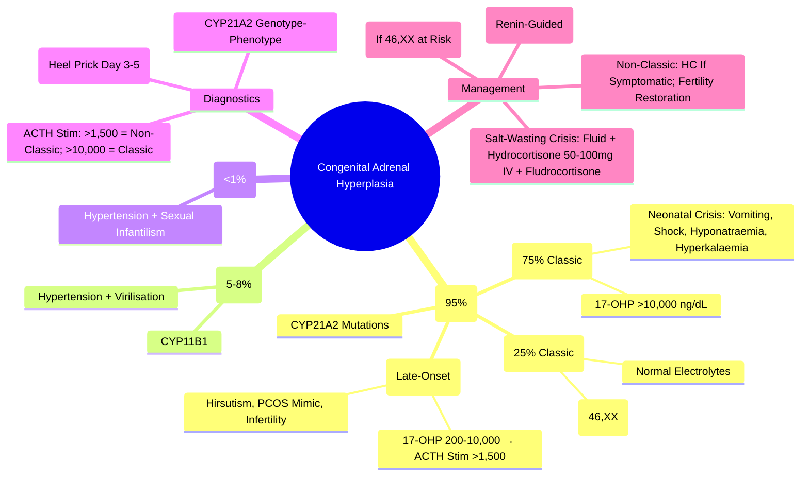

# Congenital Adrenal Hyperplasia (CAH)

> [!info]
> **Congenital Adrenal Hyperplasia (CAH) = Autosomal Recessive Disorders of Cortisol Biosynthesis.** **21-Hydroxylase Deficiency = 95% of Cases.** Bimodal Presentation: **Salt-Wasting (Classic Severe)** and **Simple Virilising (Classic Non-Salt-Wasting)**. Non-Classic (Late-Onset) Form Common.

---

## 1. Learning Objectives
By the end of this note you should be able to:
- [ ] Classify CAH by enzyme defect and clinical phenotype
- [ ] Recognise salt-wasting crisis in neonates
- [ ] Apply 17-OHP screening and interpret genotype-phenotype correlation
- [ ] Prescribe glucocorticoid and mineralocorticoid replacement
- [ ] Counsel on prenatal diagnosis and treatment

---

## 2. Enzyme Defects & Classification

| Enzyme Defect | Gene | Frequency | Cortisol | Aldosterone | Androgens | Clinical Phenotype |
|---------------|------|-----------|----------|-------------|-----------|-------------------|
| **21-Hydroxylase** | **CYP21A2** | **95%** | ↓↓ | ↓ (Salt-Wasting) / Normal (Simple Virilising) | **↑↑** | **Salt-Wasting / Simple Virilising / Non-Classic** |
| **11β-Hydroxylase** | **CYP11B1** | **5-8%** | ↓ | **Normal/↑ (Hypertension)** | **↑↑** | Virilising + **Hypertension** |
| **17α-Hydroxylase** | **CYP17A1** | **<1%** | ↓ | **↑ (Hypertension)** | **↓** | Sexual Infantilism + **Hypertension** |
| **3β-HSD** | **HSD3B2** | **<1%** | ↓ | ↓ | ↓ (Mild ↑ DHEA) | Salt-Wasting, Ambiguous Genitalia |
| **Cytochrome P450 Oxidoreductase (POR)** | **POR** | Rare | ↓ | Variable | Variable | Antley-Bixler Syndrome, Skeletal Dysplasia |

---

## 3. 21-Hydroxylase Deficiency — Most Common (95%)

### Clinical Variants

| Variant | Frequency | 17-OHP (Basal) | Aldosterone | Presentation |
|---------|-----------|----------------|-------------|-------------|
| **Salt-Wasting (Classic Severe)** | **~75% of Classic** | **>10,000 ng/dL** (Often >30,000) | **Absent/↓** | **Neonatal Salt-Wasting Crisis** (Vomiting, Dehydration, Shock, Hyponatraemia, Hyperkalaemia) |
| **Simple Virilising (Classic Non-Salt-Wasting)** | **~25% of Classic** | **>10,000 ng/dL** | **Normal** | **Ambiguous Genitalia (46,XX)**; Precocious Puberty, Rapid Growth, Acne |
| **Non-Classic (Late-Onset)** | **Most Common Overall** | **200-10,000 ng/dL** (Stimulated >1,500) | Normal | **Hirsutism, Acne, Oligomenorrhoea, Infertility** (PCOS Mimic) |

---

## 4. Pathophysiology — 21-Hydroxylase Deficiency

| Step | Normal | 21-OH Deficiency |
|------|--------|------------------|
| **Progesterone → 17-OHP** | 21-OH | **Blocked** |
| **17-OHP → 11-Deoxycortisol** | 21-OH | **Blocked** → **Cortisol ↓↓** |
| **Progesterone → Deoxycorticosterone** | 21-OH | **Blocked** → **Aldosterone ↓** (Salt-Wasting) |
| **Precursor Accumulation** | — | **17-OHP ↑↑**, **Progesterone ↑** |
| **Alternative Pathway** | — | **Shunt to Androgens** → **Androstenedione ↑↑, Testosterone ↑↑** |

---

## 5. Clinical Presentation by Variant

### Neonatal Salt-Wasting Crisis (7-14 Days)
| Feature | Details |
|---------|---------|
| **Presentation** | Vomiting, Poor Feeding, Weight Loss, Dehydration, **Shock** |
| **Electrolytes** | **Hyponatraemia (<130)**, **Hyperkalaemia (>6.5)**, Metabolic Acidosis |
| **Genitals (46,XX)** | **Ambiguous** (Prader 2-5): Clitoromegaly, Labial Fusion, Urogenital Sinus |
| **Genitals (46,XY)** | **Normal Male** (May Have Penile Enlargement) |
| **Diagnosis** | **17-OHP >10,000 ng/dL** (Often >30,000), Hyponatraemia, Hyperkalaemia, Metabolic Acidosis |

### Simple Virilising (Classic Non-Salt-Wasting)
| Feature | 46,XX | 46,XY |
|---------|-------|-------|
| **Genitals** | **Ambiguous** (Clitoromegaly, Labial Fusion) | Normal Male (May Have Penile Enlargement) |
| **Childhood** | Rapid Growth, Advanced Bone Age, Premature Pubarche, Acne |
| **Adulthood** | Oligomenorrhoea, Infertility, Hirsutism, PCOS Mimic |

### Non-Classic (Late-Onset)
| Feature | Details |
|---------|---------|
| **Onset** | Childhood/Adolescence/Adulthood |
| **Features** | Hirsutism, Acne, Oligomenorrhoea, Infertility, **PCOS Mimic** |
| **Biochemistry** | **Basal 17-OHP: 200-10,000 ng/dL**; **ACTH Stimulation: 17-OHP >1,500 ng/dL** |
| **Treatment** | **Glucocorticoid** (Hydrocortisone/Prednisolone) if Symptomatic |

---

## 6. Newborn Screening & Diagnosis

### 17-OHP Newborn Screening (Heel Prick, Day 3-5)
| Result (17-OHP) | Interpretation | Action |
|-----------------|----------------|--------|
| **<40 ng/mL (Term)** / **<100 ng/mL (Preterm)** | Normal | None |
| **40-100 ng/mL** | Borderline | **Repeat at 2 Weeks** |
| **>100 ng/mL** | **Suggestive** | **Confirm with Serum 17-OHP + Electrolytes** |
| **>1,000 ng/mL** | **Highly Suggestive** | **Urgent Paediatric Endocrine Review** |

### Confirmatory Testing
| Test | Normal | Classic CAH | Non-Classic CAH |
|------|--------|-------------|----------------|
| **Basal 17-OHP** | <200 ng/dL | **>10,000 ng/dL** | 200-10,000 ng/dL |
| **ACTH Stimulation (250µg)** | 17-OHP <1,000 ng/dL | **>10,000** | **>1,500 ng/dL** |
| **Genetic Testing** | — | **CYP21A2 Mutations** | Confirms Non-Classic |

### Genotype-Phenotype Correlation (CYP21A2)
| Mutation Severity | 21-OH Enzyme Activity | Phenotype |
|-------------------|------------------------|-----------|
| **Null (Deletion, Large Conversion)** | **0%** | **Salt-Wasting** |
| **Severe (I2G, Cluster E)** | **1-2%** | **Salt-Wasting** |
| **Moderate (I172N, P30L)** | **2-10%** | **Simple Virilising** |
| **Mild (V281L, P453S)** | **20-50%** | **Non-Classic** |

---

## 7. Prenatal Diagnosis & Treatment

### At-Risk Pregnancy (Previous Affected Child / Known Carrier Parents)
| Test | Timing | Method |
|------|--------|--------|
| **Chorionic Villus Sampling (CVS)** | **10-12 Weeks** | **CYP21A2 Mutation Analysis** |
| **Amniocentesis** | **15-18 Weeks** | **CYP21A2 + 17-OHP in Amniotic Fluid** |
| **Cell-Free Fetal DNA** | **>9 Weeks** | Fetal Sex (If 46,XX → Treat) |

### Prenatal Dexamethasone Treatment (If 46,XX Fetus)
| Regimen | Details |
|---------|---------|
| **Dose** | **Dexamethasone 20 µg/kg/day** (Max 1.5 mg/day) in 3 Divided Doses |
| **Timing** | **Start ≤9 Weeks** (Ideally 5-7 Weeks) → Until Delivery |
| **Mechanism** | Suppresses Fetal HPA Axis → ↓ 17-OHP → **Prevents Virilisation** |
| **Controversy** | Maternal Side Effects (Weight Gain, Hyperglycaemia, Mood); **Not Standard in All Centres** |

---

## 8. Postnatal Management — Classic CAH (21-OH Deficiency)

### Acute Salt-Wasting Crisis
| Step | Intervention |
|------|-------------|
| **1. Fluid Resuscitation** | **0.9% NaCl 20 mL/kg Bolus** → Repeat → Maintenance Fluids |
| **2. Glucose** | **10% Dextrose** if Hypoglycaemic |
| **3. Electrolytes** | Correct **Hyponatraemia** (0.9% NaCl), **Hyperkalaemia** (Insulin/Dextrose, Calcium Gluconate, Kayexalate) |
| **4. Hydrocortisone** | **50-100 mg IV STAT** (Then 50-100 mg/m²/day Divided Q6H) |
| **5. Fludrocortisone** | **50-200 µg/day Oral** (Start Once Stable, Adjust by Renin) |
| **6. Salt Supplementation** | **NaCl 1-2 g/day** (Infants) |

### Chronic Glucocorticoid Replacement
| Age | Hydrocortisone Dose (mg/m²/day) | Division |
|-----|--------------------------------|----------|
| **Infants/Children** | **10-15 mg/m²/day** | **3 Divided Doses** (AM, Noon, PM) |
| **Adolescents/Adults** | **15-20 mg/m²/day** | **BD or TDS** |
| **Monitoring** | **17-OHP (Target 100-1000 ng/dL)**, Androstenedione, Height Velocity, Bone Age, BP |

### Mineralocorticoid Replacement (Fludrocortisone)
| Parameter | Target |
|-----------|--------|
| **Dose** | **50-200 µg/day** (Usually 100 µg) |
| **Adjust By** | **Plasma Renin Activity (Target: Upper Normal)** |
| **Electrolytes** | Na+, K+ Normal; BP Normal |

### Surgical Management (46,XX Ambiguous Genitalia)
| Procedure | Timing | Goal |
|----------|--------|------|
| **Clitoroplasty** | 6-12 Months | Cosmesis, Preserve Sensation |
| **Vaginoplasty** | Adolescence | Functional Vagina |
| **Decision** | Multidisciplinary Team + Family Counselling | |

---

## 9. Non-Classic (Late-Onset) CAH Management

| Aspect | Details |
|--------|---------|
| **Indication for Treatment** | Symptomatic: Hirsutism, Acne, Oligomenorrhoea, Infertility |
| **Glucocorticoid** | **Hydrocortisone 10-20 mg/day** or **Prednisolone 5-10 mg/day** |
| **Dose Adjustment** | Target: **17-OHP <1,000 ng/dL**, Normal Androgens |
| **Fertility** | **Glucocorticoid Normalises Ovulation** in >80% |
| **Pregnancy** | Continue Glucocorticoid; **No Dexamethasone Needed** (Unlike Prenatal) |

---

## 10. Complications & Long-Term Monitoring

| Complication | Monitoring | Prevention |
|--------------|------------|------------|
| **Growth Failure** | Height Velocity q3mo; Bone Age q6-12mo | Optimise Hydrocortisone Dose (Avoid Over-Replacement) |
| **Advanced Bone Age** | Bone Age q6-12mo | Avoid Over-Replacement |
| **Obesity/Metabolic Syndrome** | BMI, Lipids, Glucose q6-12mo | Minimise Glucocorticoid Dose |
| **Osteoporosis** | DEXA q2-3yr | Calcium/Vit D Adequate; Limit GC |
| **Infertility (Females)** | AMH, FSH, LH, Pelvic US | Optimise GC Dose; Fertility Preservation |

---

## 11. Exam Pearls (FCPS/MRCP)

| Topic | Key Point |
|-------|-----------|
| **CAH Most Common** | **21-Hydroxylase Deficiency (95%)** — CYP21A2 Gene |
| **Salt-Wasting Crisis** | Neonate (7-14d): Vomiting, Dehydration, Shock, **Hyponatraemia + Hyperkalaemia** |
| **17-OHP Screening** | Heel Prick Day 3-5; >100 ng/mL → Confirm; >1000 ng/mL = Classic CAH |
| **Genotype-Phenotype** | Null Mutation = Salt-Wasting; I172N = Simple Virilising; V281L = Non-Classic |
| **Prenatal Dexamethasone** | 20 µg/kg/day from ≤9 Weeks → Prevents Virilisation (46,XX) |
| **Salt-Wasting Crisis Rx** | 0.9% NaCl Bolus + **Hydrocortisone 50-100mg IV** + Fludrocortisone + NaCl |
| **Glucocorticoid Dose** | 10-15 mg/m²/day (Children); **15-20 mg/m²/day** (Adults) Divided TDS |
| **Fludrocortisone** | **50-200 µg/day**; Adjust by **Renin (Target Upper Normal)** |
| **Non-Classic CAH** | 17-OHP 200-10,000 ng/dL; ACTH Stim >1,500 ng/dL; PCOS Mimic |
| **Prenatal Dexamethasone** | 20 µg/kg/day from ≤9 Weeks (If 46,XX); Controversial |
| **17-OHP Newborn Screen** | >100 ng/mL → Confirm; >1000 = Classic; >10,000 = Salt-Wasting |

---

## 12. Confusions & Mnemonics

| Confusion | Clarification |
|-----------|---------------|
| **Salt-Wasting vs Simple Virilising** | SW: Aldosterone Deficient (Hyponatraemia, Hyperkalaemia); SV: Aldosterone Normal |
| **21-OH vs 11β-OH Deficiency** | 21-OH: Aldosterone ↓ (Salt-Wasting); 11β-OH: Aldosterone Normal/↑ (Hypertension) |
| **Non-Classic vs PCOS** | Both: Hirsutism, Oligomenorrhoea; Non-Classic: ↑ 17-OHP on ACTH Stim |
| **17-OHP in Newborn Screen** | Premature: Higher Cutoffs; Term: >100 ng/mL Abnormal |
| **Prenatal Dexamethasone** | Only for 46,XX Fetus at Risk; Start ≤9 Weeks; Maternal Side Effects Significant |
| **Fludrocortisone Dose** | 50-200 µg/day; Titrate to **Renin (Target Upper Normal)** |

**Mnemonic: CAH 21-OH DEFICIENCY**
- **2**1-OH **B**lock → **C**ortisol ↓, **A**ldosterone ↓
- **H**ydrocortisone + **F**ludrocortisone
- **1**7-OHP ↑↑ (Screening Marker)
- **S**alt-Wasting: **H**yponatraemia + **H**yperkalaemia
- **V**irilisation: **A**ndrogens ↑↑

**Mnemonic: 21-OH DEFECT PATHWAY**
- **P**rogesterone → **1**7-OHP → **B**LOCKED (21-OH) → **C**ortisol ↓, **A**ldosterone ↓
- **S**hunt to **A**ndrogens → **V**irilisation

---

## 13. Mind Map

---

## 14. Exam Pearls (FCPS/MRCP)

| Topic | Key Point |
|-------|-----------|
| **CAH Most Common** | **21-OH Deficiency (95%)** — CYP21A2 Gene |
| **Salt-Wasting Crisis** | Neonate 7-14d: **Vomiting, Shock, Hyponatraemia, Hyperkalaemia** |
| **17-OHP Newborn Screen** | **>100 ng/mL** → Confirm; **>1000 = Classic**; **>10,000 = Salt-Wasting** |
| **Genotype-Phenotype** | Null = Salt-Wasting; I172N = Simple Virilising; V281L = Non-Classic |
| **Salt-Wasting Crisis Rx** | **0.9% NaCl Bolus + Hydrocortisone 50-100mg IV + Fludrocortisone + NaCl** |
| **Glucocorticoid Dose** | **10-15 mg/m²/day (Children)**; **15-20 mg/m²/day** (Adults) TDS |
| **Fludrocortisone Dose** | **50-200 µg/day**; Adjust by **Renin (Target Upper Normal)** |
| **Non-Classic CAH** | 17-OHP 200-10,000 ng/dL; ACTH Stim >1,500 ng/dL; PCOS Mimic |
| **Prenatal Dexamethasone** | 20 µg/kg/day from ≤9 Weeks (If 46,XX); Controversial |
| **17-OHP Newborn Screen** | >100 ng/mL → Confirm; >1000 = Classic; >10,000 = Salt-Wasting |

---

## 15. Local Navigation (for Dashboard UI)

> **Parent**: [[../Adrenal Disorders|Adrenal Disorders]]  
> **Hierarchy**: [[../../Davidson Chapter 20 - Endocrinology Hierarchy|Endocrinology Hierarchy]]  
> **Template**: [[../../../Templates/Endocrinology Topic Template|Endocrinology Topic Template]]  
> **See also**: [[Adrenal Insufficiency- Primary (Addison)]], [[Adrenal Crisis]], [[Drug-Induced Thyroid Dysfunction]], [[Adrenal Insufficiency- Secondary & Tertiary]]
## 16. MCQs (10)
1. **Commonest CAH:**
   A. 21-hydroxylase deficiency (95%)
   B. 11β-hydroxylase deficiency
   C. 17α-hydroxylase deficiency
   D. 3β-HSD deficiency
   E. Lipoid CAH

2. **21-OH deficiency classic salt-wasting:**
   A. Hyponatraemia + hyperkalaemia + virilisation (46,XX)
   B. Hypertension + virilisation
   C. Sexual infantilism + HTN
   D. Isolated cortisol deficiency
   E. Isolated aldosterone deficiency

3. **21-OH deficiency simple virilising:**
   A. Virilisation (46,XX) without salt-wasting
   B. Salt-wasting only
   C. Hypertension
   D. Sexual infantilism
   E. Isolated cortisol deficiency

4. **11β-OH deficiency:**
   A. Hypertension (DOC↑) + virilisation (androgens↑)
   B. Salt-wasting + virilisation
   C. Sexual infantilism + HTN
   D. Isolated aldosterone deficiency
   E. No virilisation

5. **17α-OH deficiency:**
   A. Hypertension (mineralocorticoid excess) + sexual infantilism (sex steroids↓)
   B. Salt-wasting + virilisation
   C. Hypertension + virilisation
   D. Isolated cortisol deficiency
   E. No HTN

6. **21-OH diagnosis:**
   A. 17-OH progesterone markedly elevated
   B. 11-deoxycortisol elevated
   C. DOC elevated
   D. Cortisol elevated
   E. Aldosterone elevated

7. **CAH treatment glucocorticoid:**
   A. Hydrocortisone 10-15mg/m²/day divided TDS
   B. Prednisolone 5mg OD
   C. Dexamethasone 0.5mg OD
   D. Hydrocortisone 20mg OD
   E. Fludrocortisone only

8. **CAH treatment mineralocorticoid:**
   A. Fludrocortisone 50-200µg/day (salt-wasting)
   B. Hydrocortisone only
   C. Spironolactone
   D. Eplerenone
   E. Not needed

9. **CAH monitoring:**
   A. 17-OHP, androstenedione, renin, electrolytes, BP, growth
   B. Only cortisol
   C. Only ACTH
   D. Only electrolytes
   E. Only BP

10. **Lipoid CAH:**
   A. STAR or CYP11A1 mutation; lethal salt-wasting; adrenal lipid accumulation
   B. Mild CAH
   C. Only virilising
   D. Only HTN
   E. Adult onset

## 17. SBA Questions (10)
1. **46,XX neonate: ambiguous genitalia, Na+ 125, K+ 6.5, 17-OHP 1500 nmol/L. Diagnosis?**
   A. 21-OH deficiency (salt-wasting)
   B. 11β-OH deficiency
   C. 17α-OH deficiency
   D. 3β-HSD deficiency
   E. Lipoid CAH

2. **Same neonate: immediate management?**
   A. HC 25mg IV + 0.9% saline + fludrocortisone 50µg
   B. Surgery first
   C. Observation
   D. Dexamethasone
   E. Fludrocortisone only

3. **46,XX child: virilisation, normal electrolytes, 17-OHP elevated. Type?**
   A. 21-OH simple virilising (non-salt-wasting)
   B. 21-OH salt-wasting
   C. 11β-OH deficiency
   D. 17α-OH deficiency
   E. 3β-HSD deficiency

4. **46,XY neonate: normal genitalia, hypertension, hypokalaemia, 11-deoxycortisol↑. Diagnosis?**
   A. 11β-OH deficiency
   B. 21-OH deficiency
   C. 17α-OH deficiency
   D. 17β-HSD deficiency
   E. Apparent mineralocorticoid excess

5. **CAH long-term monitoring:**
   A. 17-OHP, androstenedione, renin, electrolytes, BP, growth q3-6mo
   B. Only cortisol
   C. Only ACTH
   D. Only electrolytes
   E. Only BP

## 18. Flashcards
- **Q: 21-OH deficiency (95% CAH)**
  **A: ↓Cortisol, ↓Aldo → ↑17-OHP → ↑Androgens → salt-wasting + virilisation (46,XX)**

- **Q: 11β-OH deficiency**
  **A: ↓Cortisol → ↑11-deoxycortisol + ↑DOC (mineralocorticoid) → HTN + virilisation**

- **Q: 17α-OH deficiency**
  **A: ↓Sex steroids → sexual infantilism; ↑Mineralocorticoids (DOC) → HTN**

- **Q: 21-OH salt-wasting**
  **A: 46,XX: ambiguous genitalia + salt-wasting; 46,XY: normal genitalia + salt-wasting**

- **Q: 21-OH simple virilising**
  **A: Virilisation without salt-wasting; 46,XX ambiguous genitalia; electrolytes normal**

- **Q: Diagnosis**
  **A: 17-OHP ↑↑ (markedly in salt-wasting); genetic testing CYP21A2**

- **Q: Glucocorticoid Rx**
  **A: HC 10-15mg/m²/day TDS (mimic circadian); suppress 17-OHP/androgens**

- **Q: Mineralocorticoid Rx**
  **A: Fludrocortisone 50-200µg/day (salt-wasting); titrate to renin/BP/electrolytes**

- **Q: Monitoring**
  **A: 17-OHP, androstenedione, renin, electrolytes, BP, growth q3-6mo**

- **Q: Lipoid CAH**
  **A: STAR/CYP11A1 mutation; lethal salt-wasting; adrenal lipid accumulation; 46,XY female genitalia**

- **Q: Prenatal Rx**
  **A: Dexamethasone to mother if 46,XX fetus at risk (prevents virilisation)**

## 19. Answer Key with Explanations
### MCQs
1. **21-hydroxylase deficiency (95%)** — Commonest CAH:

2. **Hyponatraemia + hyperkalaemia + virilisation (46,XX)** — 21-OH deficiency classic salt-wasting:

3. **Virilisation (46,XX) without salt-wasting** — 21-OH deficiency simple virilising:

4. **Hypertension (DOC↑) + virilisation (androgens↑)** — 11β-OH deficiency:

5. **Hypertension (mineralocorticoid excess) + sexual infantilism (sex steroids↓)** — 17α-OH deficiency:

6. **17-OH progesterone markedly elevated** — 21-OH diagnosis:

7. **Hydrocortisone 10-15mg/m²/day divided TDS** — CAH treatment glucocorticoid:

8. **Fludrocortisone 50-200µg/day (salt-wasting)** — CAH treatment mineralocorticoid:

9. **17-OHP, androstenedione, renin, electrolytes, BP, growth** — CAH monitoring:

10. **STAR or CYP11A1 mutation; lethal salt-wasting; adrenal lipid accumulation** — Lipoid CAH:

### SBAs
1. **21-OH deficiency (salt-wasting)** — 46,XX neonate: ambiguous genitalia, Na+ 125, K+ 6.5, 17-OHP 1500 nmol/L. Diagnosis?

2. **HC 25mg IV + 0.9% saline + fludrocortisone 50µg** — Same neonate: immediate management?

3. **21-OH simple virilising (non-salt-wasting)** — 46,XX child: virilisation, normal electrolytes, 17-OHP elevated. Type?

4. **11β-OH deficiency** — 46,XY neonate: normal genitalia, hypertension, hypokalaemia, 11-deoxycortisol↑. Diagnosis?

5. **17-OHP, androstenedione, renin, electrolytes, BP, growth q3-6mo** — CAH long-term monitoring:

