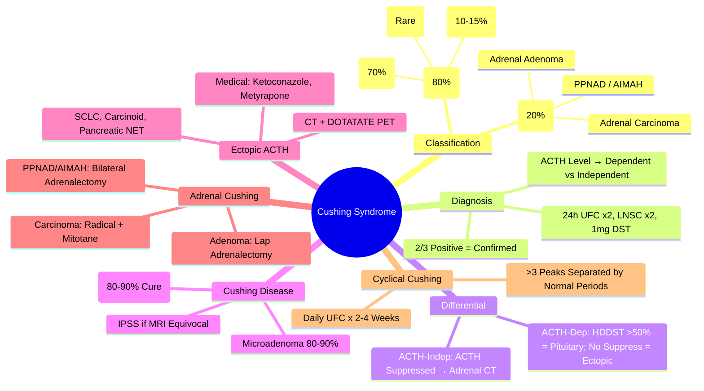

# Cushing Syndrome — Overview & Investigation Algorithm

> [!info]
> **Cushing Syndrome = Chronic Excess Glucocorticoid Exposure.** **ACTH-Dependent (80%) vs ACTH-Independent (20%).** **Cushing Disease (Pituitary ACTH) = 70% of ACTH-Dependent.** Diagnosis: Confirm Hypercortisolism → Determine ACTH Dependence → Localise Source.

---

## 1. Learning Objectives
By the end of this note you should be able to:
- [ ] Classify Cushing syndrome by aetiology (ACTH-dependent vs independent)
- [ ] Apply diagnostic criteria (24h UFC, Late-night Salivary Cortisol, LDDST)
- [ ] Interpret ACTH levels and dynamic tests (HDDST, CRH test, IPSS)
- [ ] Outline management algorithms for Cushing disease, ectopic ACTH, adrenal Cushing
- [ ] Recognise cyclical Cushing and pseudo-Cushing states

---

## 2. Classification

| Category | Subtype | Mechanism | Proportion |
|----------|---------|-----------|------------|
| **ACTH-Dependent (80%)** | **Cushing Disease** (Pituitary ACTH Microadenoma) | Pituitary ACTH Autonomous | **70% of ACTH-Dep** |
| | **Ectopic ACTH Syndrome** | Non-Pituitary Tumour (SCLC, Carcinoid, NET) | **10-15%** |
| | **Ectopic CRH** (Rare) | Hypothalamic CRH Hypersecretion | <1% |
| **ACTH-Independent (20%)** | **Adrenal Adenoma** | Unilateral Cortisol Secretion | 10-15% |
| | **Adrenal Carcinoma** | Malignant Cortisol Secretion | Rare |
| | **Primary Pigmented Nodular Adrenal Disease (PPNAD)** | Bilateral Hyperplasia; PRKAR1A | Rare |
| | **ACTH-Independent Macronodular Adrenal Hyperplasia (AIMAH)** | Aberrant Receptors (GIP, LH, etc.) | Rare |
| **Exogenous** | Glucocorticoid Therapy | Iatrogenic | Common |

---

## 3. Clinical Features

| System | Features |
|--------|----------|
| **Metabolic** | Central Obesity, Moon Face, Buffalo Hump, Supraclavicular Fat, Purple Striae (>1cm), Thin Skin, Easy Bruising, Poor Wound Healing |
| **Musculoskeletal** | Proximal Myopathy (↑ Creatinine Kinase), Osteoporosis, Vertebral Fractures |
| **Cardiovascular** | Hypertension (80%), Metabolic Syndrome, Atherosclerosis |
| **Glucose** | Impaired Glucose Tolerance / **Diabetes (20-50%)** |
| **Psychiatric** | Depression, Anxiety, Cognitive Impairment, Psychosis |
| **Reproductive** | Oligomenorrhoea, Amenorrhoea, Hirsutism (↑ Androgens), Low Libido |
| **Dermatological** | Acne, Striae (Violaceous, >1cm), Acanthosis Nigricans, Fungal Infections |
| **Renal** | Hypokalaemia (Mineralocorticoid Effect), Metabolic Alkalosis |

---

## 4. Diagnostic Criteria — Confirmation of Hypercortisolism

| Test | Cut-off | Sensitivity | Specificity |
|------|---------|-------------|-------------|
| **24h Urinary Free Cortisol (UFC)** | **>2-3x ULN** (≥220-300 nmol/24h) | 95% | 98% (×2) |
| **Late-Night Salivary Cortisol (LNSC)** | **>Upper Limit Night** (≥150-220 nmol/L) | 95% | 95% |
| **1mg Overnight Dexamethasone Suppression Test (LDDST)** | **Cortisol ≥50 nmol/L (1.8 µg/dL)** | 95% | 80% |

**Diagnostic Standard**: **2 of 3 Positive** (UFC ×2 + LNSC ×2 + LDDST) → **Confirmed Cushing Syndrome**

---

## 5. Pseudo-Cushing States (False Positives)

| Condition | Mechanism | Differentiating Features |
|---------|-----------|-------------------------|
| **Alcoholism** | ↑ CRH, Impaired Feedback | Improves with Abstinence; Normal ACTH |
| **Major Depression** | HPA Hyperactivity | Usually No Clinical Cushing Features |
| **Morbid Obesity** | ↓ CBG, ↑ Cortisol Clearance | Normal LNSC, Normal 24h UFC |
| **Pregnancy (3rd Trimester)** | ↑ CBG, ↑ Cortisol | Normal LNSC, Normal 24h UFC |
| **Uncontrolled Diabetes** | Insulin Resistance | Improves with Glycaemic Control |

**Key Differentiator**: **LDDST + Late-Night Salivary Cortisol ×2** — True Cushing: Both Abnormal

---

## 6. Dynamic Testing for Hypercortisolism

### Low-Dose DST (LDDST) — Screening
| Protocol | 1mg Dexamethasone at 23:00 → Serum Cortisol at 09:00 Next Day |
|----------|---------------------------------------------------------------|
| **Cut-off** | **Cortisol <50 nmol/L (1.8 µg/dL)** = **Normal Suppression** |
| **Positive (Non-Suppressed)** | **Cortisol ≥50 nmol/L** → Proceed to HDDST |

### High-Dose DST (HDDST) — Differential Diagnosis
| Protocol | 2mg Dexamethasone q6h × 8 Doses (48h) OR Overnight 8mg |
|----------|--------------------------------------------------------|
| **Cushing Disease (Pituitary ACTH)** | **Cortisol Suppresses >50%** (or <50% of Baseline) |
| **Ectopic ACTH / Adrenal Cushing** | **No Suppression** (<50% Suppression) |

### CRH Stimulation Test
| Protocol | CRH 100µg IV → ACTH/Cortisol at 0, 15, 30, 60, 60, 90, 120min |
|----------|-------------------------------------------------------------|
| **Cushing Disease** | **ACTH ↑ >50% from Baseline** (Pituitary Response) |
| **Ectopic ACTH** | **No Rise** (No CRH Receptors) |

### Inferior Petrosal Sinus Sampling (IPSS)
| Indication | Discordant HDDST / Equivocal CRH Test |
|------------|----------------------------------------|
| **Procedure** | Catheters in Both IPS + Peripheral Vein → ACTH Sampling |
| **Positive (Pituitary Source)** | **Central:Peripheral ACTH Gradient >2 (Basal) or >3 (Post-CRH)** |
| **False Negative** | Anatomical Variants, Intermittent Secretion |

---

## 7. ACTH-Dependent vs Independent — Diagnostic Algorithm

```
Confirmed Cushing Syndrome (2/3 Tests Positive)
         │
         ▼
MEASURE PLASMA ACTH (09:00, EDTA, On Ice)
         │
         ├── ACTH <10 pg/mL (Suppressed) → **ACTH-INDEPENDENT**
         │       │
         │       ├── Adrenal CT → Unilateral Mass → **Adrenal Adenoma/Carcinoma**
         │       ├── Bilateral Hyperplasia → PPNAD / AIMAH
         │       └── No Mass → Ectopic CRH (Rare)
         │
         └── ACTH ≥10-20 pg/mL (Normal/High) → **ACTH-DEPENDENT**
                 │
                 ├── HDDST (2mg q6h × 48h)
                 │       ├── Suppresses >50% → **Cushing Disease** (Pituitary ACTH)
                 │       │       MRI Pituitary (3mm Slices, Gadolinium)
                 │       │       IPSS if Equivocal / Microadenoma Not Seen
                 │       │
                 │       └── NO Suppression → **Ectopic ACTH / Adrenal Cushing**
                 │               │
                 │               ├── ACTH High → **Ectopic ACTH Syndrome**
                 │               │       CT Chest/Abd/Pelvis → ⁶⁸Ga-DOTATATE PET → Bronchoscopy
                 │               │
                 │               └── ACTH Low → **Adrenal Cushing** (Re-check Imaging)
                 │
                 └── IF HDDST EQUIVOCAL → CRH Test / IPSS / ⁶⁸Ga-DOTATATE PET
```

---

## 8. Cushing Disease — Specifics

| Feature | Details |
|---------|---------|
| **Adenoma Type** | **Microadenoma** (<10mm) in 80-90%; Macroadenoma Rare |
| **MRI Pituitary** | 3mm Slices, Gadolinium; Microadenoma in 60-70% |
| **IPSS** | Gold Standard if MRI Negative / Equivocal; Central:Peripheral ACTH Gradient >2 (Basal) or >3 (Post-CRH) |
| **Treatment** | **Transsphenoidal Surgery (TSS)** — **1st Line** |
| **Cure Rate** | **80-90% (Microadenoma)**; 50-60% (Macroadenoma) |
| **Recurrence** | 10-20% at 10 Years |
| **Medical (If Surgery Fails/Not Candidate)** | Ketoconazole, Metyrapone, Osilodrostat, Pasireotide |

---

## 9. Ectopic ACTH Syndrome

| Aspect | Details |
|--------|---------|
| **Common Sources** | **SCLC** (50%), **Bronchial Carcinoid** (20%), Pancreatic NET, Thymic Carcinoid, Medullary Thyroid Ca |
| **ACTH Level** | **Very High** (Often >200 pg/mL) |
| **HDDST** | No Suppression |
| **Imaging** | CT Chest/Abd/Pelvis → **⁶⁸Ga-DOTATATE PET/CT** (Gold Standard) → Bronchoscopy |
| **Medical Management** | **Ketoconazole** 200-400mg TDS, **Metyrapone**, **Osilodrostat**, **Etoposide** (SCLC) |
| **Bilateral Adrenalectomy** | Last Resort (If Medical Fails / Life-Threatening) |

---

## 10. Adrenal Cushing (ACTH-Independent)

| Subtype | Features | Management |
|---------|----------|------------|
| **Adrenal Adenoma** | Unilateral, Benign, Cortisol Secreting | **Adrenalectomy** (Laparoscopic, Curative) |
| **Adrenal Carcinoma** | Large (>6cm), Heterogeneous, Invasion, Metastases | **Radical Adrenalectomy ± Lymphadenectomy**; Mitotane Adjuvant |
| **PPNAD** | Bilateral Micronodules; Carney Complex; **ACTH Suppressed** | Bilateral Adrenalectomy ± Auto-transplant |
| **AIMAH** | Bilateral Macronodules; Aberrant Receptors (GIP, LH, β-AR) | Bilateral Adrenalectomy ± Auto-transplant |

---

## 11. Cyclical Cushing

| Feature | Details |
|---------|---------|
| **Definition** | **Intermittent Hypercortisolism** with Normal Intervals |
| **Prevalence** | **5-15%** of Cushing Syndrome |
| **Mechanism** | Periodic ACTH Secretion (Pulsatile Tumour) / Variable Cortisol Binding |
| **Diagnosis** | **Prolonged Monitoring**: Daily UFC × 2-4 Weeks; Midnight Cortisol × 2-4 Weeks |
| **Diagnostic Criteria** | **>3 Peaks of UFC >ULN** Separated by Normal UFC Periods |
| **Management** | Same as Sustained Cushing; **Surgery Timed to Peaks** if Possible |

---

## 12. Pseudo-Cushing — Key Differentiators

| Feature | True Cushing | Pseudo-Cushing |
|---------|-------------|----------------|
| **LDDST** | Non-Suppressed (Cortisol ≥50) | May Suppress |
| **Late-Night Salivary Cortisol** | **Persistently Elevated** | Normal on Repeat |
| **24h UFC** | Consistently >2-3x ULN | Normal / Borderline |
| **Clinical Features** | Classic Cushingoid | Often Atypical |
| **Resolution** | Persists | Resolves with Treatment of Underlying Cause |

**Common Causes**: Chronic Alcoholism, Severe Depression, Morbid Obesity, Uncontrolled Diabetes, Pregnancy (3rd Tri).

---

## 13. Management — Post-Diagnosis

### Cushing Disease
| Step | Treatment |
|------|-----------|
| **1st Line** | **Transsphenoidal Surgery (TSS)** — 80-90% Cure (Micro), 50-60% (Macro) |
| **Recurrent/Residual** | Repeat TSS / Bilateral Adrenalectomy / Medical (Ketoconazole, Metyrapone, Osilodrostat, Pasireotide) |
| **Radiotherapy** | If Surgery Fails/Not Candidate (Stereotactic/Fractionated) |

### Ectopic ACTH
| Priority | Treatment |
|----------|-----------|
| **1st** | **Surgical Resection of Source** (If Localised) |
| **2nd** | **Medical** (Ketoconazole, Metyrapone, Osilodrostat, Etomidate) |
| **3rd** | **Bilateral Adrenalectomy** (If Unresectable/Failed Medical) |

### Adrenal Cushing
| Subtype | Surgery |
|---------|---------|
| **Adenoma** | **Laparoscopic Adrenalectomy** (Curative) |
| **Carcinoma** | **Open Adrenalectomy + Lymphadenectomy** + Mitotane |
| **PPNAD / AIMAH** | Bilateral Adrenalectomy ± Auto-transplant |

---

## 14. Follow-up & Long-term Surveillance

| Timepoint | Assessments |
|-----------|-------------|
| **Post-Op Day 1** | Cortisol, ACTH, Electrolytes, Glucose |
| **6 Weeks** | Cortisol, ACTH, TSH, fT4, Electrolytes, Weight, BP |
| **3 Months** | Full Hormonal Panel, MRI (If Cushing Disease) |
| **6 Months** | Hormones, Weight, BP, Glucose, BMD (DEXA) |
| **Annual (Lifelong)** | UFC, Late-Night Salivary Cortisol, MRI (Post-Cushing Disease) |

---

## 15. Exam Pearls (FCPS/MRCP)

| Topic | Key Point |
|-------|-----------|
| **Cushing Syndrome** | 2/3 Tests Positive (UFC×2, LNSC×2, LDDST) |
| **Cushing Disease vs Adrenal** | ACTH: Disease = N/↑; Adrenal = ↓↓; Ectopic = ↑↑ |
| **HDDST** | >50% Suppression = Cushing Disease; No Suppression = Ectopic/Adrenal |
| **IPSS** | Central:Peripheral ACTH Gradient >2 (Basal) / >3 (Post-CRH) |
| **Ectopic ACTH Sources** | SCLC (50%), Bronchial Carcinoid (20%), Pancreatic NET |
| **Adrenal Carcinoma** | >6cm, Heterogeneous, Invasion, ↑ DHEAS, ↑ Testosterone |
| **Cyclical Cushing** | Intermittent Hypercortisolism; Daily UFC × 2-4 Weeks |
| **Pseudo-Cushing** | Alcoholism, Depression, Obesity, Uncontrolled DM |
| **1st Line Cushing Disease** | Transsphenoidal Surgery (TSS) |
| **Adrenal Incidentaloma** | 1mg DST + Metanephrines + Aldosterone/Renin |
| **Cyclical Cushing** | Daily UFC × 2-4 Weeks for Diagnosis |
| **Adrenal Crisis in Cushing Post-Op** | Hydrocortisone 100mg IV + Fluids (Adrenal Suppression) |

---

## 16. Mind Map



---

## 17. Exam Pearls (FCPS/MRCP)

| Topic | Key Point |
|-------|-----------|
| **Diagnostic Confirmation** | 2/3 Tests Positive (UFC×2, LNSC×2, LDDST) |
| **LDDST Cut-off** | Cortisol ≥50 nmol/L = Non-Suppressed |
| **HDDST** | >50% Suppression = Cushing Disease; No Suppression = Ectopic/Adrenal |
| **ACTH in Cushing** | Disease: N/↑; Adrenal: ↓↓; Ectopic: ↑↑ |
| **IPSS Gradient** | Central:Peripheral >2 (Basal) or >3 (Post-CRH) |
| **Cushing Disease Surgery** | **Transsphenoidal Surgery** — 1st Line |
| **Ectopic ACTH** | **SCLC (50%)**, Bronchial Carcinoid, Pancreatic NET |
| **Adrenal Carcinoma** | >6cm, Heterogeneous, Invasion, ↑ DHEAS/Testosterone |
| **Cyclical Cushing** | Daily UFC × 2-4 Weeks; >3 Peaks with Normal Intervals |
| **Pseudo-Cushing** | Alcoholism, Depression, Obesity, Uncontrolled DM |
| **Adrenal Crisis Post-Cushing Surgery** | Hydrocortisone 100mg IV + Fluids (Adrenal Suppression) |

---

## 18. Local Navigation (for Dashboard UI)

> **Parent**: [[../Adrenal Disorders|Adrenal Disorders]]  
> **Hierarchy**: [[../../Davidson Chapter 20 - Endocrinology Hierarchy|Endocrinology Hierarchy]]  
> **Template**: [[../../../Templates/Endocrinology Topic Template|Endocrinology Topic Template]]  
> **See also**: [[ACTH-Cortisol Axis]], [[Dynamic Testing Principles]], [[Adrenal Insufficiency]], [[Pituitary Adenomas: Functioning]], [[Pituitary Apoplexy]]
## 19. MCQs (10)
1. **Commonest cause of Cushing syndrome:**
   A. Exogenous steroids
   B. Cushing disease (pituitary)
   C. Adrenal adenoma
   D. Ectopic ACTH
   E. Adrenal carcinoma

2. **Cushing disease =**
   A. ACTH-dependent Cushing from pituitary adenoma
   B. Adrenal Cushing
   C. Ectopic ACTH
   D. Exogenous steroids
   E. CAH

3. **Cushing syndrome biochemical hallmarks:**
   A. Loss of diurnal rhythm + failure to suppress on DST
   B. High cortisol + high ACTH always
   C. Low cortisol + high ACTH
   D. Normal cortisol + high ACTH
   E. High cortisol + normal ACTH always

4. **Midnight salivary cortisol in Cushing:**
   A. Elevated (loss of diurnal rhythm)
   B. Normal
   C. Low
   D. Variable
   E. Suppressed

5. **24h urinary free cortisol (UFC) in Cushing:**
   A. Elevated (usually >3x ULN)
   B. Normal
   C. Low
   D. Only elevated in ectopic
   E. Only elevated in adrenal

6. **First-line screening test for Cushing:**
   A. Overnight 1mg DST or midnight salivary cortisol or 24h UFC
   B. High-dose DST
   C. CRH test
   D. IPSS
   E. Adrenal CT

7. **ACTH level in Cushing disease:**
   A. Normal/high (inappropriately)
   B. Suppressed
   C. Very high (>200 pg/mL)
   D. Undetectable
   E. Pulsatile only

8. **ACTH level in ectopic ACTH:**
   A. High (>200 pg/mL)
   B. Suppressed
   C. Normal
   D. Low
   E. Pulsatile only

9. **ACTH level in adrenal Cushing:**
   A. Suppressed (<5 pg/mL)
   B. High
   C. Normal
   D. Very high
   E. Pulsatile

10. **Cyclical Cushing:**
   A. Periodic cortisol excess with normal intervals
   B. Constant cortisol excess
   C. Only in pregnancy
   D. Only in children
   E. Factitious

## 20. SBA Questions (10)
1. **40yo woman: weight gain, striae, HTN, glucose intolerance. Midnight salivary cortisol high. Next?**
   A. 24h UFC + 09:00 cortisol + ACTH
   B. High-dose DST
   C. Pituitary MRI
   D. Adrenal CT
   E. CRH test

2. **Cushing confirmed. ACTH 80 pg/mL. Next?**
   A. High-dose DST or CRH test or IPSS
   B. Adrenal CT
   C. Pituitary MRI immediately
   D. Ectopic workup
   E. Stop steroids

3. **Cushing confirmed. ACTH <5 pg/mL. Next?**
   A. Adrenal CT
   B. Pituitary MRI
   C. High-dose DST
   D. CRH test
   E. IPSS

4. **Cushing confirmed. ACTH 250 pg/mL. Next?**
   A. Chest/abdomen CT for ectopic source
   B. Pituitary MRI
   C. High-dose DST
   D. CRH test
   E. Adrenal CT

5. **Cyclical Cushing suspected. Best approach?**
   A. Repeated 24h UFC / midnight salivary cortisol over weeks
   B. Single UFC
   C. Single DST
   D. Single ACTH
   E. Random cortisol

6. **Pseudo-Cushing (alcohol/depression):**
   A. May have mild UFC elevation but suppresses on low-dose DST
   B. Does not suppress on DST
   C. High ACTH
   D. Requires IPSS
   E. Always needs surgery

7. **Cushing in pregnancy:**
   A. Very rare; fetal risk; surgery 2nd trimester if needed
   B. Treat with ketoconazole
   C. RAI
   D. Observation only
   E. Deliver early

8. **Adrenal incidentaloma with possible Cushing:**
   A. 1mg DST → if not suppressed, 24h UFC + ACTH
   B. Immediate surgery
   C. Observation only
   D. RAI
   E. Ketoconazole

9. **Ectopic ACTH: commonest tumours?**
   A. Small cell lung cancer, bronchial carcinoid, thymic carcinoid
   B. Pituitary adenoma
   C. Adrenal adenoma
   D. Renal cell cancer
   E. Thyroid cancer

## 21. Flashcards
- **Q: Cushing syndrome**
  **A: Cortisol excess (any cause); exogenous commonest**

- **Q: Cushing disease**
  **A: Pituitary ACTH-dependent (~70% endogenous)**

- **Q: Ectopic ACTH**
  **A: ACTH >200 pg/mL; SCLC, carcinoid; no DST suppression**

- **Q: Adrenal Cushing**
  **A: ACTH suppressed (<5); adrenal adenoma/carcinoma**

- **Q: Cyclical Cushing**
  **A: Episodic cortisol excess; needs repeated testing**

- **Q: Screening**
  **A: Overnight 1mg DST / midnight salivary cortisol / 24h UFC**

- **Q: ACTH in Cushing disease**
  **A: Normal/high (inappropriately); not suppressed**

- **Q: ACTH in ectopic**
  **A: High (>200 pg/mL); no suppression on HDDST**

- **Q: ACTH in adrenal**
  **A: Suppressed (<5 pg/mL)**

- **Q: Midnight salivary cortisol**
  **A: Loss of diurnal rhythm = sensitive screening**

- **Q: IPSS**
  **A: Gold standard for Cushing disease vs ectopic; central:peripheral ACTH gradient >3 basal, >2 post-CRH**

- **Q: HDDST**
  **A: Cushing disease: cortisol suppresses >50%; Ectopic/adrenal: no suppression**

- **Q: Treatment Cushing disease**
  **A: Transsphenoidal surgery (1st line)**

- **Q: Treatment adrenal**
  **A: Adrenalectomy (unilateral for adenoma)**

- **Q: Treatment ectopic**
  **A: Resection if localised; medical (ketoconazole, metyrapone) if not**

## 22. Answer Key with Explanations
### MCQs
1. **Exogenous steroids** — Commonest cause of Cushing syndrome:

2. **ACTH-dependent Cushing from pituitary adenoma** — Cushing disease =

3. **Loss of diurnal rhythm + failure to suppress on DST** — Cushing syndrome biochemical hallmarks:

4. **Elevated (loss of diurnal rhythm)** — Midnight salivary cortisol in Cushing:

5. **Elevated (usually >3x ULN)** — 24h urinary free cortisol (UFC) in Cushing:

6. **Overnight 1mg DST or midnight salivary cortisol or 24h UFC** — First-line screening test for Cushing:

7. **Normal/high (inappropriately)** — ACTH level in Cushing disease:

8. **High (>200 pg/mL)** — ACTH level in ectopic ACTH:

9. **Suppressed (<5 pg/mL)** — ACTH level in adrenal Cushing:

10. **Periodic cortisol excess with normal intervals** — Cyclical Cushing:


### SBAs
1. **24h UFC + 09:00 cortisol + ACTH** — 40yo woman: weight gain, striae, HTN, glucose intolerance. Midnight salivary cortisol high. Next?

2. **High-dose DST or CRH test or IPSS** — Cushing confirmed. ACTH 80 pg/mL. Next?

3. **Adrenal CT** — Cushing confirmed. ACTH <5 pg/mL. Next?

4. **Chest/abdomen CT for ectopic source** — Cushing confirmed. ACTH 250 pg/mL. Next?

5. **Repeated 24h UFC / midnight salivary cortisol over weeks** — Cyclical Cushing suspected. Best approach?

6. **May have mild UFC elevation but suppresses on low-dose DST** — Pseudo-Cushing (alcohol/depression):

7. **Very rare; fetal risk; surgery 2nd trimester if needed** — Cushing in pregnancy:

8. **1mg DST → if not suppressed, 24h UFC + ACTH** — Adrenal incidentaloma with possible Cushing:

9. **Small cell lung cancer, bronchial carcinoid, thymic carcinoid** — Ectopic ACTH: commonest tumours?

