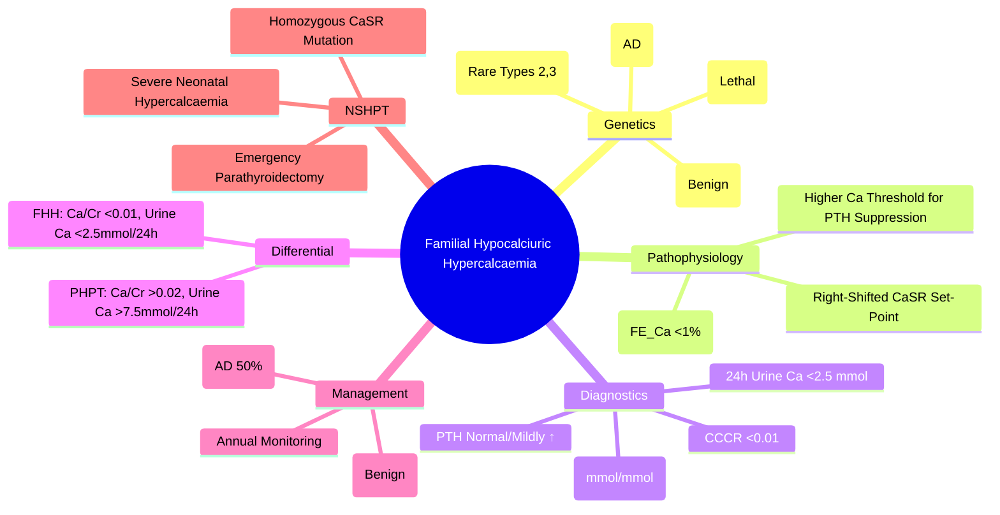

# Familial Hypocalciuric Hypercalcaemia (FHH)

> [!info]
> **Familial Hypocalciuric Hypercalcaemia (FHH) = Autosomal Dominant Disorder** due to **Inactivating CaSR Mutations**. **Benign, Asymptomatic Hypercalcaemia** with **Relative Hypocalciuria**. **Mimics Primary Hyperparathyroidism** but **No Surgery Needed**. **CaSR Loss-of-Function** → Right-Shifted Calcium Set-Point.

---

## 1. Learning Objectives
By the end of this note you should be able to:
- [ ] Differentiate FHH from Primary Hyperparathyroidism (PHPT) using urinary calcium excretion
- [ ] Apply the Calcium/Creatinine clearance ratio (Ca/Cr <0.01) as key discriminator
- [ ] Recognise genetic basis (CaSR inactivating mutations, Autosomal Dominant)
- [ ] Avoid unnecessary parathyroid surgery in FHH
- [ ] Recognise neonatal severe hyperparathyroidism (NSHPT) as homozygous/compound heterozygous form

---

## 2. Pathophysiology & Genetics

| Feature | Details |
|---------|---------|
| **Inheritance** | **Autosomal Dominant** (Penetrance ~100%) |
| **Gene** | **CaSR (Calcium-Sensing Receptor)** — Chromosome 3q13-q21 |
| **Mutation Type** | **Inactivating (Loss-of-Function)** — Heterozygous |
| **Mechanism** | **Right-Shifted Calcium Set-Point** → Higher Serum Calcium Needed to Suppress PTH |
| **Penetrance** | High (>90%) |
| **Homozygous/Compound Heterozygous** | **Neonatal Severe Hyperparathyroidism (NSHPT)** — Severe, Life-Threatening |

---

## 3. Pathophysiology

| Normal Physiology | FHH (CaSR Mutation) |
|-------------------|---------------------|
| **CaSR Activation by Ca²⁺** → ↓ PTH Secretion | **Impaired Ca²⁺ Sensing** → Right-Shifted Set-Point |
| **Normal SET-POINT** (~1.1-1.3 mmol/L Ionised Ca²⁺) | **Right-Shifted SET-POINT** (~1.3-1.5 mmol/L Ionised Ca²⁺) |
| **Normal Urinary Ca²⁺ Excretion** (Fractional Excretion ~1-2%) | **Reduced Renal Ca²⁺ Excretion** (FE_Ca <1%) |

### Key Physiological Consequences
| Parameter | Normal | FHH |
|---------|---------|-----|
| **Serum Calcium** | Normal | **Mildly Elevated** (2.7-3.0 mmol/L) |
| **PTH** | Normal | **Inappropriately Normal/Mildly Elevated** |
| **Urinary Calcium Excretion** | Normal (FE_Ca 1-2%) | **Markedly Reduced** (FE_Ca <1%) |
| **PTH Level** | Normal | **Inappropriately Normal/Mildly Elevated** |
| **Phosphate** | Normal | Normal/Mildly Low |
| **Magnesium** | Normal | **Mildly Elevated** (Relative Hypomagnesiuria) |

---

## 4. Diagnostic Criteria — FHH vs PHPT

### The Gold Standard Discriminator: Urinary Calcium Excretion

| Test | **PHPT** | **FHH** |
|------|----------|---------|
| **24h Urinary Calcium** | **>7.5 mmol/24h (300 mg/day)** | **<2.5 mmol/24h** (<100 mg/day) |
| **Fasting Urine Calcium/Creatinine Ratio (Ca/Cr)** | **>0.02** (mmol/mmol) | **<0.01** (mmol/mmol) |
| **Calcium/Creatinine Clearance Ratio (CCCR)** | **>0.02** | **<0.01** |

> **CCCR = (Urine Ca × Plasma Creatinine) / (Plasma Ca × Urine Creatinine)**
> **CCCR <0.01 = FHH; CCCR >0.02 = PHPT**

### Key Biochemical Differences

| Parameter | **PHPT** | **FHH** |
|-----------|----------|-------|
| **Serum Calcium** | High (2.8-3.5 mmol/L) | Mildly High (2.7-3.0 mmol/L) |
| **PTH** | High / Inappropriately Normal | Normal / Mildly Elevated |
| **24h Urine Calcium** | **High** (>7.5 mmol/24h) | **Low** (<2.5 mmol/24h) |
| **Urine Ca/Cr Ratio** | **>0.02** | **<0.01** |
| **CCCR** | >0.02 | **<0.01** |
| **Phosphate** | Low | Normal / Mildly Low |
| **Magnesium** | Normal/Low | **Mildly Elevated** |
| **Family History** | Usually Sporadic | **Strong (AD, Multiple Affected)** |

---

## 5. Diagnostic Algorithm

```
Hypercalcaemia + Inappropriately Normal/High PTH
         │
         ▼
24h Urine Calcium OR Fasting Ca/Cr Ratio
         │
         ├── Ca/Cr Ratio <0.01 (mmol/mmol) OR 24h Urine Ca <2.5 mmol/24h
         │       → **FHH LIKELY** → Genetic Testing (CaSR) → **NO SURGERY**
         │
         └── Ca/Cr Ratio >0.02 OR 24h Urine Ca >7.5 mmol/24h
                 → **PHPT LIKELY** → Localisation → Surgery
```

---

## 6. Genetic Testing

| Gene | Mutation Type | Inheritance | Phenotype |
|------|---------------|-------------|----------|
| **CaSR** (Chromosome 3q13) | **Inactivating (Loss-of-Function)** | **Autosomal Dominant** | **FHH Type 1** (Typical) |
| **GNA11** | Inactivating | AD | FHH Type 2 (Rare) |
| **AP2S1 (AP2σ)** | Inactivating | AD | FHH Type 3 (Rare) |

| Genotype | Phenotype |
|----------|-----------|
| **Heterozygous** (1 Mutant Allele) | **FHH Type 1** (Typical, Benign) |
| **Homozygous / Compound Heterozygous** | **Neonatal Severe Hyperparathyroidism (NSHPT)** — Lethal if Untreated |

---

## 7. NSHPT (Neonatal Severe Hyperparathyroidism)

| Feature | Details |
|---------|---------|
| **Genotype** | Homozygous / Compound Heterozygous CaSR Mutations |
| **Presentation** | **Severe Hypercalcaemia** (Ca²⁺ >3.5 mmol/L) in Neonate |
| **Complications** | Severe Hypercalcaemia → Dehydration, Renal Failure, Pancreatitis, Demineralisation, Fractures |
| **PTH** | **Very High** (>1000 pg/mL) |
| **Treatment** | **Urgent Parathyroidectomy (Subtotal/Total)** — Life-Saving |
| **Genetics** | Autosomal Recessive (Homozygous/Compound Heterozygous) |

---

## 8. Differential Diagnosis: FHH vs PHPT

| Parameter | **PHPT** | **FHH** |
|-----------|----------|-------|
| **Serum Calcium** | High (2.8-3.5 mmol/L) | Mildly High (2.7-3.0 mmol/L) |
| **PTH** | High / Inappropriately Normal | Normal / Mildly Elevated |
| **24h Urine Calcium** | **>7.5 mmol/24h (300 mg/day)** | **<2.5 mmol/24h** (<100 mg/day) |
| **Ca/Cr Ratio (Fasting)** | **>0.02** | **<0.01** |
| **CCCR** | >0.02 | **<0.01** |
| **Phosphate** | Low | Normal / Slightly Low |
| **Magnesium** | Normal/Low | **Mildly Elevated** |
| **Family History** | Rare | **Strong (AD, Multiple Affected)** |
| **Surgical Indication** | **YES** (Curative) | **NO** (Benign) |
| **Genetics** | Sporadic (Usually) | **CaSR Mutation (AD)** |

---

## 9. Diagnostic Algorithm

```
Hypercalcaemia + Inappropriately Normal/High PTH
         │
         ▼
Fasting Urine Calcium/Creatinine Ratio (or 24h Urine Ca)
         │
         ├── Ca/Cr <0.01 OR 24h Urine Ca <2.5 mmol/24h
         │       → **FHH LIKELY**
         │       → Genetic Testing (CaSR) → Confirm
         │       → **NO SURGERY** (Benign Condition)
         │
         └── Ca/Cr >0.02 OR 24h Urine Ca >7.5 mmol/24h
                 → **PHPT LIKELY**
                 → Localisation → Surgery
```

---

## 10. Special Variants

### FHH Type 2 (GNA11 Mutation)
| Feature | Details |
|---------|---------|
| **Gene** | **GNA11** (G-Protein α11 Subunit) |
| **Inheritance** | Autosomal Dominant |
| **Phenotype** | Similar to FHH Type 1 (CaSR) |

### FHH Type 3 (AP2S1 Mutation)
| Feature | Details |
|---------|---------|
| **Gene** | **AP2S1** (Adaptor Protein 2 Sigma Subunit) |
| **Phenotype** | More Severe Hypercalcaemia; Earlier Onset |

---

## 11. Management & Counselling

| Aspect | FHH Management |
|---------|----------------|
| **Surgery** | **Contraindicated** (No Benefit; Benign Condition) |
| **Monitoring** | Annual Serum Calcium, PTH, Renal Function |
| **Genetic Counselling** | **Autosomal Dominant** — 50% Offspring Risk; Offer Predictive Testing |
| **Pregnancy** | Normal Course; Mild Hypercalcaemia Usually Well-Tolerated |
| **Hypercalcaemic Crisis** | Rare; Treat as Primary Hyperparathyroidism if Severe |

### Family Screening
| Relative | Action |
|----------|--------|
| **First-Degree Relatives** | **Screen Serum Calcium + PTH** |
| **Genetic Testing** | **Offer CaSR Sequencing** (If Mutation Known in Proband) |
| **Prenatal** | Offer CVS/Amniocentesis if Known Familial Mutation |

---

## 12. Exam Pearls (FCPS/MRCP)

| Topic | Key Point |
|-------|-----------|
| **FHH vs PHPT Discriminator** | **Urine Calcium/Creatinine Ratio <0.01 (FHH) vs >0.02 (PHPT)** |
| **FHH Hallmark** | **Hypocalciuria** (Urine Ca <2.5 mmol/24h; Ca/Cr <0.01) |
| **PTH in FHH** | Normal or Mildly Elevated (Inappropriately Normal for Calcium) |
| **Serum Calcium** | Mildly Elevated (2.7-3.0 mmol/L) |
| **Phosphate** | Normal / Mildly Low |
| **Magnesium** | Mildly Elevated (Relative Hypomagnesiuria) |
| **Genetics** | **CaSR Inactivating Mutation (AD)**; Heterozygous = FHH; Homozygous = NSHPT |
| **Surgery** | **Contraindicated** (Benign; No Benefit) |
| **NSHPT** | Homozygous CaSR Mutation; Severe Neonatal Hypercalcaemia; Emergency PTX |
| **Genetic Counselling** | AD Inheritance → 50% Offspring Risk; Offer Predictive Testing |
| **Pregnancy** | Usually Uneventful; Monitor Calcium |

---

## 13. Confusions & Mnemonics

| Confusion | Clarification |
|-----------|---------------|
| **FHH vs PHPT** | **Urine Ca/Cr <0.01 = FHH; >0.02 = PHPT** — Gold Standard Discriminator |
| **FHH vs PHPT Calcium** | FHH: Mild (2.7-3.0); PHPT: Higher (2.8-3.5) |
| **FHH vs PHPT PTH** | FHH: Normal/Mild ↑; PHPT: High/Inappropriately Normal |
| **Calcium Excretion** | FHH: **Low (FE_Ca <1%)**; PHPT: High (FE_Ca >2%) |
| **CCCR Formula** | (Urine Ca × Plasma Creatinine) / (Plasma Ca × Urine Creatinine) |
| **CCCR Cut-off** | **<0.01 = FHH**; **>0.02 = PHPT** |
| **Family History** | FHH = Strong AD Family History; PHPT = Usually Sporadic |
| **NSHPT** | Homozygous CaSR Mutation; Severe Neonatal Hypercalcaemia; Emergency PTX |

**Mnemonic: FHH vs PHPT — "CALCIUM EXCRETION"**
- **F**HH = **C**alcium **L**ow **C**reatinine **R**atio (<0.01)
- **P**HPT = **C**alcium **H**igh **C**reatinine **R**atio (>0.02)

**Mnemonic: FHH FEATURES**
- **F**amily History (AD)
- **H**ypocalciuria (Ca/Cr <0.01)
- **H**ypercalcaemia Mild

**Mnemonic: FHH vs PHPT — "FHH = Low Urine Calcium"**
- **P**HPT = **P**rolific **H**ypercalciuria (>7.5 mmol/24h)
- **F**HH = **F**rugal **H**ypocalciuria (<2.5 mmol/24h)

---

## 14. Mind Map



---

## 15. Exam Pearls (FCPS/MRCP)

| Topic | Key Point |
|-------|-----------|
| **FHH vs PHPT Discriminator** | **Urine Ca/Cr <0.01 = FHH; >0.02 = PHPT** |
| **FHH Hallmark** | **Hypocalciuria** (Urine Ca <2.5 mmol/24h; Ca/Cr <0.01) |
| **PTH in FHH** | **Normal / Mildly Elevated** (Inappropriately Normal for Calcium) |
| **Serum Calcium** | **Mildly Elevated (2.7-3.0 mmol/L)** |
| **Phosphate** | Normal / Mildly Low |
| **Magnesium** | **Mildly Elevated** (Relative Hypomagnesiuria) |
| **Genetics** | **CaSR Inactivating Mutation (AD)**; Heterozygous = FHH; Homozygous = NSHPT |
| **Surgery** | **Contraindicated** (Benign Condition; No Benefit) |
| **NSHPT** | Homozygous CaSR Mutation; Severe Neonatal Hypercalcaemia; **Emergency PTX** |
| **Genetic Counselling** | **AD Inheritance** → 50% Offspring Risk |
| **CCCR Formula** | (Urine Ca × Plasma Creatinine) / (Plasma Ca × Urine Creatinine) |

---

## 16. Local Navigation (for Dashboard UI)

> **Parent**: [[../Parathyroid & Calcium|Parathyroid & Calcium]]  
> **Hierarchy**: [[../../Davidson Chapter 20 - Endocrinology Hierarchy|Endocrinology Hierarchy]]  
> **Template**: [[../../../Templates/Endocrinology Topic Template|Endocrinology Topic Template]]  
> **See also**: [[Primary Hyperparathyroidism]], [[Hypoparathyroidism]], [[Tertiary Hyperparathyroidism]], [[Hypercalcaemia of Malignancy]], [[Hypocalcaemia]]
## 17. MCQs (10)
1. **FHH =**
   A. Familial Hypocalciuric Hypercalcaemia; CaSR mutation (autosomal dominant)
   B. Primary HPT
   C. Secondary HPT
   D. Malignancy
   E. Vit D excess

2. **FHH key feature:**
   A. HIGH serum Ca + normal/high PTH + LOW urinary Ca excretion (CCCR <0.01)
   B. Low Ca
   C. High urinary Ca
   D. Low PTH
   E. Normal Ca

3. **FHH inheritance:**
   A. Autosomal dominant (CaSR heterozygous mutation)
   B. Autosomal recessive
   C. X-linked
   D. Mitochondrial
   E. Sporadic

4. **FHH vs primary HPT:**
   A. FHH: CCCR<0.01; Primary HPT: CCCR>0.02
   B. FHH: high urinary Ca
   C. FHH: low PTH
   D. FHH: post-surgical
   E. Same

5. **FHH treatment:**
   A. NO surgery needed (asymptomatic, benign); reassure family
   B. Parathyroidectomy
   C. Cinacalcet
   D. Calcitriol
   E. Bisphosphonates

6. **FHH genetics:**
   A. CaSR inactivating mutation (heterozygous); autosomal dominant
   B. MEN1
   C. RET
   D. AIRE
   E. CDC73

7. **FHH in pregnancy:**
   A. Normal pregnancy; fetus may be heterozygous (asymptomatic) or homozygous (neonatal severe hyperparathyroidism)
   B. Contraindicated
   C. High miscarriage
   D. Need surgery
   E. Stop Ca

8. **Neonatal severe hyperparathyroidism:**
   A. Homozygous CaSR mutation; life-threatening hypercalcaemia; parathyroidectomy needed
   B. Mild
   C. Asymptomatic
   D. Same as FHH
   E. No treatment

9. **FHH biochemistry:**
   A. Mild hypercalcaemia, normal/mildly high PTH, low 24h urinary Ca, normal phosphate
   B. Low Ca
   C. High phosphate
   D. Low PTH
   E. High urinary Ca

10. **FHH family screening:**
   A. Screen relatives: serum Ca, PTH, urinary Ca; genetic testing CaSR
   B. No screening
   C. Only surgery
   D. Only if symptomatic
   E. Screen for MEN

## 18. SBA Questions (10)
1. **30yo woman: asymptomatic, Ca 2.8, PTH 8, 24h urinary Ca 1.2mmol (low), CCCR 0.005. Family history similar. Diagnosis?**
   A. FHH (no surgery)
   B. Primary HPT (surgery)
   C. Secondary HPT
   D. Malignancy
   E. FHH type 2

2. **Same patient: management?**
   A. Reassure; no surgery; screen family; genetic counselling
   B. Parathyroidectomy
   C. Cinacalcet
   D. Calcitriol
   E. Bisphosphonates

3. **FHH patient pregnant. Fetal risk?**
   A. Fetus 50% heterozygous (asymptomatic FHH); 25% homozygous (neonatal severe HPT)
   B. No risk
   C. High miscarriage
   D. Fetal hypocalcaemia
   E. No risk

4. **Neonatal severe hyperparathyroidism: presenting features?**
   A. Severe hypercalcaemia, respiratory distress, bone demineralisation, fractures
   B. Hypocalcaemia
   C. Normal Ca
   D. Asymptomatic
   E. Only in adults

5. **FHH family member: screening tests?**
   A. Serum Ca, PTH, 24h urinary Ca (CCCR); genetic CaSR if confirmed
   B. Only Ca
   C. Only PTH
   D. Only urinary Ca
   E. No screening

## 19. Flashcards
- **Q: FHH**
  **A: CaSR inactivating mutation (AD); high Ca + normal/high PTH + LOW urinary Ca**

- **Q: Key feature**
  **A: LOW urinary Ca excretion (CCCR<0.01)**

- **Q: Inheritance**
  **A: Autosomal dominant (CaSR heterozygous)**

- **Q: vs Primary HPT**
  **A: FHH: CCCR<0.01; Primary HPT: CCCR>0.02**

- **Q: Treatment**
  **A: NO surgery (benign); reassure; screen family**

- **Q: Genetics**
  **A: CaSR inactivating (heterozygous); AD**

- **Q: Pregnancy**
  **A: 50% fetus heterozygous (asymptomatic); 25% homozygous → neonatal severe HPT**

- **Q: Neonatal severe HPT**
  **A: Homozygous CaSR; life-threatening hypercalcaemia; parathyroidectomy**

- **Q: Screening**
  **A: Ca, PTH, urinary Ca (CCCR); genetic CaSR**

- **Q: CCCR**
  **A: <0.01 = FHH; >0.02 = primary HPT**

## 20. Answer Key with Explanations
### MCQs
1. **Familial Hypocalciuric Hypercalcaemia; CaSR mutation (autosomal dominant)** — FHH =

2. **HIGH serum Ca + normal/high PTH + LOW urinary Ca excretion (CCCR <0.01)** — FHH key feature:

3. **Autosomal dominant (CaSR heterozygous mutation)** — FHH inheritance:

4. **FHH: CCCR<0.01; Primary HPT: CCCR>0.02** — FHH vs primary HPT:

5. **NO surgery needed (asymptomatic, benign); reassure family** — FHH treatment:

6. **CaSR inactivating mutation (heterozygous); autosomal dominant** — FHH genetics:

7. **Normal pregnancy; fetus may be heterozygous (asymptomatic) or homozygous (neonatal severe hyperparathyroidism)** — FHH in pregnancy:

8. **Homozygous CaSR mutation; life-threatening hypercalcaemia; parathyroidectomy needed** — Neonatal severe hyperparathyroidism:

9. **Mild hypercalcaemia, normal/mildly high PTH, low 24h urinary Ca, normal phosphate** — FHH biochemistry:

10. **Screen relatives: serum Ca, PTH, urinary Ca; genetic testing CaSR** — FHH family screening:


### SBAs
1. **FHH (no surgery)** — 30yo woman: asymptomatic, Ca 2.8, PTH 8, 24h urinary Ca 1.2mmol (low), CCCR 0.005. Family history similar. Diagnosis?

2. **Reassure; no surgery; screen family; genetic counselling** — Same patient: management?

3. **Fetus 50% heterozygous (asymptomatic FHH); 25% homozygous (neonatal severe HPT)** — FHH patient pregnant. Fetal risk?

4. **Severe hypercalcaemia, respiratory distress, bone demineralisation, fractures** — Neonatal severe hyperparathyroidism: presenting features?

5. **Serum Ca, PTH, 24h urinary Ca (CCCR); genetic CaSR if confirmed** — FHH family member: screening tests?

