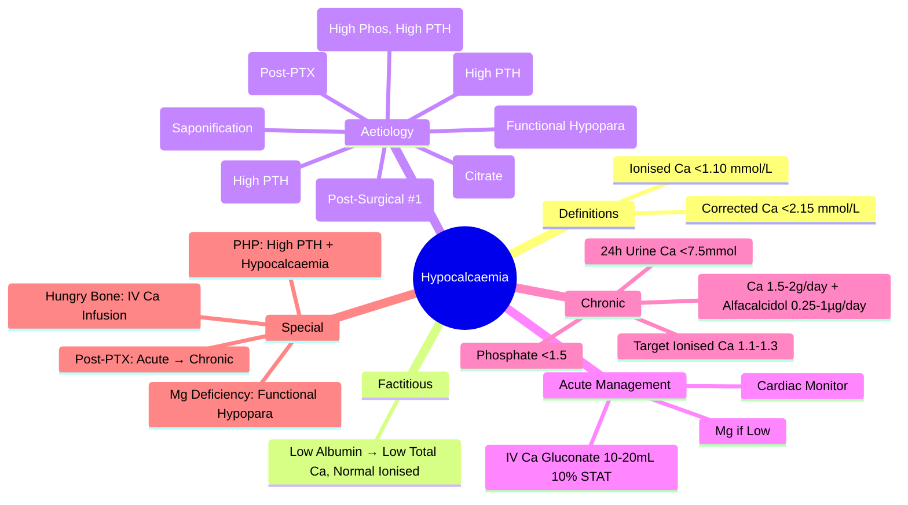

# Hypocalcaemia (Acute & Chronic)

> [!info]
> **Hypocalcaemia = Serum Corrected Calcium <2.15 mmol/L (<8.6 mg/dL) or Ionised Calcium <1.1 mmol/L.** Common Electrolyte Emergency. Causes: Hypoparathyroidism, Vitamin D Deficiency, Renal Failure, Acute Pancreatitis, Massive Transfusion, Drugs. **Acute Severe = Tetany/Seizures → IV Calcium Gluconate STAT.**

---

## 1. Learning Objectives
By the end of this note you should be able to:
- [ ] Define hypocalcaemia and classify by severity/acuity
- [ ] Differentiate true hypocalcaemia from factitious (albumin effect)
- [ ] Apply differential diagnosis algorithm (PTH, Vitamin D, Phosphate, Magnesium)
- [ ] Execute acute management of hypocalcaemic tetany (IV Calcium Gluconate)
- [ ] Prescribe chronic replacement therapy (Calcium + Active Vitamin D)
- [ ] Recognise special causes (Hungry Bone Syndrome, Massive Transfusion, Pancreatitis)

---

## 2. Definitions & Diagnostic Criteria

| Parameter | Normal Range | Hypocalcaemia Threshold |
|---------|--------------|-------------------------|
| **Corrected Serum Calcium** | 2.15-2.55 mmol/L (8.6-10.2 mg/dL) | **<2.15 mmol/L (<8.6 mg/dL)** |
| **Ionised Calcium** | 1.15-1.30 mmol/L (4.5-5.2 mg/dL) | **<1.10 mmol/L (<4.4 mg/dL)** |

> **Correction Formula**: Corrected Ca = Measured Ca + 0.02 × (40 - Albumin g/L) [or ×0.8 per 1g/dL Albumin]

### Severity Classification
| Severity | Corrected Ca (mmol/L) | Ionised Ca (mmol/L) | Clinical Features |
|----------|----------------------|---------------------|-------------------|
| **Mild** | 1.9-2.15 | 1.0-1.1 | Asymptomatic / Mild Paraesthesia |
| **Moderate** | 1.5-1.9 | 0.8-1.0 | Paraesthesia, Tetany (Trousseau/Chvostek), Muscle Cramps |
| **Severe** | <1.5 | <0.8 | **Tetany (Carpopedal Spasm, Laryngospasm), Seizures, QT Prolongation, Arrhythmias** |

---

## 3. Factitious vs True Hypocalcaemia

| Scenario | Total Calcium | Albumin | Ionised Calcium | Interpretation |
|----------|---------------|---------|-----------------|----------------|
| **True Hypocalcaemia** | Low | Normal/Low | Low | **True Hypocalcaemia** |
| **Factitious** | Low | **Low (Hypoalbuminaemia)** | **Normal** | **Factitious** — Correct Calcium Formula |
| **Transfusion/Citrate** | Low | Normal | Low | Citrate Chelation (Massive Transfusion) |
| **EDTA Contamination** | Low (Spurious) | Normal | **Normal** | Lab Artefact |

**Corrected Calcium Formula**: 
- **mmol/L**: Corrected Ca = Measured Ca + 0.02 × (40 - Albumin g/L)
- **mg/dL**: Corrected Ca = Measured Ca + 0.8 × (4.0 - Albumin g/dL)

---

## 4. Aetiological Classification

### A. Hypoparathyroidism (Low PTH)
| Cause | Mechanism |
|---------|-----------|
| **Post-Surgical** (Thyroidectomy/Parathyroidectomy) | **Commonest (75%)** — Transient vs Permanent |
| **Autoimmune** | Isolated / APS-1 (AIRE Mutation) |
| **Genetic** | DiGeorge (22q11.2), CASR Activating Mutation, GCM2, PTH Gene |
| **Infiltrative** | Haemochromatosis, Wilson's, Metastases, Sarcoidosis |
| **Radiation** | Neck Irradiation, Radioiodine Ablation |

### B. Vitamin D Deficiency / Resistance
| Cause | Mechanism |
|---------|-----------|
| **Nutritional Deficiency** | Inadequate Intake/Sunlight; Malabsorption |
| **Renal Failure** | ↓ 1α-Hydroxylase → ↓ 1,25-(OH)₂D |
| **Hepatic Failure** | ↓ 25-Hydroxylation |
| **Drug-Induced** | Phenytoin, Carbamazepine, Rifampicin, Isoniazid (Enzyme Induction) |
| **Vitamin D Resistance (VDDR)** | VDR Mutation (Type II) / 1α-Hydroxylase Defect (Type I) |

### C. Renal Failure
| Mechanism | Details |
|---------|---------|
| **CKD** | ↓ 1α-Hydroxylase → ↓ 1,25-(OH)₂D; Hyperphosphataemia; ↓ Ca²⁺ Absorption |
| **Dialysis** | Aluminium-Related Bone Disease (Historical); Hungry Bone Post-Tx |

### D. Acute Pancreatitis
| Mechanism | Details |
|---------|---------|
| **Saponification** | Free Fatty Acids + Ca²⁺ → Calcium Soaps (Precipitate) |
| **Lipase** | ↑ Vascular Permeability → Calcium Leak into Peritoneal Fluid |
| **Magnesium** | Often Co-existing Hypomagnesaemia |

### E. Acute Critical Illness / Massive Transfusion
| Cause | Mechanism |
|---------|---------|
| **Massive Transfusion** | Citrate Chelates Ca²⁺ (1 Unit Blood = 3g Citrate ≈ 45 mmol Ca²⁺) |
| **Sepsis/Septic Shock** | Vasodilatation, Capillary Leak, Citrated Blood Products |
| **Acute Pancreatitis** | Saponification + Lipase-Mediated Vascular Leak |

### E. Drug-Induced
| Drug | Mechanism |
|------|-----------|
| **Loop Diuretics** | ↑ Ca²⁺ Excretion |
| **Cisplatin/Carboplatin** | Renal Tubular Toxicity → Ca²⁺ Wasting |
| **Cisplatin** | Hypomagnesaemia → Functional Hypoparathyroidism |
| **Bisphosphonates/Denosumab** | Osteoclast Inhibition → Hypocalcaemia (Post-Dose) |
| **Cisplatin/Cisplatin** | Renal Tubular Ca²⁺ Wasting |
| **Cinacalcet** | CaSR Agonist → ↓ PTH → Hypocalcaemia |
| **Bisphosphonates (IV)** | Acute Transient Hypocalcaemia (24-72h Post-Dose) |

### F. Other
| Cause | Mechanism |
|------|-----------|
| **Hungry Bone Syndrome** | Post-Parathyroidectomy/Thyroidectomy → Rapid Bone Mineralisation |
| **Osteoblastic Metastases** | Prostate, Breast → "Calcium Sink" |
| **Rhabdomyolysis** | Calcium Sequestration in Damaged Muscle |
| **Tumour Lysis Syndrome** | Phosphate Release → Ca²⁺ Precipitation |

---

## 5. Clinical Presentation

### Acute Hypocalcaemic Tetany (Emergency)
| Sign/Symptom | Description |
|-------------|-------------|
| **Perioral Paraesthesia** | Numbness/Tingling Lips, Fingers, Toes |
| **Carpopedal Spasm** | **Trousseau's Sign** (BP Cuff Inflated >SBP → Carpal Spasm) |
| **Chvostek's Sign** | Facial Twitch on Facial Nerve Tap (Anterior to Ear) |
| **Laryngospasm** | Stridor, Airway Obstruction — **Emergency** |
| **Generalised Seizures** | Tonic-Clonic |
| **Cardiac** | **Prolonged QT** → Torsades de Pointes, VF |
| **Neuropsychiatric** | Anxiety, Confusion, Memory Impairment |

### Chronic Hypocalcaemia
| Feature | Details |
|---------|---------|
| **Basal Ganglia Calcification** | CT Brain (Fahr's Syndrome) |
| **Cataracts** | Posterior Subcapsular |
| **Dental** | Enamel Hypoplasia, Caries |
| **Neuropsychiatric** | Depression, Anxiety, Dementia, Parkinsonism |
| **Skin/Hair/Nails** | Dry Skin, Coarse Hair, Brittle Nails |
| **Cataracts** | Posterior Subcapsular |

---

## 6. Aetiological Diagnosis — Algorithm

```
Hypocalcaemia (Corrected Ca <2.15 / Ionised Ca <1.10)
         │
         ▼
MEASURE: PTH, PHOSPHATE, MAGNESIUM, ALBUMIN, CREATININE, 25-OH VIT D
         │
         ├── PTH LOW / UNDETECTABLE → HYPOPARATHYROIDISM
         │       ├── Post-Surgical → Transient vs Permanent
         │       ├── Autoimmune (APS-1) → Screen Adrenal/Thyroid
         │       ├── Genetic (DiGeorge, CASR Activating, GCM2)
         │       └── Mg Deficiency → Functional Hypopara
         │
         ├── PTH HIGH → VITAMIN D DEFICIENCY / RENAL FAILURE / PSEUDOHYPOPARATHYROIDISM
         │       ├── PHOSPHATE LOW + 25-OH D LOW → VIT D DEFICIENCY
         │       ├── PHOSPHATE HIGH + CREATININE HIGH → RENAL FAILURE
         │       └── PTH HIGH + CALCIUM LOW + PHOSPHATE HIGH → PSEUDOHYPOPARATHYROIDISM
         │
         └── PTH NORMAL/LOW + Mg LOW → MAGNESIUM DEFICIENCY
                 (Functional Hypoparathyroidism)
```

---

## 7. Specific Aetiologies — Key Features

| Cause | Calcium | Phosphate | PTH | Key Feature |
|-------|---------|-----------|-----|-------------|
| **Hypoparathyroidism** | Low | **High** | **Low/Undetectable** | Post-Surgical, Autoimmune, Genetic |
| **Vitamin D Deficiency** | Low | **Low** | **High** | Low 25-OH D; High ALP |
| **Renal Failure** | Low | **High** | **High** (Secondary) | High Creatinine |
| **Pseudohypoparathyroidism** | Low | High | **High** | PTH Resistance; PHP1a = AHO |
| **Vitamin D Deficiency** | Low | Low/Normal | High | Low 25-OH D; High ALP |
| **Acute Pancreatitis** | Low | Normal/High | Normal/High | High Amylase/Lipase; Saponification |
| **Massive Transfusion** | Low | Normal/High | Normal | Citrate Chelation |
| **Rhabdomyolysis** | Low | High | Normal | High CK, Myoglobinuria |
| **Tumour Lysis** | Low | **Very High** | Normal | Hyperphosphataemia Dominant |
| **Mg Deficiency** | Low | Low/Normal | **Inappropriately Low** | **Correct Mg First** |

---

## 8. Acute Management — Hypocalcaemic Tetany (Emergency)

### Immediate IV Calcium (Life-Saving)
| Drug | Dose | Administration |
|--------|------|-----------------|
| **10% Calcium Gluconate** | **10-20 mL (1-2g) IV** | **Slow IV Over 10 Min** (Cardiac Monitor) |
| **Repeat** | If Persistent Tetany | Every 10-20 Min Until Controlled |

### Follow-Up Infusion
| Infusion | Rate |
|----------|------|
| **10% Calcium Gluconate** | **1-2 g/hr (10-20 mL/hr)** in 5% Dextrose / 0.9% Saline |
| **Target** | Ionised Ca²⁺ >1.1 mmol/L; Symptom Relief |

### Adjuncts
| Drug | Dose | Indication |
|------|------|------------|
| **Magnesium Sulphate** | 2-4g IV (If Hypomagnesaemia) | Mg <0.7 mmol/L |
| **Vitamin D (Alfacalcidol/Calcitriol)** | 1-2 µg IV/PO | Accelerate Ca²⁺ Absorption |
| **Oral Calcium** | 1-2g TDS | After IV Stabilisation |

---

## 9. Chronic Management

### Calcium Supplementation
| Preparation | Elemental Ca²⁺ | Dose |
|--------------|----------------|------|
| **Calcium Carbonate** | 40% (400mg/tablet) | 1-2g TDS with Meals |
| **Calcium Citrate** | 21% | 1-2g TDS (Better if Achlorhydria) |
| **Target** | **Total Elemental Ca²⁺ 1.5-2g/day** | Divided Doses |

### Active Vitamin D Analogues (Essential for Absorption)
| Agent | Dose | Advantage |
|------|------|-----------|
| **Alfacalcidol (1α-OH D3)** | **0.25-1 µg/day** | Rapid Onset; No Renal Activation Needed |
| **Calcitriol (1,25-(OH)₂D₃)** | **0.25-0.5 µg/day** | Active Form; Short Half-Life |
| **Dose Titration** | **Target: Ionised Ca²⁺ 1.1-1.3 mmol/L** | Adjust q2-4wk |

### Magnesium
| Indication | Dose |
|------------|------|
| **Hypomagnesaemia** | **MgSO₄ 2-4g IV** (Acute); Oral Mg 300-600mg/day (Chronic) |

### Thiazide Diuretic (Adjunct)
| Role | Dose |
|------|------|
| **Reduce Urinary Ca²⁺ Excretion** | **Hydrochlorothiazide 25mg OD** (If Hypercalciuria) |

---

## 10. Monitoring & Targets (Chronic)

| Parameter | Target | Frequency |
|-----------|--------|-----------|
| **Serum Calcium (Corrected)** | **2.2-2.5 mmol/L** (Slightly Low Normal) | Monthly (Stable) |
| **Ionised Calcium** | **1.1-1.3 mmol/L** | q1-2wk (Titration) |
| **Phosphate** | **<1.5 mmol/L** | Monthly |
| **24h Urine Calcium** | **<7.5 mmol/day (300mg/day)** | 3-6 Monthly (Monitor Stones) |
| **Renal Function** | eGFR, Creatinine | 6-Monthly |
| **25-OH Vitamin D** | >50 nmol/L (20 ng/mL) | Annually |
| **Bone Density** | DEXA (Spine/Hip) | q2-3 Years |

---

## 11. Special Situations

### Hypocalcaemic Tetany (Emergency)
| Step | Action |
|------|--------|
| **1. IV Calcium Gluconate 10%** | **10-20 mL (1-2g) IV Over 10 Min** (Cardiac Monitor) |
| **2. Repeat** | Every 10-20 Min Until Tetany Controlled |
| **3. Infusion** | 10% Calcium Gluconate 100mL (10g) in 500mL 5% Dextrose @ 50-100mL/hr |
| **4. Magnesium** | If Mg <0.7 → 2-4g MgSO₄ IV |
| **5. Vitamin D** | Alfacalcidol/Calcitriol 1-2µg IV/PO |

### Post-Thyroidectomy Hypocalcaemia
| Type | Duration | Management |
|--------|----------|------------|
| **Transient** | <6 Months | Calcium + Vit D; Wean as PTH Recovers |
| **Permanent** | **>6-12 Months** | Lifelong Replacement; PTH Undetectable |

### Hungry Bone Syndrome (Post-Parathyroidectomy)
| Feature | Management |
|---------|------------|
| **Severe Hypocalcaemia** | **IV Calcium Gluconate Infusion** (1-2g/hr) |
| **Duration** | Days-Weeks (Until Bone Remineralisation Complete) |
| **Phosphate** | Hypophosphataemia → Oral Phosphate Supplements |
| **Magnesium** | Often Co-existing Hypomagnesaemia |

---

## 12. Exam Pearls (FCPS/MRCP)

| Topic | Key Point |
|-------|-----------|
| **Hypocalcaemia Definition** | Corrected Ca <2.15 mmol/L (<8.6 mg/dL); Ionised <1.10 mmol/L |
| **Factitious Hypocalcaemia** | Hypoalbuminaemia → Corrected Ca Normal; Ionised Ca Normal |
| **Corrected Ca Formula** | Measured Ca + 0.02 × (40 - Albumin g/L) |
| **Acute Tetany Rx** | **IV 10% Ca Gluconate 10-20mL Over 10min** (Cardiac Monitor) |
| **Chronic Replacement** | Ca 1.5-2g/day + **Alfacalcidol/Calcitriol 0.25-1µg/day** |
| **Target Ionised Ca²⁺** | **1.1-1.3 mmol/L** (Slightly Low Normal) |
| **Phosphate Target** | **<1.5 mmol/L** (Avoid Hyperphosphataemia) |
| **24h Urine Ca Target** | **<7.5 mmol/day** (Avoid Nephrolithiasis) |
| **Pseudohypoparathyroidism** | **High PTH + Hypocalcaemia**; PHP1a = AHO (Short Stature, Obesity) |
| **Mg Deficiency** | Functional Hypoparathyroidism → **Correct Mg First** |
| **Post-Thyroidectomy** | Transient (<6mo) vs Permanent (>6-12mo) |
| **Hungry Bone Syndrome** | Post-Parathyroidectomy → Severe Hypocalcaemia; IV Ca Infusion |
| **Mg Deficiency** | Correct First (Functional Hypopara); Mg <0.7 → IV MgSO₄ 2-4g |
| **Vitamin D in Hypopara** | **Alfacalcidol/Calcitriol** (Active) — Not Cholecalciferol |

---

## 13. Confusions & Mnemonics

| Confusion | Clarification |
|-----------|---------------|
| **True vs Factitious** | Factitious = Low Total Ca + Low Albumin + **Normal Ionised Ca** |
| **Hypopara vs PHP** | Hypopara: **Low PTH**; PHP: **High PTH** (Resistance) |
| **Vit D Def vs Hypopara** | Vit D Def: **High PTH**; Hypopara: **Low PTH** |
| **Mg Deficiency** | Functional Hypopara; **Correct Mg First** |
| **Corrected Ca Formula** | Ca_corr = Measured Ca + 0.02 × (40 - Albumin g/L) |
| **Acute Tetany Rx** | **IV 10% Ca Gluconate 10-20mL Over 10min** (Cardiac Monitor) |
| **Ionised Ca Target** | **1.1-1.3 mmol/L** (Slightly Low Normal) |
| **Phosphate Target** | **<1.5 mmol/L** |
| **24h Urine Ca Target** | **<7.5 mmol/day** (Avoid Stones) |
| **Mg Deficiency** | Functional Hypopara → Correct Mg First |
| **Trousseau's Sign** | BP Cuff >SBP → Carpal Spasm |
| **Chvostek's Sign** | Facial Nerve Tap → Facial Twitch |

---

## 14. Mind Map



---

## 15. Exam Pearls (FCPS/MRCP)

| Topic | Key Point |
|-------|-----------|
| **Hypocalcaemia Definition** | Corrected Ca <2.15 mmol/L; Ionised <1.10 mmol/L |
| **Factitious Hypocalcaemia** | Low Albumin → Low Total Ca, Normal Ionised Ca |
| **Acute Tetany Rx** | **IV 10% Ca Gluconate 10-20mL Over 10min** (Cardiac Monitor) |
| **Chronic Replacement** | Ca 1.5-2g/day + Alfacalcidol/Calcitriol 0.25-1µg/day |
| **Target Ionised Ca²⁺** | **1.1-1.3 mmol/L** |
| **Phosphate Target** | **<1.5 mmol/L** |
| **24h Urine Ca Target** | **<7.5 mmol/day** (Avoid Nephrolithiasis) |
| **Pseudohypoparathyroidism** | **High PTH + Hypocalcaemia**; PHP1a = AHO |
| **Mg Deficiency** | Functional Hypoparathyroidism → Correct Mg First |
| **Post-Thyroidectomy** | Transient (<6mo) vs Permanent (>6-12mo) |
| **Hungry Bone Syndrome** | Post-PTX Severe Hypocalcaemia → IV Ca Infusion |
| **Mg Deficiency** | Functional Hypoparathyroidism → Correct Mg First |
| **Vitamin D in Hypopara** | Alfacalcidol/Calcitriol (Active) — Not Cholecalciferol |

---

## 16. Local Navigation (for Dashboard UI)

> **Parent**: [[../Parathyroid & Calcium|Parathyroid & Calcium]]  
> **Hierarchy**: [[../../Davidson Chapter 20 - Endocrinology Hierarchy|Endocrinology Hierarchy]]  
> **Template**: [[../../../Templates/Endocrinology Topic Template|Endocrinology Topic Template]]  
> **See also**: [[Hypoparathyroidism]], [[Vitamin D Metabolism & Deficiency]], [[Pseudohypoparathyroidism]], [[Acute Pancreatitis]], [[Massive Transfusion]]
## 17. MCQs (10)
1. **Hypocalcaemia definition:**
   A. Adjusted Ca <2.15 mmol/L (or ionised Ca <1.15)
   B. Ca <2.5
   C. Ca <2.0
   D. Ca <2.3
   E. Ionised Ca <1.3

2. **Commonest cause hypocalcaemia:**
   A. Hypoparathyroidism (post-surgical)
   B. Vit D deficiency
   C. CKD
   D. Acute pancreatitis
   E. Massive transfusion

3. **Hypocalcaemia symptoms:**
   A. Tetany (Chvostek/Trousseau), seizures, QT prolongation, laryngospasm, bronchospasm
   B. Hypertension
   C. Tachycardia
   D. Hyperreflexia only
   E. Asymptomatic

4. **Acute severe hypocalcaemia Rx:**
   A. IV Ca gluconate 10-20ml 10% over 10min (cardiac monitor)
   B. Oral Ca only
   C. IV phosphate
   D. Vit D only
   E. Cinacalcet

5. **Chronic hypocalcaemia Rx:**
   A. Oral Ca + active Vit D (calcitriol/alfacalcidol) + Mg
   B. IV Ca lifelong
   C. PTH injection
   D. Cinacalcet
   E. Bisphosphonates

6. **Hypocalcaemia in acute pancreatitis:**
   A. Ca soaps in fat necrosis + hypoalbuminaemia + glucagon -> dCa
   B. Hypercalcaemia
   C. Normal Ca
   D. Only in severe
   E. Due to hyperparathyroidism

7. **Hypocalcaemia in massive transfusion:**
   A. Citrate chelation of Ca -> hypocalcaemia; give Ca if prolonged
   B. Hypercalcaemia
   C. No effect
   D. Only if liver failure
   E. Not relevant

8. **Mg and hypocalcaemia:**
   A. Low Mg -> PTH resistance + impaired PTH secretion -> refractory hypocalcaemia; replete Mg first
   B. Mg has no effect
   C. High Mg causes hypocalcaemia
   D. Only in CKD
   E. Not relevant

9. **Alkalosis and hypocalcaemia:**
   A. Alkalosis u albumin binding -> d ionised Ca -> tetany; correct pH
   B. Alkalosis u ionised Ca
   C. No effect
   D. Only in respiratory
   E. Acidosis causes hypocalcaemia

10. **Pseudohypocalcaemia:**
   A. Low albumin -> low total Ca but normal ionised Ca; measure ionised Ca
   B. True hypocalcaemia
   C. High albumin
   D. High total Ca
   E. Low ionised Ca

## 18. SBA Questions (10)
1. **Post-thyroidectomy: perioral tingling, Chvostek+, adj Ca 1.8. Immediate?**
   A. IV Ca gluconate 10ml 10% over 10min (cardiac monitor) -> oral Ca/calcitriol
   B. Oral Ca only
   C. Observation
   D. IV phosphate
   E. Cinacalcet

2. **Acute pancreatitis: Ca 1.9, albumin 25. Ionised Ca 0.9. Rx?**
   A. IV Ca gluconate + monitor Mg/albumin
   B. Oral Ca only
   C. Albumin infusion
   D. Cinacalcet
   E. Observation

3. **Massive transfusion: citrate toxicity, Ca 1.7. Management?**
   A. IV Ca gluconate 10ml 10% per 4 units blood; monitor ionised Ca
   B. Oral Ca
   C. Heparin instead
   D. Albumin
   E. Stop transfusion

4. **Hypocalcaemia + low Mg: Ca not correcting despite IV Ca. Next?**
   A. Replete Mg first (Mg needed for PTH secretion/action)
   B. More IV Ca
   C. Cinacalcet
   D. Calcitonin
   E. Stop Ca

5. **Alkalosis + tetany: pH 7.55, ionised Ca 0.9. Management?**
   A. Correct alkalosis (breathing control/paper bag) + IV Ca if severe
   B. More IV Ca
   C. Cinacalcet
   D. Sedation
   E. Intubation

## 19. Flashcards
- **Q: Hypocalcaemia**
  **A: Adj Ca <2.15 mmol/L; ionised Ca <1.15 mmol/L**

- **Q: Commonest cause**
  **A: Hypoparathyroidism (post-surgical); Vit D deficiency; CKD; pancreatitis**

- **Q: Acute Rx**
  **A: IV Ca gluconate 10-20ml 10% over 10min (cardiac monitor)**

- **Q: Chronic Rx**
  **A: Oral Ca + active Vit D (calcitriol/alfacalcidol) + Mg**

- **Q: Mg importance**
  **A: Low Mg -> refractory hypocalcaemia; replete Mg first**

- **Q: Pancreatitis**
  **A: Ca soaps + hypoalbuminaemia + glucagon -> dCa**

- **Q: Massive transfusion**
  **A: Citrate chelation -> hypocalcaemia; Ca per 4 units blood**

- **Q: Alkalosis**
  **A: u albumin binding -> d ionised Ca -> tetany; correct pH**

- **Q: Pseudohypocalcaemia**
  **A: Low albumin -> low total Ca, normal ionised Ca; measure ionised Ca**

- **Q: Chvostek/Trousseau**
  **A: Tetany signs; low ionised Ca**

## 20. Answer Key with Explanations
### MCQs
1. **Adjusted Ca <2.15 mmol/L (or ionised Ca <1.15)** — Hypocalcaemia definition:

2. **Hypoparathyroidism (post-surgical)** — Commonest cause hypocalcaemia:

3. **Tetany (Chvostek/Trousseau), seizures, QT prolongation, laryngospasm, bronchospasm** — Hypocalcaemia symptoms:

4. **IV Ca gluconate 10-20ml 10% over 10min (cardiac monitor)** — Acute severe hypocalcaemia Rx:

5. **Oral Ca + active Vit D (calcitriol/alfacalcidol) + Mg** — Chronic hypocalcaemia Rx:

6. **Ca soaps in fat necrosis + hypoalbuminaemia + glucagon -> dCa** — Hypocalcaemia in acute pancreatitis:

7. **Citrate chelation of Ca -> hypocalcaemia; give Ca if prolonged** — Hypocalcaemia in massive transfusion:

8. **Low Mg -> PTH resistance + impaired PTH secretion -> refractory hypocalcaemia; replete Mg first** — Mg and hypocalcaemia:

9. **Alkalosis u albumin binding -> d ionised Ca -> tetany; correct pH** — Alkalosis and hypocalcaemia:

10. **Low albumin -> low total Ca but normal ionised Ca; measure ionised Ca** — Pseudohypocalcaemia:


### SBAs
1. **IV Ca gluconate 10ml 10% over 10min (cardiac monitor) -> oral Ca/calcitriol** — Post-thyroidectomy: perioral tingling, Chvostek+, adj Ca 1.8. Immediate?

2. **IV Ca gluconate + monitor Mg/albumin** — Acute pancreatitis: Ca 1.9, albumin 25. Ionised Ca 0.9. Rx?

3. **IV Ca gluconate 10ml 10% per 4 units blood; monitor ionised Ca** — Massive transfusion: citrate toxicity, Ca 1.7. Management?

4. **Replete Mg first (Mg needed for PTH secretion/action)** — Hypocalcaemia + low Mg: Ca not correcting despite IV Ca. Next?

5. **Correct alkalosis (breathing control/paper bag) + IV Ca if severe** — Alkalosis + tetany: pH 7.55, ionised Ca 0.9. Management?

