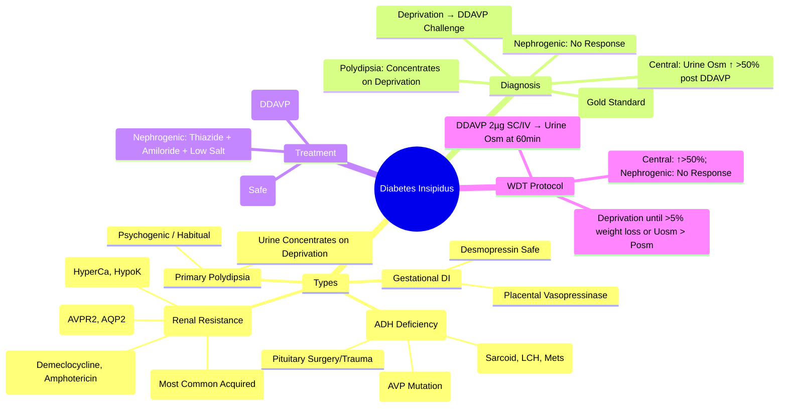

# Diabetes Insipidus

> [!info]
> **Diabetes Insipidus (DI) = Polyuria + Polydipsia due to ADH Deficiency (Central) or Renal Resistance (Nephrogenic).** **Central DI = ADH Deficiency**; **Nephrogenic DI = Renal Resistance**. **Water Deprivation Test + Desmopressin Challenge = Gold Standard Diagnostic Test**.

---

## 1. Learning Objectives
By the end of this note you should be able to:
- [ ] Differentiate Central DI, Nephrogenic DI, and Primary Polydipsia
- [ ] Perform and interpret Water Deprivation Test + Desmopressin Challenge
- [ ] Apply desmopressin therapy for Central DI
- [ ] Manage Nephrogenic DI (Thiazides, Amiloride, Low Salt Diet)
- [ ] Recognise Gestational DI and its management

---

## 2. Overview & Classification

| Type | Pathophysiology | ADH Level | Urine Osmolality | Desmopressin Response |
|------|-----------------|-----------|------------------|-----------------------|
| **Central DI** | **ADH Deficiency** (Pituitary/Stalk/Hypothalamic Lesion) | **Low** | Low (Dilute) | **Responds ↑ Urine Osm >50%** |
| **Nephrogenic DI** | **Renal Resistance to ADH** (V2 Receptor/AQP2 Defect) | **High/Normal** | Low (Dilute) | **No Response** |
| **Primary Polydipsia** | **Excessive Water Intake** (Psychogenic/Dipsogenic) | **Suppressed** | Low (Concentrates on Deprivation) | Concentrates on Deprivation |
| **Gestational DI** | Placental Vasopressinase Degrades ADH | Low/Normal | Dilute | Responds to Desmopressin |

---

## 3. Aetiology

### Central DI (CDI)
| Cause | Frequency | Details |
|---------|-----------|---------|
| **Idiopathic** | ~30% | Autoimmune (Lymphocytic Infundibuloneurohypophysitis) |
| **Pituitary Surgery / Trauma** | ~20% | Post-TSS, Head Trauma, Basal Skull Fracture |
| **Infiltration** | ~15% | Sarcoidosis, Langerhans Cell Histiocytosis, Metastases, Haemochromatosis |
| **Genetic** | Rare | AVP Gene Mutations (Autosomal Dominant) |
| **Pituitary Surgery/Apoplexy** | ~10% | Post-TSS, Pituitary Apoplexy |
| **Craniopharyngioma** | ~5% | Suprasellar Tumor Compressing Stalk |

### Nephrogenic DI (NDI)
| Cause | Mechanism | Key Features |
|---------|-----------|--------------|
| **Lithium** | **Most Common Acquired** | ↓ AQP2 Expression, ↓ cAMP; Dose/Duration Dependent |
| **Drugs** | Demeclocycline, Amphotericin B, Foscarnet, Ofloxacin, Ifosfamide | V2 Receptor / AQP2 Inhibition |
| **Electrolytes** | Hypercalcaemia, Hypokalaemia | Tubular Damage |
| **Obstructive Uropathy** | Tubulointerstitial Damage |
| **Genetic** | **AVPR2** (X-Linked Recessive), **AQP2** (AR) | Congenital NDI |

### Primary Polydipsia (Psychogenic)
| Feature | Details |
|---------|---------|
| **Aetiology** | Psychogenic (Schizophrenia), Habitual, Dipsogenic |
| **Mechanism** | Excess Water Intake → Suppresses ADH → Dilute Urine |
| **Key Feature** | **Urine Concentrates During Deprivation** (Unlike DI) |

---

## 4. Clinical Presentation

| Feature | Central DI | Nephrogenic DI | Primary Polydipsia |
|---------|------------|----------------|---------------------|
| **Polyuria** | >3-4 L/day | >3-4 L/day | >3-4 L/day |
| **Polydipsia** | Profound Thirst, Nocturia | Profound Thirst, Nocturia | Compulsive Drinking |
| **Urine Osmolality** | **Low (<300 mOsm/kg)** | **Low (<300 mOsm/kg)** | Low/Variable (Concentrates on Deprivation) |
| **Serum Osmolality** | **High (>295 mOsm/kg)** | **High** | Normal/ Low |
| **Serum Sodium** | **High (>145 mmol/L)** | **High** | Normal/Low |
| **ADH Level** | **Low/Undetectable** | **High** | Suppressed |
| **Nocturia** | Severe | Severe | Severe |

---

## 5. Diagnostic Algorithm — Water Deprivation Test (WDT)

### Protocol
| Phase | Procedure | Stop Criteria |
|-------|-----------|---------------|
| **1. Fluid Deprivation** | NPO + Fluid Restriction; Weight, Serum/Urine Osmolality q1-2h | Weight Loss >5%; Urine Osm > Plasma Osm; Haemodynamic Instability |
| **2. Desmopressin Challenge** | **DDAVP 2µg SC/IV** (or 10-40µg Intranasal) | Measure Urine Osm at 60min |

### Interpretation Matrix

| Result | Central DI | Nephrogenic DI | Primary Polydipsia |
|--------|------------|----------------|-------------------|
| **Baseline Urine Osm** | Low (<300) | Low (<300) | Low/Variable |
| **After Deprivation** | Low (<300) | Low (<300) | **Concentrates (>600)** |
| **Post-DDAVP (60min)** | **↑ >50%** | **No Response (<10%)** | N/A (Already Concentrated) |
| **Plasma ADH** | Low | High | Low (Suppressed) |

### Stop Criteria (Safety)
| Criterion | Action |
|-----------|--------|
| **Weight Loss >5%** | STOP |
| **Urine Osm > Plasma Osm** | STOP |
| **Haemodynamic Instability** (SBP<90, HR>120) | STOP |
| **Time >8 Hours** | STOP |

---

## 6. Desmopressin (DDAVP) Therapy

### Central DI
| Route | Dose | Frequency |
|-------|------|---------|
| **Intranasal** | 10-40µg | q12-24h |
| **Oral (Tablet)** | 0.1-0.4mg | q12-24h |
| **Subcutaneous / IV** | 2-4µg | q12-24h |
| **Dose Titration** | **Target: Urine Output 1.5-2.5L/day**, No Nocturia, Normal Na⁺ | |

### Nephrogenic DI
| Treatment | Dose | Mechanism |
|---------|------|-----------|
| **Low Salt / Low Protein Diet** | — | Reduces Solute Load |
| **Thiazide Diuretic** | **Hydrochlorothiazide 25-50mg BD** | Induces Mild Volume Depletion → ↑ Proximal Reabsorption |
| **Amiloride** | 5-10mg BD | ENaC Blocker; K⁺-Sparing |
| **NSAIDs (Indomethacin)** | 25-50mg TDS | ↑ Prostaglandin Inhibition → ↓ PGE2 → ↑ ADH Sensitivity |
| **Desmopressin** | **Partial Response** (If Partial NDI) | Limited Role |

---

## 7. Gestational DI

| Feature | Details |
|---------|---------|
| **Cause** | Placental Vasopressinase Degrades ADH |
| **Onset** | 2nd/3rd Trimester |
| **Resolution** | **Postpartum (4-6 Weeks)** |
| **Treatment** | **Desmopressin** (Safe in Pregnancy); Monitor Fluid Balance |
| **Recurrence** | **High in Subsequent Pregnancies** |

---

## 8. Differential Diagnosis

| Feature | Central DI | Nephrogenic DI | Primary Polydipsia |
|---------|------------|----------------|---------------------|
| **Serum Osmolality** | >295 mOsm/kg | >295 mOsm/kg | Normal/Low |
| **Urine Osmolality** | <300 mOsm/kg | <300 mOsm/kg | Concentrates on Deprivation |
| **Urine Osm Post-DDAVP** | **↑ >50%** | **No Change** | N/A |
| **Plasma ADH** | Low | High | Suppressed |
| **Desmopressin Test** | **Positive Response** | **No Response** | Concentrates on Deprivation |

---

## 9. Management

### Central DI
| Aspect | Details |
|---------|---------|
| **Desmopressin (DDAVP)** | Intranasal 10-40µg q12-24h; Oral 0.1-0.4mg q12-24h; SC/IV 2-4µg q24h |
| **Dose Titration** | Start Low; Titrate to Urine Output 1.5-2.5L/day; Nocturia ≤1 |
| **Fluid Intake** | **No Restriction** (Ad Libitum) |
| **Adverse Effects** | **Hyponatraemia** (Water Retention) — Monitor Na⁺ |

### Nephrogenic DI
| Therapy | Dose | Role |
|-------|------|------|
| **Diet** | Low Salt, Low Protein | Reduce Solute Load |
| **Thiazide** | HCTZ 25-50mg BD | Induces Mild Volume Depletion → ↑ Proximal Reabsorption |
| **Amiloride** | 5-10mg BD | ENaC Blocker; K⁺-Sparing |
| **NSAIDs** | Indomethacin 25-50mg TDS | ↓ Prostaglandin → ↑ ADH Sensitivity |
| **Desmopressin** | Partial Response Only | If Partial NDI |

---

## 10. Complications & Monitoring

| Complication | Monitoring |
|--------------|------------|
| **Hyponatraemia** | Serum Na⁺ q6-12h (If on Desmopressin) |
| **Water Intoxication** | Fluid Restriction if Severe; Stop Desmopressin |
| **Hypernatraemia** | If Desmopressin Missed/Dose Inadequate |
| **Breakthrough Polyuria** | Dose Escalation / Split Dosing |

---

## 11. Special: Gestational DI

| Feature | Management |
|---------|-----------|
| **Onset** | 2nd/3rd Trimester (Placental Vasopressinase) |
| **Treatment** | **Desmopressin** (Safe in Pregnancy) |
| **Delivery** | Monitor Fluid Balance; Desmopressin Peripartum |
| **Postpartum** | **Resolves 4-6 Weeks** Postpartum |
| **Recurrence** | **High Recurrence** in Subsequent Pregnancies |

---

## 12. Exam Pearls (FCPS/MRCP)

| Topic | Key Point |
|-------|-----------|
| **DI vs SIADH** | DI = Polyuria + Dilute Urine + High Serum Osm; SIADH = Hyponatraemia + Concentrated Urine |
| **Central vs Nephrogenic DI** | Central: **ADH Low, Responds to DDAVP**; Nephrogenic: **ADH High, No DDAVP Response** |
| **WDT Stop Criteria** | Weight Loss >5% OR Urine Osm > Plasma Osm OR Haemodynamic Instability |
| **Central DI Treatment** | **Desmopressin (DDAVP)** — Intranasal/Oral/SC/IV |
| **Nephrogenic DI Treatment** | **Thiazide + Amiloride + Low Salt Diet** (Desmopressine Ineffective) |
| **Lithium** | **Most Common Cause of Acquired NDI** (↓ AQP2, ↓ cAMP) |
| **Primary Polydipsia** | **Urine Concentrates on Deprivation**; DDAVP Not Needed |
| **Gestational DI** | Placental Vasopressinase; **Desmopressin Safe**; Resolves Postpartum |
| **WDT Stop Criteria** | Weight Loss >5%, Urine Osm > Plasma Osm, Haemodynamic Instability |
| **Desmopressin Hyponatraemia** | Monitor Na⁺; Limit Fluids if on DDAVP |
| **Lithium NDI** | ↓ AQP2 Expression → Stop Lithium if Possible |
| **Central vs Nephrogenic DI** | **DDAVP Response**: Central = ↑ Urine Osm >50%; Nephrogenic = No Response |

---

## 13. Confusions & Mnemonics

| Confusion | Clarification |
|-----------|---------------|
| **Central vs Nephrogenic DI** | Central = ADH Deficiency; Nephrogenic = Renal Resistance to ADH |
| **DDAVP Response** | Central = **Works**; Nephrogenic = **Fails** |
| **Primary Polydipsia vs DI** | Polydipsia: Urine Concentrates on Deprivation; DI = Fails to Concentrate |
| **Gestational DI** | Placental Vasopressinase → ADH Degradation; Resolves Postpartum |
| **Lithium NDI** | ↓ AQP2 Expression; ↓ cAMP; Most Common Acquired NDI |
| **Desmopressin vs Vasopressin** | DDAVP = Pure V2 Agonist (No Pressor Effect); Vasopressin = V1+V2 |
| **Desmopressin in Enuresis** | Intranasal/Oral at Bedtime; No Fluid Restriction Needed |
| **WDT Stop** | Weight Loss >5% OR Urine Osm > Plasma Osm |

---

## 14. Mind Map

---

## 15. Exam Pearls (FCPS/MRCP)

| Topic | Key Point |
|-------|-----------|
| **Central vs Nephrogenic DI** | Central: ADH Low → DDAVP Response; Nephrogenic: ADH High → DDAVP No Response |
| **WDT Gold Standard** | Deprivation → DDAVP Challenge |
| **Central DI** | DDAVP → Urine Osm ↑ >50% |
| **Nephrogenic DI** | DDAVP → No Response |
| **Primary Polydipsia** | Urine Concentrates on Deprivation (No DDAVP Needed) |
| **Gestational DI** | Placental Vasopressinase → ADH Degradation → Desmopressin Safe |
| **Lithium NDI** | **Most Common Acquired NDI** (↓ AQP2, ↓ cAMP) |
| **DDAVP in Central DI** | Intranasal/Oral/SC/IV; Monitor Na+ (Hyponatraemia Risk) |
| **NDI Management** | Thiazide + Amiloride + Low Salt Diet; Desmopressine Not Effective |
| **WDT Stop Criteria** | Weight Loss >5% OR Urine Osm > Plasma Osm |

---

## 16. Local Navigation (for Dashboard UI)

> **Parent**: [[../Posterior Pituitary- ADH-Vasopressin|Posterior Pituitary- ADH-Vasopressin]]  
> **Hierarchy**: [[../../Davidson Chapter 20 - Endocrinology Hierarchy|Endocrinology Hierarchy]]  
> **Template**: [[../../../Templates/Endocrinology Topic Template|Endocrinology Topic Template]]  
> **See also**: [[Posterior Pituitary- ADH-Vasopressin]], [[SIADH]], [[Posterior Pituitary- Oxytocin]], [[Pituitary Apoplexy]], [[Craniopharyngioma]]
## 17. MCQs (10)
1. **Diabetes insipidus =**
   A. ADH deficiency (central) or renal resistance (nephrogenic); polyuria/polydipsia
   B. ADH excess
   C. Aldosterone deficiency
   D. Cortisol deficiency
   E. Thyroid hormone excess

2. **Central DI causes:**
   A. Pituitary surgery, trauma, tumours, infiltrative, idiopathic
   B. Renal disease
   C. Lithium
   D. Hypercalcaemia
   E. Hypokalaemia

3. **Nephrogenic DI causes:**
   A. Lithium, hypercalcaemia, hypokalaemia, renal disease, genetic (AQP2)
   B. Pituitary surgery
   C. Trauma
   D. Tumours
   E. Idiopathic

4. **Water deprivation test - central DI:**
   A. No urine concentration -> DDAVP -> urine osmolality rises >50%
   B. No response to DDAVP
   C. Normal concentration
   D. Urine osmolality >800
   E. Serum Na+ normal

5. **Water deprivation test - nephrogenic DI:**
   A. No urine concentration -> DDAVP -> NO response
   B. Concentrates with DDAVP
   C. Normal concentration
   D. Urine osmolality >800
   E. Serum Na+ normal

6. **Central DI treatment:**
   A. Desmopressin (DDAVP) oral/nasal/IV; monitor sodium
   B. Fluid restriction
   C. Thiazide
   D. NSAIDs
   E. Fludrocortisone

7. **Nephrogenic DI treatment:**
   A. Thiazide + low salt + NSAID (indomethacin); DDAVP ineffective
   B. Desmopressin
   C. Fluid restriction only
   D. Furosemide
   E. Spironolactone

8. **Gestational DI:**
   A. Placental vasopressinase degrades ADH; treat with desmopressin
   B. Central DI
   C. Nephrogenic DI
   D. Primary polydipsia
   E. SIADH

9. **Primary polydipsia:**
   A. Water deprivation -> partial concentration; DDAVP -> further concentration
   B. Central DI
   C. Nephrogenic DI
   D. SIADH
   E. No concentration

10. **Desmopressin dosing:**
   A. Central DI: 100-400mcg oral q12-24h; 1-4mcg IV/SC q8-12h; titrate to urine osmolality
   B. Fixed 1mg daily
   C. Only IV
   D. Only nasal
   E. Weight-based only

## 18. SBA Questions (10)
1. **30yo man: polyuria 6L/day, polydipsia, serum Na+ 150, urine osmolality 100. After water dep: urine osmolality 150. DDAVP -> 600. Diagnosis?**
   A. Central DI
   B. Nephrogenic DI
   C. Primary polydipsia
   D. SIADH
   E. Gestational DI

2. **Same patient: treatment?**
   A. Desmopressin 100-200mcg oral/nasal q12h; monitor sodium
   B. Fluid restriction
   C. Thiazide
   D. NSAIDs
   E. Furosemide

3. **Patient on lithium: polyuria, Na+ 148, urine osmolality 150. Water dep no concentration. DDAVP no response. Diagnosis?**
   A. Nephrogenic DI (lithium)
   B. Central DI
   C. Primary polydipsia
   D. SIADH
   E. Gestational DI

4. **Same patient: treatment?**
   A. Thiazide + amiloride + low salt + NSAID; stop lithium if possible
   B. Desmopressin
   C. Fluid restriction
   D. Furosemide
   E. Spironolactone

5. **Pregnant woman: polyuria, Na+ 150. Water dep no concentration. DDAVP -> concentration. Diagnosis?**
   A. Gestational DI
   B. Central DI
   C. Nephrogenic DI
   D. Primary polydipsia
   E. SIADH

## 19. Flashcards
- **Q: Central DI**
  **A: ADH deficiency; water dep no concentrate -> DDAVP -> urine concentrates**

- **Q: Nephrogenic DI**
  **A: Renal resistance to ADH; no concentration even with DDAVP**

- **Q: Primary polydipsia**
  **A: Water dep -> some concentration; DDAVP -> further concentration**

- **Q: Water deprivation test**
  **A: Central DI: DDAVP works; Nephrogenic: DDAVP fails; Polydipsia: some concentration**

- **Q: Desmopressin**
  **A: Central DI: 100-400mcg q12-24h oral/nasal; 1-4mcg q8-12h IV/SC**

- **Q: Nephrogenic DI Rx**
  **A: Thiazide + low salt + NSAID (indomethacin); stop offending drug**

- **Q: Gestational DI**
  **A: Placental vasopressinase; treat with desmopressin**

- **Q: Primary polydipsia**
  **A: Water dep partial concentration; DDAVP further concentrates**

- **Q: Lithium DI**
  **A: Nephrogenic; thiazide + amiloride + low salt + NSAID**

- **Q: SIADH vs DI**
  **A: SIADH: euvolaemic hyponatraemia, Uosm >100, UNa+ >20; DI: hypernatraemia, polyuria**

## 20. Answer Key with Explanations
### MCQs
1. **ADH deficiency (central) or renal resistance (nephrogenic); polyuria/polydipsia** — Diabetes insipidus =

2. **Pituitary surgery, trauma, tumours, infiltrative, idiopathic** — Central DI causes:

3. **Lithium, hypercalcaemia, hypokalaemia, renal disease, genetic (AQP2)** — Nephrogenic DI causes:

4. **No urine concentration -> DDAVP -> urine osmolality rises >50%** — Water deprivation test - central DI:

5. **No urine concentration -> DDAVP -> NO response** — Water deprivation test - nephrogenic DI:

6. **Desmopressin (DDAVP) oral/nasal/IV; monitor sodium** — Central DI treatment:

7. **Thiazide + low salt + NSAID (indomethacin); DDAVP ineffective** — Nephrogenic DI treatment:

8. **Placental vasopressinase degrades ADH; treat with desmopressin** — Gestational DI:

9. **Water deprivation -> partial concentration; DDAVP -> further concentration** — Primary polydipsia:

10. **Central DI: 100-400mcg oral q12-24h; 1-4mcg IV/SC q8-12h; titrate to urine osmolality** — Desmopressin dosing:

### SBAs
1. **Central DI** — 30yo man: polyuria 6L/day, polydipsia, serum Na+ 150, urine osmolality 100. After water dep: urine osmolality 150. DDAVP -> 600. Diagnosis?

2. **Desmopressin 100-200mcg oral/nasal q12h; monitor sodium** — Same patient: treatment?

3. **Nephrogenic DI (lithium)** — Patient on lithium: polyuria, Na+ 148, urine osmolality 150. Water dep no concentration. DDAVP no response. Diagnosis?

4. **Thiazide + amiloride + low salt + NSAID; stop lithium if possible** — Same patient: treatment?

5. **Gestational DI** — Pregnant woman: polyuria, Na+ 150. Water dep no concentration. DDAVP -> concentration. Diagnosis?

