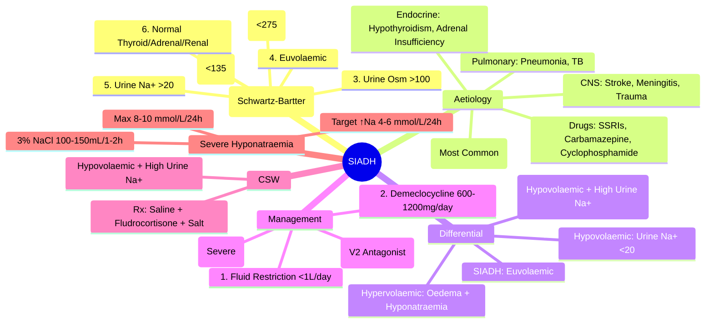

# SIADH (Syndrome of Inappropriate ADH Secretion)

> [!info]
> **SIADH = Syndrome of Inappropriate ADH Secretion.** **Commonest Cause of Euvolaemic Hyponatraemia.** **Inappropriate ADH Secretion → Water Retention → Dilutional Hyponatraemia.** **Diagnosis = Exclusion** (Schwartz-Bartter Criteria). **Treatment: Fluid Restriction → Demeclocycline → Tolvaptan (V2 Antagonist).**

---

## 1. Learning Objectives
By the end of this note you should be able to:
- [ ] Apply Schwartz-Bartter diagnostic criteria for SIADH
- [ ] Differentiate SIADH from Cerebral Salt Wasting (CSW) and Hypovolaemic Hyponatraemia
- [ ] Apply stepwise management: Fluid Restriction → Demeclocycline → Tolvaptan
- [ ] Manage severe symptomatic hyponatraemia with hypertonic saline
- [ ] Identify and treat underlying causes (drugs, malignancy, CNS, pulmonary)

---

## 2. Diagnostic Criteria (Schwartz-Bartter)

| Criterion | Requirement |
|-----------|-------------|
| **1. Hyponatraemia** | Serum Na+ **<135 mmol/L** |
| **2. Hypo-osmolality** | Serum Osm **<275 mOsm/kg** |
| **3. Inappropriately Concentrated Urine** | Urine Osm **>100 mOsm/kg** (Usually >200) |
| **4. Euvolaemia** | **Normal Volume Status** (No Oedema, Normal JVP, Normal BP) |
| **5. Elevated Urine Sodium** | **Urine Na+ >20 mmol/L** (Euvolaemic) |
| **6. Normal Thyroid/Adrenal/Renal** | TSH Normal, Cortisol Normal, Creatinine Normal |
| **7. No Diuretics** | Exclude Recent Diuretic Use (Within 1-2 Weeks) |

**All 6 Criteria Must Be Met** for Diagnosis.

---

## 3. Aetiology — SIADH Causes

| Category | Causes |
|---------|--------|
| **Drugs (Commonest)** | **SSRIs, SNRIs, Tricyclics**, Carbamazepine, Oxcarbazepine, Chlorpropamide, Cyclophosphamide, Vincristine, MDMA |
| **Malignancy** | **Small Cell Lung Cancer** (Most Common), Pancreatic, Thymoma, Lymphoma, Head & Neck |
| **CNS Disorders** | Stroke, Haemorrhage, Meningitis, Encephalitis, Guillain-Barré, Tumours, Trauma, Neurosurgery |
| **Pulmonary** | Pneumonia, TB, Lung Abscess, Positive Pressure Ventilation |
| **Endocrine** | Hypothyroidism, Adrenal Insufficiency (Addison's) |
| **Post-Operative** | Post-Neurosurgery, Post-Abdominal Surgery |
| **Other** | Porphyria, Acute Intermittent Porphyria, Nausea/Vomiting |

---

## 4. Diagnostic Approach

### Stepwise Diagnosis
```
Hyponatraemia (Serum Na+ <135 mmol/L)
         │
         ├── ASSESS VOLUME STATUS
         │       ├── HYPOVOLAEMIC → Hypovolaemic Hyponatraemia
         │       │       (Diuretics, GI Losses, Cerebral Salt Wasting)
         │       │
         │       ├── HYPERVOLAEMIC → Hypervolaemic Hyponatraemia
         │       │       (HF, Cirrhosis, Nephrotic Syndrome)
         │       │
         └── EUVOLAEMIC → **SIADH** (Most Common)
                 │
                 ├── EXCLUDE: Hypothyroidism, Adrenal Insufficiency, Renal Failure
                 ├── EXCLUDE: Diuretic Use (Recent)
                 ├── APPLY SCHWARTZ-BARTTER CRITERIA (All 6 Must Be Met)
                 └── CONFIRM SIADH
```

### Diagnostic Criteria (Schwartz-Bartter) — All 6 Must Be Met
| # | Criterion | Requirement |
|---|-----------|-------------|
| **1** | **Hyponatraemia** | Serum Na+ <135 mmol/L |
| **2** | **Hypo-osmolality** | Serum Osm <275 mOsm/kg |
| **3** | **Inappropriately Concentrated Urine** | Urine Osm >100 mOsm/kg (Usually >200) |
| **4** | **Euvolaemia** | Normal JVP, No Oedema, Normal BP |
| **5** | **Elevated Urine Na+** | Urine Na+ >20 mmol/L (Euvolaemic) |
| **6** | **Normal Endocrine/Renal** | TSH Normal, Cortisol Normal, Creatinine Normal; No Diuretics |

---

## 5. Differential Diagnosis — Euvolaemic Hyponatraemia

| Condition | Serum Na+ | Urine Osm | Urine Na+ | Volume Status | Key Differentiator |
|-----------|-----------|-----------|-----------|----------------|-------------------|
| **SIADH** | Low | >100 | >20 | **Euvolaemic** | Inappropriate ADH |
| **Cerebral Salt Wasting (CSW)** | Low | >100 | >20 (Often Higher) | **Hypovolaemic** | Hypovolaemia + High Urine Na+ |
| **Hypothyroidism** | Low | Variable | Variable | Euvolaemic | TSH ↑, Low fT4 |
| **Adrenal Insufficiency** | Low | High | High | Hypovolaemic | Cortisol Low, ACTH ↑, Hyperpigmentation |
| **Glucocorticoid Deficiency** | Low | >100 | >20 | Hypovolaemic | Cortisol Low |
| **Reset Osmostat** | Stable Low (125-130) | Inappropriately High | >20 | Euvolaemic | Stable Na+ 125-130 |
| **Diuretic Use** | Low | Variable | >20 | Euvo/Hypovolaemic | Recent Diuretic History |
| **Beer Potomania** | Low | Low | Low | Euvolaemic | Low Solute Intake History |

---

## 6. SIADH vs Cerebral Salt Wasting (CSW) — Critical Distinction

| Feature | **SIADH** | **Cerebral Salt Wasting (CSW)** |
|--------|-----------|--------------------------------|
| **Volume Status** | **Euvolaemic** | **Hypovolaemic** |
| **Urine Na+** | >20 mmol/L | >20 (Often Higher) |
| **Urine Osm** | >100 | >100 (Often Higher) |
| **Serum Na+** | Low | Low |
| **JVP** | Normal | Low |
| **Skin Turgor** | Normal | Dry |
| **Postural BP** | Normal | **Postural Drop >20 mmHg** |
| **Urine Output** | Low/Normal | **High (Polyuria)** |
| **Uric Acid** | Low/Normal | High |
| **Management** | **Fluid Restriction** | **Saline Resuscitation** (+ Fludrocortisone) |
| **Pathophysiology** | ADH Excess → Water Retention | **Renal Salt Wasting** → Volume Depletion → ADH Release |

> **Key**: **Volume Status is the Key Discriminator** — SIADH = Euvolaemic; CSW = Hypovolaemic.

---

## 7. Management Algorithm

### Stepwise Management (Euvoleaemic Hyponatraemia = SIADH)
```
SIADH Confirmed (All 6 Criteria Met)
         │
         ▼
IDENTIFY & TREAT UNDERLYING CAUSE
         │
         ├── Drug-Induced → Stop/Reduce Offending Drug
         ├── Malignancy → Treat Cancer
         ├── CNS/Pulmonary → Treat Underlying
         │
         ▼
STEP 1: FLUID RESTRICTION (<1 L/day)
         │
         ├── Effective → Goal Na+ Rise 0.5-1 mmol/L/day; Target Na+ >130
         ├── IF Na+ Rise <0.5 mmol/L/day OR Severe Symptoms → STEP 2
         │
         ▼
STEP 2: DEMECLOCYCLINE 600-1200mg/day (600-1200mg/day in Divided Doses)
         │       MoA: Induces Nephrogenic DI (ADH Resistance)
         │       Side Effects: Photosensitivity, Nephrotoxicity, GI
         │       Monitor: Renal Function, Photosensitivity
         │
         ▼
STEP 3: TOLVAPTAN (V2 Receptor Antagonist) — **Severe/Refractory**
         │       Dose: 15mg OD PO → Titrate to 30, 45, 60mg OD
         │       Target: Na+ Rise 4-6 mmol/L/24h (Max 8-10 mmol/L/24h)
         │       Monitoring: Na+ q4-6h, Liver Function (Hepatotoxicity Risk)
         │       Max Duration: 30 Days (US FDA); Longer in Some Countries
         │
         ▼
STEP 4: HYPERTONIC SALINE (3% NaCl) — **SEVERE SYMPTOMATIC HYPONATRAEMIA**
         │       Na+ <120 mmol/L OR Seizures/Coma
         │       3% NaCl 100-150mL over 1-2h (Target ↑Na+ 4-6 mmol/L/24h)
         │       Monitor: Na+ q1-2h, Fluid Balance, Neurological Status
```

---

## 8. Severe Symptomatic Hyponatraemia — Emergency Protocol

| Severity | Serum Na+ | Neurological Status | Immediate Treatment |
|----------|-----------|---------------------|---------------------|
| **Mild** | 130-134 | Asymptomatic/Mild | Fluid Restriction |
| **Moderate** | 125-129 | Nausea, Headache, Mild Confusion | Fluid Restriction ± Demeclocycline |
| **Severe** | **<125** | **Seizures, Coma, Severe Confusion** | **3% Hypertonic Saline 100-150mL over 1-2h** |
| **Life-Threatening** | **<115** | **Coma, Seizures, Respiratory Arrest** | **3% Saline 100-150mL over 1h** + **ICU** |

### Hypertonic Saline Protocol
| Parameter | Target |
|-----------|---------|
| **Na+ Rise Rate** | **4-6 mmol/L in First 24h** (Max 8 mmol/L/24h) |
| **Max Correction** | **8-10 mmol/L in 24h** (Avoid Central Pontine Myelinolysis) |
| **Infusion** | **3% NaCl 100-150mL over 1-2h** (Repeat if Needed) |
| **Monitor** | Na+ q1-2h, Neuro Checks, Fluid Balance, Urine Output |

---

## 9. Specific Causes & Management

### Drug-Induced SIADH
| Drug Class | Examples | Management |
|-----------|----------|------------|
| **Antidepressants** | SSRIs (Sertraline, Fluoxetine), TCAs, MAOIs | **Stop/Reduce**; Switch to Alternative |
| **Carbamazepine / Oxcarbazepine** | Common Cause | Switch to Alternative AED |
| **Chemotherapy** (Cyclophosphamide, Vincristine) | Chemo | Supportive; Demeclocycline if Needed |
| **Opioids / MDMA** | Acute | Stop Drug; Supportive |

### Malignancy-Related SIADH
| Tumour | Frequency | Management |
|--------|-----------|------------|
| **Small Cell Lung Cancer** | Most Common | Treat Cancer; Demeclocycline / Tolvaptan |
| **Pancreatic / Thymoma / Lymphoma** | Less Common | Treat Cancer |

### SIADH in CNS Disorders
| Condition | Management |
|-----------|------------|
| **Stroke / Haemorrhage** | Supportive; Fluid Restrict; Demeclocycline if Persistent |
| **Meningitis / Encephalitis** | Treat Infection; Manage SIADH |
| **Neurosurgery** | Post-Op SIADH Common; Transient Usually |
| **Trauma** | Monitor; Fluid Restrict; Demeclocycline if Persistent |

---

## 10. Cerebral Salt Wasting (CSW) — Detailed

### Diagnostic Criteria
| Feature | Requirement |
|--------|-------------|
| **CNS Disease** | Present (SAH, TBI, Neurosurgery, Tumour) |
| **Hyponatraemia** | Serum Na+ <135 |
| **Volume Status** | **Hypovolaemic** (Low JVP, Dry Mucosa, Postural Hypotension) |
| **Urine Na+** | **>20 mmol/L** (Often >100) |
| **Urine Osm** | >100 mOsm/kg (Often >300) |
| **Urine Output** | **High** (Polyuria) |

### Management of CSW
| Step | Action |
|-------|--------|
| **1. Volume Resuscitation** | **IV 0.9% NaCl 1-2L Bolus** → Then Maintenance |
| **2. Fludrocortisone** | **0.05-0.2mg OD** (Mineralocorticoid Replacement) |
| **3. Salt Supplementation** | **NaCl Tablets 1-2g TDS** |
| **4. Monitor** | Na+, K+, Volume Status, UOP |

---

## 11. Exam Pearls (FCPS/MRCP)

| Topic | Key Point |
|-------|-----------|
| **SIADH = Euvolaemic Hyponatraemia** | **Most Common Cause** of Hyponatraemia in Hospital |
| **Schwartz-Bartter Criteria** | 6 Criteria — All Must Be Met |
| **SIADH vs CSW** | **Volume Status** = Key Discriminator (Euvolaemic vs Hypovolaemic) |
| **CSW** | Hypovolaemic + High Urine Na+ + High Urine Osm → **Saline + Fludrocortisone** |
| **First-Line SIADH** | **Fluid Restriction <1L/day** |
| **Second-Line** | **Demeclocycline 600-1200mg/day** (Induces Nephrogenic DI) |
| **Third-Line** | **Tolvaptan 15-60mg OD** (V2 Antagonist); Max 30 Days (US) |
| **Severe Hyponatraemia** | **3% NaCl 100-150mL/1-2h** (Target ↑ Na 4-6 mmol/L/24h) |
| **Correction Rate** | **4-6 mmol/L/24h Max** (Avoid Central Pontine Myelinolysis) |
| **CSW vs SIADH** | **CSW = Hypovolaemic**; SIADH = Euvolaemic |
| **CSW Management** | IV Saline + Fludrocortisone + Salt Tablets |
| **Tolvaptan** | V2 Antagonist; Max 30 Days (US); Monitor LFTs |
| **Demeclocycline** | Induces Nephrogenic DI; Photosensitivity, Nephrotoxicity |
| **Rapid Correction** | >8-10 mmol/L/24h → **Central Pontine Myelinolysis** (Osmotic Demyelination) |

---

## 12. Confusions & Mnemonics

| Confusion | Clarification |
|-----------|---------------|
| **SIADH vs CSW** | **Volume Status is Key**: SIADH = Euvolaemic; CSW = Hypovolaemic |
| **Urine Na+ in Both** | Both Have High Urine Na+ (>20); **Volume Status Differentiates** |
| **CSW Management** | **Saline + Fludrocortisone** (Not Fluid Restriction!) |
| **Rapid Correction** | >8-10 mmol/L/24h → **Central Pontine Myelinolysis** (Osmotic Demyelination) |
| **Demeclocycline** | Induces **Nephrogenic DI**; Photosensitivity / Nephrotoxicity |
| **Tolvaptan** | **V2 Antagonist**; Max 30 Days (US); Hepatotoxicity Risk |
| **Fludrocortisone in CSW** | Mineralocorticoid Replacement → Salt Retention |
| **Reset Osmostat** | Stable Mild Hyponatraemia (125-130); No Treatment Needed |
| **Beer Potomania** | Low Solute Intake → Low Urine Osm; Fluid Restriction Works |
| **Tea & Toast Diet** | Low Solute → Hyponatraemia; Improve Nutrition |

---

## 13. Mind Map



---

## 14. Exam Pearls (FCPS/MRCP)

| Topic | Key Point |
|-------|-----------|
| **SIADH Definition** | Euvolaemic Hyponatraemia + Inappropriate ADH |
| **Schwartz-Bartter 6 Criteria** | Hyponatraemia, Hypo-osmolality, Urine Osm >100, Euvolaemia, Urine Na+ >20, Normal Endocrine/Renal |
| **SIADH vs CSW** | **Volume Status** = Key (Euvolaemic vs Hypovolaemic) |
| **CSW Management** | **Saline + Fludrocortisone + Salt** (Opposite of SIADH) |
| **First-Line SIADH** | **Fluid Restriction <1L/day** |
| **Demeclocycline** | Induces Nephrogenic DI; 600-1200mg/day; Photosensitivity Risk |
| **Tolvaptan** | **V2 Antagonist**; 15-60mg OD; Hepatotoxicity Risk; Max 30 Days (US) |
| **Severe Hyponatraemia** | **3% NaCl 100-150mL/1-2h**; Target ↑Na 4-6 mmol/L/24h |
| **Rapid Correction Limit** | **Max 8-10 mmol/L/24h** (Avoid CPM) |
| **CSW Treatment** | **Volume Resuscitation + Fludrocortisone** (Not Fluid Restrict) |
| **CSW vs SIADH** | **Volume Status**: CSW = Hypovolaemic; SIADH = Euvolaemic |
| **Rapid Correction Risk** | >10 mmol/L/24h → Central Pontine Myelinolysis |
| **Drug Causes** | SSRIs, Carbamazepine, Cyclophosphamide, MDMA |
| **Malignancy SIADH** | SCLC (Most Common) |
| **CSW Aetiology** | SAH, TBI, Neurosurgery, CNS Tumours |
| **Tolvaptan Monitoring** | LFTs (Hepatotoxicity); Na+ q4-6h |

---

## 15. Local Navigation (for Dashboard UI)

> **Parent**: [[../Diabetes Insipidus|Diabetes Insipidus]]  
> **Hierarchy**: [[../../Davidson Chapter 20 - Endocrinology Hierarchy|Endocrinology Hierarchy]]  
> **Template**: [[../../../Templates/Endocrinology Topic Template|Endocrinology Topic Template]]  
> **See also**: [[Diabetes Insipidus]], [[Posterior Pituitary- ADH-Vasopressin]], [[Hyponatraemia]], [[Cerebral Salt Wasting]], [[Adrenal Insufficiency]]
## 16. MCQs (10)
1. **SIADH diagnostic criteria (Schwartz-Bartter):**
   A. Hyponatraemia + hypo-osmolality + urine osm >100 + urine Na>20 + euvolaemia + normal thyroid/adrenal/renal
   B. High urine output
   C. Hypervolaemia
   D. High serum osm
   E. Low urine sodium

2. **SIADH urine osmolality is typically:**
   A. >100 mOsm/kg (inappropriately concentrated relative to serum)
   B. <100 mOsm/kg
   C. Equal to serum
   D. >500 mOsm/kg always
   E. Variable

3. **Most common cause of SIADH:**
   A. Drugs (SSRIs, SNRIs, carbamazepine, cyclophosphamide, PPIs, opioids)
   B. Malignancy
   C. CNS disease
   D. Pulmonary disease
   E. Post-op

4. **Malignancy-associated SIADH most common:**
   A. Small cell lung cancer (SCLC) — ADH ectopic production
   B. Breast cancer
   C. Lymphoma
   D. Pancreatic cancer
   E. Prostate cancer

5. **SIADH management step 1:**
   A. Fluid restriction <1-1.5 L/day
   B. 3% saline
   C. Tolvaptan
   D. Demeclocycline
   E. Furosemide

6. **Demeclocycline for SIADH:**
   A. Inhibits ADH action on V2 receptor → nephrogenic DI-like state; onset 3-5 days
   B. V2 agonist
   C. V1a antagonist
   D. Increases ADH
   E. Loop diuretic

7. **Tolvaptan (vaptan) in SIADH:**
   A. V2 antagonist → aquaresis (water excretion without Na+ loss); hepatotoxicity risk
   B. V2 agonist
   C. V1a agonist
   D. Increases ADH
   E. Causes hyponatraemia

8. **Acute severe symptomatic hyponatraemia (seizures/coma) in SIADH:**
   A. 3% NaCl 100-150mL over 1-2h (target Na+ rise 4-6 mmol/L/24h, max 8 in 24h)
   B. Fluid restriction
   C. Tolvaptan
   D. Demeclocycline
   E. Furosemide alone

9. **SIADH vs Cerebral Salt Wasting (CSW):**
   A. SIADH = euvolaemic; CSW = hypovolaemic + polyuria + high urine Na+
   B. Both euvolaemic
   C. Both hypovolaemic
   D. SIADH = polyuria
   E. CSW = low urine Na+

10. **SIADH monitoring on fluid restriction:**
   A. Daily weights, serum Na+ q1-2d, fluid balance, urine output, urine Na+/osm
   B. Weekly Na+ only
   C. No monitoring
   D. Only weight
   E. Only urine output

## 17. SBA Questions (5)
1. **70yo woman on sertraline: confused, Na+ 118, euvolaemic, serum osm 250, urine osm 380, urine Na+ 55, normal TSH/cortisol/creatinine. Management?**
   A. Fluid restriction <1L + stop sertraline; if Na+<120/seizures → 3% saline 100-150mL
   B. 3% saline rapid correction
   C. Tolvaptan immediately
   D. Demeclocycline
   E. Furosemide + saline

2. **60yo man with SCLC: Na+ 122, asymptomatic. Urine osm 450, urine Na+ 60, euvolaemic. Step 1?**
   A. Fluid restriction 800-1000 mL/day; treat underlying malignancy
   B. Tolvaptan
   C. Demeclocycline
   D. 3% saline
   E. Continue fluids

3. **Same patient on fluid restriction: Na+ 120 after 48h. Next?**
   A. Tolvaptan 15mg OD (titrate to 30-60mg); monitor Na+ q4-6h, LFTs
   B. Demeclocycline
   C. 3% saline
   D. Increase fluid restriction
   E. Furosemide

4. **Post-op day 2: hip fracture repair, Na+ 125, oliguric, urine osm 500, urine Na+ 80, JVP low, postural drop. Diagnosis?**
   A. Cerebral Salt Wasting (hypovolaemic) — NOT SIADH
   B. SIADH
   C. Reset osmostat
   D. Diuretic effect
   E. Adrenal insufficiency

5. **Tolvaptan contraindications:**
   A. Anuria, hypovolaemia, pregnancy, concomitant strong CYP3A4 inhibitors
   B. Hypertension
   C. Diabetes
   D. CKD
   E. Liver disease only

## 18. Flashcards
- **Q: SIADH criteria**
  **A: Hyponatraemia + hypo-osmolality + urine osm >100 + urine Na>20 + euvolaemia + normal TSH/cortisol/renal**

- **Q: Pathophysiology**
  **A: Inappropriate ADH → water retention → dilutional hyponatraemia + natriuresis**

- **Q: Causes**
  **A: Drugs (SSRIs #1), SCLC, CNS (stroke, TBI), pulmonary (pneumonia), post-op, endocrine (hypothyroid, AI)**

- **Q: Diagnosis**
  **A: Exclusion: euvolaemic hyponatraemia + concentrated urine + high urine Na+**

- **Q: Fluid restriction**
  **A: 1st line: <1-1.5 L/day; target Na+ rise 1-2 mmol/L/day**

- **Q: Demeclocycline**
  **A: Tetracycline; V2 inhibition → nephrogenic DI; 150mg QDS; onset 3-5d; photosensitivity, nephrotoxicity**

- **Q: Tolvaptan**
  **A: V2 antagonist; aquaresis; 15-60mg OD; monitor Na+ q4-6h, LFTs; hepatotoxicity; max 30d US**

- **Q: Acute severe**
  **A: Seizures/coma: 3% NaCl 100-150mL/1-2h; target ↑4-6 mmol/L/24h (max 8); avoid overcorrection**

- **Q: CSW vs SIADH**
  **A: CSW: hypovolaemic + polyuria + high urine Na+ (post-neurosurg/SAH/TBI); Rx: IV saline + fludrocortisone**

- **Q: Reset osmostat**
  **A: SIADH variant: regulates at lower set-point; stable mild hyponatraemia; no treatment needed**

- **Q: Drug SIADH**
  **A: SSRIs/SNRIs most common; carbamazepine, PPIs, opioids, cyclophosphamide**

- **Q: Malignancy**
  **A: SCLC (ADH ectopic); monitor Na+ during chemo; treat cancer = treat SIADH**

- **Q: Monitoring**
  **A: Daily weights, serum Na+ q1-2d, fluid balance, urine output, urine Na+/osm**

## 19. Answer Key with Explanations
### MCQs
1. **Hyponatraemia + hypo-osmolality + urine osm >100 + urine Na>20 + euvolaemia + normal thyroid/adrenal/renal** — SIADH diagnostic criteria (Schwartz-Bartter):

2. **>100 mOsm/kg (inappropriately concentrated relative to serum)** — SIADH urine osmolality is typically:

3. **Drugs (SSRIs, SNRIs, carbamazepine, cyclophosphamide, PPIs, opioids)** — Most common cause of SIADH:

4. **Small cell lung cancer (SCLC) — ADH ectopic production** — Malignancy-associated SIADH most common:

5. **Fluid restriction <1-1.5 L/day** — SIADH management step 1:

6. **Inhibits ADH action on V2 receptor → nephrogenic DI-like state; onset 3-5 days** — Demeclocycline for SIADH:

7. **V2 antagonist → aquaresis (water excretion without Na+ loss); hepatotoxicity risk** — Tolvaptan (vaptan) in SIADH:

8. **3% NaCl 100-150mL over 1-2h (target Na+ rise 4-6 mmol/L/24h, max 8 in 24h)** — Acute severe symptomatic hyponatraemia (seizures/coma) in SIADH:

9. **SIADH = euvolaemic; CSW = hypovolaemic + polyuria + high urine Na+** — SIADH vs Cerebral Salt Wasting (CSW):

10. **Daily weights, serum Na+ q1-2d, fluid balance, urine output, urine Na+/osm** — SIADH monitoring on fluid restriction:

### SBAs
1. **Fluid restriction <1L + stop sertraline; if Na+<120/seizures → 3% saline 100-150mL** — 70yo woman on sertraline: confused, Na+ 118, euvolaemic, serum osm 250, urine osm 380, urine Na+ 55, normal TSH/cortisol/creatinine. Management?

2. **Fluid restriction 800-1000 mL/day; treat underlying malignancy** — 60yo man with SCLC: Na+ 122, asymptomatic. Urine osm 450, urine Na+ 60, euvolaemic. Step 1?

3. **Tolvaptan 15mg OD (titrate to 30-60mg); monitor Na+ q4-6h, LFTs** — Same patient on fluid restriction: Na+ 120 after 48h. Next?

4. **Cerebral Salt Wasting (hypovolaemic) — NOT SIADH** — Post-op day 2: hip fracture repair, Na+ 125, oliguric, urine osm 500, urine Na+ 80, JVP low, postural drop. Diagnosis?

5. **Anuria, hypovolaemia, pregnancy, concomitant strong CYP3A4 inhibitors** — Tolvaptan contraindications:
