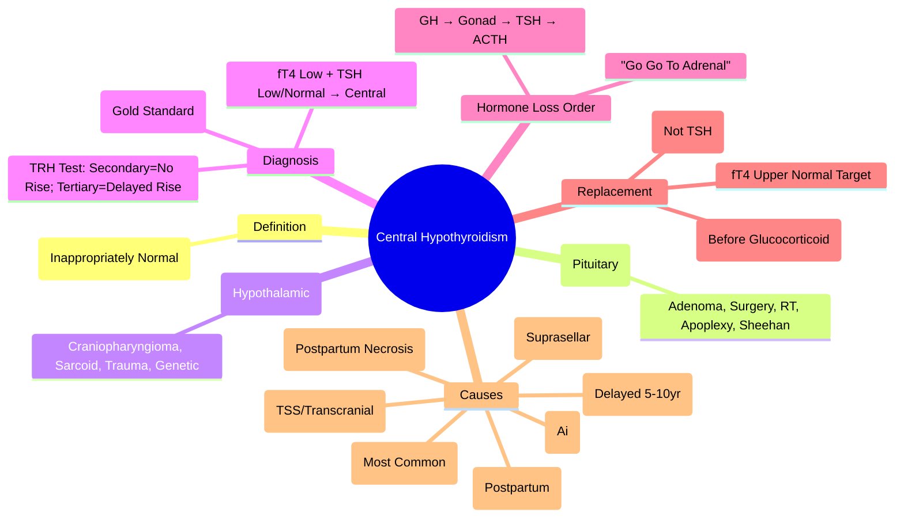

# Central Hypothyroidism (Secondary / Tertiary)

> [!info]
> **Central Hypothyroidism = Thyroid Hormone Deficiency due to Pituitary (Secondary) or Hypothalamic (Tertiary) Failure.** **TSH is Low or Inappropriately Normal** despite Low fT4. **Most Common Cause: Pituitary Adenoma / Surgery / Radiotherapy.**

---

## 1. Learning Objectives
By the end of this note you should be able to:
- [ ] Define central hypothyroidism and distinguish Secondary vs Tertiary
- [ ] Recognise the diagnostic hallmark: **Low fT4 + Inappropriately Low/Normal TSH**
- [ ] List aetiologies (pituitary, hypothalamic, iatrogenic)
- [ ] Apply diagnostic algorithm (TSH + fT4 → MRI pituitary)
- [ ] Prescribe levothyroxine replacement (initiate BEFORE glucocorticoid)

---

## 2. Definition & Classification

| Type | Level of Defect | TSH Pattern | fT4 | Key Features |
|------|-----------------|-------------|-----|--------------|
| **Secondary (Pituitary)** | Pituitary (TSH deficiency) | **Low / Inappropriately Normal** | Low | Other pituitary deficits common |
| **Tertiary (Hypothalamic)** | Hypothalamus (TRH deficiency) | **Low / Inappropriately Normal** | Low | Often from Suprasellar Lesions / Radiation |
| **Primary (for Contrast)** | Thyroid | **High** | Low | Most Common |

**Diagnostic Hallmark**: **Low fT4 + TSH NOT Elevated** (TSH Low / Normal / Inappropriately Normal)

---

## 2. Aetiology

| Category | Causes |
|----------|--------|
| **Pituitary Adenoma** | Macroadenoma (Compression), Surgery (TSS), Radiotherapy |
| **Suprasellar Tumours** | Craniopharyngioma, Meningioma, Glioma |
| **Infiltrative/Inflammatory** | Sarcoidosis, LCH, Haemochromatosis, TB, Lymphoma, Metastases |
| **Vascular** | Pituitary Apoplexy, Sheehan Syndrome, Carotid Aneurysm |
| **Inflammatory** | Lymphocytic Hypophysitis (Postpartum), Autoimmune (APS) |
| **Iatrogenic** | Surgery (TSS), Radiotherapy (Delayed 5-10yr), Checkpoint Inhibitors |
| **Genetic** | PROP1, POU1F1, LHX3, HESX1, SOX3, OTX2 |
| **Trauma** | Basal Skull Fracture, Diffuse Axonal Injury |

---

## 3. Frequency of Hormone Loss (Order of Vulnerability)

| Order | Axis | Hormones | Mechanism |
|-------|------|----------|-----------|
| **1st (Most Vulnerable)** | **GH** | GH / IGF-1 | Somatotrophs most sensitive to compression/ischaemia |
| **2nd** | **Gonadotrophs** | LH / FSH | Gonadotrophs sensitive to compression |
| **3rd** | **TSH** | TSH / fT4 | Thyrotrophs moderately resistant |
| **4th (Least)** | **ACTH** | ACTH / Cortisol | Corticotrophs most resistant |

**Mnemonic**: **G**o **G**o **T**o **A**drenal (GH → Gonad → TSH → ACTH)

---

## 3. Clinical Presentation

### Central Hypothyroidism Features
| Feature | Details |
|---------|---------|
| **General** | Fatigue, Weight Gain, Cold Intolerance, Constipation, Dry Skin |
| **Cardiac** | Bradycardia, Hyperlipidaemia, Pericardial Effusion |
| **Neuromuscular** | Proximal Myopathy, Cramps, Carpal Tunnel |
| **Reproductive** | Amenorrhoea, Infertility, Low Libido |
| **Neuropsychiatric** | Depression, Cognitive Slowing, Memory Impairment |
| **Absence of** | **Goitre** (Thyroid Atrophic), **Hyperpigmentation** |

### Clues to Aetiology
| Clue | Suggests |
|------|----------|
| **Bitemporal Hemianopia** | Pituitary Macroadenoma / Craniopharyngioma |
| **Headache + Visual Loss** | Suprasellar Mass |
| **DI (Polyuria/Polydipsia)** | Hypothalamic/Stalk Involvement |
| **Hyperprolactinaemia** | Stalk Effect (Disconnection) or Prolactinoma |
| **Cranial Nerve Palsies** | Cavernous Sinus Invasion |
| **Postpartum Onset** | Sheehan Syndrome / Lymphocytic Hypophysitis |

---

## 4. Diagnosis — Diagnostic Algorithm

```
Clinical Suspicion (Hypothyroid Symptoms + No Goitre / Pituitary Signs)
         │
         ▼
**TSH + fT4** (Simultaneous)
         │
         ├── **fT4 LOW + TSH HIGH** → PRIMARY HYPOTHYROIDISM (Hashimoto/Post-Surgical)
         │
         ├── **fT4 LOW + TSH LOW / NORMAL (INAPPROPRIATELY NORMAL)**
         │       │
         │       ├── **TSH LOW** → SECONDARY (PITUITARY) / TERTIARY (HYPOTHALAMIC)
         │       │
         │       └── **TSH NORMAL (INAPPROPRIATELY NORMAL)** → SECONDARY / TERTIARY
         │
         └── fT4 NORMAL → NOT HYPOTHYROID
```

### Confirmatory Tests
| Test | Purpose |
|------|---------|
| **fT4 + TSH (Paired)** | **Gold Standard**: Low fT4 + Inappropriately Low/Normal TSH = Central |
| **TRH Stimulation Test** | TRH 200µg IV → TSH at 0, 20, 40, 60, 90, 120min <br> **Central Hypo**: Blunted/Delayed TSH Rise |
| **MRI Pituitary (3mm, Gadolinium)** | **Gold Standard Imaging**: Pituitary Stalk, Adenoma, Infiltration, Empty Sella |
| **Full Pituitary Panel** | GH/IGF-1, LH/FSH, Prolactin, ACTH/Cortisol, TSH/fT4, Electrolytes |

---

## 4. Secondary vs Tertiary Differentiation

| Feature | Secondary (Pituitary) | Tertiary (Hypothalamic) |
|---------|----------------------|-------------------------|
| **TSH Response to TRH** | **Absent / Blunted** | **Delayed / Exaggerated** |
| **TRH Test** | TSH **No Rise** | **Delayed/Prolonged Rise** |
| **Common Causes** | Pituitary Adenoma, Surgery, RT, Apoplexy | Craniopharyngioma, Hypothalamic Glioma, Sarcoid, Trauma |
| **Associated Deficits** | Panhypopituitarism Pattern | DI + Hypogonadism + Thermoregulation Issues |

---

## 4. Iatrogenic Central Hypothyroidism

### Post-Radiotherapy
| Timeline | Deficiency |
|----------|------------|
| **6-12 months** | GH Deficiency (First) |
| **2-5 years** | Gonadotroph Deficiency |
| **5-10 years** | TSH Deficiency |
| **>10 years** | ACTH Deficiency (Rare) |

**Surveillance**: Annual Pituitary Hormones for **10+ Years** Post-RT

### Post-Surgical (TSS)
| Timepoint | Incidence |
|-----------|-----------|
| **Immediate** | Transient DI (10-20%); New Hypopituitarism 5-10% |
| **3-6 months** | GH > Gonadotrophs → TSH → ACTH |

### Checkpoint Inhibitor Hypophysitis
| Feature | Details |
|---------|---------|
| **Anti-PD1/PD-L1/CTLA-4** | Grades 1-4; **ACTH Deficiency Most Common** |
| **Management** | High-Dose Steroids (Pred 1-2mg/kg) + Hormone Replacement |

---

## 5. Management

### Levothyroxine Replacement
| Principle | Details |
|-----------|---------|
| **Initiate BEFORE Glucocorticoid** | **Critical**: Thyroxine Increases Cortisol Clearance → Can Precipitate Adrenal Crisis |
| **Starting Dose** | **1.6 µg/kg/day** (Young) → **25-50µg** (Elderly/Cardiac) |
| **Target** | **fT4 Upper Half of Normal** (TSH Unreliable for Monitoring) |
| **Monitoring** | **fT4 q4-6wk** until Stable; Then q6-12mo; **TSH Unreliable** |

### Replacement Priority Order
| Priority | Hormone | Rationale |
|----------|---------|-----------|
| **1st** | **Levothyroxine** (Thyroxine) | Prevents Adrenal Crisis When Glucocorticoid Started |
| **2nd** | **Glucocorticoid** (Hydrocortisone) | Hydrocortisone 15-20mg AM + 5-10mg PM |
| **3rd** | **Sex Steroids** | Testosterone / Oestradiol + Progestogen |
| **4th** | **GH** | If Symptomatic GHD (ITT Peak <3 µg/L) |

---

## 5. Monitoring

| Parameter | Frequency |
|-----------|-----------|
| **fT4** | q4-6wk (Titration) → q6-12mo (Stable) |
| **TSH** | **Unreliable** (Do Not Use for Dosing) |
| **Other Axes** | q6mo (GH/IGF-1, LH/FSH, ACTH/Cortisol) |
| **Imaging** | MRI Pituitary (Baseline, 6mo, 1yr, then Yearly ×5) |

---

## 6. Exam Pearls (FCPS/MRCP)

| Topic | Key Point |
|-------|-----------|
| **Central Hypothyroidism Hallmark** | **Low fT4 + TSH Low/Normal** (Inappropriately Normal) |
| **Primary vs Central** | Primary: TSH ↑↑ + fT4 ↓; Central: TSH Low/Normal + fT4 ↓ |
| **Secondary vs Tertiary** | Secondary = Pituitary; Tertiary = Hypothalamic |
| **TRH Test** | Secondary: No TSH Rise; Tertiary: Delayed/Exaggerated Rise |
| **Hormone Loss Order** | **GH → Gonad → TSH → ACTH** (Go Go To Adrenal) |
| **Most Common Cause** | **Pituitary Adenoma / Surgery / Radiotherapy** |
| **Sheehan Syndrome** | Postpartum Pituitary Necrosis → Empty Sella; Agalactorrhoea + Amenorrhoea |
| **Levothyroxine Timing** | **Start BEFORE Glucocorticoid** (Prevent Adrenal Crisis) |
| **Monitoring** | **fT4 (Not TSH)**; Target fT4 Upper Normal |
| **MRI Indication** | All Central Hypothyroidism (Exclude Mass) |
| **TSH Unreliable** | Do Not Use TSH for Dose Adjustment in Central Hypo |
| **CSF Leak in ESS** | Rare; Defective Diaphragma Sellae |

---

## 8. Mind Map



---

## 9. Exam Pearls (FCPS/MRCP)

| Topic | Key Point |
|-------|-----------|
| **Diagnostic Hallmark** | **Low fT4 + TSH Low/Normal** (Inappropriately Normal) |
| **Primary vs Central** | Primary: TSH↑; Central: TSH Low/Normal |
| **TSH in Central Hypo** | **Low or Inappropriately Normal** (NOT Elevated) |
| **Hormone Loss Order** | GH → Gonad → TSH → ACTH |
| **TRH Test** | Secondary: No Rise; Tertiary: Delayed Rise |
| **Levothyroxine Priority** | **Start BEFORE Glucocorticoid** (Prevent Adrenal Crisis) |
| **Monitoring** | **fT4 (Not TSH)** — Target fT4 Upper Normal |
| **Commonest Cause** | Pituitary Adenoma / Surgery / RT |
| **Sheehan Syndrome** | Postpartum Necrosis → Agalactorrhoea + Amenorrhoea |
| **TSH Unreliable** | Do Not Use TSH for Dosing in Central Hypo |
| **MRI Indication** | All Central Hypothyroidism (Exclude Mass) |

---

## 9. Local Navigation (for Dashboard UI)

> **Parent**: [[../Thyroid Disorders|Thyroid Disorders]]  
> **Hierarchy**: [[../../Davidson Chapter 20 - Endocrinology Hierarchy|Endocrinology Hierarchy]]  
> **Template**: [[../../../Templates/Endocrinology Topic Template|Endocrinology Topic Template]]  
> **See also**: [[Hypothyroidism Overview]], [[Hypopituitarism]], [[Pituitary Adenomas: Non-Functioning]], [[Sheehan Syndrome]], [[TSH/Thyroid Axis]]
## MCQs (10)
1. **Central hypothyroidism =**
   A. Secondary (pituitary) or tertiary (hypothalamic) failure → low fT4 + inappropriately normal/low TSH
   B. Primary thyroid failure
   C. Thyroid hormone resistance
   D. TSH-secreting adenoma
   E. Factitious hypothyroidism

2. **Central hypothyroidism TSH pattern:**
   A. Low or inappropriately normal (NOT elevated) + low fT4
   B. Elevated
   C. Suppressed
   D. Normal with high fT4
   E. Pulsatile

3. **Commonest cause central hypo:**
   A. Pituitary macroadenoma / surgery / radiotherapy
   B. Sheehan syndrome
   C. Craniopharyngioma
   D. Lymphocytic hypophysitis
   E. Empty sella

4. **TRH test in central hypothyroidism:**
   A. Blunted/delayed TSH response
   B. Exaggerated TSH response
   C. Normal TSH response
   D. Absent TSH
   E. Prolonged peak

5. **Levothyroxine replacement in central hypo:**
   A. Target fT4 mid-normal; check cortisol first (co-existing ACTH deficiency)
   B. Same as primary
   C. Higher dose
   D. Lower dose
   E. T3 only

6. **Central vs primary hypo key difference:**
   A. Primary: TSH ↑↑; Central: TSH low/normal (inappropriately)
   B. Primary: TSH low; Central: TSH high
   C. Both TSH high
   D. Both TSH low
   E. No difference

7. **Sheehan syndrome:**
   A. Postpartum pituitary necrosis → panhypopituitarism; empty sella on MRI
   B. Postpartum thyroiditis
   C. Postpartum psychosis
   D. Postpartum haemorrhage only
   E. Postpartum cardiomyopathy

8. **Lymphocytic hypophysitis:**
   A. Autoimmune pituitary inflammation; peripartum; mass lesion on MRI
   B. Bacterial pituitary infection
   C. Pituitary adenoma
   D. Craniopharyngioma
   E. Empty sella

9. **Craniopharyngioma:**
   A. Suprasellar tumour; childhood/adolescent; visual field defects
   B. Pituitary microadenoma
   C. TSH-secreting adenoma
   D. Empty sella
   E. Rathke's cleft cyst

10. **Empty sella syndrome:**
   A. CSF herniation into sella; may cause central hypo; MRI: CSF in sella
   B. Pituitary adenoma
   C. Craniopharyngioma
   D. Normal variant only
   E. Post-RAI change

## SBA Questions (10)
1. **Post-pituitary surgery: fatigue, TSH 1.5, fT4 4. Diagnosis?**
   A. Central hypothyroidism
   B. Primary hypothyroidism
   C. Subclinical hypothyroidism
   D. Euthyroid sick syndrome
   E. Thyroid hormone resistance

2. **Same patient: check before starting levothyroxine?**
   A. Cortisol (co-existing ACTH deficiency → adrenal crisis risk)
   B. Prolactin
   C. GH
   D. LH/FSH
   E. TSH only

3. **30yo woman: postpartum inability to breastfeed, fatigue, TSH 0.8, fT4 5, empty sella on MRI. Diagnosis?**
   A. Sheehan syndrome
   B. Lymphocytic hypophysitis
   C. Postpartum thyroiditis
   D. Primary hypothyroidism
   E. Euthyroid sick

4. **Central hypo on levothyroxine: TSH still low. Is this adequate?**
   A. Yes (TSH not used for monitoring central hypo); target fT4 mid-normal
   B. No → increase dose
   C. No → decrease dose
   D. Switch to T3
   E. Stop levothyroxine

5. **Craniopharyngioma child: visual field defects, polydipsia, TSH low, fT4 low. Next?**
   A. MRI brain → neurosurgery referral
   B. Levothyroxine only
   C. RAI
   D. Carbimazole
   E. Observation

## Flashcards
- **Q: Central hypo definition**
  **A: Low fT4 + inappropriately normal/low TSH (NOT elevated)**

- **Q: TSH in central hypo**
  **A: Low or inappropriately normal (NOT elevated)**

- **Q: Commonest cause**
  **A: Pituitary macroadenoma / surgery / radiotherapy**

- **Q: Sheehan syndrome**
  **A: Postpartum pituitary necrosis → panhypopituitarism; empty sella**

- **Q: Lymphocytic hypophysitis**
  **A: Autoimmune pituitary; peripartum; mass lesion on MRI**

- **Q: Craniopharyngioma**
  **A: Suprasellar tumour; childhood/adolescent; visual field defects**

- **Q: Empty sella**
  **A: CSF in sella; may cause central hypo; mostly asymptomatic**

- **Q: TRH test**
  **A: Central hypo: blunted/delayed TSH response**

- **Q: Replacement**
  **A: Target fT4 mid-normal; CHECK CORTISOL FIRST (ACTH deficiency)**

- **Q: Monitoring**
  **A: fT4 (not TSH); TSH remains low/suppressed on replacement**

## Answer Key with Explanations
### MCQs
1. **Secondary (pituitary) or tertiary (hypothalamic) failure → low fT4 + inappropriately normal/low TSH** — Central hypothyroidism =

2. **Low or inappropriately normal (NOT elevated) + low fT4** — Central hypothyroidism TSH pattern:

3. **Pituitary macroadenoma / surgery / radiotherapy** — Commonest cause central hypo:

4. **Blunted/delayed TSH response** — TRH test in central hypothyroidism:

5. **Target fT4 mid-normal; check cortisol first (co-existing ACTH deficiency)** — Levothyroxine replacement in central hypo:

6. **Primary: TSH ↑↑; Central: TSH low/normal (inappropriately)** — Central vs primary hypo key difference:

7. **Postpartum pituitary necrosis → panhypopituitarism; empty sella on MRI** — Sheehan syndrome:

8. **Autoimmune pituitary inflammation; peripartum; mass lesion on MRI** — Lymphocytic hypophysitis:

9. **Suprasellar tumour; childhood/adolescent; visual field defects** — Craniopharyngioma:

10. **CSF herniation into sella; may cause central hypo; MRI: CSF in sella** — Empty sella syndrome:


### SBAs
1. **Central hypothyroidism** — Post-pituitary surgery: fatigue, TSH 1.5, fT4 4. Diagnosis?

2. **Cortisol (co-existing ACTH deficiency → adrenal crisis risk)** — Same patient: check before starting levothyroxine?

3. **Sheehan syndrome** — 30yo woman: postpartum inability to breastfeed, fatigue, TSH 0.8, fT4 5, empty sella on MRI. Diagnosis?

4. **Yes (TSH not used for monitoring central hypo); target fT4 mid-normal** — Central hypo on levothyroxine: TSH still low. Is this adequate?

5. **MRI brain → neurosurgery referral** — Craniopharyngioma child: visual field defects, polydipsia, TSH low, fT4 low. Next?

