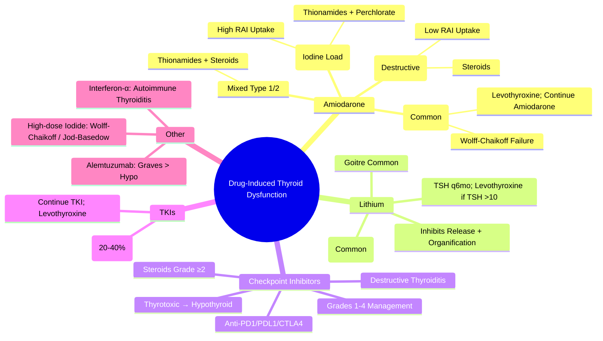

# Drug-Induced Thyroid Dysfunction

> [!info]
> **Drug-induced thyroid dysfunction is common.** Amiodarone (Type 1 vs Type 2), Lithium, and Immune Checkpoint Inhibitors are the major culprits. Differentiating iodine-induced (Type 1) from destructive (Type 2) amiodarone thyrotoxicosis is a classic viva topic.

---

## 1. Learning Objectives
By the end of this note you should be able to:
- [ ] Classify drugs causing thyroid dysfunction by mechanism
- [ ] Differentiate amiodarone Type 1 vs Type 2 thyrotoxicosis
- [ ] Manage lithium-associated thyroid dysfunction
- [ ] Recognise and manage checkpoint inhibitor thyroiditis
- [ ] Apply appropriate treatment algorithms for each drug

---

## 2. Classification by Mechanism

| Mechanism | Drugs | Thyroid Effect |
|-----------|-------|----------------|
| **Excess Iodine** | Amiodarone, Iodinated Contrast, Iodine Supplements, Kelp | **Type 1 AIT (Jod-Basedow)** / Hypothyroidism (Wolff-Chaikoff) |
| **Direct Cytotoxicity** | Amiodarone (Type 2), Tyrosine Kinase Inhibitors (Sunitinib, Sorafenib) | **Destructive Thyroiditis** (Tyrotoxic → Hypothyroid) |
| **Autoimmune Induction** | **Checkpoint Inhibitors** (Anti-PD1/PD-L1, CTLA-4), Interferon-α, Alemtuzumab | **Autoimmune Thyroiditis** (Destructive → Thyrotoxic → Hypothyroid) |
| **Inhibition of Hormone Synthesis/Release** | Lithium, Iodide (High Dose), Sulfonamides, Para-aminosalicylic Acid | **Hypothyroidism ± Goitre** |
| **Increased Metabolism/Clearance** | Phenytoin, Carbamazepine, Rifampicin, Phenobarbital | ↑ T4 Clearance → ↓ T4, ↑ TSH (Compensated) |
| **TSH Receptor Stimulation** | hCG (Molar Pregnancy, Choriocarcinoma), TSH-secreting Adenoma | Thyrotoxicosis |

---

## 2. Amiodarone-Induced Thyroid Dysfunction (AIT)

### Background
| Feature | Details |
|---------|---------|
| **Drug** | Amiodarone (Class III Antiarrhythmic) |
| **Iodine Content** | **37% Iodine by Weight**; 200mg Daily = **~75mg Iodine/Day** (vs RDA 150µg) = **500x RDA** |
| **Half-life** | **~50-100 Days** (Long) |
| **Incidence of AIT** | **5-15%** of Patients on Amiodarone |
| **Time to Onset** | Variable (Months to Years) |

---

## 2. Amiodarone-Induced Thyrotoxicosis (AIT) — Type 1 vs Type 2

| Feature | **Type 1 (Iodine Load / Jod-Basedow)** | **Type 2 (Destructive Thyroiditis)** |
|---------|----------------------------------------|--------------------------------------|
| **Mechanism** | **Excess Iodine Load** → Substrate for Hormone Synthesis in Autonomously Functioning Nodules / Latent Graves | **Direct Cytotoxicity** → Destructive Thyroiditis → Hormone Leak |
| **Underlying Thyroid** | **Abnormal** (Nodular Goitre, Latent Graves, Iodine Deficiency Area) | **Normal Thyroid** (No Pre-existing Disease) |
| **Pathophysiology** | Excess Iodine Substrate → ↑ Hormone Synthesis in Autonomous Tissue | Direct Cytotoxicity → Follicular Destruction → Hormone Leak |
| **Thyroid Histology** | Normal / Nodular | **Lymphocytic Infiltration**, Follicular Destruction, Giant Cells |
| **RAI Uptake** | **Normal / High** (Iodine-Rich Gland Takes Up RAI) | **Very Low / Absent** (Destructed Follicles) |
| **Thyroid US / Doppler** | **Hypervascular** (Colour Doppler) | **Hypoechoic, Heterogeneous**, ↓ Vascularity |
| **Colour Flow Doppler** | **Increased Vascularity** ("Thyroid Inferno") | **Reduced / Absent Vascularity** |
| **s Thyroglobulin** | Normal / ↑ | **Markedly Elevated** (Leak) |
| **IL-6, CRP** | Normal | **Elevated** (Inflammatory) |
| **Response to Thionamides** | **Good** (CBZ/PTU Effective) | **Poor** (Thionamides Ineffective) |
| **Response to Steroids** | Poor | **Excellent** (Pred 30-40mg/day) |
| **Duration** | Prolonged (Months-Years) | Self-Limiting (3-6 Months) |

---

## 3. AIT — Diagnostic Algorithm

```
Patient on Amiodarone → Thyrotoxicosis (TSH Suppressed, fT4/fT3 ↑)
         │
         ▼
EXCLUDE OTHER CAUSES (Graves, Toxic Nodule, Thyroiditis)
         │
         ▼
DIFFERENTIATE TYPE 1 vs TYPE 2
         │
         ├── RAI UPTAKE (or 99mTc Pertechnetate Scan)
         │       ├── HIGH / NORMAL → **TYPE 1**
         │       └── LOW / ABSENT → **TYPE 2**
         │
         ├── THYROID US + COLOUR DOPPLER
         │       ├── HYPERVASCULAR ("Thyroid Inferno") → TYPE 1
         │       └── HYPOECHOIC, HETEROGENEOUS, AVASCULAR → TYPE 2
         │
         ├── SERUM THYROGLOBULIN
         │       ├── NORMAL / MILD ↑ → TYPE 1
         │       └── MARKEDLY ↑ → TYPE 2
         │
         ├── CRP / ESR / IL-6
         │       ├── NORMAL → TYPE 1
         │       └── ELEVATED → TYPE 2
         │
         └── RESPONSE TO THERAPY (Diagnostic Trial)
                 ├── THIONAMIDES (CBZ/PTU) WORK → TYPE 1
                 └── STEROIDS WORK → TYPE 2
```

---

## 3. Management of AIT

### Type 1 (Iodine Load / Jod-Basedow)
| Treatment | Details |
|-----------|---------|
| **High-Dose Thionamides** | **Carbimazole 40-60mg/day** or **PTU 300-600mg/day** (Higher Doses Needed) |
| **Potassium Perchlorate** | **200-500mg QDS** (Blocks NIS → Iodide Uptake); **Max 4-6 Weeks** (Aplastic Anaemia Risk) |
| **Potassium Iodide** | **Not Recommended** (Worsens Iodine Load) |
| **Beta-Blockers** | Propranolol 40-80mg QDS (Symptomatic Control) |
| **Definitive** | **RAI** (After Thionamide Control) / **Surgery** (If Refractory) |

### Type 2 (Destructive Thyroiditis)
| Treatment | Details |
|-----------|---------|
| **Corticosteroids** | **Prednisolone 30-40mg/day** (0.5-1mg/kg) → Taper over 4-8 Weeks |
| **Beta-Blockers** | Propranolol 40-80mg QDS (Symptomatic) |
| **Thionamides** | **Ineffective** (No Ongoing Synthesis) |
| **NSAIDs** | For Neck Pain (If Any) |
| **Duration** | **3-6 Months** (Self-Limiting); Taper Steroids Over 4-8 Weeks |

### Mixed Type 1/2
| Approach | Details |
|--------|---------|
| **Combined Therapy** | **Thionamide + Steroid** (CBZ/PTU + Pred 20-30mg/day) |
| **Monitor** | fT4, TSH, CRP, Thyroglobulin q2-4 Weeks |

---

## 3. Amiodarone-Induced Hypothyroidism (AIH)

| Feature | Details |
|---------|---------|
| **Incidence** | **20-30%** (More Common than AIT in Iodine-Sufficient Areas) |
| **Mechanism** | **Wolff-Chaikoff Effect** (Excess Iodide → Transient Inhibition of Organification) → Failure to Escape → Hypothyroidism |
| **Risk Factors** | Pre-existing Thyroid Autoimmunity (TPOAb+), Iodine Deficiency, Female Sex |
| **Onset** | Months to Years After Starting Amiodarone |
| **Diagnosis** | TSH ↑↑, fT4 ↓, TPOAb Often Positive |
| **Management** | **Levothyroxine** (1.6 µg/kg/day); **Amiodarone Can Usually Continue**; Monitor TSH q3-6mo |

---

## 3. Lithium-Induced Thyroid Dysfunction

### Hypothyroidism (Common)
| Feature | Details |
|---------|---------|
| **Incidence** | **10-20%** on Long-Term Lithium |
| **Mechanism** | **Inhibits Thyroid Hormone Release** (Inhibits cAMP) + **Goitrogen** (Inhibits Iodide Organification) |
| **Risk Factors** | Female, Pre-existing TPOAb+, High Lithium Levels, Long Duration |
| **Presentation** | Subclinical → Overt Hypothyroidism; Goitre Common |
| **Monitoring** | **TSH q3-6mo**; TPOAb at Baseline |
| **Treatment** | **Levothyroxine** if TSH >10 or Symptomatic; **Lithium Can Continue** |
| **Stopping Lithium** | Often Reversible (TSH Normalises in 1-2mo) |

### Hyperthyroidism (Rare)
| Mechanism | Thyrotoxicosis Due to Lithium-Induced Graves (Rare) / Hashitoxicosis |
| Management | Thionamides if Graves; Monitor |

---

## 3. Checkpoint Inhibitor Thyroiditis

### Immune Checkpoint Inhibitors (ICIs)
| Drug Class | Examples | Thyroiditis Incidence |
|------------|----------|----------------------|
| **Anti-PD-1** | Pembrolizumab, Nivolumab | 5-10% |
| **Anti-PD-L1** | Atezolizumab, Durvalumab, Avelumab | 3-8% |
| **Anti-CTLA-4** | Ipilimumab | 2-5% |
| **Combination (Ipi + Nivo)** | Ipilimumab + Nivolumab | **10-20%** |

### Clinical Presentation
| Feature | Details |
|---------|---------|
| **Onset** | **Median 6-12 Weeks** (Range 2-24 Weeks) |
| **Pattern** | **Destructive Thyroiditis** → Thyrotoxic Phase → Hypothyroid Phase |
| **Biochemistry** | **TSH Suppressed → ↑↑**, fT4/fT3 ↑ then ↓, **TPOAb Often Positive** |
| **TRAb** | Usually Negative |
| **RAI Uptake** | **Low** (Destructive) |

### Grading & Management (ASCO/CTCAE)
| Grade | Criteria | Management |
|-------|----------|------------|
| **Grade 1** | Asymptomatic; TSH <0.1; fT4 Normal/↑ | Continue ICI; Monitor TSH/fT4 q2-4wk |
| **Grade 2** | Symptomatic Thyrotoxicosis; TSH <0.1; fT4 ↑ | **Hold ICI**; β-Blocker; Consider Pred 0.5-1mg/kg if Symptomatic |
| **Grade 3** | Severe Symptoms; TSH <0.01; fT4 ↑↑; ↓ Weight/Decompensated | **Hold ICI**; **Pred 1-2mg/kg/day** + β-Blocker; Resume ICI if Grade ≤1 |
| **Grade 4** | Life-Threatening (Thyroid Storm) | **Discontinue ICI**; High-Dose Steroids; ICU Care |

### Hypothyroid Phase
| Timing | 4-12 Weeks Post-Thyrotoxic Phase |
|--------|----------------------------------|
| **Incidence** | **~30-50%** Develop Hypothyroidism |
| **Management** | **Levothyroxine** (Full Replacement Dose) if TSH >10 or Symptomatic |
| **ICI Rechallenge** | If Grade 1-2: Resume with Monitoring; Grade 3-4: Permanent Discontinuation |

---

## 4. Other Notable Drugs

| Drug | Thyroid Effect | Mechanism | Management |
|------|----------------|-----------|------------|
| **Tyrosine Kinase Inhibitors** (Sunitinib, Sorafenib, Pazopanib, Lenvatinib) | **Hypothyroidism** (20-40%) | Vascular Injury → Thyroid Ischaemia | Levothyroxine; Continue TKI |
| **Interferon-α** | Autoimmune Thyroiditis (TPOAb+) | Autoimmune Induction | Monitor; Levothyroxine if Hypothyroid |
| **Alemtuzumab** | Autoimmune Thyroid Disease (Graves > Hypothyroid) | Immune Reconstitution | Monitor; Treat as Graves/Hypo |
| **Tyrosine Kinase Inhibitors** (Imatinib) | Rare Hypothyroidism | Unknown | Monitor |
| **Interleukin-2** | thyroiditis | Immune Activation | Steroids if Severe |
| **High-Dose Iodide / Contrast** | Wolff-Chaikoff → Transient Hypo; Jod-Basedow (If Autonomous) | Iodine Load | Monitor; Thionamides if Thyrotoxic |

---

## 5. Monitoring Recommendations

| Drug | Baseline | Monitoring Frequency | Key Tests |
|------|----------|---------------------|-----------|
| **Amiodarone** | TSH, fT4, TPOAb, TgAb | **q3-6mo** (q3mo if High Risk) | TSH, fT4, fT3, TPOAb |
| **Lithium** | TSH, TPOAb, Calcium | **q3-6mo** | TSH, TPOAb, Lithium Level, Calcium |
| **Checkpoint Inhibitors** | TSH, fT4, TPOAb | **q3-6wk during Tx**; q3mo after | TSH, fT4, fT3, TPOAb, TRAb |
| **TKIs** | TSH, fT4 | **q4-8wk** (First 6mo), then q3mo | TSH, fT4 |
| **Interferon-α** | TSH, TPOAb | q3mo | TSH, fT4, TPOAb |

---

## 5. Exam Pearls (FCPS/MRCP)

| Topic | Key Point |
|-------|-----------|
| **AIT Type 1 vs 2** | Type 1 = Iodine Load → **High RAI Uptake**; Type 2 = Destructive → **Low RAI Uptake** |
| **AIT Type 1 Treatment** | **High-Dose Thionamides (CBZ/PTU) + Perchlorate** |
| **AIT Type 2 Treatment** | **Steroids (Pred 30-40mg/day)**; Thionamides Ineffective |
| **Mixed AIT** | Both Thionamides + Steroids |
| **Amiodarone Hypothyroidism** | More Common than AIT in Iodine-Sufficient Areas; Levothyroxine; Amiodarone Can Continue |
| **Lithium** | Inhibits Hormone Release + Organification → Hypothyroidism + Goitre; TSH q6mo |
| **Checkpoint Inhibitors** | **5-20% Thyroiditis**; Destructive Pattern (Thyrotoxic → Hypo); Steroids if Grade ≥2 |
| **ICI Thyroiditis Pattern** | Thyrotoxic (Low RAI) → Hypothyroid (30-50%); TPOAb Often +ve; TRAb Usually -ve |
| **ICI Grading** | Grade 1: Monitor; Grade 2: Hold ICI + β-blocker ± Steroids; Grade 3: Hold ICI + High-Dose Steroids; Grade 4: Discontinue ICI |
| **TKI Hypothyroidism** | 20-40% Incidence; Levothyroxine; Continue TKI |
| **Lithium Hypothyroidism** | 10-20% Incidence; Goitre Common; Stop Lithium if Possible; Levothyroxine if Needed |
| **AIT Type 1 vs 2 Differentiation** | **RAI Uptake** (High vs Low); **Doppler** (Hypervascular vs Avascular); **Steroids** (Type 2 Responds) |

---

## 8. Confusions & Mnemonics

| Confusion | Clarification |
|-----------|---------------|
| **AIT Type 1 vs 2** | **Type 1 = Iodine Load (High RAI); Type 2 = Destructive (Low RAI)** — Think "1 = High (Iodine), 2 = Low (Destruction)" |
| **AIT Type 1 vs Graves** | Both High RAI Uptake; Graves = TRAb+, Diffuse US; AIT Type 1 = TRAb-, Nodular/Goitre US |
| **AIT Type 2 vs Silent Thyroiditis** | Both Destructive (Low RAI); AIT = Amiodarone Context; Silent = Spontaneous, TPOAb+ |
| **Amiodarone Hypothyroidism vs AIT** | Hypothyroidism More Common in Iodine-Sufficient Areas; AIT More Common in Iodine-Deficient |
| **Checkpoint Inhibitor vs Graves** | ICI: TRAb Usually Negative, TPOAb Often +ve; Graves = TRAb Positive, Diffuse Uptake |
| **Lithium vs Iodine Hypothyroidism** | Lithium = Inhibits Release + Organification; Iodine = Wolff-Chaikoff (Transient) |

**Mnemonic: AMIODARONE THYROID**
- **A**MIODARONE = **A**MIODARONE
- **M**IXED TYPE 1/2 → **C**OMBINED Rx (Thionamide + Steroid)
- **I**ODINE LOAD = **T**YPE 1 (High RAI, Jod-Basedow)
- **O**VERLOAD IODINE → **T**YPE 1 (High RAI Uptake)
- **D**Estructive = **T**YPE 2 (Low RAI, Steroids)
- **A**MIODARONE **H**YPOTHYROIDISM = Common (Wolff-Chaikoff)
- **R**ESISTANCE TO THIONAMIDES = Type 2
- **A**MIODARONE **H**YPOTHYROIDISM > AIT IN IODINE-SUFFICIENT

---

## 9. Mind Map



---

## 10. Exam Pearls (FCPS/MRCP)

| Topic | Key Point |
|-------|-----------|
| **Amiodarone AIT Type 1 vs 2** | **RAI Uptake**: Type 1 = High (Iodine Load); Type 2 = Low (Destructive) |
| **AIT Type 1 Rx** | **High-Dose Thionamides + Potassium Perchlorate** (Blocks Iodide Uptake) |
| **AIT Type 2 Rx** | **Steroids (Pred 30-40mg/day)**; Thionamides Ineffective |
| **Mixed AIT** | Thionamides + Steroids; Monitor fT4/CRP |
| **Amiodarone Hypothyroidism** | **More Common than AIT** (Iodine-Sufficient Areas); Continue Amiodarone + Levothyroxine |
| **Lithium Hypothyroidism** | 10-20% Incidence; Inhibits Release + Organification; Goitre Common; TSH q6mo |
| **Checkpoint Inhibitor Thyroiditis** | **5-20% Incidence**; Destructive Pattern (Thyrotoxic → Hypo); TRAb Usually Negative |
| **ICI Thyroiditis Grading** | Grade 1: Monitor; Grade 2: Hold ICI + β-Blocker ± Steroids; Grade 3: Hold + High-Dose Steroids; Grade 4: Discontinue |
| **ICI Thyroiditis Pattern** | Thyrotoxic (Low RAI) → Hypothyroid (30-50%); TPOAb Often +ve; TRAb Usually Negative |
| **TKI Hypothyroidism** | 20-40% Incidence; Continue TKI + Levothyroxine |
| **AIT Type 1 vs 2** | **RAI Uptake**: Type 1 High (Iodine Load); Type 2 Low (Destructive) |
| **Amiodarone + Perchlorate** | Perchlorate Blocks NIS → Blocks Iodide Uptake; Use in Type 1 AIT |
| **Lithium + Thyroid** | Inhibits Hormone Release + Organification → Hypo + Goitre |
| **AIT Type 1 vs Graves** | Both High RAI Uptake; Graves = TRAb+, Diffuse US; AIT Type 1 = TRAb-, Nodular US |

---

## MCQs (10)
1. **Amiodarone causes thyrotoxicosis via:**
   A. Type 1: iodine load (excess substrate); Type 2: destructive thyroiditis
   B. Only iodine load
   C. Only destructive thyroiditis
   D. Only TSH receptor stimulation
   E. Only autoimmune

2. **Amiodarone type 1 thyrotoxicosis treated with:**
   A. Carbimazole +/- perchlorate
   B. Steroids
   C. RAI
   D. Surgery
   E. PTU only

3. **Amiodarone type 2 thyrotoxicosis treated with:**
   A. Steroids; stop amiodarone
   B. Carbimazole
   C. RAI
   D. Surgery
   E. Perchlorate

4. **Lithium causes:**
   A. Hypothyroidism (inhibits thyroid hormone release)
   B. Hyperthyroidism
   C. Thyroiditis
   D. Thyroid cancer
   E. Goitre only

5. **Tyrosine kinase inhibitors (sunitinib etc) cause:**
   A. Hypothyroidism (thyroiditis/vascular effects)
   B. Hyperthyroidism
   C. Thyroid storm
   D. Medullary cancer
   E. No thyroid effect

6. **Checkpoint inhibitors (anti-PD-1/PD-L1) cause:**
   A. Thyroiditis (painless) → thyrotoxic → hypothyroid
   B. Only hyperthyroidism
   C. Only hypothyroidism
   D. TSHoma
   E. Medullary cancer

7. **Anti-CTLA-4 (ipilimumab) causes:**
   A. Hypophysitis (ACTH/TSH deficiency)
   B. Thyroiditis
   C. Adrenalitis
   D. Diabetes insipidus
   E. Acromegaly

8. **Interferon-alpha causes:**
   A. Thyroiditis (both Graves-like and Hashimoto-like)
   B. Only Graves
   C. Only Hashimoto
   D. Only cancer
   E. No effect

9. **RAI uptake in amiodarone type 2:**
   A. Low (destructive thyroiditis)
   B. Diffuse increased
   C. Focal
   D. Multifocal
   E. Normal

10. **Amiodarose contains:**
   A. ~37% iodine by weight (high iodine load)
   B. No iodine
   C. Low iodine
   D. Bromide
   E. Chloride

## SBA Questions (10)
1. **Patient on amiodarone 2yrs: TSH <0.01, fT4 35, fT3 10, TRAb -, low RAI uptake. Type?**
   A. Type 2 (destructive thyroiditis) → steroids; stop amiodarone
   B. Type 1 → carbimazole
   C. Graves → carbimazole
   D. Subacute thyroiditis → NSAIDs
   E. Toxic nodule → RAI

2. **Same patient but high RAI uptake, TRAb -. Type?**
   A. Type 1 (iodine load) → carbimazole +/- perchlorate
   B. Type 2 → steroids
   C. Graves → carbimazole
   D. Toxic nodule → RAI
   E. Factitious

3. **Patient on lithium 5yrs: TSH 15, fT4 6, goitre. Management?**
   A. Levothyroxine; continue lithium if essential; monitor TSH
   B. Stop lithium
   C. Carbimazole
   D. RAI
   E. Surgery

4. **Patient on pembrolizumab (anti-PD-1): TSH <0.01, fT4 32, painless. Course?**
   A. Thyroiditis: thyrotoxic → hypothyroid; β-blocker; hold ICI if severe
   B. Graves → carbimazole
   C. RAI
   D. Surgery
   E. Permanent hyperthyroidism

5. **Patient on ipilimumab (anti-CTLA-4): fatigue, hypotension, TSH low, fT4 low, cortisol low. Diagnosis?**
   A. Hypophysitis (ACTH/TSH deficiency) → high-dose steroids; hormone replacement
   B. Primary AI
   C. Thyroiditis
   D. Diabetes insipidus
   E. SIADH

## Flashcards
- **Q: Amiodarone iodine**
  **A: ~37% iodine by weight; 200mg = ~75mg iodine/day (vs RDA 150µg)**

- **Q: Amiodarone Type 1**
  **A: Iodine load → exacerbates autonomy; high RAI uptake; carbimazole +/- perchlorate**

- **Q: Amiodarone Type 2**
  **A: Destructive thyroiditis; low RAI uptake; steroids; stop amiodarone**

- **Q: Lithium**
  **A: Inhibits thyroid hormone release → hypothyroidism + goitre; monitor TSH**

- **Q: TKIs (sunitinib)**
  **A: Hypothyroidism (thyroiditis/vascular); monitor TSH**

- **Q: Anti-PD-1/PD-L1**
  **A: Painless thyroiditis → thyrotoxic→hypo; hold ICI if Grade 3-4**

- **Q: Anti-CTLA-4**
  **A: Hypophysitis (ACTH/TSH def); high-dose steroids; hormone replacement**

- **Q: Interferon-alpha**
  **A: Thyroiditis (Graves-like or Hashimoto-like); monitor TSH/TRAb/TPOAb**

- **Q: Amiodarone monitoring**
  **A: TSH/fT4 q6mo; baseline before start**

## Answer Key with Explanations
### MCQs
1. **Type 1: iodine load (excess substrate); Type 2: destructive thyroiditis** — Amiodarone causes thyrotoxicosis via:

2. **Carbimazole +/- perchlorate** — Amiodarone type 1 thyrotoxicosis treated with:

3. **Steroids; stop amiodarone** — Amiodarone type 2 thyrotoxicosis treated with:

4. **Hypothyroidism (inhibits thyroid hormone release)** — Lithium causes:

5. **Hypothyroidism (thyroiditis/vascular effects)** — Tyrosine kinase inhibitors (sunitinib etc) cause:

6. **Thyroiditis (painless) → thyrotoxic → hypothyroid** — Checkpoint inhibitors (anti-PD-1/PD-L1) cause:

7. **Hypophysitis (ACTH/TSH deficiency)** — Anti-CTLA-4 (ipilimumab) causes:

8. **Thyroiditis (both Graves-like and Hashimoto-like)** — Interferon-alpha causes:

9. **Low (destructive thyroiditis)** — RAI uptake in amiodarone type 2:

10. **~37% iodine by weight (high iodine load)** — Amiodarose contains:


### SBAs
1. **Type 2 (destructive thyroiditis) → steroids; stop amiodarone** — Patient on amiodarone 2yrs: TSH <0.01, fT4 35, fT3 10, TRAb -, low RAI uptake. Type?

2. **Type 1 (iodine load) → carbimazole +/- perchlorate** — Same patient but high RAI uptake, TRAb -. Type?

3. **Levothyroxine; continue lithium if essential; monitor TSH** — Patient on lithium 5yrs: TSH 15, fT4 6, goitre. Management?

4. **Thyroiditis: thyrotoxic → hypothyroid; β-blocker; hold ICI if severe** — Patient on pembrolizumab (anti-PD-1): TSH <0.01, fT4 32, painless. Course?

5. **Hypophysitis (ACTH/TSH deficiency) → high-dose steroids; hormone replacement** — Patient on ipilimumab (anti-CTLA-4): fatigue, hypotension, TSH low, fT4 low, cortisol low. Diagnosis?


## 10. Local Navigation (for Dashboard UI)

> **Parent**: [[../Thyroid Disorders|Thyroid Disorders]]  
> **Hierarchy**: [[../../Davidson Chapter 20 - Endocrinology Hierarchy|Endocrinology Hierarchy]]  
> **Template**: [[../../../Templates/Endocrinology Topic Template|Endocrinology Topic Template]]  
> **See also**: [[Thyroiditis (Subacute, Silent, Postpartum)]], [[Amiodarone]], [[Lithium]], [[Checkpoint Inhibitors]], [[Thyroiditis]], [[Graves Disease]]