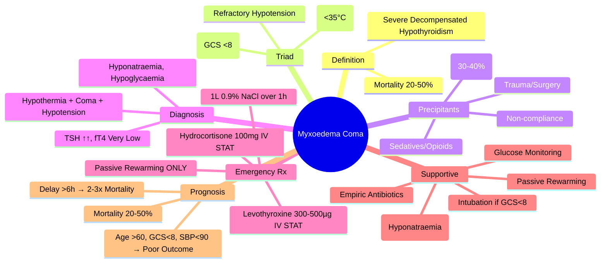

# Myxoedema Coma

> [!info]
> **Myxoedema Coma = Life-threatening decompensated hypothyroidism.** **Mortality 20-50%** despite treatment. Medical emergency requiring ICU admission. Key: Hypothermia + Coma + Hypotension + Hyponatraemia. **Immediate IV Levothyroxine + IV Hydrocortisone**.

---

## 1. Learning Objectives
By the end of this note you should be able to:
- [ ] Recognise clinical features and precipitating factors
- [ ] Execute emergency management protocol (IV Levothyroxine + IV Hydrocortisone)
- [ ] Differentiate from other causes of coma with hypothermia
- [ ] Manage complications (hyponatraemia, hypoglycaemia, respiratory failure)
- [ ] Understand prognosis and long-term management

---

## 1. Definition & Epidemiology

| Feature | Details |
|---------|---------|
| **Definition** | Severe, life-threatening decompensation of hypothyroidism with multiorgan failure |
| **Incidence** | Rare (0.1-0.2/100,000/year) |
| **Mortality** | **20-50%** (Despite optimal treatment) |
| **Demographics** | Elderly (>60y), Female > Male, Winter Months |
| **Underlying** | Usually Long-standing Undiagnosed/Inadequately Treated Hypothyroidism |

---

## 2. Precipitating Factors

| Category | Examples |
|----------|----------|
| **Infection** | Pneumonia, UTI, Sepsis, Cellulitis (Commonest) |
| **Drugs** | Sedatives, Opioids, Benzodiazepines, Antidepressants, Anaesthetics |
| **Trauma/Surgery** | Fractures, Burns, Major Surgery |
| **Non-compliance** | Stopping Levothyroxine |
| **Environmental** | Cold Exposure, Hypothermia |
| **Medical** | Stroke, MI, GI Bleed, Heart Failure, Diabetic Ketoacidosis |
| **Drugs** | Sedatives (Benzodiazepines), Opioids, Antipsychotics, Lithium, Amiodarone |

---

## 3. Clinical Presentation

### Classic Triad (Not All Present in Every Case)
| Feature | Frequency | Details |
|---------|-----------|---------|
| **Hypothermia** | **80-100%** | Core Temp **<35°C** (Often <30°C); "Blanket Sign" (Patient feels cold to touch) |
| **Altered Consciousness** | **70-90%** | Confusion → Stupor → **Coma** (GCS <8) |
| **Hypotension** | 50-80% | Refractory to Fluids; SBP <90 mmHg |

### Additional Features
| System | Features |
|--------|----------|
| **CVS** | Bradycardia, Low Voltage ECG, Pericardial Effusion, Non-cardiogenic Pulmonary Oedema |
| **Respiratory** | Hypoventilation (↓ Drive), Hypercapnia, Respiratory Failure (↓ CO2 Response) |
| **GI** | Ileus, Constipation, Ascites, Gastroparesis |
| **Renal** | Hyponatraemia (SIADH), Oliguria, AKI |
| **Metabolic** | Hypoglycaemia, Hypercapnia, Respiratory Acidosis |
| **Skin** | Dry, Cool, Puffy Face, Myxoedema (Non-pitting), Periorbital Oedema |
| **Neurological** | Coma, Seizures, Areflexia (Delayed Relaxation) |

---

## 3. Precipitating Factors (Ranked by Frequency)

| Rank | Factor | % Cases |
|------|--------|---------|
| **1** | **Infection** (Pneumonia, UTI, Sepsis) | 30-40% |
| **2** | **Drugs** (Sedatives, Opioids, Anaesthetics) | 20-25% |
| **3** | **Non-compliance** (Stopped Levothyroxine) | 15-20% |
| **4** | **Trauma/Surgery** | 10-15% |
| **5** | **Cardiovascular** (MI, HF, Stroke) | 10% |
| **6** | **Cold Exposure** | 5-10% |

---

## 4. Diagnostic Criteria (Clinical + Biochemical)

### Clinical Diagnostic Criteria (At Least 2 of 3)
| Criterion | Threshold |
|-----------|-----------|
| **1. Hypothermia** | Core Temp **<35°C** (Rectal) |
| **2. Altered Mental Status** | Confusion → Stupor → **Coma** (GCS <8) |
| **3. Hypotension** | SBP <90 mmHg (Refractory to 1L Fluids) |

### Biochemical Confirmation
| Test | Expected Finding |
|------|-----------------|
| **TSH** | **Markedly Elevated** (>100 mIU/L typical) |
| **fT4** | **Very Low** (<5 pmol/L) |
| **Electrolytes** | **Hyponatraemia** (<130 mmol/L), **Hyperkalaemia** (if Adrenal Insufficiency) |
| **Glucose** | **Hypoglycaemia** (Common) |
| **ABG** | Respiratory Acidosis (↑ pCO2), Metabolic Acidosis |
| **CK** | Elevated (Rhabdomyolysis Risk) |

---

## 4. Differential Diagnosis

| Condition | Key Differentiators |
|-----------|---------------------|
| **Septic Shock** | Fever (vs Hypothermia), Lactate ↑↑, Procalcitonin ↑, Normal TSH |
| **Hypothermia (Environmental)** | No TSH Elevation, Normal fT4, Rewarming Improves |
| **Hypoglycaemic Coma** | Glucose <2.8, Normal TSH/fT4, Rapid Recovery with Glucose |
| **Hepatic Encephalopathy** | Liver Disease Stigmata, ↑ Ammonia, Coagulopathy, Normal TSH |
| **Stroke/Brainstem Infarct** | Focal Neuro Signs, Normal TSH/fT4, CT/MRI Brain Abnormal |
| **Drug Overdose** | Toxicology Screen, Pupillary Signs, Normal TSH |
| **Adrenal Crisis** | Hyperkalaemia, Hyperpigmentation, Normal fT4, Responds to Hydrocortisone |

---

## 4. Emergency Management Protocol (First 60 Minutes)

```
MYXOEDEMA COMA SUSPECTED
         │
         ▼
1. ABCDE + ICU ADMISSION
         │
         ▼
2. IMMEDIATE THERAPY (DO NOT DELAY FOR TESTS)
         │
         ├── **IV LEVOTHYROXINE 300-500µg STAT** (Loading Dose)
         │       Single IV Bolus; **Do Not Wait for TSH Result**
         │
         ├── **IV HYDROCORTISONE 100mg STAT** (Then 50-100mg Q6H)
         │       **MANDATORY** — Co-existing Adrenal Insufficiency Possible
         │
         ├── **FLUID RESUSCITATION** → 1L 0.9% NaCl over 1st Hour
         │       Then 2-3L/24h (Target UOP >0.5 mL/kg/h)
         │
         ├── **REWARMING** → **Passive Only** (Blankets)
         │       **NO Active External Rewarming** (Risk: Vasodilatation → Shock)
         │       Target: ↑ Temp 0.5-1°C/hour
         │
         ├── AIRWAY/BREATHING
         │       Intubate if GCS <8 / Hypoventilation / Hypercapnia
         │       Mechanical Ventilation (Low Tidal Volume)
         │
         ├── GLYCAEMIC CONTROL
         │       10% Dextrose if Hypoglycaemic; Monitor CBG q1-2h
         │
         ├── HYPONATRAEMIA
         │       **Fluid Restriction <1L**; 3% Saline if Severe (<120 + Symptoms)
         │
         └── MONITORING
                 Continuous ECG, SpO2, CVP, UOP, Core Temp, CBG q1-2h, U&Es q4h
```

### Thyroid Hormone Replacement
| Drug | Dose | Route | Notes |
|------|------|-------|-------|
| **Levothyroxine (T4)** | **300-500µg IV STAT** | IV Bolus | **Single Loading Dose**; No Repeat Unless No Response at 24h |
| **Liothyronine (T3)** | 5-10µg IV q8h (Add if No T4 Response) | IV | Controversial; Risk of Arrhythmias; Use if No T4 Response at 24h |

**Key**: **Single IV Bolus of Levothyroxine 300-500µg** is Standard. **Do Not Repeat** unless No Clinical/Biochemical Response at 24h.

### Hydrocortisone
| Dose | Route | Schedule |
|------|-------|----------|
| **100mg IV STAT** | IV Bolus | Immediate |
| **50-100mg IV q6h** | IV | Until Stable → Taper to Oral |

---

## 4. Supportive Management

| System | Intervention |
|--------|--------------|
| **Hypothermia** | **Passive Rewarming Only** (Blankets, Warmed Room); **NO Active External Rewarming** (Risk: Vasodilatation → Cardiovascular Collapse) |
| **Hypoventilation** | **Intubate + Mechanical Ventilation** (If GCS <8, pCO2 >6.5 kPa, pH <7.25) |
| **Hyponatraemia** | **Fluid Restriction <1L/day**; **3% Saline** if Severe (<120 + Neuro Symptoms) |
| **Hypoglycaemia** | 50ml 50% Dextrose IV → 10% Dextrose Infusion |
| **Coagulopathy** | FFP/Vitamin K if INR Elevated |
| **Infection** | Empiric IV Antibiotics (Cover Pneumonia/UTI/Sepsis) |
| **VTE Prophylaxis** | LMWH (Unless Contraindicated) |
| **DVT Prophylaxis** | Mechanical + Pharmacological |

---

## 3. Monitoring (First 24-48 Hours)

| Parameter | Frequency |
|-----------|-----------|
| **Core Temperature** | Continuous (Target ↑ 0.5-1°C/hr) |
| **GCS** | q1h (First 6h), Then q4h |
| **Vitals (BP, HR, RR, SpO2)** | q15min (First 2h) → q30min (6h) → q1h |
| **Capillary Blood Glucose** | q1-2h |
| **U&Es (Na+, K+, Urea, Creat)** | q4-6h |
| **ABG** | q2-4h (Until Stable) |
| **Thyroid Function** | TSH, fT4 at 24h, 48h, 72h |
| **Cortisol** | Baseline, 24h |
| **UOP (via Catheter)** | Hourly (Target >0.5 mL/kg/h) |

---

## 4. Complications & Prognosis

| Complication | Incidence | Management |
|--------------|-----------|------------|
| **Respiratory Failure** | 50-70% | Mechanical Ventilation |
| **Cardiac Arrhythmias** | 20-30% | Atrial Fibrillation, Bradycardia |
| **Sepsis** | 30-50% | Broad-Spectrum Antibiotics |
| **Rhabdomyolysis** | 10-20% | Aggressive Hydration, Alkalisation |
| **DVT/PE** | 5-10% | LMWH Prophylaxis |
| **Renal Failure** | 15-20% | Fluid Management, Avoid Nephrotoxins |

### Mortality Factors
| Factor | Impact |
|--------|---------|
| **Age >60** | ↑ Mortality |
| **Delay in Treatment >6h** | ↑ Mortality 2-3x |
| **GCS <8 on Admission** | ↑ Mortality |
| **SBP <90 on Admission** | ↑ Mortality |
| **Co-existing Sepsis** | ↑ Mortality |
| **No Hydrocortisone Given** | ↑ Mortality |

---

## 5. Long-term Management (Survivors)

| Aspect | Management |
|--------|-----------|
| **Levothyroxine** | Full Replacement Dose (1.6 µg/kg/day) |
| **Hydrocortisone** | Taper to Physiological (15-20mg AM + 5-10mg PM) |
| **Investigations** | TSH, fT4, Cortisol at 48h, 1wk, 1mo |
| **Precipitant** | Treat Underlying Cause (Infection, Drugs, Non-compliance) |
| **Follow-up** | TSH/fT4 q4-6wk until Stable; Then 6-12mo |

---

## 5. Exam Pearls (FCPS/MRCP)

| Topic | Key Point |
|-------|-----------|
| **Myxoedema Coma Mortality** | **20-50%** Despite Treatment |
| **Classic Triad** | **Hypothermia <35°C + Coma + Hypotension** |
| **Commonest Precipitant** | **Infection** (30-40%) |
| **Most Common Trigger** | **Infection** (Pneumonia, UTI, Sepsis) |
| **Immediate Treatment** | **IV Levothyroxine 300-500µg + IV Hydrocortisone 100mg** |
| **Levothyroxine Dose** | **300-500µg IV STAT** (Single Loading Dose) |
| **Hydrocortisone Dose** | **100mg IV STAT** → 50-100mg q6h |
| **Rewarming** | **Passive Only** (NO Active Rewarming — Risk of Vasodilatation → Shock) |
| **Levothyroxine Dose** | **300-500µg IV Single Bolus** (Do Not Repeat Unless No Response at 24h) |
| **Hydrocortisone** | **100mg IV STAT** → 50-100mg q6h |
| **Rewarming** | **Passive Only** (Blankets); **NO Active Rewarming** |
| **Hyponatraemia** | **Fluid Restriction <1L** (+ 3% Saline if Severe/Neuro) |
| **Mortality** | 20-50%; ↑ if Delay >6h, Age >60, GCS <8, Sepsis |
| **Key Differential** | Septic Shock (Fever, Lactate↑), Adrenal Crisis (Hyperkalaemia, Hyperpigmentation) |
| **Thyroxine + Cortisol Together** | **Must Give Together** (Thyroxine ↑ Cortisol Clearance → Crisis) |

---

## 8. Confusions & Mnemonics

| Confusion | Clarification |
|-----------|---------------|
| **Myxoedema Coma vs Severe Hypothyroidism** | Coma = Altered Consciousness (GCS <8) + Hypothermia + Hypotension; Not Just Severe Hypothyroidism |
| **Rewarming** | **Active External Rewarming Contraindicated** → Causes Vasodilatation → Cardiovascular Collapse |
| **Levothyroxine Dose** | **Single Bolus 300-500µg IV**; Do Not Repeat Unless No Response at 24h |
| **Liothyronine (T3)** | Controversial; Consider Only if No Response to T4 at 24h; Risk Arrhythmias |
| **Hydrocortisone vs Dexamethasone** | **Hydrocortisone = Replacement**; Dexamethasone = Anti-inflammatory (No Mineralocorticoid Activity) |
| **Active Rewarming** | **Contraindicated** → Vasodilatation → Cardiovascular Collapse |

**Mnemonic: MYXOEDEMA COMA MANAGEMENT**
- **M** - **M**aintain Airway (Intubate if GCS<8)
- **Y** - **Y**early... No, **I**V **L**evothyroxine 300-500µg + **H**ydrocortisone 100mg
- **X** - **X**-ray (Don't Delay Tests)
- **O** - **O**xygen + **I**ntubation (GCS<8)
- **E** - **E**lectrolytes (Na+, K+, Glucose q1-2h)
- **D** - **D**examethasone? No, **Hydrocortisone** (Physiological)
- **E** - **E**xternal Rewarming? **NO** (Passive Only)
- **M** - **M**onitor (GCS, Temp, U&Es, Glucose q1-2h)
- **A** - **A**ntibiotics (Empiric for Sepsis)

---

## 9. Mind Map



---

## 9. Exam Pearls (FCPS/MRCP)

| Topic | Key Point |
|-------|-----------|
| **Mortality** | 20-50% Despite Treatment |
| **Classic Triad** | Hypothermia <35°C + Coma + Refractory Hypotension |
| **Commonest Precipitant** | Infection (30-40%) |
| **Immediate Treatment** | IV Levothyroxine 300-500µg + Hydrocortisone 100mg IV |
| **Levothyroxine Dose** | 300-500µg IV STAT (Single Bolus) |
| **Hydrocortisone** | 100mg IV STAT → 50-100mg q6h |
| **Rewarming** | **Passive Only** (NO Active Rewarming) |
| **Levothyroxine Repeat** | Only if No Response at 24h |
| **Hyponatraemia** | Fluid Restriction <1L; 3% Saline if Severe |
| **Mortality Factors** | Age>60, GCS<8, SBP<90, Delay>6h, Sepsis |
| **Key Differential** | Septic Shock (Fever, Lactate↑), Adrenal Crisis (Hyperkalaemia) |

---

## 10. Local Navigation (for Dashboard UI)

> **Parent**: [[../Thyroid Disorders|Thyroid Disorders]]  
> **Hierarchy**: [[../../Davidson Chapter 20 - Endocrinology Hierarchy|Endocrinology Hierarchy]]  
> **Template**: [[../../../Templates/Endocrinology Topic Template|Endocrinology Topic Template]]  
> **See also**: [[Hypothyroidism Overview]], [[Primary Hypothyroidism (Hashimoto)]], [[Central Hypothyroidism]], [[Adrenal Crisis]], [[Endocrine Emergencies]]
## MCQs (10)
1. **Myxoedema coma mortality:**
   A. 20-50% despite treatment
   B. <5%
   C. 10-15%
   D. 5-10%
   E. >80%

2. **Classic triad of myxoedema coma:**
   A. Hypothermia <35°C + Coma + Hypotension
   B. Hyperthermia + Coma + Hypertension
   C. Hypothermia + Alert + Hypertension
   D. Normal temp + Coma + Hypotension
   E. Fever + Confusion + Hypotension

3. **Commonest precipitant of myxoedema coma:**
   A. Infection (30-40%)
   B. Drugs (sedatives)
   C. Trauma/Surgery
   D. Non-compliance
   E. Cold exposure

4. **Myxoedema coma immediate treatment:**
   A. IV levothyroxine 300-500µg + IV hydrocortisone 100mg
   B. Oral levothyroxine only
   C. IV hydrocortisone only
   D. IV T3 only
   E. RAI

5. **Rewarming in myxoedema coma:**
   A. Passive ONLY (blankets); NO active external rewarming
   B. Active external rewarming
   C. IV warm fluids
   D. Warm water immersion
   E. Heat lamp

6. **Levothyroxine dose in myxoedema coma:**
   A. 300-500µg IV SINGLE BOLUS; do not repeat unless no response at 24h
   B. 100µg IV q6h
   C. 500µg IV q6h
   D. Oral 200µg
   E. T3 50µg IV q6h

7. **Hydrocortisone in myxoedema coma:**
   A. 100mg IV STAT → 50-100mg q6h (co-existing AI possible)
   B. Not needed
   C. 200mg IV
   D. Dexamethasone 4mg
   E. Fludrocortisone only

8. **Myxoedema coma vs septic shock:**
   A. Myxoedema: hypothermia + hyponatraemia; Septic: fever + lactate↑↑
   B. Both same
   C. Myxoedema: fever
   D. Septic: hypothermia
   E. Cannot differentiate

9. **Hyponatraemia in myxoedema coma:**
   A. Fluid restriction <1L; 3% saline if severe (<120 + neuro)
   B. Normal saline infusion
   C. Demeclocycline
   D. Tolvaptan only
   E. No treatment needed

10. **Post-myxoedema coma management:**
   A. Levothyroxine full replacement; taper hydrocortisone; treat precipitant
   B. Stop levothyroxine
   C. Continue IV T4
   D. High-dose steroids lifelong
   E. RAI

## SBA Questions (10)
1. **70yo woman: hypothermia 32°C, GCS 6, hypotensive, TSH 80, fT4 2. Immediate?**
   A. IV LT4 300-500µg + IV HC 100mg + passive rewarming
   B. Oral LT4 + IV HC
   C. IV T3 only
   D. Active rewarming
   E. RAI

2. **Same patient: why hydrocortisone?**
   A. Co-existing adrenal insufficiency possible; thyroxine ↑ cortisol clearance
   B. For hypotension only
   C. For hyperglycaemia
   D. For infection
   E. Not needed

3. **Myxoedema coma: why passive rewarming only?**
   A. Active rewarming → vasodilatation → cardiovascular collapse
   B. Faster recovery
   C. Standard protocol
   D. Patient preference
   E. No difference

4. **Levothyroxine IV: single bolus 300-500µg. When repeat?**
   A. Only if no clinical/biochemical response at 24h
   B. Every 6h
   C. Every 12h
   D. Daily
   E. Never repeat

5. **Post-myxoedema coma: cortisol 200 nmol/L. Tapering?**
   A. Taper over days to physiological (15-20mg AM + 5-10mg PM)
   B. Stop immediately
   C. Continue 100mg q6h
   D. Switch to dexamethasone
   E. No taper needed

## Flashcards
- **Q: Myxoedema coma mortality**
  **A: 20-50% despite treatment**

- **Q: Classic triad**
  **A: Hypothermia <35°C + Coma + Refractory hypotension**

- **Q: Commonest precipitant**
  **A: Infection (30-40%)**

- **Q: Immediate Rx**
  **A: IV LT4 300-500µg + IV HC 100mg + 1L saline + passive rewarming**

- **Q: Rewarming**
  **A: PASSIVE ONLY; NO active external rewarming**

- **Q: LT4 dose**
  **A: 300-500µg IV SINGLE BOLUS; repeat only if no response at 24h**

- **Q: HC dose**
  **A: 100mg IV STAT → 50-100mg q6h (co-existing AI)**

- **Q: Hyponatraemia**
  **A: Fluid restriction <1L; 3% saline if severe (<120 + neuro)**

- **Q: Key differential**
  **A: Septic shock (fever, lactate↑), Adrenal crisis (hyperK, hyperpigmentation)**

- **Q: Thyroxine + cortisol**
  **A: MUST give together (thyroxine ↑ cortisol clearance → crisis)**

- **Q: Post-coma**
  **A: LT4 full replacement; taper HC; treat precipitant**

## Answer Key with Explanations
### MCQs
1. **20-50% despite treatment** — Myxoedema coma mortality:

2. **Hypothermia <35°C + Coma + Hypotension** — Classic triad of myxoedema coma:

3. **Infection (30-40%)** — Commonest precipitant of myxoedema coma:

4. **IV levothyroxine 300-500µg + IV hydrocortisone 100mg** — Myxoedema coma immediate treatment:

5. **Passive ONLY (blankets); NO active external rewarming** — Rewarming in myxoedema coma:

6. **300-500µg IV SINGLE BOLUS; do not repeat unless no response at 24h** — Levothyroxine dose in myxoedema coma:

7. **100mg IV STAT → 50-100mg q6h (co-existing AI possible)** — Hydrocortisone in myxoedema coma:

8. **Myxoedema: hypothermia + hyponatraemia; Septic: fever + lactate↑↑** — Myxoedema coma vs septic shock:

9. **Fluid restriction <1L; 3% saline if severe (<120 + neuro)** — Hyponatraemia in myxoedema coma:

10. **Levothyroxine full replacement; taper hydrocortisone; treat precipitant** — Post-myxoedema coma management:


### SBAs
1. **IV LT4 300-500µg + IV HC 100mg + passive rewarming** — 70yo woman: hypothermia 32°C, GCS 6, hypotensive, TSH 80, fT4 2. Immediate?

2. **Co-existing adrenal insufficiency possible; thyroxine ↑ cortisol clearance** — Same patient: why hydrocortisone?

3. **Active rewarming → vasodilatation → cardiovascular collapse** — Myxoedema coma: why passive rewarming only?

4. **Only if no clinical/biochemical response at 24h** — Levothyroxine IV: single bolus 300-500µg. When repeat?

5. **Taper over days to physiological (15-20mg AM + 5-10mg PM)** — Post-myxoedema coma: cortisol 200 nmol/L. Tapering?

