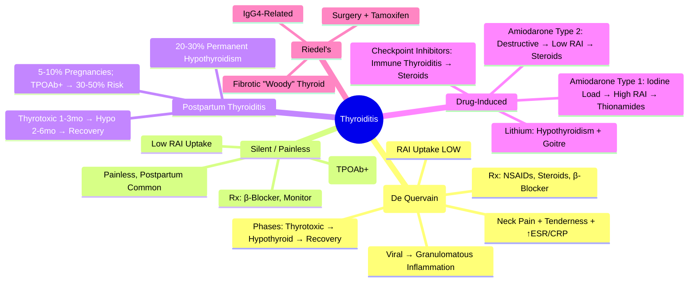

# Thyroiditis (Subacute, Silent, Postpartum)

> [!info]
> **Thyroiditis = Inflammatory Thyroid Disease** causing release of preformed hormone → **Transient Thyrotoxicosis** → **Hypothyroid Phase** → **Recovery** (usually). Key differential: **RAI Uptake LOW** (vs Graves/Toxic Nodule where uptake is HIGH). Three main types: Subacute (De Quervain), Silent/Painless, Postpartum.

---

## 1. Learning Objectives
By the end of this note you should be able to:
- [ ] Classify thyroiditis types and their pathophysiological mechanisms
- [ ] Differentiate subacute, silent, postpartum, and drug-induced thyroiditis
- [ ] Apply investigation algorithm (TSH, fT4, TRAb, RAI uptake, ESR/CRP)
- [ ] Predict natural history and manage each phase appropriately
- [ ] Identify when to treat vs observe

---

## 2. Classification & Pathophysiology

| Type | Mechanism | Key Features |
|------|-----------|--------------|
| **Subacute (De Quervain)** | Viral/Post-viral → Granulomatous Inflammation → Follicular Destruction → Hormone Leak | **Painful**, Tender Thyroid; ↑ ESR/CRP; **Low RAI Uptake** |
| **Silent / Painless** | Autoimmune Lymphocytic Infiltration → Follicular Rupture | **Painless**, Often Postpartum; **Low RAI Uptake** |
| **Postpartum Thyroiditis** | Autoimmune (TPOAb+) Flare Postpartum | Onset 1-4mo Postpartum; **Low RAI Uptake** |
| **Drug-Induced** | Amiodarone (Type 1/2), Lithium, Checkpoint Inhibitors | Variable (Type 1 = Iodine Load; Type 2 = Destructive) |
| **Acute Suppurative** | Bacterial Infection | Acute Pain, Fever, Abscess; Rare |
| **Riedel's** | Fibrotic Invasive Process | Hard Fixed "Woody" Thyroid; Compressive |

---

## 2. Subacute (De Quervain) Thyroiditis

| Feature | Details |
|---------|---------|
| **Aetiology** | **Post-Viral** (Coxsackie, Mumps, Adenovirus, EBV, COVID-19) → Granulomatous Inflammation |
| **Demographics** | **Women 30-50y** (F:M 4:1); Seasonal (Summer/Autumn) |
| **Clinical** | **Neck Pain** (Radiates to Jaw/Ears), **Tender Thyroid**, Fever, Malaise, **Thyrotoxic Symptoms** |
| **Labs** | **TSH Suppressed**, fT4/fT3 ↑, **ESR/CRP ↑↑**, **TRAb Negative**, **TPOAb Often Positive** |
| **RAI Uptake** | **Very Low (<2%)** (Follicular Destruction → No Organification) |
| **Natural History** | **3 Phases**: Thyrotoxic (3-6wk) → Hypothyroid (2-3mo) → Recovery (90-95%) |
| **Treatment** | **NSAIDs** (Ibuprofen 400-600mg TDS); **Steroids** (Pred 15-30mg) if Severe; β-Blocker for Symptoms |

### Natural History Phases
| Phase | Duration | TSH | fT4/fT3 | Management |
|-------|----------|-----|---------|------------|
| **1. Thyrotoxic** | 3-6 weeks | Suppressed | ↑↑ | NSAIDs, β-Blocker, Steroids if Severe |
| **2. Hypothyroid** | 2-3 months | ↑↑ | ↓↓ | Levothyroxine if Symptomatic/Severe |
| **3. Recovery** | 6-12 months | Normalises | Normalises | Monitor; Stop Rx if Recovered |

**Outcome**: **90-95% Full Recovery**; 5-10% Permanent Hypothyroidism.

---

## 3. Silent / Painless Thyroiditis

| Feature | Details |
|---------|---------|
| **Aetiology** | **Autoimmune Lymphocytic Infiltration** (TPOAb+) → Follicular Rupture |
| **Demographics** | Women 30-50y; Often **Postpartum** (Overlaps with Postpartum Thyroiditis) |
| **Clinical** | **Painless** Goitre; Thyrotoxic Symptoms; **No Neck Pain** |
| **Labs** | TSH Suppressed, fT4/fT3 ↑, **TRAb Negative**, **TPOAb Positive**, **Normal ESR/CRP** |
| **RAI Uptake** | **Low (<2%)** |
| **Natural History** | Thyrotoxic (2-4mo) → Hypothyroid (2-6mo) → Recovery (80%) |
| **Treatment** | **β-Blocker** for Symptoms; **Levothyroxine** if Hypothyroid Phase Symptomatic |

---

## 3. Postpartum Thyroiditis

| Feature | Details |
|---------|---------|
| **Definition** | **Autoimmune Thyroiditis** Triggered by Postpartum Immune Rebound (TPOAb+) |
| **Incidence** | **5-10%** of Pregnancies; **TPOAb+ in 1st Trimester → 30-50% Risk** |
| **Timing** | **Onset 1-4 Months Postpartum** (Peak 3mo) |
| **Clinical** | **Painless** Goitre; Thyrotoxic Symptoms (Often Subtle) → Hypothyroid Symptoms |
| **Labs** | TSH Suppressed → ↑; **TPOAb Strongly Positive**; **TRAb Negative**; fT4/fT3 ↑ then ↓ |
| **RAI Uptake** | **Low** |
| **Phases** | **Thyrotoxic (1-3mo)** → **Hypothyroid (2-6mo post-delivery)** → Recovery (or Permanent Hypothyroid 20-30%) |
| **Management** | **Thyrotoxic Phase**: β-Blocker; **Hypothyroid Phase**: **Levothyroxine** if TSH >10 or Symptomatic |
| **Long-term** | **20-30% Permanent Hypothyroidism**; **Recurrence in Subsequent Pregnancies** |

---

## 4. Drug-Induced Thyroid Dysfunction

### Amiodarone-Induced Thyroid Dysfunction (AIT)
| Type | Mechanism | Thyroiditis Type |
|------|-----------|------------------|
| **Type 1 (Iodine Load)** | Excess Iodine → **Jod-Basedow** (Hyperthyroidism in Susceptible) | Not True Thyroiditis; **High RAI Uptake** |
| **Type 2 (Destructive)** | Direct Cytotoxicity → **Destructive Thyroiditis** | **Low RAI Uptake**; Resembles Silent Thyroiditis |

| Feature | **AIT Type 1** | **AIT Type 2** |
|---------|---------------|---------------|
| **Mechanism** | Iodine Load → ↑ Substrate | Direct Cytotoxicity |
| **RAI Uptake** | **High / Normal** | **Low** |
| **Thyroid US** | Vascularity ↑ | Hypoechoic, Heterogeneous |
| **Treatment** | **Thionamides (CBZ/PTU) ± Perchlorate** | **Steroids (Pred 30-40mg/day)**; Thionamides Ineffective |
| **Duration** | Prolonged (Months) | 3-6 Months |

### Other Drugs
| Drug | Effect | Mechanism |
|------|--------|-----------|
| **Lithium** | Hypothyroidism (Goitre) ± Hyperthyroidism | Inhibits Hormone Release; Goitrogen |
| **Tyrosine Kinase Inhibitors (Sunitinib, Sorafenib)** | Hypothyroidism (Vascular) | Vascular Injury |
| **Checkpoint Inhibitors (Anti-PD1/PDL1, CTLA-4)** | **Immune Thyroiditis** (Destructive) → Thyrotoxic → Hypothyroid | Autoimmune |
| **Interferon-α** | Autoimmune Thyroiditis (TPOAb+) | Autoimmune |
| **Glucocorticoids** | Transient TSH Suppression | Central Suppression |

---

## 4. Riedel's Thyroiditis (Rare)

| Feature | Details |
|---------|---------|
| **Pathology** | **Fibrotic Invasive Process** (IgG4-Related?) → Dense Fibrosis |
| **Clinical** | **"Woody" Hard Fixed Thyroid**, Tracheal/Oesophageal Compression, Recurrent Laryngeal Nerve Palsy |
| **Thyroid Function** | Usually **Euthyroid** or **Hypothyroid**; Rarely Thyrotoxic |
| **Imaging** | CT/MRI: Infiltrative Mass, Invades Strap Muscles, Trachea |
| **Biopsy** | Dense Fibrosis, Lymphoplasmacytic Infiltrate, **IgG4+ Plasma Cells** |
| **Treatment** | **Surgery** (Decompression + Resection); **Tamoxifen** (Anti-fibrotic); **Steroids** (Limited); **Rituximab** (IgG4-Related) |

---

## 5. Acute Suppurative Thyroiditis (Rare)

| Feature | Details |
|---------|---------|
| **Aetiology** | **Bacterial** (Staph, Strep, Anaerobes); Immunocompromised, Developmental Anomalies (Pyriform Sinus Fistula) |
| **Clinical** | Acute Neck Pain, Fever, Tender Swelling, Dysphagia, Sepsis |
| **Imaging** | US/CT: Abscess, Heterogeneous Thyroid |
| **Treatment** | **IV Antibiotics** (Cover Staph, Strep, Anaerobes); **Incision & Drainage** if Abscess; Thyroidectomy Rare |

---

## 6. Investigation Algorithm

```
Neck Pain / Thyrotoxicosis / Goitre
         │
         ▼
TSH + fT4/fT3 + TRAb + TPOAb + ESR/CRP
         │
         ├── TSH Suppressed + fT4/fT3 ↑ + TRAb Positive → GRAVES
         │
         ├── TSH Suppressed + fT4/fT3 ↑ + TRAb Negative
         │       │
         │       ├── Neck Pain + Tenderness + ↑ESR/CRP → SUBACUTE (DE QUERVAIN)
         │       ├── Painless + Postpartum + TPOAb+ → POSTPARTUM THYROIDITIS
         │       ├── Painless + TPOAb+ (Non-Postpartum) → SILENT THYROIDITIS
         │       ├── Amiodarone → AMIODARONE-INDUCED (Type 1 vs 2)
         │       └── Other Drugs / Checkpoint Inhibitors → DRUG-INDUCED
         │
         ├── TSH Normal/High + fT4 Low → HYPOTHYROIDISM
         │       ├── TSH High → PRIMARY (HASHIMOTO)
         │       └── TSH Low/Normal → CENTRAL (PITUITARY)
         │
         └── Normal TSH + fT4/fT3 Normal → EUTHYROID (Monitor)
```

---

## 6. Management Summary by Type

| Type | Thyrotoxic Phase Rx | Hypothyroid Phase Rx | Key Point |
|------|---------------------|----------------------|-----------|
| **Subacute** | NSAIDs, Steroids (Pred 20-40mg), β-Blocker | Levothyroxine if Symptomatic/TSH >10 | Steroids Short Course (2-4wk) |
| **Silent** | β-Blocker (Symptomatic) | Levothyroxine if TSH >10 / Symptomatic | No Steroids Needed |
| **Postpartum** | β-Blocker (Thyrotoxic) | **Levothyroxine** if TSH >10 / Symptomatic / Breastfeeding | 20-30% Permanent Hypo |
| **Amiodarone Type 1** | Thionamides (CBZ/PTU) ± Perchlorate | Usually Resolves | Stop Amiodarone if Possible |
| **Amiodarone Type 2** | **Steroids (Pred 30-40mg/day)** | May Need Levothyroxine | Steroids Mainstay |
| **Checkpoint Inhibitors** | β-Blocker → **Steroids** (Pred 1-2mg/kg) | Levothyroxine if Persistent | Hold ICI if Grade ≥3 |

---

## 7. Exam Pearls (FCPS/MRCP)

| Topic | Key Point |
|-------|-----------|
| **Thyroiditis vs Graves** | Thyroiditis = **Low RAI Uptake**; Graves = **High RAI Uptake** |
| **Subacute (De Quervain)** | **Neck Pain + Tenderness + ↑ESR/CRP**; Viral Aetiology; Self-Limiting |
| **Silent Thyroiditis** | **Painless**; TPOAb+; Postpartum Common; Low RAI |
| **Postpartum Thyroiditis** | **5-10% Pregnancies**; TPOAb+ → 30-50% Risk; Thyrotoxic 1-3mo → Hypo 2-6mo; 20-30% Permanent Hypo |
| **Amiodarone** | **Type 1** = Iodine Load (Jod-Basedow) → **High RAI Uptake** → Thionamides; **Type 2** = Destructive → **Low RAI** → **Steroids** |
| **Checkpoint Inhibitors** | Immune Thyroiditis → Thyrotoxic → Hypothyroid; **Steroids if Grade ≥2** |
| **RAI Uptake in Thyroiditis** | **LOW** (Follicular Destruction → No Organification) |
| **Subacute vs Silent** | Subacute = Pain + ↑ESR/CRP; Silent = Painless + Normal ESR |
| **Postpartum Thyroiditis** | TPOAb+ in 1st Trimester → 30-50% Risk; 20-30% Permanent Hypothyroidism |
| **Amiodarone Type 1 vs 2** | Type 1 = Jod-Basedow (High RAI) → Thionamides; Type 2 = Destructive (Low RAI) → Steroids |
| **Riedel's** | Fibrotic "Woody" Thyroid; IgG4-Related; Surgery + Tamoxifen |
| **Lithium** | Inhibits Hormone Release → Hypothyroidism + Goitre |

---

## 8. Mind Map



---

## 8. Exam Pearls (FCPS/MRCP)

| Topic | Key Point |
|-------|-----------|
| **Thyroiditis vs Graves** | **Low RAI Uptake** (Thyroiditis) vs **High RAI Uptake** (Graves) |
| **Subacute Thyroiditis** | Neck Pain + Tenderness + ↑ESR/CRP; Self-Limiting |
| **Silent Thyroiditis** | Painless; TPOAb+; Low RAI; Postpartum Common |
| **Postpartum Thyroiditis** | 5-10% Pregnancies; TPOAb+ → 30-50% Risk; 20-30% Permanent Hypo |
| **Amiodarone Type 1** | Jod-Basedow (Iodine Load) → **High RAI Uptake** → Thionamides |
| **Amiodarone Type 2** | Destructive Thyroiditis → **Low RAI** → **Steroids Mainstay** |
| **Checkpoint Inhibitors** | Immune Thyroiditis → Thyrotoxic → Hypothyroid; **Steroids if Grade ≥2** |
| **RAI Uptake in Thyroiditis** | **LOW** (Follicular Destruction → No Organification) |
| **Subacute vs Silent** | Subacute = Pain + ↑ESR/CRP; Silent = Painless + Normal ESR |
| **Postpartum Thyroiditis** | TPOAb+ in 1st Trimester → 30-50% Risk; 20-30% Permanent Hypothyroidism |
| **Amiodarone Type 1 vs 2** | Type 1 = Jod-Basedow (High RAI); Type 2 = Destructive (Low RAI → Steroids) |

---

## MCQs (10)
1. **Subacute thyroiditis (De Quervain) key feature:**
   A. Painful thyroid (neck pain)
   B. Painless
   C. Diffuse RAI uptake
   D. TRAb positive
   E. Always leads to permanent hypothyroidism

2. **RAI uptake in thyroiditis (thyrotoxic phase):**
   A. Low/absent
   B. Diffuse increased
   C. Focal
   D. Multifocal
   E. Normal

3. **Postpartum thyroiditis typical course:**
   A. Thyrotoxic (1-4mo) → Hypothyroid (2-6mo) → Recovery
   B. Permanent hyperthyroidism
   C. Permanent hypothyroidism
   D. Only thyrotoxic phase
   E. Only hypothyroid phase

4. **Silent thyroiditis vs subacute:**
   A. Painless vs painful; both low RAI
   B. Diffuse RAI vs low
   C. TRAb + vs -
   D. Permanent vs transient
   E. Different antibodies

5. **Thyrotoxic phase of thyroiditis treated with:**
   A. β-blocker + NSAIDs/steroids (if pain); NO ATDs
   B. Carbimazole
   C. RAI
   D. Surgery
   E. PTU

6. **Anti-TPO antibodies in thyroiditis:**
   A. Positive in silent/postpartum; Subacute often negative
   B. Negative in all
   C. Only subacute positive
   D. Only silent positive
   E. Diagnostic of Graves

7. **Subacute thyroiditis triggered by:**
   A. Viral/post-viral
   B. Autoimmune
   C. Iodine excess
   D. Drug-induced
   E. Postpartum

8. **Postpartum thyroiditis timing:**
   A. Thyrotoxic 1-4mo pp; Hypothyroid 2-6mo pp
   B. Thyrotoxic 6-12mo pp
   C. Immediate postpartum
   D. Only during pregnancy
   E. Random

9. **Permanent hypothyroidism after postpartum thyroiditis:**
   A. 20-30%
   B. <5%
   C. 50-60%
   D. 80-90%
   E. 100%

10. **Drug-induced thyroiditis (amiodarone type 2):**
   A. Destructive thyroiditis → steroids; stop amiodarone
   B. Iodine load → carbimazole
   C. RAI
   D. Surgery
   E. PTU only

## SBA Questions (10)
1. **35yo woman: 3 weeks neck pain, fever, TSH <0.01, fT4 35, low RAI uptake, ESR 60. Diagnosis?**
   A. Subacute (De Quervain) thyroiditis
   B. Acute suppurative thyroiditis
   C. Graves disease
   D. Subacute thyroiditis silent
   E. Postpartum thyroiditis

2. **Same patient: management?**
   A. NSAIDs (ibuprofen) + propranolol; prednisolone if severe pain
   B. Carbimazole
   C. RAI
   D. Antibiotics
   E. Surgery

3. **4mo postpartum woman: TSH <0.01, fT4 30, painless, low RAI uptake. Phase?**
   A. Postpartum thyroiditis thyrotoxic phase (1-4mo)
   B. Graves disease
   C. Silent thyroiditis
   D. Subacute thyroiditis
   E. Factitious

4. **Same patient at 4mo pp: expect?**
   A. Hypothyroid phase (2-6mo) → monitor TSH; levothyroxine if symptomatic
   B. Permanent hyperthyroidism
   C. Recovery only
   D. Thyroid storm
   E. RAI needed

5. **Silent thyroiditis: TSH <0.01, fT4 28, painless, low RAI, TPOAb +. Course?**
   A. Thyrotoxic → Hypothyroid → Recovery (3-6mo); β-blocker for symptoms
   B. Carbimazole needed
   C. RAI needed
   D. Permanent hypothyroidism
   E. Progress to Graves

6. **Amiodarone on therapy 2yrs: thyrotoxic, low RAI, no pain. Type?**
   A. Type 2 (destructive thyroiditis) → stop amiodarone + steroids
   B. Type 1 (iodine load) → carbimazole
   C. Graves disease
   D. Subacute thyroiditis
   E. Toxic nodule

## Flashcards
- **Q: Subacute thyroiditis**
  **A: Viral/post-viral; PAINFUL thyroid; low RAI; self-limiting (3-6mo); NSAIDs/steroids**

- **Q: Silent thyroiditis**
  **A: Autoimmune; PAINLESS; low RAI; TPOAb+; thyrotoxic→hypo→recovery (3-6mo)**

- **Q: Postpartum thyroiditis**
  **A: 1-4mo pp thyrotoxic → 2-6mo pp hypo → recovery; 20-30% permanent hypo; TPOAb+ high risk**

- **Q: Thyroiditis RAI uptake**
  **A: LOW/absent (vs Graves diffuse ↑)**

- **Q: Thyrotoxic phase Rx**
  **A: β-blocker + NSAIDs/steroids (pain); NO ATDs (not synthesis excess)**

- **Q: Subacute ESR**
  **A: Markedly elevated**

- **Q: Postpartum TPOAb**
  **A: High risk if TPOAb+ in 1st trimester**

- **Q: Drug-induced (amiodarone)**
  **A: Type 1 = iodine load (ATDs); Type 2 = destructive (steroids)**

## Answer Key with Explanations
### MCQs
1. **Painful thyroid (neck pain)** — Subacute thyroiditis (De Quervain) key feature:

2. **Low/absent** — RAI uptake in thyroiditis (thyrotoxic phase):

3. **Thyrotoxic (1-4mo) → Hypothyroid (2-6mo) → Recovery** — Postpartum thyroiditis typical course:

4. **Painless vs painful; both low RAI** — Silent thyroiditis vs subacute:

5. **β-blocker + NSAIDs/steroids (if pain); NO ATDs** — Thyrotoxic phase of thyroiditis treated with:

6. **Positive in silent/postpartum; Subacute often negative** — Anti-TPO antibodies in thyroiditis:

7. **Viral/post-viral** — Subacute thyroiditis triggered by:

8. **Thyrotoxic 1-4mo pp; Hypothyroid 2-6mo pp** — Postpartum thyroiditis timing:

9. **20-30%** — Permanent hypothyroidism after postpartum thyroiditis:

10. **Destructive thyroiditis → steroids; stop amiodarone** — Drug-induced thyroiditis (amiodarone type 2):


### SBAs
1. **Subacute (De Quervain) thyroiditis** — 35yo woman: 3 weeks neck pain, fever, TSH <0.01, fT4 35, low RAI uptake, ESR 60. Diagnosis?

2. **NSAIDs (ibuprofen) + propranolol; prednisolone if severe pain** — Same patient: management?

3. **Postpartum thyroiditis thyrotoxic phase (1-4mo)** — 4mo postpartum woman: TSH <0.01, fT4 30, painless, low RAI uptake. Phase?

4. **Hypothyroid phase (2-6mo) → monitor TSH; levothyroxine if symptomatic** — Same patient at 4mo pp: expect?

5. **Thyrotoxic → Hypothyroid → Recovery (3-6mo); β-blocker for symptoms** — Silent thyroiditis: TSH <0.01, fT4 28, painless, low RAI, TPOAb +. Course?

6. **Type 2 (destructive thyroiditis) → stop amiodarone + steroids** — Amiodarone on therapy 2yrs: thyrotoxic, low RAI, no pain. Type?


## 9. Local Navigation (for Dashboard UI)

> **Parent**: [[../Thyroid Disorders|Thyroid Disorders]]  
> **Hierarchy**: [[../../Davidson Chapter 20 - Endocrinology Hierarchy|Endocrinology Hierarchy]]  
> **Template**: [[../../../Templates/Endocrinology Topic Template|Endocrinology Topic Template]]  
> **See also**: [[Hyperthyroidism Overview]], [[Graves Disease]], [[Drug-Induced Thyroid Dysfunction]], [[Postpartum Thyroiditis]], [[Subclinical Thyroid Disease]]