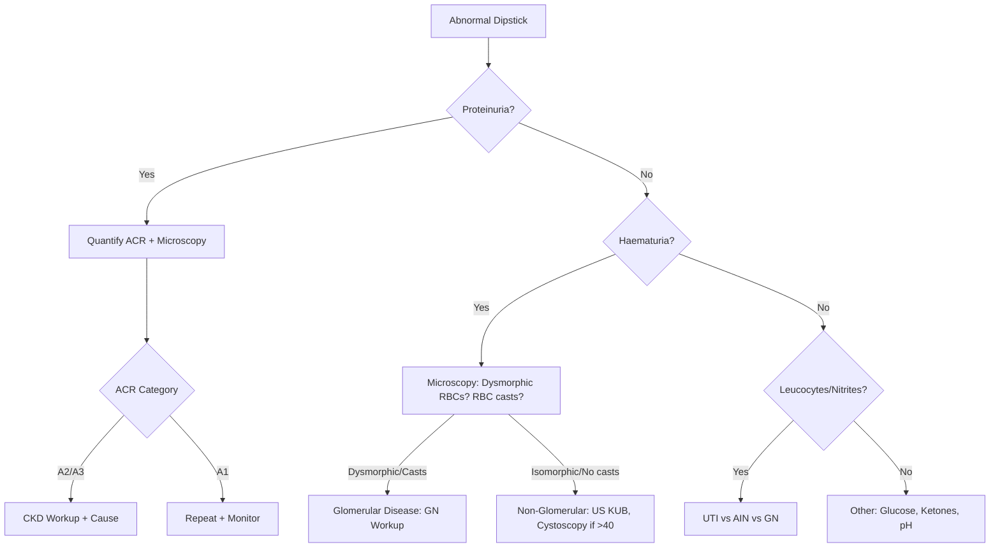
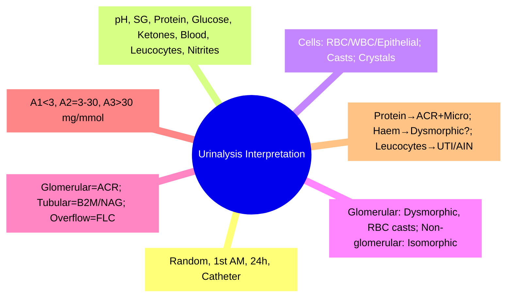

# Urinalysis Interpretation

Related: [[Glomerular Filtration Rate]], [[Urine Investigations]], [[Blood Tests in Renal Disease]], [[Glomerular Diseases]], [[Acute Kidney Injury]]

**Heading Hub:** [[Renal Anatomy, Physiology, and Investigations]]
**Sub-hub:** [[Renal Anatomy, Physiology, and Investigations/Urine studies and nephrology interpretation]]

> [!important]
> **Urinalysis = cornerstone of renal diagnosis**. Dipstick + microscopy + biochemical quantification. Key patterns: Haematuria (glomerular vs non-glomerular), Proteinuria (albuminuria vs tubular), Pyuria (UTI vs AIN vs GN), Casts (diagnostic).

---

## Learning Objectives
- Perform and interpret urine dipstick testing
- Interpret urine microscopy (cells, casts, crystals)
- Differentiate glomerular vs non-glomerular haematuria
- Classify proteinuria (albuminuria, tubular, overflow)
- Recognise diagnostic cast patterns

---

## Urine Collection Methods

| Method | Use | Advantages | Limitations |
|--------|-----|------------|-------------|
| **Random** | Screening, dipstick | Convenient | Concentration varies |
| **First Morning** | Proteinuria quantification (ACR) | Concentrated, standardised | Patient compliance |
| **24-Hour** | Total protein, creatinine clearance | Gold standard for quantification | Cumbersome, collection errors |
| **Catheter/Suprapubic** | Sterile culture | Avoids contamination | Invasive |

---

## Dipstick Analysis

| Parameter | Principle | Normal | Abnormal Causes | False +/- |
|-----------|-----------|--------|-----------------|-----------|
| **pH** | H⁺-sensitive dye | 4.5–8.0 | Acid: acidosis, high protein diet; Alkali: UTI (Proteus), RTA, veg diet | — |
| **Specific Gravity** | Ionic strength | 1.005–1.030 | ↑: dehydration, glycosuria, proteinuria; ↓: DI, CKD, diuretics | Falsely ↑ with protein/glucose |
| **Protein** | pH indicator (tetrabromophenol blue) | Negative | **Albuminuria** (glomerular); Bence Jones (myeloma) missed; tubular proteinuria | Falsely ↑: alkaline urine, high SG; Falsely ↓: dilute |
| **Glucose** | Glucose oxidase | Negative | Diabetes, renal glycosuria (Fanconi), pregnancy | Falsely ↑: oxidising agents; Falsely ↓: ascorbic acid |
| **Ketones** | Nitroprusside (acetoacetate only) | Negative | DKA, starvation, low-carb diet | Misses β-hydroxybutyrate (early DKA) |
| **Blood** | Peroxidase-like activity (Hb) | Negative | **Haematuria** (RBCs), **myoglobinuria**, **haemoglobinuria** | Falsely ↑: oxidants; Falsely ↓: ascorbic acid, formalin |
| **Leucocytes** | Esterase (neutrophil) | Negative | UTI, AIN, GN, contamination | Falsely ↑: contamination; Falsely ↓: high SG, protein, glycosuria |
| **Nitrites** | Bacterial reductase (nitrate→nitrite) | Negative | Gram-negative UTI (E. coli, Klebsiella) | Requires 4h bladder dwell; misses Gram+, Pseudomonas |

---

## Urine Microscopy

### Cells
| Cell | Appearance | Significance |
|------|------------|--------------|
| **RBCs** | **Isomorphic** (uniform) = non-glomerular; **Dysmorphic** (blebs, irregular) = glomerular; **RBC casts** = glomerular | >3–5/HPF = significant |
| **WBCs** | Polymorphs, may be degenerated | >5/HPF = pyuria; sterile pyuria = TB, stones, AIN, GN, vasculitis, Chlamydia |
| **Epithelial Cells** | Squamous (contamination), Transitional (bladder/ureter), Renal tubular (ATN) | Renal tubular epithelial cells = ATN |

### Casts (Formed in TAL/Collecting Duct)
| Cast Type | Appearance | Significance |
|-----------|------------|--------------|
| **Hyaline** | Clear, low refractive, parallel sides | Physiological (exercise, fever, dehydration); **NOT pathological** |
| **Granular** | Coarse/fine granules | Non-specific; tubular injury, exercise |
| **Waxy** | High refractive, sharp edges, brittle | **Advanced CKD / chronic tubular injury** |
| **RBC Casts** | Red-brown, RBCs in matrix | **GN (pathognomonic)** |
| **WBC Casts** | WBCs in matrix | **Pyelonephritis, AIN** |
| **Epithelial Cell Casts** | Tubular cells in matrix | **ATN** |
| **Fatty Casts** | Oval fat bodies, Maltese crosses | **Nephrotic syndrome** |
| **Broad Casts** | Wide (dilated tubules) | **Advanced CKD** |

### Crystals
| Crystal | Appearance | Clinical Context |
|---------|------------|------------------|
| **Uric Acid** | Rhombic/rosette, yellow-red | Acidic urine, gout, tumour lysis, chemotherapy |
| **Calcium Oxalate** | Envelope/dumbbell, colourless | Acidic/neutral urine, hyperoxaluria, ethylene glycol |
| **Triple Phosphate (Struvite)** | Coffin-lid, colourless | Alkaline urine, **Proteus UTI**, stones |
| **Cystine** | Hexagonal, colourless | **Cystinuria** (autosomal recessive) |
| **Drug Crystals** | Variable | Sulfonamides, indinavir, acyclovir |

---

## Haematuria Differentiation

| Feature | **Glomerular** | **Non-Glomerular** |
|---------|----------------|-------------------|
| **RBC Morphology** | **Dysmorphic** (>40% or >80% dysmorphic index) | **Isomorphic** (uniform) |
| **RBC Casts** | **Present** | Absent |
| **Proteinuria** | Often present (≥1+) | Usually absent/minimal |
| **Dysmorphic RBCs** | Acanthocytes (ring-form, blebs) | Uniform discs |
| **Causes** | IgA nephropathy, lupus, vasculitis, anti-GBM, post-strep, MPGN | Stones, tumour, UTI, trauma, exercise, BPH |

> [!key]
> **Dysmorphic RBCs >40%** = glomerular origin. **RBC casts** = definitive glomerular bleeding.

---

## Proteinuria Classification & Quantification

| Type | Mechanism | Dipstick Detection | Quantification |
|------|-----------|-------------------|----------------|
| **Glomerular (Albuminuria)** | ↑Albumin permeability | **Detected** (albumin-specific) | **ACR** (mg/mmol) or 24h protein |
| **Tubular** | ↓Proximal reabsorption (LMW proteins) | **Poorly detected** (dipstick = albumin-specific) | 24h protein, β₂-microglobulin, NAG |
| **Overflow** | Plasma overload of LMW proteins | **Not detected** | Serum free light chains, Bence Jones protein |
| **Post-renal** | Inflammation/bleeding in tract | Detected | ACR |

### ACR Categories (KDIGO)
| Category | ACR (mg/mmol) | Approx 24h Protein (g/day) | Term |
|----------|---------------|----------------------------|------|
| **A1** | <3 | <0.15 | Normal / mildly increased |
| **A2** | 3–30 | 0.15–0.5 | **Moderately increased (microalbuminuria)** |
| **A3** | >30 | >0.5 | **Severely increased (macroalbuminuria)** |

> [!key]
> **ACR preferred over 24h collection**. First morning urine ideal. Orthostatic proteinuria: normal ACR first morning, elevated daytime.

---

## Diagnostic Approach to Abnormal Urinalysis

### Algorithm

---

## Mind Map

---

## 24-Hour Recall Prompts
1. Dipstick parameters + false +/-
2. Dysmorphic vs isomorphic RBCs
3. RBC casts = glomerular (pathognomonic)
4. ACR categories A1/A2/A3
5. Cast types + significance (hyaline, granular, waxy, RBC, WBC, epithelial, fatty)
6. Tubular proteinuria: dipstick negative, B2M/NAG positive
7. Orthostatic proteinuria: normal first morning ACR

---

## 7-Day / 15-Day / 30-Day Revision Tracker

| Day | Date | Recall (1-5) | Notes |
|-----|------|--------------|-------|
| 1   |      |              |       |
| 7   |      |              |       |
| 15  |      |              |       |
| 30  |      |              |       |

---

## Must Know / Should Know / Nice to Know

| Priority | Content |
|----------|---------|
| **Must Know 🔴** | Dipstick interpretation, dysmorphic RBCs + RBC casts = glomerular, ACR categories, cast identification |
| **Should Know 🟡** | Tubular vs glomerular proteinuria, crystal identification, sterile pyuria causes, orthostatic proteinuria |
| **Nice to Know 🟢** | Advanced microscopy (phase contrast dysmorphism index), rare crystals, quantitative cast scoring |

---

## MCQs (10)

1. **Dipstick protein detection is specific for:**
   A. All proteins
   B. **Albumin**
   C. Bence Jones protein
   D. β₂-microglobulin
   E. IgG

2. **Pathognomonic finding for glomerulonephritis on urine microscopy:**
   A. Hyaline casts
   B. Granular casts
   C. **RBC casts**
   D. Waxy casts
   E. Fatty casts

3. **Dysmorphic RBCs suggesting glomerular origin:**
   A. <10%
   B. <20%
   C. **>40%**
   D. >60%
   E. >80%

4. **ACR category A2 (microalbuminuria) range:**
   A. <3 mg/mmol
   B. **3–30 mg/mmol**
   C. >30 mg/mmol
   D. >300 mg/mmol
   E. Any detectable

5. **WBC casts indicate:**
   A. **Pyelonephritis or AIN**
   B. Glomerulonephritis
   C. ATN
   D. Normal variant
   E. Nephrotic syndrome

6. **Dipstick blood positive but no RBCs on microscopy:**
   A. Haematuria
   B. **Myoglobinuria or haemoglobinuria**
   C. False positive
   D. Contamination
   E. UTI

7. **Nitrite negative UTI commonly caused by:**
   A. E. coli
   B. **Enterococcus, Pseudomonas, Staphylococcus** (don't reduce nitrate)
   C. Klebsiella
   D. Proteus
   E. All of the above

8. **Coffin-lid crystals in alkaline urine:**
   A. Uric acid
   B. Calcium oxalate
   C. **Triple phosphate (Struvite)**
   D. Cystine
   E. Drug crystals

9. **Fatty casts with Maltese crosses:**
   A. ATN
   B. **Nephrotic syndrome**
   C. Pyelonephritis
   D. AIN
   E. Obstruction

---

## SBA Questions (10)

1. **45-year-old man. Macroscopic haematuria. Microscopy: isomorphic RBCs, no casts, no proteinuria. Next step:**
   A. Renal biopsy
   B. **US KUB → if normal, cystoscopy (age >40)**
   C. ACEi trial
   D. Immunosuppression
   D. Observe

2. **25-year-old woman. SLE. Urine: protein +++, blood ++, RBC casts. ACR 120 mg/mmol. Most likely lupus class:**
   A. Class II
   B. Class III
   C. **Class IV**
   D. Class V
   E. Class VI

3. **60-year-old diabetic. Dipstick protein +, ACR 45 mg/mmol. Microscopy: few hyaline casts. Classification:**
   A. Normal
   B. **Diabetic kidney disease (A3 macroalbuminuria)**
   C. Tubular proteinuria
   D. Overflow proteinuria
   E. Orthostatic proteinuria

4. **Patient on NSAIDs. AKI. Urine microscopy: WBCs, WBC casts, eosinophils. Diagnosis:**
   A. ATN
   B. GN
   C. **Acute interstitial nephritis (AIN)**
   D. Pyelonephritis
   E. Obstruction

5. **First morning urine ACR 2 mg/mmol, random daytime ACR 45 mg/mmol. Diagnosis:**
   A. Diabetic nephropathy
   B. **Orthostatic proteinuria**
   C. Tubular proteinuria
   D. Lab error
   E. Exercise-induced

6. **Hexagonal crystals on microscopy. Genetic condition:**
   A. Gout
   B. **Cystinuria**
   C. Primary hyperoxaluria
   D. Lesch-Nyhan
   E. Fanconi syndrome

---

## Flashcards

- Q: Dipstick protein detects?
  A: Albumin (not Bence Jones, not tubular LMW proteins)

- Q: Haematuria glomerular vs non-glomerular?
  A: Dysmorphic RBCs >40% + RBC casts = glomerular; Isomorphic = non-glomerular

- Q: ACR A2 = ?
  A: 3–30 mg/mmol (microalbuminuria)

- Q: ACR A3 = ?
  A: >30 mg/mmol (macroalbuminuria)

- Q: RBC casts = ?
  A: Pathognomonic for glomerulonephritis

- Q: WBC casts = ?
  A: Pyelonephritis or AIN

- Q: Hyaline casts = ?
  A: Physiological (dehydration, exercise, fever)

- Q: Waxy casts = ?
  A: Advanced CKD / chronic tubular injury

- Q: Fatty casts = ?
  A: Nephrotic syndrome (Maltese crosses)

- Q: Tubular proteinuria detection?
  A: Dipstick NEGATIVE (albumin-specific); use β₂-microglobulin, NAG, RBP

- Q: Orthostatic proteinuria?
  A: Normal first morning ACR, elevated daytime ACR

- Q: Nitrite-negative UTI organisms?
  A: Enterococcus, Pseudomonas, Staphylococcus (don't reduce nitrate)

- Q: Cystine crystals = ?
  A: Hexagonal = cystinuria (AR)

- Q: Struvite crystals = ?
  A: Coffin-lid, alkaline urine = Proteus UTI

- Q: Ca oxalate crystals = ?
  A: Envelope/dumbbell, acidic urine

---

## Answer Key with Explanations

### MCQs
1. **B** — Dipstick uses pH indicator (tetrabromophenol blue) specific for albumin
2. **C** — RBC casts = pathognomonic for GN
3. **C** — >40% dysmorphic RBCs = glomerular origin
4. **B** — A2 = 3–30 mg/mmol (moderately increased/microalbuminuria)
5. **A** — WBC casts = pyelonephritis or AIN
6. **B** — Dipstick blood detects haemoglobin peroxidase activity; positive with myoglobin/haemoglobin without RBCs
7. **B** — Enterococcus, Pseudomonas, Staph lack nitrate reductase
8. **C** — Struvite = coffin-lid, alkaline urine, Proteus
9. **B** — Fatty casts + Maltese crosses = nephrotic syndrome (oval fat bodies)

### SBAs
1. **B** — Isomorphic RBCs, no proteinuria = non-glomerular; >40yo needs cystoscopy to exclude urothelial cancer
2. **C** — SLE + nephrotic + active sediment (RBC casts) = Class IV (diffuse proliferative)
3. **B** — Diabetic, ACR 45 = A3 macroalbuminuria = diabetic kidney disease
4. **C** — NSAIDs + WBC casts + eosinophils = AIN
5. **B** — Orthostatic proteinuria: normal first morning, elevated daytime
6. **B** — Hexagonal crystals = cystine = cystinuria