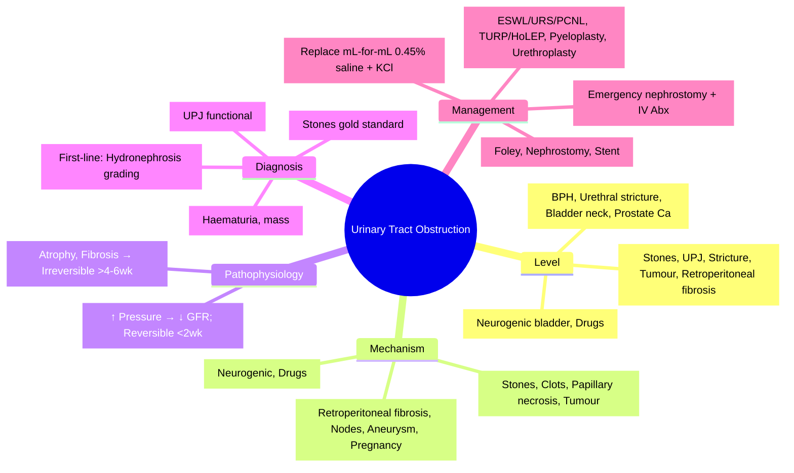

# Urinary Tract Obstruction

<callout icon="🩺" color="red_bg">
**Topic:** Urinary Tract Obstruction — Nephrology & Urology
**Style:** Sea Knowledge study infographic
**Audience:** FCPS / MRCP exam prep
</callout>

**Related:** [[Acute Kidney Injury (AKI)]], [[Chronic Kidney Disease (CKD)]], [[Investigation of Renal and Urinary Tract Disease]], [[Urolithiasis (Renal Stones)]], [[Urinary Tract Infection (UTI, Pyelonephritis, Prostatitis, Catheter-Associated)]], [[Male Reproductive Tract Disorders (BPH, Prostate Cancer, Testicular Cancer)]], [[Nephrology and Urology MOC]]

> [!important]
> **Obstruction = impediment to urine flow at any level. Causes: Intrinsic (stones, stricture, tumour, BPH), Extrinsic (retroperitoneal fibrosis, malignancy, pregnancy, aortic aneurysm), Functional (neurogenic bladder). Consequences: Hydronephrosis, AKI, CKD, infection. Management: Relief of obstruction (catheter, stent, nephrostomy, surgery).**

---

## 1. Learning Objectives
- Classify causes by level (upper vs lower) and mechanism (intrinsic, extrinsic, functional)
- Recognise clinical presentations (acute vs chronic, unilateral vs bilateral)
- Apply diagnostic approach (US, CT, IVU, antegrade/retrograde pyelography)
- Apply management principles (decompression, definitive treatment)
- Apply to FCPS/MRCP clinical scenarios

---

## 2. Classification by Level

| Level | Common Causes |
|-------|---------------|
| **Renal Pelvis/Ureter (Upper)** | Stones (commonest), UPJ obstruction, Stricture, Tumour (TCC, RCC), Retroperitoneal fibrosis, Retroperitoneal nodes |
| **Bladder/Urethra (Lower)** | **BPH (commonest in men)**, Urethral stricture, Bladder neck contracture, Bladder tumour, Urethral tumour, Prostate cancer, Phimosis |
| **Functional** | Neurogenic bladder (spinal cord injury, MS, diabetes), Atonic bladder, Detrusor-sphincter dyssynergia |

---

## 3. Aetiology by Mechanism

| Mechanism | Examples |
|-----------|----------|
| **Intrinsic (Luminal)** | Stones, Blood clots, Papillary necrosis (sloughed papillae), Fungus balls, Tumour (TCC, RCC) |
| **Intrinsic (Mural)** | Strictures (iatrogenic, inflammatory, TB), UPJ/PUV obstruction, Bladder neck contracture |
| **Extrinsic** | Retroperitoneal fibrosis, Malignancy (nodes, cervical, prostate, colorectal), Aortic aneurysm, Pregnancy (uterine compression), Endometriosis |
| **Functional** | Neurogenic bladder, Anticholinergics, Opioids, Alpha-agonists |

---

## 4. Pathophysiology

| Phase | Mechanism | Consequences |
|-------|-----------|--------------|
| **Acute (Hours–Days)** | ↑ Intraluminal pressure → ↑ Tubular pressure → ↓ GFR; Renal blood flow initially ↑ (prostaglandins) then ↓ (angiotensin II) | Reversible if relieved early |
| **Chronic (Weeks–Months)** | Tubular atrophy, Interstitial fibrosis, Glomerulosclerosis, Loss of nephrons | **Irreversible** if prolonged >4–6 weeks |

> [!key]
> **Relief within 1–2 weeks = good recovery; >4–6 weeks = permanent damage.**

---

## 5. Clinical Presentation

| Scenario | Features |
|----------|----------|
| **Acute Unilateral** | Renal colic (loin-to-groin pain), haematuria, nausea/vomiting; contralateral kidney compensates → **no AKI** |
| **Acute Bilateral / Solitary Kidney** | **AKI** (oliguric/anuric), suprapubic pain (bladder outlet), palpable bladder, hypertension, uraemic symptoms |
| **Chronic Unilateral** | Often asymptomatic; incidental hydronephrosis; recurrent UTI, hypertension |
| **Chronic Bilateral** | **CKD** (polyuria, nocturia, anaemia, bone disease), hypertension, recurrent UTI |
| **Bladder Outlet (BPH)** | LUTS (hesitancy, poor stream, frequency, nocturia, urgency), post-void dribbling, retention |

---

## 6. Diagnostic Approach

### Imaging (First-line)
| Modality | Role | Key Findings |
|----------|------|--------------|
| **US KUB** | **First-line** (no radiation, cheap) | **Hydronephrosis** (grading: mild/moderate/severe), kidney size, cortical thickness, bladder volume, prostate size, stones |
| **CT KUB** | **Stones (gold standard)** | Stone size/location/density, hydronephrosis, extrinsic compression |
| **CT Urogram** | Haematuria, mass, complex obstruction | Urothelial tumour, stricture, extrinsic mass |
| **IVU** | Historical/if CT contraindicated | Obstruction level, function (delayed nephrogram) |
| **Antegrade/Retrograde Pyelography** | Pre-stenting/surgery | Exact anatomy of stricture/UPJ |

### Hydronephrosis Grading (US)
| Grade | Findings |
|-------|----------|
| **Mild (SFU 1)** | Renal pelvis dilation only (<10mm) |
| **Moderate (SFU 2)** | Pelvis + calyceal dilation, preserved parenchyma |
| **Severe (SFU 3–4)** | Pelvis + calyceal dilation + cortical thinning (<5mm) |

### Functional Assessment
| Test | Indication |
|------|------------|
| **Diuretic Renogram (MAG3)** | **UPJ obstruction**, equivocal hydronephrosis; T½ >20min = obstruction |
| **Urodynamics** | Neurogenic bladder, BPH (detrusor pressure, flow rate) |
| **Bladder Scan** | Post-void residual (PVR >100mL = incomplete emptying) |

---

## 7. Management

### Acute Decompression (Emergency)
| Scenario | Method |
|----------|--------|
| **Acute bilateral / Solitary kidney AKI** | **Urgent decompression**: Foley catheter (if bladder outlet), **Nephrostomy** (upper tract), **Ureteric stent** |
| **Infected obstruction (pyonephrosis)** | **Emergency nephrostomy** + IV antibiotics (sepsis risk) |
| **Renal colic (stone)** | NSAIDs + alpha-blocker (tamsulosin) for <10mm; stent/nephrostomy if infected/severe AKI |

### Definitive Treatment by Cause
| Cause | Treatment |
|-------|-----------|
| **Stones** | ESWL, Ureteroscopy (URS), PCNL, Medical expulsive therapy (tamsulosin) |
| **BPH** | Medical (alpha-blocker, 5-ARI), Surgical (TURP, HoLEP, Rezum, UroLift) |
| **Stricture** | Dilatation, Urethrotomy, Urethroplasty |
| **UPJ Obstruction** | Pyeloplasty (laparoscopic/robot-assisted) |
| **Retroperitoneal Fibrosis** | Steroids, Tamoxifen, Ureteric stenting, Surgery (ureterolysis) |
| **Tumour (TCC/RCC)** | Resection (TURBT, nephroureterectomy, radical nephrectomy) |
| **Neurogenic Bladder** | Clean intermittent catheterisation (CIC), Anticholinergics, Botulinum toxin, Augmentation cystoplasty |

---

## 8. Post-Obstructive Diuresis

| Feature | Management |
|---------|------------|
| **Definition** | Polyuria >200 mL/h for ≥2h after relief of bilateral/chronic obstruction |
| **Mechanism** | Accumulated urea/solutes + tubular dysfunction → osmotic diuresis |
| **Risk** | Volume depletion, electrolyte imbalance (K+, Na+, Mg2+, PO4) |
| **Management** | **Replace urine output mL-for-mL with 0.45% saline + KCl**; monitor electrolytes q4–6h |

---

## 9. High-Yield FCPS/MRCP Points

> [!important]
> - **Commonest upper tract obstruction: Stones; Lower tract: BPH**
> - **Acute bilateral/solitary kidney = AKI = urgent decompression (Foley, nephrostomy, stent)**
> - **Infected obstruction = emergency nephrostomy + IV antibiotics**
> - **Hydronephrosis grading (SFU 1–4) on US**
> - **CT KUB = gold standard for stones**
> - **Diuretic renogram (MAG3) = functional assessment UPJ**
> - **Post-obstructive diuresis: replace mL-for-mL 0.45% saline + KCl**
> - **BPH = alpha-blocker + 5-ARI; TURP/HoLEP definitive**
> - **UPJ obstruction = pyeloplasty**
> - **Retroperitoneal fibrosis = steroids + stenting**
> - **Relief <2 weeks = reversible; >4–6 weeks = irreversible CKD**

---

## 10. Common Confusions / Exam Traps

| Trap | Correction |
|------|------------|
| **All hydronephrosis = obstruction** | Physiological (pregnancy, high flow), reflux, post-obstructive |
| **Unilateral obstruction = AKI** | **No AKI** (contralateral compensates) unless pre-existing CKD |
| **Stent = definitive for all** | Stones need ESWL/URS/PCNL; stricture needs urethroplasty |
| **Post-obstructive diuresis = good sign** | **Dangerous** — can cause severe volume depletion/electrolyte imbalance |
| **BPH = only medical** | TURP/HoLEP for refractory/retention/recurrent UTI/bladder stones |
| **UPJ = always congenital** | Can be acquired (crossing vessel, stones, surgery) |
| **Retroperitoneal fibrosis = only idiopathic** | Secondary: drugs (methysergide, beta-blockers), malignancy, radiation, IgG4-RD |
| **Neurogenic bladder = only catheter** | CIC = gold standard; anticholinergics, botox, augmentation |

---

## 11. Mnemonics

- **Obstruction Levels**: **U**pper (stones, UPJ), **L**ower (BPH, stricture), **F**unctional (neurogenic) = **ULF**
- **Causes**: **I**ntrinsic (stones, tumour), **E**xtrinsic (retroperitoneal fibrosis, nodes), **F**unctional = **IEF**
- **Acute Presentation**: **R**enal **C**olic (unilateral), **A**KI (bilateral/solitary) = **RC-AKI**
- **Decompression**: **F**oley (bladder), **N**ephrostomy (upper), **S**tent (ureter) = **FNS**
- **Stones**: **E**SWL, **U**RS, **P**CNL = **EUP**
- **BPH**: **A**lpha-blocker, **5-ARI**, **T**URP/**H**oLEP = **A5TH**
- **Post-Obstructive**: **P**olyuria >200mL/h, **R**eplace mL-for-mL **0.45% saline + KCl** = **PR0.45**

---

## 12. Mind Map

---

## 13. 24-Hour Recall Prompts
1. Upper tract obstruction commonest: Stones; Lower: BPH
2. Acute bilateral/solitary kidney = AKI = urgent decompression
3. Infected obstruction = emergency nephrostomy + IV antibiotics
4. US hydronephrosis grading (SFU 1–4)
5. CT KUB = gold standard for stones
6. MAG3 diuretic renogram for UPJ (T½ >20min = obstruction)
7. Post-obstructive diuresis: replace mL-for-mL 0.45% saline + KCl
8. BPH: alpha-blocker + 5-ARI; TURP/HoLEP definitive
9. UPJ obstruction = pyeloplasty
10. Relief <2 weeks reversible; >4–6 weeks irreversible

---

## 14. 7-Day / 15-Day / 30-Day Revision Tracker

| Day | Date | Recall (1-5) | Notes |
|-----|------|--------------|-------|
| 1   |      |              |       |
| 7   |      |              |       |
| 15  |      |              |       |
| 30  |      |              |       |

---

## 15. Must Know / Should Know / Nice to Know

| Priority | Content |
|----------|---------|
| **Must Know 🔴** | Causes by level, acute vs chronic presentation, bilateral/solitary = emergency decompression, infected obstruction, US/CT/MAG3, post-obstructive diuresis management |
| **Should Know 🟡** | BPH medical/surgical, stricture management, UPJ pyeloplasty, retroperitoneal fibrosis, neurogenic bladder CIC |
| **Nice to Know 🟢** | Robotic surgery, novel stone therapies, ureteral stent designs, cost-effectiveness, quality of life outcomes |

---

## 16. MCQs (10)

1. **Commonest cause of upper urinary tract obstruction:**
   A. UPJ obstruction
   B. **Renal stones**
   C. Retroperitoneal fibrosis
   D. Tumour
   E. Stricture

2. **Acute bilateral ureteric obstruction presents with:**
   A. Renal colic
   B. **AKI (oliguric/anuric)**
   C. Hypertension only
   D. No symptoms
   E. Haematuria only

3. **Infected hydronephrosis (pyonephrosis) — emergency management:**
   A. IV antibiotics alone
   B. **Emergency nephrostomy + IV antibiotics**
   C. Stent placement next day
   D. Oral antibiotics
   E. Observation

4. **CT KUB is gold standard for:**
   A. UPJ obstruction
   B. **Renal stones**
   C. Retroperitoneal fibrosis
   D. Neurogenic bladder
   E. BPH

5. **Diuretic renogram (MAG3) — T½ >20 minutes indicates:**
   A. Normal drainage
   B. **Obstruction**
   C. Equivocal
   D. No function
   E. Reflux

6. **Post-obstructive diuresis — fluid replacement:**
   A. Restrict fluids
   B. **Replace urine output mL-for-mL with 0.45% saline + KCl**
   C. 0.9% saline only
   D. 5% dextrose
   E. No replacement needed

7. **Benign prostatic hyperplasia — first-line medical therapy:**
   A. 5-ARI only
   B. **Alpha-blocker (tamsulosin) ± 5-ARI (finasteride/dutasteride)**
   C. Anticholinergics
   D. Beta-3 agonists
   E. PDE5 inhibitors

8. **UPJ obstruction — definitive surgical treatment:**
   A. Endopyelotomy
   B. **Pyeloplasty (laparoscopic/robot-assisted)**
   C. Stent permanently
   D. Nephrectomy
   E. ESWL

9. **Retroperitoneal fibrosis — first-line treatment:**
   A. Surgery
   B. **Steroids (prednisolone) ± tamoxifen**
   C. Stent only
   D. Nephrectomy
   E. Chemotherapy

10. **Neurogenic bladder — gold standard management:**
    A. Indwelling catheter
    B. **Clean intermittent catheterisation (CIC)**
    C. Suprapubic catheter
    D. Condom drainage
    E. Diapers only

---

## 17. SBA Questions (10)

1. **65-year-old man, sudden anuria 24h, palpable bladder, BPH history. Foley catheter drains 800mL. Post-catheter: urine output 300mL/h. Fluid replacement:**
   A. Restrict to 1L/day
   B. **Replace mL-for-mL with 0.45% saline + KCl**
   C. 0.9% saline at fixed rate
   D. No replacement
   E. 5% dextrose

2. **30-year-old woman, left flank pain, microscopic haematuria. US: mild left hydronephrosis, normal right kidney. CT KUB: 6mm left ureteric stone. Management:**
   A. Emergency nephrostomy
   B. **Medical expulsive therapy (tamsulosin) + analgesia; ESWL/URS if fails**
   C. Open ureterolithotomy
   D. Permanent stent
   D. Nephrectomy

3. **70-year-old man, BPH, recurrent UTI, bladder stones, failed medical therapy. Best definitive:**
   A. Long-term antibiotics
   B. **TURP or HoLEP**
   C. Permanent stent
   D. Cystoplasty
   E. Nephrostomy

4. **40-year-old man, gradual CKD, bilateral hydronephrosis on US, thickened bladder wall. Cystoscopy: bladder neck contracture. Management:**
   A. Alpha-blocker
   B. **Urethrotomy / urethroplasty**
   C. Stent
   D. Nephrostomy
   E. Dialysis only

5. **25-year-old woman, pregnancy 28 weeks, right flank pain, hydronephrosis right > left. Management:**
   A. Nephrostomy
   B. **Conservative (usually resolves postpartum); stent if severe AKI/infection**
   C. Nephrectomy
   D. ESWL
   E. Ureteroscopy

6. **Post-obstructive diuresis — electrolyte monitored most closely:**
   A. Sodium only
   B. **Potassium (hypokalaemia risk)**
   C. Calcium only
   D. Magnesium only
   E. Phosphate only

7. **Retroperitoneal fibrosis — associated condition:**
   A. IgG4-related disease
   B. **IgG4-related disease (also drugs, malignancy, radiation)**
   C. Only idiopathic
   D. Only malignancy
   E. Only drugs

8. **UPJ obstruction in infant — presentation:**
   A. Renal colic
   B. **Antenatal hydronephrosis / UTI / palpable mass**
   C. Haematuria
   D. Hypertension
   E. Anuria

9. **Bladder outlet obstruction — post-void residual (PVR) abnormal if:**
   A. >50 mL
   B. **>100 mL**
   C. >200 mL
   D. >500 mL
   E. Any residual

10. **Chronic bilateral obstruction — renal pathology:**
    A. Tubular hypertrophy
    B. **Tubular atrophy, interstitial fibrosis, glomerulosclerosis**
    C. Normal histology
    D. Only glomerular changes
    E. Only vascular changes

---

## 18. Flashcards

- Q: Commonest upper tract obstruction?
  A: Stones

- Q: Commonest lower tract obstruction?
  A: BPH

- Q: Acute bilateral obstruction = ?
  A: AKI (emergency decompression)

- Q: Infected obstruction?
  A: Emergency nephrostomy + IV antibiotics

- Q: First imaging?
  A: US KUB (hydronephrosis grading)

- Q: Stone gold standard?
  A: CT KUB

- Q: UPJ functional test?
  A: MAG3 diuretic renogram (T½ >20min = obstruction)

- Q: Post-obstructive diuresis replacement?
  A: mL-for-mL 0.45% saline + KCl

- Q: BPH medical therapy?
  A: Alpha-blocker ± 5-ARI

- Q: BPH surgical?
  A: TURP / HoLEP

- Q: UPJ definitive?
  A: Pyeloplasty

- Q: Stricture definitive?
  A: Urethroplasty

- Q: Retroperitoneal fibrosis?
  A: Steroids ± tamoxifen + stenting

- Q: Neurogenic bladder gold standard?
  A: Clean intermittent catheterisation (CIC)

- Q: Relief timeline?
  A: <2 weeks reversible; >4–6 weeks irreversible

---

## 19. Answer Key with Explanations

### MCQs
1. **B** — Stones = commonest upper tract obstruction
2. **B** — Bilateral/solitary kidney obstruction = AKI
3. **B** — Pyonephrosis = emergency nephrostomy + IV antibiotics
4. **B** — CT KUB = gold standard for stones
5. **B** — MAG3 T½ >20min = obstruction
6. **B** — Replace mL-for-mL 0.45% saline + KCl
7. **B** — Alpha-blocker ± 5-ARI = 1st line BPH
8. **B** — Pyeloplasty = definitive for UPJ
9. **B** — Retroperitoneal fibrosis = steroids ± tamoxifen
10. **B** — CIC = gold standard neurogenic bladder

### SBAs
1. **B** — Post-obstructive diuresis: replace mL-for-mL 0.45% saline + KCl
2. **B** — 6mm ureteric stone: MET (tamsulosin) first; ESWL/URS if fails
3. **B** — BPH + recurrent UTI + bladder stones + failed medical = TURP/HoLEP
4. **B** — Bladder neck contracture = urethrotomy/urethroplasty
5. **B** — Pregnancy hydronephrosis: conservative; stent if severe AKI/infection
6. **B** — Hypokalaemia = main risk in post-obstructive diuresis
7. **B** — Retroperitoneal fibrosis associated with IgG4-RD
8. **B** — Infant UPJ = antenatal hydronephrosis/UTI/palpable mass
9. **B** — PVR >100mL = abnormal
10. **B** — Chronic obstruction = tubular atrophy, interstitial fibrosis, glomerulosclerosis

---

## 20. Summary

**Urinary Tract Obstruction** is a **Must Know 🔴** topic.
**Key takeaway:** Upper tract: stones (commonest), UPJ, stricture, tumour. Lower tract: BPH (commonest), stricture, tumour. **Acute bilateral/solitary kidney = AKI = urgent decompression (Foley, nephrostomy, stent)**. **Infected obstruction = emergency nephrostomy + IV antibiotics**. US first-line (hydronephrosis grading SFU 1–4); CT KUB gold standard for stones; MAG3 for UPJ function. **Post-obstructive diuresis: replace mL-for-mL 0.45% saline + KCl**. BPH: alpha-blocker ± 5-ARI; TURP/HoLEP definitive. UPJ = pyeloplasty. Stricture = urethroplasty. Retroperitoneal fibrosis = steroids ± tamoxifen. Neurogenic bladder = CIC. **Relief <2 weeks reversible; >4–6 weeks irreversible CKD**.
**Exam focus:** Causes by level, acute vs chronic presentation, emergency decompression, infected obstruction, imaging algorithm, post-obstructive diuresis, BPH management, UPJ pyeloplasty, relief timeline.
**Clinical relevance:** Early recognition and decompression prevents irreversible renal damage; post-obstructive diuresis can be life-threatening if not managed.

## PasTest Scenario SBAs (Clinical Vignettes)

> **Auto-generated PasTest/Mediscope-style scenario SBAs** grounded in the authored source. Each scenario tests a real clinical fact (triad, specific sign, contraindication, trial, first-line Rx) extracted from the topic. *Source: Ch 18: Nephrology & Urology — Urinary Tract Obstruction*

**Q1.** What is the most appropriate first-line therapy for Urinary Tract Obstruction?

  - **A.** Renal colic
  - **B.** An advanced/surgical therapy reserved for refractory disease
  - **C.** Symptomatic treatment only, no disease-modifying therapy
  - **D.** Empiric broad-spectrum therapy without specific indication

  > **Answer: A** — Renal colic
  >
  > *Source:* **Renal colic (stone)**   NSAIDs + alpha-blocker (tamsulosin) for <10mm; stent/nephrostomy if infected/severe AKI  

### Definitive Treatment by Cause

