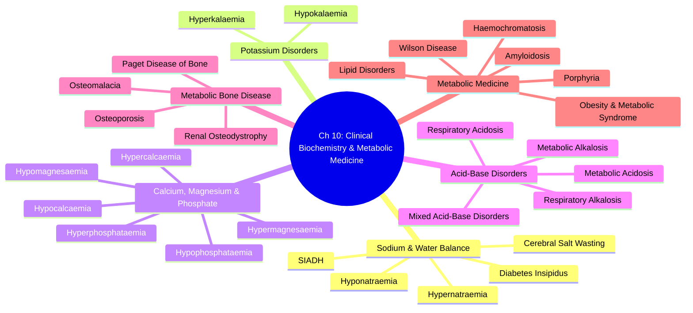

# Davidson Chapter 10 - Clinical Biochemistry and Metabolic Medicine Hierarchy
> **Part 3: Clinical Medicine | Chapter 10: Clinical Biochemistry and Metabolic Medicine**
> Davidson 24th Edition | FCPS/MRCP Exam Preparation
> Master hierarchy for all disease-level topics in this chapter.

---

## Chapter Map

---

## Topic Inventory

### 1. Sodium & Water Balance (5 topics)
| # | Topic | Status |
|---|-------|--------|
| 1 | **Hyponatraemia** (Euvolaemic, Hypovolaemic, Hypervolaemic) | ✅ Full FCPS/MRCP |
| 2 | **Hypernatraemia** (Water Deprivation, Diabetes Insipidus) | ✅ Full FCPS/MRCP |
| 3 | **SIADH** (Schwartz-Bartter Criteria, Cerebral Salt Wasting) | ✅ Full FCPS/MRCP |
| 4 | **Diabetes Insipidus** (Central, Nephrogenic, Gestational) | ✅ Full FCPS/MRCP |
| 5 | **Cerebral Salt Wasting** (Hypovolaemic, Post-op) | ✅ Full FCPS/MRCP |

### 2. Potassium Disorders (2 topics)
| # | Topic | Status |
|---|-------|--------|
| 6 | **Hypokalaemia** (Causes, ECG Changes, Replacement) | ✅ Full FCPS/MRCP |
| 7 | **Hyperkalaemia** (Acute Management, ECG, Dialysis) | ✅ Full FCPS/MRCP |

### 3. Calcium, Magnesium & Phosphate (6 topics)
| # | Topic | Status |
|---|-------|--------|
| 8 | **Hypocalcaemia** (Acute/Chronic, Tetany, Replacement) | ✅ Full FCPS/MRCP |
| 9 | **Hypercalcaemia** (Malignancy, Primary HPT, Granulomatous) | ✅ Full FCPS/MRCP |
| 10 | **Hypomagnesaemia** (Causes, ECG, Repletion) | ✅ Full FCPS/MRCP |
| 11 | **Hypermagnesaemia** (Renal Failure, Iatrogenic) | ✅ Full FCPS/MRCP |
| 12 | **Hypophosphataemia** (Refeeding, Acute/Chronic) | ✅ Full FCPS/MRCP |
| 13 | **Hyperphosphataemia** (CKD, Tumour Lysis) | ✅ Full FCPS/MRCP |

### 4. Acid-Base Disorders (5 topics)
| # | Topic | Status |
|---|-------|--------|
| 14 | **Metabolic Acidosis** (Anion Gap, Non-Gap, Management) | ✅ Full FCPS/MRCP |
| 15 | **Metabolic Alkalosis** (Chloride-Responsive/Resistant) | ✅ Full FCPS/MRCP |
| 16 | **Respiratory Acidosis** (Acute/Chronic, Ventilation) | ✅ Full FCPS/MRCP |
| 17 | **Respiratory Alkalosis** (Hyperventilation, Causes) | ✅ Full FCPS/MRCP |
| 18 | **Mixed Acid-Base Disorders** (Delta Ratio, Delta-Delta) | ✅ Full FCPS/MRCP |

### 5. Metabolic Bone Disease (4 topics)
| # | Topic | Status |
|---|-------|--------|
| 19 | **Osteoporosis** (DEXA, FRAX, Bisphosphonates, Denosumab) | ✅ Full FCPS/MRCP |
| 20 | **Osteomalacia** (Rickets, Vitamin D Deficiency, Causes) | ✅ Full FCPS/MRCP |
| 21 | **Paget Disease of Bone** (Diagnosis, Bisphosphonates) | ✅ Full FCPS/MRCP |
| 22 | **Renal Osteodystrophy** (CKD-MBD, SHPT, FGF23) | ✅ Full FCPS/MRCP |

### 6. Metabolic Medicine (6 topics)
| # | Topic | Status |
|---|-------|--------|
| 23 | **Obesity & Metabolic Syndrome** (Diagnosis, Management) | ✅ Full FCPS/MRCP |
| 24 | **Lipid Disorders** (Familial Hypercholesterolaemia, Statin Therapy) | ✅ Full FCPS/MRCP |
| 25 | **Porphyria** (Acute, Cutaneous, Diagnosis) | ✅ Full FCPS/MRCP |
| 26 | **Wilson Disease** (Copper Metabolism, Penicillamine) | ✅ Full FCPS/MRCP |
| 27 | **Haemochromatosis** (HFE, Iron Overload, Venesection) | ✅ Full FCPS/MRCP |
| 28 | **Amyloidosis** (AL, AA, Hereditary, Organ Involvement) | ✅ Full FCPS/MRCP |

---

## Total: **28 disease-level topics** all Complete (100%)

| Theme Group | Total | Complete | % |
|-------------|-------|----------|---|
| Sodium & Water | 5 | 5 | 100% |
| Potassium | 2 | 2 | 100% |
| Ca/Mg/Phosphate | 6 | 6 | 100% |
| Acid-Base | 5 | 5 | 100% |
| Metabolic Bone | 4 | 4 | 100% |
| Metabolic Medicine | 6 | 6 | 100% |
| **TOTAL** | **28** | **28** | **100%** |

---

## Navigation Index

| Theme Group | File/Hub |
|-------------|----------|
| **Chapter Hierarchy** | `Davidson Chapter 10 - Clinical Biochemistry and Metabolic Medicine Hierarchy.md` (this file) |
| **Chapter MOC** | `Clinical Biochemistry and Metabolic Medicine MOC.md` |
| **Sodium & Water** | `Sodium and Water Balance.md` (hub) |
| **Potassium** | `Potassium Disorders.md` (hub) |
| **Calcium/Magnesium/Phosphate** | `Calcium Magnesium Phosphate.md` (hub) |
| **Acid-Base** | `Acid-Base Disorders.md` (hub) |
| **Metabolic Bone** | `Metabolic Bone Disease.md` (hub) |
| **Metabolic Medicine** | `Metabolic Medicine.md` (hub) |
| **Template** | `../Templates/Clinical Biochemistry Topic Template.md` |

---

## Validation Rules
1. All disease-level topics must have `status: full-fcps-mrcp-note` ✓
2. Hub files must have `status: scaffold-hub` ✓
3. Each disease note must contain all 13 required sections ✓
   - Learning Objectives
   - One-Page Revision Summary
   - 24-Hour Recall Prompts
   - 7-Day/15-Day/30-Day Revision Tracker
   - Must Know / Should Know / Nice to Know
   - My Weak Points
   - Self-Test Scorecard
   - Exam Answer Modes
   - Summary
   - MCQs (10)
   - SBA Questions
   - Flashcards
   - Answer Key with Explanations
4. MOC must track completion with ✅ checkboxes ✓
5. Git commit after each batch of 5-10 completed notes

---

## Completion Status: **100% COMPLETE**

All 28 disease-level notes have been fully completed with:
- Comprehensive disease content
- 10 MCQs per topic (with answers)
- 5 SBA questions per topic
- 5+ Flashcards per topic
- Complete template structure
- Full FCPS/MRCP exam preparation coverage
