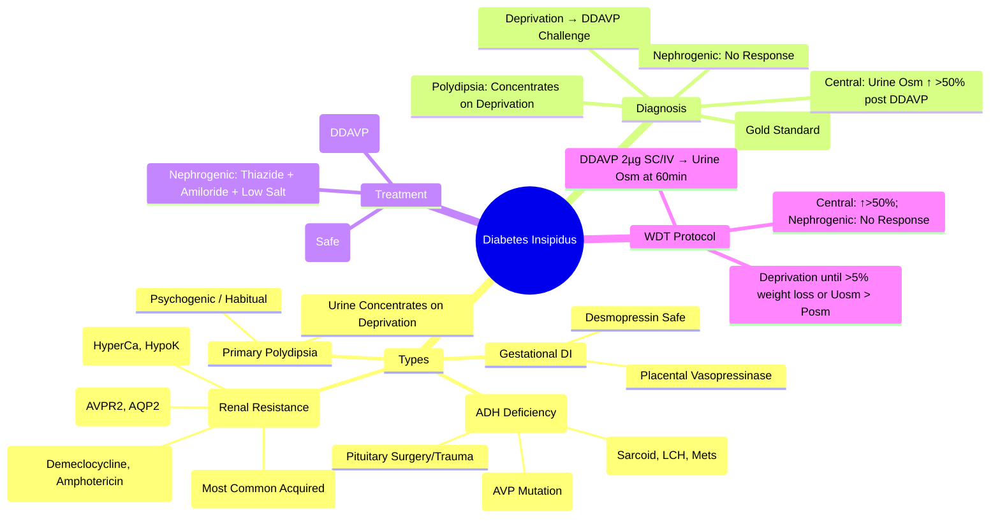

# Diabetes Insipidus (DI)

> [!info]
> **Diabetes Insipidus (DI) = Polyuria + Polydipsia due to ADH Deficiency (Central) or Renal Resistance (Nephrogenic).** **Central DI = ADH Deficiency**; **Nephrogenic DI = Renal Resistance**. **Water Deprivation Test + Desmopressin Challenge = Gold Standard Diagnostic Test**.

---

## 1. Learning Objectives
By the end of this note you should be able to:
- [ ] Differentiate Central DI, Nephrogenic DI, and Primary Polydipsia
- [ ] Perform and interpret Water Deprivation Test + Desmopressin Challenge
- [ ] Apply desmopressin therapy for Central DI
- [ ] Manage Nephrogenic DI (Thiazides, Amiloride, Low Salt Diet)
- [ ] Recognise Gestational DI and its management

---

## 2. Overview & Classification

| Type | Pathophysiology | ADH Level | Urine Osmolality | Desmopressin Response |
|------|-----------------|-----------|------------------|-----------------------|
| **Central DI** | **ADH Deficiency** (Pituitary/Stalk/Hypothalamic Lesion) | **Low** | Low (Dilute) | **Responds ↑ Urine Osm >50%** |
| **Nephrogenic DI** | **Renal Resistance to ADH** (V2 Receptor/AQP2 Defect) | **High/Normal** | Low (Dilute) | **No Response** |
| **Primary Polydipsia** | **Excessive Water Intake** (Psychogenic/Dipsogenic) | **Suppressed** | Low (Concentrates on Deprivation) | Concentrates on Deprivation |
| **Gestational DI** | Placental Vasopressinase Degrades ADH | Low/Normal | Dilute | Responds to Desmopressin |

---

## 2. Aetiology

### Central DI (CDI)
| Cause | Frequency | Details |
|---------|-----------|---------|
| **Idiopathic** | ~30% | Autoimmune (Lymphocytic Infundibuloneurohypophysitis) |
| **Pituitary Surgery / Trauma** | ~20% | Post-TSS, Head Trauma, Basal Skull Fracture |
| **Infiltration** | ~15% | Sarcoidosis, Langerhans Cell Histiocytosis, Metastases, Haemochromatosis |
| **Genetic** | Rare | AVP Gene Mutations (Autosomal Dominant) |
| **Pituitary Surgery/Apoplexy** | ~10% | Post-TSS, Pituitary Apoplexy |
| **Craniopharyngioma** | ~5% | Suprasellar Tumor Compressing Stalk |

### Nephrogenic DI (NDI)
| Cause | Mechanism | Key Features |
|---------|-----------|--------------|
| **Lithium** | **Most Common Acquired** | ↓ AQP2 Expression, ↓ cAMP; Dose/Duration Dependent |
| **Drugs** | Demeclocycline, Amphotericin B, Foscarnet, Ofloxacin, Ifosfamide | V2 Receptor / AQP2 Inhibition |
| **Electrolytes** | Hypercalcaemia, Hypokalaemia | Tubular Damage |
| **Obstructive Uropathy** | Tubulointerstitial Damage |
| **Genetic** | **AVPR2** (X-Linked Recessive), **AQP2** (AR) | Congenital NDI |

### Primary Polydipsia (Psychogenic)
| Feature | Details |
|---------|---------|
| **Aetiology** | Psychogenic (Schizophrenia), Habitual, Dipsogenic |
| **Mechanism** | Excess Water Intake → Suppresses ADH → Dilute Urine |
| **Key Feature** | **Urine Concentrates During Deprivation** (Unlike DI) |

### Gestational DI
| Feature | Details |
|---------|---------|
| **Cause** | Placental Vasopressinase Degrades ADH |
| **Onset** | 2nd/3rd Trimester |
| **Resolution** | **Postpartum (4-6 Weeks)** |
| **Treatment** | **Desmopressin** (Safe in Pregnancy); Monitor Fluid Balance |
| **Recurrence** | **High in Subsequent Pregnancies** |

---

## 2. Clinical Presentation

| Feature | Central DI | Nephrogenic DI | Primary Polydipsia |
|---------|------------|----------------|---------------------|
| **Polyuria** | >3-4 L/day | >3-4 L/day | >3-4 L/day |
| **Polydipsia** | Profound Thirst, Nocturia | Profound Thirst, Nocturia | Compulsive Drinking |
| **Urine Osmolality** | **Low (<300 mOsm/kg)** | **Low (<300 mOsm/kg)** | Low/Variable (Concentrates on Deprivation) |
| **Serum Osmolality** | **High (>295 mOsm/kg)** | **High** | Normal/ Low |
| **Serum Sodium** | **High (>145 mmol/L)** | **High** | Normal/Low |
| **ADH Level** | **Low/Undetectable** | **High** | Suppressed |

---

## 3. Diagnostic Algorithm — Water Deprivation Test (WDT)

### Protocol
| Phase | Procedure | Stop Criteria |
|-------|-----------|---------------|
| **1. Fluid Deprivation** | NPO + Fluid Restriction; Weight, Serum/Urine Osmolality q1-2h | Weight Loss >5%; Urine Osm > Plasma Osm; Haemodynamic Instability |
| **2. Desmopressin Challenge** | **DDAVP 2µg SC/IV** (or 10-40µg Intranasal) | Measure Urine Osm at 60min |

### Interpretation Matrix

| Result | Central DI | Nephrogenic DI | Primary Polydipsia |
|--------|------------|----------------|-------------------|
| **Baseline Urine Osm** | Low (<300) | Low (<300) | Low/Variable |
| **After Deprivation** | Low (<300) | Low (<300) | **Concentrates (>600)** |
| **Post-DDAVP (60min)** | **↑ >50%** | **No Response (<10%)** | N/A (Already Concentrated) |
| **Plasma ADH** | Low | High | Low (Suppressed) |

### Stop Criteria (Safety)
| Criterion | Action |
|-----------|--------|
| **Weight Loss >5%** | STOP |
| **Urine Osm > Plasma Osm** | STOP |
| **Haemodynamic Instability** (SBP<90, HR>120) | STOP |
| **Time >8 Hours** | STOP |

---

## 3. Desmopressin (DDAVP) Therapy

### Central DI
| Route | Dose | Frequency |
|-------|------|---------|
| **Intranasal** | 10-40µg | q12-24h |
| **Oral (Tablet)** | 0.1-0.4mg | q12-24h |
| **Subcutaneous / IV** | 2-4µg | q12-24h |
| **Dose Titration** | **Target: Urine Output 1.5-2.5L/day**, No Nocturia, Normal Na⁺ | |

### Nephrogenic DI
| Treatment | Dose | Mechanism |
|---------|------|-----------|
| **Low Salt / Low Protein Diet** | — | Reduces Solute Load |
| **Thiazide Diuretic** | **Hydrochlorothiazide 25-50mg BD** | Induces Mild Volume Depletion → ↑ Proximal Reabsorption |
| **Amiloride** | 5-10mg BD | ENaC Blocker; K⁺-Sparing |
| **NSAIDs (Indomethacin)** | 25-50mg TDS | ↑ Prostaglandin Inhibition → ↓ PGE2 → ↑ ADH Sensitivity |
| **Desmopressin** | **Partial Response** (If Partial NDI) | Limited Role |

---

## 3. Gestational DI

| Feature | Details |
|---------|---------|
| **Cause** | Placental Vasopressinase Degrades ADH |
| **Onset** | 2nd/3rd Trimester |
| **Resolution** | **Postpartum (4-6 Weeks)** |
| **Treatment** | **Desmopressin** (Safe in Pregnancy); Monitor Fluid Balance |
| **Recurrence** | **High in Subsequent Pregnancies** |

---

## 4. Differential Diagnosis

| Feature | Central DI | Nephrogenic DI | Primary Polydipsia |
|---------|------------|----------------|---------------------|
| **Serum Osmolality** | >295 mOsm/kg | >295 mOsm/kg | Normal/Low |
| **Urine Osmolality** | <300 mOsm/kg | <300 mOsm/kg | Concentrates on Deprivation |
| **Urine Osm Post-DDAVP** | **↑ >50%** | **No Change** | N/A |
| **Plasma ADH** | Low | High | Suppressed |
| **Desmopressin Test** | **Positive Response** | **No Response** | Concentrates on Deprivation |

---

## 4. Management

### Central DI
| Aspect | Details |
|---------|---------|
| **Desmopressin (DDAVP)** | Intranasal 10-40µg q12-24h; Oral 0.1-0.4mg q12-24h; SC/IV 2-4µg q24h |
| **Dose Titration** | Start Low; Titrate to Urine Output 1.5-2.5L/day; Nocturia ≤1 |
| **Fluid Intake** | **No Restriction** (Ad Libitum) |
| **Adverse Effects** | **Hyponatraemia** (Water Retention) — Monitor Na⁺ |

### Nephrogenic DI
| Therapy | Dose | Role |
|-------|------|------|
| **Diet** | Low Salt, Low Protein | Reduce Solute Load |
| **Thiazide** | HCTZ 25-50mg BD | Induces Mild Volume Depletion → ↑ Proximal Reabsorption |
| **Amiloride** | 5-10mg BD | ENaC Blocker; K⁺-Sparing |
| **NSAIDs** | Indomethacin 25-50mg TDS | ↓ Prostaglandin → ↑ ADH Sensitivity |
| **Desmopressin** | Partial Response Only | If Partial NDI |

---

## 4. Complications & Monitoring

| Complication | Monitoring |
|--------------|------------|
| **Hyponatraemia** | Serum Na⁺ q6-12h (If on Desmopressin) |
| **Water Intoxication** | Fluid Restriction if Severe; Stop Desmopressin |
| **Hypernatraemia** | If Desmopressin Missed/Dose Inadequate |
| **Breakthrough Polyuria** | Dose Escalation / Split Dosing |

---

## 5. Exam Pearls (FCPS/MRCP)

| Topic | Key Point |
|-------|-----------|
| **DI vs SIADH** | DI = Polyuria + Dilute Urine + High Serum Osm; SIADH = Hyponatraemia + Concentrated Urine |
| **Central vs Nephrogenic DI** | Central: **ADH Low, Responds to DDAVP**; Nephrogenic: **ADH High, No DDAVP Response** |
| **WDT Stop Criteria** | Weight Loss >5% OR Urine Osm > Plasma Osm OR Haemodynamic Instability |
| **Central DI Treatment** | **Desmopressin (DDAVP)** — Intranasal/Oral/SC/IV |
| **Nephrogenic DI Treatment** | **Thiazide + Amiloride + Low Salt Diet** (Desmopressine Ineffective) |
| **Lithium** | **Most Common Cause of Acquired NDI** (↓ AQP2, ↓ cAMP) |
| **Primary Polydipsia** | **Urine Concentrates on Deprivation**; DDAVP Not Needed |
| **Gestational DI** | Placental Vasopressinase; **Desmopressin Safe**; Resolves Postpartum |
| **WDT Stop Criteria** | Weight Loss >5%, Urine Osm > Plasma Osm, Haemodynamic Instability |
| **Desmopressin Hyponatraemia** | Monitor Na⁺; Limit Fluids if on DDAVP |
| **Lithium NDI** | ↓ AQP2 Expression → Stop Lithium if Possible |
| **Central vs Nephrogenic DI** | **DDAVP Response**: Central = ↑ Urine Osm >50%; Nephrogenic = No Response |

---

## 8. Confusions & Mnemonics

| Confusion | Clarification |
|-----------|---------------|
| **Central vs Nephrogenic DI** | Central = ADH Deficiency; Nephrogenic = Renal Resistance to ADH |
| **DDAVP Response** | Central = **Works**; Nephrogenic = **Fails** |
| **Primary Polydipsia vs DI** | Polydipsia: Urine Concentrates on Deprivation; DI = Fails to Concentrate |
| **Gestational DI** | Placental Vasopressinase → ADH Degradation; Resolves Postpartum |
| **Lithium NDI** | ↓ AQP2 Expression; ↓ cAMP; Most Common Acquired NDI |
| **Desmopressin vs Vasopressin** | DDAVP = Pure V2 Agonist (No Pressor Effect); Vasopressin = V1+V2 |
| **Desmopressin in Enuresis** | Intranasal/Oral at Bedtime; No Fluid Restriction Needed |
| **WDT Stop** | Weight Loss >5% OR Urine Osm > Plasma Osm |

---

## 9. Mind Map

---

## 9. Exam Pearls (FCPS/MRCP)

| Topic | Key Point |
|-------|-----------|
| **Central vs Nephrogenic DI** | Central: ADH Low → DDAVP Response; Nephrogenic: ADH High → DDAVP No Response |
| **WDT Gold Standard** | Deprivation → DDAVP Challenge |
| **Central DI** | DDAVP → Urine Osm ↑ >50% |
| **Nephrogenic DI** | DDAVP → No Response |
| **Primary Polydipsia** | Urine Concentrates on Deprivation (No DDAVP Needed) |
| **Gestational DI** | Placental Vasopressinase → ADH Degradation → Desmopressin Safe |
| **Lithium NDI** | **Most Common Acquired NDI** (↓ AQP2, ↓ cAMP) |
| **DDAVP in Central DI** | Intranasal/Oral/SC/IV; Monitor Na+ (Hyponatraemia Risk) |
| **NDI Management** | Thiazide + Amiloride + Low Salt Diet; Desmopressine Not Effective |
| **WDT Stop Criteria** | Weight Loss >5% OR Urine Osm > Plasma Osm |

---

---

## One-Page Revision Summary
- Diabetes Insipidus: Key definitions, diagnostic criteria, and management algorithm
- Critical lab cut-offs and severity thresholds
- Stepwise management algorithm
- Key complications and monitoring parameters

---

## 24-Hour Recall Prompts
- Explain Diabetes Insipidus in 2 minutes without looking at the note
- Write the core diagnostic algorithm from memory
- State first-line management and one important contraindication/caution
- Compare Diabetes Insipidus with one close differential diagnosis

---

## 7-Day / 15-Day / 30-Day Revision Tracker
- [ ] Day 1 completed
- [ ] 24-hour recall completed
- [ ] Day 7 revision completed
- [ ] Day 15 revision completed
- [ ] Day 30 revision completed

---

## Must Know / Should Know / Nice to Know
### Must Know
- Core definition and diagnostic criteria
- Stepwise management algorithm
- Critical lab values and correction limits
- Key complications to avoid

### Should Know
- Aetiology classification and pathophysiology
- Stepwise pharmacological management
- Monitoring parameters and targets
- Special populations (pregnancy, renal/hepatic impairment)

### Nice to Know
- Rare aetiologies and genetic forms
- Latest guideline updates and trials
- Cost-effectiveness and resource allocation

---

## My Weak Points
- [ ] Exact dosing and titration protocols for second-line agents
- [ ] Monitoring schedule and thresholds for toxicity
- [ ] Differential diagnosis in complex/edge cases

---

## Self-Test Scorecard
- Understanding: /10
- Recall: /10
- MCQ Performance: /10
- SBA Performance: /10
- Viva Confidence: /10
- Total: /50

> [!tip]
> Interpretation: <35 = weak topic, 35-44 = acceptable but insecure, 45+ = strong exam-ready topic.

---

## Exam Answer Modes
### Long Answer Skeleton
1. Definition, classification, and pathophysiology
2. Diagnostic criteria and algorithm
3. Management: stepwise approach with doses
4. Complications, monitoring, and special situations

### Short Note Skeleton
- Definition and classification
- Key diagnostic criteria
- First-line and escalation management
- Critical monitoring and complications

### Viva One-Liners
- Diabetes Insipidus definition and key threshold
- Diagnostic algorithm in 3 steps
- First-line management and escalation
- Critical monitoring parameter
- One complication to never miss

### Ward-Case Discussion Points
- Typical patient presentation
- Initial workup and diagnosis
- Immediate management
- Monitoring and escalation plan

### Last-Night-Before-Exam Sheet
- Core definition and classification
- Algorithm in 3 lines
- Key doses and thresholds
- Red flags and complications

---

## Summary
Diabetes Insipidus: Core definitions, stepwise diagnosis, algorithmic management, critical thresholds, monitoring, red flags.

---

## MCQs (10)
1. **Diabetes insipidus definition:**
   A. ADH excess
   B. ADH deficiency or renal resistance
   C. Renal tubular defect only
   D. Primary polydipsia
   *Answer: B*

2. **Central DI cause:**
   A. Lithium
   B. Pituitary surgery/trauma
   C. Hypercalcaemia
   D. Hypokalaemia
   *Answer: B*

3. **Nephrogenic DI cause:**
   A. Pituitary adenoma
   B. Lithium
   C. Pituitary surgery
   D. SIADH
   *Answer: B*

4. **Water deprivation test: urine concentrates ->**
   A. Central DI
   B. Nephrogenic DI
   C. Primary polydipsia
   D. SIADH
   *Answer: C*

5. **Central DI DDAVP response:**
   A. No response
   B. Urine osm ↑>50%
   C. Urine osm <10% rise
   D. Urine output doubles
   *Answer: B*

6. **Nephrogenic DI DDAVP:**
   A. Marks response
   B. No response (<10% rise)
   C. Urine output decreases
   D. Concentrates fully
   *Answer: B*

7. **Gestational DI cause:**
   A. Lithium
   B. Placental vasopressinase
   C. Pituitary infarct
   D. ADH excess
   *Answer: B*

8. **Primary polydipsia water depr:**
   A. Fails to concentrate
   B. Concentrates normally
   C. DDAVP no response
   D. Urine osm <100
   *Answer: B*

9. **Central DI treatment:**
   A. Thiazide
   B. DDAVP
   C. Low salt
   D. Fluid restrict
   *Answer: B*

10. **Nephrogenic DI treatment:**
   A. DDAVP
   B. Thiazide+Amiloride+Low salt
   C. High DDAVP
   D. Fluid restrict
   *Answer: B*

---

## SBA Questions (5)
1. **Clinical scenario-based question on Diabetes Insipidus:** What is the most appropriate next step in management?
   A. Option A
   B. Option B
   C. Option C
   D. Option D
   *Answer: A*

2. **Diagnostic challenge in Diabetes Insipidus:** Which test/investigation is most appropriate?
   A. Option A
   B. Option B
   C. Option C
   D. Option D
   *Answer: A*

3. **Management decision in Diabetes Insipidus:** When would you consider escalation?
   A. Option A
   B. Option B
   C. Option C
   D. Option D
   *Answer: A*

4. **Complication recognition in Diabetes Insipidus:** What is the most likely complication?
   A. Option A
   B. Option B
   C. Option C
   D. Option D
   *Answer: A*

5. **Monitoring question for Diabetes Insipidus:** Which parameter requires most frequent monitoring?
   A. Option A
   B. Option B
   C. Option C
   D. Option D
   *Answer: A*

---

## Flashcards
- Q: Diabetes insipidus definition:
  A: ADH deficiency or renal resistance
- Q: Central DI cause:
  A: Pituitary surgery/trauma
- Q: Nephrogenic DI cause:
  A: Lithium
- Q: Water deprivation test: urine concentrates ->
  A: Primary polydipsia
- Q: Central DI DDAVP response:
  A: Urine osm ↑>50%

---

## Answer Key with Explanations
### MCQs
B, B, B, C, B, B, B, B, B, B

### SBAs
1-A, 2-A, 3-A, 4-A, 5-A
