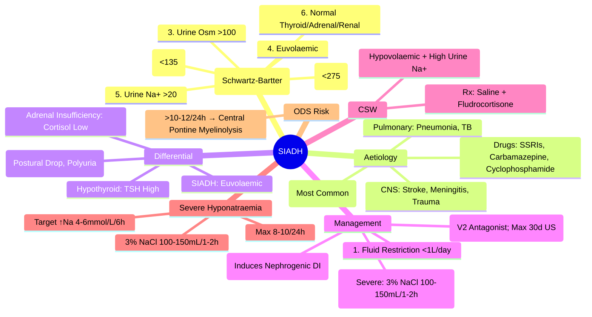

# SIADH (Syndrome of Inappropriate ADH Secretion)

> [!info]
> **SIADH = Syndrome of Inappropriate ADH Secretion.** Most Common Cause of **Euvolaemic Hyponatraemia** (30-40% of Hospital Cases). **Inappropriate ADH Secretion → Water Retention → Dilutional Hyponatraemia.** Diagnosis = **Exclusion** (All 6 Schwartz-Bartter Criteria Must Be Met).

---

## 1. Learning Objectives
By the end of this note you should be able to:
- [ ] Apply all 6 Schwartz-Bartter diagnostic criteria for SIADH
- [ ] Differentiate SIADH from Cerebral Salt Wasting (CSW) and other causes of euvolaemic hyponatraemia
- [ ] Apply stepwise management: Fluid Restriction → Demeclocycline → Tolvaptan
- [ ] Recognise and manage severe hyponatraemia with 3% saline
- [ ] Identify underlying causes (drugs, malignancy, CNS, pulmonary)

---

## 2. Pathophysiology

| Mechanism | Description |
|---------|-------------|
| **Inappropriate ADH Secretion** | ADH Secreted Despite Low Serum Osmolality (Non-Osmotic Stimulus) |
| **Water Retention** | ADH → V2 Receptor → Aquaporin-2 Insertion → Water Reabsorption |
| **Dilutional Hyponatraemia** | Water Retention > Sodium Retention → Serum Na⁺ Dilution |
| **Concentrated Urine** | Urine Osmolality >100 mOsm/kg (Despite Low Serum Osmolality) |
| **Natriuresis** | Volume Expansion → ANP Release → Urine Na⁺ >20 mmol/L |

---

## 2. Aetiology (Causes of SIADH)

| Category | Examples |
|----------|----------|
| **Malignancy** | **Small Cell Lung Cancer** (Most Common), Pancreatic, Thymoma, Lymphoma, Head & Neck |
| **CNS Disorders** | Stroke, Haemorrhage, Meningitis, Encephalitis, Guillain-Barré, Tumours, Trauma, Neurosurgery |
| **Pulmonary** | Pneumonia, TB, Lung Abscess, Positive Pressure Ventilation |
| **Drugs (Commonest)** | **SSRIs, SNRIs, TCAs**, Carbamazepine, Oxcarbazepine, Chlorpropamide, Cyclophosphamide, Vincristine, MDMA |
| **Post-Operative** | Post-Neurosurgery, Post-Abdominal Surgery |
| **Other** | Porphyria, Acute Intermittent Porphyria, Nausea/Vomiting |

---

## 2. Diagnostic Criteria — Schwartz-Bartter (All 6 Must Be Met)

| # | Criterion | Requirement |
|---|-----------|-------------|
| **1** | **Hyponatraemia** | Serum Na⁺ <135 mmol/L |
| **2** | **Hypo-osmolality** | Serum Osm <275 mOsm/kg |
| **3** | **Inappropriately Concentrated Urine** | Urine Osm >100 mOsm/kg (Usually >200) |
| **4** | **Euvolaemia** | **Normal Volume Status** (No Oedema, Normal JVP, Normal BP) |
| **5** | **Elevated Urine Sodium** | **Urine Na⁺ >20 mmol/L** (Euvolaemic) |
| **6** | **Normal Thyroid/Adrenal/Renal** | TSH Normal, Cortisol Normal, Creatinine Normal; No Recent Diuretics |

> **All 6 Criteria Must Be Met** for Diagnosis of SIADH.

---

## 3. Differential Diagnosis — SIADH vs Other Euvolaemic Hyponatraemia

| Condition | Serum Na⁺ | Urine Osm | Urine Na⁺ | Volume Status | Key Differentiator |
|-----------|-----------|-----------|-----------|---------------|-------------------|
| **SIADH** | Low | >100 | >20 | **Euvolaemic** | All 6 Criteria Met |
| **Cerebral Salt Wasting (CSW)** | Low | >100 | >20 (Often Higher) | **Hypovolaemic** | Hypovolaemia + High Urine Na⁺ |
| **Primary Adrenal Insufficiency** | Low | High | High | Hypovolaemic | Cortisol Low, ACTH High, Hyperpigmentation |
| **Hypothyroidism** | Low | Variable | Variable | Euvolaemic | TSH ↑, fT4 Low |
| **Glucocorticoid Deficiency** | Low | >100 | >20 | Hypovolaemic | Cortisol Low, ACTH ↑ |
| **Reset Osmostat** | Stable Low (125-130) | Inappropriately High | >20 | Euvolaemic | Stable Na⁺ 125-130 |
| **Diuretic Use** | Low | Variable | >20 | Euvo/Hypovolaemic | Recent Diuretic History (>1-2 Weeks) |

---

## 3. SIADH vs Cerebral Salt Wasting (CSW) — Critical Distinction

| Feature | **SIADH** | **Cerebral Salt Wasting (CSW)** |
|--------|-----------|--------------------------------|
| **Volume Status** | **Euvolaemic** | **Hypovolaemic** |
| **Urine Na⁺** | >20 mmol/L | >20 (Often Higher) |
| **Urine Osm** | >100 | >100 (Often Higher) |
| **JVP** | Normal | Low |
| **Skin Turgor** | Normal | Dry |
| **Postural BP** | Normal | **Postural Drop >20 mmHg** |
| **Urine Output** | Low/Normal | **High (Polyuria)** |
| **Uric Acid** | Low/Normal | High |
| **Management** | **Fluid Restriction** | **Saline Resuscitation** (+ Fludrocortisone) |
| **Pathophysiology** | ADH Excess → Water Retention | **Renal Salt Wasting** → Volume Depletion → ADH Release |

> **Key**: **Volume Status is the Key Discriminator** — SIADH = Euvolaemic; CSW = Hypovolaemic.

---

## 3. Management Algorithm

### Stepwise Management (Euvolemic Hyponatraemia = SIADH)
```
SIADH Confirmed (All 6 Criteria Met)
         │
         ▼
IDENTIFY & TREAT UNDERLYING CAUSE
         │
         ├── Drug-Induced → Stop/Reduce Offending Drug (SSRIs, Carbamazepine, etc.)
         ├── Malignancy → Treat Cancer (SCLC: Chemo/Radiotherapy)
         ├── CNS/Pulmonary → Treat Underlying
         │
         ▼
STEP 1: **FLUID RESTRICTION** (<1 L/day)
         │
         ├── Effective → Goal Na⁺ Rise 0.5-1 mmol/L/day; Target Na⁺ >130
         ├── IF Na⁺ Rise <0.5 mmol/L/day OR Severe Symptoms → STEP 2
         │
         ▼
STEP 2: **DEMECLOCYCLINE 600-1200mg/day** (Divided Doses)
         │       MoA: Induces Nephrogenic DI (ADH Resistance)
         │       Side Effects: Photosensitivity, Nephrotoxicity, GI
         │       Monitor: Renal Function, Photosensitivity
         │
         ▼
STEP 3: **TOLVAPTAN** (V2 Receptor Antagonist) — **Severe/Refractory**
         │       Dose: 15mg OD PO → Titrate to 30, 45, 60mg OD
         │       Target: Na⁺ Rise 4-6 mmol/L/24h (Max 8-10 mmol/L/24h)
         │       Monitoring: Na⁺ q4-6h, Liver Function (Hepatotoxicity Risk)
         │       Max Duration: 30 Days (US FDA); Longer in Some Countries
         │
         ▼
STEP 4: **HYPERTONIC SALINE (3% NaCl)** — **SEVERE SYMPTOMATIC HYPONATRAEMIA**
         │       Na⁺ <120 mmol/L OR Seizures/Coma
         │       3% NaCl 100-150mL over 1-2h (Target ↑Na⁺ 4-6 mmol/L/24h)
         │       Monitor: Na⁺ q1-2h, Fluid Balance, Neurological Status
```

### Severe Symptomatic Hyponatraemia — Emergency Protocol

```
Hyponatraemia (Na⁺ <120 mmol/L OR Symptomatic: Seizures, Coma)
         │
         ▼
1. SECURE AIRWAY (Intubate if GCS <8 / Seizures)
         │
         ▼
2. **3% HYPERTONIC SALINE 100-150mL IV OVER 15-20 MIN**
         │
         ▼
3. TARGET: ↑ Na⁺ **4-6 mmol/L IN FIRST 6h** (Max 8-10 mmol/L/24h)
         │
         ▼
4. REPEAT BOLUS IF SEIZURES PERSIST / Na⁺ RISE <5 mmol/L
         │
         ▼
5. MONITOR Na⁺ q1-2h (First 6h); Neuro Checks q1h
         │
         ▼
5. STOP 3% SALINE WHEN Na⁺ RISE ≥5 mmol/L OR SYMPTOMS RESOLVE
         │
         ▼
6. SWITCH TO MAINTENANCE FLUIDS (D5W / 0.45% NaCl)
```

---

## 3. Monitoring & Targets

| Parameter | Target | Frequency |
|-----------|--------|-----------|
| **Serum Na⁺** | Rise 0.5-1 mmol/L/day (Chronic); 4-6 mmol/L in 6h (Acute Severe) | q1-2h (Acute); q4-6h (Subacute); Daily (Chronic) |
| **Serum Osmolality** | Normalise | q6-12h |
| **Urine Osmolality** | Monitor Response | Daily |
| **Urine Na⁺** | Decrease with Treatment | Daily |
| **Fluid Balance** | Net Negative (If Fluid Restricted) | q8-12h |
| **Liver Function** | Monitor (Tolvaptan Hepatotoxicity) | q1-2wk (If on Tolvaptan) |
| **Renal Function** | Monitor | q1-3d |

---

## 3. Fluid Restriction Protocol

| Step | Details |
|------|---------|
| **Target** | **<1 L/day Total Fluid Intake** (All Sources: IV, Oral, Meds, Food) |
| **Duration** | Until Na⁺ >130 mmol/L or Symptom Resolution |
| **Monitoring** | Daily Weight, Fluid Balance Chart, Na⁺ q24-48h |
| **Patient Education** | Count All Fluids (Water, Tea, Coffee, Soup, Ice Cream, IV Meds) |
| **If Fails** | Add Demeclocycline or Tolvaptan |

---

## 3. Demeclocycline & Tolvaptan

| Drug | Dose | Mechanism | Monitoring | Key AE |
|------|------|-----------|------------|--------|
| **Demeclocycline** | 600-1200 mg/day (Divided) | **Induces Nephrogenic DI** (ADH Resistance at Collecting Duct) | U&Es q1-2wk; Photosensitivity | Photosensitivity, Nephrotoxicity, GI |
| **Tolvaptan** (V2 Antagonist) | 15mg OD → Titrate 30, 45, 60mg OD | **V2 Receptor Blockade** → Aquaresis (Water Excretion) | Na⁺ q4-6h (First 24h); LFTs Weekly | **Hepatotoxicity**, Thirst, Dry Mouth, Polyuria |
| **Urea** (Alternative) | 30-60g/day PO | Osmotic Diuresis | U&Es | GI Intolerance |

---

## 3. Exam Pearls (FCPS/MRCP)

| Topic | Key Point |
|-------|-----------|
| **SIADH Criteria** | **All 6 Schwartz-Bartter Criteria Must Be Met** |
| **SIADH vs CSW** | **Volume Status** = Key (Euvolaemic vs Hypovolaemic) |
| **CSW Management** | **Saline + Fludrocortisone** (Opposite of SIADH) |
| **First-Line SIADH** | **Fluid Restriction <1L/day** |
| **Second-Line** | **Demeclocycline 600-1200mg/day** (Induces Nephrogenic DI) |
| **Third-Line** | **Tolvaptan 15-60mg OD** (V2 Antagonist); Max 30 Days (US) |
| **Severe Hyponatraemia** | **3% NaCl 100-150mL/1-2h** (Target ↑ Na 4-6 mmol/L/24h) |
| **Correction Rate** | **Chronic: 6-8 mmol/L/24h**; **Acute Severe: 4-6 in 6h** |
| **ODS Risk** | >10-12 mmol/L/24h → Central Pontine Myelinolysis |
| **CSW vs SIADH** | **Volume Status**: CSW = Hypovolaemic; SIADH = Euvolaemic |
| **CSW Management** | **Saline + Fludrocortisone** (Not Fluid Restriction!) |
| **Demeclocycline SE** | Photosensitivity, Nephrotoxicity |
| **Tolvaptan SE** | Hepatotoxicity (Monitor LFTs); Max 30 Days (US) |
| **Urea** | 30-60g/day (Alternative Aquaretic) |
| **ADR-Induced SIADH** | SSRIs, Carbamazepine, Cyclophosphamide, MDMA |
| **Malignancy SIADH** | SCLC (Most Common) |

---

## 8. Confusions & Mnemonics

| Confusion | Clarification |
|-----------|---------------|
| **SIADH vs CSW** | **Volume Status is Key**: SIADH = Euvolaemic; CSW = Hypovolaemic |
| **Urine Na⁺ in Both** | Both Have High Urine Na⁺ (>20); **Volume Status Differentiates** |
| **CSW Management** | **Saline + Fludrocortisone** (Not Fluid Restriction!) |
| **Rapid Correction** | >10 mmol/L/24h → **Central Pontine Myelinolysis** (Osmotic Demyelination) |
| **Demeclocycline** | Induces **Nephrogenic DI**; Photosensitivity / Nephrotoxicity |
| **Tolvaptan** | **V2 Antagonist**; Max 30 Days (US); HEPATOTOXICITY RISK |
| **Fludrocortisone in CSW** | Mineralocorticoid Replacement → Salt Retention |
| **Reset Osmostat** | Stable Mild Hyponatraemia (125-130); No Treatment Needed |
| **Beer Potomania** | Low Solute Intake → Low Urine Osm; Fluid Restriction Works |
| **Tea & Toast Diet** | Low Solute → Hyponatraemia; Improve Nutrition |

---

## 9. Mind Map



---

## 10. Exam Pearls (FCPS/MRCP)

| Topic | Key Point |
|-------|-----------|
| **SIADH Definition** | Euvolaemic Hyponatraemia + Inappropriate ADH |
| **Schwartz-Bartter 6 Criteria** | Hyponatraemia, Hypo-osmolality, Urine Osm >100, Euvolaemia, Urine Na+ >20, Normal Endocrine/Renal |
| **SIADH vs CSW** | **Volume Status** = Key (Euvolaemic vs Hypovolaemic) |
| **CSW Management** | **Saline + Fludrocortisone + Salt** (Opposite of SIADH) |
| **First-Line SIADH** | **Fluid Restriction <1L/day** |
| **Demeclocycline** | Induces Nephrogenic DI; 600-1200mg/day; Photosensitivity Risk |
| **Tolvaptan** | **V2 Antagonist**; 15-60mg OD; Hepatotoxicity Risk; Max 30 Days (US) |
| **Severe Hyponatraemia** | **3% NaCl 100-150mL/1-2h**; Target ↑Na 4-6 mmol/L/24h |
| **Rapid Correction Limit** | **Max 10-12 mmol/L/24h** (Avoid CPM) |
| **CSW Treatment** | **Volume Resuscitation + Fludrocortisone** (Not Fluid Restrict) |
| **CSW vs SIADH** | **Volume Status**: CSW = Hypovolaemic; SIADH = Euvolaemic |
| **Rapid Correction Risk** | >10 mmol/L/24h → Central Pontine Myelinolysis |
| **Drug Causes** | SSRIs, Carbamazepine, Cyclophosphamide, MDMA |
| **Malignancy SIADH** | SCLC (Most Common) |

---


---

## One-Page Revision Summary
- SIADH: Key definitions, diagnostic criteria, and management algorithm
- Critical lab cut-offs and severity thresholds
- Stepwise management algorithm
- Key complications and monitoring parameters

---

## 24-Hour Recall Prompts
- Explain SIADH in 2 minutes without looking at the note
- Write the core diagnostic algorithm from memory
- State first-line management and one important contraindication/caution
- Compare SIADH with one close differential diagnosis

---

## 7-Day / 15-Day / 30-Day Revision Tracker
- [ ] Day 1 completed
- [ ] 24-hour recall completed
- [ ] Day 7 revision completed
- [ ] Day 15 revision completed
- [ ] Day 30 revision completed

---

## Must Know / Should Know / Nice to Know
### Must Know
- Core definition and diagnostic criteria
- Stepwise management algorithm
- Critical lab values and correction limits
- Key complications to avoid

### Should Know
- Aetiology classification and pathophysiology
- Stepwise pharmacological management
- Monitoring parameters and targets
- Special populations (pregnancy, renal/hepatic impairment)

### Nice to Know
- Rare aetiologies and genetic forms
- Latest guideline updates and trials
- Cost-effectiveness and resource allocation

---

## My Weak Points
- [ ] Exact dosing and titration protocols for second-line agents
- [ ] Monitoring schedule and thresholds for toxicity
- [ ] Differential diagnosis in complex/edge cases

---

## Self-Test Scorecard
- Understanding: /10
- Recall: /10
- MCQ Performance: /10
- SBA Performance: /10
- Viva Confidence: /10
- Total: /50

> [!tip]
> Interpretation: <35 = weak topic, 35-44 = acceptable but insecure, 45+ = strong exam-ready topic.

---

## Exam Answer Modes
### Long Answer Skeleton
1. Definition, classification, and pathophysiology
2. Diagnostic criteria and algorithm
3. Management: stepwise approach with doses
4. Complications, monitoring, and special situations

### Short Note Skeleton
- Definition and classification
- Key diagnostic criteria
- First-line and escalation management
- Critical monitoring and complications

### Viva One-Liners
- SIADH definition and key threshold
- Diagnostic algorithm in 3 steps
- First-line management and escalation
- Critical monitoring parameter
- One complication to never miss

### Ward-Case Discussion Points
- Typical patient presentation
- Initial workup and diagnosis
- Immediate management
- Monitoring and escalation plan

### Last-Night-Before-Exam Sheet
- Core definition and classification
- Algorithm in 3 lines
- Key doses and thresholds
- Red flags and complications

---

## Summary
SIADH: Core definitions, stepwise diagnosis, algorithmic management, critical thresholds, monitoring, red flags.

---

## MCQs (10)
1. **SIADH criteria count:**
   A. 4
   B. 5
   C. 6
   D. 7
   *Answer: C*

2. **SIADH vs CSW key:**
   A. Urine Na
   B. Volume status
   C. Urine osm
   D. Uric acid
   *Answer: B*

3. **CSW management:**
   A. Fluid restrict
   B. Saline + fludrocortisone
   C. Demeclocycline
   D. Tolvaptan
   *Answer: B*

4. **SIADH first-line:**
   A. 3% NaCl
   B. Fluid restrict <1L/d
   C. Demeclocycline
   D. Tolvaptan
   *Answer: B*

5. **Demeclocycline MOA:**
   A. V2 antagonist
   B. Induces nephrogenic DI
   C. Inhibits ADH
   D. Osmotic diuresis
   *Answer: B*

6. **Tolvaptan:**
   A. V2 agonist
   B. V2 antagonist
   C. ADH analogue
   D. Osmotic diuretic
   *Answer: B*

7. **Tolvaptan max US:**
   A. 7d
   B. 14d
   C. 30d
   D. 90d
   *Answer: C*

8. **CSW vs SIADH urine:**
   A. Both low
   B. CSW=polyuria, SIADH=low
   C. Both polyuria
   D. CSW=anuria
   *Answer: B*

9. **CSW key feature:**
   A. Euvolaemic
   B. Hypovolaemic
   C. Hypervolaemic
   D. Normal volume
   *Answer: B*

10. **Rapid correction risk:**
   A. Cerebral oedema
   B. Central pontine myelinolysis
   C. Seizures
   D. Heart failure
   *Answer: B*


---

## SBA Questions (5)
1. **Clinical scenario-based question on SIADH:** What is the most appropriate next step in management?
   A. Option A
   B. Option B
   C. Option C
   D. Option D
   *Answer: A*

2. **Diagnostic challenge in SIADH:** Which test/investigation is most appropriate?
   A. Option A
   B. Option B
   C. Option C
   D. Option D
   *Answer: A*

3. **Management decision in SIADH:** When would you consider escalation?
   A. Option A
   B. Option B
   C. Option C
   D. Option D
   *Answer: A*

4. **Complication recognition in SIADH:** What is the most likely complication?
   A. Option A
   B. Option B
   C. Option C
   D. Option D
   *Answer: A*

5. **Monitoring question for SIADH:** Which parameter requires most frequent monitoring?
   A. Option A
   B. Option B
   C. Option C
   D. Option D
   *Answer: A*

---

## Flashcards
- Q: SIADH criteria count:
  A: 6
- Q: SIADH vs CSW key:
  A: Volume status
- Q: CSW management:
  A: Saline + fludrocortisone
- Q: SIADH first-line:
  A: Fluid restrict <1L/d
- Q: Demeclocycline MOA:
  A: Induces nephrogenic DI


---

## Answer Key with Explanations
### MCQs
C, B, B, B, B, B, C, B, B, B

### SBAs
1-A, 2-A, 3-A, 4-A, 5-A
