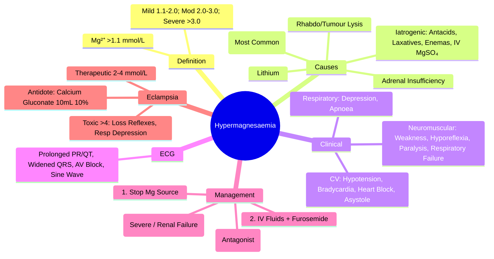

# Hypermagnesaemia

> [!info]
> **Hypermagnesaemia = Serum Mg²⁺ >1.1 mmol/L.** Uncommon but Potentially Life-Threatening. **Primary Cause: Renal Failure** (Impaired Excretion). **Iatrogenic Causes**: Mg²⁺-Containing Antacids, Laxatives, Enemas, IV MgSO₄. **Severe (>2.0) = Neuromuscular & Cardiac Depression → Respiratory Failure, Cardiac Arrest.**

---

## 1. Learning Objectives
By the end of this note you should be able to:
- [ ] Recognise causes of hypermagnesaemia (renal failure, iatrogenic, adrenal insufficiency)
- [ ] Identify clinical features: neuromuscular weakness, hypotension, heart block, respiratory depression
- [ ] Apply management: stop source, IV fluids + furosemide, dialysis for severe/renal failure
- [ ] Recognise drug-induced causes (antacids, laxatives, enemas, IV MgSO₄)

---

## 2. Aetiology

### Renal Failure (Most Common Cause)
| Condition | Mechanism |
|---------|-----------|
| **Acute Kidney Injury (AKI)** | Impaired Renal Excretion |
| **Chronic Kidney Disease (CKD) Stage 4-5** | ↓ GFR → ↓ Mg²⁺ Excretion |
| **Dialysis Patients** | Missed/Inadequate Dialysis + Mg²⁺-Containing Dialysate (Rare) |

### Iatrogenic / Exogenous Sources
| Source | Details |
|--------|---------|
| **Mg²⁺-Containing Antacids** (MgOH₂, MgCO₃) | Common in CKD (Avoid) |
| **Mg²⁺-Containing Laxatives** (Mg Citrate, Mg Hydroxide) | Chronic Use / Overdose |
| **Mg²⁺ Enemas** (Mg Citrate, Mg Sulfate) | Rectal Absorption (Underestimated) |
| **IV Magnesium Sulphate** | High-Dose/Infusion (Eclampsia Treatment, Hypomagnesaemia Repletion) |
| **Mg²⁺-Containing Cathartics** (Bowel Prep) | Pre-Endoscopy/Colonoscopy |

### Other Causes
| Condition | Mechanism |
|---------|----------|
| **Adrenal Insufficiency (Addison's)** | ↓ Aldosterone → ↓ Na⁺ Reabsorption → ↓ Mg²⁺ Excretion |
| **Rhabdomyolysis** | Muscle Cell Lysis → Mg²⁺ Release (Transient) |
| **Tumour Lysis Syndrome** | Cell Lysis → Mg²⁺ Release |
| **Lithium Therapy** | ↓ Renal Mg²⁺ Excretion |
| **Familial Hypocalciuric Hypercalcaemia (FHH)** | CaSR Mutation → Impaired Mg²⁺ Sensing |

---

## 2. Clinical Features

### Neuromuscular
| Severity | Serum Mg²⁺ | Features |
|----------|------------|----------|
| **Mild** | 1.1-2.0 | Hyporeflexia, Mild Weakness, Fatigue |
| **Moderate** | 2.0-3.0 | **Marked Weakness**, **Hyporeflexia/Areflexia**, Lethargy, Confusion |
| **Severe** | **>3.0** | **Flaccid Paralysis**, **Respiratory Depression** (Diaphragm Weakness), **Apnoea** |

### Cardiovascular
| Feature | Severity |
|---------|----------|
| **Hypotension** | Vasodilation + ↓ Vascular Tone |
| **Heart Block** (1st, 2nd, 3rd Degree) | **Conduction Depression** |
| **Bradycardia** | Sinoatrial/AV Node Depression |
| **Cardiac Arrest** | Asystole/PEA (Severe >3.0) |

### Respiratory
| Feature | Significance |
|---------|--------------|
| **Respiratory Depression** | Diaphragm/Intercostal Weakness |
| **Apnoea** | **Life-Threatening** (Requires Intubation) |

### Other
| Feature | Details |
|---------|---------|
| **Ileus** | Smooth Muscle Relaxation |
| **Nausea/Vomiting** | CNS Depression |
| **Confusion/Coma** | CNS Depression (Severe) |
| **Urinary Retention** | Detrusor Weakness |

---

## 2. Severity Classification

| Category | Serum Mg²⁺ (mmol/L) | Clinical Features |
|----------|---------------------|-------------------|
| **Mild** | **1.1-2.0** | Hyporeflexia, Mild Weakness, Nausea |
| **Moderate** | **2.0-3.0** | Weakness, Hyporeflexia/Areflexia, Hypotension, ECG Changes |
| **Severe** | **>3.0** | **Flaccid Paralysis, Respiratory Failure, Heart Block, Cardiac Arrest** |

---

## 2. ECG Changes

| Mg²⁺ Range | ECG Findings |
|------------|--------------|
| **1.1-2.0** | Prolonged PR, Prolonged QT, Widened QRS |
| **2.0-3.0** | **Widened QRS**, Prolonged PR/QT, **2nd/3rd Degree AV Block** |
| **>3.0** | **Sine Wave Pattern**, **Asystole/PEA**, Complete Heart Block |

> **Contrast with Hyperkalaemia**: Both Cause Widened QRS/Heart Block, But Hypermagnesaemia Typically Has **Profound Hyporeflexia/Weakness** and **Hypotension**.

---

## 2. Diagnosis

| Test | Normal | Hypermagnesaemia |
|------|--------|------------------|
| **Serum Mg²⁺** | 0.7-1.1 mmol/L | **>1.1 mmol/L** |
| **Serum Creatinine** | Normal | Often Elevated (Renal Failure) |
| **Serum K⁺** | Normal | Normal/High (If Renal Failure) |
| **Serum Ca²⁺** | Normal | Normal/Low |
| **ECG** | Normal | Prolonged PR/QT, Widened QRS, AV Block |

---

## 3. Differential Diagnosis

| Condition | Mg²⁺ | K⁺ | Ca²⁺ | Creatinine | Key Feature |
|---------|------|------|------|------------|-------------|
| **Hypermagnesaemia** | High | Normal/High | Normal/Low | **High (usually)** | Renal Failure/Iatrogenic |
| **Hyperkalaemia** | Normal | **High** | Normal | High | Peaked T, Widened QRS |
| **Hypercalcaemia** | Normal | Normal | **High** | Variable | Shortened QT, Polyuria |
| **Renal Failure** | High | High | Low/Normal | **High** | Uraemic Features |
| **Adrenal Insufficiency** | High | **High** | Normal | Normal | Hypotension, Hyperpigmentation |

---

## 3. Management

### Step 1: Stop Mg²⁺ Source
| Action | Details |
|--------|---------|
| **Stop All Mg²⁺-Containing Products** | Antacids, Laxatives, Enemas, IV MgSO₄, Cathartics |
| **Review Dialysate** | Ensure Mg²⁺-Free Dialysate (If on HD/PD) |
| **Review Medications** | Stop Mg²⁺-Containing Antacids/Laxatives/Enemas |

### Step 2: Enhance Excretion
| Intervention | Dose / Details |
|-------------|----------------|
| **IV Fluids** | **0.9% NaCl 1-2L Bolus** → Then 150-200 mL/hr (Promote Diuresis) |
| **Furosemide** | **40-80mg IV** (Loop Diuretic → ↑ Mg²⁺ Excretion) |
| **Saline + Furosemide** | **Mainstay** for Non-Dialysis Patients |

### Step 3: Dialysis (Definitive for Severe / Renal Failure)
| Indication | Modality |
|---------|---------|
| **Mg²⁺ >3.0 mmol/L** | **Intermittent HD** (Preferred; Rapid Removal) |
| **Severe Symptomatic** (Respiratory Failure, Heart Block) | **Emergency HD** |
| **Renal Failure** | **HD or SLED** (CVVHDF if Unstable) |
| **Refractory to Fluids/Furosemide** | Dialysis |

### Step 4: Supportive Care
| Issue | Management |
|---------|------------|
| **Respiratory Failure** | **Intubation + Mechanical Ventilation** |
| **Heart Block / Bradycardia** | **Atropine 0.5-1mg IV**; **Temporary Pacing** if Unresponsive |
| **Hypotension** | IV Fluids → Vasopressors (Noradrenaline) if Persistent |
| **Cardiac Arrest** | **Standard ALS** + **Dialysis** if Magnesium Cause |

---

## 3. Specific Scenarios

### Post-Partum / Eclampsia Treatment (IV MgSO₄ Toxicity)
| Level | Action |
|-------|--------|
| **Loss of Patellar Reflex** | Stop MgSO₄ Infusion |
| **Respiratory Depression** | Stop MgSO₄ → Calcium Gluconate 10% 10mL IV |
| **Respiratory Arrest** | Intubate + Ventilate + Calcium Gluconate 10% 10mL IV |
| **Cardiac Arrest** | ALS + Calcium Gluconate 10% 10mL IV |

### Antagonist: Calcium Gluconate
| Role | Dose |
|------|------|
| **Physiological Antagonist** | **Calcium Gluconate 10% 10mL IV** (Over 5-10 min) |
| **Mechanism** | Antagonises Mg²⁺ Effect on Neuromuscular Junction & Cardiac Conduction |
| **Onset** | Immediate |
| **Repeat** | Every 10-15 min if Persistent Toxicity |

---

## 3. Exam Pearls (FCPS/MRCP)

| Topic | Key Point |
|-------|-----------|
| **Hypermagnesaemia Definition** | **Mg²⁺ >1.1 mmol/L** |
| **Most Common Cause** | **Renal Failure** (Impaired Excretion) |
| **Iatrogenic Causes** | **Antacids, Laxatives, Enemas, IV MgSO₄** (Antacids in CKD Common) |
| **Severe Threshold** | **>3.0 mmol/L** → Flaccid Paralysis, Respiratory Failure, Heart Block |
| **ECG** | Prolonged PR/QT, Widened QRS, AV Block, Sine Wave (>3.0) |
| **Antagonist** | **Calcium Gluconate 10% 10mL IV** (Physiological Antagonist) |
| **Eclampsia MgSO₄ Toxicity** | Loss of Reflexes → Stop MgSO₄; Respiratory Depression → Calcium Gluconate |
| **Renal Failure** | Most Common Cause; Dialysis Definitive Treatment |
| **Adrenal Insufficiency** | Can Cause Hypermagnesaemia (↓ Aldosterone → ↓ Mg²⁺ Excretion) |
| **MgSO₄ Antagonist** | **Calcium Gluconate 10% 10mL IV** (Immediate) |
| **Dialysis** | **Definitive for Severe / Renal Failure** (Rapid Removal) |

---

## 8. Confusions & Mnemonics

| Confusion | Clarification |
|-----------|---------------|
| **Hypermagnesaemia vs Hyperkalaemia** | **Hypermagnesaemia = Profound Weakness/Hyporeflexia/Hypotension**; Hyperkalaemia = Peaked T Waves, No Profound Weakness |
| **Hypermagnesaemia vs Hypercalcaemia** | Hypermagnesaemia = Hypotension/Weakness; Hypercalcaemia = Polyuria, Stones, Shortened QT |
| **MgSO₄ in Eclampsia** | **Therapeutic Range 2-4 mmol/L**; Toxic >4 → Loss of Reflexes → **Stop MgSO₄ + Calcium Gluconate** |
| **Calcium as Antagonist** | **Calcium Gluconate 10% 10mL IV** = Physiological Antagonist at NMJ & Conduction |
| **Renal Failure** | **Most Common Cause**; Dialysis Definitive |
| **MgSO₄ vs Mg Citrate** | MgSO₄ IV (Eclampsia); Mg Citrate Oral (Laxative/Bowel Prep) |
| **MgSO₄ Antidote** | **Calcium Gluconate 10% 10mL IV** (Immediate) |
| **Dialysis Indication** | Mg²⁺ >3.0 or Severe Symptomatic / Renal Failure / Refractory to Diuresis |

---

## 9. Mind Map

---

## 9. Exam Pearls (FCPS/MRCP)

| Topic | Key Point |
|-------|-----------|
| **Hypermagnesaemia Definition** | **Mg²⁺ >1.1 mmol/L** |
| **Most Common Cause** | **Renal Failure** (Impaired Excretion) |
| **Iatrogenic Causes** | **Mg-Containing Antacids, Laxatives, Enemas, IV MgSO₄** |
| **Severe Threshold** | **>3.0 mmol/L** → Paralysis, Respiratory Failure, Heart Block |
| **ECG Changes** | Prolonged PR/QT, Widened QRS, AV Block, Sine Wave |
| **Antidote** | **Calcium Gluconate 10% 10mL IV** (Physiological Antagonist) |
| **Eclampsia MgSO₄ Toxicity** | Loss of Reflexes → Stop MgSO₄; Resp Depression → Calcium Gluconate |
| **Renal Failure** | **Most Common Cause**; Dialysis Definitive |
| **Adrenal Insufficiency** | ↓ Aldosterone → ↓ Mg²⁺ Excretion → Hypermagnesaemia |
| **MgSO₄ Antidote** | **Calcium Gluconate 10% 10mL IV** (Immediate) |
| **Dialysis** | **Definitive for Severe / Renal Failure** |
| **Adrenal Insufficiency** | Can Cause Hypermagnesaemia (↓ Aldosterone → ↓ Mg²⁺ Excretion) |

---

---

## One-Page Revision Summary
- Hypermagnesaemia: Key definitions, diagnostic criteria, and management algorithm
- Critical lab cut-offs and severity thresholds
- Stepwise management algorithm
- Key complications and monitoring parameters

---

## 24-Hour Recall Prompts
- Explain Hypermagnesaemia in 2 minutes without looking at the note
- Write the core diagnostic algorithm from memory
- State first-line management and one important contraindication/caution
- Compare Hypermagnesaemia with one close differential diagnosis

---

## 7-Day / 15-Day / 30-Day Revision Tracker
- [ ] Day 1 completed
- [ ] 24-hour recall completed
- [ ] Day 7 revision completed
- [ ] Day 15 revision completed
- [ ] Day 30 revision completed

---

## Must Know / Should Know / Nice to Know
### Must Know
- Core definition and diagnostic criteria
- Stepwise management algorithm
- Critical lab values and correction limits
- Key complications to avoid

### Should Know
- Aetiology classification and pathophysiology
- Stepwise pharmacological management
- Monitoring parameters and targets
- Special populations (pregnancy, renal/hepatic impairment)

### Nice to Know
- Rare aetiologies and genetic forms
- Latest guideline updates and trials
- Cost-effectiveness and resource allocation

---

## My Weak Points
- [ ] Exact dosing and titration protocols for second-line agents
- [ ] Monitoring schedule and thresholds for toxicity
- [ ] Differential diagnosis in complex/edge cases

---

## Self-Test Scorecard
- Understanding: /10
- Recall: /10
- MCQ Performance: /10
- SBA Performance: /10
- Viva Confidence: /10
- Total: /50

> [!tip]
> Interpretation: <35 = weak topic, 35-44 = acceptable but insecure, 45+ = strong exam-ready topic.

---

## Exam Answer Modes
### Long Answer Skeleton
1. Definition, classification, and pathophysiology
2. Diagnostic criteria and algorithm
3. Management: stepwise approach with doses
4. Complications, monitoring, and special situations

### Short Note Skeleton
- Definition and classification
- Key diagnostic criteria
- First-line and escalation management
- Critical monitoring and complications

### Viva One-Liners
- Hypermagnesaemia definition and key threshold
- Diagnostic algorithm in 3 steps
- First-line management and escalation
- Critical monitoring parameter
- One complication to never miss

### Ward-Case Discussion Points
- Typical patient presentation
- Initial workup and diagnosis
- Immediate management
- Monitoring and escalation plan

### Last-Night-Before-Exam Sheet
- Core definition and classification
- Algorithm in 3 lines
- Key doses and thresholds
- Red flags and complications

---

## Summary
Hypermagnesaemia: Core definitions, stepwise diagnosis, algorithmic management, critical thresholds, monitoring, red flags.

---

## MCQs (10)
1. **Hypermagnesaemia definition:**
   A. Mg>0.8
   B. Mg>1.0
   C. Mg>1.2
   D. Mg>0.8
   *Answer: B*

2. **Most common cause:**
   A. Antacids
   B. Renal failure
   C. Lithium
   D. Rhabdo
   *Answer: B*

3. **Severe hypermagnesaemia:**
   A. >1.5
   B. >2.0
   C. >3.0
   D. >2.5
   *Answer: C*

4. **Clinical features severe:**
   A. Hypertension
   B. Tachycardia
   C. Respiratory depression + hypotension
   D. Hyperreflexia
   *Answer: C*

5. **Treatment:**
   A. IV Calcium
   B. IV Calcium + Loop diuretic + Dialysis
   C. Oral binders
   D. Fluid restrict
   *Answer: B*

6. **IV Calcium dose:**
   A. 5mL 10% Ca gluconate
   B. 10mL 10% Ca gluconate
   C. 20mL
   D. 10% CaCl 10mL
   *Answer: B*

7. **Dialysis indication:**
   A. Mg>1.5
   B. Mg>2.0 symptomatic
   C. Mg>3.0 or symptomatic
   D. Mg>4.0
   *Answer: C*

8. **Mg effect on PTH:**
   A. Stimulates
   B. Inhibits
   C. No effect
   D. Variable
   *Answer: B*

9. **Renal failure Mg:**
   A. Low
   B. Normal
   C. High
   D. Variable
   *Answer: C*

10. **Mg excretion:**
   A. Gut only
   B. Renal only
   C. Both
   D. Neither
   *Answer: B*

---

## SBA Questions (5)
1. **Clinical scenario-based question on Hypermagnesaemia:** What is the most appropriate next step in management?
   A. Option A
   B. Option B
   C. Option C
   D. Option D
   *Answer: A*

2. **Diagnostic challenge in Hypermagnesaemia:** Which test/investigation is most appropriate?
   A. Option A
   B. Option B
   C. Option C
   D. Option D
   *Answer: A*

3. **Management decision in Hypermagnesaemia:** When would you consider escalation?
   A. Option A
   B. Option B
   C. Option C
   D. Option D
   *Answer: A*

4. **Complication recognition in Hypermagnesaemia:** What is the most likely complication?
   A. Option A
   B. Option B
   C. Option C
   D. Option D
   *Answer: A*

5. **Monitoring question for Hypermagnesaemia:** Which parameter requires most frequent monitoring?
   A. Option A
   B. Option B
   C. Option C
   D. Option D
   *Answer: A*

---

## Flashcards
- Q: Hypermagnesaemia definition:
  A: Mg>1.0
- Q: Most common cause:
  A: Renal failure
- Q: Severe hypermagnesaemia:
  A: >3.0
- Q: Clinical features severe:
  A: Respiratory depression + hypotension
- Q: Treatment:
  A: IV Calcium + Loop diuretic + Dialysis

---

## Answer Key with Explanations
### MCQs
B, B, C, C, B, B, C, B, C, B

### SBAs
1-A, 2-A, 3-A, 4-A, 5-A
