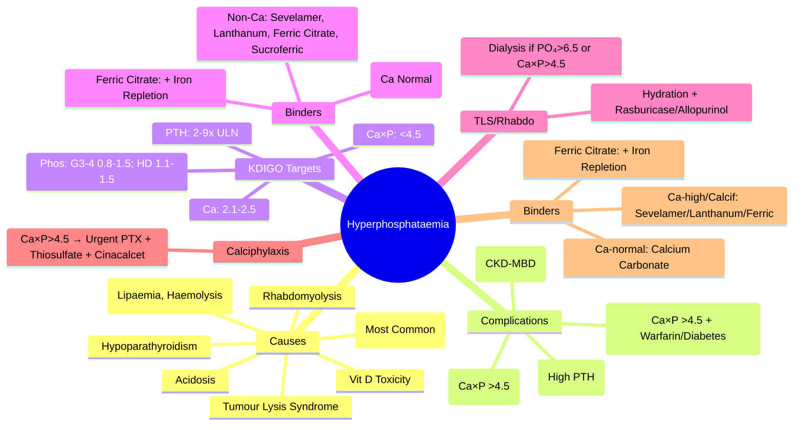

# Hyperphosphataemia

> [!info]
> **Hyperphosphataemia = Serum PO₄ >1.5 mmol/L.** Common in **CKD** (G4-5/Dialysis) and **Tumour Lysis Syndrome**. **Key Complication: Vascular Calcification** (Ca×PO₄ >4.5). **Management: Dietary Restriction → Phosphate Binders → Dialysis.**

---

## 1. Learning Objectives
By the end of this note you should be able to:
- [ ] Recognise causes: CKD, tumour lysis, rhabdomyolysis, rhabdomyolysis, vitamin D excess, pseudo-hyperphosphataemia
- [ ] Apply KDIGO phosphate targets for CKD stages
- [ ] Select and sequence phosphate binders (calcium-based vs non-calcium)
- [ ] Manage acute severe hyperphosphataemia (tumour lysis, rhabdomyolysis)
- [ ] Understand vascular calcification risk (Ca×P product)

---

## 2. Aetiology

### Chronic Kidney Disease (Most Common Cause)
| CKD Stage | Phosphate Target (KDIGO) | Mechanism |
|-----------|--------------------------|-----------|
| **G3a/G3b** (45-59 / 30-44) | 0.8-1.5 mmol/L | Early ↓ Renal Excretion (FGF23 Compensates Initially) |
| **G4** (15-29) | 1.1-1.5 mmol/L | Significant ↓ Excretion; FGF23 Maxed Out |
| **G5/Dialysis** | 1.1-1.5 mmol/L | **No Renal Excretion**; Dependent on Binders + Dialysis Clearance |

### Acute Massive Phosphate Release
| Condition | Mechanism | Key Features |
|-----------|-----------|-------------|
| **Tumour Lysis Syndrome** | Massive Cell Lysis → PO₄/K⁺/Uric Acid Release | **Medical Emergency**; AKI Risk from Ca-P Precipitation |
| **Rhabdomyolysis** | Muscle Lysis → PO₄/K⁺/Mg²⁺/CK/Myoglobin Release | Crush Injury, Compartment Syndrome, Exertional |
| **Acute Kidney Injury** | ↓ GFR → Impaired Excretion | Oliguria, ↑ Creatinine |

### Other Causes
| Cause | Mechanism |
|---------|-----------|
| **Vitamin D Toxicity** / **Excess 1,25-(OH)₂D** | ↑ Intestinal Phosphate Absorption |
| **Hypoparathyroidism** | ↓ PTH → ↓ Renal Phosphate Excretion |
| **Acidosis** (Metabolic/Respiratory) | Phosphate Shift Out of Cells |
| **Lactulose / Phosphate Enemas** | Rectal Absorption |
| **Pseudo-hyperphosphataemia** | Lipaemia, Haemolysis, Hyperproteinaemia (Interference with Colorimetric Assay) |

---

## 2. Pathophysiology & Complications

### CKD-MBD Vicious Cycle
```
CKD → ↓ Phosphate Excretion → ↑ FGF23 → ↓ 1α-Hydroxylase → ↓ 1,25-(OH)₂D
    ↓
↓ Ca²⁺ Absorption → Hypocalcaemia → ↑ PTH (2° HPT)
    ↓
High PTH + High PO₄ → ↑ Bone Resorption + Vascular Calcification
    ↓
Vascular Calcification → ↑ Cardiovascular Mortality
```

### Calcium-Phosphate Product (Ca×P)
| Product | Risk |
|---------|------|
| **<4.5 mmol²/L²** | Low |
| **>4.5 mmol²/L²** | **High Vascular Calcification Risk** |
| **>5.5 mmol²/L²** | **Very High Risk** (Calciphylaxis Risk) |

> **Target**: **Ca×P <4.5 mmol²/L²** (KDIGO)

---

## 2. Clinical Features

| System | Features |
|--------|----------|
| **Asymptomatic** | Most Chronic Cases (Incidental Finding) |
| **Acute Severe** (TLS, Rhabdo) | **Calciphylaxis** (Skin Necrosis), **Acute Kidney Injury** (Ca-P Precipitation in Tubules), **Tetany** (Hypocalcaemia from Precipitation), **Arrhythmias** |
| **Chronic CKD** | **Vascular Calcification** (Valvular, Coronary, Peripheral), **Calciphylaxis** (Skin Necrosis/Ulcers), **Pruritus**, **Renal Osteodystrophy** (Bone Pain, Fractures) |

---

## 2. Investigation

| Test | Normal | Hyperphosphataemia | Purpose |
|------|--------|-------------------|---------|
| **Serum PO₄** | 0.8-1.5 mmol/L | **>1.5** | Confirm Diagnosis |
| **Serum Ca²⁺ (Corrected)** | 2.15-2.55 | **Low** (If PTH High) / Normal | Check for Hypocalcaemia |
| **Serum PTH** | 1.6-6.9 pmol/L | **High** (2° HPT) | Assess Bone Turnover |
| **Serum Ca²⁺ × PO₄** | <4.5 | **>4.5** | Vascular Calcification Risk |
| **Serum Creatinine / eGFR** | Normal | **Elevated** | Assess CKD Stage |
| **Serum ALP** | 30-130 | High (If High Turnover) | Bone Turnover Marker |
| **FGF23** | <100 RU/mL | High (Early CKD) | Early CKD-MBD Marker |

---

## 2. KDIGO Management Algorithm (CKD G3-5D)

```
HYPERPHOSPHATAEMIA IN CKD
         │
         ▼
STEP 1: DIETARY PHOSPHATE RESTRICTION
         │       Target: 800-1000 mg/day (Moderate Protein 0.8 g/kg/d)
         │
         ▼
STEP 2: PHOSPHATE BINDERS (With Meals)
         │
         ├── CALCIUM-BASED (Carbonate 1.5g = 600mg Ca / Acetate 1g = 400mg Ca)
         │       **1st Line if Ca²⁺ Normal/Low** (eGFR ≥30, No Vascular Calcification)
         │       Max Elemental Ca²⁺ 1.5-2g/day (Incl. Dietary)
         │       Watch: Hypercalcaemia, Vascular Calcification
         │
         ├── NON-CALCIUM-BASED
         │       ├── **Sevelamer Carbonate** 800-2400mg TDS (HCl Salt: 2.4g = 800mg)
         │       ├── **Lanthanum Carbonate** 750-2250mg/day (With Food)
         │       ├── **Sucroferric Oxyhydroxide** 500-2500mg/day
         │       └── **Ferric Citrate** 1g TDS (Also Treats Anaemia → ↑ Hb)
         │       **1st Line if Ca²⁺ High / Vascular Calcification / Adynamic Bone**
         │
         └── FERRIC CITRATE (Newer; Dual Benefit: PO₄ Binding + Iron Repletion)
                 Dose: 1g TDS with Meals
         │
         ▼
STEP 3: VITAMIN D ANALOGUES (If PTH >9x ULN Despite Phosphate Control)
         ├── Alfacalcidol (1α-OH D3) 0.25-1µg/d
         ├── Calcitriol 0.25-0.5µg/d
         └── Paricalcitol (Selective VDR) 1-2µg 3x/wk Post-HD
                 **Advantage**: Less Hypercalcaemia/Hyperphosphataemia
         │
         ▼
STEP 4: CALCIMIMETICS (If PTH >9x ULN Despite Above)
         ├── Cinacalcet 30-180mg/d PO (CaSR Agonist)
         │       Effect: ↓ PTH, ↓ Ca²⁺, ↓ PO₄
         │       Risk: Hypocalcaemia (Monitor)
         └── Etelcalcetide 5-15mg 3x/wk IV Post-HD (HD Only)
         │
         ▼
STEP 5: DIALYSIS OPTIMISATION (HD)
         ├── High-Flux Dialyser
         ├── Increased Time/Frequency (Daily/Nocturnal HD)
         └── High Phosphate Dialysate (Rare)
```

---

## 3. Phosphate Binder Selection Algorithm

| Patient Profile | 1st Line Binder | Rationale |
|----------------|----------------|-----------|
| **Ca²⁺ Normal, No Calcification, eGFR ≥30** | **Calcium Carbonate/Acetate** | Cheap, Effective, Provides Ca²⁺ Supplement |
| **Ca²⁺ High (Corrected >2.5)** | **Sevelamer / Lanthanum / Ferric Citrate** | Avoids Calcium Load |
| **Vascular Calcification / CAC Score High** | **Non-Calcium Binder** | Avoids Further Calcium Loading |
| **Adynamic Bone (PTH <2x ULN)** | **Non-Calcium Binder** | Avoids PTH Suppression |
| **Dialysis + Hyperphosphataemia** | **Sevelamer / Lanthanum / Ferric Citrate** | No Calcium Load; Ferric Citrate → Also Treats Anaemia |
| **CKD G4-5 Not on Dialysis** | **Sevelamer / Lanthanum** (If Ca²⁺ High) / **Calcium Carbonate** (If Ca²⁺ Normal) | Individualised |

---

## 3. Acute Severe Hyperphosphataemia (TLS / Rhabdomyolysis)

| Condition | Management |
|-----------|------------|
| **Tumour Lysis Syndrome** | **Hydration 3-4L/day** → **Rasburicase 0.2mg/kg IV** → **Allopurinol** → **Dialysis** (If PO₄ >6.5 or Ca×P >4.5 or AKI) |
| **Rhabdomyolysis** | **Aggressive Hydration** (Target UOP 200-300 mL/h) → **Alkalinisation** (NaHCO₃) → **Dialysis** if PO₄ >6.5 / AKI / Compartment Syndrome |
| **Acute Hyperphosphataemia (Any Cause)** | **Saline Hydration** → **Furosemide** (If UOP Adequate) → **Phosphate Binders** → **Dialysis** (If Severe: PO₄ >6.5, Ca×P >5.5, AKI, Symptomatic) |

---

## 4. Phosphate Binders — Quick Reference

| Binder | Elemental Ca²⁺ | PO₄ Binding Capacity | Key ADVANTAGES | Key DISADVANTAGES |
|--------|----------------|----------------------|----------------|-------------------|
| **Calcium Carbonate** | 600mg/1.5g | ~45 mmol/g | Cheap, Ca²⁺ Supplement | Hypercalcaemia, ↑ Vascular Calcification, Constipation |
| **Calcium Acetate** | 400mg/1g | ~45 mmol/g | Less GI SE, Taken With Meals | Same as Carbonate |
| **Sevelamer Carbonate** | 0 | ~1.5 mmol/g | No Ca²⁺ Load, ↓ LDL | GI SE (Nausea, Constipation), Large Pill Burden |
| **Lanthanum Carbonate** | 0 | High | Chewable, Small Volume | Cost, GI SE, Metallic Taste |
| **Sucroferric Oxyhydroxide** | 0 | Very High | Small Tablet, Chewable | Cost, Dark Stools |
| **Ferric Citrate** | 0 | High | **↑ Hb (Iron Repletion)**, ↓ ESA Dose | GI SE, Cost |

---

## 4. Monitoring Targets (KDIGO)

| Parameter | CKD G3-4 | CKD G5 / Dialysis |
|-----------|----------|-------------------|
| **Phosphate** | 0.8-1.5 mmol/L (q3-6mo) | 1.1-1.5 mmol/L (Monthly) |
| **Calcium (Corrected)** | 2.1-2.5 mmol/L (q3-6mo) | 2.1-2.5 mmol/L (Monthly) |
| **Ca × P Product** | <4.5 mmol²/L² | <4.5 mmol²/L² |
| **PTH** | 2-9x ULN (q3-6mo) | 2-9x ULN (Monthly) |
| **25-OH Vit D** | ≥30 ng/mL (75 nmol/L) | ≥30 ng/mL (q6mo) |
| **Alkaline Phosphatase** | q6-12mo | q3-6mo |

---

## 4. Calciphylaxis (Calcific uraemic arteriolopathy)

| Feature | Management |
|--------|-----------|
| **Diagnosis** | Painful Violaceous Skin Lesions → Necrosis/Ulceration; Biopsy (Medial Calcification) |
| **Risk Factors** | Ca×P >4.5, Obesity, Diabetes, Warfarin, High PTH, High Ca/PO₄ |
| **Emergency** | **Urgent Parathyroidectomy** (If Severe SHPT) + Intensive Wound Care |
| **Medical** | **Sodium Thiosulfate** 25g IV 3x/week (Post-HD); **Cinacalcet** (↓ PTH, Ca, PO₄); **Bisphosphonates** (IV Zoledronic) |
| **Mortality** | **50-80%** |

---

## 4. Exam Pearls (FCPS/MRCP)

| Topic | Key Point |
|-------|-----------|
| **Hyperphosphataemia Definition** | PO₄ >1.5 mmol/L |
| **Most Common Cause** | **CKD** (G4-5/Dialysis) |
| **KDIGO Phosphate Target** | G3-4: 0.8-1.5; Dialysis: 1.1-1.5 mmol/L |
| **Ca×P Product** | **<4.5 mmol²/L²** (Target); >4.5 = Vascular Calcification Risk |
| **Phosphate Binder 1st Line** | Ca²⁺ Normal → **Calcium Carbonate/Acetate**; Ca High → **Sevelamer/Lanthanum** |
| **Non-Ca Binders** | Sevelamer, Lanthanum, Ferric Citrate, Sucroferric Oxyhydroxide |
| **Ferric Citrate** | **Also Treats Anaemia** (Iron Repletion → ↓ ESA Dose) |
| **Cinacalcet** | CaSR Agonist → ↓ PTH, ↓ Ca, ↓ PO₄; **Hypocalcaemia Risk** |
| **Calciphylaxis** | Ca×P >4.5 → **Urgent PTX + Sodium Thiosulfate + Cinacalcet** |
| **TLS Hyperphosphataemia** | Hydration → Rasburicase/Allopurinol → **Dialysis if PO₄ >6.5 or Ca×P >4.5** |
| **Rhabdo Hyperphosphataemia** | Hydration + Alkalinisation → Dialysis if PO₄ >6.5 / AKI |
| **Phosphate Binder Choice** | Ca Normal → Cal Carb/Acetate; Ca High/Calcification → Sevelamer/Lanthanum |
| **Non-Ca Binders** | Sevelamer, Lanthanum, Ferric Citrate, Sucroferric Oxyhydroxide |

---

## 8. Confusions & Mnemonics

| Confusion | Clarification |
|-----------|---------------|
| **Ca vs Non-Ca Binders** | **Ca Normal → Calcium Carbonate**; **Ca High/Calcification → Sevelamer/Lanthanum/Ferric Citrate** |
| **Calciphylaxis** | **Ca×P >4.5** → **Urgent PTX + Thiosulfate + Cinacalcet** |
| **TLS Hyperphosphataemia** | **Dialysis if PO₄ >6.5 or Ca×P >4.5** |
| **Rhabdo Hyperphosphataemia** | Hydration + Alkalinisation → Dialysis if Severe |
| **Cinacalcet SE** | **Hypocalcaemia** (Monitor Ca q1-2wk Initially) |
| **Ferric Citrate** | **Dual Benefit**: Binds PO₄ + Iron Repletion → ↓ ESA Dose |
| **Phosphate Binder Timing** | **With Meals** (Binds Dietary Phosphate) |
| **FGF23** | Early CKD Marker; ↑ FGF23 → ↓ 1,25-(OH)₂D → ↑ PTH |
| **FGF23** | ↑ in Early CKD; Predicts CVD & Progression |
| **Ca×P Target** | **<4.5 mmol²/L²** |

---

## 9. Mind Map



---

## 9. Exam Pearls (FCPS/MRCP)

| Topic | Key Point |
|-------|-----------|
| **Hyperphosphataemia Definition** | PO₄ >1.5 mmol/L |
| **Most Common Cause** | **CKD (G4-5/Dialysis)** |
| **KDIGO Phosphate Target** | G3-4: 0.8-1.5; **Dialysis: 1.1-1.5 mmol/L** |
| **Ca×P Product** | **<4.5 mmol²/L** (Target); >4.5 = Vascular Calcification Risk |
| **Phosphate Binder 1st Line** | Ca²⁺ Normal → **Calcium Carbonate**; Ca²⁺ High → **Sevelamer/Lanthanum** |
| **Non-Ca Binders** | Sevelamer, Lanthanum, Ferric Citrate, Sucroferric Oxyhydroxide |
| **Ferric Citrate** | **Also Treats Anaemia** (Iron Repletion → ↓ ESA Dose) |
| **Cinacalcet** | CaSR Agonist → ↓ PTH, ↓ Ca, ↓ PO₄; **Hypocalcaemia Risk** |
| **Calciphylaxis** | Ca×P >4.5 → **Urgent PTX + Sodium Thiosulfate + Cinacalcet** |
| **TLS Hyperphosphataemia** | Hydration → Rasburicase → **Dialysis if PO₄ >6.5 or Ca×P >4.5** |
| **Rhabdo Hyperphosphataemia** | Hydration + Alkalinisation → Dialysis if PO₄ >6.5 / AKI |
| **Phosphate Binder Choice** | Ca Normal → Calcium Carbonate; Ca High/Vascular Calc → Sevelamer/Lanthanum |
| **Non-Ca Binders** | Sevelamer, Lanthanum, Ferric Citrate, Sucroferric Oxyhydroxide |
| **Phosphate Binder Timing** | **With Meals** (Binds Dietary Phosphate) |
| **FGF23** | Early CKD Marker; ↑ FGF23 → ↓ Vit D → ↑ PTH |
| **Ca×P Target** | **<4.5 mmol²/L²** |

---


---

## One-Page Revision Summary
- Hyperphosphataemia: Key definitions, diagnostic criteria, and management algorithm
- Critical lab cut-offs and severity thresholds
- Stepwise management algorithm
- Key complications and monitoring parameters

---

## 24-Hour Recall Prompts
- Explain Hyperphosphataemia in 2 minutes without looking at the note
- Write the core diagnostic algorithm from memory
- State first-line management and one important contraindication/caution
- Compare Hyperphosphataemia with one close differential diagnosis

---

## 7-Day / 15-Day / 30-Day Revision Tracker
- [ ] Day 1 completed
- [ ] 24-hour recall completed
- [ ] Day 7 revision completed
- [ ] Day 15 revision completed
- [ ] Day 30 revision completed

---

## Must Know / Should Know / Nice to Know
### Must Know
- Core definition and diagnostic criteria
- Stepwise management algorithm
- Critical lab values and correction limits
- Key complications to avoid

### Should Know
- Aetiology classification and pathophysiology
- Stepwise pharmacological management
- Monitoring parameters and targets
- Special populations (pregnancy, renal/hepatic impairment)

### Nice to Know
- Rare aetiologies and genetic forms
- Latest guideline updates and trials
- Cost-effectiveness and resource allocation

---

## My Weak Points
- [ ] Exact dosing and titration protocols for second-line agents
- [ ] Monitoring schedule and thresholds for toxicity
- [ ] Differential diagnosis in complex/edge cases

---

## Self-Test Scorecard
- Understanding: /10
- Recall: /10
- MCQ Performance: /10
- SBA Performance: /10
- Viva Confidence: /10
- Total: /50

> [!tip]
> Interpretation: <35 = weak topic, 35-44 = acceptable but insecure, 45+ = strong exam-ready topic.

---

## Exam Answer Modes
### Long Answer Skeleton
1. Definition, classification, and pathophysiology
2. Diagnostic criteria and algorithm
3. Management: stepwise approach with doses
4. Complications, monitoring, and special situations

### Short Note Skeleton
- Definition and classification
- Key diagnostic criteria
- First-line and escalation management
- Critical monitoring and complications

### Viva One-Liners
- Hyperphosphataemia definition and key threshold
- Diagnostic algorithm in 3 steps
- First-line management and escalation
- Critical monitoring parameter
- One complication to never miss

### Ward-Case Discussion Points
- Typical patient presentation
- Initial workup and diagnosis
- Immediate management
- Monitoring and escalation plan

### Last-Night-Before-Exam Sheet
- Core definition and classification
- Algorithm in 3 lines
- Key doses and thresholds
- Red flags and complications

---

## Summary
Hyperphosphataemia: Core definitions, stepwise diagnosis, algorithmic management, critical thresholds, monitoring, red flags.

---

## MCQs (10)
1. **Hyperphosphataemia definition:**
   A. Phos>1.3
   B. Phos>1.5
   C. Phos>1.8
   D. Phos>2.0
   *Answer: B*

2. **Most common cause:**
   A. Tumour lysis
   B. CKD
   C. Rhabdo
   D. Hypoparathyroidism
   *Answer: B*

3. **CKD hyperphosphataemia:**
   A. Binders only
   B. Diet + Binders + Vit D analogues
   C. Dialysis only
   D. Parathyroidectomy
   *Answer: B*

4. **Phosphate binders:**
   A. Calcium carbonate
   B. Sevelamer
   C. Lanthanum
   D. All
   *Answer: D*

5. **Tumour lysis hyperphosphataemia:**
   A. IV hydration
   B. Rasburicase
   C. Phosphate binders
   D. All
   *Answer: D*

6. **Calcification risk:**
   A. Ca×Phos product >4.4
   B. >5.5
   C. >6.0
   D. >3.5
   *Answer: A*

7. **Vit D in CKD:**
   A. Cholecalciferol
   B. Alfacalcidol/Calcitriol
   C. Ergocalciferol
   D. None
   *Answer: B*

8. **Cinacalcet:**
   A. Vit D analogue
   B. Calcimimetic (CaSR agonist)
   C. Phosphate binder
   D. PTH analogue
   *Answer: B*

9. **Dialysis phosphate removal:**
   A. 500-1000mg/session
   B. 200-400mg/session
   C. 1000-2000mg/session
   D. 50mg/session
   *Answer: A*

10. **Hyperphosphataemia hypocalcaemia:**
   A. Ca deposition
   B. PTH suppression
   C. Vit D inhibition
   D. All
   *Answer: A*


---

## SBA Questions (5)
1. **Clinical scenario-based question on Hyperphosphataemia:** What is the most appropriate next step in management?
   A. Option A
   B. Option B
   C. Option C
   D. Option D
   *Answer: A*

2. **Diagnostic challenge in Hyperphosphataemia:** Which test/investigation is most appropriate?
   A. Option A
   B. Option B
   C. Option C
   D. Option D
   *Answer: A*

3. **Management decision in Hyperphosphataemia:** When would you consider escalation?
   A. Option A
   B. Option B
   C. Option C
   D. Option D
   *Answer: A*

4. **Complication recognition in Hyperphosphataemia:** What is the most likely complication?
   A. Option A
   B. Option B
   C. Option C
   D. Option D
   *Answer: A*

5. **Monitoring question for Hyperphosphataemia:** Which parameter requires most frequent monitoring?
   A. Option A
   B. Option B
   C. Option C
   D. Option D
   *Answer: A*

---

## Flashcards
- Q: Hyperphosphataemia definition:
  A: Phos>1.5
- Q: Most common cause:
  A: CKD
- Q: CKD hyperphosphataemia:
  A: Diet + Binders + Vit D analogues
- Q: Phosphate binders:
  A: All
- Q: Tumour lysis hyperphosphataemia:
  A: All


---

## Answer Key with Explanations
### MCQs
B, B, B, D, D, A, B, B, A, A

### SBAs
1-A, 2-A, 3-A, 4-A, 5-A
